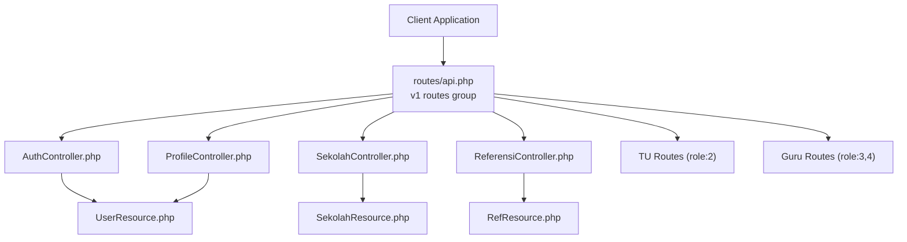
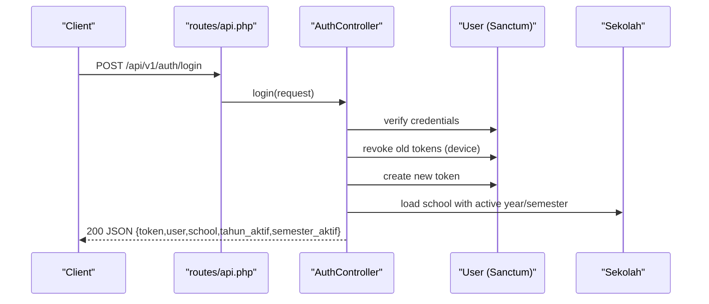
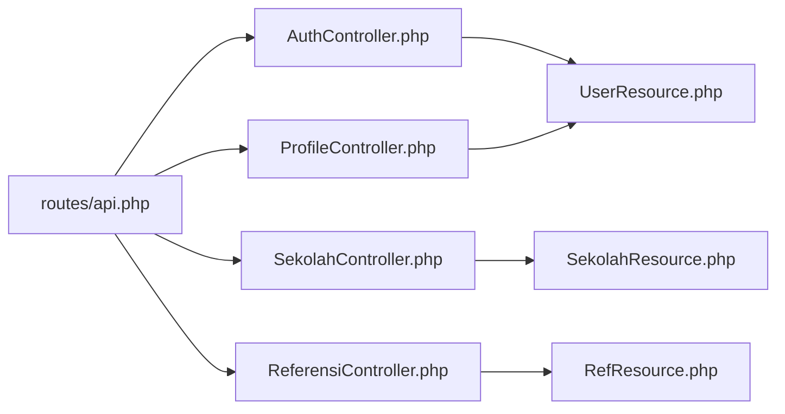

# API Documentation

<cite>
**Referenced Files in This Document**
- [routes/api.php](file://routes/api.php)
- [AuthController.php](file://app/Http/Controllers/Api/V1/AuthController.php)
- [ProfileController.php](file://app/Http/Controllers/Api/V1/ProfileController.php)
- [SekolahController.php](file://app/Http/Controllers/Api/V1/SekolahController.php)
- [ReferensiController.php](file://app/Http/Controllers/Api/V1/ReferensiController.php)
- [UserResource.php](file://app/Http/Resources/V1/UserResource.php)
- [SiswaResource.php](file://app/Http/Resources/V1/SiswaResource.php)
- [KelasResource.php](file://app/Http/Resources/V1/KelasResource.php)
- [MapelResource.php](file://app/Http/Resources/V1/MapelResource.php)
</cite>

## Table of Contents
1. [Introduction](#introduction)
2. [Project Structure](#project-structure)
3. [Core Components](#core-components)
4. [Architecture Overview](#architecture-overview)
5. [Detailed Component Analysis](#detailed-component-analysis)
6. [Dependency Analysis](#dependency-analysis)
7. [Performance Considerations](#performance-considerations)
8. [Troubleshooting Guide](#troubleshooting-guide)
9. [Conclusion](#conclusion)
10. [Appendices](#appendices)

## Introduction
This document describes the RESTful API for RaporKM Laravel, focusing on the single supported API version (v1). It covers authentication endpoints, protected routes, role-based access controls, request validation rules, response schemas, and practical usage examples. It also documents rate limiting, API versioning, and integration guidelines for clients.

## Project Structure
The API surface is primarily defined in the routes file grouped under the v1 namespace. Authentication uses Laravel Sanctum personal access tokens. Role-based middleware restricts access to TU (administrative) and Guru (teaching staff) panels. Resource classes normalize model responses consistently across endpoints.

**Diagram sources**
- [routes/api.php:65-271](file://routes/api.php#L65-L271)
- [AuthController.php:15-131](file://app/Http/Controllers/Api/V1/AuthController.php#L15-L131)
- [ProfileController.php:10-61](file://app/Http/Controllers/Api/V1/ProfileController.php#L10-L61)
- [SekolahController.php:10-34](file://app/Http/Controllers/Api/V1/SekolahController.php#L10-L34)
- [ReferensiController.php:35-125](file://app/Http/Controllers/Api/V1/ReferensiController.php#L35-L125)
- [UserResource.php:8-26](file://app/Http/Resources/V1/UserResource.php#L8-L26)

**Section sources**
- [routes/api.php:1-277](file://routes/api.php#L1-L277)

## Core Components
- Authentication: Login, logout, current user info, FCM registration/unregistration.
- Profile: Update profile and change password.
- School: Retrieve school profile and public school info.
- References: Fetch reference lists and hierarchical dimension-element data.
- Role-based Panels: TU and Guru endpoints for managing academic entities and reports.

**Section sources**
- [routes/api.php:65-271](file://routes/api.php#L65-L271)
- [AuthController.php:15-131](file://app/Http/Controllers/Api/V1/AuthController.php#L15-L131)
- [ProfileController.php:10-61](file://app/Http/Controllers/Api/V1/ProfileController.php#L10-L61)
- [SekolahController.php:10-34](file://app/Http/Controllers/Api/V1/SekolahController.php#L10-L34)
- [ReferensiController.php:35-125](file://app/Http/Controllers/Api/V1/ReferensiController.php#L35-L125)

## Architecture Overview
The API follows a layered structure:
- Routing layer defines endpoints and applies middleware (auth, throttle, role).
- Controller layer handles requests, validates input, orchestrates services, and returns JSON responses.
- Resource layer normalizes output for consistent schemas.
- Model layer persists and retrieves data.

**Diagram sources**
- [routes/api.php:65-76](file://routes/api.php#L65-L76)
- [AuthController.php:17-68](file://app/Http/Controllers/Api/V1/AuthController.php#L17-L68)
- [UserResource.php:8-26](file://app/Http/Resources/V1/UserResource.php#L8-L26)

## Detailed Component Analysis

### Authentication Endpoints
- Base Path: /api/v1
- Versioning: v1 via route prefix
- Authentication: Bearer token via Sanctum personal access tokens
- Rate Limiting: Login throttled; general protected routes rate-limited

Endpoints
- POST /auth/login
  - Purpose: Obtain a new personal access token
  - Headers: Accept: application/json
  - Body:
    - username: string, required
    - password: string, required
    - device_name: string, optional (default applied if omitted)
  - Responses:
    - 200: success=true, message, data.token, data.user, data.sekolah, data.tahun_aktif, data.semester_aktif
    - 422: validation errors
    - 401: unauthorized (invalid credentials)
  - Notes: Existing device-specific token is revoked before issuing a new one

- POST /auth/logout
  - Purpose: Invalidate current token
  - Authentication: Required
  - Responses: 200 success=true, message

- GET /auth/me
  - Purpose: Retrieve current user profile and active school context
  - Authentication: Required
  - Responses: 200 with user and school data

- POST /auth/fcm
  - Purpose: Register FCM token for push notifications
  - Authentication: Required
  - Body: fcm_token (string), device_id (optional)
  - Responses: 200 success

- DELETE /auth/fcm
  - Purpose: Unregister FCM token
  - Authentication: Required
  - Responses: 200 success

Security and Token Management
- Tokens are scoped per device using the token name derived from device_name.
- Logout deletes the current token.
- Protected routes apply a global rate limit.

**Section sources**
- [routes/api.php:65-76](file://routes/api.php#L65-L76)
- [AuthController.php:17-131](file://app/Http/Controllers/Api/V1/AuthController.php#L17-L131)

### Profile Endpoints
- PUT /profile
  - Purpose: Update profile fields
  - Authentication: Required
  - Validation:
    - nama: string, max 255 (optional)
    - email: email, unique per user, max 255 (optional)
    - kontak: string, max 255 (nullable)
    - moto: string, max 500 (nullable)
  - Responses: 200 with updated profile fields

- PUT /profile/password
  - Purpose: Change password
  - Authentication: Required
  - Validation:
    - current_password: required
    - new_password: required, min 6, confirmed
  - Responses:
    - 200: success with message
    - 422: current password mismatch

**Section sources**
- [routes/api.php:78-80](file://routes/api.php#L78-L80)
- [ProfileController.php:12-61](file://app/Http/Controllers/Api/V1/ProfileController.php#L12-L61)

### School Endpoints
- GET /sekolah
  - Purpose: Retrieve school profile with active year/semester
  - Authentication: Required
  - Responses: 200 with school data

- GET /sekolah/publik
  - Purpose: Public school info (no auth)
  - Responses: 200 with school name and logo URL

**Section sources**
- [routes/api.php:83-89](file://routes/api.php#L83-L89)
- [SekolahController.php:12-34](file://app/Http/Controllers/Api/V1/SekolahController.php#L12-L34)

### Reference Endpoints
- GET /referensi
  - Purpose: List available reference categories
  - Authentication: Required
  - Responses: 200 with array of slugs

- GET /referensi/{slug}
  - Purpose: Retrieve reference list by category
  - Authentication: Required
  - Path Params:
    - slug: one of predefined categories
  - Sorting: Some categories sorted ascending; others descending or by specific field
  - Responses: 200 with collection of normalized reference items

- GET /referensi/dimensi-elemen
  - Purpose: Hierarchical dimension-element-subelement data
  - Authentication: Required
  - Responses: 200 with nested relations

Supported slugs include: agama, jenis-kelamin, hubungan-keluarga, jabatan, kepegawaian, pendidikan, tugas-tambahan, jenis-siswa, jenis-keluar, kurikulum, jenis-absen, kelompok-mapel, tingkat, kompetensi, tahun-pelajaran, semester, bulan, hari, dimensi, dimensi-kokurikuler, elemen, eskul, mapel, deskripsi-rapor, sub-elemen.

**Section sources**
- [routes/api.php:85-89](file://routes/api.php#L85-L89)
- [ReferensiController.php:79-125](file://app/Http/Controllers/Api/V1/ReferensiController.php#L79-L125)

### Role-Based Endpoints

#### TU (Administrative) Panel (role:2)
Protected under /api/v1/tu with role middleware.

- Dashboard
  - GET /tu/dashboard

- Pegawai
  - GET /tu/pegawai
  - GET /tu/pegawai/{id}
  - POST /tu/pegawai
  - PUT /tu/pegawai/{id}
  - DELETE /tu/pegawai/{id}

- Siswa
  - GET /tu/siswa
  - GET /tu/siswa/{id}
  - POST /tu/siswa
  - PUT /tu/siswa/{id}
  - DELETE /tu/siswa/{id}

- Kelas
  - GET /tu/kelas
  - GET /tu/kelas/{id}
  - POST /tu/kelas
  - PUT /tu/kelas/{id}
  - DELETE /tu/kelas/{id}

- Anggota Kelas
  - GET /tu/anggota-kelas
  - POST /tu/anggota-kelas
  - DELETE /tu/anggota-kelas/{id}

- Mata Pelajaran
  - GET /tu/mapel
  - GET /tu/mapel/{id}
  - POST /tu/mapel
  - PUT /tu/mapel/{id}
  - DELETE /tu/mapel/{id}

- Mata Pelajaran per Kelas
  - GET /tu/mapel-kelas
  - POST /tu/mapel-kelas
  - PUT /tu/mapel-kelas/{id}
  - DELETE /tu/mapel-kelas/{id}
  - POST /tu/mapel-kelas/batch

- Kelas Wali
  - GET /tu/kelas-wali
  - POST /tu/kelas-wali
  - DELETE /tu/kelas-wali/{id}

- P5BK
  - GET /tu/p5bk
  - POST /tu/p5bk
  - PUT /tu/p5bk/{id}
  - DELETE /tu/p5bk/{id}
  - GET /tu/p5bk/proyek-kelas

- P5BK Dimensi
  - GET /tu/p5bk/dimensi
  - POST /tu/p5bk/dimensi
  - PUT /tu/p5bk/dimensi/{id}
  - DELETE /tu/p5bk/dimensi/{id}

- P5BK Elemen
  - GET /tu/p5bk/elemen
  - POST /tu/p5bk/elemen
  - PUT /tu/p5bk/elemen/{id}
  - DELETE /tu/p5bk/elemen/{id}

- P5BK Sub-Elemen
  - GET /tu/p5bk/sub-elemen
  - POST /tu/p5bk/sub-elemen
  - PUT /tu/p5bk/sub-elemen/{id}
  - DELETE /tu/p5bk/sub-elemen/{id}

- Ekstrakurikuler
  - GET /tu/ekstra
  - POST /tu/ekstra
  - PUT /tu/ekstra/{id}
  - DELETE /tu/ekstra/{id}
  - POST /tu/ekstra/pembina
  - DELETE /tu/ekstra/pembina/{id}

- Praktik Kerja Lapangan (PKL)
  - GET /tu/prakerin
  - POST /tu/prakerin
  - PUT /tu/prakerin/{id}
  - DELETE /tu/prakerin/{id}
  - GET /tu/prakerin/peserta
  - POST /tu/prakerin/peserta
  - DELETE /tu/prakerin/peserta/{id}

- Rekap Presensi
  - GET /tu/rekap-presensi
  - GET /tu/rekap-presensi/detail

- Absensi Guru & TU
  - GET /tu/absensi/rekap
  - GET /tu/absensi/rekap-harian
  - GET /tu/absensi/ringkasan

- Pengaturan
  - GET /tu/pengaturan
  - PUT /tu/pengaturan
  - GET /tu/pengaturan/tahun-pelajaran
  - GET /tu/pengaturan/semester

- Cetak Rapor
  - GET /tu/cetak-rapor
  - POST /tu/cetak-rapor

- Push Notifications (TU)
  - POST /tu/pwa/push/send

Note: Many endpoints follow standard CRUD patterns with GET (index/show), POST (create), PUT (update), DELETE semantics. Batch operations and specialized endpoints are noted where applicable.

**Section sources**
- [routes/api.php:90-210](file://routes/api.php#L90-L210)

#### Guru Panel (role:3,4)
Protected under /api/v1/guru with role middleware.

- Dashboard
  - GET /guru/dashboard

- Kelas Ku
  - GET /guru/kelas-ku
  - GET /guru/kelas-ku/{id}/siswa

- Penilaian
  - GET /guru/penilaian
  - POST /guru/penilaian/formatif
  - POST /guru/penilaian/sumatif-ph
  - POST /guru/penilaian/sumatif-as
  - POST /guru/penilaian/sumatif-ts

- Tujuan Pembelajaran
  - GET /guru/tujuan-pembelajaran
  - POST /guru/tujuan-pembelajaran
  - PUT /guru/tujuan-pembelajaran/{id}
  - DELETE /guru/tujuan-pembelajaran/{id}

- Catatan Rapor
  - GET /guru/catatan-rapor
  - POST /guru/catatan-rapor

- Presensi
  - GET /guru/presensi
  - POST /guru/presensi
  - GET /guru/presensi/rekap

- Absensi GPS
  - POST /guru/absensi/check-in
  - POST /guru/absensi/check-out
  - GET /guru/absensi/status-hari-ini
  - GET /guru/absensi/riwayat

- Kokurikuler
  - GET /guru/kokurikuler
  - POST /guru/kokurikuler

- P5BK
  - GET /guru/p5bk
  - GET /guru/p5bk/penilaian
  - POST /guru/p5bk/penilaian

- Ekstrakurikuler
  - GET /guru/ekstra
  - GET /guru/ekstra/{id}/siswa
  - POST /guru/ekstra/penilaian

- Nilai Praktik Kerja Lapangan
  - GET /guru/nilai-prakerin
  - POST /guru/nilai-prakerin

- Cetak Rapor
  - GET /guru/cetak-rapor
  - GET /guru/cetak-rapor/{id}/siswa
  - POST /guru/cetak-rapor

**Section sources**
- [routes/api.php:211-270](file://routes/api.php#L211-L270)

### Request Validation Rules
Common validations observed across controllers:
- String fields: required/sometimes, max length constraints
- Email uniqueness against current user ID
- Password confirmation for new passwords
- Device name/token length limits
- Numeric IDs for resource endpoints

Examples by endpoint:
- Auth login: username (required), password (required), device_name (optional)
- FCM registration: fcm_token (required, max 500), device_id (optional)
- Profile update: nama/email/kontak/moto with appropriate constraints
- Password change: current_password (required), new_password (required, min 6, confirmed)

**Section sources**
- [AuthController.php:19-44](file://app/Http/Controllers/Api/V1/AuthController.php#L19-L44)
- [ProfileController.php:16-54](file://app/Http/Controllers/Api/V1/ProfileController.php#L16-L54)

### Response Formats
Standardized envelope:
- success: boolean
- message: string (present on some operations)
- data: varies by endpoint

Resource classes:
- UserResource: id, nama, username, email, jabatan, jabatan_label, foto_url, kontak, ptk
- SiswaResource: comprehensive student attributes including nis/nisn, birth info, address, status, jurusan, kelas_aktif, parents, timestamps
- KelasResource: class metadata, related tingkat/kompetensi, tahun_pelajaran/semester, counts, timestamps
- MapelResource: subject metadata, grouping, ordering, timestamps

School endpoints return normalized school data via SekolahResource.

**Section sources**
- [UserResource.php:10-25](file://app/Http/Resources/V1/UserResource.php#L10-L25)
- [SiswaResource.php:10-46](file://app/Http/Resources/V1/SiswaResource.php#L10-L46)
- [KelasResource.php:10-42](file://app/Http/Resources/V1/KelasResource.php#L10-L42)
- [MapelResource.php:10-32](file://app/Http/Resources/V1/MapelResource.php#L10-L32)
- [SekolahController.php:12-34](file://app/Http/Controllers/Api/V1/SekolahController.php#L12-L34)

### Examples

#### Login and Token Usage
- Step 1: POST /api/v1/auth/login with username and password
- Step 2: Store returned token
- Step 3: Include Authorization: Bearer {token} for subsequent protected requests

#### Change Password
- PUT /api/v1/profile/password with current_password and new_password (confirmed)

#### Fetch Academic References
- GET /api/v1/referensi to list categories
- GET /api/v1/referensi/semester to retrieve semester list

#### Manage Students (TU)
- GET /api/v1/tu/siswa
- POST /api/v1/tu/siswa with student fields
- PUT /api/v1/tu/siswa/{id} to update
- DELETE /api/v1/tu/siswa/{id} to remove

#### Enroll Student in Class (TU)
- POST /api/v1/tu/anggota-kelas with class and student identifiers

#### Enter Grades (Guru)
- POST /api/v1/guru/penilaian/formatif with assessment data
- POST /api/v1/guru/penilaian/sumatif-ph/as/ts as needed

#### Generate Report (TU)
- POST /api/v1/tu/cetak-rapor to process report generation

**Section sources**
- [routes/api.php:65-271](file://routes/api.php#L65-L271)
- [ProfileController.php:38-61](file://app/Http/Controllers/Api/V1/ProfileController.php#L38-L61)
- [ReferensiController.php:79-125](file://app/Http/Controllers/Api/V1/ReferensiController.php#L79-L125)
- [SiswaResource.php:10-46](file://app/Http/Resources/V1/SiswaResource.php#L10-L46)

## Dependency Analysis
- Routing depends on controllers and middleware (auth:sanctum, role, throttle).
- Controllers depend on models and resources for data shaping.
- Resources depend on related model relationships.

**Diagram sources**
- [routes/api.php:65-271](file://routes/api.php#L65-L271)
- [AuthController.php:15-131](file://app/Http/Controllers/Api/V1/AuthController.php#L15-L131)
- [ProfileController.php:10-61](file://app/Http/Controllers/Api/V1/ProfileController.php#L10-L61)
- [SekolahController.php:10-34](file://app/Http/Controllers/Api/V1/SekolahController.php#L10-L34)
- [ReferensiController.php:35-125](file://app/Http/Controllers/Api/V1/ReferensiController.php#L35-L125)
- [UserResource.php:8-26](file://app/Http/Resources/V1/UserResource.php#L8-L26)

**Section sources**
- [routes/api.php:65-271](file://routes/api.php#L65-L271)

## Performance Considerations
- Throttling:
  - Login: throttle:5,1 (max 5 attempts per minute)
  - Protected routes: throttle:60,1 (max 60 requests per minute)
- Relationship loading:
  - Controllers eager-load related data (e.g., school with tahun_pelajaran/semester) to reduce N+1 queries.
- Resource normalization:
  - Using dedicated resources ensures consistent payload sizes and avoids exposing unnecessary model internals.

[No sources needed since this section provides general guidance]

## Troubleshooting Guide
Common issues and resolutions:
- 401 Unauthorized on protected endpoints:
  - Cause: Missing or invalid Bearer token
  - Resolution: Authenticate via /api/v1/auth/login and retry with returned token
- 403 Forbidden:
  - Cause: Insufficient role (TU vs Guru)
  - Resolution: Use correct panel endpoints (/tu vs /guru)
- 429 Too Many Requests:
  - Cause: Exceeded throttle limits
  - Resolution: Wait for the throttle window to reset
- Validation errors (422):
  - Cause: Missing or invalid fields
  - Resolution: Review validation rules for the endpoint and adjust payload accordingly
- Token conflicts:
  - Cause: Multiple devices sharing the same device_name
  - Resolution: Provide distinct device_name during login; server revokes previous tokens for that device

**Section sources**
- [routes/api.php:65-76](file://routes/api.php#L65-L76)
- [AuthController.php:19-44](file://app/Http/Controllers/Api/V1/AuthController.php#L19-L44)

## Conclusion
RaporKM’s API provides a clear, versioned interface for authentication, profile management, academic reference data, and role-specific administrative and teaching workflows. By adhering to the documented endpoints, validation rules, and response schemas, clients can integrate reliably with token-based authentication, role-based access, and standardized resource representations.

[No sources needed since this section summarizes without analyzing specific files]

## Appendices

### API Versioning and Backward Compatibility
- Version: v1 via route prefix /api/v1
- Backward compatibility: No legacy endpoints are exposed in the documented routes; future breaking changes should introduce a new version prefix

**Section sources**
- [routes/api.php:65-65](file://routes/api.php#L65-L65)

### Rate Limiting Summary
- Login: 5 requests per minute
- Protected routes: 60 requests per minute

**Section sources**
- [routes/api.php:68-72](file://routes/api.php#L68-L72)

### Client Implementation Guidelines
- Authentication:
  - Store the returned plaintext token securely
  - Attach Authorization: Bearer {token} header to protected requests
- Pagination and Filtering:
  - Use index endpoints as documented; no pagination/filter parameters are defined in the routes shown
- Error Handling:
  - Parse the standardized JSON envelope (success, message, data)
  - Handle 401/403/422/429 appropriately
- SDK Usage:
  - Wrap endpoints in typed client methods mirroring the documented schemas
- Integration Patterns:
  - Use referensi endpoints to bootstrap local reference caches
  - Poll or subscribe to push notification endpoints (TU) after successful registration

[No sources needed since this section provides general guidance]