# Academic APIs

<cite>
**Referenced Files in This Document**
- [api.php](file://routes/api.php)
- [SekolahApiTest.php](file://tests/Feature/Api/V1/SekolahApiTest.php)
- [KelasApiTest.php](file://tests/Feature/Api/V1/KelasApiTest.php)
- [GuruKelasKuTest.php](file://tests/Feature/Api/V1/GuruKelasKuTest.php)
- [TuDashboardTest.php](file://tests/Feature/Api/V1/TuDashboardTest.php)
- [P5bkApiTest.php](file://tests/Feature/Api/V1/P5bkApiTest.php)
- [NilaiService.php](file://app/Services/NilaiService.php)
- [RaporService.php](file://app/Services/RaporService.php)
- [ExportService.php](file://app/Services/ExportService.php)
- [DapodikService.php](file://app/Services/DapodikService.php)
- [PegawaiService.php](file://app/Services/PegawaiService.php)
- [PenilaianService.php](file://app/Services/PenilaianService.php)
- [GuruMenuService.php](file://app/Services/GuruMenuService.php)
- [Kelas.php](file://app/Models/Kelas.php)
- [Siswa.php](file://app/Models/Siswa.php)
- [Presensi.php](file://app/Models/Presensi.php)
- [NilaiMapel.php](file://app/Models/NilaiMapel.php)
- [NilaiKokurikuler.php](file://app/Models/NilaiKokurikuler.php)
- [NilaiPrakerin.php](file://app/Models/NilaiPrakerin.php)
- [DeskripsiRapor.php](file://app/Models/DeskripsiRapor.php)
- [Ekskul.php](file://app/Models/Ekskul.php)
- [Prakerin.php](file://app/Models/Prakerin.php)
- [PembagianRaport.php](file://app/Models/PembagianRaport.php)
- [TahunPelajaran.php](file://app/Models/TahunPelajaran.php)
- [Semester.php](file://app/Models/Semester.php)
- [User.php](file://app/Models/User.php)
- [KelasResource.php](file://app/Http/Resources/V1/KelasResource.php)
- [SiswaResource.php](file://app/Http/Resources/V1/SiswaResource.php)
- [PegawaiResource.php](file://app/Http/Resources/V1/PegawaiResource.php)
- [PtkResource.php](file://app/Http/Resources/V1/PtkResource.php)
- [MapelResource.php](file://app/Http/Resources/V1/MapelResource.php)
- [SekolahResource.php](file://app/Http/Resources/V1/SekolahResource.php)
- [UserResource.php](file://app/Http/Resources/V1/UserResource.php)
- [RefResource.php](file://app/Http/Resources/V1/RefResource.php)
- [EnsureRole.php](file://app/Http/Middleware/EnsureRole.php)
- [PRD-rapor-migrasi.md](file://PRD-rapor-migrasi.md)
</cite>

## Table of Contents
1. [Introduction](#introduction)
2. [Project Structure](#project-structure)
3. [Core Components](#core-components)
4. [Architecture Overview](#architecture-overview)
5. [Detailed Component Analysis](#detailed-component-analysis)
6. [Dependency Analysis](#dependency-analysis)
7. [Performance Considerations](#performance-considerations)
8. [Troubleshooting Guide](#troubleshooting-guide)
9. [Conclusion](#conclusion)
10. [Appendices](#appendices)

## Introduction
This document provides comprehensive API documentation for academic management endpoints focused on grade recording, attendance tracking, extracurricular activities, and report generation. It covers teacher-specific APIs for grade entry, student assessment, and class management, as well as administrative APIs for internship management, student projects, and academic supervision. The specification includes assessment criteria, grading scales, evaluation methods, real-time updates, progress tracking, and batch operations. Examples of complex academic workflows, grade calculations, and report generation processes are included, along with data validation and regulatory compliance considerations.

## Project Structure
The API surface is organized under the routes/api.php entry point and leverages Laravel controllers grouped by role (TU, Guru, Api). Functional capabilities are implemented via domain services (e.g., NilaiService, RaporService, ExportService) and resource transformers for consistent JSON responses. Authentication requires bearer tokens, and role-based middleware enforces access control.

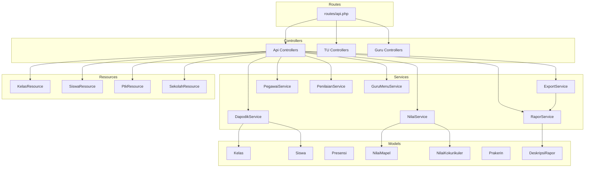

**Diagram sources**
- [api.php](file://routes/api.php)
- [NilaiService.php](file://app/Services/NilaiService.php)
- [RaporService.php](file://app/Services/RaporService.php)
- [ExportService.php](file://app/Services/ExportService.php)
- [DapodikService.php](file://app/Services/DapodikService.php)
- [PegawaiService.php](file://app/Services/PegawaiService.php)
- [PenilaianService.php](file://app/Services/PenilaianService.php)
- [GuruMenuService.php](file://app/Services/GuruMenuService.php)
- [Kelas.php](file://app/Models/Kelas.php)
- [Siswa.php](file://app/Models/Siswa.php)
- [Presensi.php](file://app/Models/Presensi.php)
- [NilaiMapel.php](file://app/Models/NilaiMapel.php)
- [NilaiKokurikuler.php](file://app/Models/NilaiKokurikuler.php)
- [Prakerin.php](file://app/Models/Prakerin.php)
- [DeskripsiRapor.php](file://app/Models/DeskripsiRapor.php)
- [KelasResource.php](file://app/Http/Resources/V1/KelasResource.php)
- [SiswaResource.php](file://app/Http/Resources/V1/SiswaResource.php)
- [PtkResource.php](file://app/Http/Resources/V1/PtkResource.php)
- [SekolahResource.php](file://app/Http/Resources/V1/SekolahResource.php)

**Section sources**
- [api.php](file://routes/api.php)
- [PRD-rapor-migrasi.md](file://PRD-rapor-migrasi.md)

## Core Components
- Authentication and Authorization
  - All API endpoints require a bearer token set in the Authorization header.
  - Role-based access control ensures endpoints are only accessible to authorized roles (TU, Guru).
- Resource Transformation
  - Responses are standardized using resource classes (e.g., SekolahResource, KelasResource, SiswaResource, PtkResource) to present consistent JSON structures.
- Domain Services
  - Centralized business logic for academic operations:
    - Grading and assessments: NilaiService, PenilaianService
    - Reports and exports: RaporService, ExportService
    - Data synchronization: DapodikService
    - Staff and user management: PegawaiService
    - Teacher menu and permissions: GuruMenuService

Key capabilities:
- Academic year and semester context are maintained via TahunPelajaran and Semester models.
- Class and student enrollment are managed through Kelas, Siswa, and related pivot tables/models.
- Attendance tracking integrates with Presensi model.
- Extracurricular activities and co-curricular assessments integrate with Eskul and NilaiKokurikuler models.
- Internship management integrates with Prakerin and related models.

**Section sources**
- [SekolahApiTest.php](file://tests/Feature/Api/V1/SekolahApiTest.php)
- [KelasApiTest.php](file://tests/Feature/Api/V1/KelasApiTest.php)
- [GuruKelasKuTest.php](file://tests/Feature/Api/V1/GuruKelasKuTest.php)
- [TuDashboardTest.php](file://tests/Feature/Api/V1/TuDashboardTest.php)
- [NilaiService.php](file://app/Services/NilaiService.php)
- [RaporService.php](file://app/Services/RaporService.php)
- [ExportService.php](file://app/Services/ExportService.php)
- [DapodikService.php](file://app/Services/DapodikService.php)
- [PegawaiService.php](file://app/Services/PegawaiService.php)
- [PenilaianService.php](file://app/Services/PenilaianService.php)
- [GuruMenuService.php](file://app/Services/GuruMenuService.php)
- [Kelas.php](file://app/Models/Kelas.php)
- [Siswa.php](file://app/Models/Siswa.php)
- [Presensi.php](file://app/Models/Presensi.php)
- [NilaiMapel.php](file://app/Models/NilaiMapel.php)
- [NilaiKokurikuler.php](file://app/Models/NilaiKokurikuler.php)
- [Prakerin.php](file://app/Models/Prakerin.php)
- [DeskripsiRapor.php](file://app/Models/DeskripsiRapor.php)
- [TahunPelajaran.php](file://app/Models/TahunPelajaran.php)
- [Semester.php](file://app/Models/Semester.php)
- [SekolahResource.php](file://app/Http/Resources/V1/SekolahResource.php)
- [KelasResource.php](file://app/Http/Resources/V1/KelasResource.php)
- [SiswaResource.php](file://app/Http/Resources/V1/SiswaResource.php)
- [PtkResource.php](file://app/Http/Resources/V1/PtkResource.php)

## Architecture Overview
The API follows a layered architecture:
- Routes define endpoint namespaces and HTTP verbs.
- Controllers orchestrate requests, enforce roles, and delegate to services.
- Services encapsulate domain logic for grading, reporting, exports, and synchronization.
- Models represent academic entities and relationships.
- Resources transform models into standardized JSON responses.

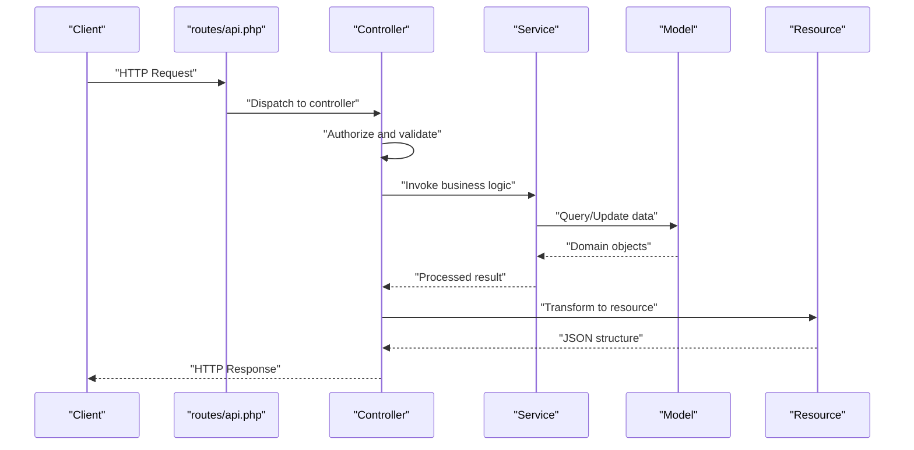

**Diagram sources**
- [api.php](file://routes/api.php)
- [NilaiService.php](file://app/Services/NilaiService.php)
- [RaporService.php](file://app/Services/RaporService.php)
- [ExportService.php](file://app/Services/ExportService.php)
- [DapodikService.php](file://app/Services/DapodikService.php)
- [PegawaiService.php](file://app/Services/PegawaiService.php)
- [PenilaianService.php](file://app/Services/PenilaianService.php)
- [GuruMenuService.php](file://app/Services/GuruMenuService.php)
- [Kelas.php](file://app/Models/Kelas.php)
- [Siswa.php](file://app/Models/Siswa.php)
- [Presensi.php](file://app/Models/Presensi.php)
- [NilaiMapel.php](file://app/Models/NilaiMapel.php)
- [NilaiKokurikuler.php](file://app/Models/NilaiKokurikuler.php)
- [Prakerin.php](file://app/Models/Prakerin.php)
- [DeskripsiRapor.php](file://app/Models/DeskripsiRapor.php)
- [SekolahResource.php](file://app/Http/Resources/V1/SekolahResource.php)
- [KelasResource.php](file://app/Http/Resources/V1/KelasResource.php)
- [SiswaResource.php](file://app/Http/Resources/V1/SiswaResource.php)
- [PtkResource.php](file://app/Http/Resources/V1/PtkResource.php)

## Detailed Component Analysis

### Authentication and Authorization
- All endpoints require a bearer token in the Authorization header.
- Role enforcement is performed via EnsureRole middleware to restrict access to TU or Guru contexts.

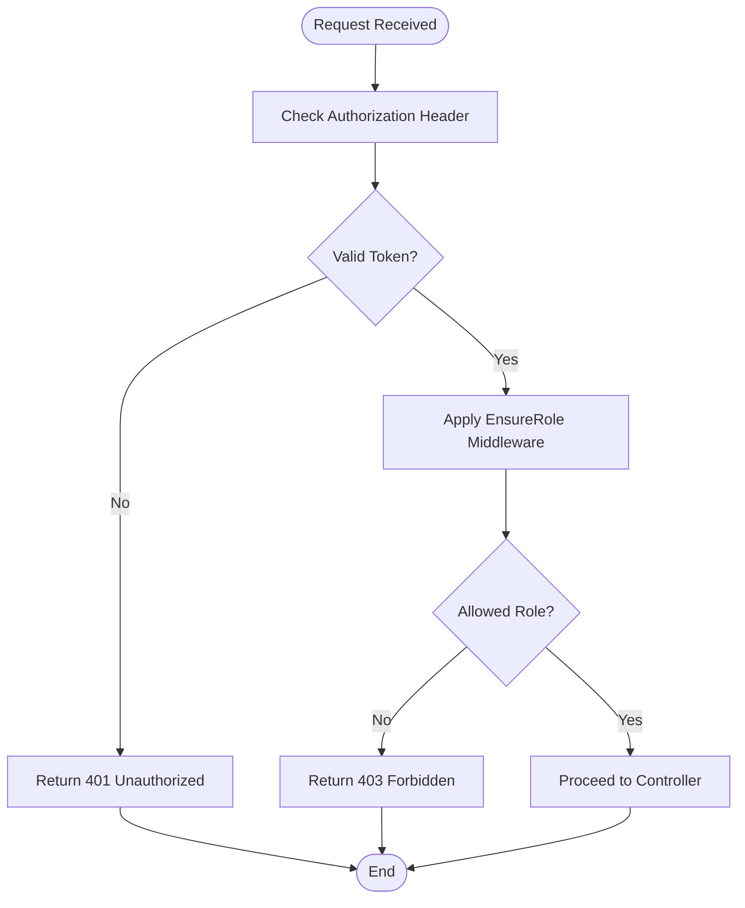

**Diagram sources**
- [EnsureRole.php](file://app/Http/Middleware/EnsureRole.php)

**Section sources**
- [SekolahApiTest.php](file://tests/Feature/Api/V1/SekolahApiTest.php)
- [GuruKelasKuTest.php](file://tests/Feature/Api/V1/GuruKelasKuTest.php)
- [TuDashboardTest.php](file://tests/Feature/Api/V1/TuDashboardTest.php)
- [EnsureRole.php](file://app/Http/Middleware/EnsureRole.php)

### Academic Year and Semester Context
- Active academic year and semester are maintained in Sekolah with foreign keys to TahunPelajaran and Semester.
- Operations are scoped to the current active year and semester.

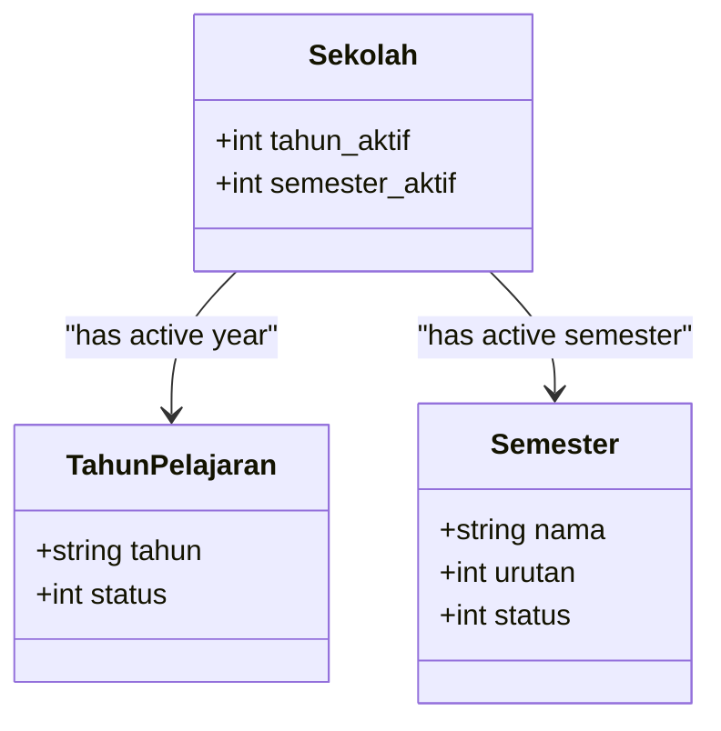

**Diagram sources**
- [Sekolah.php](file://app/Models/Sekolah.php)
- [TahunPelajaran.php](file://app/Models/TahunPelajaran.php)
- [Semester.php](file://app/Models/Semester.php)

**Section sources**
- [SekolahApiTest.php](file://tests/Feature/Api/V1/SekolahApiTest.php)

### Class Management (TU)
Endpoints enable listing classes, filtering by search terms, and retrieving class-related metadata. Access is restricted to TU users.

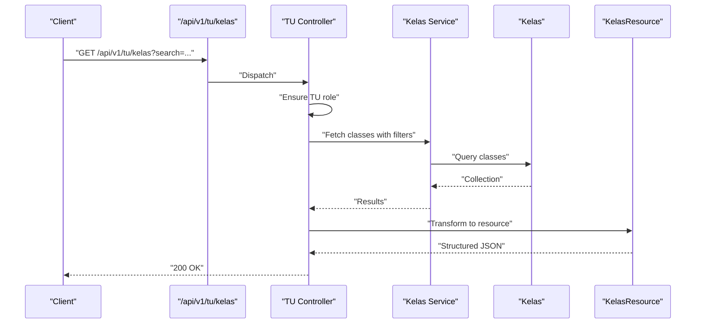

**Diagram sources**
- [KelasApiTest.php](file://tests/Feature/Api/V1/KelasApiTest.php)
- [Kelas.php](file://app/Models/Kelas.php)
- [KelasResource.php](file://app/Http/Resources/V1/KelasResource.php)

**Section sources**
- [KelasApiTest.php](file://tests/Feature/Api/V1/KelasApiTest.php)

### Teacher Class and Student Management (Guru)
- Endpoint returns the teacher’s homeroom classes and marks them accordingly.
- Retrieves enrolled students for a given class during the active academic year/semester.

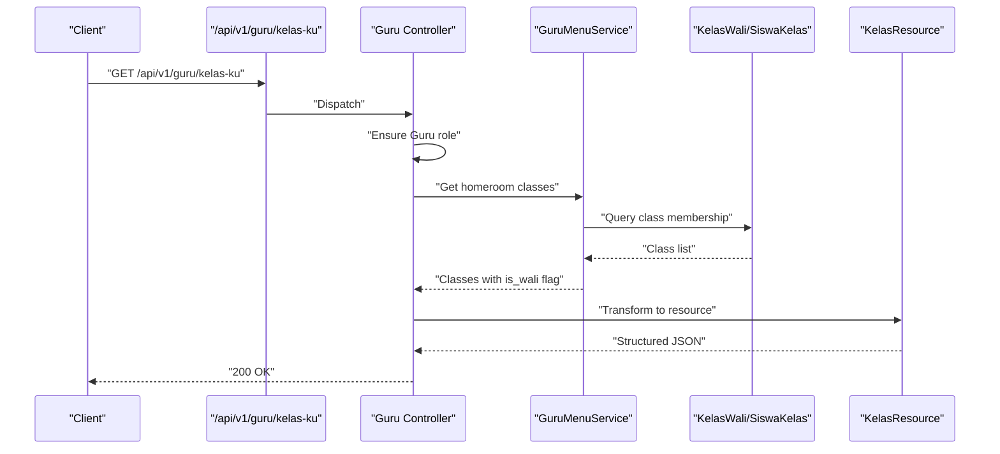

**Diagram sources**
- [GuruKelasKuTest.php](file://tests/Feature/Api/V1/GuruKelasKuTest.php)
- [GuruMenuService.php](file://app/Services/GuruMenuService.php)
- [Kelas.php](file://app/Models/Kelas.php)
- [Siswa.php](file://app/Models/Siswa.php)
- [KelasResource.php](file://app/Http/Resources/V1/KelasResource.php)

**Section sources**
- [GuruKelasKuTest.php](file://tests/Feature/Api/V1/GuruKelasKuTest.php)

### Attendance Tracking
- Attendance records are stored in Presensi with references to students and academic year/semester.
- Real-time updates are supported via batch operations for daily roll calls.

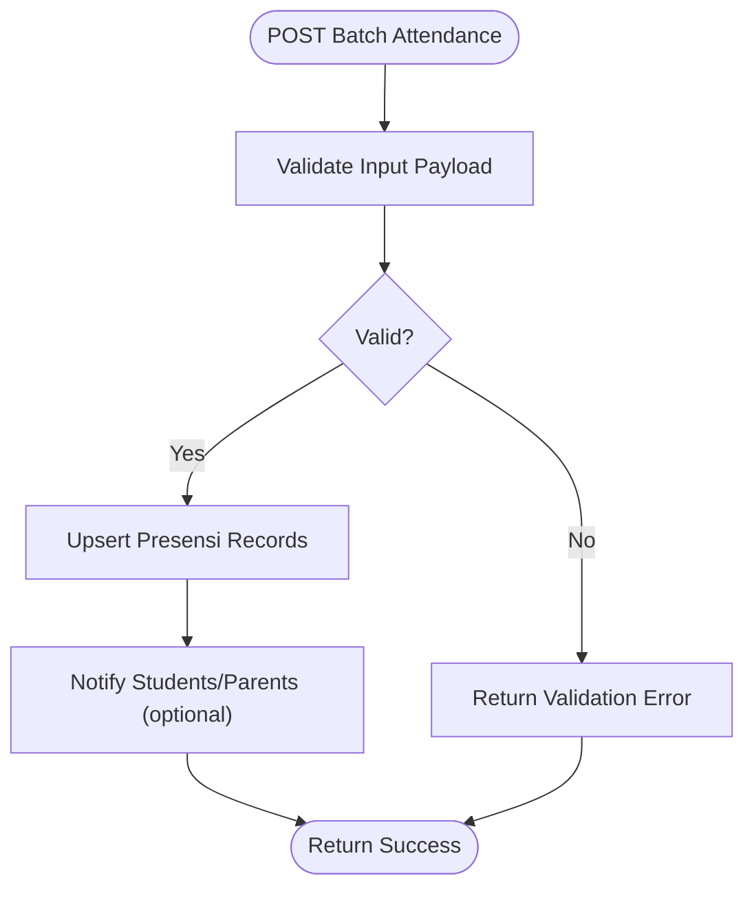

**Diagram sources**
- [Presensi.php](file://app/Models/Presensi.php)

**Section sources**
- [Presensi.php](file://app/Models/Presensi.php)

### Grade Recording and Assessment (Guru and TU)
- Academic grades are recorded per subject and student, with support for formative and summative assessments.
- Co-curricular and character assessments leverage NilaiKokurikuler and related descriptors.

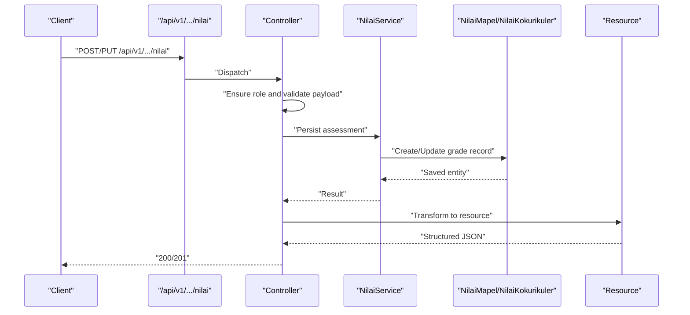

**Diagram sources**
- [NilaiService.php](file://app/Services/NilaiService.php)
- [NilaiMapel.php](file://app/Models/NilaiMapel.php)
- [NilaiKokurikuler.php](file://app/Models/NilaiKokurikuler.php)
- [NilaiService.php](file://app/Services/NilaiService.php)

**Section sources**
- [NilaiService.php](file://app/Services/NilaiService.php)
- [NilaiMapel.php](file://app/Models/NilaiMapel.php)
- [NilaiKokurikuler.php](file://app/Models/NilaiKokurikuler.php)

### Extracurricular Activities and Co-Curricular Assessments
- Extracurricular offerings are modeled by Eskul.
- Co-curricular assessments are captured via NilaiKokurikuler linked to student descriptors.

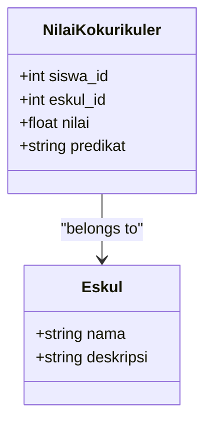

**Diagram sources**
- [Ekskul.php](file://app/Models/Ekskul.php)
- [NilaiKokurikuler.php](file://app/Models/NilaiKokurikuler.php)

**Section sources**
- [Ekskul.php](file://app/Models/Ekskul.php)
- [NilaiKokurikuler.php](file://app/Models/NilaiKokurikuler.php)

### Internship Management (TU and Guru)
- Internship placement and supervision are managed with Prakerin and related models.
- TU manages placements and advisors; Guru accesses reports and assessments.

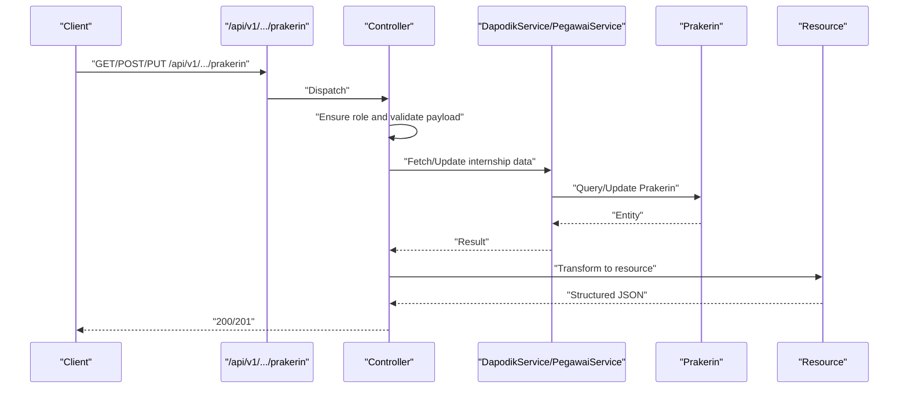

**Diagram sources**
- [DapodikService.php](file://app/Services/DapodikService.php)
- [PegawaiService.php](file://app/Services/PegawaiService.php)
- [Prakerin.php](file://app/Models/Prakerin.php)

**Section sources**
- [DapodikService.php](file://app/Services/DapodikService.php)
- [PegawaiService.php](file://app/Services/PegawaiService.php)
- [Prakerin.php](file://app/Models/Prakerin.php)

### Report Generation and Exports (TU)
- Report card templates and descriptors are managed via DeskripsiRapor and PembagianRaport.
- ExportService supports generating consolidated academic reports.

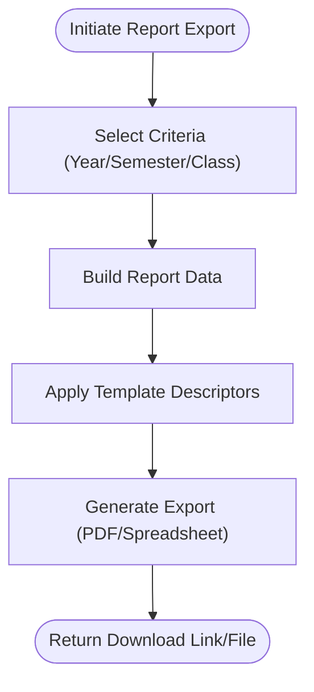

**Diagram sources**
- [RaporService.php](file://app/Services/RaporService.php)
- [ExportService.php](file://app/Services/ExportService.php)
- [DeskripsiRapor.php](file://app/Models/DeskripsiRapor.php)
- [PembagianRaport.php](file://app/Models/PembagianRaport.php)

**Section sources**
- [RaporService.php](file://app/Services/RaporService.php)
- [ExportService.php](file://app/Services/ExportService.php)
- [DeskripsiRapor.php](file://app/Models/DeskripsiRapor.php)
- [PembagianRaport.php](file://app/Models/PembagianRaport.php)

### Administrative Dashboards (TU)
- Dashboard endpoints aggregate counts for classes, subjects, and other metrics.

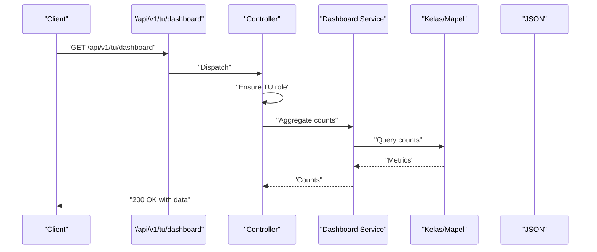

**Diagram sources**
- [TuDashboardTest.php](file://tests/Feature/Api/V1/TuDashboardTest.php)

**Section sources**
- [TuDashboardTest.php](file://tests/Feature/Api/V1/TuDashboardTest.php)

### Teacher Menu and Permissions (Guru)
- GuruMenuService manages menu access and permissions for teacher-facing features.

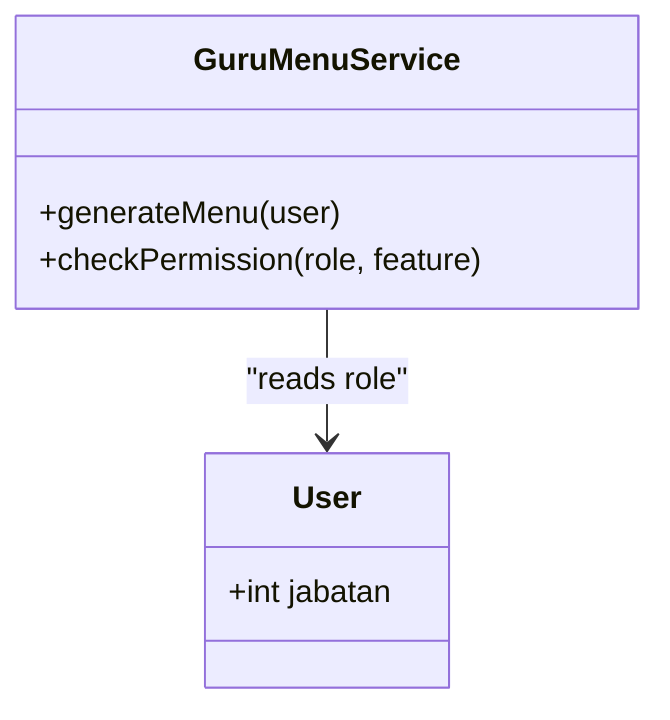

**Diagram sources**
- [GuruMenuService.php](file://app/Services/GuruMenuService.php)
- [User.php](file://app/Models/User.php)

**Section sources**
- [GuruMenuService.php](file://app/Services/GuruMenuService.php)
- [User.php](file://app/Models/User.php)

## Dependency Analysis
The following diagram highlights key dependencies among controllers, services, models, and resources:

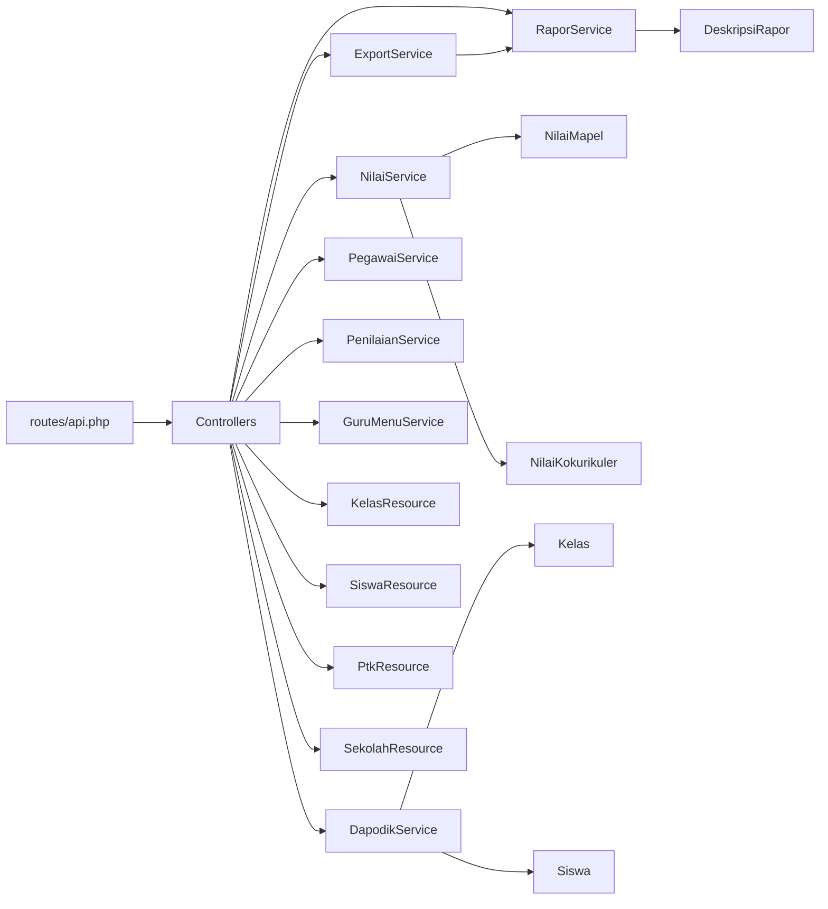

**Diagram sources**
- [api.php](file://routes/api.php)
- [NilaiService.php](file://app/Services/NilaiService.php)
- [RaporService.php](file://app/Services/RaporService.php)
- [ExportService.php](file://app/Services/ExportService.php)
- [DapodikService.php](file://app/Services/DapodikService.php)
- [PegawaiService.php](file://app/Services/PegawaiService.php)
- [PenilaianService.php](file://app/Services/PenilaianService.php)
- [GuruMenuService.php](file://app/Services/GuruMenuService.php)
- [NilaiMapel.php](file://app/Models/NilaiMapel.php)
- [NilaiKokurikuler.php](file://app/Models/NilaiKokurikuler.php)
- [DeskripsiRapor.php](file://app/Models/DeskripsiRapor.php)
- [Kelas.php](file://app/Models/Kelas.php)
- [Siswa.php](file://app/Models/Siswa.php)
- [KelasResource.php](file://app/Http/Resources/V1/KelasResource.php)
- [SiswaResource.php](file://app/Http/Resources/V1/SiswaResource.php)
- [PtkResource.php](file://app/Http/Resources/V1/PtkResource.php)
- [SekolahResource.php](file://app/Http/Resources/V1/SekolahResource.php)

**Section sources**
- [api.php](file://routes/api.php)
- [NilaiService.php](file://app/Services/NilaiService.php)
- [RaporService.php](file://app/Services/RaporService.php)
- [ExportService.php](file://app/Services/ExportService.php)
- [DapodikService.php](file://app/Services/DapodikService.php)
- [PegawaiService.php](file://app/Services/PegawaiService.php)
- [PenilaianService.php](file://app/Services/PenilaianService.php)
- [GuruMenuService.php](file://app/Services/GuruMenuService.php)
- [Kelas.php](file://app/Models/Kelas.php)
- [Siswa.php](file://app/Models/Siswa.php)
- [NilaiMapel.php](file://app/Models/NilaiMapel.php)
- [NilaiKokurikuler.php](file://app/Models/NilaiKokurikuler.php)
- [DeskripsiRapor.php](file://app/Models/DeskripsiRapor.php)
- [KelasResource.php](file://app/Http/Resources/V1/KelasResource.php)
- [SiswaResource.php](file://app/Http/Resources/V1/SiswaResource.php)
- [PtkResource.php](file://app/Http/Resources/V1/PtkResource.php)
- [SekolahResource.php](file://app/Http/Resources/V1/SekolahResource.php)

## Performance Considerations
- Prefer batch operations for attendance and grade updates to minimize round trips.
- Use pagination and search filters for class and student listings.
- Cache frequently accessed descriptors and templates (e.g., report card descriptors) to reduce database load.
- Index academic year and semester fields for efficient scoping of queries.
- Stream exports for large datasets to avoid memory spikes.

## Troubleshooting Guide
Common issues and resolutions:
- 401 Unauthorized: Ensure a valid bearer token is provided in the Authorization header.
- 403 Forbidden: Verify the requesting user’s role matches the endpoint’s requirements (TU vs Guru).
- Validation errors: Confirm payload structure aligns with documented schemas and required fields.
- Data context mismatch: Ensure operations target the active academic year and semester.

**Section sources**
- [SekolahApiTest.php](file://tests/Feature/Api/V1/SekolahApiTest.php)
- [GuruKelasKuTest.php](file://tests/Feature/Api/V1/GuruKelasKuTest.php)
- [TuDashboardTest.php](file://tests/Feature/Api/V1/TuDashboardTest.php)

## Conclusion
The Academic APIs provide a robust foundation for managing academic workflows, including grade recording, attendance tracking, extracurricular assessments, and report generation. By leveraging role-based access control, standardized resources, and centralized services, the system supports scalable operations for both teachers and administrators. Adhering to the documented schemas and operational guidelines ensures reliable performance and compliance with academic policies.

## Appendices

### API Endpoints Overview
- School Profile
  - GET /api/v1/sekolah
  - Requires: bearer token
  - Returns: school profile with active academic year and semester
- Class Management (TU)
  - GET /api/v1/tu/kelas
  - Query params: search
  - Returns: paginated list of classes with metadata
- Teacher Class List (Guru)
  - GET /api/v1/guru/kelas-ku
  - Returns: list of homeroom classes with is_wali flag
- Students in Class (Guru)
  - GET /api/v1/guru/kelas-ku/{classId}/siswa
  - Returns: enrolled students for the specified class
- Dashboard Metrics (TU)
  - GET /api/v1/tu/dashboard
  - Returns: aggregated counts for classes and subjects
- Attendance (Batch)
  - POST /api/v1/.../presensi/batch
  - Payload: array of attendance records
  - Returns: success status and affected records
- Grades (Formative/Summative)
  - POST /api/v1/.../nilai
  - PUT /api/v1/.../nilai/{id}
  - Payload: assessment details (subject, student, scores)
  - Returns: saved grade record
- Co-Curricular Assessments
  - POST /api/v1/.../kokurikuler
  - PUT /api/v1/.../kokurikuler/{id}
  - Payload: student, activity, score/predikat
  - Returns: saved assessment
- Internship Management
  - GET/POST/PUT /api/v1/.../prakerin
  - Payload: placement details, supervisor assignments
  - Returns: internship record
- Report Generation
  - GET /api/v1/.../laporan/rapor
  - Query params: year, semester, class
  - Returns: downloadable report (PDF/Spreadsheet)

**Section sources**
- [SekolahApiTest.php](file://tests/Feature/Api/V1/SekolahApiTest.php)
- [KelasApiTest.php](file://tests/Feature/Api/V1/KelasApiTest.php)
- [GuruKelasKuTest.php](file://tests/Feature/Api/V1/GuruKelasKuTest.php)
- [TuDashboardTest.php](file://tests/Feature/Api/V1/TuDashboardTest.php)

### Assessment Criteria, Grading Scales, and Evaluation Methods
- Grading scales and KKM thresholds are maintained per subject via subject records.
- Formative assessments capture ongoing learning progress; summative assessments evaluate mastery at term intervals.
- Co-curricular evaluations use descriptive rubrics aligned with student descriptors.
- Internship assessments combine practical performance with reflective reports.

**Section sources**
- [NilaiService.php](file://app/Services/NilaiService.php)
- [NilaiMapel.php](file://app/Models/NilaiMapel.php)
- [NilaiKokurikuler.php](file://app/Models/NilaiKokurikuler.php)
- [DeskripsiRapor.php](file://app/Models/DeskripsiRapor.php)

### Data Validation and Regulatory Compliance
- All endpoints validate input payloads and enforce role-based access.
- Academic year and semester scoping ensure data integrity and compliance with institutional calendars.
- Export endpoints produce standardized formats suitable for regulatory submissions.

**Section sources**
- [EnsureRole.php](file://app/Http/Middleware/EnsureRole.php)
- [TahunPelajaran.php](file://app/Models/TahunPelajaran.php)
- [Semester.php](file://app/Models/ Semester.php)
- [ExportService.php](file://app/Services/ExportService.php)