# Authentication API

<cite>
**Referenced Files in This Document**
- [routes/api.php](file://routes/api.php)
- [app/Http/Controllers/Api/V1/AuthController.php](file://app/Http/Controllers/Api/V1/AuthController.php)
- [config/auth.php](file://config/auth.php)
- [config/sanctum.php](file://config/sanctum.php)
- [database/migrations/0001_01_01_000000_create_users_table.php](file://database/migrations/0001_01_01_000000_create_users_table.php)
- [app/Models/User.php](file://app/Models/User.php)
- [app/Http/Requests/Api/V1/LoginRequest.php](file://app/Http/Requests/Api/V1/LoginRequest.php)
- [app/Http/Requests/Api/V1/RegisterRequest.php](file://app/Http/Requests/Api/V1/RegisterRequest.php)
- [app/Http/Requests/Api/V1/PasswordResetRequest.php](file://app/Http/Requests/Api/V1/PasswordResetRequest.php)
- [app/Http/Requests/Api/V1/PasswordUpdateRequest.php](file://app/Http/Requests/Api/V1/PasswordUpdateRequest.php)
- [app/Http/Resources/V1/UserResource.php](file://app/Http/Resources/V1/UserResource.php)
- [app/Services/PushService.php](file://app/Services/PushService.php)
- [app/Models/PushSubscription.php](file://app/Models/PushSubscription.php)
- [app/Models/PwaToken.php](file://app/Models/PwaToken.php)
- [app/Http/Middleware/EnsureRole.php](file://app/Http/Middleware/EnsureRole.php)
- [app/Http/Middleware/SessionTimeout.php](file://app/Http/Middleware/SessionTimeout.php)
- [public/.htaccess](file://public/.htaccess)
- [tests/Feature/Api/V1/Auth/LoginTest.php](file://tests/Feature/Api/V1/Auth/LoginTest.php)
- [tests/Feature/Api/V1/Auth/LogoutTest.php](file://tests/Feature/Api/V1/Auth/LogoutTest.php)
- [tests/Feature/Api/V1/Auth/MeTest.php](file://tests/Feature/Api/V1/Auth/MeTest.php)
- [tests/Feature/Auth/PasswordResetTest.php](file://tests/Feature/Auth/PasswordResetTest.php)
</cite>

## Table of Contents
1. [Introduction](#introduction)
2. [Project Structure](#project-structure)
3. [Core Components](#core-components)
4. [Architecture Overview](#architecture-overview)
5. [Detailed Component Analysis](#detailed-component-analysis)
6. [Dependency Analysis](#dependency-analysis)
7. [Performance Considerations](#performance-considerations)
8. [Troubleshooting Guide](#troubleshooting-guide)
9. [Conclusion](#conclusion)
10. [Appendices](#appendices)

## Introduction
This document provides comprehensive API documentation for RaporKM Laravel's authentication system. It covers login, logout, user profile retrieval, FCM device registration/unregistration, password reset initiation, and related flows. The documentation specifies HTTP methods, URL patterns, request/response schemas, authentication requirements, JWT/Sanctum token handling, session management, security considerations, rate limiting, CSRF protection, and security headers. It also includes client implementation guidelines for mobile apps, web applications, and third-party integrations.

## Project Structure
Authentication endpoints are primarily defined under the API routes and implemented by dedicated controllers. Supporting configurations include Sanctum for token-based stateless authentication, role middleware for access control, and request validation classes for input sanitization.

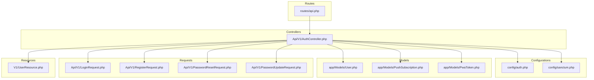

**Diagram sources**
- [routes/api.php:60-80](file://routes/api.php#L60-L80)
- [app/Http/Controllers/Api/V1/AuthController.php](file://app/Http/Controllers/Api/V1/AuthController.php)
- [config/auth.php:100-110](file://config/auth.php#L100-L110)
- [config/sanctum.php](file://config/sanctum.php)
- [app/Models/User.php](file://app/Models/User.php)
- [app/Models/PushSubscription.php](file://app/Models/PushSubscription.php)
- [app/Models/PwaToken.php](file://app/Models/PwaToken.php)
- [app/Http/Requests/Api/V1/LoginRequest.php](file://app/Http/Requests/Api/V1/LoginRequest.php)
- [app/Http/Requests/Api/V1/RegisterRequest.php](file://app/Http/Requests/Api/V1/RegisterRequest.php)
- [app/Http/Requests/Api/V1/PasswordResetRequest.php](file://app/Http/Requests/Api/V1/PasswordResetRequest.php)
- [app/Http/Requests/Api/V1/PasswordUpdateRequest.php](file://app/Http/Requests/Api/V1/PasswordUpdateRequest.php)
- [app/Http/Resources/V1/UserResource.php](file://app/Http/Resources/V1/UserResource.php)

**Section sources**
- [routes/api.php:60-80](file://routes/api.php#L60-L80)
- [config/auth.php:100-110](file://config/auth.php#L100-L110)
- [config/sanctum.php](file://config/sanctum.php)

## Core Components
- Authentication controller implementing login, logout, profile retrieval, and FCM registration endpoints.
- Sanctum configuration for token issuance and verification.
- Role middleware for enforcing user roles.
- Request validation classes for input sanitization and rules.
- Resource classes for consistent user response formatting.
- Password reset token table migration and configuration.

Key endpoint groups:
- Session-based authentication via Sanctum tokens
- Device push notification registration via FCM
- Password reset initiation and update flows

**Section sources**
- [app/Http/Controllers/Api/V1/AuthController.php](file://app/Http/Controllers/Api/V1/AuthController.php)
- [config/sanctum.php](file://config/sanctum.php)
- [app/Http/Middleware/EnsureRole.php](file://app/Http/Middleware/EnsureRole.php)
- [app/Http/Requests/Api/V1/LoginRequest.php](file://app/Http/Requests/Api/V1/LoginRequest.php)
- [app/Http/Requests/Api/V1/RegisterRequest.php](file://app/Http/Requests/Api/V1/RegisterRequest.php)
- [app/Http/Requests/Api/V1/PasswordResetRequest.php](file://app/Http/Requests/Api/V1/PasswordResetRequest.php)
- [app/Http/Requests/Api/V1/PasswordUpdateRequest.php](file://app/Http/Requests/Api/V1/PasswordUpdateRequest.php)
- [app/Http/Resources/V1/UserResource.php](file://app/Http/Resources/V1/UserResource.php)
- [database/migrations/0001_01_01_000000_create_users_table.php:35](file://database/migrations/0001_01_01_000000_create_users_table.php#L35)
- [config/auth.php:102](file://config/auth.php#L102)

## Architecture Overview
The authentication architecture uses Laravel Sanctum for stateless token-based authentication. Clients authenticate via login, receive a Sanctum token, and include it in subsequent requests. The system supports role-based access control and optional FCM device registration for push notifications.

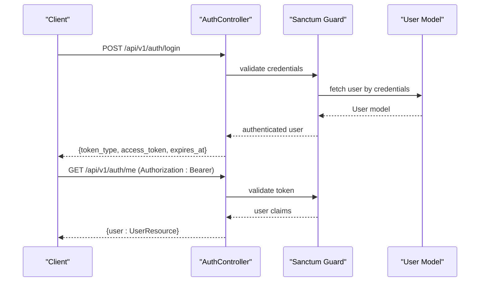

**Diagram sources**
- [routes/api.php:66-75](file://routes/api.php#L66-L75)
- [app/Http/Controllers/Api/V1/AuthController.php](file://app/Http/Controllers/Api/V1/AuthController.php)
- [config/auth.php:100-110](file://config/auth.php#L100-L110)
- [app/Models/User.php](file://app/Models/User.php)

## Detailed Component Analysis

### Authentication Endpoints

#### Login
- Method: POST
- URL: /api/v1/auth/login
- Authentication: None
- Request body: Credentials validated by LoginRequest
- Response: JSON containing token metadata and expiration
- Security: Rate limiting recommended at gateway/proxy level

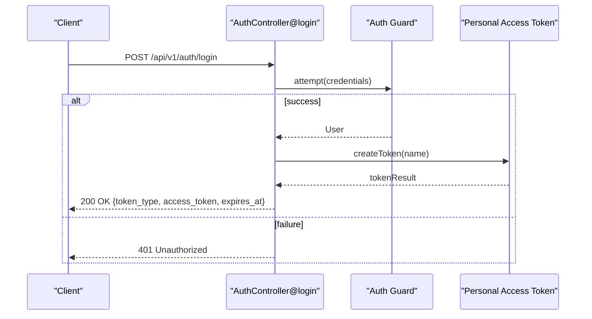

**Diagram sources**
- [routes/api.php:66](file://routes/api.php#L66)
- [app/Http/Controllers/Api/V1/AuthController.php](file://app/Http/Controllers/Api/V1/AuthController.php)
- [app/Http/Requests/Api/V1/LoginRequest.php](file://app/Http/Requests/Api/V1/LoginRequest.php)

**Section sources**
- [routes/api.php:66](file://routes/api.php#L66)
- [app/Http/Controllers/Api/V1/AuthController.php](file://app/Http/Controllers/Api/V1/AuthController.php)
- [app/Http/Requests/Api/V1/LoginRequest.php](file://app/Http/Requests/Api/V1/LoginRequest.php)

#### Logout
- Method: POST
- URL: /api/v1/auth/logout
- Authentication: Required (Bearer token)
- Behavior: Revokes current token
- Response: 200 OK on success

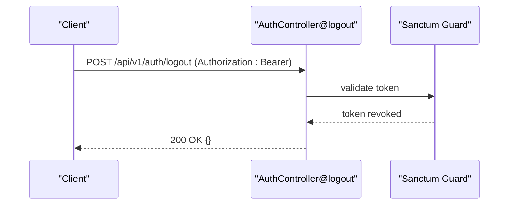

**Diagram sources**
- [routes/api.php:72](file://routes/api.php#L72)
- [app/Http/Controllers/Api/V1/AuthController.php](file://app/Http/Controllers/Api/V1/AuthController.php)

**Section sources**
- [routes/api.php:72](file://routes/api.php#L72)
- [app/Http/Controllers/Api/V1/AuthController.php](file://app/Http/Controllers/Api/V1/AuthController.php)

#### Get Current User (Profile)
- Method: GET
- URL: /api/v1/auth/me
- Authentication: Required (Bearer token)
- Response: UserResource wrapping user data

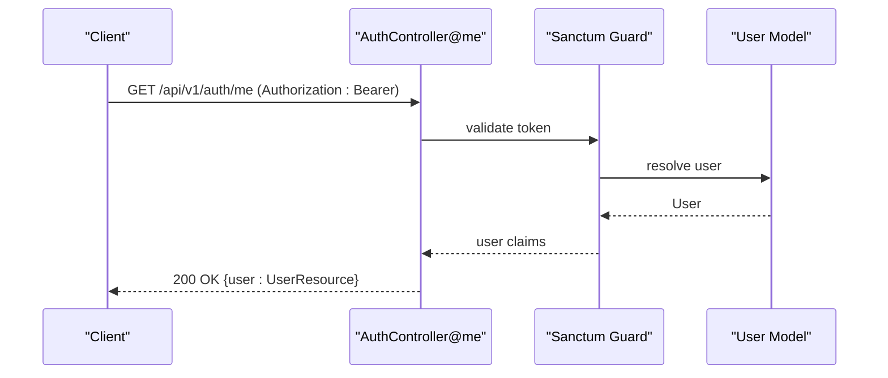

**Diagram sources**
- [routes/api.php:73](file://routes/api.php#L73)
- [app/Http/Controllers/Api/V1/AuthController.php](file://app/Http/Controllers/Api/V1/AuthController.php)
- [app/Http/Resources/V1/UserResource.php](file://app/Http/Resources/V1/UserResource.php)

**Section sources**
- [routes/api.php:73](file://routes/api.php#L73)
- [app/Http/Controllers/Api/V1/AuthController.php](file://app/Http/Controllers/Api/V1/AuthController.php)
- [app/Http/Resources/V1/UserResource.php](file://app/Http/Resources/V1/UserResource.php)

#### FCM Device Registration
- Method: POST
- URL: /api/v1/auth/fcm
- Authentication: Required (Bearer token)
- Purpose: Register FCM device token for push notifications
- Response: 200 OK on success

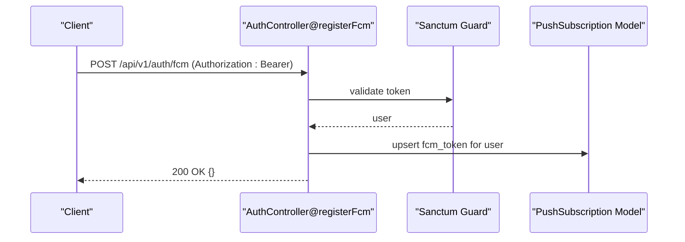

**Diagram sources**
- [routes/api.php:74](file://routes/api.php#L74)
- [app/Http/Controllers/Api/V1/AuthController.php](file://app/Http/Controllers/Api/V1/AuthController.php)
- [app/Models/PushSubscription.php](file://app/Models/PushSubscription.php)

**Section sources**
- [routes/api.php:74](file://routes/api.php#L74)
- [app/Http/Controllers/Api/V1/AuthController.php](file://app/Http/Controllers/Api/V1/AuthController.php)
- [app/Models/PushSubscription.php](file://app/Models/PushSubscription.php)

#### FCM Device Unregistration
- Method: DELETE
- URL: /api/v1/auth/fcm
- Authentication: Required (Bearer token)
- Purpose: Remove stored FCM device token
- Response: 200 OK on success

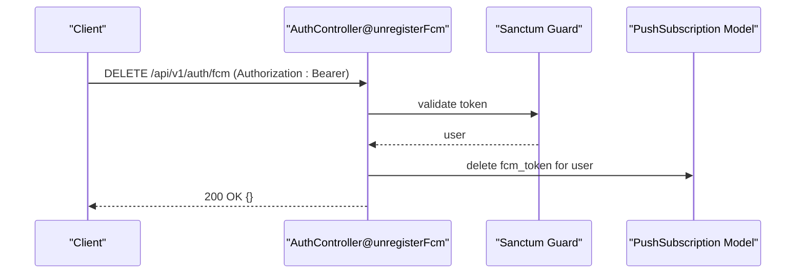

**Diagram sources**
- [routes/api.php:75](file://routes/api.php#L75)
- [app/Http/Controllers/Api/V1/AuthController.php](file://app/Http/Controllers/Api/V1/AuthController.php)
- [app/Models/PushSubscription.php](file://app/Models/PushSubscription.php)

**Section sources**
- [routes/api.php:75](file://routes/api.php#L75)
- [app/Http/Controllers/Api/V1/AuthController.php](file://app/Http/Controllers/Api/V1/AuthController.php)
- [app/Models/PushSubscription.php](file://app/Models/PushSubscription.php)

### Password Reset Endpoints

#### Initiate Password Reset
- Method: POST
- URL: /api/v1/password-reset
- Authentication: None
- Request body: Email address validated by PasswordResetRequest
- Response: 200 OK on acceptance (does not reveal account existence)
- Notes: Uses password_reset_tokens table

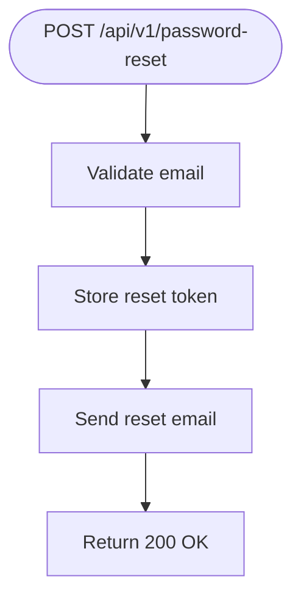

**Diagram sources**
- [database/migrations/0001_01_01_000000_create_users_table.php:35](file://database/migrations/0001_01_01_000000_create_users_table.php#L35)
- [config/auth.php:102](file://config/auth.php#L102)

**Section sources**
- [database/migrations/0001_01_01_000000_create_users_table.php:35](file://database/migrations/0001_01_01_000000_create_users_table.php#L35)
- [config/auth.php:102](file://config/auth.php#L102)

#### Reset Password
- Method: POST
- URL: /api/v1/reset-password
- Authentication: None
- Request body: Token, email, password validated by PasswordUpdateRequest
- Response: 200 OK on success

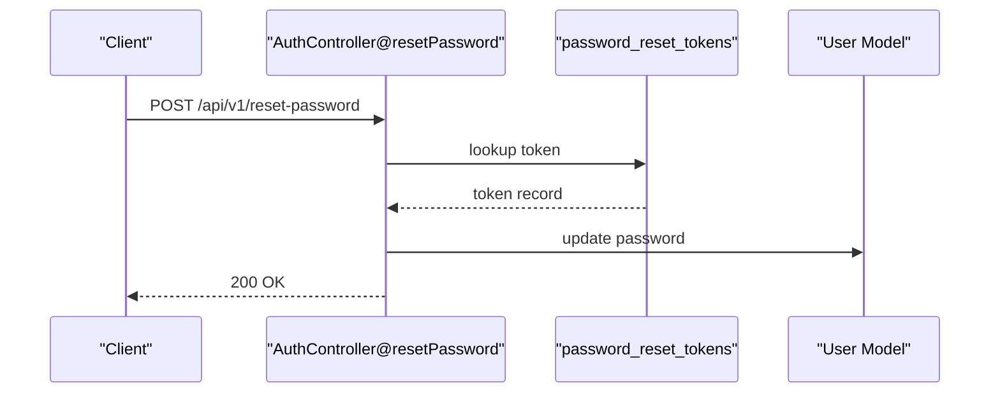

**Diagram sources**
- [app/Http/Controllers/Api/V1/AuthController.php](file://app/Http/Controllers/Api/V1/AuthController.php)
- [app/Http/Requests/Api/V1/PasswordUpdateRequest.php](file://app/Http/Requests/Api/V1/PasswordUpdateRequest.php)
- [database/migrations/0001_01_01_000000_create_users_table.php:35](file://database/migrations/0001_01_01_000000_create_users_table.php#L35)

**Section sources**
- [app/Http/Controllers/Api/V1/AuthController.php](file://app/Http/Controllers/Api/V1/AuthController.php)
- [app/Http/Requests/Api/V1/PasswordUpdateRequest.php](file://app/Http/Requests/Api/V1/PasswordUpdateRequest.php)
- [database/migrations/0001_01_01_000000_create_users_table.php:35](file://database/migrations/0001_01_01_000000_create_users_table.php#L35)

### Token Management
- Token type: Personal Access Tokens via Sanctum
- Expiration: Configurable in Sanctum config
- Scope: Not currently scoped in provided controller
- Revocation: Logout endpoint revokes current token

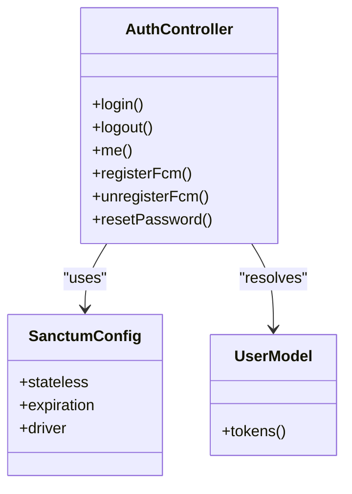

**Diagram sources**
- [app/Http/Controllers/Api/V1/AuthController.php](file://app/Http/Controllers/Api/V1/AuthController.php)
- [config/sanctum.php](file://config/sanctum.php)
- [app/Models/User.php](file://app/Models/User.php)

**Section sources**
- [config/sanctum.php](file://config/sanctum.php)
- [app/Http/Controllers/Api/V1/AuthController.php](file://app/Http/Controllers/Api/V1/AuthController.php)
- [app/Models/User.php](file://app/Models/User.php)

## Dependency Analysis
Authentication relies on Laravel Sanctum for token management, role middleware for access control, and request validation classes for input sanitization. The password reset flow depends on the password_reset_tokens table and email delivery service.

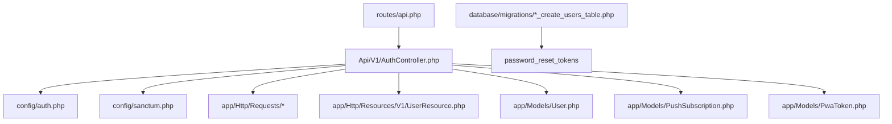

**Diagram sources**
- [routes/api.php:60-80](file://routes/api.php#L60-L80)
- [app/Http/Controllers/Api/V1/AuthController.php](file://app/Http/Controllers/Api/V1/AuthController.php)
- [config/auth.php:100-110](file://config/auth.php#L100-L110)
- [config/sanctum.php](file://config/sanctum.php)
- [database/migrations/0001_01_01_000000_create_users_table.php:35](file://database/migrations/0001_01_01_000000_create_users_table.php#L35)

**Section sources**
- [routes/api.php:60-80](file://routes/api.php#L60-L80)
- [app/Http/Controllers/Api/V1/AuthController.php](file://app/Http/Controllers/Api/V1/AuthController.php)
- [config/auth.php:100-110](file://config/auth.php#L100-L110)
- [config/sanctum.php](file://config/sanctum.php)
- [database/migrations/0001_01_01_000000_create_users_table.php:35](file://database/migrations/0001_01_01_000000_create_users_table.php#L35)

## Performance Considerations
- Token validation overhead: Each protected request validates the Sanctum token; keep token lifetime reasonable.
- Database queries: Login and token resolution queries; ensure proper indexing on user identifiers.
- Rate limiting: Apply at gateway/proxy level to prevent brute force attacks.
- Caching: Consider caching frequently accessed user profiles for short TTLs.

## Troubleshooting Guide
Common issues and resolutions:
- 401 Unauthorized on protected endpoints: Verify Authorization header format and token validity.
- 403 Forbidden: Check role middleware configuration and user roles.
- 429 Too Many Requests: Implement client-side retry with exponential backoff and server-side rate limits.
- Token not revoking on logout: Ensure logout endpoint is called and Sanctum guard is configured correctly.

**Section sources**
- [app/Http/Middleware/EnsureRole.php](file://app/Http/Middleware/EnsureRole.php)
- [app/Http/Middleware/SessionTimeout.php](file://app/Http/Middleware/SessionTimeout.php)
- [tests/Feature/Api/V1/Auth/LoginTest.php](file://tests/Feature/Api/V1/Auth/LoginTest.php)
- [tests/Feature/Api/V1/Auth/LogoutTest.php](file://tests/Feature/Api/V1/Auth/LogoutTest.php)
- [tests/Feature/Api/V1/Auth/MeTest.php](file://tests/Feature/Api/V1/Auth/MeTest.php)
- [tests/Feature/Auth/PasswordResetTest.php](file://tests/Feature/Auth/PasswordResetTest.php)

## Conclusion
RaporKM Laravel's authentication API provides secure, stateless token-based authentication using Sanctum, along with device push registration and password reset capabilities. Proper client implementation should handle token lifecycle, enforce security headers, and integrate rate limiting and CSRF protections at the network layer.

## Appendices

### HTTP Headers
- Authorization: Bearer {access_token} for protected endpoints
- Content-Type: application/json
- Accept: application/json

### Security Headers
- X-Content-Type-Options: nosniff
- X-Frame-Options: DENY
- X-XSS-Protection: 1; mode=block
- Strict-Transport-Security: max-age=31536000; includeSubDomains
- Content-Security-Policy: script-src 'self'; object-src 'none'

**Section sources**
- [public/.htaccess](file://public/.htaccess)

### Client Implementation Guidelines
- Mobile Apps:
  - Persist tokens securely (encrypted storage).
  - Refresh tokens via re-authentication flow.
  - Handle token expiry by prompting re-login.
  - Register FCM tokens after successful login.
- Web Applications:
  - Store tokens in memory or secure HTTP-only cookies.
  - Set appropriate SameSite and Secure flags for cookies.
  - Implement automatic logout on token expiry.
  - Use CSRF tokens for form submissions.
- Third-Party Integrations:
  - Use long-lived tokens with minimal scopes.
  - Implement robust error handling and retries.
  - Log token issuance and revocation events.

### Request/Response Schemas

#### Login Request
- Fields: identifier (string), password (string)
- Validation: required fields, credential checks

#### Login Response
- Fields: token_type (string), access_token (string), expires_at (datetime)

#### Get Me Response
- Fields: user (object from UserResource)

#### FCM Registration Request
- Fields: fcm_token (string)

#### Password Reset Initiation Request
- Fields: email (string)

#### Reset Password Request
- Fields: email (string), token (string), password (string), password_confirmation (string)

**Section sources**
- [app/Http/Requests/Api/V1/LoginRequest.php](file://app/Http/Requests/Api/V1/LoginRequest.php)
- [app/Http/Resources/V1/UserResource.php](file://app/Http/Resources/V1/UserResource.php)
- [app/Http/Requests/Api/V1/PasswordResetRequest.php](file://app/Http/Requests/Api/V1/PasswordResetRequest.php)
- [app/Http/Requests/Api/V1/PasswordUpdateRequest.php](file://app/Http/Requests/Api/V1/PasswordUpdateRequest.php)