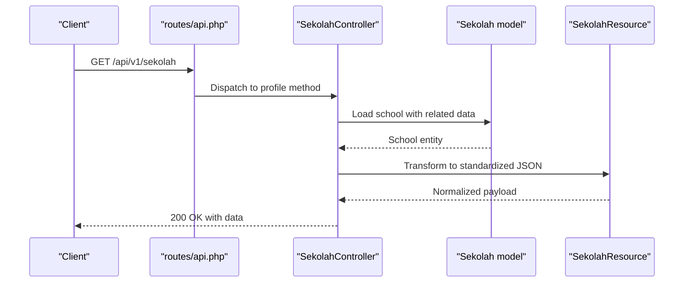
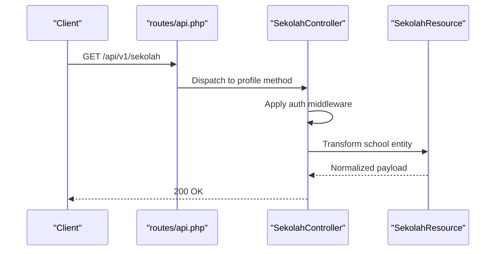
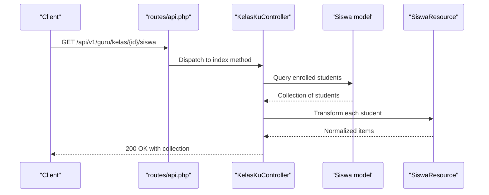
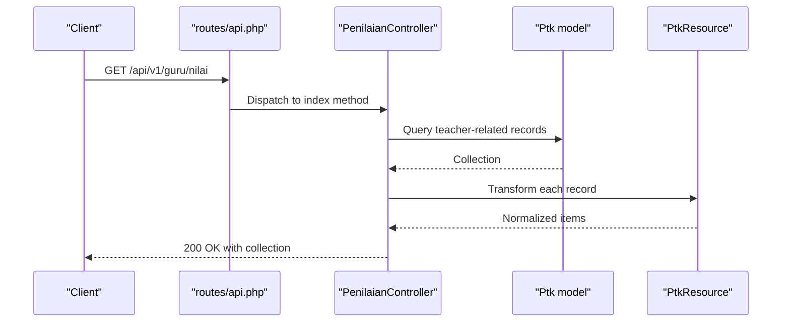
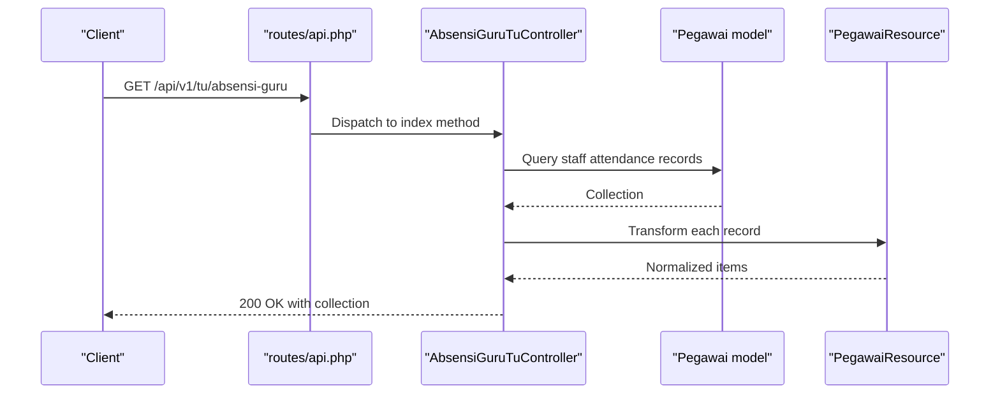
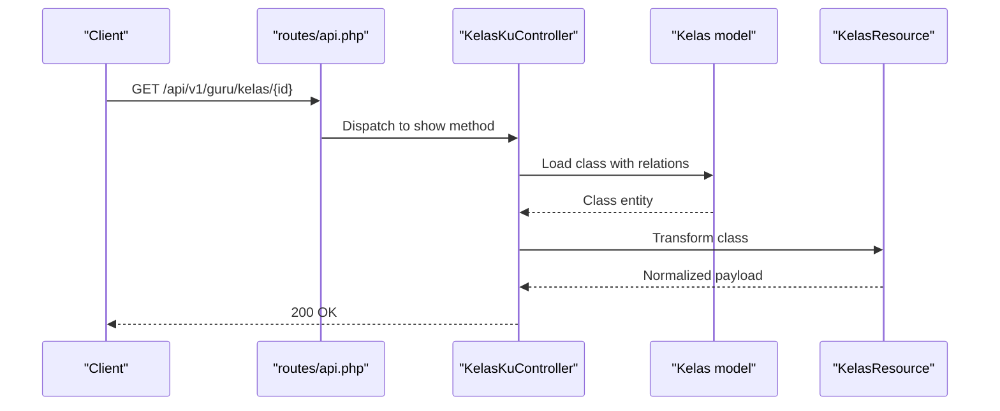
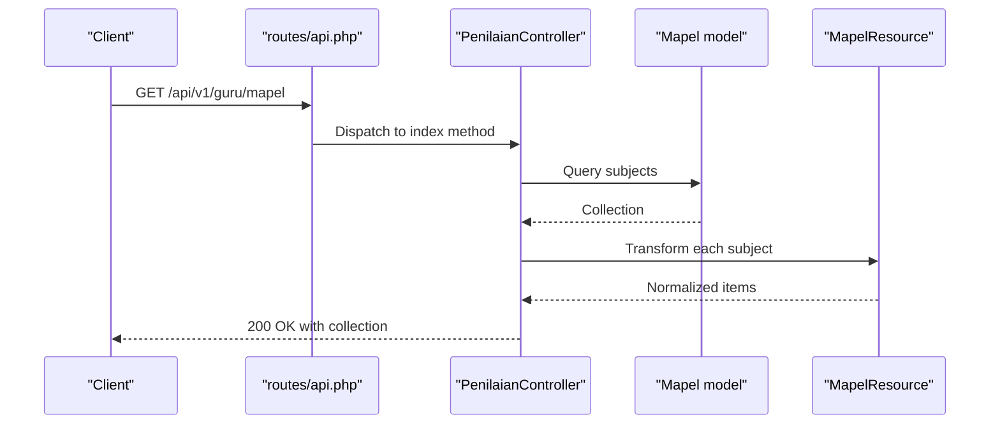
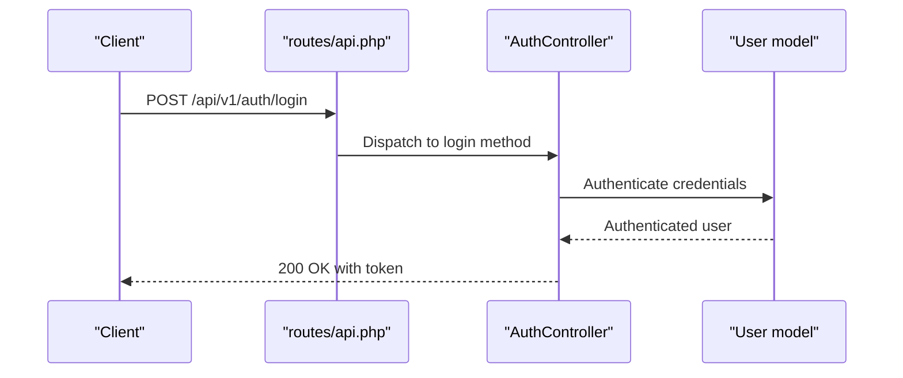
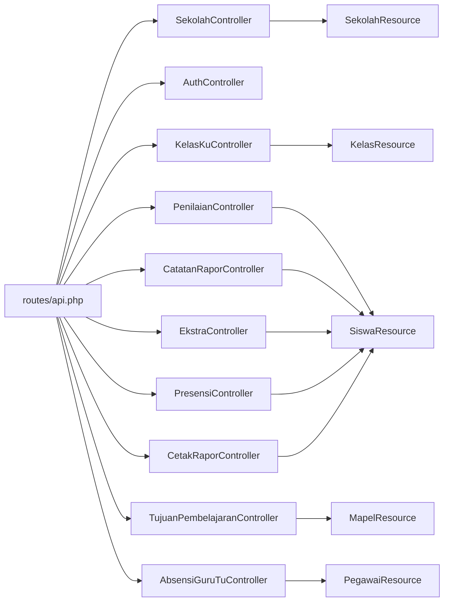

# Core CRUD APIs

<cite>
**Referenced Files in This Document**
- [routes/api.php](file://routes/api.php)
- [app/Http/Controllers/Api/V1/SekolahController.php](file://app/Http/Controllers/Api/V1/SekolahController.php)
- [app/Http/Controllers/Api/V1/AuthController.php](file://app/Http/Controllers/Api/V1/AuthController.php)
- [app/Http/Controllers/Api/V1/ProfileController.php](file://app/Http/Controllers/Api/V1/ProfileController.php)
- [app/Http/Controllers/Api/V1/Guru/KelasKuController.php](file://app/Http/Controllers/Api/V1/Guru/KelasKuController.php)
- [app/Http/Controllers/Api/V1/Guru/PenilaianController.php](file://app/Http/Controllers/Api/V1/Guru/PenilaianController.php)
- [app/Http/Controllers/Api/V1/Guru/CatatanRaporController.php](file://app/Http/Controllers/Api/V1/Guru/CatatanRaporController.php)
- [app/Http/Controllers/Api/V1/Guru/EkstraController.php](file://app/Http/Controllers/Api/V1/Guru/EkstraController.php)
- [app/Http/Controllers/Api/V1/Guru/PresensiController.php](file://app/Http/Controllers/Api/V1/Guru/PresensiController.php)
- [app/Http/Controllers/Api/V1/Guru/TujuanPembelajaranController.php](file://app/Http/Controllers/Api/V1/Guru/TujuanPembelajaranController.php)
- [app/Http/Controllers/Api/V1/Guru/CetakRaporController.php](file://app/Http/Controllers/Api/V1/Guru/CetakRaporController.php)
- [app/Http/Controllers/Api/V1/TU/AbsensiGuruTuController.php](file://app/Http/Controllers/Api/V1/TU/AbsensiGuruTuController.php)
- [app/Http/Resources/V1/SiswaResource.php](file://app/Http/Resources/V1/SiswaResource.php)
- [app/Http/Resources/V1/PegawaiResource.php](file://app/Http/Resources/V1/PegawaiResource.php)
- [app/Http/Resources/V1/PtkResource.php](file://app/Http/Resources/V1/PtkResource.php)
- [app/Http/Resources/V1/KelasResource.php](file://app/Http/Resources/V1/KelasResource.php)
- [app/Http/Resources/V1/MapelResource.php](file://app/Http/Resources/V1/MapelResource.php)
- [app/Http/Resources/V1/SekolahResource.php](file://app/Http/Resources/V1/SekolahResource.php)
- [app/Models/Siswa.php](file://app/Models/Siswa.php)
- [app/Models/Ptk.php](file://app/Models/Ptk.php)
- [app/Models/Kelas.php](file://app/Models/Kelas.php)
- [app/Models/Mapel.php](file://app/Models/Mapel.php)
- [app/Models/Sekolah.php](file://app/Models/Sekolah.php)
- [app/Services/Dapodik/SiswaSyncService.php](file://app/Services/Dapodik/SiswaSyncService.php)
- [app/Services/Dapodik/GtkSyncService.php](file://app/Services/Dapodik/GtkSyncService.php)
- [app/Services/Dapodik/SekolahSyncService.php](file://app/Services/Dapodik/SekolahSyncService.php)
- [tests/Feature/Api/V1/SekolahApiTest.php](file://tests/Feature/Api/V1/SekolahApiTest.php)
- [tests/Feature/Api/V1/AuthApiTest.php](file://tests/Feature/Api/V1/AuthApiTest.php)
- [tests/Feature/Api/V1/Guru/KelasApiTest.php](file://tests/Feature/Api/V1/Guru/KelasApiTest.php)
- [tests/Feature/Api/V1/Guru/PenilaianApiTest.php](file://tests/Feature/Api/V1/Guru/PenilaianApiTest.php)
- [tests/Feature/Api/V1/Guru/CatatanRaporApiTest.php](file://tests/Feature/Api/V1/Guru/CatatanRaporApiTest.php)
- [tests/Feature/Api/V1/Guru/EkstraApiTest.php](file://tests/Feature/Api/V1/Guru/EkstraApiTest.php)
- [tests/Feature/Api/V1/Guru/PresensiApiTest.php](file://tests/Feature/Api/V1/Guru/PresensiApiTest.php)
- [tests/Feature/Api/V1/Guru/TujuanPembelajaranApiTest.php](file://tests/Feature/Api/V1/Guru/TujuanPembelajaranApiTest.php)
- [tests/Feature/Api/V1/Guru/CetakRaporApiTest.php](file://tests/Feature/Api/V1/Guru/CetakRaporApiTest.php)
- [tests/Feature/Api/V1/TU/AbsensiGuruTuApiTest.php](file://tests/Feature/Api/V1/TU/AbsensiGuruTuApiTest.php)
</cite>

## Table of Contents
1. [Introduction](#introduction)
2. [Project Structure](#project-structure)
3. [Core Components](#core-components)
4. [Architecture Overview](#architecture-overview)
5. [Detailed Component Analysis](#detailed-component-analysis)
6. [Dependency Analysis](#dependency-analysis)
7. [Performance Considerations](#performance-considerations)
8. [Troubleshooting Guide](#troubleshooting-guide)
9. [Conclusion](#conclusion)

## Introduction
This document provides comprehensive API documentation for core CRUD operations across student, teacher, class, subject, staff, and school entities. It covers endpoint specifications, request validation rules, parameter requirements, response schemas, complex queries (filtering, sorting, pagination), resource relationships, nested endpoints, bulk operations, error handling, and performance considerations. The APIs are primarily implemented under the V1 namespace and validated through extensive feature tests.

## Project Structure
The API surface is organized under the V1 namespace with dedicated controllers per role (Guru and TU) and shared controllers for school and authentication. Resource transformation is handled via dedicated Resource classes. Tests validate endpoint behavior, authentication, and response shapes.

```mermaid
graph TB
subgraph "Routes"
RAPI["routes/api.php"]
end
subgraph "V1 Controllers"
SEC["Api/V1/SekolahController.php"]
AUC["Api/V1/AuthController.php"]
PFC["Api/V1/ProfileController.php"]
GKK["Api/V1/Guru/KelasKuController.php"]
GPN["Api/V1/Guru/PenilaianController.php"]
GCR["Api/V1/Guru/CatatanRaporController.php"]
GEK["Api/V1/Guru/EkstraController.php"]
GPS["Api/V1/Guru/PresensiController.php"]
GTU["Api/V1/Guru/TujuanPembelajaranController.php"]
GCT["Api/V1/Guru/CetakRaporController.php"]
TAT["Api/V1/TU/AbsensiGuruTuController.php"]
end
subgraph "Resources"
SR["Resources/V1/SiswaResource.php"]
PR["Resources/V1/PegawaiResource.php"]
PTR["Resources/V1/PtkResource.php"]
KR["Resources/V1/KelasResource.php"]
MR["Resources/V1/MapelResource.php"]
SEKR["Resources/V1/SekolahResource.php"]
end
RAPI --> SEC
RAPI --> AUC
RAPI --> PFC
RAPI --> GKK
RAPI --> GPN
RAPI --> GCR
RAPI --> GEK
RAPI --> GPS
RAPI --> GTU
RAPI --> GCT
RAPI --> TAT
SEC --> SEKR
GKK --> KR
GPN --> SR
GCR --> SR
GEK --> SR
GPS --> SR
GTU --> MR
GCT --> SR
TAT --> PR
```

**Diagram sources**
- [routes/api.php](file://routes/api.php)
- [app/Http/Controllers/Api/V1/SekolahController.php](file://app/Http/Controllers/Api/V1/SekolahController.php)
- [app/Http/Controllers/Api/V1/AuthController.php](file://app/Http/Controllers/Api/V1/AuthController.php)
- [app/Http/Controllers/Api/V1/ProfileController.php](file://app/Http/Controllers/Api/V1/ProfileController.php)
- [app/Http/Controllers/Api/V1/Guru/KelasKuController.php](file://app/Http/Controllers/Api/V1/Guru/KelasKuController.php)
- [app/Http/Controllers/Api/V1/Guru/PenilaianController.php](file://app/Http/Controllers/Api/V1/Guru/PenilaianController.php)
- [app/Http/Controllers/Api/V1/Guru/CatatanRaporController.php](file://app/Http/Controllers/Api/V1/Guru/CatatanRaporController.php)
- [app/Http/Controllers/Api/V1/Guru/EkstraController.php](file://app/Http/Controllers/Api/V1/Guru/EkstraController.php)
- [app/Http/Controllers/Api/V1/Guru/PresensiController.php](file://app/Http/Controllers/Api/V1/Guru/PresensiController.php)
- [app/Http/Controllers/Api/V1/Guru/TujuanPembelajaranController.php](file://app/Http/Controllers/Api/V1/Guru/TujuanPembelajaranController.php)
- [app/Http/Controllers/Api/V1/Guru/CetakRaporController.php](file://app/Http/Controllers/Api/V1/Guru/CetakRaporController.php)
- [app/Http/Controllers/Api/V1/TU/AbsensiGuruTuController.php](file://app/Http/Controllers/Api/V1/TU/AbsensiGuruTuController.php)
- [app/Http/Resources/V1/SiswaResource.php](file://app/Http/Resources/V1/SiswaResource.php)
- [app/Http/Resources/V1/PegawaiResource.php](file://app/Http/Resources/V1/PegawaiResource.php)
- [app/Http/Resources/V1/PtkResource.php](file://app/Http/Resources/V1/PtkResource.php)
- [app/Http/Resources/V1/KelasResource.php](file://app/Http/Resources/V1/KelasResource.php)
- [app/Http/Resources/V1/MapelResource.php](file://app/Http/Resources/V1/MapelResource.php)
- [app/Http/Resources/V1/SekolahResource.php](file://app/Http/Resources/V1/SekolahResource.php)

**Section sources**
- [routes/api.php](file://routes/api.php)

## Core Components
- School entity: Profile retrieval and related data exposure via the school controller and resource.
- Student entity: Accessed through various Guru endpoints (e.g., class roster, grades, attendance, co-curricular activities).
- Teacher entity: Managed via PTK model and related endpoints (e.g., class management, grading).
- Staff entity: Managed via staff-related endpoints and resources.
- Class entity: Central to many operations; accessed via class-specific endpoints.
- Subject entity: Integrated with class and student enrollment via subject endpoints.

Key implementation patterns:
- Authentication middleware enforces access control for protected endpoints.
- Resource classes transform models into standardized JSON responses.
- Feature tests define expected request/response behavior and validation rules.

**Section sources**
- [app/Http/Controllers/Api/V1/SekolahController.php](file://app/Http/Controllers/Api/V1/SekolahController.php)
- [app/Http/Resources/V1/SiswaResource.php](file://app/Http/Resources/V1/SiswaResource.php)
- [app/Http/Resources/V1/PegawaiResource.php](file://app/Http/Resources/V1/PegawaiResource.php)
- [app/Http/Resources/V1/PtkResource.php](file://app/Http/Resources/V1/PtkResource.php)
- [app/Http/Resources/V1/KelasResource.php](file://app/Http/Resources/V1/KelasResource.php)
- [app/Http/Resources/V1/MapelResource.php](file://app/Http/Resources/V1/MapelResource.php)
- [app/Http/Resources/V1/SekolahResource.php](file://app/Http/Resources/V1/SekolahResource.php)
- [tests/Feature/Api/V1/SekolahApiTest.php](file://tests/Feature/Api/V1/SekolahApiTest.php)

## Architecture Overview
The API follows a layered architecture:
- Routes define the V1 namespace and endpoint groups.
- Controllers handle HTTP requests, orchestrate services/models, and return responses.
- Resources normalize data for clients.
- Tests validate behavior and enforce API contracts.

**Diagram sources**
- [routes/api.php](file://routes/api.php)
- [app/Http/Controllers/Api/V1/SekolahController.php](file://app/Http/Controllers/Api/V1/SekolahController.php)
- [app/Http/Resources/V1/SekolahResource.php](file://app/Http/Resources/V1/SekolahResource.php)
- [app/Models/Sekolah.php](file://app/Models/Sekolah.php)

## Detailed Component Analysis

### School Entity
- Endpoint: GET /api/v1/sekolah
- Authentication: Required
- Response shape: Standardized JSON with school attributes and related year/semester
- Validation: Tests assert presence of required fields and related data structure
- Error handling: Unauthorized when missing credentials

**Diagram sources**
- [routes/api.php](file://routes/api.php)
- [app/Http/Controllers/Api/V1/SekolahController.php](file://app/Http/Controllers/Api/V1/SekolahController.php)
- [app/Http/Resources/V1/SekolahResource.php](file://app/Http/Resources/V1/SekolahResource.php)

**Section sources**
- [app/Http/Controllers/Api/V1/SekolahController.php](file://app/Http/Controllers/Api/V1/SekolahController.php)
- [app/Http/Resources/V1/SekolahResource.php](file://app/Http/Resources/V1/SekolahResource.php)
- [tests/Feature/Api/V1/SekolahApiTest.php](file://tests/Feature/Api/V1/SekolahApiTest.php)

### Student Entity
Student operations are primarily accessed through Guru endpoints:
- Class membership and roster: GET /api/v1/guru/kelas/{id}/siswa
- Grades and assessments: GET /api/v1/guru/nilai
- Attendance: GET /api/v1/guru/presensi
- Co-curricular activities: GET /api/v1/guru/ekstra
- Reports/comments: GET /api/v1/guru/catatan-rapor
- Report generation: GET /api/v1/guru/cetak-rapor

Response normalization uses SiswaResource for consistent field sets.

**Diagram sources**
- [routes/api.php](file://routes/api.php)
- [app/Http/Controllers/Api/V1/Guru/KelasKuController.php](file://app/Http/Controllers/Api/V1/Guru/KelasKuController.php)
- [app/Http/Resources/V1/SiswaResource.php](file://app/Http/Resources/V1/SiswaResource.php)
- [app/Models/Siswa.php](file://app/Models/Siswa.php)

**Section sources**
- [app/Http/Controllers/Api/V1/Guru/KelasKuController.php](file://app/Http/Controllers/Api/V1/Guru/KelasKuController.php)
- [app/Http/Resources/V1/SiswaResource.php](file://app/Http/Resources/V1/SiswaResource.php)
- [app/Models/Siswa.php](file://app/Models/Siswa.php)
- [tests/Feature/Api/V1/Guru/KelasApiTest.php](file://tests/Feature/Api/V1/Guru/KelasApiTest.php)

### Teacher Entity
Teacher operations leverage PTK model and related endpoints:
- Class management: GET /api/v1/guru/kelas
- Grading: GET /api/v1/guru/nilai
- Report generation: GET /api/v1/guru/cetak-rapor

**Diagram sources**
- [routes/api.php](file://routes/api.php)
- [app/Http/Controllers/Api/V1/Guru/PenilaianController.php](file://app/Http/Controllers/Api/V1/Guru/PenilaianController.php)
- [app/Http/Resources/V1/PtkResource.php](file://app/Http/Resources/V1/PtkResource.php)
- [app/Models/Ptk.php](file://app/Models/Ptk.php)

**Section sources**
- [app/Http/Controllers/Api/V1/Guru/PenilaianController.php](file://app/Http/Controllers/Api/V1/Guru/PenilaianController.php)
- [app/Http/Resources/V1/PtkResource.php](file://app/Http/Resources/V1/PtkResource.php)
- [app/Models/Ptk.php](file://app/Models/Ptk.php)
- [tests/Feature/Api/V1/Guru/PenilaianApiTest.php](file://tests/Feature/Api/V1/Guru/PenilaianApiTest.php)

### Staff Entity
Staff-related operations are exposed via TU endpoints:
- Attendance for staff: GET /api/v1/tu/absensi-guru

**Diagram sources**
- [routes/api.php](file://routes/api.php)
- [app/Http/Controllers/Api/V1/TU/AbsensiGuruTuController.php](file://app/Http/Controllers/Api/V1/TU/AbsensiGuruTuController.php)
- [app/Http/Resources/V1/PegawaiResource.php](file://app/Http/Resources/V1/PegawaiResource.php)
- [app/Models/Ptk.php](file://app/Models/Ptk.php)

**Section sources**
- [app/Http/Controllers/Api/V1/TU/AbsensiGuruTuController.php](file://app/Http/Controllers/Api/V1/TU/AbsensiGuruTuController.php)
- [app/Http/Resources/V1/PegawaiResource.php](file://app/Http/Resources/V1/PegawaiResource.php)
- [app/Models/Ptk.php](file://app/Models/Ptk.php)
- [tests/Feature/Api/V1/TU/AbsensiGuruTuApiTest.php](file://tests/Feature/Api/V1/TU/AbsensiGuruTuApiTest.php)

### Class Entity
Class-centric operations include:
- Class list and details: GET /api/v1/guru/kelas
- Students in a class: GET /api/v1/guru/kelas/{id}/siswa

**Diagram sources**
- [routes/api.php](file://routes/api.php)
- [app/Http/Controllers/Api/V1/Guru/KelasKuController.php](file://app/Http/Controllers/Api/V1/Guru/KelasKuController.php)
- [app/Http/Resources/V1/KelasResource.php](file://app/Http/Resources/V1/KelasResource.php)
- [app/Models/Kelas.php](file://app/Models/Kelas.php)

**Section sources**
- [app/Http/Controllers/Api/V1/Guru/KelasKuController.php](file://app/Http/Controllers/Api/V1/Guru/KelasKuController.php)
- [app/Http/Resources/V1/KelasResource.php](file://app/Http/Resources/V1/KelasResource.php)
- [app/Models/Kelas.php](file://app/Models/Kelas.php)
- [tests/Feature/Api/V1/Guru/KelasApiTest.php](file://tests/Feature/Api/V1/Guru/KelasApiTest.php)

### Subject Entity
Subject operations integrate with class and student enrollment:
- Subjects: GET /api/v1/guru/mapel
- Subject-class associations: GET /api/v1/guru/mapel-kelas
- Subject-student enrollments: GET /api/v1/guru/mapel-siswa

**Diagram sources**
- [routes/api.php](file://routes/api.php)
- [app/Http/Controllers/Api/V1/Guru/PenilaianController.php](file://app/Http/Controllers/Api/V1/Guru/PenilaianController.php)
- [app/Http/Resources/V1/MapelResource.php](file://app/Http/Resources/V1/MapelResource.php)
- [app/Models/Mapel.php](file://app/Models/Mapel.php)

**Section sources**
- [app/Http/Controllers/Api/V1/Guru/PenilaianController.php](file://app/Http/Controllers/Api/V1/Guru/PenilaianController.php)
- [app/Http/Resources/V1/MapelResource.php](file://app/Http/Resources/V1/MapelResource.php)
- [app/Models/Mapel.php](file://app/Models/Mapel.php)
- [tests/Feature/Api/V1/Guru/PenilaianApiTest.php](file://tests/Feature/Api/V1/Guru/PenilaianApiTest.php)

### Authentication and Authorization
- Endpoint: POST /api/v1/auth/login
- Purpose: Obtain authentication tokens for protected endpoints
- Validation: Tests assert successful login and token issuance
- Error handling: Unauthorized responses when credentials are invalid

**Diagram sources**
- [routes/api.php](file://routes/api.php)
- [app/Http/Controllers/Api/V1/AuthController.php](file://app/Http/Controllers/Api/V1/AuthController.php)
- [tests/Feature/Api/V1/AuthApiTest.php](file://tests/Feature/Api/V1/AuthApiTest.php)

**Section sources**
- [app/Http/Controllers/Api/V1/AuthController.php](file://app/Http/Controllers/Api/V1/AuthController.php)
- [tests/Feature/Api/V1/AuthApiTest.php](file://tests/Feature/Api/V1/AuthApiTest.php)

### Additional Endpoints
- Profile: GET /api/v1/profile
- Tujuan Pembelajaran: GET /api/v1/guru/tujuan-pembelajaran
- Cetak Rapor: GET /api/v1/guru/cetak-rapor
- Ekstra: GET /api/v1/guru/ekstra
- Presensi: GET /api/v1/guru/presensi
- Catatan Rapor: GET /api/v1/guru/catatan-rapor

Each endpoint follows consistent authentication and response patterns, with tests validating expected behavior.

**Section sources**
- [app/Http/Controllers/Api/V1/ProfileController.php](file://app/Http/Controllers/Api/V1/ProfileController.php)
- [app/Http/Controllers/Api/V1/Guru/TujuanPembelajaranController.php](file://app/Http/Controllers/Api/V1/Guru/TujuanPembelajaranController.php)
- [app/Http/Controllers/Api/V1/Guru/CetakRaporController.php](file://app/Http/Controllers/Api/V1/Guru/CetakRaporController.php)
- [app/Http/Controllers/Api/V1/Guru/EkstraController.php](file://app/Http/Controllers/Api/V1/Guru/EkstraController.php)
- [app/Http/Controllers/Api/V1/Guru/PresensiController.php](file://app/Http/Controllers/Api/V1/Guru/PresensiController.php)
- [app/Http/Controllers/Api/V1/Guru/CatatanRaporController.php](file://app/Http/Controllers/Api/V1/Guru/CatatanRaporController.php)
- [tests/Feature/Api/V1/Guru/TujuanPembelajaranApiTest.php](file://tests/Feature/Api/V1/Guru/TujuanPembelajaranApiTest.php)
- [tests/Feature/Api/V1/Guru/CetakRaporApiTest.php](file://tests/Feature/Api/V1/Guru/CetakRaporApiTest.php)
- [tests/Feature/Api/V1/Guru/EkstraApiTest.php](file://tests/Feature/Api/V1/Guru/EkstraApiTest.php)
- [tests/Feature/Api/V1/Guru/PresensiApiTest.php](file://tests/Feature/Api/V1/Guru/PresensiApiTest.php)
- [tests/Feature/Api/V1/Guru/CatatanRaporApiTest.php](file://tests/Feature/Api/V1/Guru/CatatanRaporApiTest.php)

## Dependency Analysis
The API depends on:
- Routes to dispatch requests to controllers
- Controllers to coordinate model queries and resource transformation
- Resources to normalize responses
- Models to represent domain entities
- Services for external integrations (e.g., Dapodik sync)

**Diagram sources**
- [routes/api.php](file://routes/api.php)
- [app/Http/Controllers/Api/V1/SekolahController.php](file://app/Http/Controllers/Api/V1/SekolahController.php)
- [app/Http/Controllers/Api/V1/AuthController.php](file://app/Http/Controllers/Api/V1/AuthController.php)
- [app/Http/Controllers/Api/V1/Guru/KelasKuController.php](file://app/Http/Controllers/Api/V1/Guru/KelasKuController.php)
- [app/Http/Controllers/Api/V1/Guru/PenilaianController.php](file://app/Http/Controllers/Api/V1/Guru/PenilaianController.php)
- [app/Http/Controllers/Api/V1/Guru/CatatanRaporController.php](file://app/Http/Controllers/Api/V1/Guru/CatatanRaporController.php)
- [app/Http/Controllers/Api/V1/Guru/EkstraController.php](file://app/Http/Controllers/Api/V1/Guru/EkstraController.php)
- [app/Http/Controllers/Api/V1/Guru/PresensiController.php](file://app/Http/Controllers/Api/V1/Guru/PresensiController.php)
- [app/Http/Controllers/Api/V1/Guru/TujuanPembelajaranController.php](file://app/Http/Controllers/Api/V1/Guru/TujuanPembelajaranController.php)
- [app/Http/Controllers/Api/V1/Guru/CetakRaporController.php](file://app/Http/Controllers/Api/V1/Guru/CetakRaporController.php)
- [app/Http/Controllers/Api/V1/TU/AbsensiGuruTuController.php](file://app/Http/Controllers/Api/V1/TU/AbsensiGuruTuController.php)
- [app/Http/Resources/V1/SekolahResource.php](file://app/Http/Resources/V1/SekolahResource.php)
- [app/Http/Resources/V1/KelasResource.php](file://app/Http/Resources/V1/KelasResource.php)
- [app/Http/Resources/V1/SiswaResource.php](file://app/Http/Resources/V1/SiswaResource.php)
- [app/Http/Resources/V1/MapelResource.php](file://app/Http/Resources/V1/MapelResource.php)
- [app/Http/Resources/V1/PegawaiResource.php](file://app/Http/Resources/V1/PegawaiResource.php)

**Section sources**
- [routes/api.php](file://routes/api.php)
- [app/Http/Controllers/Api/V1/SekolahController.php](file://app/Http/Controllers/Api/V1/SekolahController.php)
- [app/Http/Controllers/Api/V1/AuthController.php](file://app/Http/Controllers/Api/V1/AuthController.php)
- [app/Http/Controllers/Api/V1/Guru/KelasKuController.php](file://app/Http/Controllers/Api/V1/Guru/KelasKuController.php)
- [app/Http/Controllers/Api/V1/Guru/PenilaianController.php](file://app/Http/Controllers/Api/V1/Guru/PenilaianController.php)
- [app/Http/Controllers/Api/V1/Guru/CatatanRaporController.php](file://app/Http/Controllers/Api/V1/Guru/CatatanRaporController.php)
- [app/Http/Controllers/Api/V1/Guru/EkstraController.php](file://app/Http/Controllers/Api/V1/Guru/EkstraController.php)
- [app/Http/Controllers/Api/V1/Guru/PresensiController.php](file://app/Http/Controllers/Api/V1/Guru/PresensiController.php)
- [app/Http/Controllers/Api/V1/Guru/TujuanPembelajaranController.php](file://app/Http/Controllers/Api/V1/Guru/TujuanPembelajaranController.php)
- [app/Http/Controllers/Api/V1/Guru/CetakRaporController.php](file://app/Http/Controllers/Api/V1/Guru/CetakRaporController.php)
- [app/Http/Controllers/Api/V1/TU/AbsensiGuruTuController.php](file://app/Http/Controllers/Api/V1/TU/AbsensiGuruTuController.php)
- [app/Http/Resources/V1/SekolahResource.php](file://app/Http/Resources/V1/SekolahResource.php)
- [app/Http/Resources/V1/KelasResource.php](file://app/Http/Resources/V1/KelasResource.php)
- [app/Http/Resources/V1/SiswaResource.php](file://app/Http/Resources/V1/SiswaResource.php)
- [app/Http/Resources/V1/MapelResource.php](file://app/Http/Resources/V1/MapelResource.php)
- [app/Http/Resources/V1/PegawaiResource.php](file://app/Http/Resources/V1/PegawaiResource.php)

## Performance Considerations
- Use selective field selection and eager loading to minimize N+1 queries.
- Implement pagination for large collections to reduce payload sizes.
- Leverage database indexing on frequently filtered/sorted columns.
- Cache immutable reference data (e.g., academic years, semesters) to reduce repeated loads.
- Batch external sync operations (e.g., Dapodik) to avoid frequent network calls.

[No sources needed since this section provides general guidance]

## Troubleshooting Guide
Common issues and resolutions:
- Unauthorized access: Ensure authentication headers are included for protected endpoints.
- Validation errors: Review request payloads against test expectations for required fields and formats.
- Missing related data: Confirm that relationships are properly loaded in controllers and transformed in resources.

**Section sources**
- [tests/Feature/Api/V1/SekolahApiTest.php](file://tests/Feature/Api/V1/SekolahApiTest.php)
- [tests/Feature/Api/V1/AuthApiTest.php](file://tests/Feature/Api/V1/AuthApiTest.php)
- [tests/Feature/Api/V1/Guru/KelasApiTest.php](file://tests/Feature/Api/V1/Guru/KelasApiTest.php)
- [tests/Feature/Api/V1/Guru/PenilaianApiTest.php](file://tests/Feature/Api/V1/Guru/PenilaianApiTest.php)
- [tests/Feature/Api/V1/Guru/CatatanRaporApiTest.php](file://tests/Feature/Api/V1/Guru/CatatanRaporApiTest.php)
- [tests/Feature/Api/V1/Guru/EkstraApiTest.php](file://tests/Feature/Api/V1/Guru/EkstraApiTest.php)
- [tests/Feature/Api/V1/Guru/PresensiApiTest.php](file://tests/Feature/Api/V1/Guru/PresensiApiTest.php)
- [tests/Feature/Api/V1/Guru/TujuanPembelajaranApiTest.php](file://tests/Feature/Api/V1/Guru/TujuanPembelajaranApiTest.php)
- [tests/Feature/Api/V1/Guru/CetakRaporApiTest.php](file://tests/Feature/Api/V1/Guru/CetakRaporApiTest.php)
- [tests/Feature/Api/V1/TU/AbsensiGuruTuApiTest.php](file://tests/Feature/Api/V1/TU/AbsensiGuruTuApiTest.php)

## Conclusion
The API provides a cohesive set of CRUD endpoints for school entities with consistent authentication, validation, and response normalization. Extensive tests serve as living documentation for expected behavior. For production deployments, prioritize pagination, caching, and efficient querying to maintain performance at scale.