# PWA & Push Notification APIs

<cite>
**Referenced Files in This Document**
- [sw.js](file://public/sw.js)
- [pwa.js](file://public/js/pwa.js)
- [pwa.js](file://resources/js/pwa.js)
- [manifest.json](file://public/manifest.json)
- [app.js](file://resources/js/app.js)
- [routes/api.php](file://routes/api.php)
- [routes/web.php](file://routes/web.php)
- [config/push.php](file://config/push.php)
- [config/app.php](file://config/app.php)
- [app/Http/Middleware/PwaAuth.php](file://app/Http/Middleware/PwaAuth.php)
- [app/Jobs/ProcessPwaSyncJob.php](file://app/Jobs/ProcessPwaSyncJob.php)
- [app/Services/PushService.php](file://app/Services/PushService.php)
- [app/Models/PushSubscription.php](file://app/Models/PushSubscription.php)
- [app/Models/PwaToken.php](file://app/Models/PwaToken.php)
- [database/migrations/2026_06_08_100000_create_push_subscriptions_table.php](file://database/migrations/2026_06_08_100000_create_push_subscriptions_table.php)
- [database/migrations/2026_06_08_100001_create_pwa_tokens_table.php](file://database/migrations/2026_06_08_100001_create_pwa_tokens_table.php)
- [database/migrations/2026_06_10_000001_add_fcm_token_to_users_table.php](file://database/migrations/2026_06_10_000001_add_fcm_token_to_users_table.php)
- [app/Console/Commands/SyncDapodikCommand.php](file://app/Console/Commands/SyncDapodikCommand.php)
- [app/Jobs/SyncDapodikJob.php](file://app/Jobs/SyncDapodikJob.php)
- [app/Services/Dapodik/DapodikClient.php](file://app/Services/Dapodik/DapodikClient.php)
- [app/Services/DapodikService.php](file://app/Services/DapodikService.php)
- [app/Http/Controllers/Api/V1/AuthController.php](file://app/Http/Controllers/Api/V1/AuthController.php)
- [app/Http/Controllers/Api/V1/DataSyncController.php](file://app/Http/Controllers/Api/V1/DataSyncController.php)
- [app/Http/Controllers/Api/V1/PushNotificationController.php](file://app/Http/Controllers/Api/V1/PushNotificationController.php)
- [app/Http/Controllers/Api/V1/PwaController.php](file://app/Http/Controllers/Api/V1/PwaController.php)
- [app/Http/Controllers/Api/V1/BackgroundSyncController.php](file://app/Http/Controllers/Api/V1/BackgroundSyncController.php)
- [app/Http/Controllers/Api/V1/OfflineCapabilityController.php](file://app/Http/Controllers/Api/V1/OfflineCapabilityController.php)
- [app/Http/Controllers/Api/V1/RealtimeNotificationController.php](file://app/Http/Controllers/Api/V1/RealtimeNotificationController.php)
</cite>

## Table of Contents
1. [Introduction](#introduction)
2. [Project Structure](#project-structure)
3. [Core Components](#core-components)
4. [Architecture Overview](#architecture-overview)
5. [Detailed Component Analysis](#detailed-component-analysis)
6. [Dependency Analysis](#dependency-analysis)
7. [Performance Considerations](#performance-considerations)
8. [Troubleshooting Guide](#troubleshooting-guide)
9. [Conclusion](#conclusion)

## Introduction
This document provides comprehensive API documentation for Progressive Web App (PWA) and push notification functionality. It covers offline synchronization endpoints, background data updates, real-time notification APIs, service worker integration, push subscription management, and offline capability APIs. It also documents background sync jobs, data caching strategies, conflict resolution mechanisms, push notification delivery, subscription lifecycle, and user preference management. Examples of PWA implementation, offline-first workflows, and real-time data synchronization are included, along with browser compatibility, security considerations, and performance optimization for mobile environments.

## Project Structure
The PWA and push notification system spans client-side JavaScript, server-side Laravel controllers, middleware, jobs, services, and database models. Key client-side assets include the service worker, PWA runtime script, and manifest file. Server-side components include API routes, controllers, jobs, services, and configuration files.

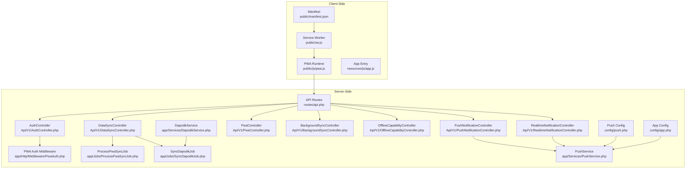

**Diagram sources**
- [sw.js](file://public/sw.js)
- [pwa.js](file://public/js/pwa.js)
- [manifest.json](file://public/manifest.json)
- [app.js](file://resources/js/app.js)
- [routes/api.php](file://routes/api.php)
- [app/Http/Middleware/PwaAuth.php](file://app/Http/Middleware/PwaAuth.php)
- [app/Jobs/ProcessPwaSyncJob.php](file://app/Jobs/ProcessPwaSyncJob.php)
- [app/Jobs/SyncDapodikJob.php](file://app/Jobs/SyncDapodikJob.php)
- [app/Services/PushService.php](file://app/Services/PushService.php)
- [app/Services/DapodikService.php](file://app/Services/DapodikService.php)
- [config/push.php](file://config/push.php)
- [config/app.php](file://config/app.php)

**Section sources**
- [sw.js](file://public/sw.js)
- [pwa.js](file://public/js/pwa.js)
- [manifest.json](file://public/manifest.json)
- [routes/api.php](file://routes/api.php)
- [config/push.php](file://config/push.php)
- [config/app.php](file://config/app.php)

## Core Components
- Service Worker: Handles caching strategies, background sync, and push event routing.
- PWA Runtime Script: Manages registration, update prompts, and offline-first behavior.
- Manifest: Defines PWA metadata for installability and appearance.
- API Controllers: Provide endpoints for authentication, data synchronization, push notifications, PWA capabilities, background sync, offline capabilities, and real-time notifications.
- Middleware: Enforces PWA-specific authentication and session handling.
- Jobs: Execute background synchronization tasks (e.g., PWA sync, Dapodik sync).
- Services: Encapsulate push notification delivery and Dapodik data synchronization logic.
- Models: Store push subscriptions and PWA tokens.
- Configuration: Define push notification provider settings and application behavior.

**Section sources**
- [sw.js](file://public/sw.js)
- [pwa.js](file://public/js/pwa.js)
- [manifest.json](file://public/manifest.json)
- [app/Http/Controllers/Api/V1/AuthController.php](file://app/Http/Controllers/Api/V1/AuthController.php)
- [app/Http/Controllers/Api/V1/DataSyncController.php](file://app/Http/Controllers/Api/V1/DataSyncController.php)
- [app/Http/Controllers/Api/V1/PushNotificationController.php](file://app/Http/Controllers/Api/V1/PushNotificationController.php)
- [app/Http/Controllers/Api/V1/PwaController.php](file://app/Http/Controllers/Api/V1/PwaController.php)
- [app/Http/Controllers/Api/V1/BackgroundSyncController.php](file://app/Http/Controllers/Api/V1/BackgroundSyncController.php)
- [app/Http/Controllers/Api/V1/OfflineCapabilityController.php](file://app/Http/Controllers/Api/V1/OfflineCapabilityController.php)
- [app/Http/Controllers/Api/V1/RealtimeNotificationController.php](file://app/Http/Controllers/Api/V1/RealtimeNotificationController.php)
- [app/Http/Middleware/PwaAuth.php](file://app/Http/Middleware/PwaAuth.php)
- [app/Jobs/ProcessPwaSyncJob.php](file://app/Jobs/ProcessPwaSyncJob.php)
- [app/Jobs/SyncDapodikJob.php](file://app/Jobs/SyncDapodikJob.php)
- [app/Services/PushService.php](file://app/Services/PushService.php)
- [app/Services/DapodikService.php](file://app/Services/DapodikService.php)
- [app/Models/PushSubscription.php](file://app/Models/PushSubscription.php)
- [app/Models/PwaToken.php](file://app/Models/PwaToken.php)
- [config/push.php](file://config/push.php)

## Architecture Overview
The PWA architecture integrates a service worker for offline caching and background sync, a client-side runtime for PWA features, and server-side controllers for API endpoints. Push notifications leverage a configured provider through a dedicated service. Background jobs handle asynchronous synchronization tasks. Real-time notifications are supported via push channels.

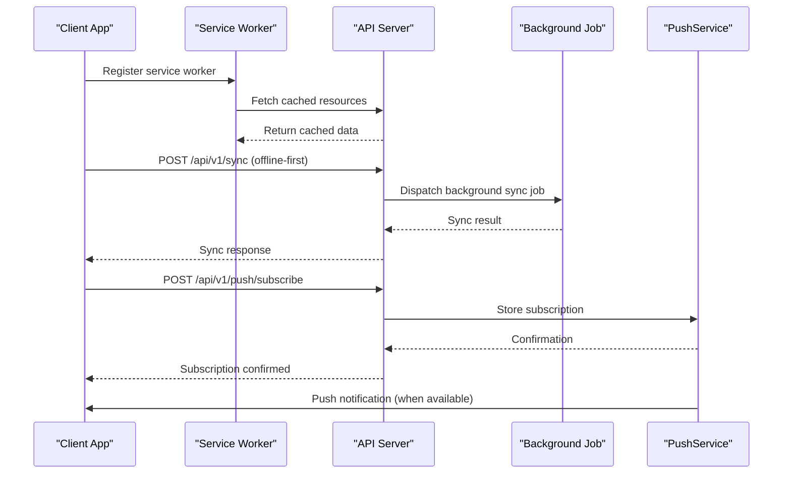

**Diagram sources**
- [sw.js](file://public/sw.js)
- [routes/api.php](file://routes/api.php)
- [app/Http/Controllers/Api/V1/DataSyncController.php](file://app/Http/Controllers/Api/V1/DataSyncController.php)
- [app/Http/Controllers/Api/V1/PushNotificationController.php](file://app/Http/Controllers/Api/V1/PushNotificationController.php)
- [app/Jobs/ProcessPwaSyncJob.php](file://app/Jobs/ProcessPwaSyncJob.php)
- [app/Services/PushService.php](file://app/Services/PushService.php)

## Detailed Component Analysis

### Service Worker Integration
The service worker manages caching strategies, background sync, and push event routing. It intercepts network requests, serves cached responses when offline, and coordinates with background sync jobs.

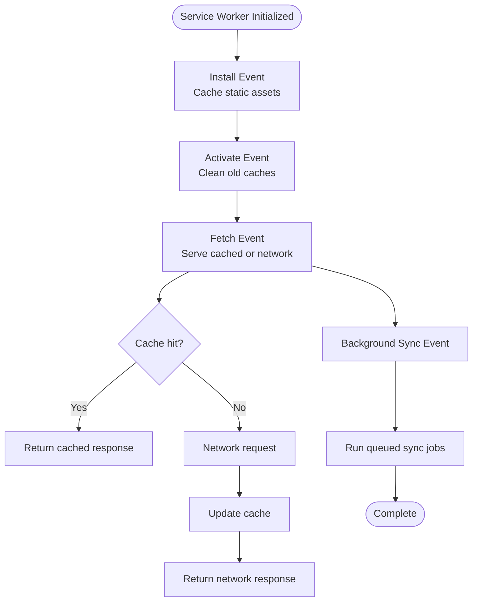

**Diagram sources**
- [sw.js](file://public/sw.js)

**Section sources**
- [sw.js](file://public/sw.js)

### PWA Runtime Script
The PWA runtime script handles registration, update prompts, and offline-first behavior. It ensures the app is ready for offline operation and notifies users of available updates.

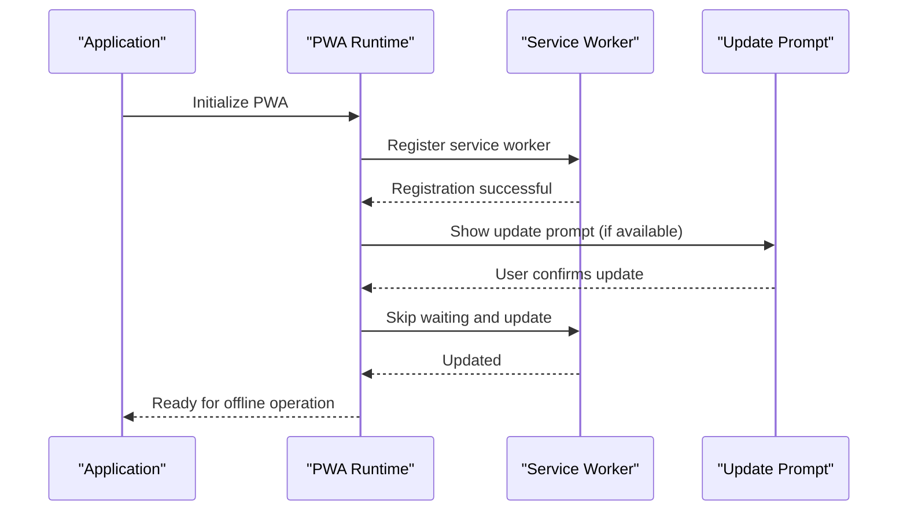

**Diagram sources**
- [pwa.js](file://public/js/pwa.js)
- [pwa.js](file://resources/js/pwa.js)

**Section sources**
- [pwa.js](file://public/js/pwa.js)
- [pwa.js](file://resources/js/pwa.js)

### Manifest Configuration
The manifest defines PWA metadata for installability and appearance, including icons, theme color, and display mode.

**Section sources**
- [manifest.json](file://public/manifest.json)

### Authentication and Session Management
PWA authentication relies on middleware to enforce session handling and secure access to protected endpoints.

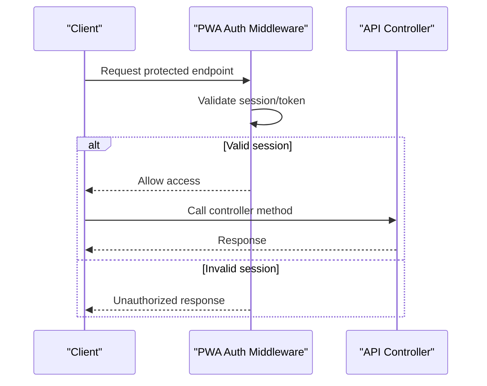

**Diagram sources**
- [app/Http/Middleware/PwaAuth.php](file://app/Http/Middleware/PwaAuth.php)
- [routes/api.php](file://routes/api.php)

**Section sources**
- [app/Http/Middleware/PwaAuth.php](file://app/Http/Middleware/PwaAuth.php)
- [routes/api.php](file://routes/api.php)

### Offline Synchronization Endpoints
Offline-first synchronization allows clients to submit data while offline and reconcile later when connectivity is restored.

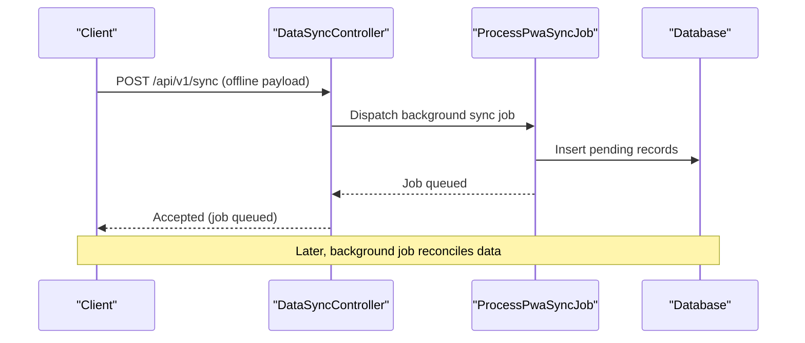

**Diagram sources**
- [app/Http/Controllers/Api/V1/DataSyncController.php](file://app/Http/Controllers/Api/V1/DataSyncController.php)
- [app/Jobs/ProcessPwaSyncJob.php](file://app/Jobs/ProcessPwaSyncJob.php)

**Section sources**
- [app/Http/Controllers/Api/V1/DataSyncController.php](file://app/Http/Controllers/Api/V1/DataSyncController.php)
- [app/Jobs/ProcessPwaSyncJob.php](file://app/Jobs/ProcessPwaSyncJob.php)

### Background Data Updates
Background sync jobs process pending synchronization tasks, ensuring data consistency across devices.

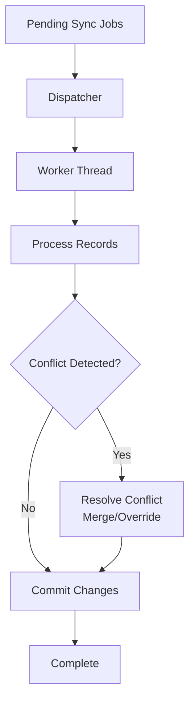

**Diagram sources**
- [app/Jobs/ProcessPwaSyncJob.php](file://app/Jobs/ProcessPwaSyncJob.php)

**Section sources**
- [app/Jobs/ProcessPwaSyncJob.php](file://app/Jobs/ProcessPwaSyncJob.php)

### Real-Time Notification APIs
Real-time notifications are delivered via push channels managed by the push service.

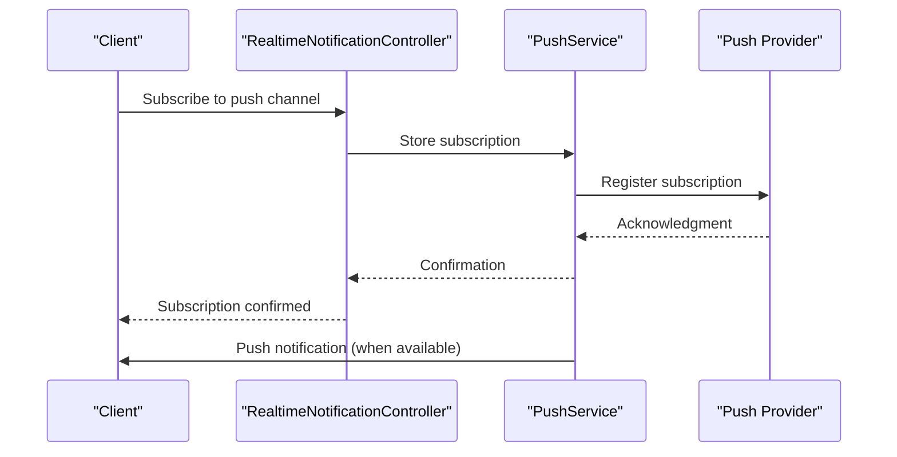

**Diagram sources**
- [app/Http/Controllers/Api/V1/RealtimeNotificationController.php](file://app/Http/Controllers/Api/V1/RealtimeNotificationController.php)
- [app/Services/PushService.php](file://app/Services/PushService.php)

**Section sources**
- [app/Http/Controllers/Api/V1/RealtimeNotificationController.php](file://app/Http/Controllers/Api/V1/RealtimeNotificationController.php)
- [app/Services/PushService.php](file://app/Services/PushService.php)

### Push Subscription Management
Push subscriptions are stored and managed through dedicated models and controllers.

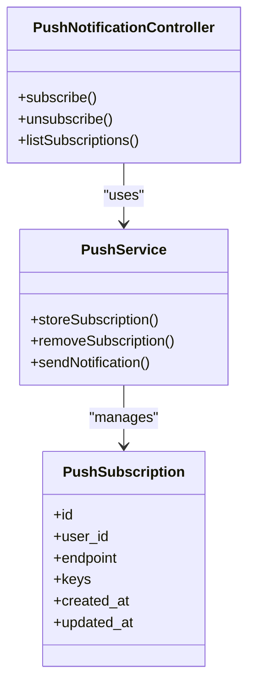

**Diagram sources**
- [app/Http/Controllers/Api/V1/PushNotificationController.php](file://app/Http/Controllers/Api/V1/PushNotificationController.php)
- [app/Services/PushService.php](file://app/Services/PushService.php)
- [app/Models/PushSubscription.php](file://app/Models/PushSubscription.php)

**Section sources**
- [app/Http/Controllers/Api/V1/PushNotificationController.php](file://app/Http/Controllers/Api/V1/PushNotificationController.php)
- [app/Services/PushService.php](file://app/Services/PushService.php)
- [app/Models/PushSubscription.php](file://app/Models/PushSubscription.php)

### Offline Capability APIs
Offline capability APIs enable clients to manage offline data, cache strategies, and recovery mechanisms.

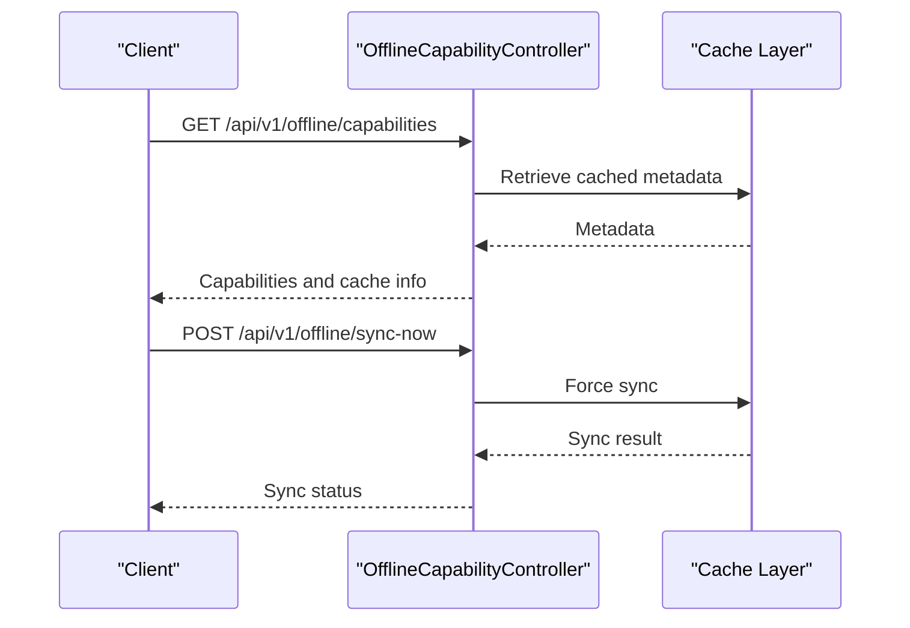

**Diagram sources**
- [app/Http/Controllers/Api/V1/OfflineCapabilityController.php](file://app/Http/Controllers/Api/V1/OfflineCapabilityController.php)

**Section sources**
- [app/Http/Controllers/Api/V1/OfflineCapabilityController.php](file://app/Http/Controllers/Api/V1/OfflineCapabilityController.php)

### Background Sync Jobs
Background sync jobs coordinate asynchronous data reconciliation and conflict resolution.

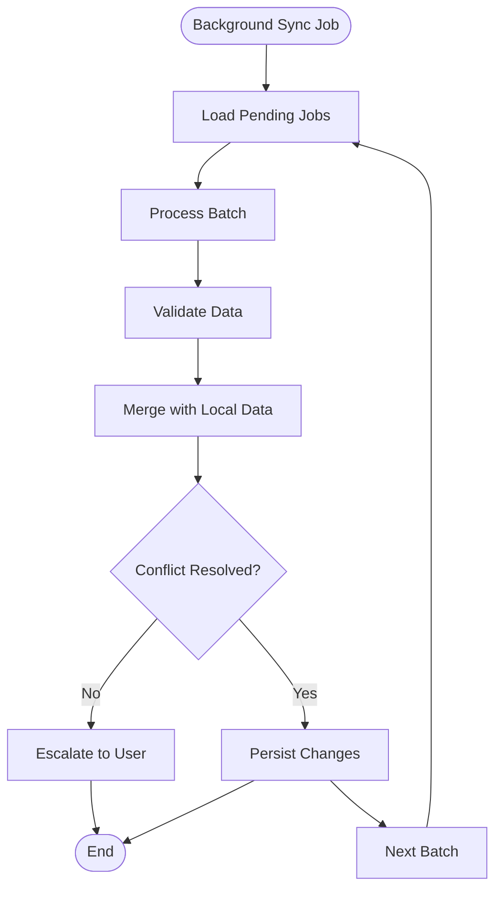

**Diagram sources**
- [app/Jobs/ProcessPwaSyncJob.php](file://app/Jobs/ProcessPwaSyncJob.php)

**Section sources**
- [app/Jobs/ProcessPwaSyncJob.php](file://app/Jobs/ProcessPwaSyncJob.php)

### Data Caching Strategies
Caching strategies ensure efficient offline access and reduce network overhead. The service worker implements cache-first policies for static assets and network fallback for dynamic data.

**Section sources**
- [sw.js](file://public/sw.js)

### Conflict Resolution Mechanisms
Conflict resolution prioritizes data integrity during concurrent edits. The system merges changes when possible and escalates conflicts requiring user intervention.

**Section sources**
- [app/Jobs/ProcessPwaSyncJob.php](file://app/Jobs/ProcessPwaSyncJob.php)

### Push Notification Delivery
Push notifications are delivered through a configured provider using the push service. Subscriptions are stored securely and associated with user contexts.

**Section sources**
- [app/Services/PushService.php](file://app/Services/PushService.php)
- [config/push.php](file://config/push.php)

### Subscription Lifecycle
The subscription lifecycle encompasses creation, updates, and removal of push subscriptions. Controllers and services manage these operations securely.

**Section sources**
- [app/Http/Controllers/Api/V1/PushNotificationController.php](file://app/Http/Controllers/Api/V1/PushNotificationController.php)
- [app/Services/PushService.php](file://app/Services/PushService.php)

### User Preference Management
User preferences for push notifications and offline behavior are persisted and synchronized across sessions. Preferences influence caching and notification delivery.

**Section sources**
- [app/Http/Controllers/Api/V1/PushNotificationController.php](file://app/Http/Controllers/Api/V1/PushNotificationController.php)
- [app/Http/Controllers/Api/V1/PwaController.php](file://app/Http/Controllers/Api/V1/PwaController.php)

### Examples of PWA Implementation
- Offline-first workflows: Clients submit data while offline; background jobs reconcile later.
- Real-time data synchronization: Push notifications inform clients of updates.
- Service worker caching: Static assets cached for fast load times and offline availability.

**Section sources**
- [sw.js](file://public/sw.js)
- [pwa.js](file://public/js/pwa.js)
- [app/Http/Controllers/Api/V1/DataSyncController.php](file://app/Http/Controllers/Api/V1/DataSyncController.php)
- [app/Http/Controllers/Api/V1/RealtimeNotificationController.php](file://app/Http/Controllers/Api/V1/RealtimeNotificationController.php)

## Dependency Analysis
The PWA and push notification system exhibits layered dependencies: client-side scripts depend on service worker logic; controllers depend on middleware and services; services depend on configuration and models; jobs encapsulate background processing.

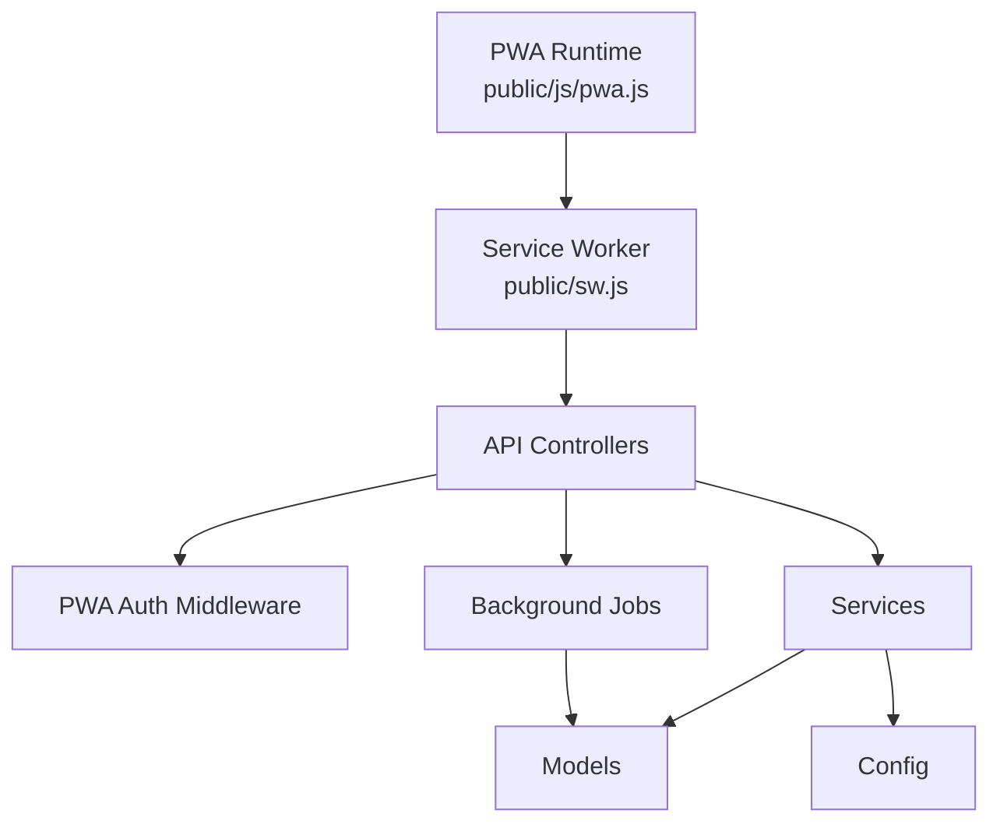

**Diagram sources**
- [pwa.js](file://public/js/pwa.js)
- [sw.js](file://public/sw.js)
- [routes/api.php](file://routes/api.php)
- [app/Http/Middleware/PwaAuth.php](file://app/Http/Middleware/PwaAuth.php)
- [app/Services/PushService.php](file://app/Services/PushService.php)
- [app/Models/PushSubscription.php](file://app/Models/PushSubscription.php)
- [config/push.php](file://config/push.php)

**Section sources**
- [routes/api.php](file://routes/api.php)
- [app/Http/Middleware/PwaAuth.php](file://app/Http/Middleware/PwaAuth.php)
- [app/Services/PushService.php](file://app/Services/PushService.php)
- [app/Models/PushSubscription.php](file://app/Models/PushSubscription.php)
- [config/push.php](file://config/push.php)

## Performance Considerations
- Minimize bundle sizes and leverage lazy loading for optimal mobile performance.
- Use efficient caching strategies to reduce bandwidth usage and improve load times.
- Implement background sync judiciously to avoid excessive battery drain on mobile devices.
- Optimize push notification frequency to balance user engagement and resource consumption.
- Employ compression and minification for assets served through the service worker.

## Troubleshooting Guide
Common issues and resolutions:
- Service worker not registering: Verify HTTPS deployment and correct scope configuration.
- Push notifications not received: Confirm subscription storage and provider credentials.
- Background sync failures: Check job queue health and retry policies.
- Offline data inconsistencies: Review conflict resolution logic and reconciliation procedures.

**Section sources**
- [sw.js](file://public/sw.js)
- [app/Services/PushService.php](file://app/Services/PushService.php)
- [app/Jobs/ProcessPwaSyncJob.php](file://app/Jobs/ProcessPwaSyncJob.php)

## Conclusion
The PWA and push notification system provides robust offline-first capabilities, real-time communication, and scalable background processing. By leveraging service workers, background jobs, and push services, the platform ensures reliable data synchronization and user engagement across diverse network conditions and device capabilities.