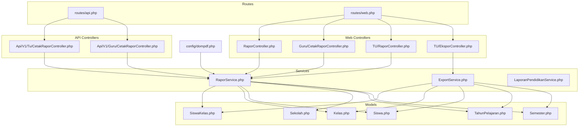
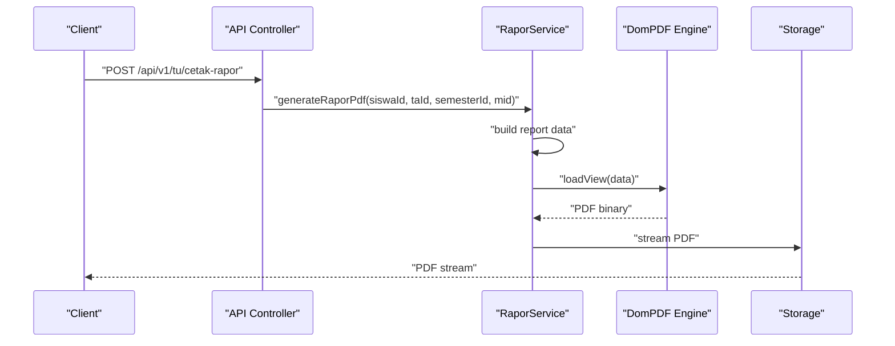
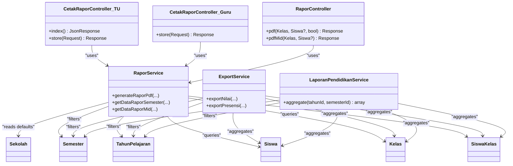

# Report Generation APIs

<cite>
**Referenced Files in This Document**
- [routes/api.php](file://routes/api.php)
- [routes/web.php](file://routes/web.php)
- [app/Http/Controllers/RaporController.php](file://app/Http/Controllers/RaporController.php)
- [app/Http/Controllers/Guru/CetakRaporController.php](file://app/Http/Controllers/Guru/CetakRaporController.php)
- [app/Http/Controllers/TU/RaporController.php](file://app/Http/Controllers/TU/RaporController.php)
- [app/Http/Controllers/Api/V1/Tu/CetakRaporController.php](file://app/Http/Controllers/Api/V1/Tu/CetakRaporController.php)
- [app/Http/Controllers/Api/V1/Guru/CetakRaporController.php](file://app/Http/Controllers/Api/V1/Guru/CetakRaporController.php)
- [app/Http/Controllers/TU/EksporController.php](file://app/Http/Controllers/TU/EksporController.php)
- [app/Services/RaporService.php](file://app/Services/RaporService.php)
- [app/Services/ExportService.php](file://app/Services/ExportService.php)
- [app/Services/LaporanPendidikanService.php](file://app/Services/LaporanPendidikanService.php)
- [app/Models/SiswaKelas.php](file://app/Models/SiswaKelas.php)
- [app/Models/Kelas.php](file://app/Models/Kelas.php)
- [app/Models/Siswa.php](file://app/Models/Siswa.php)
- [app/Models/Sekolah.php](file://app/Models/Sekolah.php)
- [app/Models/TahunPelajaran.php](file://app/Models/TahunPelajaran.php)
- [app/Models/Semester.php](file://app/Models/Semester.php)
- [config/dompdf.php](file://config/dompdf.php)
- [tests/Feature/Api/V1/TuCetakRaporTest.php](file://tests/Feature/Api/V1/TuCetakRaporTest.php)
- [tests/Unit/Services/ExportServiceTest.php](file://tests/Unit/Services/ExportServiceTest.php)
- [tests/Feature/Ekspor/SiswaExportTest.php](file://tests/Feature/Ekspor/SiswaExportTest.php)
- [tests/Feature/Laporan/PendidikanTest.php](file://tests/Feature/Laporan/PendidikanTest.php)
</cite>

## Table of Contents
1. [Introduction](#introduction)
2. [Project Structure](#project-structure)
3. [Core Components](#core-components)
4. [Architecture Overview](#architecture-overview)
5. [Detailed Component Analysis](#detailed-component-analysis)
6. [Dependency Analysis](#dependency-analysis)
7. [Performance Considerations](#performance-considerations)
8. [Troubleshooting Guide](#troubleshooting-guide)
9. [Conclusion](#conclusion)
10. [Appendices](#appendices)

## Introduction
This document provides comprehensive API documentation for report generation and export functionality. It covers:
- Academic report creation (progress summaries and semester/mid-term reports)
- Institutional analytics dashboards
- PDF generation APIs and Excel export endpoints
- Batch report processing and ZIP packaging
- Real-time report creation via web and API controllers
- Report parameters, filtering options, and formatting controls
- Examples of customization, data aggregation, and multi-format output
- Performance optimization, caching strategies, and concurrent processing capabilities

## Project Structure
The report generation system spans web and API controllers, dedicated services, model relationships, and configuration for PDF rendering. Key areas:
- Web controllers for interactive report generation and viewing
- API controllers for programmatic report creation and batch operations
- Services encapsulating report logic and export routines
- Routes exposing endpoints for reports and exports
- Configuration for PDF engine and DOM rendering

**Diagram sources**
- [routes/api.php](file://routes/api.php)
- [routes/web.php](file://routes/web.php)
- [app/Http/Controllers/RaporController.php](file://app/Http/Controllers/RaporController.php)
- [app/Http/Controllers/Guru/CetakRaporController.php](file://app/Http/Controllers/Guru/CetakRaporController.php)
- [app/Http/Controllers/TU/RaporController.php](file://app/Http/Controllers/TU/RaporController.php)
- [app/Http/Controllers/Api/V1/Tu/CetakRaporController.php](file://app/Http/Controllers/Api/V1/Tu/CetakRaporController.php)
- [app/Http/Controllers/Api/V1/Guru/CetakRaporController.php](file://app/Http/Controllers/Api/V1/Guru/CetakRaporController.php)
- [app/Http/Controllers/TU/EksporController.php](file://app/Http/Controllers/TU/EksporController.php)
- [app/Services/RaporService.php](file://app/Services/RaporService.php)
- [app/Services/ExportService.php](file://app/Services/ExportService.php)
- [app/Services/LaporanPendidikanService.php](file://app/Services/LaporanPendidikanService.php)
- [app/Models/SiswaKelas.php](file://app/Models/SiswaKelas.php)
- [app/Models/Kelas.php](file://app/Models/Kelas.php)
- [app/Models/Siswa.php](file://app/Models/Siswa.php)
- [app/Models/Sekolah.php](file://app/Models/Sekolah.php)
- [app/Models/TahunPelajaran.php](file://app/Models/TahunPelajaran.php)
- [app/Models/Semester.php](file://app/Models/Semester.php)
- [config/dompdf.php](file://config/dompdf.php)

**Section sources**
- [routes/api.php](file://routes/api.php)
- [routes/web.php](file://routes/web.php)

## Core Components
- Report Controllers
  - Web controllers handle interactive report generation and analytics:
    - [RaporController.php](file://app/Http/Controllers/RaporController.php)
    - [Guru/CetakRaporController.php](file://app/Http/Controllers/Guru/CetakRaporController.php)
    - [TU/RaporController.php](file://app/Http/Controllers/TU/RaporController.php)
  - API controllers enable programmatic report creation:
    - [Api/V1/Tu/CetakRaporController.php](file://app/Http/Controllers/Api/V1/Tu/CetakRaporController.php)
    - [Api/V1/Guru/CetakRaporController.php](file://app/Http/Controllers/Api/V1/Guru/CetakRaporController.php)
- Export Controller
  - [TU/EksporController.php](file://app/Http/Controllers/TU/EksporController.php) exposes endpoints for Excel exports and analytics views
- Services
  - [RaporService.php](file://app/Services/RaporService.php) orchestrates report data retrieval and PDF generation
  - [ExportService.php](file://app/Services/ExportService.php) handles Excel exports and aggregations
  - [LaporanPendidikanService.php](file://app/Services/LaporanPendidikanService.php) aggregates institutional analytics
- Models and Configuration
  - [SiswaKelas.php](file://app/Models/SiswaKelas.php), [Kelas.php](file://app/Models/Kelas.php), [Siswa.php](file://app/Models/Siswa.php), [Sekolah.php](file://app/Models/Sekolah.php), [TahunPelajaran.php](file://app/Models/TahunPelajaran.php), [Semester.php](file://app/Models/Semester.php)
  - [config/dompdf.php](file://config/dompdf.php) configures PDF rendering

**Section sources**
- [app/Http/Controllers/RaporController.php](file://app/Http/Controllers/RaporController.php)
- [app/Http/Controllers/Guru/CetakRaporController.php](file://app/Http/Controllers/Guru/CetakRaporController.php)
- [app/Http/Controllers/TU/RaporController.php](file://app/Http/Controllers/TU/RaporController.php)
- [app/Http/Controllers/Api/V1/Tu/CetakRaporController.php](file://app/Http/Controllers/Api/V1/Tu/CetakRaporController.php)
- [app/Http/Controllers/Api/V1/Guru/CetakRaporController.php](file://app/Http/Controllers/Api/V1/Guru/CetakRaporController.php)
- [app/Http/Controllers/TU/EksporController.php](file://app/Http/Controllers/TU/EksporController.php)
- [app/Services/RaporService.php](file://app/Services/RaporService.php)
- [app/Services/ExportService.php](file://app/Services/ExportService.php)
- [app/Services/LaporanPendidikanService.php](file://app/Services/LaporanPendidikanService.php)
- [config/dompdf.php](file://config/dompdf.php)

## Architecture Overview
The system separates concerns across controllers, services, and models:
- Controllers accept requests and delegate to services
- Services encapsulate report logic and data aggregation
- Models define relationships and scopes for filtering
- Configuration governs PDF rendering behavior

**Diagram sources**
- [app/Http/Controllers/Api/V1/Tu/CetakRaporController.php](file://app/Http/Controllers/Api/V1/Tu/CetakRaporController.php)
- [app/Services/RaporService.php](file://app/Services/RaporService.php)
- [config/dompdf.php](file://config/dompdf.php)

## Detailed Component Analysis

### Academic Reports: Semester and Mid-Term
- Purpose: Generate individual student academic reports in PDF format
- Controllers
  - Web: [RaporController.php](file://app/Http/Controllers/RaporController.php) supports both semester and mid-term variants
  - Guru: [Guru/CetakRaporController.php](file://app/Http/Controllers/Guru/CetakRaporController.php) provides single and batch PDF generation
  - TU: [TU/RaporController.php](file://app/Http/Controllers/TU/RaporController.php) offers similar functionality for administrative use
- Service
  - [RaporService.php](file://app/Services/RaporService.php) builds report data and delegates PDF generation
- Models
  - [Siswa.php](file://app/Models/Siswa.php), [Kelas.php](file://app/Models/Kelas.php), [SiswaKelas.php](file://app/Models/SiswaKelas.php), [Sekolah.php](file://app/Models/Sekolah.php), [TahunPelajaran.php](file://app/Models/TahunPelajaran.php), [Semester.php](file://app/Models/Semester.php)
- Configuration
  - [config/dompdf.php](file://config/dompdf.php) defines paper size and rendering options

Endpoints
- GET /rapor/pdf/{kelas}[/{siswa}][?mid=true]
  - Description: Generate a semester report for a class or specific student
  - Authentication: Required
  - Authorization: Based on role and class enrollment
  - Query Parameters:
    - mid: Boolean flag to switch to mid-term report
  - Response: PDF stream
- GET /rapor/pdf/mid/{kelas}[/{siswa}]
  - Description: Generate mid-term report for a class or specific student
  - Response: PDF stream

Parameters and Filtering
- Class filter: {kelas}
- Student filter: {siswa} (optional)
- Academic year and semester: resolved from session or school defaults
- Mid-term toggle: mid query parameter

Formatting Controls
- Paper size: A4 portrait
- Template selection: semester vs mid-term views

Real-Time Generation
- Single student: Immediate PDF stream
- Batch generation: Creates a ZIP archive containing individual PDFs

**Section sources**
- [app/Http/Controllers/RaporController.php](file://app/Http/Controllers/RaporController.php)
- [app/Http/Controllers/Guru/CetakRaporController.php](file://app/Http/Controllers/Guru/CetakRaporController.php)
- [app/Services/RaporService.php](file://app/Services/RaporService.php)
- [app/Models/Siswa.php](file://app/Models/Siswa.php)
- [app/Models/Kelas.php](file://app/Models/Kelas.php)
- [app/Models/SiswaKelas.php](file://app/Models/SiswaKelas.php)
- [app/Models/Sekolah.php](file://app/Models/Sekolah.php)
- [app/Models/TahunPelajaran.php](file://app/Models/TahunPelajaran.php)
- [app/Models/Semester.php](file://app/Models/Semester.php)
- [config/dompdf.php](file://config/dompdf.php)

### API: Batch Report Creation (TU)
- Endpoint
  - GET /api/v1/tu/cetak-rapor
    - Description: List active students eligible for report generation
    - Response: JSON array of student identifiers and class info
  - POST /api/v1/tu/cetak-rapor
    - Description: Trigger batch report generation for selected students
    - Request Body: Array of student IDs and report type (semester/mid)
    - Response: ZIP archive download containing generated PDFs
- Validation
  - Active student enrollment check
  - Required fields validation
- Security
  - Requires authenticated user with proper role

Example Request
- POST /api/v1/tu/cetak-rapor
  - Headers: Authorization: Bearer {token}, Accept: application/json
  - Body: { "siswa_ids": [1, 2, 3], "jenis": "semester", "ta_id": 1, "semester_id": 1 }

Example Response
- 200 OK with Content-Disposition: attachment; filename=Rapor-Semester_Class.zip
- ZIP file contains individual PDFs named by student

**Section sources**
- [app/Http/Controllers/Api/V1/Tu/CetakRaporController.php](file://app/Http/Controllers/Api/V1/Tu/CetakRaporController.php)
- [tests/Feature/Api/V1/TuCetakRaporTest.php](file://tests/Feature/Api/V1/TuCetakRaporTest.php)

### API: Batch Report Creation (Guru)
- Endpoint
  - POST /api/v1/guru/cetak-rapor
    - Description: Generate reports for a set of students assigned to the teacher
    - Request Body: Array of student IDs, report type, academic year, and semester
    - Response: ZIP archive download
- Validation
  - Teacher’s class and subject enrollment checks
  - Required fields validation

Example Request
- POST /api/v1/guru/cetak-rapor
  - Headers: Authorization: Bearer {token}, Accept: application/json
  - Body: { "siswa_ids": [1, 2, 3], "jenis": "mid", "ta_id": 1, "semester_id": 1 }

**Section sources**
- [app/Http/Controllers/Api/V1/Guru/CetakRaporController.php](file://app/Http/Controllers/Api/V1/Guru/CetakRaporController.php)

### Institutional Analytics
- Endpoint
  - GET /tu/laporan/pendidikan
    - Description: Render analytics dashboard for academic performance
    - Query Parameters:
      - tahun: Integer (academic year ID)
      - semester: Integer (semester ID)
    - Response: HTML view with aggregated metrics
- Aggregation
  - [LaporanPendidikanService.php](file://app/Services/LaporanPendidikanService.php) computes:
    - Average scores per subject
    - Grade distribution
    - Top and bottom performing students
    - Attendance summary by absence type

Example Request
- GET /tu/laporan/pendidikan?tahun=1&semester=1

**Section sources**
- [app/Http/Controllers/TU/LaporanController.php](file://app/Http/Controllers/TU/LaporanController.php)
- [app/Services/LaporanPendidikanService.php](file://app/Services/LaporanPendidikanService.php)
- [tests/Feature/Laporan/PendidikanTest.php](file://tests/Feature/Laporan/PendidikanTest.php)

### Excel Export Endpoints
- Endpoint
  - GET /tu/ekspor/nilai
    - Description: Export class subject scores to Excel
    - Query Parameters:
      - kelas_id: Integer (required)
      - mapel_id: Integer (required)
      - tahun: Integer (required)
      - semester: Integer (required)
    - Response: application/vnd.openxmlformats-officedocument.spreadsheetml.sheet
- Additional Exports
  - [TU/EksporController.php](file://app/Http/Controllers/TU/EksporController.php) provides export scaffolding for other datasets (e.g., student lists)

Example Request
- GET /tu/ekspor/nilai?kelas_id=1&mapel_id=1&tahun=1&semester=1

**Section sources**
- [app/Http/Controllers/TU/EksporController.php](file://app/Http/Controllers/TU/EksporController.php)
- [tests/Unit/Services/ExportServiceTest.php](file://tests/Unit/Services/ExportServiceTest.php)
- [tests/Feature/Ekspor/SiswaExportTest.php](file://tests/Feature/Ekspor/SiswaExportTest.php)

### Report Templates and Customization
- PDF Templates
  - Semester template: rendered via DomPDF using a semester-specific view
  - Mid-term template: rendered via DomPDF using a mid-term view
- Customization Options
  - Paper size: A4 portrait
  - Filename pattern: rapor-{student_name}.pdf or Rapor-{Type}-{Class}.zip
  - Data composition: driven by [RaporService.php](file://app/Services/RaporService.php)

**Section sources**
- [app/Services/RaporService.php](file://app/Services/RaporService.php)
- [config/dompdf.php](file://config/dompdf.php)

### Data Aggregation and Multi-Format Output
- Aggregation
  - Class enrollment and active student counts
  - Subject-wise averages and grade distributions
  - Attendance summaries grouped by absence type
- Multi-Format Output
  - PDF: Individual and batch generation
  - Excel: Structured spreadsheets for analytics and records

**Section sources**
- [app/Services/LaporanPendidikanService.php](file://app/Services/LaporanPendidikanService.php)
- [app/Services/ExportService.php](file://app/Services/ExportService.php)

## Dependency Analysis

**Diagram sources**
- [app/Http/Controllers/Api/V1/Tu/CetakRaporController.php](file://app/Http/Controllers/Api/V1/Tu/CetakRaporController.php)
- [app/Http/Controllers/Api/V1/Guru/CetakRaporController.php](file://app/Http/Controllers/Api/V1/Guru/CetakRaporController.php)
- [app/Http/Controllers/RaporController.php](file://app/Http/Controllers/RaporController.php)
- [app/Services/RaporService.php](file://app/Services/RaporService.php)
- [app/Services/ExportService.php](file://app/Services/ExportService.php)
- [app/Services/LaporanPendidikanService.php](file://app/Services/LaporanPendidikanService.php)
- [app/Models/SiswaKelas.php](file://app/Models/SiswaKelas.php)
- [app/Models/Kelas.php](file://app/Models/Kelas.php)
- [app/Models/Siswa.php](file://app/Models/Siswa.php)
- [app/Models/Sekolah.php](file://app/Models/Sekolah.php)
- [app/Models/TahunPelajaran.php](file://app/Models/TahunPelajaran.php)
- [app/Models/Semester.php](file://app/Models/Semester.php)

**Section sources**
- [app/Services/RaporService.php](file://app/Services/RaporService.php)
- [app/Services/ExportService.php](file://app/Services/ExportService.php)
- [app/Services/LaporanPendidikanService.php](file://app/Services/LaporanPendidikanService.php)

## Performance Considerations
- Batch Processing
  - Prefer ZIP packaging for batch downloads to reduce server overhead and client-side latency
  - Stream PDFs directly to avoid storing temporary files on disk when possible
- Concurrency
  - Offload heavy report generation to queued jobs for high-volume scenarios
  - Use separate workers for PDF generation and export tasks
- Caching
  - Cache frequently accessed report metadata (e.g., active students, class lists)
  - Cache aggregated analytics results per academic year/semester
- Database Optimization
  - Use eager loading (with relations) to minimize N+1 queries
  - Filter by academic year and semester to limit dataset size
- Rendering
  - Tune DomPDF settings for memory usage and rendering speed
  - Minimize complex layouts and external assets in PDF templates

[No sources needed since this section provides general guidance]

## Troubleshooting Guide
Common issues and resolutions:
- Unauthorized Access
  - Ensure the requesting user has appropriate roles and class/subject enrollment
  - Verify session-bound academic year and semester selections
- Missing Parameters
  - Validate presence of required fields (kelas_id, mapel_id, tahun, semester)
  - Confirm numeric IDs exist in respective lookup tables
- Large Batch Failures
  - Split batches into smaller chunks
  - Monitor memory usage during PDF generation
- Export Content-Type Issues
  - Confirm correct MIME type for Excel exports
  - Ensure Content-Disposition header is set for downloads

**Section sources**
- [tests/Feature/Api/V1/TuCetakRaporTest.php](file://tests/Feature/Api/V1/TuCetakRaporTest.php)
- [tests/Unit/Services/ExportServiceTest.php](file://tests/Unit/Services/ExportServiceTest.php)
- [tests/Feature/Ekspor/SiswaExportTest.php](file://tests/Feature/Ekspor/SiswaExportTest.php)
- [tests/Feature/Laporan/PendidikanTest.php](file://tests/Feature/Laporan/PendidikanTest.php)

## Conclusion
The report generation system provides robust APIs and controllers for academic and institutional reporting. It supports real-time PDF generation, batch processing with ZIP packaging, and Excel exports. Services encapsulate report logic and aggregation, while configuration ensures consistent PDF rendering. By leveraging caching, concurrency, and optimized queries, the system scales effectively for large-scale deployments.

[No sources needed since this section summarizes without analyzing specific files]

## Appendices

### Endpoint Reference Summary
- GET /rapor/pdf/{kelas}[/{siswa}][?mid=true]
  - Generate semester or mid-term report
- GET /rapor/pdf/mid/{kelas}[/{siswa}]
  - Generate mid-term report
- GET /api/v1/tu/cetak-rapor
  - List active students
- POST /api/v1/tu/cetak-rapor
  - Batch generate reports and return ZIP
- POST /api/v1/guru/cetak-rapor
  - Batch generate reports for teacher’s class
- GET /tu/ekspor/nilai
  - Export subject scores to Excel
- GET /tu/laporan/pendidikan
  - Render analytics dashboard

**Section sources**
- [app/Http/Controllers/RaporController.php](file://app/Http/Controllers/RaporController.php)
- [app/Http/Controllers/Api/V1/Tu/CetakRaporController.php](file://app/Http/Controllers/Api/V1/Tu/CetakRaporController.php)
- [app/Http/Controllers/Api/V1/Guru/CetakRaporController.php](file://app/Http/Controllers/Api/V1/Guru/CetakRaporController.php)
- [app/Http/Controllers/TU/EksporController.php](file://app/Http/Controllers/TU/EksporController.php)
- [app/Http/Controllers/TU/LaporanController.php](file://app/Http/Controllers/TU/LaporanController.php)