# System Management APIs

<cite>
**Referenced Files in This Document**
- [routes/api.php](file://routes/api.php)
- [routes/web.php](file://routes/web.php)
- [app/Http/Controllers/Api/V1/AuthController.php](file://app/Http/Controllers/Api/V1/AuthController.php)
- [app/Http/Controllers/Api/V1/ProfileController.php](file://app/Http/Controllers/Api/V1/ProfileController.php)
- [app/Http/Controllers/Api/V1/SekolahController.php](file://app/Http/Controllers/Api/V1/SekolahController.php)
- [app/Http/Controllers/Api/V1/ReferensiController.php](file://app/Http/Controllers/Api/V1/ReferensiController.php)
- [app/Http/Controllers/Api/V1/Tu/DashboardController.php](file://app/Http/Controllers/Api/V1/Tu/DashboardController.php)
- [app/Http/Controllers/Api/V1/Tu/KelasController.php](file://app/Http/Controllers/Api/V1/Tu/KelasController.php)
- [app/Http/Controllers/Api/V1/Tu/AnggotaKelasController.php](file://app/Http/Controllers/Api/V1/Tu/AnggotaKelasController.php)
- [app/Http/Controllers/Api/V1/Tu/EkstraController.php](file://app/Http/Controllers/Api/V1/Tu/EkstraController.php)
- [app/Http/Controllers/Api/V1/Tu/CetakRaporController.php](file://app/Http/Controllers/Api/V1/Tu/CetakRaporController.php)
- [app/Http/Controllers/Api/V1/Guru/DashboardController.php](file://app/Http/Controllers/Api/V1/Guru/DashboardController.php)
- [app/Http/Controllers/Api/V1/Guru/KelasKuController.php](file://app/Http/Controllers/Api/V1/Guru/KelasKuController.php)
- [app/Http/Controllers/Api/V1/Guru/PenilaianController.php](file://app/Http/Controllers/Api/V1/Guru/PenilaianController.php)
- [app/Http/Controllers/Api/V1/Guru/CatatanRaporController.php](file://app/Http/Controllers/Api/V1/Guru/CatatanRaporController.php)
- [app/Http/Controllers/Api/V1/Guru/CetakRaporController.php](file://app/Http/Controllers/Api/V1/Guru/CetakRaporController.php)
- [app/Http/Controllers/Api/PwaAuthController.php](file://app/Http/Controllers/Api/PwaAuthController.php)
- [app/Http/Controllers/Api/PwaPushController.php](file://app/Http/Controllers/Api/PwaPushController.php)
- [app/Http/Controllers/Api/PwaSyncController.php](file://app/Http/Controllers/Api/PwaSyncController.php)
- [app/Services/DapodikService.php](file://app/Services/DapodikService.php)
- [app/Services/Dapodik/SiswaSyncService.php](file://app/Services/Dapodik/SiswaSyncService.php)
- [app/Services/Dapodik/GtkSyncService.php](file://app/Services/Dapodik/GtkSyncService.php)
- [app/Services/Dapodik/SekolahSyncService.php](file://app/Services/Dapodik/SekolahSyncService.php)
- [app/Jobs/SyncDapodikJob.php](file://app/Jobs/SyncDapodikJob.php)
- [app/Models/DapodikSyncLog.php](file://app/Models/DapodikSyncLog.php)
- [app/Services/ExportService.php](file://app/Services/ExportService.php)
- [app/Services/ImportService.php](file://app/Services/ImportService.php)
- [app/Http/Middleware/EnsureRole.php](file://app/Http/Middleware/EnsureRole.php)
- [app/Http/Resources/V1/SiswaResource.php](file://app/Http/Resources/V1/SiswaResource.php)
- [app/Http/Resources/V1/KelasResource.php](file://app/Http/Resources/V1/KelasResource.php)
- [app/Http/Resources/V1/MapelResource.php](file://app/Http/Resources/V1/MapelResource.php)
- [app/Http/Resources/V1/RefResource.php](file://app/Http/Resources/V1/RefResource.php)
- [app/Http/Resources/V1/SekolahResource.php](file://app/Http/Resources/V1/SekolahResource.php)
- [app/Http/Resources/V1/UserResource.php](file://app/Http/Resources/V1/UserResource.php)
- [config/activitylog.php](file://config/activitylog.php)
- [scripts/backup-db.sh](file://scripts/backup-db.sh)
- [database/migrations/2026_06_02_040000_create_dapodik_sync_logs_table.php](file://database/migrations/2026_06_02_040000_create_dapodik_sync_logs_table.php)
- [database/migrations/2026_06_01_010810_create_settings_table.php](file://database/migrations/2026_06_01_010810_create_settings_table.php)
- [database/seeders/RolePermissionSeeder.php](file://database/seeders/RolePermissionSeeder.php)
- [test_results.txt](file://test_results.txt)
</cite>

## Table of Contents
1. [Introduction](#introduction)
2. [Project Structure](#project-structure)
3. [Core Components](#core-components)
4. [Architecture Overview](#architecture-overview)
5. [Detailed Component Analysis](#detailed-component-analysis)
6. [Dependency Analysis](#dependency-analysis)
7. [Performance Considerations](#performance-considerations)
8. [Troubleshooting Guide](#troubleshooting-guide)
9. [Conclusion](#conclusion)
10. [Appendices](#appendices)

## Introduction
This document provides comprehensive API documentation for system administration and configuration endpoints. It covers reference data management, user profile operations, system settings, and data synchronization APIs. It also documents administrative workflows, permission management, audit trail APIs, Dapodik data integration, data export/import operations, and system maintenance functions. Examples of system setup, configuration management, and integration with external educational systems are included, along with security considerations, backup operations, and disaster recovery APIs.

## Project Structure
The API surface is organized under:
- REST API v1 routes grouped by role and functional domain
- PWA-specific endpoints for authentication, push notifications, and background sync
- Administrative endpoints exposed via web routes for settings, backups, restores, and Dapodik sync
- Resource classes for standardized JSON responses
- Middleware for role enforcement and authentication
- Services and jobs for Dapodik integration and background tasks
- Migration and seeders for settings and Dapodik sync logs

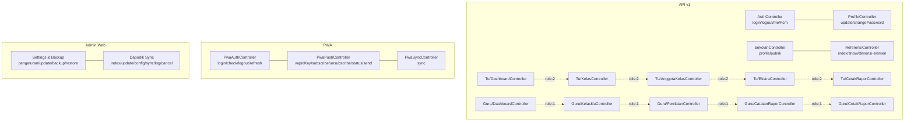

**Diagram sources**
- [routes/api.php:64-92](file://routes/api.php#L64-L92)
- [routes/web.php:98-193](file://routes/web.php#L98-L193)

**Section sources**
- [routes/api.php:64-92](file://routes/api.php#L64-L92)
- [routes/web.php:98-193](file://routes/web.php#L98-L193)

## Core Components
- Authentication and Authorization
  - Sanctum-protected endpoints for authenticated users
  - Role middleware to restrict access by user roles
- Reference Data Management
  - Public reference endpoints for curriculum, dimensions, and elements
- User Profile Operations
  - Profile updates and password change endpoints
- System Settings and Maintenance
  - Settings retrieval and update, push notification triggers, backup and restore
- Data Synchronization (Dapodik)
  - Batch sync orchestration, job dispatch, and log management
- Export/Import Operations
  - Export and import services for reports and data
- Audit Trail
  - Activity logging configuration for auditable actions

**Section sources**
- [routes/api.php:64-92](file://routes/api.php#L64-L92)
- [app/Http/Middleware/EnsureRole.php:1-50](file://app/Http/Middleware/EnsureRole.php#L1-L50)
- [config/activitylog.php:1-120](file://config/activitylog.php#L1-L120)

## Architecture Overview
The system exposes two primary API surfaces:
- REST API v1 for mobile/web clients with role-based access
- PWA endpoints for offline-capable clients with push notifications and background sync
Administrative functions are primarily web-based with dedicated routes for settings, backup/restore, and Dapodik sync.

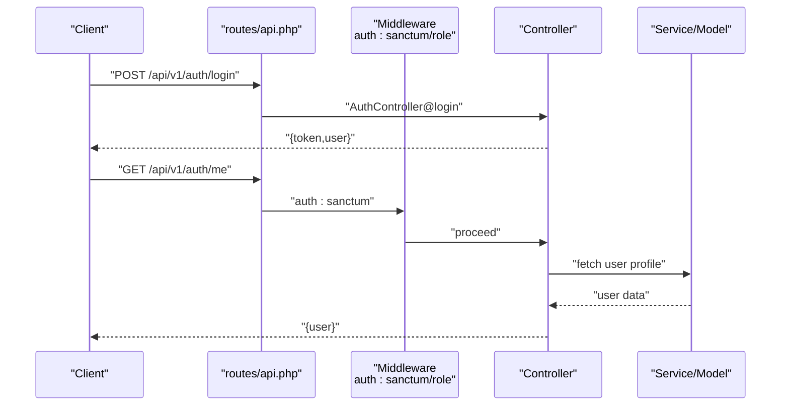

**Diagram sources**
- [routes/api.php:64-92](file://routes/api.php#L64-L92)
- [app/Http/Controllers/Api/V1/AuthController.php:1-120](file://app/Http/Controllers/Api/V1/AuthController.php#L1-L120)

## Detailed Component Analysis

### Authentication and Authorization
- Public login with rate limiting
- Sanctum-protected user info and logout
- FCM registration/unregistration
- Role middleware for restricting endpoints to specific roles

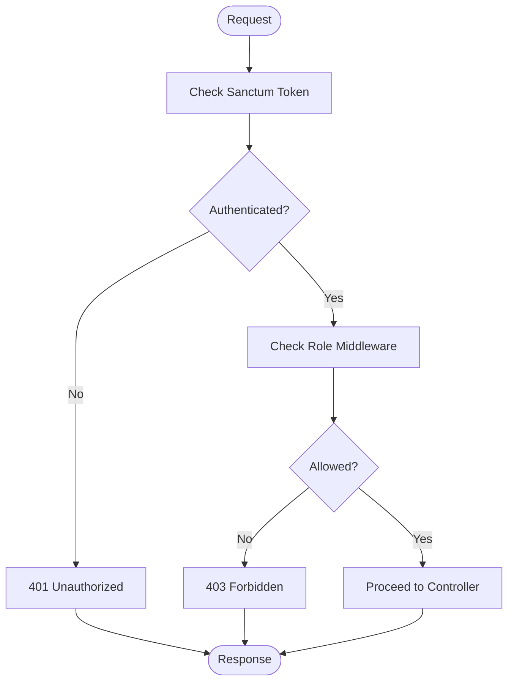

**Diagram sources**
- [routes/api.php:64-92](file://routes/api.php#L64-L92)
- [app/Http/Middleware/EnsureRole.php:1-50](file://app/Http/Middleware/EnsureRole.php#L1-L50)

**Section sources**
- [routes/api.php:64-92](file://routes/api.php#L64-L92)
- [app/Http/Middleware/EnsureRole.php:1-50](file://app/Http/Middleware/EnsureRole.php#L1-L50)

### Reference Data Management
- Retrieve all reference categories and items
- Fetch curriculum dimensions with associated elements
- Get individual reference item by slug

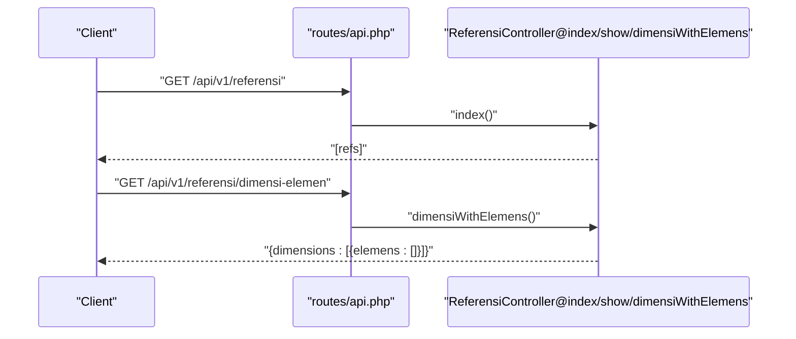

**Diagram sources**
- [routes/api.php:85-89](file://routes/api.php#L85-L89)
- [app/Http/Controllers/Api/V1/ReferensiController.php:1-200](file://app/Http/Controllers/Api/V1/ReferensiController.php#L1-L200)

**Section sources**
- [routes/api.php:85-89](file://routes/api.php#L85-L89)
- [app/Http/Controllers/Api/V1/ReferensiController.php:1-200](file://app/Http/Controllers/Api/V1/ReferensiController.php#L1-L200)

### User Profile Operations
- Update profile details
- Change password

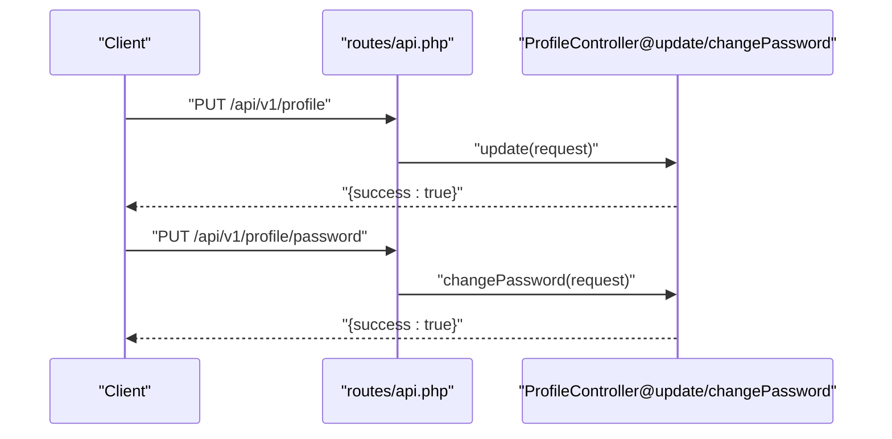

**Diagram sources**
- [routes/api.php:78-81](file://routes/api.php#L78-L81)
- [app/Http/Controllers/Api/V1/ProfileController.php:1-120](file://app/Http/Controllers/Api/V1/ProfileController.php#L1-L120)

**Section sources**
- [routes/api.php:78-81](file://routes/api.php#L78-L81)
- [app/Http/Controllers/Api/V1/ProfileController.php:1-120](file://app/Http/Controllers/Api/V1/ProfileController.php#L1-L120)

### System Settings and Maintenance
- Retrieve and update system settings
- Trigger push notifications (TU only)
- Backup and restore operations
- Set active semester

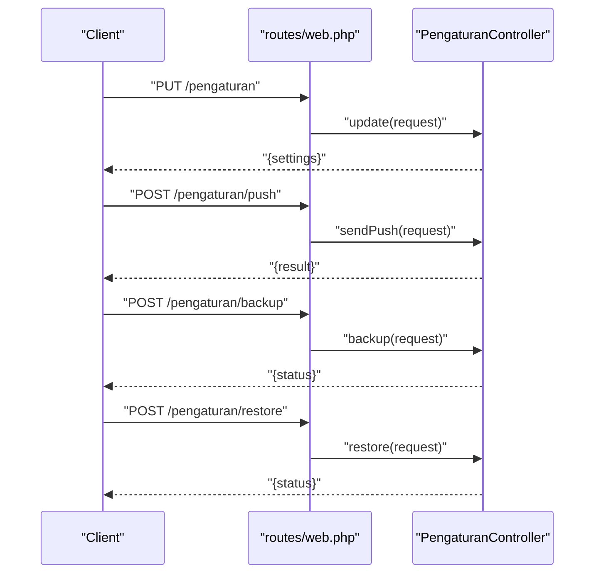

**Diagram sources**
- [routes/web.php:105-110](file://routes/web.php#L105-L110)

**Section sources**
- [routes/web.php:105-110](file://routes/web.php#L105-L110)

### Academic Calendars and Curriculum Structures
- School profile and public school listing
- Manage classes and student enrollment
- Manage extracurricular activities
- Generate reports and certificates

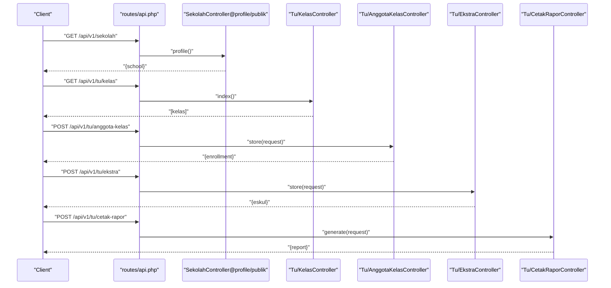

**Diagram sources**
- [routes/api.php:83-84](file://routes/api.php#L83-L84)
- [app/Http/Controllers/Api/V1/Tu/KelasController.php:1-120](file://app/Http/Controllers/Api/V1/Tu/KelasController.php#L1-L120)
- [app/Http/Controllers/Api/V1/Tu/AnggotaKelasController.php:1-120](file://app/Http/Controllers/Api/V1/Tu/AnggotaKelasController.php#L1-L120)
- [app/Http/Controllers/Api/V1/Tu/EkstraController.php:1-120](file://app/Http/Controllers/Api/V1/Tu/EkstraController.php#L1-L120)
- [app/Http/Controllers/Api/V1/Tu/CetakRaporController.php:1-120](file://app/Http/Controllers/Api/V1/Tu/CetakRaporController.php#L1-L120)

**Section sources**
- [routes/api.php:83-84](file://routes/api.php#L83-L84)
- [app/Http/Controllers/Api/V1/Tu/KelasController.php:1-120](file://app/Http/Controllers/Api/V1/Tu/KelasController.php#L1-L120)
- [app/Http/Controllers/Api/V1/Tu/AnggotaKelasController.php:1-120](file://app/Http/Controllers/Api/V1/Tu/AnggotaKelasController.php#L1-L120)
- [app/Http/Controllers/Api/V1/Tu/EkstraController.php:1-120](file://app/Http/Controllers/Api/V1/Tu/EkstraController.php#L1-L120)
- [app/Http/Controllers/Api/V1/Tu/CetakRaporController.php:1-120](file://app/Http/Controllers/Api/V1/Tu/CetakRaporController.php#L1-L120)

### Institutional Configuration
- Dashboard endpoints for administrators and teachers
- Manage teacher-class assignments and curriculum subjects
- Record and manage student grades and report cards

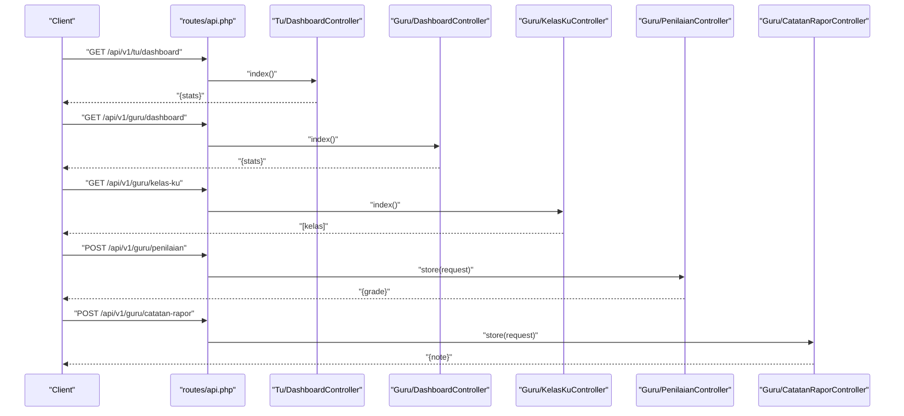

**Diagram sources**
- [app/Http/Controllers/Api/V1/Tu/DashboardController.php:1-120](file://app/Http/Controllers/Api/V1/Tu/DashboardController.php#L1-L120)
- [app/Http/Controllers/Api/V1/Guru/DashboardController.php:1-120](file://app/Http/Controllers/Api/V1/Guru/DashboardController.php#L1-L120)
- [app/Http/Controllers/Api/V1/Guru/KelasKuController.php:1-120](file://app/Http/Controllers/Api/V1/Guru/KelasKuController.php#L1-L120)
- [app/Http/Controllers/Api/V1/Guru/PenilaianController.php:1-120](file://app/Http/Controllers/Api/V1/Guru/PenilaianController.php#L1-L120)
- [app/Http/Controllers/Api/V1/Guru/CatatanRaporController.php:1-120](file://app/Http/Controllers/Api/V1/Guru/CatatanRaporController.php#L1-L120)

**Section sources**
- [app/Http/Controllers/Api/V1/Tu/DashboardController.php:1-120](file://app/Http/Controllers/Api/V1/Tu/DashboardController.php#L1-L120)
- [app/Http/Controllers/Api/V1/Guru/DashboardController.php:1-120](file://app/Http/Controllers/Api/V1/Guru/DashboardController.php#L1-L120)
- [app/Http/Controllers/Api/V1/Guru/KelasKuController.php:1-120](file://app/Http/Controllers/Api/V1/Guru/KelasKuController.php#L1-L120)
- [app/Http/Controllers/Api/V1/Guru/PenilaianController.php:1-120](file://app/Http/Controllers/Api/V1/Guru/PenilaianController.php#L1-L120)
- [app/Http/Controllers/Api/V1/Guru/CatatanRaporController.php:1-120](file://app/Http/Controllers/Api/V1/Guru/CatatanRaporController.php#L1-L120)

### Data Synchronization APIs (Dapodik)
- Dispatch batch sync jobs for schools, students, teachers, and learning programs
- Monitor sync status and cancel active batches
- Log sync operations with timestamps and outcomes

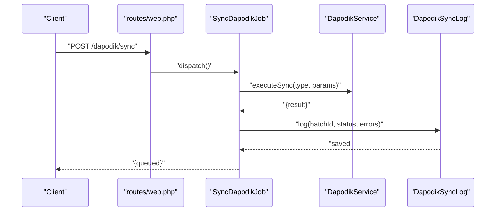

**Diagram sources**
- [routes/web.php:140-160](file://routes/web.php#L140-L160)
- [app/Jobs/SyncDapodikJob.php:1-120](file://app/Jobs/SyncDapodikJob.php#L1-L120)
- [app/Services/DapodikService.php:1-200](file://app/Services/DapodikService.php#L1-L200)
- [app/Models/DapodikSyncLog.php:1-120](file://app/Models/DapodikSyncLog.php#L1-L120)

**Section sources**
- [routes/web.php:140-160](file://routes/web.php#L140-L160)
- [app/Jobs/SyncDapodikJob.php:1-120](file://app/Jobs/SyncDapodikJob.php#L1-L120)
- [app/Services/DapodikService.php:1-200](file://app/Services/DapodikService.php#L1-L200)
- [app/Models/DapodikSyncLog.php:1-120](file://app/Models/DapodikSyncLog.php#L1-L120)

### Data Export/Import Operations
- Export reports and datasets
- Import student and related data

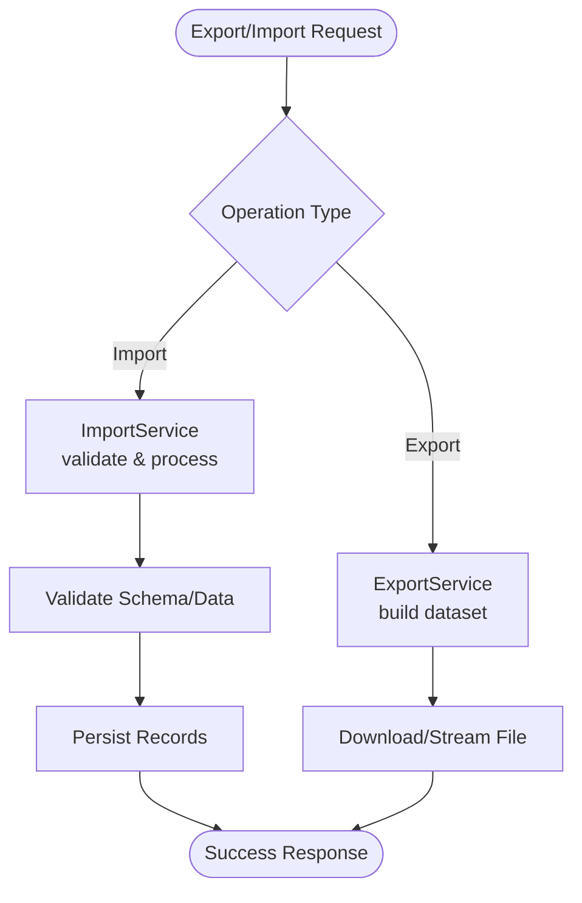

**Diagram sources**
- [app/Services/ExportService.php:1-120](file://app/Services/ExportService.php#L1-L120)
- [app/Services/ImportService.php:1-120](file://app/Services/ImportService.php#L1-L120)

**Section sources**
- [app/Services/ExportService.php:1-120](file://app/Services/ExportService.php#L1-L120)
- [app/Services/ImportService.php:1-120](file://app/Services/ImportService.php#L1-L120)

### Administrative Workflows and Permission Management
- Roles and permissions seeded for TU, Kepsek, and Guru
- Middleware ensures role-based access control
- Activity logging configured for auditable actions

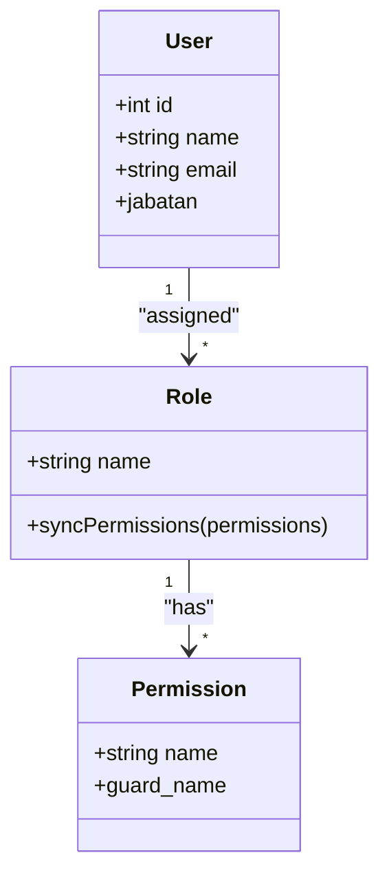

**Diagram sources**
- [database/seeders/RolePermissionSeeder.php:35-74](file://database/seeders/RolePermissionSeeder.php#L35-L74)
- [app/Http/Middleware/EnsureRole.php:1-50](file://app/Http/Middleware/EnsureRole.php#L1-L50)

**Section sources**
- [database/seeders/RolePermissionSeeder.php:35-74](file://database/seeders/RolePermissionSeeder.php#L35-L74)
- [app/Http/Middleware/EnsureRole.php:1-50](file://app/Http/Middleware/EnsureRole.php#L1-L50)

### Audit Trail APIs
- Activity logging enabled for system actions
- Configure channels, visibility, and retention policies

**Section sources**
- [config/activitylog.php:1-120](file://config/activitylog.php#L1-L120)

### Security Considerations
- Sanctum tokens for stateless authentication
- Rate limiting on sensitive endpoints
- Role middleware for authorization
- FCM token registration/unregistration endpoints

**Section sources**
- [routes/api.php:64-92](file://routes/api.php#L64-L92)
- [app/Http/Controllers/Api/V1/AuthController.php:1-120](file://app/Http/Controllers/Api/V1/AuthController.php#L1-L120)

### Backup Operations and Disaster Recovery
- Database backup script available
- Settings and Dapodik sync logs persisted for recovery

**Section sources**
- [scripts/backup-db.sh:1-120](file://scripts/backup-db.sh#L1-L120)
- [database/migrations/2026_06_01_010810_create_settings_table.php:1-120](file://database/migrations/2026_06_01_010810_create_settings_table.php#L1-L120)
- [database/migrations/2026_06_02_040000_create_dapodik_sync_logs_table.php:1-120](file://database/migrations/2026_06_02_040000_create_dapodik_sync_logs_table.php#L1-L120)

## Dependency Analysis
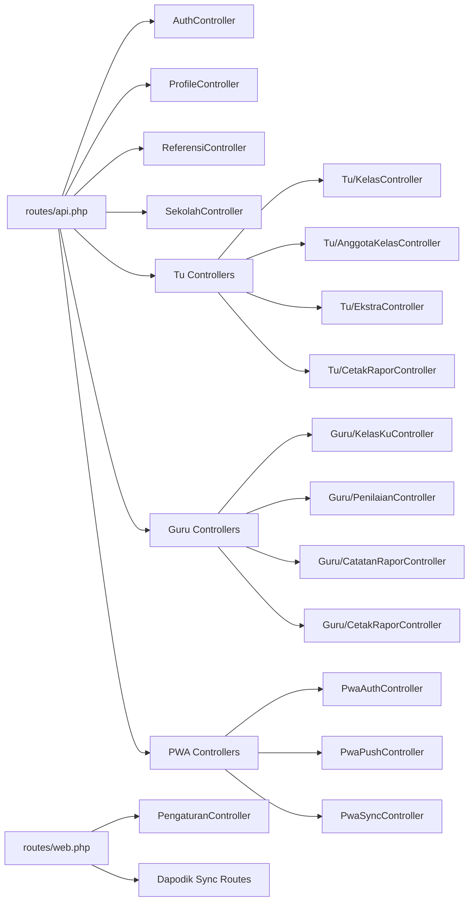

**Diagram sources**
- [routes/api.php:64-92](file://routes/api.php#L64-L92)
- [routes/web.php:98-193](file://routes/web.php#L98-L193)

**Section sources**
- [routes/api.php:64-92](file://routes/api.php#L64-L92)
- [routes/web.php:98-193](file://routes/web.php#L98-L193)

## Performance Considerations
- Use pagination for list endpoints
- Apply rate limiting on public and frequently accessed endpoints
- Queue long-running operations (exports, imports, Dapodik sync)
- Cache reference data where appropriate

## Troubleshooting Guide
- Dapodik sync job dispatch and logging verified in tests
- Sync status and cancellation endpoints validated
- Access restrictions enforced for Dapodik endpoints

**Section sources**
- [test_results.txt:64-80](file://test_results.txt#L64-L80)

## Conclusion
The System Management APIs provide a comprehensive set of endpoints for administration, configuration, reference data, user profiles, curriculum management, and Dapodik integration. With role-based access control, standardized resource responses, and robust background job processing, the system supports secure and scalable operations across educational institutions.

## Appendices
- Endpoint Catalog
  - Authentication: POST /api/v1/auth/login, POST /api/v1/auth/logout, GET /api/v1/auth/me, POST/DELETE /api/v1/auth/fcm
  - Profile: PUT /api/v1/profile, PUT /api/v1/profile/password
  - References: GET /api/v1/referensi, GET /api/v1/referensi/dimensi-elemen, GET /api/v1/referensi/{slug}
  - School: GET /api/v1/sekolah
  - TU: GET /api/v1/tu/dashboard, GET /api/v1/tu/kelas, POST /api/v1/tu/anggota-kelas, POST /api/v1/tu/ekstra, POST /api/v1/tu/cetak-rapor
  - Guru: GET /api/v1/guru/dashboard, GET /api/v1/guru/kelas-ku, POST /api/v1/guru/penilaian, POST /api/v1/guru/catatan-rapor, POST /api/v1/guru/cetak-rapor
  - PWA: POST /api/pwa/login, GET /api/pwa/check, POST /api/pwa/logout, POST /api/pwa/refresh, GET /api/pwa/vapid-key, POST /api/pwa/subscribe, POST /api/pwa/unsubscribe, POST /api/pwa/unsubscribe-all, GET /api/pwa/push-status, POST /api/pwa/sync, POST /api/tu/pwa/push/send
  - Admin: PUT /pengaturan, POST /pengaturan/push, POST /pengaturan/backup, POST /pengaturan/restore, POST /set-semester