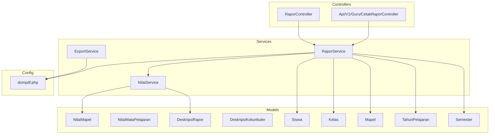
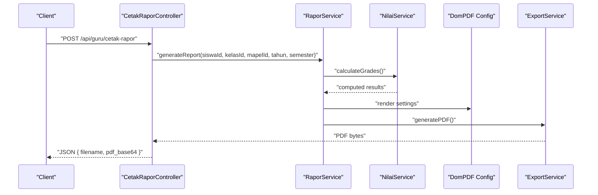
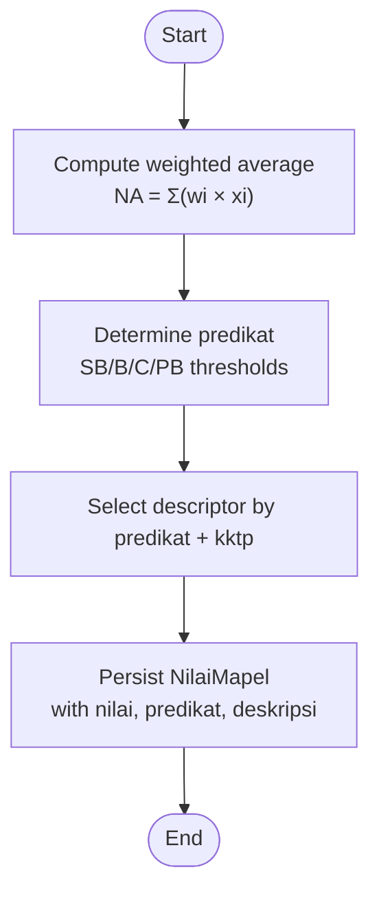
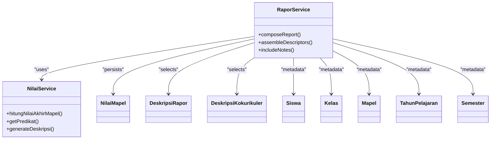
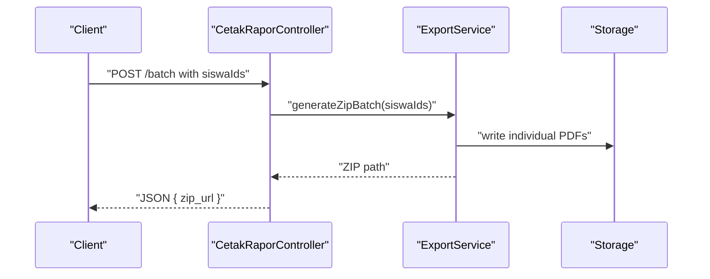
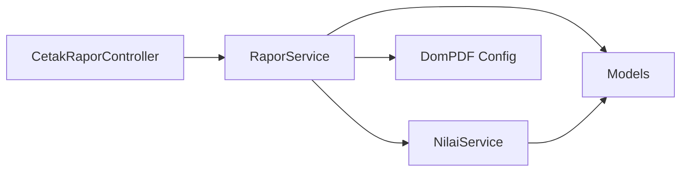

# Academic Reporting & Analytics

<cite>
**Referenced Files in This Document**
- [PRD-rapor-migrasi.md](file://PRD-rapor-migrasi.md)
- [NilaiService.php](file://app/Services/NilaiService.php)
- [RaporService.php](file://app/Services/RaporService.php)
- [ExportService.php](file://app/Services/ExportService.php)
- [CetakRaporController.php](file://app/Http/Controllers/Api/V1/Guru/CetakRaporController.php)
- [RaporController.php](file://app/Http/Controllers/RaporController.php)
- [2026_06_01_010809_create_deskripsi_rapor_table.php](file://database/migrations/2026_06_01_010809_create_deskripsi_rapor_table.php)
- [2026_06_01_010809_create_deskripsi_kokurikuler_table.php](file://database/migrations/2026_06_01_010809_create_deskripsi_kokurikuler_table.php)
- [DeskripsiRaporFactory.php](file://database/factories/DeskripsiRaporFactory.php)
- [DeskripsiKokurikulerFactory.php](file://database/factories/DeskripsiKokurikulerFactory.php)
- [dompdf.php](file://config/dompdf.php)
- [03-penilaian-akademik.md](file://docs/manual-guru/03-penilaian-akademik.md)
- [06-kokurikuler.md](file://docs/manual-guru/06-kokurikuler.md)
- [RaporPdfTest.php](file://tests/Feature/RaporPdfTest.php)
- [RaporMidPdfTest.php](file://tests/Feature/RaporMidPdfTest.php)
- [LagerNilaiPdfTest.php](file://tests/Feature/LagerNilaiPdfTest.php)
- [NilaiServiceTest.php](file://tests/Unit/Services/NilaiServiceTest.php)
- [PushService.php](file://app/Services/PushService.php)
- [LaporanWa.php](file://app/Models/LaporanWa.php)
- [Pengingat.php](file://app/Models/Pengingat.php)
- [Prestasi.php](file://app/Models/Prestasi.php)
- [CatatanWali.php](file://app/Models/CatatanWali.php)
- [NilaiKokurikuler.php](file://app/Models/NilaiKokurikuler.php)
- [NilaiMapel.php](file://app/Models/NilaiMapel.php)
- [NilaiMataPelajaran.php](file://app/Models/NilaiMataPelajaran.php)
- [NilaiFormatif.php](file://app/Models/NilaiFormatif.php)
- [NilaiSumatifAs.php](file://app/Models/NilaiSumatifAs.php)
- [NilaiSumatifPh.php](file://app/Models/NilaiSumatifPh.php)
- [NilaiSumatifTs.php](file://app/Models/NilaiSumatifTs.php)
- [NilaiProyek.php](file://app/Models/NilaiProyek.php)
- [NilaiPrakerin.php](file://app/Models/NilaiPrakerin.php)
- [Presensi.php](file://app/Models/Presensi.php)
- [Siswa.php](file://app/Models/Siswa.php)
- [Kelas.php](file://app/Models/Kelas.php)
- [Mapel.php](file://app/Models/Mapel.php)
- [TahunPelajaran.php](file://app/Models/TahunPelajaran.php)
- [Semester.php](file://app/Models/Semester.php)
- [Sekolah.php](file://app/Models/Sekolah.php)
- [Setting.php](file://app/Models/Setting.php)
- [PembagianRaport.php](file://app/Models/PembagianRaport.php)
- [PembinaEskul.php](file://app/Models/PembinaEskul.php)
- [Eskul.php](file://app/Models/Eskul.php)
- [PiketHarian.php](file://app/Models/PiketHarian.php)
- [Organisasi.php](file://app/Models/Organisasi.php)
- [Prakerin.php](file://app/Models/Prakerin.php)
- [ProyekKelas.php](file://app/Models/ProyekKelas.php)
- [ProyekTema.php](file://app/Models/ProyekTema.php)
- [ProyekTujuan.php](file://app/Models/ProyekTujuan.php)
- [ProyekSubelemen.php](file://app/Models/ProyekSubelemen.php)
- [Elemen.php](file://app/Models/Elemen.php)
- [Dimensi.php](file://app/Models/Dimensi.php)
- [DimensiKokurikuler.php](file://app/Models/DimensiKokurikuler.php)
- [SubElemen.php](file://app/Models/SubElemen.php)
- [DeskripsiKokurikuler.php](file://app/Models/DeskripsiKokurikuler.php)
- [DeskripsiRapor.php](file://app/Models/DeskripsiRapor.php)
- [Prestasi.php](file://app/Models/Prestasi.php)
- [MutasiMasuk.php](file://app/Models/MutasiMasuk.php)
- [MutasiKeluar.php](file://app/Models/MutasiKeluar.php)
- [Lulusan.php](file://app/Models/Lulusan.php)
- [Prestasi.php](file://app/Models/Prestasi.php)
- [Prestasi.php](file://app/Models/Prestasi.php)
</cite>

## Table of Contents
1. [Introduction](#introduction)
2. [Project Structure](#project-structure)
3. [Core Components](#core-components)
4. [Architecture Overview](#architecture-overview)
5. [Detailed Component Analysis](#detailed-component-analysis)
6. [Dependency Analysis](#dependency-analysis)
7. [Performance Considerations](#performance-considerations)
8. [Troubleshooting Guide](#troubleshooting-guide)
9. [Conclusion](#conclusion)
10. [Appendices](#appendices)

## Introduction
This document provides comprehensive documentation for academic reporting and analytics within the Laravel-based educational platform. It covers report card generation, progress tracking, performance analysis, and integration with standardized reporting formats. The focus areas include:
- Report card creation: academic grades, behavioral assessments, and descriptive evaluations
- Reporting algorithms: grade point calculations, grade determinations, and class averages
- Progress monitoring: trend analysis and benchmarking
- Standardized formats and official documentation alignment
- Examples: customization, batch generation, and automated workflows
- Distribution and communication: report delivery and parent engagement
- Intervention tracking: academic support and follow-ups

## Project Structure
The system is organized around services, controllers, models, migrations, and tests. The report generation pipeline integrates value calculation, model persistence, PDF rendering, and export orchestration.

**Diagram sources**
- [CetakRaporController.php:119-156](file://app/Http/Controllers/Api/V1/Guru/CetakRaporController.php#L119-L156)
- [RaporController.php:9-200](file://app/Http/Controllers/RaporController.php#L9-L200)
- [NilaiService.php:39-81](file://app/Services/NilaiService.php#L39-L81)
- [RaporService.php:16-200](file://app/Services/RaporService.php#L16-L200)
- [ExportService.php:13-200](file://app/Services/ExportService.php#L13-L200)
- [dompdf.php:115-182](file://config/dompdf.php#L115-L182)

**Section sources**
- [CetakRaporController.php:119-156](file://app/Http/Controllers/Api/V1/Guru/CetakRaporController.php#L119-L156)
- [RaporController.php:9-200](file://app/Http/Controllers/RaporController.php#L9-L200)
- [NilaiService.php:39-81](file://app/Services/NilaiService.php#L39-L81)
- [RaporService.php:16-200](file://app/Services/RaporService.php#L16-L200)
- [ExportService.php:13-200](file://app/Services/ExportService.php#L13-L200)
- [dompdf.php:115-182](file://config/dompdf.php#L115-L182)

## Core Components
- NilaiService: Implements grading formulas, predikat determination, and automatic description generation. It computes final subject grades, class averages, and persists results.
- RaporService: Orchestrates report assembly, including academic grades, co-curricular descriptors, and behavioral notes. Coordinates with NilaiService and rendering configuration.
- ExportService: Handles PDF generation and batch export workflows using DomPDF configuration.
- Controllers: Expose APIs for report generation and batch exports, returning structured responses and ZIP archives.
- Models: Persist student grades, descriptors, and supporting metadata (classes, subjects, academic years, semesters).
- Migrations: Define schema for descriptors and related entities.
- Tests: Validate computation correctness and PDF generation outcomes.

**Section sources**
- [NilaiService.php:39-81](file://app/Services/NilaiService.php#L39-L81)
- [RaporService.php:16-200](file://app/Services/RaporService.php#L16-L200)
- [ExportService.php:13-200](file://app/Services/ExportService.php#L13-L200)
- [CetakRaporController.php:119-156](file://app/Http/Controllers/Api/V1/Guru/CetakRaporController.php#L119-L156)
- [2026_06_01_010809_create_deskripsi_rapor_table.php:14-22](file://database/migrations/2026_06_01_010809_create_deskripsi_rapor_table.php#L14-L22)
- [2026_06_01_010809_create_deskripsi_kokurikuler_table.php:14-23](file://database/migrations/2026_06_01_010809_create_deskripsi_kokurikuler_table.php#L14-L23)
- [RaporPdfTest.php:1-200](file://tests/Feature/RaporPdfTest.php#L1-L200)
- [RaporMidPdfTest.php:1-200](file://tests/Feature/RaporMidPdfTest.php#L1-L200)
- [LagerNilaiPdfTest.php:1-200](file://tests/Feature/LagerNilaiPdfTest.php#L1-L200)
- [NilaiServiceTest.php:117-160](file://tests/Unit/Services/NilaiServiceTest.php#L117-L160)

## Architecture Overview
The report generation architecture follows a layered pattern:
- Presentation: Controllers expose endpoints for single and batch report generation.
- Orchestration: RaporService composes reports using data from models and services.
- Calculation: NilaiService performs weighted computations and descriptor lookup.
- Persistence: Models store computed results and descriptors.
- Rendering: DomPDF configuration controls PDF output characteristics.

**Diagram sources**
- [CetakRaporController.php:119-156](file://app/Http/Controllers/Api/V1/Guru/CetakRaporController.php#L119-L156)
- [RaporService.php:16-200](file://app/Services/RaporService.php#L16-L200)
- [NilaiService.php:39-81](file://app/Services/NilaiService.php#L39-L81)
- [dompdf.php:115-182](file://config/dompdf.php#L115-L182)
- [ExportService.php:13-200](file://app/Services/ExportService.php#L13-L200)

## Detailed Component Analysis

### Grading and Descriptor Generation
- Weighted formula for final subject grade combines formative averages, project averages, and semester final assessment.
- Predikat determination uses fixed thresholds mapped to SB/B/C/PB categories.
- Automatic description retrieval selects a descriptor template based on predikat and KKTP value.

**Diagram sources**
- [NilaiService.php:39-81](file://app/Services/NilaiService.php#L39-L81)
- [2026_06_01_010809_create_deskripsi_rapor_table.php:14-22](file://database/migrations/2026_06_01_010809_create_deskripsi_rapor_table.php#L14-L22)
- [DeskripsiRaporFactory.php:15-34](file://database/factories/DeskripsiRaporFactory.php#L15-L34)

**Section sources**
- [NilaiService.php:39-81](file://app/Services/NilaiService.php#L39-L81)
- [PRD-rapor-migrasi.md:876-925](file://PRD-rapor-migrasi.md#L876-L925)
- [PRD-rapor-migrasi.md:1445-1490](file://PRD-rapor-migrasi.md#L1445-L1490)
- [NilaiServiceTest.php:117-160](file://tests/Unit/Services/NilaiServiceTest.php#L117-L160)

### Report Card Composition
- Academic grades: final subject grades, predikats, and descriptors.
- Co-curricular and behavioral assessments: descriptors per dimension.
- Notes and observations: teacher’s notes and class advisor comments.
- Class and subject metadata: student, class, subject, academic year, and semester.

**Diagram sources**
- [RaporService.php:16-200](file://app/Services/RaporService.php#L16-L200)
- [NilaiService.php:39-81](file://app/Services/NilaiService.php#L39-L81)
- [NilaiMapel.php](file://app/Models/NilaiMapel.php)
- [DeskripsiRapor.php](file://app/Models/DeskripsiRapor.php)
- [DeskripsiKokurikuler.php](file://app/Models/DeskripsiKokurikuler.php)
- [Siswa.php](file://app/Models/Siswa.php)
- [Kelas.php](file://app/Models/Kelas.php)
- [Mapel.php](file://app/Models/Mapel.php)
- [TahunPelajaran.php](file://app/Models/TahunPelajaran.php)
- [Semester.php](file://app/Models/Semester.php)

**Section sources**
- [RaporService.php:16-200](file://app/Services/RaporService.php#L16-L200)
- [NilaiService.php:39-81](file://app/Services/NilaiService.php#L39-L81)

### Batch Generation and Distribution
- Single report generation returns a base64-encoded PDF and metadata.
- Batch generation creates a ZIP archive containing multiple PDFs for selected students.
- Distribution channels include API responses and downloadable ZIP archives.

**Diagram sources**
- [CetakRaporController.php:142-156](file://app/Http/Controllers/Api/V1/Guru/CetakRaporController.php#L142-L156)
- [ExportService.php:13-200](file://app/Services/ExportService.php#L13-L200)

**Section sources**
- [CetakRaporController.php:142-156](file://app/Http/Controllers/Api/V1/Guru/CetakRaporController.php#L142-L156)

### Progress Tracking and Benchmarking
- Class average computation per subject enables benchmarking against cohort performance.
- Trend analysis can be derived from repeated report generations across semesters.
- Cohort-level insights support identifying at-risk students and intervention targets.

**Section sources**
- [NilaiService.php:39-81](file://app/Services/NilaiService.php#L39-L81)
- [NilaiServiceTest.php:117-160](file://tests/Unit/Services/NilaiServiceTest.php#L117-L160)

### Behavioral and Co-Curricular Descriptors
- Co-curricular descriptors are linked to dimensions and predikats, ensuring consistent evaluation criteria.
- Teachers input descriptive assessments aligned with predefined templates.

**Section sources**
- [2026_06_01_010809_create_deskripsi_kokurikuler_table.php:14-23](file://database/migrations/2026_06_01_010809_create_deskripsi_kokurikuler_table.php#L14-L23)
- [DeskripsiKokurikulerFactory.php:16-24](file://database/factories/DeskripsiKokurikulerFactory.php#L16-L24)
- [06-kokurikuler.md:1-38](file://docs/manual-guru/06-kokurikuler.md#L1-L38)

### Academic Standing Determination
- Predikat thresholds define academic standing categories.
- Descriptive templates align with predikat to maintain consistency across reports.

**Section sources**
- [PRD-rapor-migrasi.md:1481-1490](file://PRD-rapor-migrasi.md#L1481-L1490)
- [NilaiService.php:39-81](file://app/Services/NilaiService.php#L39-L81)

### Integration with Standardized Formats
- PDF rendering configured via DomPDF settings ensures standardized output characteristics.
- Tests validate PDF generation for semester, mid-term, and class-grade listings.

**Section sources**
- [dompdf.php:115-182](file://config/dompdf.php#L115-L182)
- [RaporPdfTest.php:1-200](file://tests/Feature/RaporPdfTest.php#L1-L200)
- [RaporMidPdfTest.php:1-200](file://tests/Feature/RaporMidPdfTest.php#L1-L200)
- [LagerNilaiPdfTest.php:1-200](file://tests/Feature/LagerNilaiPdfTest.php#L1-L200)

### Examples: Customization, Batch, and Automated Workflows
- Customization: Selecting KKTP-aware descriptors and applying school-specific templates.
- Batch generation: Generating multiple reports concurrently and packaging into a ZIP archive.
- Automated workflows: Integrating report generation into scheduled jobs or webhook-triggered flows.

**Section sources**
- [RaporService.php:16-200](file://app/Services/RaporService.php#L16-L200)
- [CetakRaporController.php:142-156](file://app/Http/Controllers/Api/V1/Guru/CetakRaporController.php#L142-L156)

### Parent Communication and Intervention Tracking
- Communication tools: Notifications via WhatsApp and Telegram integrations are part of the roadmap.
- Intervention tracking: Notes, reminders, achievements, and behavioral indicators support follow-up actions.

**Section sources**
- [PRD-rapor-migrasi.md:1310-1340](file://PRD-rapor-migrasi.md#L1310-L1340)
- [PushService.php:1-200](file://app/Services/PushService.php#L1-L200)
- [LaporanWa.php](file://app/Models/LaporanWa.php)
- [Pengingat.php](file://app/Models/Pengingat.php)
- [CatatanWali.php](file://app/Models/CatatanWali.php)
- [Prestasi.php](file://app/Models/Prestasi.php)

## Dependency Analysis
The report generation pipeline exhibits clear separation of concerns:
- Controllers depend on RaporService for orchestration.
- RaporService depends on NilaiService for computations and on DomPDF configuration for rendering.
- Models encapsulate persisted data and relationships across academic entities.

**Diagram sources**
- [CetakRaporController.php:119-156](file://app/Http/Controllers/Api/V1/Guru/CetakRaporController.php#L119-L156)
- [RaporService.php:16-200](file://app/Services/RaporService.php#L16-L200)
- [NilaiService.php:39-81](file://app/Services/NilaiService.php#L39-L81)
- [dompdf.php:115-182](file://config/dompdf.php#L115-L182)

**Section sources**
- [CetakRaporController.php:119-156](file://app/Http/Controllers/Api/V1/Guru/CetakRaporController.php#L119-L156)
- [RaporService.php:16-200](file://app/Services/RaporService.php#L16-L200)
- [NilaiService.php:39-81](file://app/Services/NilaiService.php#L39-L81)

## Performance Considerations
- Measure baseline performance using synthetic and real-user monitoring.
- Focus on database query efficiency, especially for cohort-level computations.
- Optimize PDF generation throughput and storage handling for batch exports.
- Guard against regressions with automated performance checks.

[No sources needed since this section provides general guidance]

## Troubleshooting Guide
- PDF generation failures: Verify DomPDF backend and paper settings; inspect controller error handling for actionable messages.
- Batch export issues: Confirm temporary directory permissions and ZIP creation status.
- Incorrect grades or descriptors: Validate NilaiService thresholds and descriptor availability; run unit tests to confirm expected outcomes.
- Report content anomalies: Review RaporService composition logic and ensure required metadata is present.

**Section sources**
- [CetakRaporController.php:134-139](file://app/Http/Controllers/Api/V1/Guru/CetakRaporController.php#L134-L139)
- [dompdf.php:115-182](file://config/dompdf.php#L115-L182)
- [NilaiServiceTest.php:117-160](file://tests/Unit/Services/NilaiServiceTest.php#L117-L160)

## Conclusion
The system provides a robust foundation for academic reporting and analytics, integrating precise grading algorithms, standardized PDF generation, and extensible composition for descriptors and notes. With clear service boundaries and comprehensive tests, it supports scalable report generation, batch processing, and future enhancements for communication and intervention tracking.

[No sources needed since this section summarizes without analyzing specific files]

## Appendices

### Academic Grading Formulas
- Final subject grade: weighted combination of formative, project, and semester final assessments.
- Mid-term grade: individual sumatif tengah semester score.
- Co-op learning (practicum): arithmetic mean across four goals.

**Section sources**
- [PRD-rapor-migrasi.md:1445-1490](file://PRD-rapor-migrasi.md#L1445-L1490)

### Descriptor Schema
- Academic descriptors: linked to predikat and KKTP.
- Co-curricular descriptors: linked to dimension and predikat.

**Section sources**
- [2026_06_01_010809_create_deskripsi_rapor_table.php:14-22](file://database/migrations/2026_06_01_010809_create_deskripsi_rapor_table.php#L14-L22)
- [2026_06_01_010809_create_deskripsi_kokurikuler_table.php:14-23](file://database/migrations/2026_06_01_010809_create_deskripsi_kokurikuler_table.php#L14-L23)

### Teacher and TU Guides
- Input and management procedures for academic and co-curricular assessments.
- Practical steps for report generation and PDF export.

**Section sources**
- [03-penilaian-akademik.md:1-70](file://docs/manual-guru/03-penilaian-akademik.md#L1-L70)
- [06-kokurikuler.md:1-38](file://docs/manual-guru/06-kokurikuler.md#L1-L38)