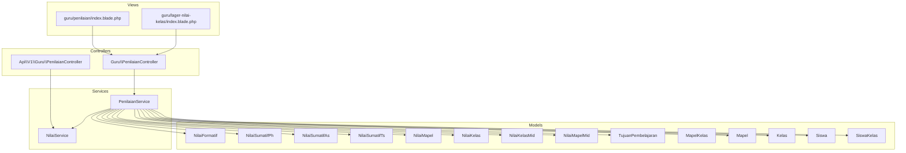
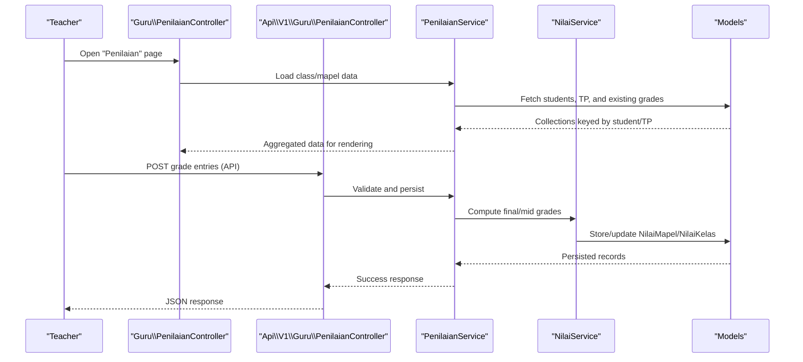
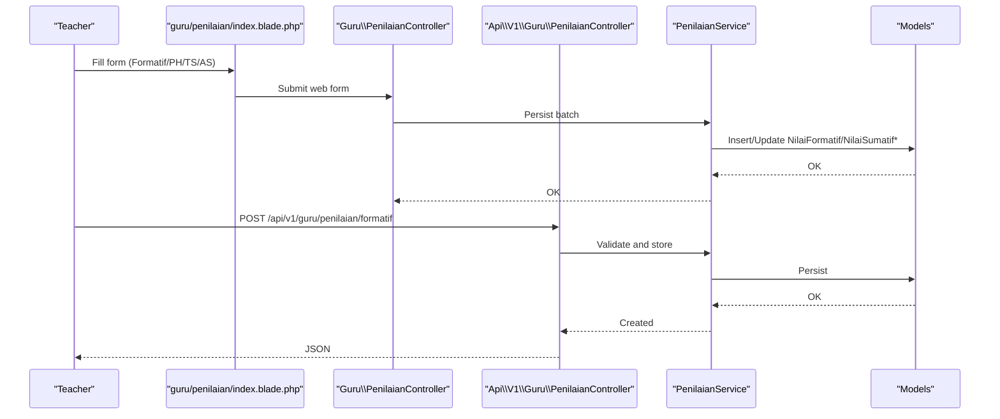
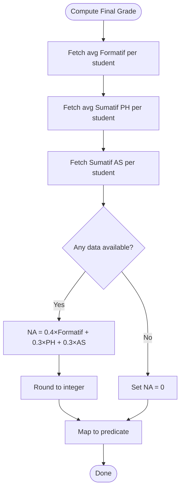
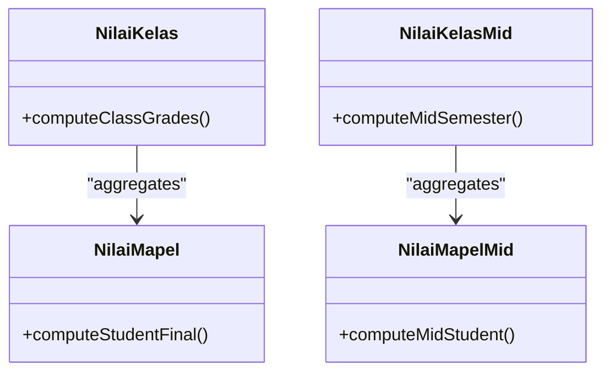
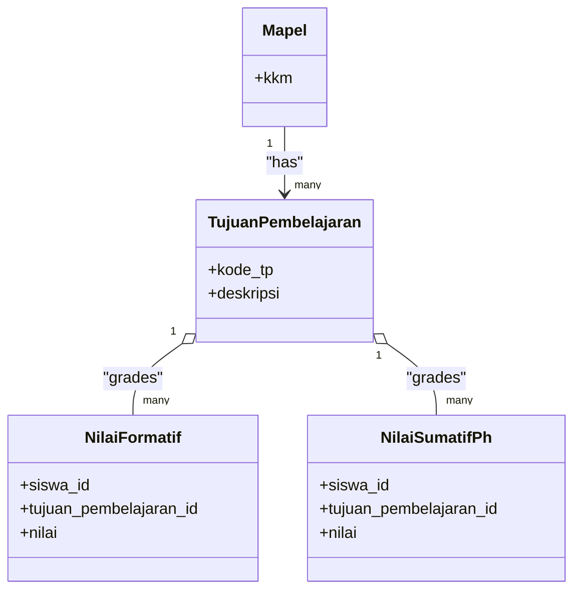
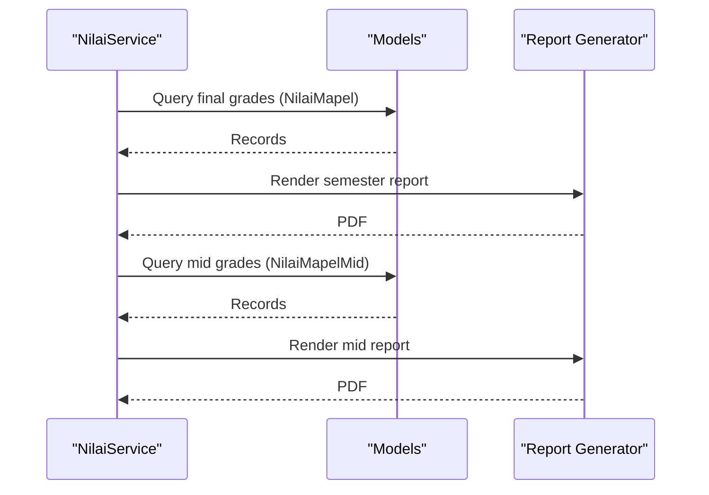
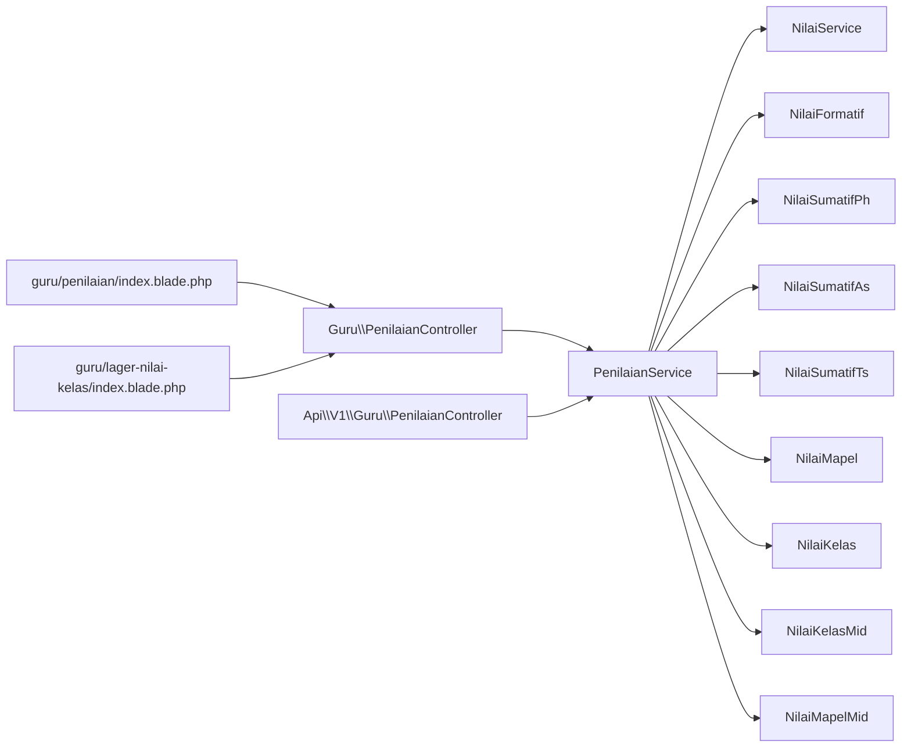

# Grade Tracking System

<cite>
**Referenced Files in This Document**
- [PRD-rapor-migrasi.md](file://PRD-rapor-migrasi.md)
- [NilaiServiceTest.php](file://tests/Unit/Services/NilaiServiceTest.php)
- [NilaiSumatifAsObserverTest.php](file://tests/Feature/NilaiSumatifAsObserverTest.php)
- [GuruPenilaianTest.php](file://tests/Feature/Api/V1/GuruPenilaianTest.php)
- [PenilaianController.php](file://app/Http/Controllers/Guru/PenilaianController.php)
- [ApiPenilaianController.php](file://app/Http/Controllers/Api/V1/Guru/PenilaianController.php)
- [NilaiSumatifPh.php](file://app/Models/NilaiSumatifPh.php)
- [NilaiSumatifAs.php](file://app/Models/NilaiSumatifAs.php)
- [NilaiSumatifTs.php](file://app/Models/NilaiSumatifTs.php)
- [NilaiFormatif.php](file://app/Models/NilaiFormatif.php)
- [NilaiMapel.php](file://app/Models/NilaiMapel.php)
- [NilaiKelas.php](file://app/Models/NilaiKelas.php)
- [NilaiKelasMid.php](file://app/Models/NilaiKelasMid.php)
- [NilaiMapelMid.php](file://app/Models/NilaiMapelMid.php)
- [NilaiPrakerin.php](file://app/Models/NilaiPrakerin.php)
- [NilaiProyek.php](file://app/Models/NilaiProyek.php)
- [NilaiMataPelajaran.php](file://app/Models/NilaiMataPelajaran.php)
- [NilaiAssesmenSubelemen.php](file://app/Models/NilaiAssesmenSubelemen.php)
- [NilaiKokurikuler.php](file://app/Models/NilaiKokurikuler.php)
- [TujuanPembelajaran.php](file://app/Models/TujuanPembelajaran.php)
- [Mapel.php](file://app/Models/Mapel.php)
- [Kelas.php](file://app/Models/Kelas.php)
- [Siswa.php](file://app/Models/Siswa.php)
- [SiswaKelas.php](file://app/Models/SiswaKelas.php)
- [Sekolah.php](file://app/Models/Sekolah.php)
- [TahunPelajaran.php](file://app/Models/TahunPelajaran.php)
- [Semester.php](file://app/Models/Semester.php)
- [NilaiService.php](file://app/Services/NilaiService.php)
- [PenilaianService.php](file://app/Services/PenilaianService.php)
- [NilaiSumatifAsObserver.php](file://app/Observers/NilaiSumatifAsObserver.php)
- [index.blade.php](file://resources/views/guru/penilaian/index.blade.php)
- [index.blade.php](file://resources/views/guru/lager-nilai-kelas/index.blade.php)
- [03-penilaian-akademik.md](file://docs/manual-guru/03-penilaian-akademik.md)
- [AuthorizationTest.php](file://tests/Feature/Guru/AuthorizationTest.php)
</cite>

## Table of Contents
1. [Introduction](#introduction)
2. [Project Structure](#project-structure)
3. [Core Components](#core-components)
4. [Architecture Overview](#architecture-overview)
5. [Detailed Component Analysis](#detailed-component-analysis)
6. [Dependency Analysis](#dependency-analysis)
7. [Performance Considerations](#performance-considerations)
8. [Troubleshooting Guide](#troubleshooting-guide)
9. [Conclusion](#conclusion)
10. [Appendices](#appendices)

## Introduction
This document describes the grade tracking system for academic assessment and reporting. It covers assessment recording workflows for formative assessments, summative projects/exams, and practical evaluations; grade calculation algorithms and grading scales; class and individual grade book functionality; competency-based assessment via Tujuan Pembelajaran (Learning Objectives); and report card generation. It also documents grade entry validation, bulk grade entry, grade modification, privacy controls, audit trails, and role-based access for teachers, students, and parents.

## Project Structure
The grade tracking system spans controllers, services, models, observers, Blade views, and tests. Key areas:
- Controllers: Web and API controllers manage grade entry and retrieval.
- Services: Business logic for calculations and data orchestration.
- Models: Persistent entities for grades, subjects, classes, and learners.
- Views: Teacher-facing forms for grade entry and class grade books.
- Tests: Behavioral tests validating calculation formulas, observer behavior, and API validations.

**Diagram sources**
- [PenilaianController.php:1-38](file://app/Http/Controllers/Guru/PenilaianController.php#L1-L38)
- [ApiPenilaianController.php:1-72](file://app/Http/Controllers/Api/V1/Guru/PenilaianController.php#L1-L72)
- [NilaiService.php](file://app/Services/NilaiService.php)
- [PenilaianService.php](file://app/Services/PenilaianService.php)
- [NilaiFormatif.php:1-52](file://app/Models/NilaiFormatif.php#L1-L52)
- [NilaiSumatifPh.php:1-52](file://app/Models/NilaiSumatifPh.php#L1-L52)
- [NilaiSumatifAs.php](file://app/Models/NilaiSumatifAs.php)
- [NilaiSumatifTs.php](file://app/Models/NilaiSumatifTs.php)
- [NilaiMapel.php](file://app/Models/NilaiMapel.php)
- [NilaiKelas.php](file://app/Models/NilaiKelas.php)
- [NilaiKelasMid.php](file://app/Models/NilaiKelasMid.php)
- [NilaiMapelMid.php](file://app/Models/NilaiMapelMid.php)
- [TujuanPembelajaran.php](file://app/Models/TujuanPembelajaran.php)
- [Mapel.php](file://app/Models/Mapel.php)
- [Kelas.php](file://app/Models/Kelas.php)
- [Siswa.php](file://app/Models/Siswa.php)
- [SiswaKelas.php](file://app/Models/SiswaKelas.php)
- [index.blade.php:92-209](file://resources/views/guru/penilaian/index.blade.php#L92-L209)
- [index.blade.php:44-61](file://resources/views/guru/lager-nilai-kelas/index.blade.php#L44-L61)

**Section sources**
- [PenilaianController.php:1-38](file://app/Http/Controllers/Guru/PenilaianController.php#L1-L38)
- [ApiPenilaianController.php:1-72](file://app/Http/Controllers/Api/V1/Guru/PenilaianController.php#L1-L72)
- [NilaiService.php](file://app/Services/NilaiService.php)
- [PenilaianService.php](file://app/Services/PenilaianService.php)
- [index.blade.php:92-209](file://resources/views/guru/penilaian/index.blade.php#L92-L209)
- [index.blade.php:44-61](file://resources/views/guru/lager-nilai-kelas/index.blade.php#L44-L61)

## Core Components
- Assessment recording:
  - Formative assessments: stored per student and Learning Objective.
  - Summative components: Sumatif PH (project/test averages), Sumatif TS (mid-term exam), Sumatif AS (final exam).
- Grade calculation:
  - Final grade formula for regular subjects uses fixed weights: 40% formative average, 30% Sumatif PH average, 30% Sumatif AS.
  - Mid-semester uses Sumatif TS directly.
  - Practical training (praktik kerja lapangan) averages four Learning Objectives.
- Grading scale and predicates:
  - Predicates mapped to score ranges (e.g., ≥90, 75–89, 60–74, <60).
- Grade book and class management:
  - Class-grade book displays per-student averages and final grades with predicate.
  - Supports export to PDF.
- Competency-based assessment:
  - Tujuan Pembelajaran (Learning Objectives) define competencies and enable per-objective grading.
- Report card generation:
  - Semester and mid-semester reports computed from component scores.

**Section sources**
- [PRD-rapor-migrasi.md:1445-1500](file://PRD-rapor-migrasi.md#L1445-L1500)
- [NilaiServiceTest.php:64-160](file://tests/Unit/Services/NilaiServiceTest.php#L64-L160)
- [index.blade.php:44-61](file://resources/views/guru/lager-nilai-kelas/index.blade.php#L44-L61)

## Architecture Overview
The system separates presentation (Blade views), controller orchestration, service-layer computation, and persistence (models). API endpoints support mobile/web clients, while web controllers serve teacher dashboards.

**Diagram sources**
- [PenilaianController.php:24-38](file://app/Http/Controllers/Guru/PenilaianController.php#L24-L38)
- [ApiPenilaianController.php:16-72](file://app/Http/Controllers/Api/V1/Guru/PenilaianController.php#L16-L72)
- [NilaiService.php](file://app/Services/NilaiService.php)
- [PenilaianService.php](file://app/Services/PenilaianService.php)
- [NilaiFormatif.php:1-52](file://app/Models/NilaiFormatif.php#L1-L52)
- [NilaiSumatifPh.php:1-52](file://app/Models/NilaiSumatifPh.php#L1-L52)
- [NilaiSumatifAs.php](file://app/Models/NilaiSumatifAs.php)
- [NilaiSumatifTs.php](file://app/Models/NilaiSumatifTs.php)
- [NilaiMapel.php](file://app/Models/NilaiMapel.php)

## Detailed Component Analysis

### Assessment Recording Workflows
- Formative assessments:
  - Teachers enter per-student, per-Learning Objective scores.
  - Validation ensures numeric bounds and uniqueness per student/Learning Objective.
- Summative components:
  - Sumatif PH: project/test scores per TP.
  - Sumatif TS: mid-semester exam per student.
  - Sumatif AS: final exam per student.
- Bulk entry:
  - Batch update supported via web forms and API endpoints.

**Diagram sources**
- [index.blade.php:92-209](file://resources/views/guru/penilaian/index.blade.php#L92-L209)
- [PenilaianController.php:73-105](file://app/Http/Controllers/Guru/PenilaianController.php#L73-L105)
- [ApiPenilaianController.php:16-72](file://app/Http/Controllers/Api/V1/Guru/PenilaianController.php#L16-L72)
- [NilaiFormatif.php:1-52](file://app/Models/NilaiFormatif.php#L1-L52)
- [NilaiSumatifPh.php:1-52](file://app/Models/NilaiSumatifPh.php#L1-L52)
- [NilaiSumatifAs.php](file://app/Models/NilaiSumatifAs.php)
- [NilaiSumatifTs.php](file://app/Models/NilaiSumatifTs.php)

**Section sources**
- [index.blade.php:92-209](file://resources/views/guru/penilaian/index.blade.php#L92-L209)
- [PenilaianController.php:73-105](file://app/Http/Controllers/Guru/PenilaianController.php#L73-L105)
- [ApiPenilaianController.php:16-72](file://app/Http/Controllers/Api/V1/Guru/PenilaianController.php#L16-L72)
- [GuruPenilaianTest.php:116-146](file://tests/Feature/Api/V1/GuruPenilaianTest.php#L116-L146)

### Grade Calculation Algorithms
- Final grade (regular subjects):
  - NA = (avg formatif × 0.40) + (avg Sumatif PH × 0.30) + (Sumatif AS × 0.30)
- Mid-semester:
  - Mid = Sumatif TS
- Practical training (praktik kerja lapangan):
  - Average of four Learning Objectives.
- Predicates:
  - ≥90: “Sangat Baik”, 75–89: “Baik”, 60–74: “Cukup”, <60: “Perlu Bimbingan”.

**Diagram sources**
- [PRD-rapor-migrasi.md:1445-1490](file://PRD-rapor-migrasi.md#L1445-L1490)
- [NilaiServiceTest.php:64-160](file://tests/Unit/Services/NilaiServiceTest.php#L64-L160)
- [index.blade.php:54-58](file://resources/views/guru/lager-nilai-kelas/index.blade.php#L54-L58)

**Section sources**
- [PRD-rapor-migrasi.md:1445-1490](file://PRD-rapor-migrasi.md#L1445-L1490)
- [NilaiServiceTest.php:64-160](file://tests/Unit/Services/NilaiServiceTest.php#L64-L160)
- [index.blade.php:54-58](file://resources/views/guru/lager-nilai-kelas/index.blade.php#L54-L58)

### Class Grade Management and Individual Tracking
- Class-grade book:
  - Displays per-student averages and final grades with predicate.
  - Supports export to PDF.
- Individual tracking:
  - Per-student view aggregates all components and final grade.
- Mid-semester tracking:
  - Separate view for Sumatif TS-based mid-semester grades.

**Diagram sources**
- [NilaiKelas.php](file://app/Models/NilaiKelas.php)
- [NilaiMapel.php](file://app/Models/NilaiMapel.php)
- [NilaiKelasMid.php](file://app/Models/NilaiKelasMid.php)
- [NilaiMapelMid.php](file://app/Models/NilaiMapelMid.php)

**Section sources**
- [index.blade.php:44-61](file://resources/views/guru/lager-nilai-kelas/index.blade.php#L44-L61)

### Competency-Based Assessment and Subject Integration
- Tujuan Pembelajaran (Learning Objectives) define subject-specific competencies.
- Grades recorded per TP, enabling per-objective analytics and aggregation.
- Integration with subjects and classes ensures proper scope and access.

**Diagram sources**
- [TujuanPembelajaran.php](file://app/Models/TujuanPembelajaran.php)
- [Mapel.php](file://app/Models/Mapel.php)
- [NilaiFormatif.php:1-52](file://app/Models/NilaiFormatif.php#L1-L52)
- [NilaiSumatifPh.php:1-52](file://app/Models/NilaiSumatifPh.php#L1-L52)

**Section sources**
- [index.blade.php:92-209](file://resources/views/guru/penilaian/index.blade.php#L92-L209)

### Report Card Generation
- Semester report:
  - Uses final calculated grades per subject.
- Mid-semester report:
  - Uses Sumatif TS per student.
- Practical training report:
  - Averages four Learning Objectives.

**Diagram sources**
- [NilaiService.php](file://app/Services/NilaiService.php)
- [NilaiMapel.php](file://app/Models/NilaiMapel.php)
- [NilaiMapelMid.php](file://app/Models/NilaiMapelMid.php)

**Section sources**
- [PRD-rapor-migrasi.md:1445-1490](file://PRD-rapor-migrasi.md#L1445-L1490)

## Dependency Analysis
- Controllers depend on Services for orchestration.
- Services depend on Models for persistence and on each other for computations.
- Views depend on controller-provided data and render grade book and entry forms.
- Tests validate calculation logic, observer behavior, and API validations.

**Diagram sources**
- [PenilaianController.php:1-38](file://app/Http/Controllers/Guru/PenilaianController.php#L1-L38)
- [ApiPenilaianController.php:1-72](file://app/Http/Controllers/Api/V1/Guru/PenilaianController.php#L1-L72)
- [NilaiService.php](file://app/Services/NilaiService.php)
- [PenilaianService.php](file://app/Services/PenilaianService.php)
- [NilaiFormatif.php:1-52](file://app/Models/NilaiFormatif.php#L1-L52)
- [NilaiSumatifPh.php:1-52](file://app/Models/NilaiSumatifPh.php#L1-L52)
- [NilaiSumatifAs.php](file://app/Models/NilaiSumatifAs.php)
- [NilaiSumatifTs.php](file://app/Models/NilaiSumatifTs.php)
- [NilaiMapel.php](file://app/Models/NilaiMapel.php)
- [NilaiKelas.php](file://app/Models/NilaiKelas.php)
- [NilaiKelasMid.php](file://app/Models/NilaiKelasMid.php)
- [NilaiMapelMid.php](file://app/Models/NilaiMapelMid.php)
- [index.blade.php:92-209](file://resources/views/guru/penilaian/index.blade.php#L92-L209)
- [index.blade.php:44-61](file://resources/views/guru/lager-nilai-kelas/index.blade.php#L44-L61)

**Section sources**
- [PenilaianController.php:1-38](file://app/Http/Controllers/Guru/PenilaianController.php#L1-L38)
- [ApiPenilaianController.php:1-72](file://app/Http/Controllers/Api/V1/Guru/PenilaianController.php#L1-L72)
- [NilaiService.php](file://app/Services/NilaiService.php)
- [PenilaianService.php](file://app/Services/PenilaianService.php)

## Performance Considerations
- Prefer batch operations for bulk grade entry to minimize database round-trips.
- Use keyed collections for fast lookups during aggregation (already implemented in controllers/services).
- Avoid redundant queries by preloading related data (students, TPs, and existing grades).
- Cache frequently accessed metadata (active year/semester) at the service level.
- Keep UI updates minimal; compute final grades server-side and render once per view.

## Troubleshooting Guide
- Grade not appearing in final calculation:
  - Ensure Sumatif AS creation triggers NilaiMapel record creation.
  - Confirm all three components (formatif, PH, AS) are present for accurate NA.
- Unexpected zero final grade:
  - Occurs when no data exists; verify data presence before calculation.
- API validation errors:
  - Numeric range validation prevents out-of-bound scores; adjust input accordingly.
- Unauthorized access:
  - Teachers can only access classes and subjects they teach; verify MapelKelas linkage.

**Section sources**
- [NilaiSumatifAsObserverTest.php:110-121](file://tests/Feature/NilaiSumatifAsObserverTest.php#L110-L121)
- [NilaiServiceTest.php:131-142](file://tests/Unit/Services/NilaiServiceTest.php#L131-L142)
- [GuruPenilaianTest.php:134-146](file://tests/Feature/Api/V1/GuruPenilaianTest.php#L134-L146)
- [AuthorizationTest.php:137-162](file://tests/Feature/Guru/AuthorizationTest.php#L137-L162)

## Conclusion
The grade tracking system integrates competency-based assessment with robust calculation formulas, supports multiple assessment types, and provides class and individual grade book capabilities. Its modular design with controllers, services, and models enables maintainable growth, while tests and documentation ensure correctness and usability across roles.

## Appendices

### Grade Entry Workflows Summary
- Formative: per student, per TP; validated and persisted.
- Summative PH: per TP; aggregated automatically.
- Summative TS: per student; mid-semester report.
- Summative AS: per student; triggers final grade computation.

**Section sources**
- [index.blade.php:92-209](file://resources/views/guru/penilaian/index.blade.php#L92-L209)
- [03-penilaian-akademik.md:28-57](file://docs/manual-guru/03-penilaian-akademik.md#L28-L57)

### Privacy, Audit Trails, and Reporting Access
- Role-based access:
  - Teachers restricted to classes and subjects they teach.
  - TU has broader administrative access.
- Audit:
  - Activity logging tables exist; leverage for audit trail integration.
- Reporting:
  - Teachers can export class-grade books to PDF.
  - Students and parents access reports via official channels.

**Section sources**
- [AuthorizationTest.php:137-162](file://tests/Feature/Guru/AuthorizationTest.php#L137-L162)
- [index.blade.php:60-63](file://resources/views/guru/lager-nilai-kelas/index.blade.php#L60-L63)