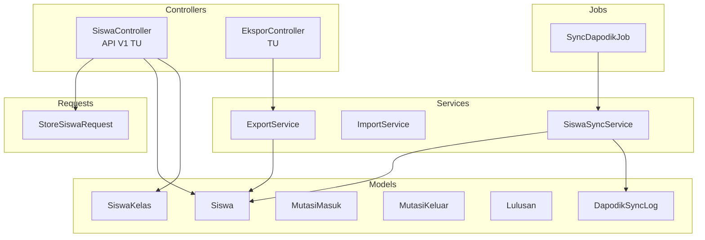
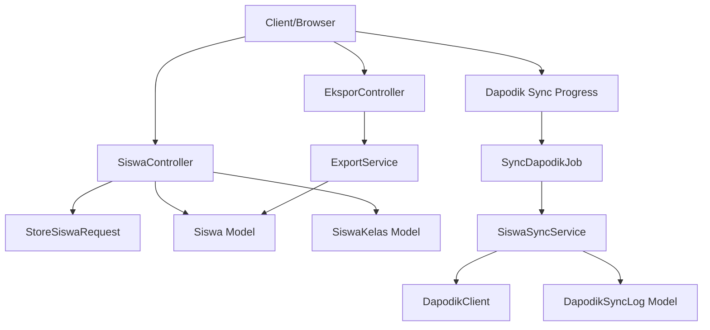
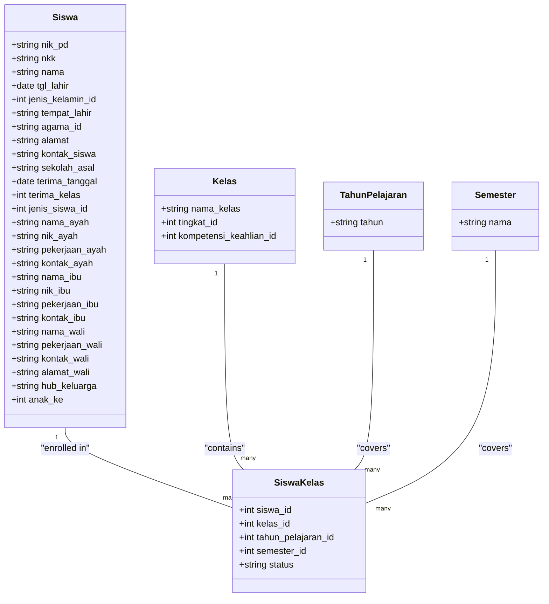
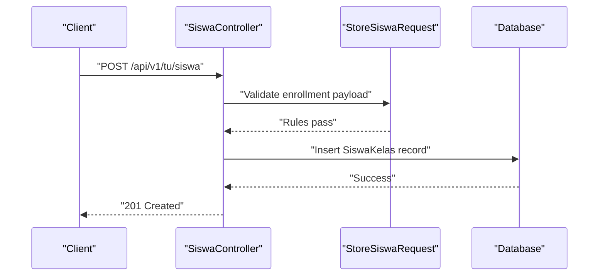
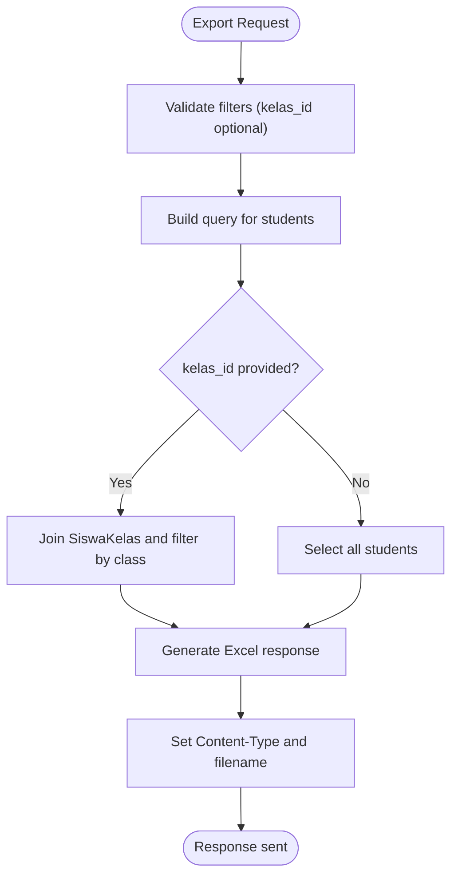
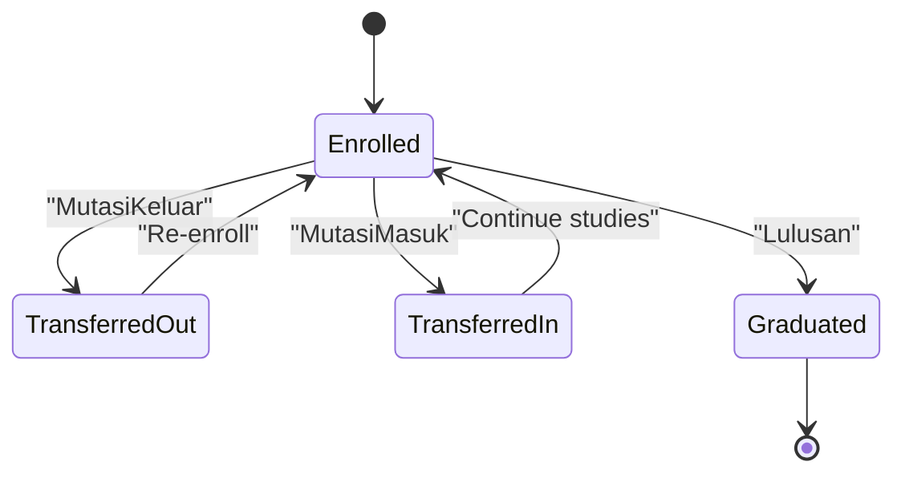
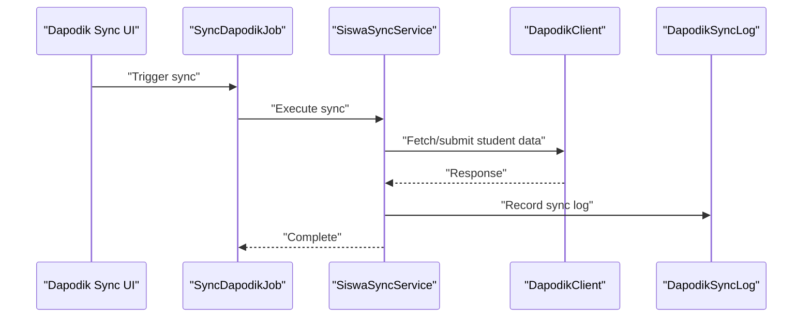
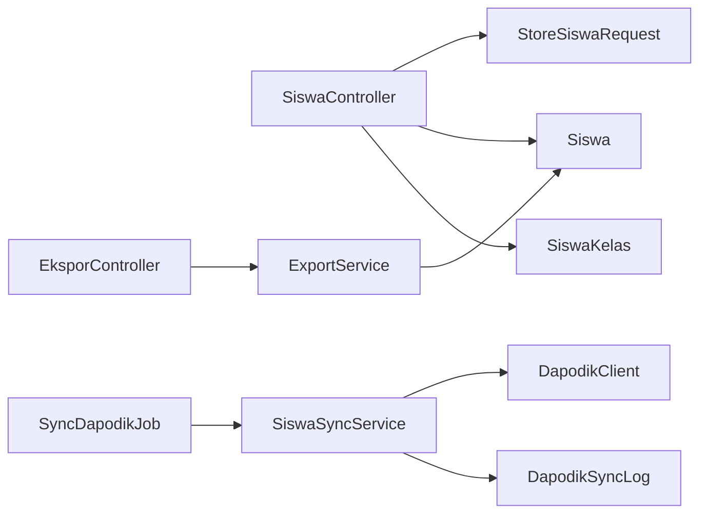

# Student Records Management

<cite>
**Referenced Files in This Document**
- [Siswa.php](file://app/Models/Siswa.php)
- [SiswaSyncService.php](file://app/Services/Dapodik/SiswaSyncService.php)
- [DapodikClient.php](file://app/Services/Dapodik/DapodikClient.php)
- [SyncDapodikJob.php](file://app/Jobs/SyncDapodikJob.php)
- [DapodikSyncLog.php](file://app/Models/DapodikSyncLog.php)
- [SiswaController.php](file://app/Http/Controllers/Api/V1/Tu/SiswaController.php)
- [StoreSiswaRequest.php](file://app/Http/Requests/Api/V1/Tu/StoreSiswaRequest.php)
- [EksporController.php](file://app/Http/Controllers/TU/EksporController.php)
- [ExportService.php](file://app/Services/ExportService.php)
- [ImportService.php](file://app/Services/ImportService.php)
- [SiswaResource.php](file://app/Resources/V1/SiswaResource.php)
- [MutasiMasuk.php](file://app/Models/MutasiMasuk.php)
- [MutasiKeluar.php](file://app/Models/MutasiKeluar.php)
- [Lulusan.php](file://app/Models/Lulusan.php)
- [SiswaKelas.php](file://app/Models/SiswaKelas.php)
- [Kelas.php](file://app/Models/Kelas.php)
- [TahunPelajaran.php](file://app/Models/TahunPelajaran.php)
- [Semester.php](file://app/Models/Semester.php)
- [RefJenisSiswa.php](file://app/Models/RefJenisSiswa.php)
- [RefAgama.php](file://app/Models/RefAgama.php)
- [RefJenisKelamin.php](file://app/Models/RefJenisKelamin.php)
- [RefHubunganKeluarga.php](file://app/Models/RefHubunganKeluarga.php)
- [RefJenisKeluar.php](file://app/Models/RefJenisKeluar.php)
- [activity_log_table.php](file://database/migrations/2026_06_01_000000_create_activity_log_table.php)
- [2026_06_01_010808_create_siswa_table.php](file://database/migrations/2026_06_01_010808_create_siswa_table.php)
- [2026_06_01_010821_create_mutasi_masuk_table.php](file://database/migrations/2026_06_01_010821_create_mutasi_masuk_table.php)
- [2026_06_01_010821_create_mutasi_keluar_table.php](file://database/migrations/2026_06_01_010821_create_mutasi_keluar_table.php)
- [2026_06_01_010821_create_lulusan_table.php](file://database/migrations/2026_06_01_010821_create_lulusan_table.php)
- [2026_06_02_040000_create_dapodik_sync_logs_table.php](file://database/migrations/2026_06_02_040000_create_dapodik_sync_logs_table.php)
- [2026_06_02_050000_add_dapodik_pd_id_to_siswa_table.php](file://database/migrations/2026_06_02_050000_add_dapodik_pd_id_to_siswa_table.php)
- [SiswaExportTest.php](file://tests/Feature/Ekspor/SiswaExportTest.php)
- [ExportServiceTest.php](file://tests/Unit/Services/ExportServiceTest.php)
- [LulusanTest.php](file://tests/Feature/Tu/Lulusan/LulusanTest.php)
- [TuWorkflowIntegrationTest.php](file://tests/Feature/Tu/TuWorkflowIntegrationTest.php)
- [03-manajemen-siswa.md](file://docs/manual-tu/03-manajemen-siswa.md)
</cite>

## Table of Contents
1. [Introduction](#introduction)
2. [Project Structure](#project-structure)
3. [Core Components](#core-components)
4. [Architecture Overview](#architecture-overview)
5. [Detailed Component Analysis](#detailed-component-analysis)
6. [Dependency Analysis](#dependency-analysis)
7. [Performance Considerations](#performance-considerations)
8. [Troubleshooting Guide](#troubleshooting-guide)
9. [Conclusion](#conclusion)
10. [Appendices](#appendices)

## Introduction
This document describes the student records management system within a Laravel application. It covers the complete student enrollment process, including data collection, validation rules, and record creation workflows. It also documents the student profile structure (personal information, family details, and academic history), import/export functionality, bulk operations, data migration processes, student status management (active enrollment, transfers, and graduation tracking), integration with Dapodik data standards, examples of CRUD operations, search and filtering capabilities, reporting features, and data privacy considerations including audit trails and lifecycle management.

## Project Structure
The system organizes student-related functionality across models, controllers, requests, services, jobs, and resources. Key areas include:
- Models for student data, statuses, and reference data
- API controllers for CRUD operations
- Request validators for data rules
- Services for export/import and Dapodik synchronization
- Jobs for asynchronous sync operations
- Blade templates and resources for presentation
- Tests validating workflows and export behavior



**Diagram sources**
- [SiswaController.php:1-200](file://app/Http/Controllers/Api/V1/Tu/SiswaController.php#L1-L200)
- [StoreSiswaRequest.php:1-50](file://app/Http/Requests/Api/V1/Tu/StoreSiswaRequest.php#L1-L50)
- [ExportService.php:1-200](file://app/Services/ExportService.php#L1-L200)
- [ImportService.php:1-200](file://app/Services/ImportService.php#L1-L200)
- [SiswaSyncService.php:1-200](file://app/Services/Dapodik/SiswaSyncService.php#L1-L200)
- [SyncDapodikJob.php:1-120](file://app/Jobs/SyncDapodikJob.php#L1-L120)
- [Siswa.php:1-300](file://app/Models/Siswa.php#L1-L300)
- [SiswaKelas.php:1-200](file://app/Models/SiswaKelas.php#L1-L200)
- [MutasiMasuk.php:1-200](file://app/Models/MutasiMasuk.php#L1-L200)
- [MutasiKeluar.php:1-200](file://app/Models/MutasiKeluar.php#L1-L200)
- [Lulusan.php:1-200](file://app/Models/Lulusan.php#L1-L200)
- [DapodikSyncLog.php:1-200](file://app/Models/DapodikSyncLog.php#L1-L200)

**Section sources**
- [SiswaController.php:1-200](file://app/Http/Controllers/Api/V1/Tu/SiswaController.php#L1-L200)
- [ExportService.php:1-200](file://app/Services/ExportService.php#L1-L200)
- [SiswaSyncService.php:1-200](file://app/Services/Dapodik/SiswaSyncService.php#L1-L200)

## Core Components
- Student model and profile structure
- Enrollment and class membership
- Transfer in/out and graduation tracking
- Export/import and reporting
- Dapodik synchronization
- Validation and request rules
- Audit trail via activity logging

**Section sources**
- [Siswa.php:1-300](file://app/Models/Siswa.php#L1-L300)
- [SiswaKelas.php:1-200](file://app/Models/SiswaKelas.php#L1-L200)
- [MutasiMasuk.php:1-200](file://app/Models/MutasiMasuk.php#L1-L200)
- [MutasiKeluar.php:1-200](file://app/Models/MutasiKeluar.php#L1-L200)
- [Lulusan.php:1-200](file://app/Models/Lulusan.php#L1-L200)

## Architecture Overview
The system follows a layered architecture:
- Presentation: Controllers expose endpoints and render views
- Application: Services encapsulate business logic (export, import, sync)
- Domain: Models define entities and relationships
- Infrastructure: Jobs handle async tasks; migrations define schema



**Diagram sources**
- [SiswaController.php:1-200](file://app/Http/Controllers/Api/V1/Tu/SiswaController.php#L1-L200)
- [StoreSiswaRequest.php:1-50](file://app/Http/Requests/Api/V1/Tu/StoreSiswaRequest.php#L1-L50)
- [Siswa.php:1-300](file://app/Models/Siswa.php#L1-L300)
- [SiswaKelas.php:1-200](file://app/Models/SiswaKelas.php#L1-L200)
- [EksporController.php:1-120](file://app/Http/Controllers/TU/EksporController.php#L1-L120)
- [ExportService.php:1-200](file://app/Services/ExportService.php#L1-L200)
- [SyncDapodikJob.php:1-120](file://app/Jobs/SyncDapodikJob.php#L1-L120)
- [SiswaSyncService.php:1-200](file://app/Services/Dapodik/SiswaSyncService.php#L1-L200)
- [DapodikClient.php:1-200](file://app/Services/Dapodik/DapodikClient.php#L1-L200)
- [DapodikSyncLog.php:1-200](file://app/Models/DapodikSyncLog.php#L1-L200)

## Detailed Component Analysis

### Student Profile Structure and Enrollment
The student profile aggregates personal, family, and academic details. Enrollment ties a student to a class for a specific academic year and semester with an active status.



**Diagram sources**
- [Siswa.php:1-300](file://app/Models/Siswa.php#L1-L300)
- [SiswaKelas.php:1-200](file://app/Models/SiswaKelas.php#L1-L200)
- [Kelas.php:1-200](file://app/Models/Kelas.php#L1-L200)
- [TahunPelajaran.php:1-200](file://app/Models/TahunPelajaran.php#L1-L200)
- [Semester.php:1-200](file://app/Models/Semester.php#L1-L200)

**Section sources**
- [Siswa.php:1-300](file://app/Models/Siswa.php#L1-L300)
- [SiswaKelas.php:1-200](file://app/Models/SiswaKelas.php#L1-L200)
- [Kelas.php:1-200](file://app/Models/Kelas.php#L1-L200)
- [TahunPelajaran.php:1-200](file://app/Models/TahunPelajaran.php#L1-L200)
- [Semester.php:1-200](file://app/Models/Semester.php#L1-L200)

### Student Enrollment Process: Data Collection, Validation, and Record Creation
The enrollment workflow connects a student to a class for a given academic period with an active status.



**Diagram sources**
- [SiswaController.php:1-200](file://app/Http/Controllers/Api/V1/Tu/SiswaController.php#L1-L200)
- [StoreSiswaRequest.php:1-50](file://app/Http/Requests/Api/V1/Tu/StoreSiswaRequest.php#L1-L50)

**Section sources**
- [SiswaController.php:1-200](file://app/Http/Controllers/Api/V1/Tu/SiswaController.php#L1-L200)
- [StoreSiswaRequest.php:1-50](file://app/Http/Requests/Api/V1/Tu/StoreSiswaRequest.php#L1-L50)

### Student Import/Export and Bulk Operations
Bulk operations include exporting student lists and filtering by class. Import is supported via dedicated service.



**Diagram sources**
- [EksporController.php:55-63](file://app/Http/Controllers/TU/EksporController.php#L55-L63)
- [ExportService.php:1-200](file://app/Services/ExportService.php#L1-L200)

**Section sources**
- [EksporController.php:55-63](file://app/Http/Controllers/TU/EksporController.php#L55-L63)
- [ExportService.php:1-200](file://app/Services/ExportService.php#L1-L200)
- [SiswaExportTest.php:1-69](file://tests/Feature/Ekspor/SiswaExportTest.php#L1-L69)
- [ExportServiceTest.php:118-157](file://tests/Unit/Services/ExportServiceTest.php#L118-L157)

### Student Status Management: Active Enrollment, Transfers, and Graduation Tracking
Status transitions are managed through dedicated entities:
- Active enrollment tracked via SiswaKelas with status field
- Transfers in/out recorded in MutasiMasuk and MutasiKeluar
- Graduation tracked in Lulusan



**Diagram sources**
- [SiswaKelas.php:1-200](file://app/Models/SiswaKelas.php#L1-L200)
- [MutasiMasuk.php:1-200](file://app/Models/MutasiMasuk.php#L1-L200)
- [MutasiKeluar.php:1-200](file://app/Models/MutasiKeluar.php#L1-L200)
- [Lulusan.php:1-200](file://app/Models/Lulusan.php#L1-L200)

**Section sources**
- [SiswaKelas.php:1-200](file://app/Models/SiswaKelas.php#L1-L200)
- [MutasiMasuk.php:1-200](file://app/Models/MutasiMasuk.php#L1-L200)
- [MutasiKeluar.php:1-200](file://app/Models/MutasiKeluar.php#L1-L200)
- [Lulusan.php:1-200](file://app/Models/Lulusan.php#L1-L200)
- [LulusanTest.php:1-94](file://tests/Feature/Tu/Lulusan/LulusanTest.php#L1-L94)
- [TuWorkflowIntegrationTest.php:1-81](file://tests/Feature/Tu/TuWorkflowIntegrationTest.php#L1-L81)

### Dapodik Integration and Official Educational Standards
The system integrates with Dapodik via a client and synchronization service, logging sync activities and associating Dapodik identifiers to local records.



**Diagram sources**
- [SyncDapodikJob.php:1-120](file://app/Jobs/SyncDapodikJob.php#L1-L120)
- [SiswaSyncService.php:1-200](file://app/Services/Dapodik/SiswaSyncService.php#L1-L200)
- [DapodikClient.php:1-200](file://app/Services/Dapodik/DapodikClient.php#L1-L200)
- [DapodikSyncLog.php:1-200](file://app/Models/DapodikSyncLog.php#L1-L200)

**Section sources**
- [SiswaSyncService.php:1-200](file://app/Services/Dapodik/SiswaSyncService.php#L1-L200)
- [DapodikClient.php:1-200](file://app/Services/Dapodik/DapodikClient.php#L1-L200)
- [DapodikSyncLog.php:1-200](file://app/Models/DapodikSyncLog.php#L1-L200)
- [2026_06_02_040000_create_dapodik_sync_logs_table.php:1-200](file://database/migrations/2026_06_02_040000_create_dapodik_sync_logs_table.php#L1-L200)
- [2026_06_02_050000_add_dapodik_pd_id_to_siswa_table.php:1-200](file://database/migrations/2026_06_02_050000_add_dapodik_pd_id_to_siswa_table.php#L1-L200)

### CRUD Operations, Search, Filtering, and Reporting
- CRUD endpoints for students are exposed via the API controller with request validation
- Filtering is supported during exports (by class)
- Reporting includes exported spreadsheets and dashboard summaries
- Search and filtering can be extended via additional request parameters and scopes

Examples of operations:
- Create student enrollment: [SiswaController.php:1-200](file://app/Http/Controllers/Api/V1/Tu/SiswaController.php#L1-L200)
- Export all students: [EksporController.php:55-63](file://app/Http/Controllers/TU/EksporController.php#L55-L63)
- Export filtered by class: [EksporController.php:55-63](file://app/Http/Controllers/TU/EksporController.php#L55-L63)
- Lulusan CRUD validations: [LulusanTest.php:1-94](file://tests/Feature/Tu/Lulusan/LulusanTest.php#L1-L94)

**Section sources**
- [SiswaController.php:1-200](file://app/Http/Controllers/Api/V1/Tu/SiswaController.php#L1-L200)
- [StoreSiswaRequest.php:1-50](file://app/Http/Requests/Api/V1/Tu/StoreSiswaRequest.php#L1-L50)
- [EksporController.php:55-63](file://app/Http/Controllers/TU/EksporController.php#L55-L63)
- [LulusanTest.php:1-94](file://tests/Feature/Tu/Lulusan/LulusanTest.php#L1-L94)

### Data Privacy, Audit Trails, and Lifecycle Management
- Activity logging captures user actions for auditability
- Soft deletes are used for graduation records
- Reference data ensures standardized values (gender, religion, relationship, exit type)
- Lifecycle: enrollment → active status → transfer/graduation → archived/deleted

```mermaid
erDiagram
ACTIVITY_LOG {
int id PK
string log_name
string description
int subject_id
string subject_type
int causer_id
string causer_type
json_properties
datetime created_at
datetime updated_at
}
REF_JENIS_SISWA {
int id PK
string nama
}
REF_JENIS_KELUAR {
int id PK
string nama
}
ACTIVITY_LOG ||--|| Siswa : "subject"
REF_JENIS_SISWA ||--o{ Siswa : "defines"
REF_JENIS_KELUAR ||--o{ MutasiKeluar : "defines"
```

**Diagram sources**
- [activity_log_table.php:1-200](file://database/migrations/2026_06_01_000000_create_activity_log_table.php#L1-L200)
- [RefJenisSiswa.php:1-200](file://app/Models/RefJenisSiswa.php#L1-L200)
- [RefJenisKeluar.php:1-200](file://app/Models/RefJenisKeluar.php#L1-L200)
- [Siswa.php:1-300](file://app/Models/Siswa.php#L1-L300)
- [MutasiKeluar.php:1-200](file://app/Models/MutasiKeluar.php#L1-L200)

**Section sources**
- [activity_log_table.php:1-200](file://database/migrations/2026_06_01_000000_create_activity_log_table.php#L1-L200)
- [Lulusan.php:1-200](file://app/Models/Lulusan.php#L1-L200)
- [RefJenisSiswa.php:1-200](file://app/Models/RefJenisSiswa.php#L1-L200)
- [RefJenisKeluar.php:1-200](file://app/Models/RefJenisKeluar.php#L1-L200)

## Dependency Analysis
The following diagram highlights key dependencies among components involved in student management.



**Diagram sources**
- [SiswaController.php:1-200](file://app/Http/Controllers/Api/V1/Tu/SiswaController.php#L1-L200)
- [StoreSiswaRequest.php:1-50](file://app/Http/Requests/Api/V1/Tu/StoreSiswaRequest.php#L1-L50)
- [Siswa.php:1-300](file://app/Models/Siswa.php#L1-L300)
- [SiswaKelas.php:1-200](file://app/Models/SiswaKelas.php#L1-L200)
- [EksporController.php:1-120](file://app/Http/Controllers/TU/EksporController.php#L1-L120)
- [ExportService.php:1-200](file://app/Services/ExportService.php#L1-L200)
- [SyncDapodikJob.php:1-120](file://app/Jobs/SyncDapodikJob.php#L1-L120)
- [SiswaSyncService.php:1-200](file://app/Services/Dapodik/SiswaSyncService.php#L1-L200)
- [DapodikClient.php:1-200](file://app/Services/Dapodik/DapodikClient.php#L1-L200)
- [DapodikSyncLog.php:1-200](file://app/Models/DapodikSyncLog.php#L1-L200)

**Section sources**
- [SiswaController.php:1-200](file://app/Http/Controllers/Api/V1/Tu/SiswaController.php#L1-L200)
- [EksporController.php:1-120](file://app/Http/Controllers/TU/EksporController.php#L1-L120)
- [SyncDapodikJob.php:1-120](file://app/Jobs/SyncDapodikJob.php#L1-L120)

## Performance Considerations
- Use pagination for large student datasets in exports and listings
- Index foreign keys (siswa_id, kelas_id, tahun_pelajaran_id, semester_id) to optimize joins
- Batch export operations to reduce memory footprint
- Queue long-running sync operations via jobs
- Cache frequently accessed reference data (gender, religion, relationship types)

## Troubleshooting Guide
Common issues and resolutions:
- Export returns unauthorized: ensure proper authentication and role checks
  - See: [SiswaExportTest.php:64-69](file://tests/Feature/Ekspor/SiswaExportTest.php#L64-L69)
- Unique validation failures on graduation records (e.g., no_ijazah):
  - See: [LulusanTest.php:64-81](file://tests/Feature/Tu/Lulusan/LulusanTest.php#L64-L81)
- Full workflow integration tests:
  - See: [TuWorkflowIntegrationTest.php:1-81](file://tests/Feature/Tu/TuWorkflowIntegrationTest.php#L1-L81)
- Manual guidance for class promotion:
  - See: [03-manajemen-siswa.md:78-80](file://docs/manual-tu/03-manajemen-siswa.md#L78-L80)

**Section sources**
- [SiswaExportTest.php:64-69](file://tests/Feature/Ekspor/SiswaExportTest.php#L64-L69)
- [LulusanTest.php:64-81](file://tests/Feature/Tu/Lulusan/LulusanTest.php#L64-L81)
- [TuWorkflowIntegrationTest.php:1-81](file://tests/Feature/Tu/TuWorkflowIntegrationTest.php#L1-L81)
- [03-manajemen-siswa.md:78-80](file://docs/manual-tu/03-manajemen-siswa.md#L78-L80)

## Conclusion
The student records management system provides a robust foundation for enrollment, status tracking, reporting, and Dapodik alignment. Its modular design supports scalability, maintainability, and compliance with educational data standards. Extending search/filter capabilities, adding more granular audit logs, and optimizing batch operations will further strengthen the platform.

## Appendices
- Additional reference data models:
  - [RefAgama.php:1-200](file://app/Models/RefAgama.php#L1-L200)
  - [RefJenisKelamin.php:1-200](file://app/Models/RefJenisKelamin.php#L1-L200)
  - [RefHubunganKeluarga.php:1-200](file://app/Models/RefHubunganKeluarga.php#L1-L200)
- Migration references:
  - [2026_06_01_010808_create_siswa_table.php:1-200](file://database/migrations/2026_06_01_010808_create_siswa_table.php#L1-L200)
  - [2026_06_01_010821_create_mutasi_masuk_table.php:1-200](file://database/migrations/2026_06_01_010821_create_mutasi_masuk_table.php#L1-L200)
  - [2026_06_01_010821_create_mutasi_keluar_table.php:1-200](file://database/migrations/2026_06_01_010821_create_mutasi_keluar_table.php#L1-L200)
  - [2026_06_01_010821_create_lulusan_table.php:1-200](file://database/migrations/2026_06_01_010821_create_lulusan_table.php#L1-L200)
  - [2026_06_02_040000_create_dapodik_sync_logs_table.php:1-200](file://database/migrations/2026_06_02_040000_create_dapodik_sync_logs_table.php#L1-L200)
  - [2026_06_02_050000_add_dapodik_pd_id_to_siswa_table.php:1-200](file://database/migrations/2026_06_02_050000_add_dapodik_pd_id_to_siswa_table.php#L1-L200)