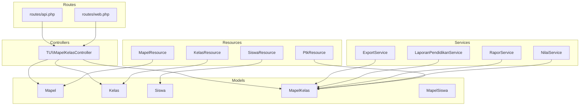
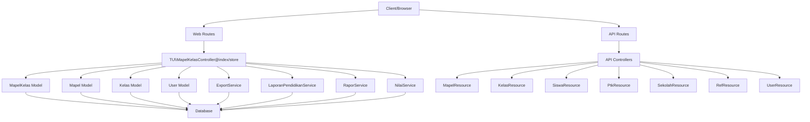
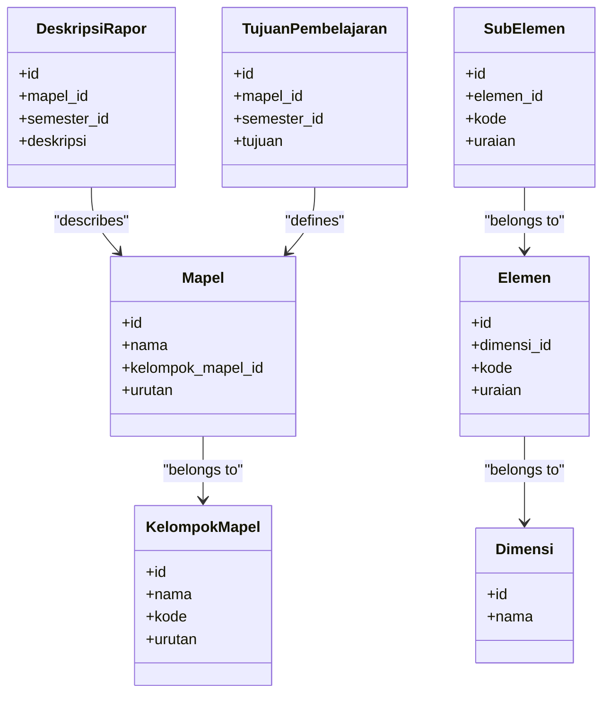
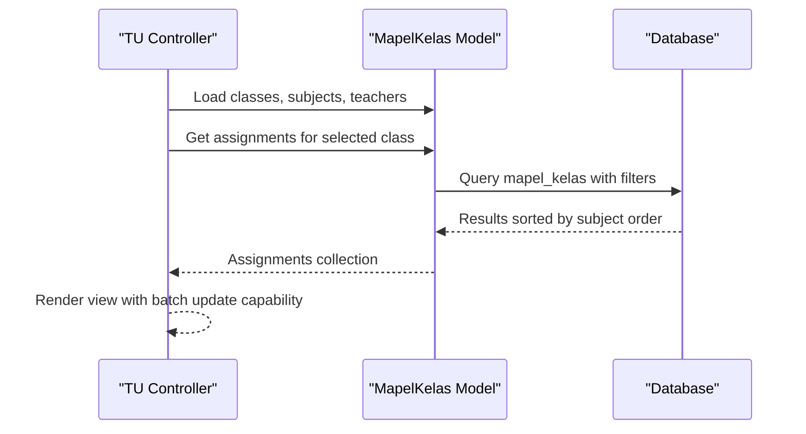
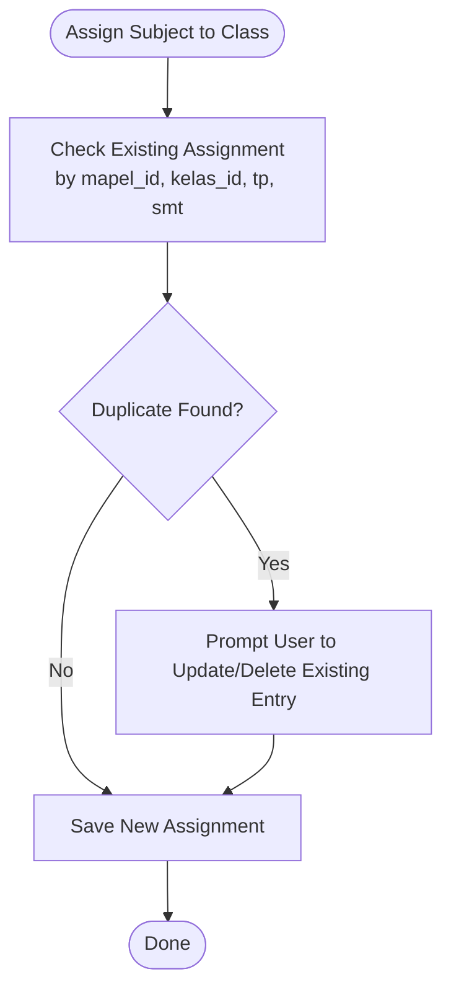
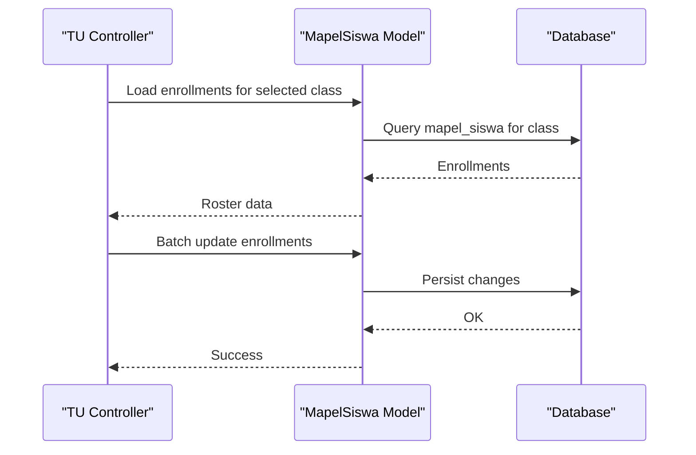
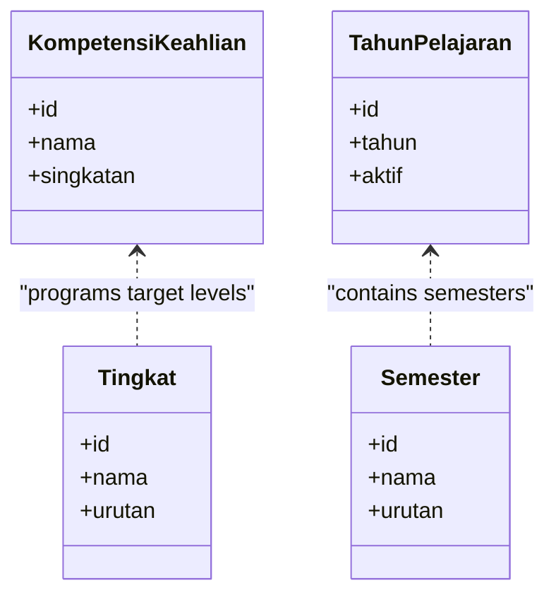
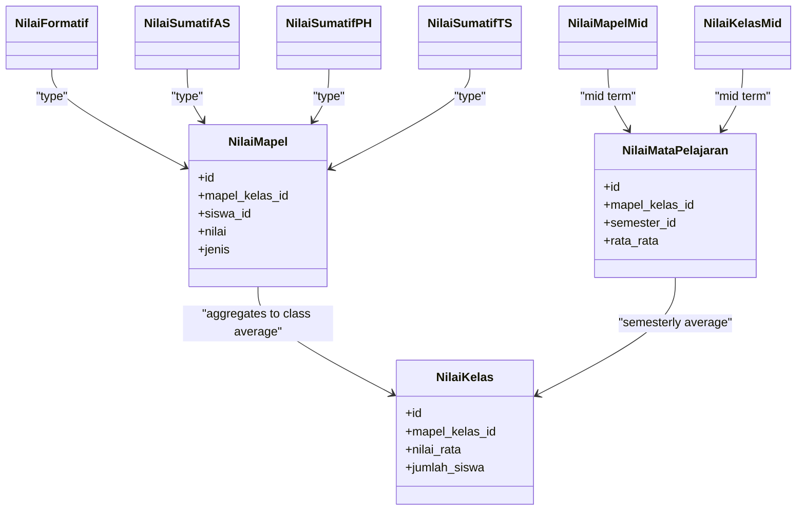
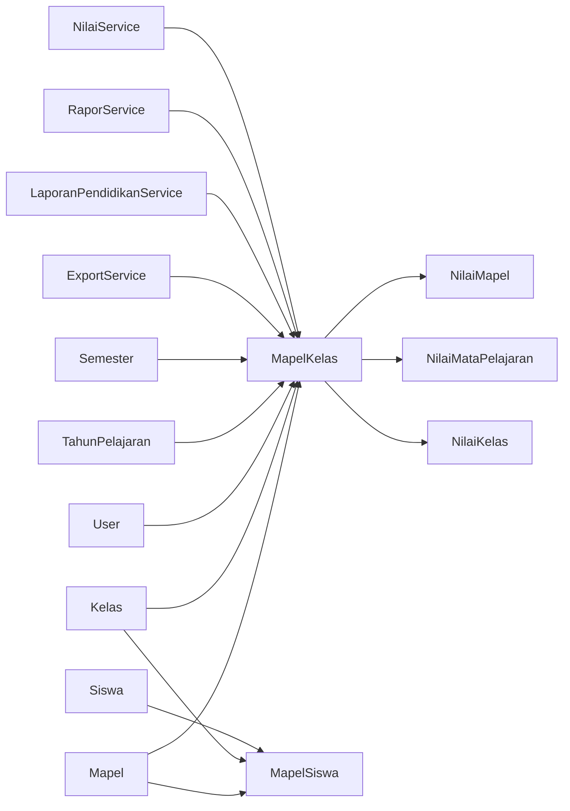

# Subject & Curriculum Management

<cite>
**Referenced Files in This Document**
- [04-manajemen-kurikulum.md](file://docs/manual-tu/04-manajemen-kurikulum.md)
- [MapelKelasController.php](file://app/Http/Controllers/TU/MapelKelasController.php)
- [create_mapel_kelas_table.php](file://database/migrations/2026_06_01_010816_create_mapel_kelas_table.php)
- [MapelKelas.php](file://app/Models/MapelKelas.php)
- [Mapel.php](file://app/Models/Mapel.php)
- [Kelas.php](file://app/Models/Kelas.php)
- [User.php](file://app/Models/User.php)
- [MapelSiswa.php](file://app/Models/MapelSiswa.php)
- [create_mapel_siswa_table.php](file://database/migrations/2026_06_01_010816_create_mapel_siswa_table.php)
- [create_mapel_table.php](file://database/migrations/2026_06_01_010808_create_mapel_table.php)
- [create_kompetensi_keahlian_table.php](file://database/migrations/2026_06_01_010808_create_kompetensi_keahlian_table.php)
- [create_tingkat_table.php](file://database/migrations/2026_06_01_010808_create_tingkat_table.php)
- [create_kelompok_mapel_table.php](file://database/migrations/2026_06_01_010807_create_kelompok_mapel_table.php)
- [create_ref_kurikulum_table.php](file://database/migrations/2026_06_01_010807_create_ref_kurikulum_table.php)
- [create_tahun_pelajaran_table.php](file://database/migrations/2026_06_01_010807_create_tahun_pelajaran_table.php)
- [create_semester_table.php](file://database/migrations/2026_06_01_010808_create_semester_table.php)
- [create_kelas_table.php](file://database/migrations/2026_06_01_010809_create_kelas_table.php)
- [create_siswa_table.php](file://database/migrations/2026_06_01_010808_create_siswa_table.php)
- [create_tujuan_pembelajaran_table.php](file://database/migrations/2026_06_01_010816_create_tujuan_pembelajaran_table.php)
- [create_nilai_mapel_table.php](file://database/migrations/2026_06_01_010817_create_nilai_mapel_table.php)
- [create_nilai_kelas_table.php](file://database/migrations/2026_06_01_010818_create_nilai_kelas_table.php)
- [create_nilai_mata_pelajaran_table.php](file://database/migrations/2026_06_01_010818_create_nilai_mata_pelajaran_table.php)
- [create_mapel_proyek_table.php](file://database/migrations/2026_06_01_010819_create_mapel_proyek_table.php)
- [create_proyek_kelas_table.php](file://database/migrations/2026_06_01_010818_create_proyek_kelas_table.php)
- [create_proyek_tema_table.php](file://database/migrations/2026_06_01_010817_create_proyek_tema_table.php)
- [create_proyek_tujuan_table.php](file://database/migrations/2026_06_01_010819_create_proyek_tujuan_table.php)
- [create_proyek_subelemen_table.php](file://database/migrations/2026_06_01_010818_create_proyek_subelemen_table.php)
- [create_elemen_table.php](file://database/migrations/2026_06_01_010818_create_elemen_table.php)
- [create_sub_elemen_table.php](file://database/migrations/2026_06_01_010818_create_sub_elemen_table.php)
- [create_dimensi_table.php](file://database/migrations/2026_06_01_010809_create_dimensi_table.php)
- [create_deskripsi_rapor_table.php](file://database/migrations/2026_06_01_010809_create_deskripsi_rapor_table.php)
- [create_deskripsi_kokurikuler_table.php](file://database/migrations/2026_06_01_010809_create_deskripsi_kokurikuler_table.php)
- [create_nilai_kokurikuler_table.php](file://database/migrations/2026_06_01_010819_create_nilai_kokurikuler_table.php)
- [create_nilai_proyek_table.php](file://database/migrations/2026_06_01_010819_create_nilai_proyek_table.php)
- [create_nilai_assesmen_subelemen_table.php](file://database/migrations/2026_06_01_010819_create_nilai_assesmen_subelemen_table.php)
- [create_nilai_formatif_table.php](file://database/migrations/2026_06_01_010817_create_nilai_formatif_table.php)
- [create_nilai_mapel_mid_table.php](file://database/migrations/2026_06_01_010818_create_nilai_mapel_mid_table.php)
- [create_nilai_kelas_mid_table.php](file://database/migrations/2026_06_01_010818_create_nilai_kelas_mid_table.php)
- [create_nilai_sumatif_as_table.php](file://database/migrations/2026_06_01_010817_create_nilai_sumatif_as_table.php)
- [create_nilai_sumatif_ph_table.php](file://database/migrations/2026_06_01_010817_create_nilai_sumatif_ph_table.php)
- [create_nilai_sumatif_ts_table.php](file://database/migrations/2026_06_01_010817_create_nilai_sumatif_ts_table.php)
- [create_prakerin_table.php](file://database/migrations/2026_06_01_010818_create_prakerin_table.php)
- [create_siswa_prakerin_table.php](file://database/migrations/2026_06_01_010819_create_siswa_prakerin_table.php)
- [create_nilai_prakerin_table.php](file://database/migrations/2026_06_01_010820_create_nilai_prakerin_table.php)
- [create_pembagian_raport_table.php](file://database/migrations/2026_06_01_010810_create_pembagian_raport_table.php)
- [create_ref_hari_table.php](file://database/migrations/2026_06_01_010802_create_ref_hari_table.php)
- [create_ref_bulan_table.php](file://database/migrations/2026_06_01_010802_create_ref_bulan_table.php)
- [ExportService.php](file://app/Services/ExportService.php)
- [LaporanPendidikanService.php](file://app/Services/LaporanPendidikanService.php)
- [RaporService.php](file://app/Services/RaporService.php)
- [NilaiService.php](file://app/Services/NilaiService.php)
- [MapelResource.php](file://app/Resources/V1/MapelResource.php)
- [KelasResource.php](file://app/Resources/V1/KelasResource.php)
- [SiswaResource.php](file://app/Resources/V1/SiswaResource.php)
- [PegawaiResource.php](file://app/Resources/V1/PegawaiResource.php)
- [PtkResource.php](file://app/Resources/V1/PtkResource.php)
- [SekolahResource.php](file://app/Resources/V1/SekolahResource.php)
- [RefResource.php](file://app/Resources/V1/RefResource.php)
- [UserResource.php](file://app/Resources/V1/UserResource.php)
- [api.php](file://routes/api.php)
- [web.php](file://routes/web.php)
</cite>

## Table of Contents
1. [Introduction](#introduction)
2. [Project Structure](#project-structure)
3. [Core Components](#core-components)
4. [Architecture Overview](#architecture-overview)
5. [Detailed Component Analysis](#detailed-component-analysis)
6. [Dependency Analysis](#dependency-analysis)
7. [Performance Considerations](#performance-considerations)
8. [Troubleshooting Guide](#troubleshooting-guide)
9. [Conclusion](#conclusion)
10. [Appendices](#appendices)

## Introduction
This document describes the Subject & Curriculum Management system, focusing on course structure, subject scheduling, academic program organization, and curriculum mapping. It covers subject creation and management workflows, credit hours and prerequisites, class assignment and teacher-subject allocation, classroom scheduling, curriculum planning tools, course catalog management, and alignment with national curriculum requirements and competency-based education frameworks. It also documents subject enrollment, class roster management, schedule conflict resolution, curriculum data export, academic planning reports, and program assessment capabilities.

## Project Structure
The system is built on Laravel with a modular structure:
- Controllers under app/Http/Controllers handle user interactions for TU (Administrative) and Guru (Teaching) roles.
- Models under app/Models represent domain entities such as subjects (Mapel), classes (Kelas), students (Siswa), and assignments (MapelKelas).
- Migrations under database/migrations define the relational schema for curriculum, enrollment, grading, and reporting.
- Services under app/Services encapsulate export, report generation, and grade computation logic.
- Resources under app/Resources/V1 provide standardized API responses.
- Documentation under docs/manual-tu provides role-specific operational guidance.

**Diagram sources**
- [MapelKelasController.php:1-100](file://app/Http/Controllers/TU/MapelKelasController.php#L1-L100)
- [MapelKelas.php](file://app/Models/MapelKelas.php)
- [Mapel.php](file://app/Models/Mapel.php)
- [Kelas.php](file://app/Models/Kelas.php)
- [MapelSiswa.php](file://app/Models/MapelSiswa.php)
- [ExportService.php](file://app/Services/ExportService.php)
- [LaporanPendidikanService.php](file://app/Services/LaporanPendidikanService.php)
- [RaporService.php](file://app/Services/RaporService.php)
- [NilaiService.php](file://app/Services/NilaiService.php)
- [MapelResource.php](file://app/Resources/V1/MapelResource.php)
- [KelasResource.php](file://app/Resources/V1/KelasResource.php)
- [SiswaResource.php](file://app/Resources/V1/SiswaResource.php)
- [PtkResource.php](file://app/Resources/V1/PtkResource.php)
- [api.php](file://routes/api.php)
- [web.php](file://routes/web.php)

**Section sources**
- [MapelKelasController.php:1-100](file://app/Http/Controllers/TU/MapelKelasController.php#L1-L100)
- [MapelKelas.php](file://app/Models/MapelKelas.php)
- [Mapel.php](file://app/Models/Mapel.php)
- [Kelas.php](file://app/Models/Kelas.php)
- [MapelSiswa.php](file://app/Models/MapelSiswa.php)
- [ExportService.php](file://app/Services/ExportService.php)
- [LaporanPendidikanService.php](file://app/Services/LaporanPendidikanService.php)
- [RaporService.php](file://app/Services/RaporService.php)
- [NilaiService.php](file://app/Services/NilaiService.php)
- [MapelResource.php](file://app/Resources/V1/MapelResource.php)
- [KelasResource.php](file://app/Resources/V1/KelasResource.php)
- [SiswaResource.php](file://app/Resources/V1/SiswaResource.php)
- [PtkResource.php](file://app/Resources/V1/PtkResource.php)
- [api.php](file://routes/api.php)
- [web.php](file://routes/web.php)

## Core Components
- Subject Catalog (Mapel): Defines subjects, grouping, ordering, and attributes used in transcripts and schedules.
- Class Assignment (MapelKelas): Links subjects to classes and teachers per academic term/semester, enabling role-based menus and grade entry.
- Student Enrollment (MapelSiswa): Assigns subjects to individual students within a class.
- Academic Program Entities: Competency (KompetensiKeahlian), Grade Level (Tingkat), Subject Group (KelompokMapel), Academic Year/Semester (TahunPelajaran, Semester), and School Reference (RefKurikulum).
- Grading and Reporting: Numeric grades, formative/summative assessments, mid-term, and competency descriptors.
- Curriculum Alignment: Descriptive rubrics and learning goals aligned to national curriculum frameworks.
- Export and Reports: Academic planning reports and curriculum data exports via services.

**Section sources**
- [04-manajemen-kurikulum.md:1-68](file://docs/manual-tu/04-manajemen-kurikulum.md#L1-L68)
- [create_mapel_table.php](file://database/migrations/2026_06_01_010808_create_mapel_table.php)
- [create_mapel_kelas_table.php](file://database/migrations/2026_06_01_010816_create_mapel_kelas_table.php)
- [create_mapel_siswa_table.php](file://database/migrations/2026_06_01_010816_create_mapel_siswa_table.php)
- [create_kompetensi_keahlian_table.php](file://database/migrations/2026_06_01_010808_create_kompetensi_keahlian_table.php)
- [create_tingkat_table.php](file://database/migrations/2026_06_01_010808_create_tingkat_table.php)
- [create_kelompok_mapel_table.php](file://database/migrations/2026_06_01_010807_create_kelompok_mapel_table.php)
- [create_ref_kurikulum_table.php](file://database/migrations/2026_06_01_010807_create_ref_kurikulum_table.php)
- [create_tahun_pelajaran_table.php](file://database/migrations/2026_06_01_010807_create_tahun_pelajaran_table.php)
- [create_semester_table.php](file://database/migrations/2026_06_01_010808_create_semester_table.php)
- [create_kelas_table.php](file://database/migrations/2026_06_01_010809_create_kelas_table.php)
- [create_siswa_table.php](file://database/migrations/2026_06_01_010808_create_siswa_table.php)
- [create_tujuan_pembelajaran_table.php](file://database/migrations/2026_06_01_010816_create_tujuan_pembelajaran_table.php)
- [create_nilai_mapel_table.php](file://database/migrations/2026_06_01_010817_create_nilai_mapel_table.php)
- [create_nilai_kelas_table.php](file://database/migrations/2026_06_01_010818_create_nilai_kelas_table.php)
- [create_nilai_mata_pelajaran_table.php](file://database/migrations/2026_06_01_010818_create_nilai_mata_pelajaran_table.php)
- [create_mapel_proyek_table.php](file://database/migrations/2026_06_01_010819_create_mapel_proyek_table.php)
- [create_proyek_kelas_table.php](file://database/migrations/2026_06_01_010818_create_proyek_kelas_table.php)
- [create_proyek_tema_table.php](file://database/migrations/2026_06_01_010817_create_proyek_tema_table.php)
- [create_proyek_tujuan_table.php](file://database/migrations/2026_06_01_010819_create_proyek_tujuan_table.php)
- [create_proyek_subelemen_table.php](file://database/migrations/2026_06_01_010818_create_proyek_subelemen_table.php)
- [create_elemen_table.php](file://database/migrations/2026_06_01_010818_create_elemen_table.php)
- [create_sub_elemen_table.php](file://database/migrations/2026_06_01_010818_create_sub_elemen_table.php)
- [create_dimensi_table.php](file://database/migrations/2026_06_01_010809_create_dimensi_table.php)
- [create_deskripsi_rapor_table.php](file://database/migrations/2026_06_01_010809_create_deskripsi_rapor_table.php)
- [create_deskripsi_kokurikuler_table.php](file://database/migrations/2026_06_01_010809_create_deskripsi_kokurikuler_table.php)
- [create_nilai_kokurikuler_table.php](file://database/migrations/2026_06_01_010819_create_nilai_kokurikuler_table.php)
- [create_nilai_proyek_table.php](file://database/migrations/2026_06_01_010819_create_nilai_proyek_table.php)
- [create_nilai_assesmen_subelemen_table.php](file://database/migrations/2026_06_01_010819_create_nilai_assesmen_subelemen_table.php)
- [create_nilai_formatif_table.php](file://database/migrations/2026_06_01_010817_create_nilai_formatif_table.php)
- [create_nilai_mapel_mid_table.php](file://database/migrations/2026_06_01_010818_create_nilai_mapel_mid_table.php)
- [create_nilai_kelas_mid_table.php](file://database/migrations/2026_06_01_010818_create_nilai_kelas_mid_table.php)
- [create_nilai_sumatif_as_table.php](file://database/migrations/2026_06_01_010817_create_nilai_sumatif_as_table.php)
- [create_nilai_sumatif_ph_table.php](file://database/migrations/2026_06_01_010817_create_nilai_sumatif_ph_table.php)
- [create_nilai_sumatif_ts_table.php](file://database/migrations/2026_06_01_010817_create_nilai_sumatif_ts_table.php)
- [create_prakerin_table.php](file://database/migrations/2026_06_01_010818_create_prakerin_table.php)
- [create_siswa_prakerin_table.php](file://database/migrations/2026_06_01_010819_create_siswa_prakerin_table.php)
- [create_nilai_prakerin_table.php](file://database/migrations/2026_06_01_010820_create_nilai_prakerin_table.php)
- [create_pembagian_raport_table.php](file://database/migrations/2026_06_01_010810_create_pembagian_raport_table.php)
- [create_ref_hari_table.php](file://database/migrations/2026_06_01_010802_create_ref_hari_table.php)
- [create_ref_bulan_table.php](file://database/migrations/2026_06_01_010802_create_ref_bulan_table.php)

## Architecture Overview
The system separates concerns across controllers, models, services, and resources:
- Controllers orchestrate requests and delegate to services for heavy computations.
- Models define relationships and constraints for curriculum and enrollment.
- Services encapsulate export/reporting and grade aggregation logic.
- Resources standardize API output for clients.

**Diagram sources**
- [MapelKelasController.php:1-100](file://app/Http/Controllers/TU/MapelKelasController.php#L1-L100)
- [MapelKelas.php](file://app/Models/MapelKelas.php)
- [Mapel.php](file://app/Models/Mapel.php)
- [Kelas.php](file://app/Models/Kelas.php)
- [User.php](file://app/Models/User.php)
- [ExportService.php](file://app/Services/ExportService.php)
- [LaporanPendidikanService.php](file://app/Services/LaporanPendidikanService.php)
- [RaporService.php](file://app/Services/RaporService.php)
- [NilaiService.php](file://app/Services/NilaiService.php)
- [MapelResource.php](file://app/Resources/V1/MapelResource.php)
- [KelasResource.php](file://app/Resources/V1/KelasResource.php)
- [SiswaResource.php](file://app/Resources/V1/SiswaResource.php)
- [PegawaiResource.php](file://app/Resources/V1/PegawaiResource.php)
- [PtkResource.php](file://app/Resources/V1/PtkResource.php)
- [SekolahResource.php](file://app/Resources/V1/SekolahResource.php)
- [RefResource.php](file://app/Resources/V1/RefResource.php)
- [UserResource.php](file://app/Resources/V1/UserResource.php)
- [api.php](file://routes/api.php)
- [web.php](file://routes/web.php)

## Detailed Component Analysis

### Subject Catalog and Curriculum Mapping
- Subject definition includes grouping (KelompokMapel), order (urutan), and attributes used in transcripts.
- Curriculum alignment is supported by descriptors (DeskripsiRapor, DeskripsiKokurikuler), learning goals (TujuanPembelajaran), and competency elements (Elemen, SubElemen, Dimensi).
- Academic year and semester are tracked separately to enable temporal curriculum mapping.

**Diagram sources**
- [Mapel.php](file://app/Models/Mapel.php)
- [create_kelompok_mapel_table.php](file://database/migrations/2026_06_01_010807_create_kelompok_mapel_table.php)
- [create_deskripsi_rapor_table.php](file://database/migrations/2026_06_01_010809_create_deskripsi_rapor_table.php)
- [create_tujuan_pembelajaran_table.php](file://database/migrations/2026_06_01_010816_create_tujuan_pembelajaran_table.php)
- [create_dimensi_table.php](file://database/migrations/2026_06_01_010809_create_dimensi_table.php)
- [create_elemen_table.php](file://database/migrations/2026_06_01_010818_create_elemen_table.php)
- [create_sub_elemen_table.php](file://database/migrations/2026_06_01_010818_create_sub_elemen_table.php)

**Section sources**
- [create_mapel_table.php](file://database/migrations/2026_06_01_010808_create_mapel_table.php)
- [create_kelompok_mapel_table.php](file://database/migrations/2026_06_01_010807_create_kelompok_mapel_table.php)
- [create_deskripsi_rapor_table.php](file://database/migrations/2026_06_01_010809_create_deskripsi_rapor_table.php)
- [create_tujuan_pembelajaran_table.php](file://database/migrations/2026_06_01_010816_create_tujuan_pembelajaran_table.php)
- [create_dimensi_table.php](file://database/migrations/2026_06_01_010809_create_dimensi_table.php)
- [create_elemen_table.php](file://database/migrations/2026_06_01_010818_create_elemen_table.php)
- [create_sub_elemen_table.php](file://database/migrations/2026_06_01_010818_create_sub_elemen_table.php)

### Class Assignment and Teacher-Subject Allocation
- MapelKelas links subjects to classes and teachers per academic term/semester, with optional KKM threshold.
- The controller loads classes, subjects, teachers, and existing assignments, sorting by subject order.
- Batch updates are supported for efficient assignment management.

**Diagram sources**
- [MapelKelasController.php:15-33](file://app/Http/Controllers/TU/MapelKelasController.php#L15-L33)
- [create_mapel_kelas_table.php](file://database/migrations/2026_06_01_010816_create_mapel_kelas_table.php)
- [MapelKelas.php](file://app/Models/MapelKelas.php)

**Section sources**
- [MapelKelasController.php:1-100](file://app/Http/Controllers/TU/MapelKelasController.php#L1-L100)
- [create_mapel_kelas_table.php](file://database/migrations/2026_06_01_010816_create_mapel_kelas_table.php)
- [MapelKelas.php](file://app/Models/MapelKelas.php)

### Classroom Scheduling and Conflict Resolution
- Scheduling is implicit through MapelKelas entries per term/semester and class.
- Conflict detection relies on unique indexing on (mapel_id, kelas_id, tahun_pelajaran_id, semester_id) to prevent duplicate entries.
- Practical conflict resolution occurs during batch updates and manual reconciliation in the UI.

**Diagram sources**
- [create_mapel_kelas_table.php](file://database/migrations/2026_06_01_010816_create_mapel_kelas_table.php)

**Section sources**
- [create_mapel_kelas_table.php](file://database/migrations/2026_06_01_010816_create_mapel_kelas_table.php)

### Subject Enrollment and Class Roster Management
- MapelSiswa assigns subjects to students within a class, supporting automatic enrollment based on class membership.
- Batch updates streamline roster management for large classes.

**Diagram sources**
- [create_mapel_siswa_table.php](file://database/migrations/2026_06_01_010816_create_mapel_siswa_table.php)
- [MapelSiswa.php](file://app/Models/MapelSiswa.php)

**Section sources**
- [create_mapel_siswa_table.php](file://database/migrations/2026_06_01_010816_create_mapel_siswa_table.php)
- [MapelSiswa.php](file://app/Models/MapelSiswa.php)

### Academic Program Organization
- Competency programs (KompetensiKeahlian) and grade levels (Tingkat) organize curriculum offerings.
- Academic year and semester entities support temporal curriculum planning.

**Diagram sources**
- [create_kompetensi_keahlian_table.php](file://database/migrations/2026_06_01_010808_create_kompetensi_keahlian_table.php)
- [create_tingkat_table.php](file://database/migrations/2026_06_01_010808_create_tingkat_table.php)
- [create_tahun_pelajaran_table.php](file://database/migrations/2026_06_01_010807_create_tahun_pelajaran_table.php)
- [create_semester_table.php](file://database/migrations/2026_06_01_010808_create_semester_table.php)

**Section sources**
- [create_kompetensi_keahlian_table.php](file://database/migrations/2026_06_01_010808_create_kompetensi_keahlian_table.php)
- [create_tingkat_table.php](file://database/migrations/2026_06_01_010808_create_tingkat_table.php)
- [create_tahun_pelajaran_table.php](file://database/migrations/2026_06_01_010807_create_tahun_pelajaran_table.php)
- [create_semester_table.php](file://database/migrations/2026_06_01_010808_create_semester_table.php)

### Curriculum Planning Tools and Course Catalog Management
- The TU manual documents adding/editing subjects, managing levels, competencies, subject groups, and class maps.
- Class map (MapelKelas) ties subjects to teachers and classes, determining visible menus for teachers.

**Section sources**
- [04-manajemen-kurikulum.md:1-68](file://docs/manual-tu/04-manajemen-kurikulum.md#L1-L68)

### Academic Standards Alignment and Competency-Based Education
- Learning goals (TujuanPembelajaran) and competency descriptors (DeskripsiRapor) align instruction with standards.
- Dimensions, elements, and sub-elements provide competency breakdowns for assessment.

**Section sources**
- [create_tujuan_pembelajaran_table.php](file://database/migrations/2026_06_01_010816_create_tujuan_pembelajaran_table.php)
- [create_deskripsi_rapor_table.php](file://database/migrations/2026_06_01_010809_create_deskripsi_rapor_table.php)
- [create_dimensi_table.php](file://database/migrations/2026_06_01_010809_create_dimensi_table.php)
- [create_elemen_table.php](file://database/migrations/2026_06_01_010818_create_elemen_table.php)
- [create_sub_elemen_table.php](file://database/migrations/2026_06_01_010818_create_sub_elemen_table.php)

### Grading, Assessments, and Report Generation
- Numeric grades and assessment types (formatif, sumatif AS/PH/TS, mid-term) are stored in dedicated tables.
- Services compute averages, aggregate grades, and produce reports for transcripts and progress monitoring.

**Diagram sources**
- [create_nilai_mapel_table.php](file://database/migrations/2026_06_01_010817_create_nilai_mapel_table.php)
- [create_nilai_kelas_table.php](file://database/migrations/2026_06_01_010818_create_nilai_kelas_table.php)
- [create_nilai_mata_pelajaran_table.php](file://database/migrations/2026_06_01_010818_create_nilai_mata_pelajaran_table.php)
- [create_nilai_formatif_table.php](file://database/migrations/2026_06_01_010817_create_nilai_formatif_table.php)
- [create_nilai_sumatif_as_table.php](file://database/migrations/2026_06_01_010817_create_nilai_sumatif_as_table.php)
- [create_nilai_sumatif_ph_table.php](file://database/migrations/2026_06_01_010817_create_nilai_sumatif_ph_table.php)
- [create_nilai_sumatif_ts_table.php](file://database/migrations/2026_06_01_010817_create_nilai_sumatif_ts_table.php)
- [create_nilai_mapel_mid_table.php](file://database/migrations/2026_06_01_010818_create_nilai_mapel_mid_table.php)
- [create_nilai_kelas_mid_table.php](file://database/migrations/2026_06_01_010818_create_nilai_kelas_mid_table.php)

**Section sources**
- [create_nilai_mapel_table.php](file://database/migrations/2026_06_01_010817_create_nilai_mapel_table.php)
- [create_nilai_kelas_table.php](file://database/migrations/2026_06_01_010818_create_nilai_kelas_table.php)
- [create_nilai_mata_pelajaran_table.php](file://database/migrations/2026_06_01_010818_create_nilai_mata_pelajaran_table.php)
- [create_nilai_formatif_table.php](file://database/migrations/2026_06_01_010817_create_nilai_formatif_table.php)
- [create_nilai_sumatif_as_table.php](file://database/migrations/2026_06_01_010817_create_nilai_sumatif_as_table.php)
- [create_nilai_sumatif_ph_table.php](file://database/migrations/2026_06_01_010817_create_nilai_sumatif_ph_table.php)
- [create_nilai_sumatif_ts_table.php](file://database/migrations/2026_06_01_010817_create_nilai_sumatif_ts_table.php)
- [create_nilai_mapel_mid_table.php](file://database/migrations/2026_06_01_010818_create_nilai_mapel_mid_table.php)
- [create_nilai_kelas_mid_table.php](file://database/migrations/2026_06_01_010818_create_nilai_kelas_mid_table.php)

### Project-Based Learning and Co-Curricular Assessment
- Project themes (ProyekTema), goals (ProyekTujuan), and sub-elements (ProyekSubElemen) support competency-based project work.
- Project grades (NilaiProyek) and assessment per sub-element (NilaiAssesmenSubelemen) capture co-curricular and project outcomes.

**Section sources**
- [create_mapel_proyek_table.php](file://database/migrations/2026_06_01_010819_create_mapel_proyek_table.php)
- [create_proyek_kelas_table.php](file://database/migrations/2026_06_01_010818_create_proyek_kelas_table.php)
- [create_proyek_tema_table.php](file://database/migrations/2026_06_01_010817_create_proyek_tema_table.php)
- [create_proyek_tujuan_table.php](file://database/migrations/2026_06_01_010819_create_proyek_tujuan_table.php)
- [create_proyek_subelemen_table.php](file://database/migrations/2026_06_01_010818_create_proyek_subelemen_table.php)
- [create_elemen_table.php](file://database/migrations/2026_06_01_010818_create_elemen_table.php)
- [create_sub_elemen_table.php](file://database/migrations/2026_06_01_010818_create_sub_elemen_table.php)
- [create_nilai_proyek_table.php](file://database/migrations/2026_06_01_010819_create_nilai_proyek_table.php)
- [create_nilai_assesmen_subelemen_table.php](file://database/migrations/2026_06_01_010819_create_nilai_assesmen_subelemen_table.php)

### Internship and Practical Training
- Internship records (Prakerin) and student assignments (SiswaPrakerin) track practical training experiences.
- Grades for internships (NilaiPrakerin) integrate with transcript generation.

**Section sources**
- [create_prakerin_table.php](file://database/migrations/2026_06_01_010818_create_prakerin_table.php)
- [create_siswa_prakerin_table.php](file://database/migrations/2026_06_01_010819_create_siswa_prakerin_table.php)
- [create_nilai_prakerin_table.php](file://database/migrations/2026_06_01_010820_create_nilai_prakerin_table.php)

### Curriculum Data Export and Academic Planning Reports
- ExportService and LaporanPendidikanService provide mechanisms for exporting curriculum and academic planning data.
- RaporService supports report generation for transcripts and progress summaries.

**Section sources**
- [ExportService.php](file://app/Services/ExportService.php)
- [LaporanPendidikanService.php](file://app/Services/LaporanPendidikanService.php)
- [RaporService.php](file://app/Services/RaporService.php)

### API and Resource Layer
- API routes connect to controllers and resources for standardized responses.
- Resources (MapelResource, KelasResource, SiswaResource, PtkResource, SekolahResource, RefResource, UserResource) ensure consistent JSON output.

**Section sources**
- [api.php](file://routes/api.php)
- [MapelResource.php](file://app/Resources/V1/MapelResource.php)
- [KelasResource.php](file://app/Resources/V1/KelasResource.php)
- [SiswaResource.php](file://app/Resources/V1/SiswaResource.php)
- [PegawaiResource.php](file://app/Resources/V1/PegawaiResource.php)
- [PtkResource.php](file://app/Resources/V1/PtkResource.php)
- [SekolahResource.php](file://app/Resources/V1/SekolahResource.php)
- [RefResource.php](file://app/Resources/V1/RefResource.php)
- [UserResource.php](file://app/Resources/V1/UserResource.php)

## Dependency Analysis
The following diagram highlights key dependencies among models and services involved in subject and curriculum management.

**Diagram sources**
- [Mapel.php](file://app/Models/Mapel.php)
- [MapelKelas.php](file://app/Models/MapelKelas.php)
- [MapelSiswa.php](file://app/Models/MapelSiswa.php)
- [Kelas.php](file://app/Models/Kelas.php)
- [User.php](file://app/Models/User.php)
- [create_mapel_kelas_table.php](file://database/migrations/2026_06_01_010816_create_mapel_kelas_table.php)
- [create_mapel_siswa_table.php](file://database/migrations/2026_06_01_010816_create_mapel_siswa_table.php)
- [create_nilai_mapel_table.php](file://database/migrations/2026_06_01_010817_create_nilai_mapel_table.php)
- [create_nilai_mata_pelajaran_table.php](file://database/migrations/2026_06_01_010818_create_nilai_mata_pelajaran_table.php)
- [create_nilai_kelas_table.php](file://database/migrations/2026_06_01_010818_create_nilai_kelas_table.php)
- [ExportService.php](file://app/Services/ExportService.php)
- [LaporanPendidikanService.php](file://app/Services/LaporanPendidikanService.php)
- [RaporService.php](file://app/Services/RaporService.php)
- [NilaiService.php](file://app/Services/NilaiService.php)

**Section sources**
- [Mapel.php](file://app/Models/Mapel.php)
- [MapelKelas.php](file://app/Models/MapelKelas.php)
- [MapelSiswa.php](file://app/Models/MapelSiswa.php)
- [Kelas.php](file://app/Models/Kelas.php)
- [User.php](file://app/Models/User.php)
- [create_mapel_kelas_table.php](file://database/migrations/2026_06_01_010816_create_mapel_kelas_table.php)
- [create_mapel_siswa_table.php](file://database/migrations/2026_06_01_010816_create_mapel_siswa_table.php)
- [create_nilai_mapel_table.php](file://database/migrations/2026_06_01_010817_create_nilai_mapel_table.php)
- [create_nilai_mata_pelajaran_table.php](file://database/migrations/2026_06_01_010818_create_nilai_mata_pelajaran_table.php)
- [create_nilai_kelas_table.php](file://database/migrations/2026_06_01_010818_create_nilai_kelas_table.php)
- [ExportService.php](file://app/Services/ExportService.php)
- [LaporanPendidikanService.php](file://app/Services/LaporanPendidikanService.php)
- [RaporService.php](file://app/Services/RaporService.php)
- [NilaiService.php](file://app/Services/NilaiService.php)

## Performance Considerations
- Indexing: Unique composite indexes on (mapel_id, kelas_id, tahun_pelajaran_id, semester_id) reduce duplication and improve lookup performance.
- Sorting: Pre-sorting assignments by subject order minimizes client-side processing.
- Aggregation: Centralized services compute averages and reports to avoid repeated queries in controllers.
- Pagination: Large rosters and class lists should leverage pagination in controllers and resources.

## Troubleshooting Guide
- Duplicate Assignments: If assigning a subject to a class for the same term/semester fails, verify the unique index constraint and reconcile duplicates.
- Missing Menus for Teachers: Ensure MapelKelas assignments exist for a subject/class/term/semester combination so role-based menus appear.
- Batch Update Issues: Confirm selections and validations before applying batch updates; revert if errors occur.
- Export Failures: Validate service permissions and data completeness before exporting curriculum or academic reports.

**Section sources**
- [create_mapel_kelas_table.php](file://database/migrations/2026_06_01_010816_create_mapel_kelas_table.php)
- [MapelKelasController.php:1-100](file://app/Http/Controllers/TU/MapelKelasController.php#L1-L100)

## Conclusion
The Subject & Curriculum Management system integrates robust data models for subjects, classes, students, and assessments with practical workflows for assignment, enrollment, and reporting. It supports curriculum alignment through standards and descriptors, enables competency-based planning via projects and co-curricular activities, and provides export/reporting capabilities for academic planning and compliance.

## Appendices
- Role-specific documentation: See the TU manual for operational procedures on subject catalog, class mapping, and batch updates.
- API resources: Use standardized resources for consistent JSON responses across client integrations.

**Section sources**
- [04-manajemen-kurikulum.md:1-68](file://docs/manual-tu/04-manajemen-kurikulum.md#L1-L68)
- [MapelResource.php](file://app/Resources/V1/MapelResource.php)
- [KelasResource.php](file://app/Resources/V1/KelasResource.php)
- [SiswaResource.php](file://app/Resources/V1/SiswaResource.php)
- [PegawaiResource.php](file://app/Resources/V1/PegawaiResource.php)
- [PtkResource.php](file://app/Resources/V1/PtkResource.php)
- [SekolahResource.php](file://app/Resources/V1/SekolahResource.php)
- [RefResource.php](file://app/Resources/V1/RefResource.php)
- [UserResource.php](file://app/Resources/V1/UserResource.php)