# Curriculum Planning & Academic Programs

<cite>
**Referenced Files in This Document**
- [04-manajemen-kurikulum.md](file://docs/manual-tu/04-manajemen-kurikulum.md)
- [2026_06_01_010807_create_ref_kurikulum_table.php](file://database/migrations/2026_06_01_010807_create_ref_kurikulum_table.php)
- [2026_06_01_010808_create_tingkat_table.php](file://database/migrations/2026_06_01_010808_create_tingkat_table.php)
- [2026_06_01_010808_create_kompetensi_keahlian_table.php](file://database/migrations/2026_06_01_010808_create_kompetensi_keahlian_table.php)
- [Tingkat.php](file://app/Models/Tingkat.php)
- [index.blade.php](file://resources/views/tu/kompetensi/index.blade.php)
- [DemoDataSeeder.php](file://database/seeders/DemoDataSeeder.php)
- [PRD-rapor-migrasi.md](file://PRD-rapor-migrasi.md)
</cite>

## Table of Contents
1. [Introduction](#introduction)
2. [Project Structure](#project-structure)
3. [Core Components](#core-components)
4. [Architecture Overview](#architecture-overview)
5. [Detailed Component Analysis](#detailed-component-analysis)
6. [Dependency Analysis](#dependency-analysis)
7. [Performance Considerations](#performance-considerations)
8. [Troubleshooting Guide](#troubleshooting-guide)
9. [Conclusion](#conclusion)
10. [Appendices](#appendices)

## Introduction
This document explains how the system supports curriculum planning and academic program management. It covers subject management (course creation and curriculum mapping), grade level organization and progression, competency-based education tracking, learning outcome management, assessment framework configuration, class grouping and grouping structure management, and academic calendar integration. The content synthesizes administrative workflows documented in the user manuals with the underlying data models and relationships present in the codebase.

## Project Structure
The curriculum and academic program features are implemented through:
- Administrative documentation guiding curriculum management procedures
- Database migrations defining core academic entities (curriculum framework, grade levels, competencies)
- Domain models linking grade levels to classes
- Seeders initializing foundational curriculum data
- Blade templates supporting competency listing and administration views

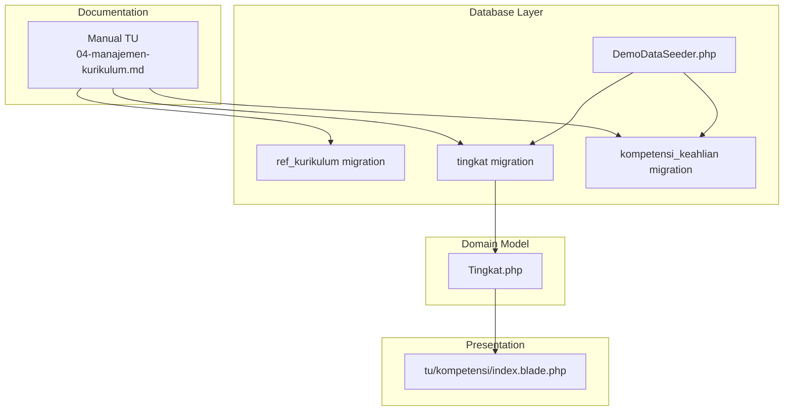

**Diagram sources**
- [04-manajemen-kurikulum.md](file://docs/manual-tu/04-manajemen-kurikulum.md)
- [2026_06_01_010807_create_ref_kurikulum_table.php](file://database/migrations/2026_06_01_010807_create_ref_kurikulum_table.php)
- [2026_06_01_010808_create_tingkat_table.php](file://database/migrations/2026_06_01_010808_create_tingkat_table.php)
- [2026_06_01_010808_create_kompetensi_keahlian_table.php](file://database/migrations/2026_06_01_010808_create_kompetensi_keahlian_table.php)
- [Tingkat.php](file://app/Models/Tingkat.php)
- [index.blade.php](file://resources/views/tu/kompetensi/index.blade.php)
- [DemoDataSeeder.php](file://database/seeders/DemoDataSeeder.php)

**Section sources**
- [04-manajemen-kurikulum.md](file://docs/manual-tu/04-manajemen-kurikulum.md)
- [2026_06_01_010807_create_ref_kurikulum_table.php](file://database/migrations/2026_06_01_010807_create_ref_kurikulum_table.php)
- [2026_06_01_010808_create_tingkat_table.php](file://database/migrations/2026_06_01_010808_create_tingkat_table.php)
- [2026_06_01_010808_create_kompetensi_keahlian_table.php](file://database/migrations/2026_06_01_010808_create_kompetensi_keahlian_table.php)
- [Tingkat.php](file://app/Models/Tingkat.php)
- [index.blade.php](file://resources/views/tu/kompetensi/index.blade.php)
- [DemoDataSeeder.php](file://database/seeders/DemoDataSeeder.php)

## Core Components
- Curriculum framework: Reference table for curriculum names and descriptions
- Grade level organization: Defines grade levels with numeric and ordering attributes
- Competency specialization: Tracks program/track specializations aligned to students and classes
- Subject management: Manual describes adding subjects, grouping, and mapping to classes
- Learning outcomes: Manual documents managing learning goals per subject
- Assessment framework: Manual documents formative and summative assessments per subject
- Class grouping: Manual describes assigning teachers to subject-class groups and batch updates
- Academic calendar integration: Manual indicates semester and year entities exist in the system

These components collectively support curriculum setup, subject allocation, academic progression, and reporting workflows.

**Section sources**
- [04-manajemen-kurikulum.md](file://docs/manual-tu/04-manajemen-kurikulum.md)
- [2026_06_01_010807_create_ref_kurikulum_table.php](file://database/migrations/2026_06_01_010807_create_ref_kurikulum_table.php)
- [2026_06_01_010808_create_tingkat_table.php](file://database/migrations/2026_06_01_010808_create_tingkat_table.php)
- [2026_06_01_010808_create_kompetensi_keahlian_table.php](file://database/migrations/2026_06_01_010808_create_kompetensi_keahlian_table.php)

## Architecture Overview
The curriculum and academic program architecture combines administrative procedures with structured data entities:

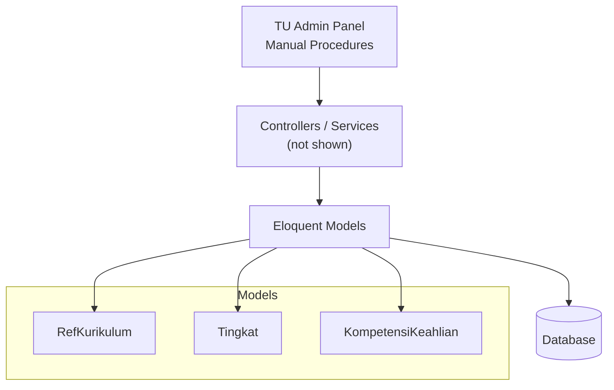

**Diagram sources**
- [04-manajemen-kurikulum.md](file://docs/manual-tu/04-manajemen-kurikulum.md)
- [2026_06_01_010807_create_ref_kurikulum_table.php](file://database/migrations/2026_06_01_010807_create_ref_kurikulum_table.php)
- [2026_06_01_010808_create_tingkat_table.php](file://database/migrations/2026_06_01_010808_create_tingkat_table.php)
- [2026_06_01_010808_create_kompetensi_keahlian_table.php](file://database/migrations/2026_06_01_010808_create_kompetensi_keahlian_table.php)

## Detailed Component Analysis

### Curriculum Framework Setup
- Purpose: Define named curriculum frameworks with optional descriptions
- Implementation: Migration creates a reference table for curriculum metadata
- Usage: Supports selecting a curriculum framework during academic program setup

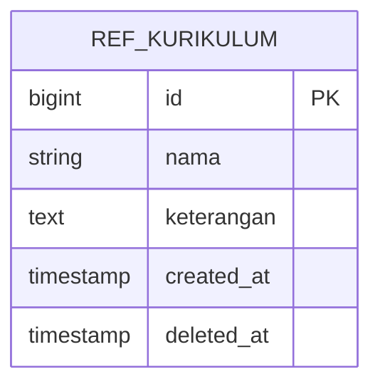

**Diagram sources**
- [2026_06_01_010807_create_ref_kurikulum_table.php](file://database/migrations/2026_06_01_010807_create_ref_kurikulum_table.php)

**Section sources**
- [2026_06_01_010807_create_ref_kurikulum_table.php](file://database/migrations/2026_06_01_010807_create_ref_kurikulum_table.php)

### Grade Level Organization and Progression
- Purpose: Organize classes by grade levels with numeric mapping and ordering
- Implementation: Migration defines grade level entity with unique numeric code and ordering field
- Relationship: Grade levels are parents to class entities (via model relationship)
- Progression: Ordering field enables progression tracking across academic years

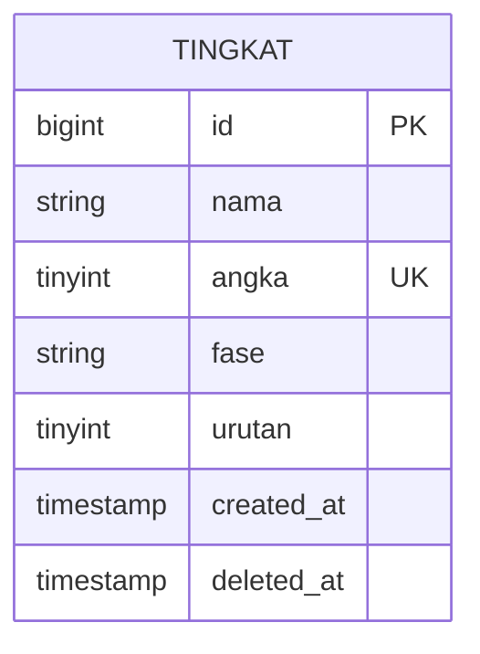

**Diagram sources**
- [2026_06_01_010808_create_tingkat_table.php](file://database/migrations/2026_06_01_010808_create_tingkat_table.php)

**Section sources**
- [2026_06_01_010808_create_tingkat_table.php](file://database/migrations/2026_06_01_010808_create_tingkat_table.php)
- [Tingkat.php](file://app/Models/Tingkat.php)

### Competency-Based Education Tracking
- Purpose: Track specialized tracks/programs (e.g., technical streams) aligned to students and classes
- Implementation: Migration defines competency entity with optional abbreviation and description
- Presentation: Blade template lists competencies with actions for management

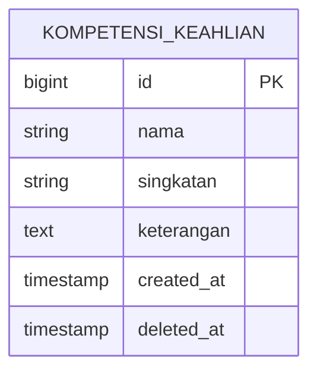

**Diagram sources**
- [2026_06_01_010808_create_kompetensi_keahlian_table.php](file://database/migrations/2026_06_01_010808_create_kompetensi_keahlian_table.php)

**Section sources**
- [2026_06_01_010808_create_kompetensi_keahlian_table.php](file://database/migrations/2026_06_01_010808_create_kompetensi_keahlian_table.php)
- [index.blade.php](file://resources/views/tu/kompetensi/index.blade.php)

### Subject Management and Curriculum Mapping
- Purpose: Manage subjects, group subjects into curricular domains, and map subjects to classes and students
- Procedures: Manual documents adding subjects, grouping, and assigning subjects to classes and students
- Batch operations: Manual highlights batch assignment for efficient updates

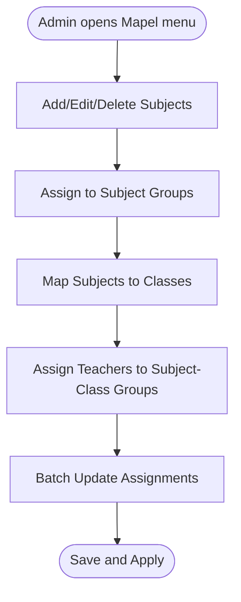

**Diagram sources**
- [04-manajemen-kurikulum.md](file://docs/manual-tu/04-manajemen-kurikulum.md)

**Section sources**
- [04-manajemen-kurikulum.md](file://docs/manual-tu/04-manajemen-kurikulum.md)

### Learning Outcome Management
- Purpose: Define and manage learning goals per subject
- Procedures: Manual documents managing learning outcomes for academic planning and assessment alignment

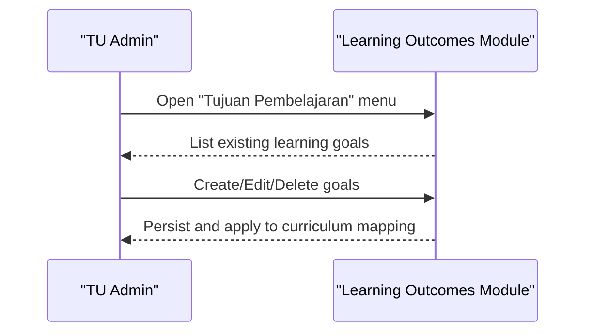

**Diagram sources**
- [04-manajemen-kurikulum.md](file://docs/manual-tu/04-manajemen-kurikulum.md)

**Section sources**
- [04-manajemen-kurikulum.md](file://docs/manual-tu/04-manajemen-kurikulum.md)

### Assessment Framework Configuration
- Purpose: Configure formative and summative assessments per subject
- Procedures: Manual documents assessment setup and management for grading workflows

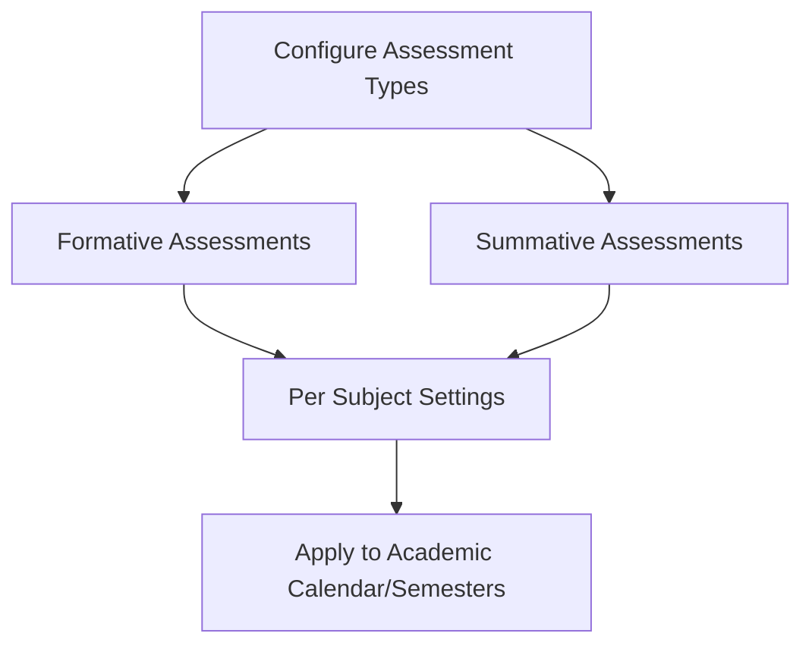

**Diagram sources**
- [04-manajemen-kurikulum.md](file://docs/manual-tu/04-manajemen-kurikulum.md)

**Section sources**
- [04-manajemen-kurikulum.md](file://docs/manual-tu/04-manajemen-kurikulum.md)

### Class Grouping and Grouping Structure Management
- Purpose: Assign teachers to subject-class groups and manage grouping structures
- Procedures: Manual documents teacher assignment to subject-class groups and batch updates
- Impact: Determines visible menus for teachers (e.g., grading, learning goals, grade logs)

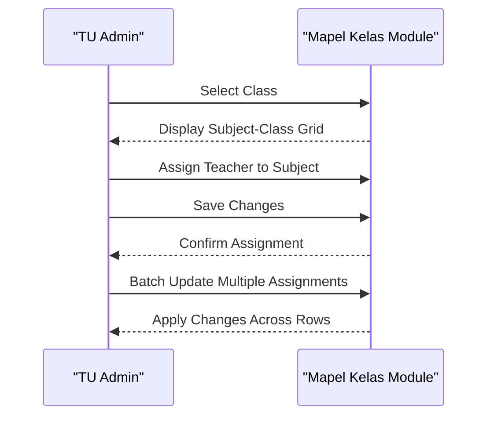

**Diagram sources**
- [04-manajemen-kurikulum.md](file://docs/manual-tu/04-manajemen-kurikulum.md)

**Section sources**
- [04-manajemen-kurikulum.md](file://docs/manual-tu/04-manajemen-kurikulum.md)

### Academic Calendar Integration
- Purpose: Integrate curriculum activities with semesters and academic years
- Evidence: Manual indicates existence of semester and academic year entities in the system
- Workflow: Curriculum setup aligns with current semester/year for subject and outcome assignments

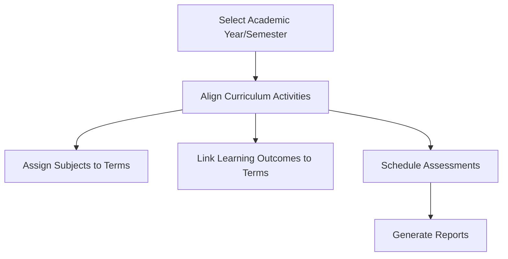

**Diagram sources**
- [04-manajemen-kurikulum.md](file://docs/manual-tu/04-manajemen-kurikulum.md)

**Section sources**
- [04-manajemen-kurikulum.md](file://docs/manual-tu/04-manajemen-kurikulum.md)

### Course Sequencing and Academic Progression
- Purpose: Ensure logical sequencing of subjects across grade levels and progression pathways
- Data Support: Grade level ordering and competency specialization enable progression planning
- Practical Use: Seed data demonstrates subject grouping by curriculum domain, aiding sequencing decisions

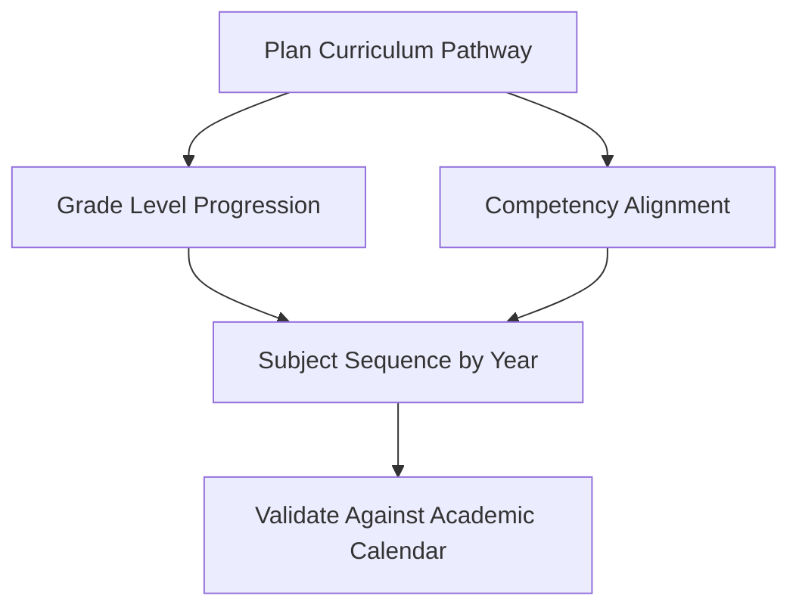

**Diagram sources**
- [2026_06_01_010808_create_tingkat_table.php](file://database/migrations/2026_06_01_010808_create_tingkat_table.php)
- [2026_06_01_010808_create_kompetensi_keahlian_table.php](file://database/migrations/2026_06_01_010808_create_kompetensi_keahlian_table.php)
- [DemoDataSeeder.php](file://database/seeders/DemoDataSeeder.php)

**Section sources**
- [2026_06_01_010808_create_tingkat_table.php](file://database/migrations/2026_06_01_010808_create_tingkat_table.php)
- [2026_06_01_010808_create_kompetensi_keahlian_table.php](file://database/migrations/2026_06_01_010808_create_kompetensi_keahlian_table.php)
- [DemoDataSeeder.php](file://database/seeders/DemoDataSeeder.php)

## Dependency Analysis
The curriculum and academic program components depend on:
- Administrative procedures (manuals) for operational workflows
- Database migrations establishing referential entities
- Domain models connecting grade levels to classes
- Seeders providing initial curriculum data for demonstration

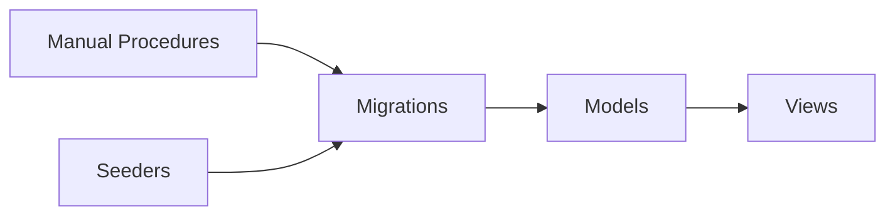

**Diagram sources**
- [04-manajemen-kurikulum.md](file://docs/manual-tu/04-manajemen-kurikulum.md)
- [2026_06_01_010807_create_ref_kurikulum_table.php](file://database/migrations/2026_06_01_010807_create_ref_kurikulum_table.php)
- [2026_06_01_010808_create_tingkat_table.php](file://database/migrations/2026_06_01_010808_create_tingkat_table.php)
- [2026_06_01_010808_create_kompetensi_keahlian_table.php](file://database/migrations/2026_06_01_010808_create_kompetensi_keahlian_table.php)
- [Tingkat.php](file://app/Models/Tingkat.php)
- [index.blade.php](file://resources/views/tu/kompetensi/index.blade.php)
- [DemoDataSeeder.php](file://database/seeders/DemoDataSeeder.php)

**Section sources**
- [04-manajemen-kurikulum.md](file://docs/manual-tu/04-manajemen-kurikulum.md)
- [2026_06_01_010807_create_ref_kurikulum_table.php](file://database/migrations/2026_06_01_010807_create_ref_kurikulum_table.php)
- [2026_06_01_010808_create_tingkat_table.php](file://database/migrations/2026_06_01_010808_create_tingkat_table.php)
- [2026_06_01_010808_create_kompetensi_keahlian_table.php](file://database/migrations/2026_06_01_010808_create_kompetensi_keahlian_table.php)
- [Tingkat.php](file://app/Models/Tingkat.php)
- [index.blade.php](file://resources/views/tu/kompetensi/index.blade.php)
- [DemoDataSeeder.php](file://database/seeders/DemoDataSeeder.php)

## Performance Considerations
- Batch operations: Use batch assignment features to minimize repeated saves when updating many subject-class-teacher mappings
- Indexing: Ensure unique constraints on grade level numeric codes and competency abbreviations to speed lookups
- Reporting: Limit report scopes to active semesters/academic years to reduce query complexity
- Caching: Cache frequently accessed curriculum data (subjects, groups, competencies) to improve admin panel responsiveness

## Troubleshooting Guide
- Missing teacher menus: Verify teacher-to-subject-class assignments; the manual notes that proper assignment controls visible menus for educators
- Duplicate grade level entries: Unique constraint on grade level numeric codes prevents duplicates; resolve conflicts by adjusting numeric values
- Inconsistent subject grouping: Confirm subject group assignments align with curriculum framework and competency specializations
- Batch update failures: Ensure selections are valid and save all changes after batch operations

**Section sources**
- [04-manajemen-kurikulum.md](file://docs/manual-tu/04-manajemen-kurikulum.md)
- [2026_06_01_010808_create_tingkat_table.php](file://database/migrations/2026_06_01_010808_create_tingkat_table.php)
- [2026_06_01_010808_create_kompetensi_keahlian_table.php](file://database/migrations/2026_06_01_010808_create_kompetensi_keahlian_table.php)

## Conclusion
The system provides a structured foundation for curriculum planning and academic program management through documented administrative procedures and robust data modeling. Administrators can define curriculum frameworks, organize grade levels, track competencies, manage subjects and learning outcomes, configure assessments, and assign teachers to subject-class groups. These capabilities integrate with academic calendars and support efficient batch operations for scalable administration.

## Appendices

### Appendix A: Curriculum Setup Workflows
- Define curriculum framework and grade levels
- Create and group subjects by curriculum domain
- Assign subjects to classes and students
- Link learning outcomes and configure assessments
- Assign teachers to subject-class groups and apply batch updates

**Section sources**
- [04-manajemen-kurikulum.md](file://docs/manual-tu/04-manajemen-kurikulum.md)
- [2026_06_01_010807_create_ref_kurikulum_table.php](file://database/migrations/2026_06_01_010807_create_ref_kurikulum_table.php)
- [2026_06_01_010808_create_tingkat_table.php](file://database/migrations/2026_06_01_010808_create_tingkat_table.php)
- [2026_06_01_010808_create_kompetensi_keahlian_table.php](file://database/migrations/2026_06_01_010808_create_kompetensi_keahlian_table.php)

### Appendix B: Academic Program Administration Procedures
- Manage subjects, groups, and competency specializations
- Configure learning outcomes and assessment frameworks
- Align curriculum with academic calendar (semesters/years)
- Monitor teacher assignments and batch update workflows

**Section sources**
- [04-manajemen-kurikulum.md](file://docs/manual-tu/04-manajemen-kurikulum.md)
- [PRD-rapor-migrasi.md](file://PRD-rapor-migrasi.md)