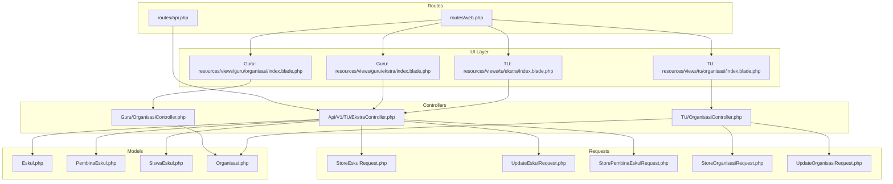
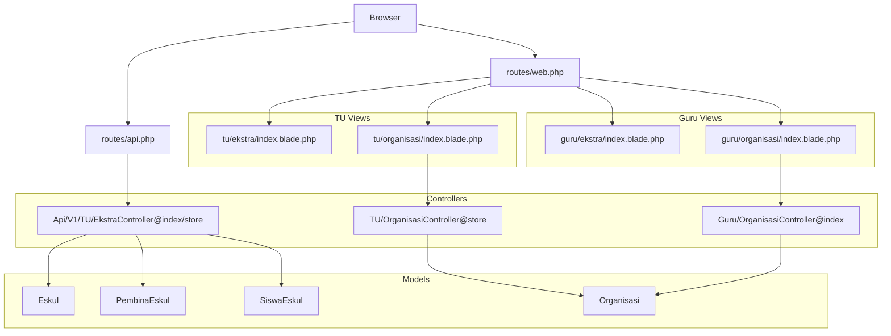
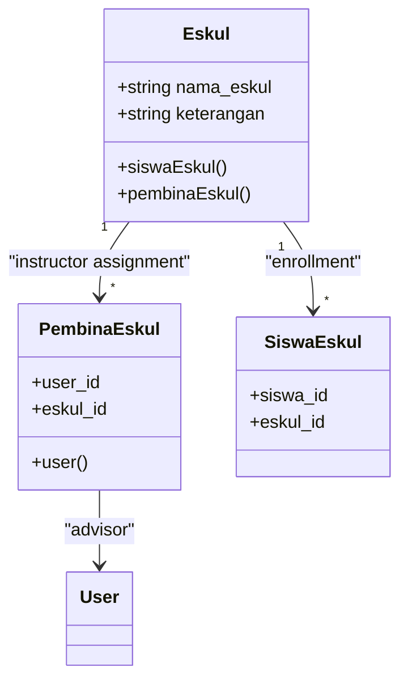
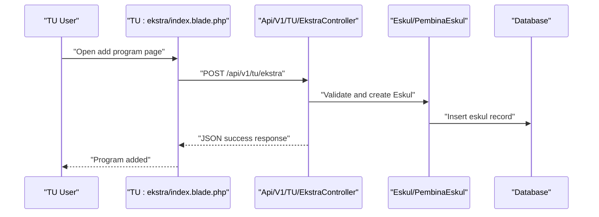
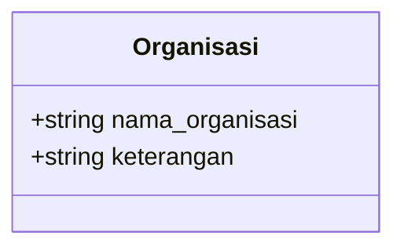
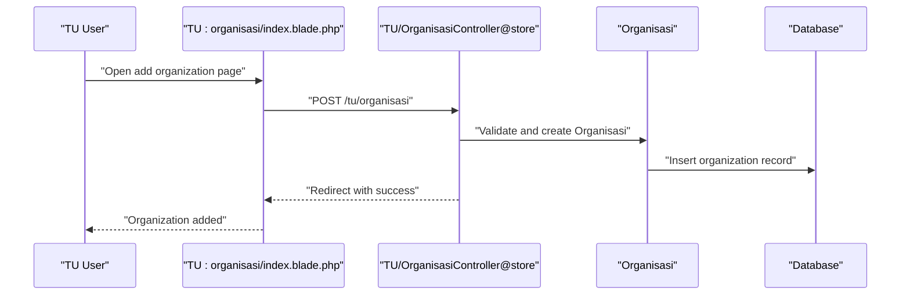
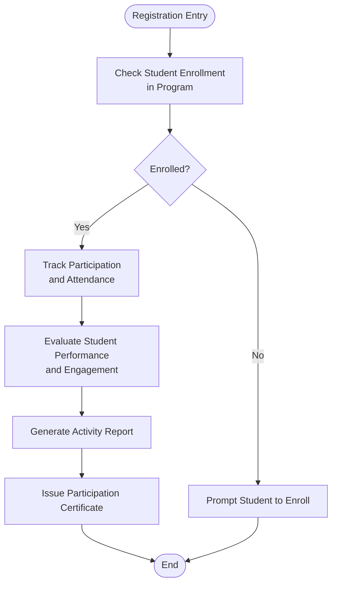
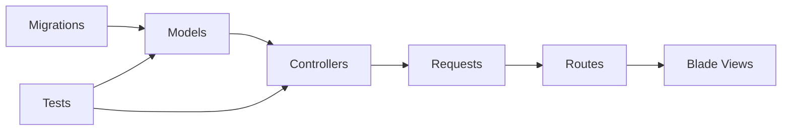

# Extracurricular Activities & Organizations

<cite>
**Referenced Files in This Document**
- [06-ekstra-organisasi.md](file://docs/manual-tu/06-ekstra-organisasi.md)
- [index.blade.php](file://resources/views/tu/ekstra/index.blade.php)
- [index.blade.php](file://resources/views/guru/ekstra/index.blade.php)
- [index.blade.php](file://resources/views/tu/organisasi/index.blade.php)
- [index.blade.php](file://resources/views/guru/organisasi/index.blade.php)
- [EkstraController.php](file://app/Http/Controllers/Api/V1/Tu/EkstraController.php)
- [Eskul.php](file://app/Models/Eskul.php)
- [PembinaEskul.php](file://app/Models/PembinaEskul.php)
- [SiswaEskul.php](file://app/Models/SiswaEskul.php)
- [Organisasi.php](file://app/Models/Organisasi.php)
- [OrganisasiController.php](file://app/Http/Controllers/TU/OrganisasiController.php)
- [OrganisasiController.php](file://app/Http/Controllers/Guru/OrganisasiController.php)
- [StoreEskulRequest.php](file://app/Http/Requests/TU/Ekstra/StoreEskulRequest.php)
- [UpdateEskulRequest.php](file://app/Http/Requests/TU/Ekstra/UpdateEskulRequest.php)
- [StorePembinaEskulRequest.php](file://app/Http/Requests/TU/Ekstra/StorePembinaEskulRequest.php)
- [StoreOrganisasiRequest.php](file://app/Http/Requests/TU/Organisasi/StoreOrganisasiRequest.php)
- [UpdateOrganisasiRequest.php](file://app/Http/Requests/TU/Organisasi/UpdateOrganisasiRequest.php)
- [2026_06_01_010809_create_eskul_table.php](file://database/migrations/2026_06_01_010809_create_eskul_table.php)
- [2026_06_01_010809_create_organisasi_table.php](file://database/migrations/2026_06_01_010809_create_organisasi_table.php)
- [2026_06_01_010816_create_pembina_eskul_table.php](file://database/migrations/2026_06_01_010816_create_pembina_eskul_table.php)
- [2026_06_01_010816_create_siswa_eskul_table.php](file://database/migrations/2026_06_01_010816_create_siswa_eskul_table.php)
- [web.php](file://routes/web.php)
- [api.php](file://routes/api.php)
- [TuWorkflowIntegrationTest.php](file://tests/Feature/Tu/TuWorkflowIntegrationTest.php)
- [EkstraApiTest.php](file://tests/Feature/Api/V1/EkstraApiTest.php)
</cite>

## Table of Contents
1. [Introduction](#introduction)
2. [Project Structure](#project-structure)
3. [Core Components](#core-components)
4. [Architecture Overview](#architecture-overview)
5. [Detailed Component Analysis](#detailed-component-analysis)
6. [Dependency Analysis](#dependency-analysis)
7. [Performance Considerations](#performance-considerations)
8. [Troubleshooting Guide](#troubleshooting-guide)
9. [Conclusion](#conclusion)
10. [Appendices](#appendices)

## Introduction
This document provides comprehensive documentation for managing extracurricular activities and organizations within the academic institution. It covers the setup and administration of sports, clubs, cultural activities, and community service organizations; student participation tracking; activity scheduling; instructor assignment; organizational structure management for student government, cultural groups, and special interest clubs; activity registration processes; participant enrollment; activity evaluation systems; facility booking and resource allocation; activity supervision coordination; activity reporting; participation certificates; and co-curricular record maintenance. The documentation synthesizes both front-end user interface flows and back-end Laravel components, including models, controllers, requests, migrations, and tests.

## Project Structure
The extracurricular and organizational management functionality spans several layers:
- User Interface: Blade templates under resources/views for TU (Administrative) and Guru (Teaching Staff) roles
- Controllers: API controllers for TU endpoints and controllers for Guru/TU administrative actions
- Models: Domain entities representing extracurricular programs, organizers, participants, and instructors
- Requests: Validation and authorization rules for incoming data
- Routes: Web and API route definitions for accessing features
- Tests: Feature and API tests validating workflows and integrations

**Diagram sources**
- [index.blade.php:1-17](file://resources/views/tu/ekstra/index.blade.php#L1-L17)
- [index.blade.php:1-8](file://resources/views/guru/ekstra/index.blade.php#L1-L8)
- [index.blade.php:1-11](file://resources/views/tu/organisasi/index.blade.php#L1-L11)
- [index.blade.php:1-8](file://resources/views/guru/organisasi/index.blade.php#L1-L8)
- [EkstraController.php:1-51](file://app/Http/Controllers/Api/V1/Tu/EkstraController.php#L1-L51)
- [Eskul.php:1-200](file://app/Models/Eskul.php#L1-L200)
- [PembinaEskul.php:1-200](file://app/Models/PembinaEskul.php#L1-L200)
- [SiswaEskul.php:1-200](file://app/Models/SiswaEskul.php#L1-L200)
- [Organisasi.php:1-200](file://app/Models/Organisasi.php#L1-L200)
- [web.php:1-200](file://routes/web.php#L1-L200)
- [api.php:1-200](file://routes/api.php#L1-L200)

**Section sources**
- [06-ekstra-organisasi.md:1-66](file://docs/manual-tu/06-ekstra-organisasi.md#L1-L66)
- [index.blade.php:1-17](file://resources/views/tu/ekstra/index.blade.php#L1-L17)
- [index.blade.php:1-8](file://resources/views/guru/ekstra/index.blade.php#L1-L8)
- [index.blade.php:1-11](file://resources/views/tu/organisasi/index.blade.php#L1-L11)
- [index.blade.php:1-8](file://resources/views/guru/organisasi/index.blade.php#L1-L8)

## Core Components
This section outlines the primary components involved in extracurricular and organizational management.

- Extracurricular Programs (Eskul)
  - Purpose: Manage activity offerings (sports, clubs, cultural activities)
  - Key capabilities: Create/edit/delete programs, assign instructors (pembina), track participant enrollment
  - UI: TU view for adding/editing programs; Guru view for viewing assigned programs
  - API: Provides list of programs with participant counts and instructor details

- Organizational Groups (Organisasi)
  - Purpose: Manage student government, cultural groups, and special interest clubs
  - Key capabilities: Create/update/delete organizations; display organization lists
  - UI: TU view for administrative management; Guru view for data visibility

- Instructor Assignment (Pembina)
  - Purpose: Link teachers to extracurricular programs as advisors/instructors
  - Key capabilities: Assign instructors per academic year/semester; remove assignments

- Student Participation (SiswaEskul)
  - Purpose: Track student enrollment in extracurricular programs
  - Key capabilities: Enroll/unenroll students; maintain participation records

- Validation and Authorization (Requests)
  - Purpose: Enforce input validation and role-based access controls
  - Key capabilities: Validate program data, instructor assignments, and organization data

**Section sources**
- [06-ekstra-organisasi.md:5-65](file://docs/manual-tu/06-ekstra-organisasi.md#L5-L65)
- [index.blade.php:1-17](file://resources/views/tu/ekstra/index.blade.php#L1-L17)
- [index.blade.php:1-8](file://resources/views/guru/ekstra/index.blade.php#L1-L8)
- [index.blade.php:1-11](file://resources/views/tu/organisasi/index.blade.php#L1-L11)
- [index.blade.php:1-8](file://resources/views/guru/organisasi/index.blade.php#L1-L8)
- [EkstraController.php:14-35](file://app/Http/Controllers/Api/V1/Tu/EkstraController.php#L14-L35)
- [StoreEskulRequest.php:1-100](file://app/Http/Requests/TU/Ekstra/StoreEskulRequest.php#L1-L100)
- [UpdateEskulRequest.php:1-100](file://app/Http/Requests/TU/Ekstra/UpdateEskulRequest.php#L1-L100)
- [StorePembinaEskulRequest.php:1-100](file://app/Http/Requests/TU/Ekstra/StorePembinaEskulRequest.php#L1-L100)
- [StoreOrganisasiRequest.php:1-100](file://app/Http/Requests/TU/Organisasi/StoreOrganisasiRequest.php#L1-L100)
- [UpdateOrganisasiRequest.php:1-100](file://app/Http/Requests/TU/Organisasi/UpdateOrganisasiRequest.php#L1-L100)

## Architecture Overview
The system follows a layered architecture:
- Presentation Layer: Blade templates render views for TU and Guru roles
- Application Layer: Controllers handle requests, orchestrate business logic, and coordinate with models
- Domain Layer: Models encapsulate extracurricular and organizational entities with relationships
- Persistence Layer: Migrations define database schemas; factories support seeding and testing
- Testing Layer: Feature and API tests validate end-to-end workflows

**Diagram sources**
- [web.php:1-200](file://routes/web.php#L1-L200)
- [api.php:1-200](file://routes/api.php#L1-L200)
- [index.blade.php:1-17](file://resources/views/tu/ekstra/index.blade.php#L1-L17)
- [index.blade.php:1-11](file://resources/views/tu/organisasi/index.blade.php#L1-L11)
- [index.blade.php:1-8](file://resources/views/guru/ekstra/index.blade.php#L1-L8)
- [index.blade.php:1-8](file://resources/views/guru/organisasi/index.blade.php#L1-L8)
- [EkstraController.php:1-51](file://app/Http/Controllers/Api/V1/Tu/EkstraController.php#L1-L51)
- [OrganisasiController.php:1-200](file://app/Http/Controllers/TU/OrganisasiController.php#L1-L200)
- [OrganisasiController.php:1-200](file://app/Http/Controllers/Guru/OrganisasiController.php#L1-L200)
- [Eskul.php:1-200](file://app/Models/Eskul.php#L1-L200)
- [PembinaEskul.php:1-200](file://app/Models/PembinaEskul.php#L1-L200)
- [SiswaEskul.php:1-200](file://app/Models/SiswaEskul.php#L1-L200)
- [Organisasi.php:1-200](file://app/Models/Organisasi.php#L1-L200)

## Detailed Component Analysis

### Extracurricular Program Management
This component manages the lifecycle of extracurricular programs, including creation, editing, deletion, and instructor assignment.

**Diagram sources**
- [Eskul.php:1-200](file://app/Models/Eskul.php#L1-L200)
- [PembinaEskul.php:1-200](file://app/Models/PembinaEskul.php#L1-L200)
- [SiswaEskul.php:1-200](file://app/Models/SiswaEskul.php#L1-L200)

**Diagram sources**
- [index.blade.php:6-11](file://resources/views/tu/ekstra/index.blade.php#L6-L11)
- [EkstraController.php:37-51](file://app/Http/Controllers/Api/V1/Tu/EkstraController.php#L37-L51)
- [StoreEskulRequest.php:1-100](file://app/Http/Requests/TU/Ekstra/StoreEskulRequest.php#L1-L100)

Key workflows:
- Program creation via TU view triggers API endpoint that validates input and persists the record
- Instructor assignment links a teacher to a program; removal supported through UI actions
- Participant enrollment tracked via junction table linking students to programs

**Section sources**
- [06-ekstra-organisasi.md:5-31](file://docs/manual-tu/06-ekstra-organisasi.md#L5-L31)
- [index.blade.php:1-17](file://resources/views/tu/ekstra/index.blade.php#L1-L17)
- [index.blade.php:1-8](file://resources/views/guru/ekstra/index.blade.php#L1-L8)
- [EkstraController.php:14-35](file://app/Http/Controllers/Api/V1/Tu/EkstraController.php#L14-L35)
- [StoreEskulRequest.php:1-100](file://app/Http/Requests/TU/Ekstra/StoreEskulRequest.php#L1-L100)
- [StorePembinaEskulRequest.php:1-100](file://app/Http/Requests/TU/Ekstra/StorePembinaEskulRequest.php#L1-L100)

### Organizational Group Management
This component handles student government, cultural groups, and special interest clubs.

**Diagram sources**
- [Organisasi.php:1-200](file://app/Models/Organisasi.php#L1-L200)

**Diagram sources**
- [index.blade.php:5-10](file://resources/views/tu/organisasi/index.blade.php#L5-L10)
- [OrganisasiController.php:1-200](file://app/Http/Controllers/TU/OrganisasiController.php#L1-L200)
- [StoreOrganisasiRequest.php:1-100](file://app/Http/Requests/TU/Organisasi/StoreOrganisasiRequest.php#L1-L100)

Key workflows:
- TU adds organizations with name and description
- Guru view displays organizational data for oversight
- Updates/deletes supported through dedicated requests

**Section sources**
- [06-ekstra-organisasi.md:32-65](file://docs/manual-tu/06-ekstra-organisasi.md#L32-L65)
- [index.blade.php:1-11](file://resources/views/tu/organisasi/index.blade.php#L1-L11)
- [index.blade.php:1-8](file://resources/views/guru/organisasi/index.blade.php#L1-L8)
- [OrganisasiController.php:1-200](file://app/Http/Controllers/Guru/OrganisasiController.php#L1-L200)
- [StoreOrganisasiRequest.php:1-100](file://app/Http/Requests/TU/Organisasi/StoreOrganisasiRequest.php#L1-L100)
- [UpdateOrganisasiRequest.php:1-100](file://app/Http/Requests/TU/Organisasi/UpdateOrganisasiRequest.php#L1-L100)

### Activity Registration and Evaluation
While the current codebase primarily exposes program listings and basic CRUD operations, evaluation and certificate generation are typically extensions built upon the existing enrollment and program models. The following conceptual flow illustrates how evaluation and reporting could integrate:

[No sources needed since this diagram shows conceptual workflow, not actual code structure]

## Dependency Analysis
The extracurricular and organizational features depend on:
- Database schema defined by migrations
- Models with relationships for programs, instructors, and participants
- Request validators ensuring data integrity
- Route definitions connecting UI and API layers
- Tests verifying end-to-end functionality

**Diagram sources**
- [2026_06_01_010809_create_eskul_table.php:1-200](file://database/migrations/2026_06_01_010809_create_eskul_table.php#L1-L200)
- [2026_06_01_010809_create_organisasi_table.php:1-200](file://database/migrations/2026_06_01_010809_create_organisasi_table.php#L1-L200)
- [2026_06_01_010816_create_pembina_eskul_table.php:1-200](file://database/migrations/2026_06_01_010816_create_pembina_eskul_table.php#L1-L200)
- [2026_06_01_010816_create_siswa_eskul_table.php:1-200](file://database/migrations/2026_06_01_010816_create_siswa_eskul_table.php#L1-L200)
- [Eskul.php:1-200](file://app/Models/Eskul.php#L1-L200)
- [PembinaEskul.php:1-200](file://app/Models/PembinaEskul.php#L1-L200)
- [SiswaEskul.php:1-200](file://app/Models/SiswaEskul.php#L1-L200)
- [Organisasi.php:1-200](file://app/Models/Organisasi.php#L1-L200)
- [web.php:1-200](file://routes/web.php#L1-L200)
- [api.php:1-200](file://routes/api.php#L1-L200)

**Section sources**
- [2026_06_01_010809_create_eskul_table.php:1-200](file://database/migrations/2026_06_01_010809_create_eskul_table.php#L1-L200)
- [2026_06_01_010809_create_organisasi_table.php:1-200](file://database/migrations/2026_06_01_010809_create_organisasi_table.php#L1-L200)
- [2026_06_01_010816_create_pembina_eskul_table.php:1-200](file://database/migrations/2026_06_01_010816_create_pembina_eskul_table.php#L1-L200)
- [2026_06_01_010816_create_siswa_eskul_table.php:1-200](file://database/migrations/2026_06_01_010816_create_siswa_eskul_table.php#L1-L200)

## Performance Considerations
- Efficient queries: Use eager loading for relationships (e.g., counting students and loading instructors) to avoid N+1 queries
- Indexing: Ensure foreign keys and frequently queried columns are indexed in production
- Pagination: Implement pagination for large datasets in listing views
- Caching: Cache static reference data (e.g., academic years, semesters) to reduce repeated lookups
- Batch operations: For bulk enrollment or instructor assignments, batch database writes to minimize overhead

[No sources needed since this section provides general guidance]

## Troubleshooting Guide
Common issues and resolutions:
- Validation failures during program creation or organization updates
  - Verify request validation rules and ensure required fields are present
  - Check that academic year and semester selections are active
- API responses not reflecting latest data
  - Confirm proper use of relationship eager loading and count aggregations
  - Ensure database transactions are committed and caches refreshed
- UI actions not persisting changes
  - Validate CSRF tokens and form submissions
  - Confirm controller actions are mapped to correct routes

**Section sources**
- [StoreEskulRequest.php:1-100](file://app/Http/Requests/TU/Ekstra/StoreEskulRequest.php#L1-L100)
- [UpdateEskulRequest.php:1-100](file://app/Http/Requests/TU/Ekstra/UpdateEskulRequest.php#L1-L100)
- [StoreOrganisasiRequest.php:1-100](file://app/Http/Requests/TU/Organisasi/StoreOrganisasiRequest.php#L1-L100)
- [UpdateOrganisasiRequest.php:1-100](file://app/Http/Requests/TU/Organisasi/UpdateOrganisasiRequest.php#L1-L100)
- [EkstraApiTest.php:1-120](file://tests/Feature/Api/V1/EkstraApiTest.php#L1-L120)
- [TuWorkflowIntegrationTest.php:1-120](file://tests/Feature/Tu/TuWorkflowIntegrationTest.php#L1-L120)

## Conclusion
The system provides a solid foundation for managing extracurricular activities and organizational groups, with clear separation between TU administrative functions and Guru oversight. The modular design supports extension for activity scheduling, facility booking, supervision coordination, evaluation systems, and certificate generation. By leveraging existing models, controllers, requests, and migrations, administrators can efficiently set up programs, assign instructors, enroll students, and maintain co-curricular records.

## Appendices
- Administrative Procedures Examples
  - Adding an extracurricular program: Use the TU view to submit program details; the API controller validates and persists the record
  - Assigning an instructor: Navigate to the program page and add an instructor; ensure academic year/semester selection is correct
  - Managing organizations: TU creates and updates organizations; Guru views remain informational
  - Testing integration: Feature tests demonstrate successful creation and persistence of organizations and programs

**Section sources**
- [06-ekstra-organisasi.md:1-66](file://docs/manual-tu/06-ekstra-organisasi.md#L1-L66)
- [TuWorkflowIntegrationTest.php:18-43](file://tests/Feature/Tu/TuWorkflowIntegrationTest.php#L18-L43)
- [EkstraApiTest.php:50-120](file://tests/Feature/Api/V1/EkstraApiTest.php#L50-L120)