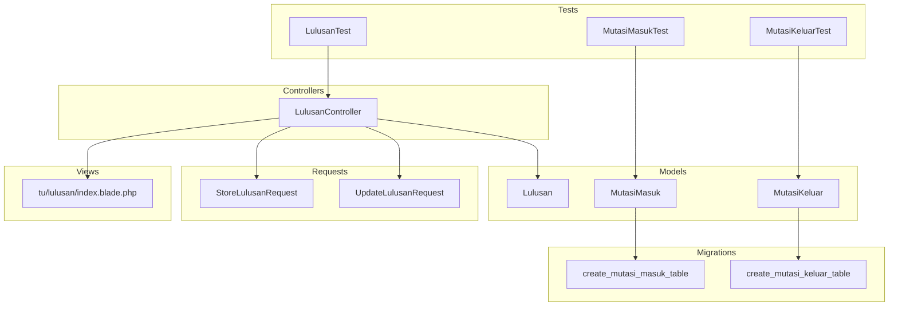
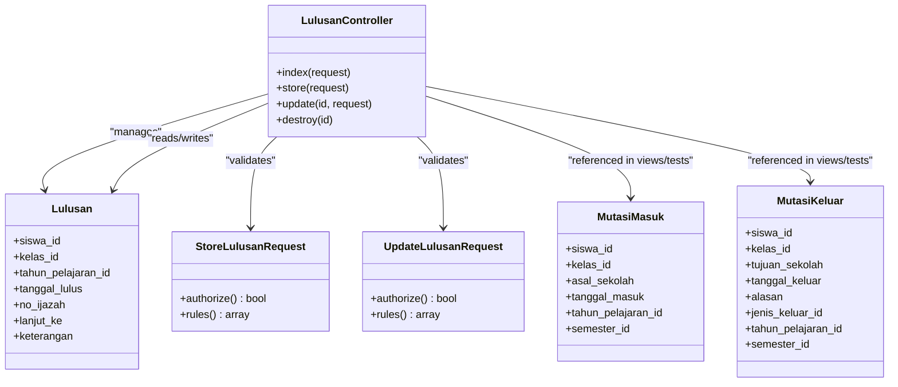
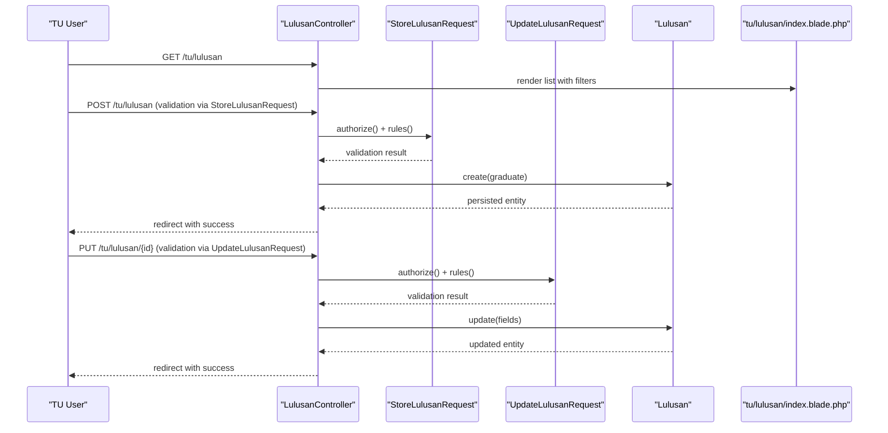
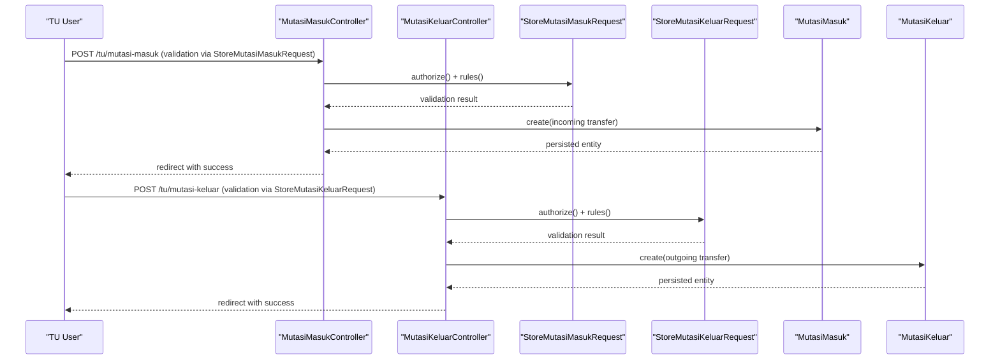
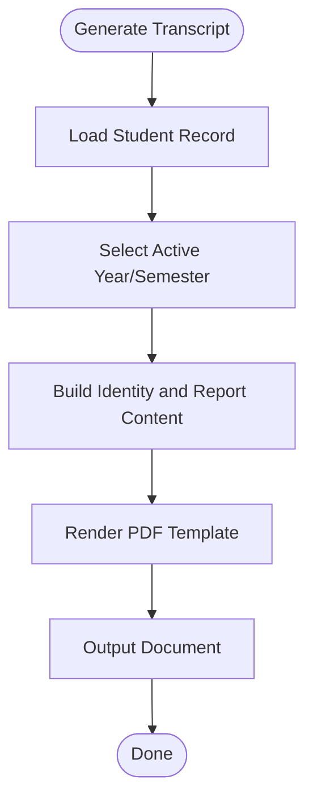
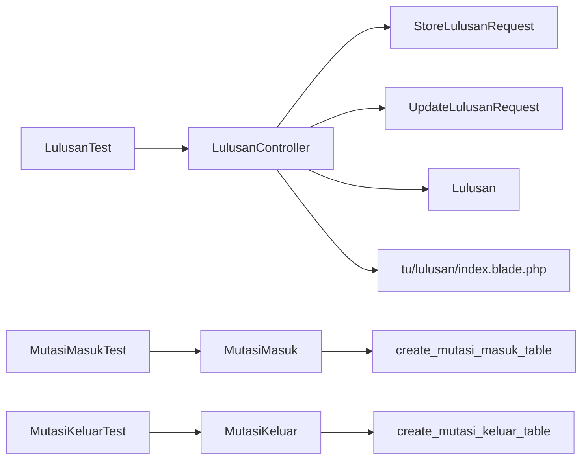

# Graduation & Student Migration

<cite>
**Referenced Files in This Document**
- [LulusanController.php](file://app/Http/Controllers/TU/LulusanController.php)
- [StoreLulusanRequest.php](file://app/Http/Requests/TU/Lulusan/StoreLulusanRequest.php)
- [UpdateLulusanRequest.php](file://app/Http/Requests/TU/Lulusan/UpdateLulusanRequest.php)
- [Lulusan.php](file://app/Models/Lulusan.php)
- [MutasiMasuk.php](file://app/Models/MutasiMasuk.php)
- [MutasiKeluar.php](file://app/Models/MutasiKeluar.php)
- [2026_06_01_010821_create_mutasi_masuk_table.php](file://database/migrations/2026_06_01_010821_create_mutasi_masuk_table.php)
- [2026_06_01_010821_create_mutasi_keluar_table.php](file://database/migrations/2026_06_01_010821_create_mutasi_keluar_table.php)
- [LulusanTest.php](file://tests/Feature/Tu/Lulusan/LulusanTest.php)
- [MutasiMasukTest.php](file://tests/Feature/Tu/Mutasi/MutasiMasukTest.php)
- [MutasiKeluarTest.php](file://tests/Feature/Tu/Mutasi/MutasiKeluarTest.php)
- [TuWorkflowIntegrationTest.php](file://tests/Feature/Tu/TuWorkflowIntegrationTest.php)
- [progres-pengerjaan.md](file://progres-pengerjaan.md)
- [PRD-rapor-migrasi.md](file://PRD-rapor-migrasi.md)
- [03-manajemen-siswa.md](file://docs/manual-tu/03-manajemen-siswa.md)
- [index.blade.php](file://resources/views/tu/lulusan/index.blade.php)
- [identitas-pdf.blade.php](file://resources/views/tu/rapor/identitas-pdf.blade.php)
</cite>

## Table of Contents
1. [Introduction](#introduction)
2. [Project Structure](#project-structure)
3. [Core Components](#core-components)
4. [Architecture Overview](#architecture-overview)
5. [Detailed Component Analysis](#detailed-component-analysis)
6. [Dependency Analysis](#dependency-analysis)
7. [Performance Considerations](#performance-considerations)
8. [Troubleshooting Guide](#troubleshooting-guide)
9. [Conclusion](#conclusion)
10. [Appendices](#appendices)

## Introduction
This document describes the graduation and student migration management capabilities implemented in the system. It covers:
- Graduation ceremony organization via the graduation registry (diploma issuance and post-graduation tracking)
- Student transfer processes (internal class promotions, external admissions, and departures)
- Academic record continuity and transcript management
- Reporting, transfer certificates, and administrative workflow automation
- Examples of end-to-end workflows for graduation and migration

The system provides dedicated controllers, models, requests, tests, and views to support these lifecycles, with strong separation of concerns and role-based access control.

## Project Structure
Key areas supporting graduation and migration:
- Controllers: manage user actions for graduation and migration
- Models: represent domain entities (graduates, transfers)
- Requests: encapsulate validation and authorization rules
- Migrations: define database schemas for transfer records
- Views: present graduation lists and related forms
- Tests: validate workflows and constraints
- Documentation: procedural guidance and glossaries

**Diagram sources**
- [LulusanController.php:1-120](file://app/Http/Controllers/TU/LulusanController.php#L1-L120)
- [Lulusan.php](file://app/Models/Lulusan.php)
- [MutasiMasuk.php](file://app/Models/MutasiMasuk.php)
- [MutasiKeluar.php](file://app/Models/MutasiKeluar.php)
- [StoreLulusanRequest.php:1-26](file://app/Http/Requests/TU/Lulusan/StoreLulusanRequest.php#L1-L26)
- [UpdateLulusanRequest.php:1-22](file://app/Http/Requests/TU/Lulusan/UpdateLulusanRequest.php#L1-L22)
- [index.blade.php:1-40](file://resources/views/tu/lulusan/index.blade.php#L1-L40)
- [LulusanTest.php:1-94](file://tests/Feature/Tu/Lulusan/LulusanTest.php#L1-L94)
- [MutasiMasukTest.php:1-87](file://tests/Feature/Tu/Mutasi/MutasiMasukTest.php#L1-L87)
- [MutasiKeluarTest.php:1-91](file://tests/Feature/Tu/Mutasi/MutasiKeluarTest.php#L1-L91)
- [2026_06_01_010821_create_mutasi_masuk_table.php:1-40](file://database/migrations/2026_06_01_010821_create_mutasi_masuk_table.php#L1-L40)
- [2026_06_01_010821_create_mutasi_keluar_table.php:1-42](file://database/migrations/2026_06_01_010821_create_mutasi_keluar_table.php#L1-L42)

**Section sources**
- [LulusanController.php:1-120](file://app/Http/Controllers/TU/LulusanController.php#L1-L120)
- [Lulusan.php](file://app/Models/Lulusan.php)
- [MutasiMasuk.php](file://app/Models/MutasiMasuk.php)
- [MutasiKeluar.php](file://app/Models/MutasiKeluar.php)
- [StoreLulusanRequest.php:1-26](file://app/Http/Requests/TU/Lulusan/StoreLulusanRequest.php#L1-L26)
- [UpdateLulusanRequest.php:1-22](file://app/Http/Requests/TU/Lulusan/UpdateLulusanRequest.php#L1-L22)
- [index.blade.php:1-40](file://resources/views/tu/lulusan/index.blade.php#L1-L40)
- [LulusanTest.php:1-94](file://tests/Feature/Tu/Lulusan/LulusanTest.php#L1-L94)
- [MutasiMasukTest.php:1-87](file://tests/Feature/Tu/Mutasi/MutasiMasukTest.php#L1-L87)
- [MutasiKeluarTest.php:1-91](file://tests/Feature/Tu/Mutasi/MutasiKeluarTest.php#L1-L91)
- [2026_06_01_010821_create_mutasi_masuk_table.php:1-40](file://database/migrations/2026_06_01_010821_create_mutasi_masuk_table.php#L1-L40)
- [2026_06_01_010821_create_mutasi_keluar_table.php:1-42](file://database/migrations/2026_06_01_010821_create_mutasi_keluar_table.php#L1-L42)

## Core Components
- Graduation Registry (Lulusan)
  - Purpose: Track graduates, issue serial numbers for diplomas, and capture post-graduation outcomes
  - Key attributes: student, class, academic year, graduation date, diploma number, next destination, remarks
  - Access: TU (administrative) only; validated by dedicated FormRequest rules
- Internal Transfer Records (MutasiMasuk)
  - Purpose: Record incoming transfers with origin school, entry date, and academic year/semester
  - Validation ensures required fields and referential integrity
- External Departure Records (MutasiKeluar)
  - Purpose: Record out-going transfers with destination school, exit date, reason, and academic year/semester
  - Includes soft deletes for audit trails
- Administrative Views and Workflows
  - Graduation listing with inline editing for diploma number, next destination, and notes
  - Role-based access prevents unauthorized access by teachers

**Section sources**
- [LulusanController.php:1-120](file://app/Http/Controllers/TU/LulusanController.php#L1-L120)
- [StoreLulusanRequest.php:1-26](file://app/Http/Requests/TU/Lulusan/StoreLulusanRequest.php#L1-L26)
- [UpdateLulusanRequest.php:1-22](file://app/Http/Requests/TU/Lulusan/UpdateLulusanRequest.php#L1-L22)
- [Lulusan.php](file://app/Models/Lulusan.php)
- [MutasiMasuk.php](file://app/Models/MutasiMasuk.php)
- [MutasiKeluar.php](file://app/Models/MutasiKeluar.php)
- [index.blade.php:1-40](file://resources/views/tu/lulusan/index.blade.php#L1-L40)

## Architecture Overview
The graduation and migration subsystem follows MVC with explicit separation of concerns:
- Controllers orchestrate user interactions and delegate to models
- Requests enforce validation and authorization policies
- Models encapsulate business rules and persistence
- Views render data and forms for TU users
- Tests verify workflows and constraints

**Diagram sources**
- [LulusanController.php:1-120](file://app/Http/Controllers/TU/LulusanController.php#L1-L120)
- [StoreLulusanRequest.php:1-26](file://app/Http/Requests/TU/Lulusan/StoreLulusanRequest.php#L1-L26)
- [UpdateLulusanRequest.php:1-22](file://app/Http/Requests/TU/Lulusan/UpdateLulusanRequest.php#L1-L22)
- [Lulusan.php](file://app/Models/Lulusan.php)
- [MutasiMasuk.php](file://app/Models/MutasiMasuk.php)
- [MutasiKeluar.php](file://app/Models/MutasiKeluar.php)

## Detailed Component Analysis

### Graduation Management
Graduation is managed through a dedicated controller and model with robust validation and role-based access.

**Diagram sources**
- [LulusanController.php:1-120](file://app/Http/Controllers/TU/LulusanController.php#L1-L120)
- [StoreLulusanRequest.php:1-26](file://app/Http/Requests/TU/Lulusan/StoreLulusanRequest.php#L1-L26)
- [UpdateLulusanRequest.php:1-22](file://app/Http/Requests/TU/Lulusan/UpdateLulusanRequest.php#L1-L22)
- [Lulusan.php](file://app/Models/Lulusan.php)
- [index.blade.php:1-40](file://resources/views/tu/lulusan/index.blade.php#L1-L40)

Key behaviors:
- Filtering and pagination of graduates by academic year and search terms
- Inline editing of diploma number, next destination, and notes
- Unique constraint enforcement for diploma numbers (excluding self on updates)
- Authorization ensures only TU users can access graduation features

**Section sources**
- [LulusanController.php:1-120](file://app/Http/Controllers/TU/LulusanController.php#L1-L120)
- [StoreLulusanRequest.php:1-26](file://app/Http/Requests/TU/Lulusan/StoreLulusanRequest.php#L1-L26)
- [UpdateLulusanRequest.php:1-22](file://app/Http/Requests/TU/Lulusan/UpdateLulusanRequest.php#L1-L22)
- [LulusanTest.php:1-94](file://tests/Feature/Tu/Lulusan/LulusanTest.php#L1-L94)
- [index.blade.php:1-40](file://resources/views/tu/lulusan/index.blade.php#L1-L40)

### Student Transfer Management
Internal and external transfers are supported by separate models with distinct validation rules and database schemas.

**Diagram sources**
- [MutasiMasuk.php](file://app/Models/MutasiMasuk.php)
- [MutasiKeluar.php](file://app/Models/MutasiKeluar.php)
- [2026_06_01_010821_create_mutasi_masuk_table.php:1-40](file://database/migrations/2026_06_01_010821_create_mutasi_masuk_table.php#L1-L40)
- [2026_06_01_010821_create_mutasi_keluar_table.php:1-42](file://database/migrations/2026_06_01_010821_create_mutasi_keluar_table.php#L1-L42)
- [MutasiMasukTest.php:1-87](file://tests/Feature/Tu/Mutasi/MutasiMasukTest.php#L1-L87)
- [MutasiKeluarTest.php:1-91](file://tests/Feature/Tu/Mutasi/MutasiKeluarTest.php#L1-L91)

Transfer-specific validations:
- Internal transfers require student, class, origin school, and entry date
- External departures require student, class, destination school, exit date, and reason
- Soft deletes enable audit trails for historical tracking

**Section sources**
- [MutasiMasuk.php](file://app/Models/MutasiMasuk.php)
- [MutasiKeluar.php](file://app/Models/MutasiKeluar.php)
- [2026_06_01_010821_create_mutasi_masuk_table.php:1-40](file://database/migrations/2026_06_01_010821_create_mutasi_masuk_table.php#L1-L40)
- [2026_06_01_010821_create_mutasi_keluar_table.php:1-42](file://database/migrations/2026_06_01_010821_create_mutasi_keluar_table.php#L1-L42)
- [MutasiMasukTest.php:1-87](file://tests/Feature/Tu/Mutasi/MutasiMasukTest.php#L1-L87)
- [MutasiKeluarTest.php:1-91](file://tests/Feature/Tu/Mutasi/MutasiKeluarTest.php#L1-L91)

### Academic Record Continuity and Transcript Management
Academic transcripts and identity documents are generated from student records. The system supports:
- Identity PDF generation with student details
- Academic year and semester selection for current active periods
- Integration with report generation and export workflows

**Diagram sources**
- [LulusanController.php:1-120](file://app/Http/Controllers/TU/LulusanController.php#L1-L120)
- [identitas-pdf.blade.php:55-74](file://resources/views/tu/rapor/identitas-pdf.blade.php#L55-L74)

**Section sources**
- [LulusanController.php:1-120](file://app/Http/Controllers/TU/LulusanController.php#L1-L120)
- [identitas-pdf.blade.php:55-74](file://resources/views/tu/rapor/identitas-pdf.blade.php#L55-L74)

### Administrative Workflow Automation
The system automates administrative tasks through:
- Role-based access control ensuring only TU users can manage graduation and migration
- Validation via FormRequest classes preventing invalid entries
- Soft-deleted transfer records enabling audit trails and historical reporting
- Integration tests validating end-to-end workflows

**Section sources**
- [LulusanTest.php:1-94](file://tests/Feature/Tu/Lulusan/LulusanTest.php#L1-L94)
- [MutasiMasukTest.php:1-87](file://tests/Feature/Tu/Mutasi/MutasiMasukTest.php#L1-L87)
- [MutasiKeluarTest.php:1-91](file://tests/Feature/Tu/Mutasi/MutasiKeluarTest.php#L1-L91)
- [TuWorkflowIntegrationTest.php:1-96](file://tests/Feature/Tu/TuWorkflowIntegrationTest.php#L1-L96)

## Dependency Analysis
The following diagram shows core dependencies among components involved in graduation and migration:

**Diagram sources**
- [LulusanController.php:1-120](file://app/Http/Controllers/TU/LulusanController.php#L1-L120)
- [StoreLulusanRequest.php:1-26](file://app/Http/Requests/TU/Lulusan/StoreLulusanRequest.php#L1-L26)
- [UpdateLulusanRequest.php:1-22](file://app/Http/Requests/TU/Lulusan/UpdateLulusanRequest.php#L1-L22)
- [Lulusan.php](file://app/Models/Lulusan.php)
- [MutasiMasuk.php](file://app/Models/MutasiMasuk.php)
- [MutasiKeluar.php](file://app/Models/MutasiKeluar.php)
- [index.blade.php:1-40](file://resources/views/tu/lulusan/index.blade.php#L1-L40)
- [LulusanTest.php:1-94](file://tests/Feature/Tu/Lulusan/LulusanTest.php#L1-L94)
- [MutasiMasukTest.php:1-87](file://tests/Feature/Tu/Mutasi/MutasiMasukTest.php#L1-L87)
- [MutasiKeluarTest.php:1-91](file://tests/Feature/Tu/Mutasi/MutasiKeluarTest.php#L1-L91)
- [2026_06_01_010821_create_mutasi_masuk_table.php:1-40](file://database/migrations/2026_06_01_010821_create_mutasi_masuk_table.php#L1-L40)
- [2026_06_01_010821_create_mutasi_keluar_table.php:1-42](file://database/migrations/2026_06_01_010821_create_mutasi_keluar_table.php#L1-L42)

**Section sources**
- [LulusanController.php:1-120](file://app/Http/Controllers/TU/LulusanController.php#L1-L120)
- [Lulusan.php](file://app/Models/Lulusan.php)
- [MutasiMasuk.php](file://app/Models/MutasiMasuk.php)
- [MutasiKeluar.php](file://app/Models/MutasiKeluar.php)
- [index.blade.php:1-40](file://resources/views/tu/lulusan/index.blade.php#L1-L40)
- [LulusanTest.php:1-94](file://tests/Feature/Tu/Lulusan/LulusanTest.php#L1-L94)
- [MutasiMasukTest.php:1-87](file://tests/Feature/Tu/Mutasi/MutasiMasukTest.php#L1-L87)
- [MutasiKeluarTest.php:1-91](file://tests/Feature/Tu/Mutasi/MutasiKeluarTest.php#L1-L91)
- [2026_06_01_010821_create_mutasi_masuk_table.php:1-40](file://database/migrations/2026_06_01_010821_create_mutasi_masuk_table.php#L1-L40)
- [2026_06_01_010821_create_mutasi_keluar_table.php:1-42](file://database/migrations/2026_06_01_010821_create_mutasi_keluar_table.php#L1-L42)

## Performance Considerations
- Pagination and filtering: Graduation listings support pagination and search to handle large datasets efficiently
- Soft deletes: Transfer records leverage soft deletes to maintain historical data without costly cascading operations
- Validation early exits: FormRequest rules prevent unnecessary processing on invalid submissions
- Batch operations: Bulk promotion workflows (e.g., class advancement) are designed for batch processing

[No sources needed since this section provides general guidance]

## Troubleshooting Guide
Common issues and resolutions:
- Diploma number uniqueness conflicts
  - Symptom: Validation error when saving a graduate record
  - Cause: Duplicate diploma number
  - Resolution: Ensure unique numbers; updates exclude the current record
- Missing required fields for transfers
  - Symptom: Form submission errors for internal or external transfers
  - Cause: Missing student, class, origin/destination, or dates
  - Resolution: Complete all required fields before submission
- Unauthorized access attempts
  - Symptom: Redirect or forbidden response when accessing graduation/migration screens
  - Cause: Non-TU roles attempting access
  - Resolution: Ensure proper role assignment for administrative users

**Section sources**
- [LulusanTest.php:59-64](file://tests/Feature/Tu/Lulusan/LulusanTest.php#L59-L64)
- [MutasiMasukTest.php:63-68](file://tests/Feature/Tu/Mutasi/MutasiMasukTest.php#L63-L68)
- [MutasiKeluarTest.php:67-72](file://tests/Feature/Tu/Mutasi/MutasiKeluarTest.php#L67-L72)
- [TuWorkflowIntegrationTest.php:80-95](file://tests/Feature/Tu/TuWorkflowIntegrationTest.php#L80-L95)

## Conclusion
The system provides a cohesive foundation for managing student graduation and migration:
- Clear separation of concerns with controllers, models, requests, views, and tests
- Strong validation and authorization controls
- Audit-friendly designs using soft deletes and unique constraints
- Practical workflows for internal and external transfers, plus graduation tracking and document generation

These components collectively support administrative automation and reliable lifecycle management for students.

## Appendices

### Examples of Workflows

- Graduation procedure
  - Create a graduate record with student, class, academic year, and graduation date
  - Assign a unique diploma number and capture next destination
  - Update or delete records as needed with inline editing and soft deletes

- Migration management workflow
  - Internal transfer: record incoming student with origin school and entry date
  - External departure: record leaving student with destination school and reason
  - Review and audit transfer history using filtered lists

**Section sources**
- [LulusanTest.php:39-57](file://tests/Feature/Tu/Lulusan/LulusanTest.php#L39-L57)
- [MutasiMasukTest.php:43-61](file://tests/Feature/Tu/Mutasi/MutasiMasukTest.php#L43-L61)
- [MutasiKeluarTest.php:45-65](file://tests/Feature/Tu/Mutasi/MutasiKeluarTest.php#L45-L65)
- [progres-pengerjaan.md:217-229](file://progres-pengerjaan.md#L217-L229)
- [PRD-rapor-migrasi.md:1542-1581](file://PRD-rapor-migrasi.md#L1542-L1581)
- [03-manajemen-siswa.md:78-80](file://docs/manual-tu/03-manajemen-siswa.md#L78-L80)