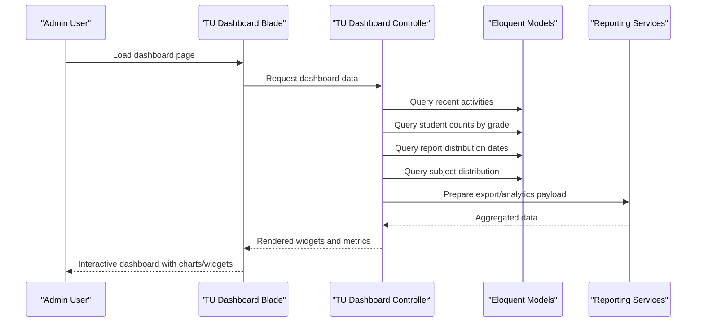
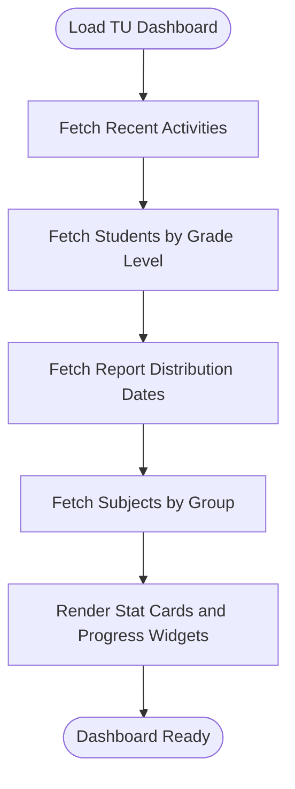
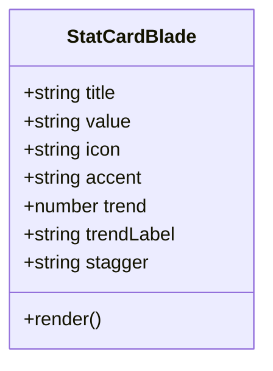
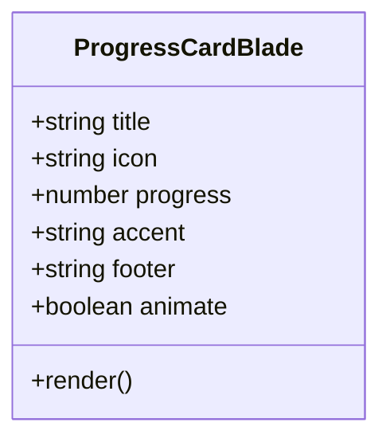
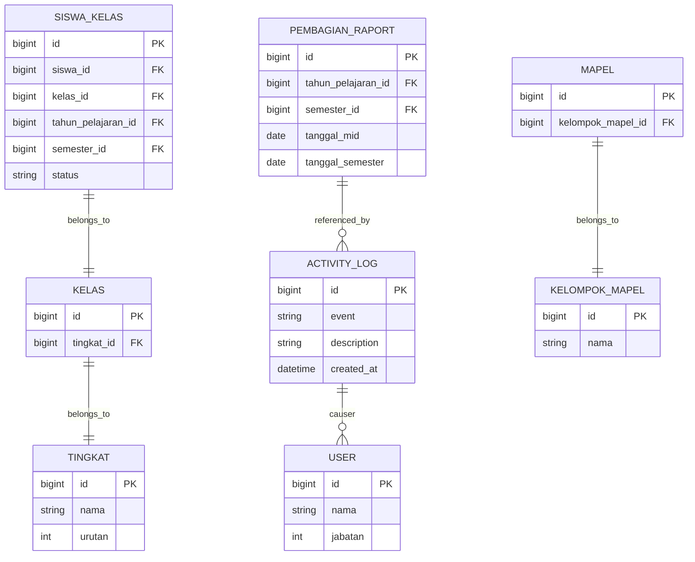
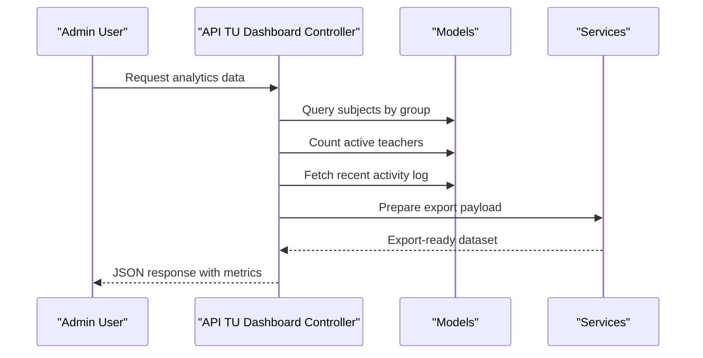
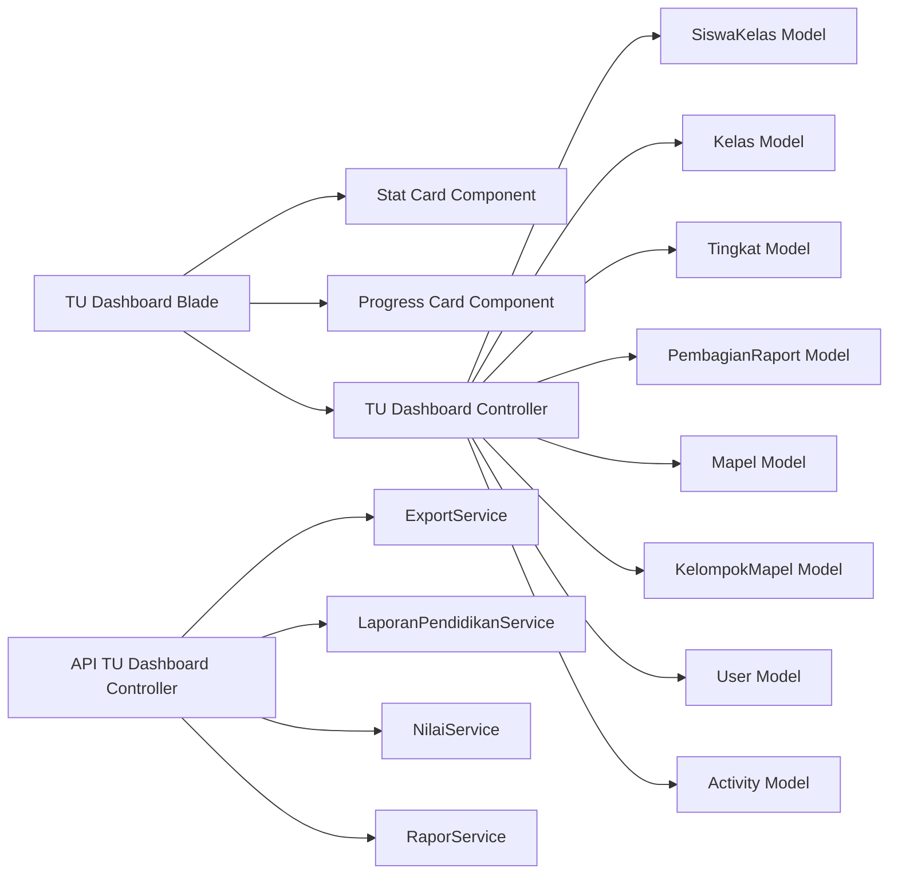

# Institutional Dashboard & Analytics

<cite>
**Referenced Files in This Document**
- [TU Dashboard Blade](file://resources/views/tu/dashboard.blade.php)
- [Stat Card Component](file://resources/views/components/stat-card.blade.php)
- [Progress Card Component](file://resources/views/components/progress-card.blade.php)
- [TU Dashboard Controller](file://app/Http/Controllers/TU/DashboardController.php)
- [API TU Dashboard Controller](file://app/Http/Controllers/Api/V1/Tu/DashboardController.php)
- [Export Service](file://app/Services/ExportService.php)
- [LaporanPendidikanService](file://app/Services/LaporanPendidikanService.php)
- [NilaiService](file://app/Services/NilaiService.php)
- [RaporService](file://app/Services/RaporService.php)
- [Siswa Model](file://app/Models/Siswa.php)
- [Kelas Model](file://app/Models/Kelas.php)
- [Tingkat Model](file://app/Models/Tingkat.php)
- [PembagianRaport Model](file://app/Models/PembagianRaport.php)
- [SiswaKelas Model](file://app/Models/SiswaKelas.php)
- [Mapel Model](file://app/Models/Mapel.php)
- [KelompokMapel Model](file://app/Models/KelompokMapel.php)
- [User Model](file://app/Models/User.php)
- [Activity Log Model](file://app/Models/Activity.php)
- [Manual TU - Dashboard Section](file://docs/manual-tu/01-persiapan.md)
- [Manual Guru - Dashboard Section](file://docs/manual-guru/01-mulai.md)
</cite>

## Table of Contents
1. [Introduction](#introduction)
2. [Project Structure](#project-structure)
3. [Core Components](#core-components)
4. [Architecture Overview](#architecture-overview)
5. [Detailed Component Analysis](#detailed-component-analysis)
6. [Dependency Analysis](#dependency-analysis)
7. [Performance Considerations](#performance-considerations)
8. [Troubleshooting Guide](#troubleshooting-guide)
9. [Conclusion](#conclusion)
10. [Appendices](#appendices)

## Introduction
This document describes the institutional dashboard and analytics functionality for the e-Rapor system. It covers the administrative dashboard interface that presents key performance indicators, institutional metrics, and real-time data visualization. It also explains reporting dashboard features for academic performance tracking, student progress monitoring, and institutional analytics. The documentation details data aggregation, statistical reporting, and trend analysis capabilities, along with customizable dashboard widgets, metric configurations, and reporting filters. Institutional benchmarking, comparative analysis, and decision-support features are addressed, including export capabilities for reports, data sharing, and administrative decision-making tools.

## Project Structure
The institutional dashboard spans view templates, Blade components, controllers, and service classes. The primary dashboard template for TU (Administrative) users is located under the TU views, while reusable UI components are provided via Blade components. Controllers orchestrate data retrieval and prepare metrics for rendering. Services encapsulate business logic for reporting and data export.

```mermaid
graph TB
subgraph "Views"
TU_Dashboard["TU Dashboard<br/>resources/views/tu/dashboard.blade.php"]
StatCard["Stat Card Component<br/>resources/views/components/stat-card.blade.php"]
ProgressCard["Progress Card Component<br/>resources/views/components/progress-card.blade.php"]
end
subgraph "Controllers"
TU_Controller["TU Dashboard Controller<br/>app/Http/Controllers/TU/DashboardController.php"]
API_TU_Controller["API TU Dashboard Controller<br/>app/Http/Controllers/Api/V1/Tu/DashboardController.php"]
end
subgraph "Services"
ExportService["ExportService<br/>app/Services/ExportService.php"]
LaporanService["LaporanPendidikanService<br/>app/Services/LaporanPendidikanService.php"]
NilaiService["NilaiService<br/>app/Services/NilaiService.php"]
RaporService["RaporService<br/>app/Services/RaporService.php"]
end
subgraph "Models"
Siswa["Siswa Model<br/>app/Models/Siswa.php"]
Kelas["Kelas Model<br/>app/Models/Kelas.php"]
Tingkat["Tingkat Model<br/>app/Models/Tingkat.php"]
PembagianRaport["PembagianRaport Model<br/>app/Models/PembagianRaport.php"]
SiswaKelas["SiswaKelas Model<br/>app/Models/SiswaKelas.php"]
Mapel["Mapel Model<br/>app/Models/Mapel.php"]
KelompokMapel["KelompokMapel Model<br/>app/Models/KelompokMapel.php"]
User["User Model<br/>app/Models/User.php"]
Activity["Activity Model<br/>app/Models/Activity.php"]
end
TU_Dashboard --> StatCard
TU_Dashboard --> ProgressCard
TU_Dashboard --> TU_Controller
TU_Controller --> SiswaKelas
TU_Controller --> Siswa
TU_Controller --> Kelas
TU_Controller --> Tingkat
TU_Controller --> PembagianRaport
TU_Controller --> Mapel
TU_Controller --> KelompokMapel
TU_Controller --> User
TU_Controller --> Activity
API_TU_Controller --> ExportService
API_TU_Controller --> LaporanService
API_TU_Controller --> NilaiService
API_TU_Controller --> RaporService
```

**Diagram sources**
- [TU Dashboard Blade:1-200](file://resources/views/tu/dashboard.blade.php#L1-L200)
- [Stat Card Component:1-129](file://resources/views/components/stat-card.blade.php#L1-L129)
- [Progress Card Component:1-109](file://resources/views/components/progress-card.blade.php#L1-L109)
- [TU Dashboard Controller:1-200](file://app/Http/Controllers/TU/DashboardController.php#L1-L200)
- [API TU Dashboard Controller:1-200](file://app/Http/Controllers/Api/V1/Tu/DashboardController.php#L1-L200)
- [Export Service:1-200](file://app/Services/ExportService.php#L1-L200)
- [LaporanPendidikanService:1-200](file://app/Services/LaporanPendidikanService.php#L1-L200)
- [NilaiService:1-200](file://app/Services/NilaiService.php#L1-L200)
- [RaporService:1-200](file://app/Services/RaporService.php#L1-L200)
- [Siswa Model:1-200](file://app/Models/Siswa.php#L1-L200)
- [Kelas Model:1-200](file://app/Models/Kelas.php#L1-L200)
- [Tingkat Model:1-200](file://app/Models/Tingkat.php#L1-L200)
- [PembagianRaport Model:1-200](file://app/Models/PembagianRaport.php#L1-L200)
- [SiswaKelas Model:1-200](file://app/Models/SiswaKelas.php#L1-L200)
- [Mapel Model:1-200](file://app/Models/Mapel.php#L1-L200)
- [KelompokMapel Model:1-200](file://app/Models/KelompokMapel.php#L1-L200)
- [User Model:1-200](file://app/Models/User.php#L1-L200)
- [Activity Log Model:1-200](file://app/Models/Activity.php#L1-L200)

**Section sources**
- [TU Dashboard Blade:1-200](file://resources/views/tu/dashboard.blade.php#L1-L200)
- [Stat Card Component:1-129](file://resources/views/components/stat-card.blade.php#L1-L129)
- [Progress Card Component:1-109](file://resources/views/components/progress-card.blade.php#L1-L109)
- [TU Dashboard Controller:1-200](file://app/Http/Controllers/TU/DashboardController.php#L1-L200)
- [API TU Dashboard Controller:1-200](file://app/Http/Controllers/Api/V1/Tu/DashboardController.php#L1-L200)

## Core Components
- Administrative Dashboard Template: Presents institutional metrics, recent activities, and report distribution dates using Blade templating and reusable components.
- Stat Card Component: Reusable widget for displaying key metrics with icons, accents, and optional trend indicators.
- Progress Card Component: Visual progress indicator for timelines such as report distribution periods.
- Dashboard Controllers: Orchestrate data aggregation from models, compute derived metrics, and prepare datasets for the dashboard.
- Reporting Services: Encapsulate export and analytics logic for academic performance and institutional reporting.

Key dashboard widgets observed:
- Recent Activities feed
- Students per Grade Level distribution
- Report Distribution calendar (mid-term and final report)
- Academic subject distribution by curriculum group

**Section sources**
- [TU Dashboard Blade:48-65](file://resources/views/tu/dashboard.blade.php#L48-L65)
- [Stat Card Component:1-129](file://resources/views/components/stat-card.blade.php#L1-L129)
- [Progress Card Component:1-109](file://resources/views/components/progress-card.blade.php#L1-L109)
- [TU Dashboard Controller:37-120](file://app/Http/Controllers/TU/DashboardController.php#L37-L120)
- [API TU Dashboard Controller:59-82](file://app/Http/Controllers/Api/V1/Tu/DashboardController.php#L59-L82)

## Architecture Overview
The dashboard follows a layered architecture:
- Presentation Layer: Blade templates and Blade components render UI widgets.
- Control Layer: Controllers fetch and transform data, invoking services for complex operations.
- Service Layer: Services encapsulate domain logic for reporting, export, and analytics.
- Data Access Layer: Eloquent models define relationships and queries used by controllers and services.

**Diagram sources**
- [TU Dashboard Blade:1-200](file://resources/views/tu/dashboard.blade.php#L1-L200)
- [TU Dashboard Controller:37-120](file://app/Http/Controllers/TU/DashboardController.php#L37-L120)
- [API TU Dashboard Controller:59-82](file://app/Http/Controllers/Api/V1/Tu/DashboardController.php#L59-L82)
- [Export Service:1-200](file://app/Services/ExportService.php#L1-L200)
- [LaporanPendidikanService:1-200](file://app/Services/LaporanPendidikanService.php#L1-L200)

## Detailed Component Analysis

### Administrative Dashboard Interface
The TU dashboard aggregates institutional metrics and displays them in digestible widgets:
- Recent Activities: Displays latest system actions with actor attribution.
- Students per Grade Level: Aggregates active students grouped by grade level order.
- Report Distribution Dates: Shows mid-semester and final report distribution deadlines.
- Subject Distribution: Counts subjects grouped by curriculum subject groups.

**Diagram sources**
- [TU Dashboard Controller:52-120](file://app/Http/Controllers/TU/DashboardController.php#L52-L120)
- [TU Dashboard Blade:1-200](file://resources/views/tu/dashboard.blade.php#L1-L200)

**Section sources**
- [TU Dashboard Blade:48-65](file://resources/views/tu/dashboard.blade.php#L48-L65)
- [TU Dashboard Controller:37-120](file://app/Http/Controllers/TU/DashboardController.php#L37-L120)

### Stat Card Component
Reusable component for displaying metrics with:
- Title and value
- Icon selection
- Accent color variants (teal, gold, sky, coral)
- Optional trend indicator and label
- Staggered animation support

**Diagram sources**
- [Stat Card Component:1-129](file://resources/views/components/stat-card.blade.php#L1-L129)

**Section sources**
- [Stat Card Component:1-129](file://resources/views/components/stat-card.blade.php#L1-L129)

### Progress Card Component
Visual progress indicator for timelines:
- Title and icon
- Progress percentage
- Accent color variants
- Footer text (e.g., remaining days)
- Optional animation flag

**Diagram sources**
- [Progress Card Component:1-109](file://resources/views/components/progress-card.blade.php#L1-L109)

**Section sources**
- [Progress Card Component:1-109](file://resources/views/components/progress-card.blade.php#L1-L109)

### Data Aggregation and Metrics
Controllers aggregate institutional metrics from models:
- Recent Activities: Uses activity log model with causer relationship.
- Students per Grade Level: Joins student-class enrollment with class and grade level tables.
- Report Distribution: Calculates remaining days and progress percentage for report cycles.
- Subject Distribution: Groups subjects by curriculum subject group.

**Diagram sources**
- [Activity Log Model:1-200](file://app/Models/Activity.php#L1-L200)
- [User Model:1-200](file://app/Models/User.php#L1-L200)
- [SiswaKelas Model:1-200](file://app/Models/SiswaKelas.php#L1-L200)
- [Kelas Model:1-200](file://app/Models/Kelas.php#L1-L200)
- [Tingkat Model:1-200](file://app/Models/Tingkat.php#L1-L200)
- [PembagianRaport Model:1-200](file://app/Models/PembagianRaport.php#L1-L200)
- [Mapel Model:1-200](file://app/Models/Mapel.php#L1-L200)
- [KelompokMapel Model:1-200](file://app/Models/KelompokMapel.php#L1-L200)

**Section sources**
- [TU Dashboard Controller:52-120](file://app/Http/Controllers/TU/DashboardController.php#L52-L120)
- [API TU Dashboard Controller:59-82](file://app/Http/Controllers/Api/V1/Tu/DashboardController.php#L59-L82)

### Reporting Dashboard Features
The reporting dashboard supports:
- Academic performance tracking: Derived from subject and assessment models.
- Student progress monitoring: Enrolled student data and class grouping.
- Institutional analytics: Subject distribution and curriculum grouping.

**Diagram sources**
- [API TU Dashboard Controller:59-82](file://app/Http/Controllers/Api/V1/Tu/DashboardController.php#L59-L82)
- [Export Service:1-200](file://app/Services/ExportService.php#L1-L200)

**Section sources**
- [API TU Dashboard Controller:59-82](file://app/Http/Controllers/Api/V1/Tu/DashboardController.php#L59-L82)

### Statistical Reporting and Trend Analysis
Controllers compute:
- Remaining days until report distribution deadlines.
- Progress percentage between mid-term and final report dates.
- Monthly teacher activity counts for engagement metrics.

These computations enable trend analysis over time and comparative insights across semesters.

**Section sources**
- [TU Dashboard Controller:37-67](file://app/Http/Controllers/TU/DashboardController.php#L37-L67)
- [API TU Dashboard Controller:65-70](file://app/Http/Controllers/Api/V1/Tu/DashboardController.php#L65-L70)

### Customizable Dashboard Widgets and Metric Configurations
- Widget types: Stat cards and progress cards with configurable accents and icons.
- Metric configuration: Values, trends, and labels passed as component props.
- Layout composition: Grid-based arrangement in the dashboard template.

**Section sources**
- [Stat Card Component:1-129](file://resources/views/components/stat-card.blade.php#L1-L129)
- [Progress Card Component:1-109](file://resources/views/components/progress-card.blade.php#L1-L109)
- [TU Dashboard Blade:193-208](file://resources/views/tu/dashboard.blade.php#L193-L208)

### Reporting Filters and Comparative Analysis
- Filters: Year-level and semester-level scoping via model joins and where clauses.
- Comparative analysis: Grade-level distributions and subject-group comparisons.

**Section sources**
- [TU Dashboard Controller:58-67](file://app/Http/Controllers/TU/DashboardController.php#L58-L67)
- [API TU Dashboard Controller:59-63](file://app/Http/Controllers/Api/V1/Tu/DashboardController.php#L59-L63)

### Institutional Benchmarking and Decision Support
- Benchmarks: Subject distribution by curriculum group and grade-level headcounts.
- Decision support: Progress indicators for report cycles and recent activity feeds.

**Section sources**
- [API TU Dashboard Controller:59-63](file://app/Http/Controllers/Api/V1/Tu/DashboardController.php#L59-L63)
- [TU Dashboard Controller:37-50](file://app/Http/Controllers/TU/DashboardController.php#L37-L50)

### Export Capabilities and Data Sharing
- Export service integration: Provides structured datasets for reports.
- Data sharing: API endpoints return normalized analytics data consumable by external systems.

**Section sources**
- [Export Service:1-200](file://app/Services/ExportService.php#L1-L200)
- [API TU Dashboard Controller:72-82](file://app/Http/Controllers/Api/V1/Tu/DashboardController.php#L72-L82)

### Examples of Dashboard Usage and Workflows
- Administrative oversight: Review recent activities and upcoming report distribution dates.
- Academic monitoring: Track student enrollment by grade and subject grouping.
- Decision-making: Use progress indicators and recent activity to guide administrative actions.

**Section sources**
- [Manual TU - Dashboard Section:1-200](file://docs/manual-tu/01-persiapan.md#L1-L200)
- [Manual Guru - Dashboard Section:1-200](file://docs/manual-guru/01-mulai.md#L1-L200)

## Dependency Analysis
The dashboard depends on:
- Controllers for orchestrating data retrieval and transformations.
- Models for representing institutional entities and relationships.
- Services for export and analytics operations.
- Blade components for consistent UI rendering.

**Diagram sources**
- [TU Dashboard Blade:1-200](file://resources/views/tu/dashboard.blade.php#L1-L200)
- [Stat Card Component:1-129](file://resources/views/components/stat-card.blade.php#L1-L129)
- [Progress Card Component:1-109](file://resources/views/components/progress-card.blade.php#L1-L109)
- [TU Dashboard Controller:1-200](file://app/Http/Controllers/TU/DashboardController.php#L1-L200)
- [API TU Dashboard Controller:1-200](file://app/Http/Controllers/Api/V1/Tu/DashboardController.php#L1-L200)
- [Export Service:1-200](file://app/Services/ExportService.php#L1-L200)
- [LaporanPendidikanService:1-200](file://app/Services/LaporanPendidikanService.php#L1-L200)
- [NilaiService:1-200](file://app/Services/NilaiService.php#L1-L200)
- [RaporService:1-200](file://app/Services/RaporService.php#L1-L200)

**Section sources**
- [TU Dashboard Controller:1-200](file://app/Http/Controllers/TU/DashboardController.php#L1-L200)
- [API TU Dashboard Controller:1-200](file://app/Http/Controllers/Api/V1/Tu/DashboardController.php#L1-L200)

## Performance Considerations
- Efficient queries: Use joins and grouped aggregations to minimize N+1 queries.
- Pagination: Limit recent activity lists to a fixed number of records.
- Caching: Consider caching frequently accessed metrics for high-traffic periods.
- Rendering: Keep component props minimal to reduce DOM overhead.

## Troubleshooting Guide
- Missing metrics: Verify model relationships and ensure required joins are present.
- Incorrect progress calculations: Confirm date comparisons and boundary conditions for deadline computations.
- Empty activity feeds: Check activity log entries and causer relationships.
- Export failures: Validate service method signatures and dataset preparation logic.

**Section sources**
- [TU Dashboard Controller:37-67](file://app/Http/Controllers/TU/DashboardController.php#L37-L67)
- [API TU Dashboard Controller:65-82](file://app/Http/Controllers/Api/V1/Tu/DashboardController.php#L65-L82)

## Conclusion
The institutional dashboard integrates reusable UI components with robust controllers and services to deliver actionable insights for administrative oversight. It supports real-time metrics, progress tracking, and reporting workflows, enabling data-driven decision-making through customizable widgets, filters, and export capabilities.

## Appendices
- Additional documentation references for dashboard usage and administrative procedures are available in the manual sections for TU and Guru roles.

**Section sources**
- [Manual TU - Dashboard Section:1-200](file://docs/manual-tu/01-persiapan.md#L1-L200)
- [Manual Guru - Dashboard Section:1-200](file://docs/manual-guru/01-mulai.md#L1-L200)