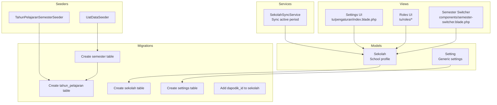
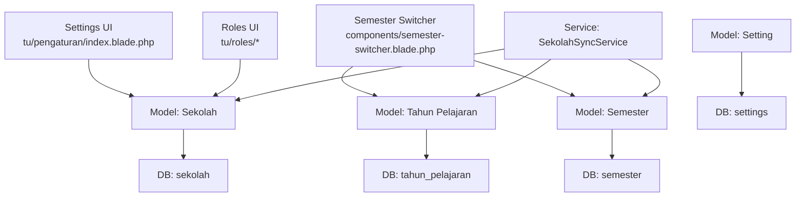
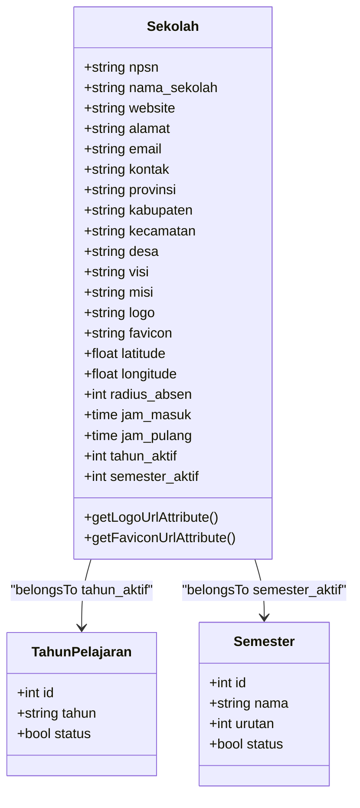
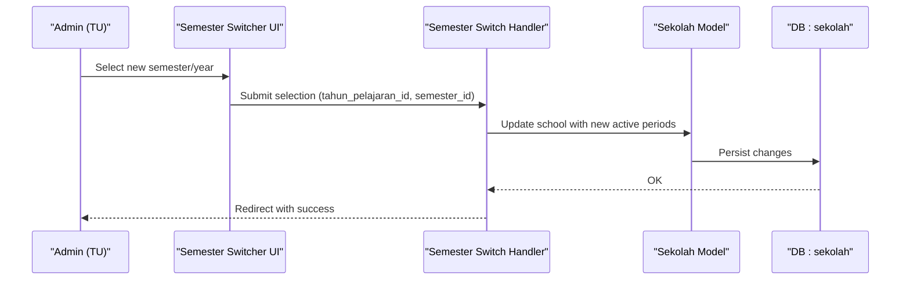
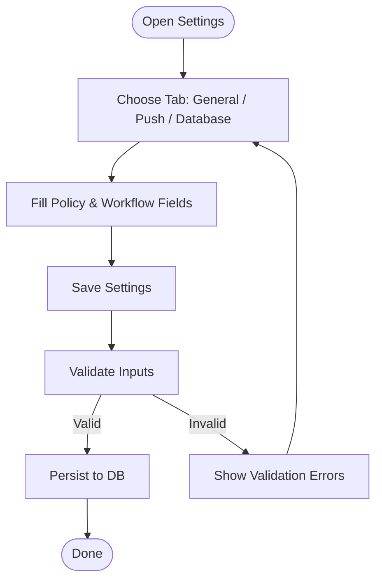
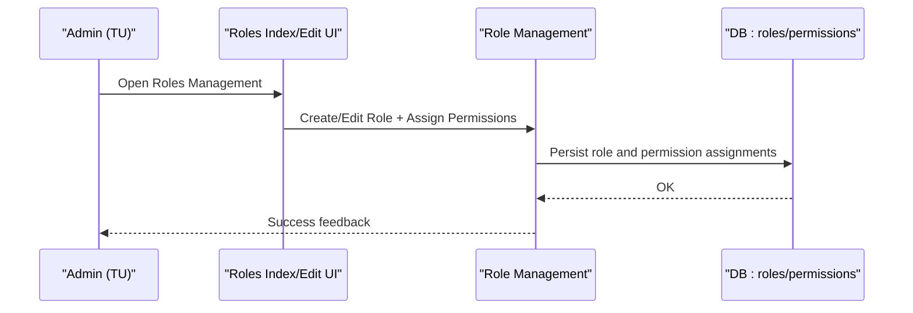
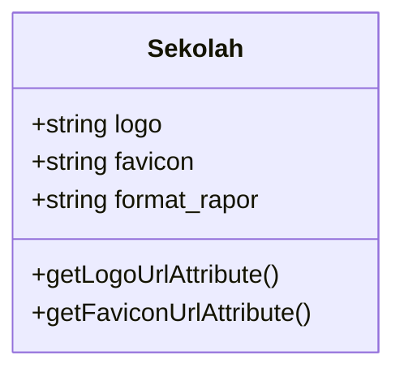
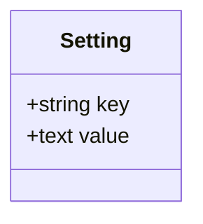
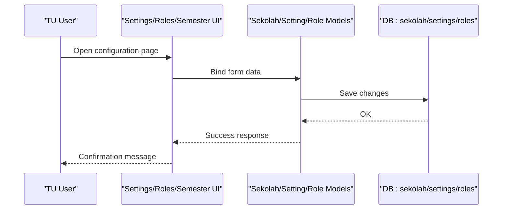
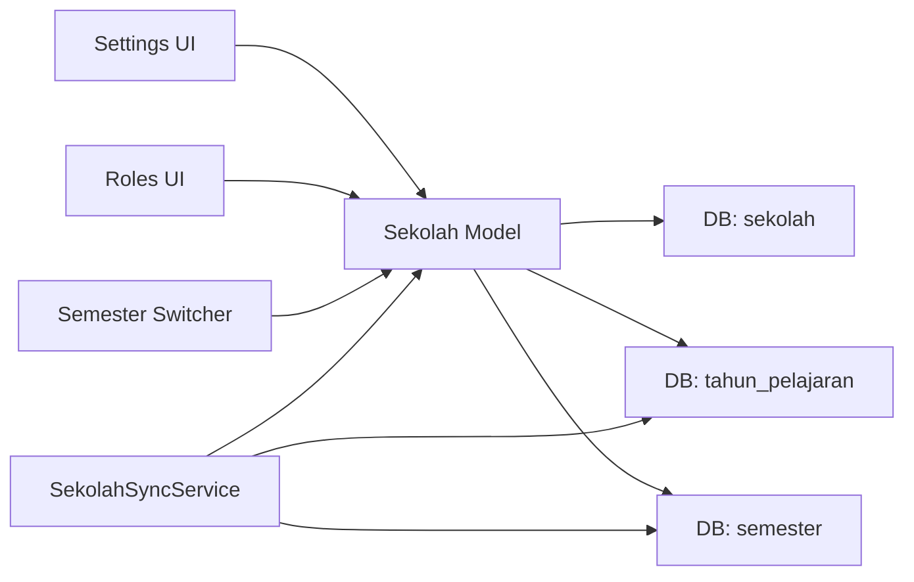

# School Configuration & Settings

<cite>
**Referenced Files in This Document**
- [Sekolah.php](file://app/Models/Sekolah.php)
- [SekolahFactory.php](file://database/factories/SekolahFactory.php)
- [2026_06_02_080000_add_dapodik_id_to_sekolah_table.php](file://database/migrations/2026_06_02_080000_add_dapodik_id_to_sekolah_table.php)
- [2026_06_01_010808_create_sekolah_table.php](file://database/migrations/2026_06_01_010808_create_sekolah_table.php)
- [2026_06_01_010808_create_semester_table.php](file://database/migrations/2026_06_01_010808_create_semester_table.php)
- [SemesterFactory.php](file://database/factories/SemesterFactory.php)
- [2026_06_01_010807_create_tahun_pelajaran_table.php](file://database/migrations/2026_06_01_010807_create_tahun_pelajaran_table.php)
- [TahunPelajaranSemesterSeeder.php](file://database/seeders/TahunPelajaranSemesterSeeder.php)
- [UatDataSeeder.php](file://database/seeders/UatDataSeeder.php)
- [Setting.php](file://app/Models/Setting.php)
- [2026_06_01_010810_create_settings_table.php](file://database/migrations/2026_06_01_010810_create_settings_table.php)
- [SekolahSyncService.php](file://app/Services/Dapodik/SekolahSyncService.php)
- [index.blade.php](file://resources/views/tu/pengaturan/index.blade.php)
- [semester-switcher.blade.php](file://resources/views/components/semester-switcher.blade.php)
- [index.blade.php](file://resources/views/tu/roles/index.blade.php)
- [edit.blade.php](file://resources/views/tu/roles/edit.blade.php)
- [index.blade.php](file://resources/views/tu/deskripsi-rapor/index.blade.php)
- [PengaturanApiTest.php](file://tests/Feature/Api/V1/PengaturanApiTest.php)
- [PRD-rapor-migrasi.md](file://PRD-rapor-migrasi.md)
</cite>

## Table of Contents
1. [Introduction](#introduction)
2. [Project Structure](#project-structure)
3. [Core Components](#core-components)
4. [Architecture Overview](#architecture-overview)
5. [Detailed Component Analysis](#detailed-component-analysis)
6. [Dependency Analysis](#dependency-analysis)
7. [Performance Considerations](#performance-considerations)
8. [Troubleshooting Guide](#troubleshooting-guide)
9. [Conclusion](#conclusion)
10. [Appendices](#appendices)

## Introduction
This document explains how to configure and manage institutional settings for the school management system. It covers:
- School profile configuration (institutional info, contact details, administrative parameters)
- Academic calendar setup (year and semester management)
- Administrative workflows (report distribution dates, print paper format)
- Institutional policies and grading systems
- User roles, permissions, and access controls
- Branding and customization (logo, favicon, print format)
- Backup and maintenance settings
- Examples of configuration workflows and administrative procedures

## Project Structure
Key areas involved in configuration and settings:
- Models define institutional entities and settings storage
- Migrations establish database schemas for schools, academic years/semesters, and generic settings
- Seeders initialize baseline academic periods
- Services synchronize active academic periods from external data
- Views provide UI for settings, role management, and semester switching
- Tests validate API endpoints for retrieving and updating settings

**Diagram sources**
- [Sekolah.php:16-46](file://app/Models/Sekolah.php#L16-L46)
- [Setting.php:8-14](file://app/Models/Setting.php#L8-L14)
- [2026_06_01_010808_create_sekolah_table.php:14-31](file://database/migrations/2026_06_01_010808_create_sekolah_table.php#L14-L31)
- [2026_06_01_010808_create_semester_table.php:14-31](file://database/migrations/2026_06_01_010808_create_semester_table.php#L14-L31)
- [2026_06_01_010807_create_tahun_pelajaran_table.php](file://database/migrations/2026_06_01_010807_create_tahun_pelajaran_table.php)
- [2026_06_01_010810_create_settings_table.php:14-29](file://database/migrations/2026_06_01_010810_create_settings_table.php#L14-L29)
- [2026_06_02_080000_add_dapodik_id_to_sekolah_table.php:11-24](file://database/migrations/2026_06_02_080000_add_dapodik_id_to_sekolah_table.php#L11-L24)
- [TahunPelajaranSemesterSeeder.php:12-21](file://database/seeders/TahunPelajaranSemesterSeeder.php#L12-L21)
- [UatDataSeeder.php:48-65](file://database/seeders/UatDataSeeder.php#L48-L65)
- [SekolahSyncService.php:47-61](file://app/Services/Dapodik/SekolahSyncService.php#L47-L61)
- [index.blade.php:1-102](file://resources/views/tu/pengaturan/index.blade.php#L1-L102)
- [index.blade.php:1-127](file://resources/views/tu/roles/index.blade.php#L1-L127)
- [edit.blade.php:29-128](file://resources/views/tu/roles/edit.blade.php#L29-L128)
- [semester-switcher.blade.php:1-48](file://resources/views/components/semester-switcher.blade.php#L1-L48)

**Section sources**
- [Sekolah.php:16-46](file://app/Models/Sekolah.php#L16-L46)
- [Setting.php:8-14](file://app/Models/Setting.php#L8-L14)
- [2026_06_01_010808_create_sekolah_table.php:14-31](file://database/migrations/2026_06_01_010808_create_sekolah_table.php#L14-L31)
- [2026_06_01_010808_create_semester_table.php:14-31](file://database/migrations/2026_06_01_010808_create_semester_table.php#L14-L31)
- [2026_06_01_010807_create_tahun_pelajaran_table.php](file://database/migrations/2026_06_01_010807_create_tahun_pelajaran_table.php)
- [2026_06_01_010810_create_settings_table.php:14-29](file://database/migrations/2026_06_01_010810_create_settings_table.php#L14-L29)
- [2026_06_02_080000_add_dapodik_id_to_sekolah_table.php:11-24](file://database/migrations/2026_06_02_080000_add_dapodik_id_to_sekolah_table.php#L11-L24)
- [TahunPelajaranSemesterSeeder.php:12-21](file://database/seeders/TahunPelajaranSemesterSeeder.php#L12-L21)
- [UatDataSeeder.php:48-65](file://database/seeders/UatDataSeeder.php#L48-L65)
- [SekolahSyncService.php:47-61](file://app/Services/Dapodik/SekolahSyncService.php#L47-L61)
- [index.blade.php:1-102](file://resources/views/tu/pengaturan/index.blade.php#L1-L102)
- [index.blade.php:1-127](file://resources/views/tu/roles/index.blade.php#L1-L127)
- [edit.blade.php:29-128](file://resources/views/tu/roles/edit.blade.php#L29-L128)
- [semester-switcher.blade.php:1-48](file://resources/views/components/semester-switcher.blade.php#L1-L48)

## Core Components
- School profile model encapsulates institutional information, branding assets, administrative parameters, and academic period associations.
- Generic settings model stores key-value pairs for system-wide configuration.
- Academic year and semester models define the academic calendar and active period selection.
- UI components provide forms and selectors for changing active semester and managing settings.
- Services integrate with external data sources to synchronize active academic periods.

**Section sources**
- [Sekolah.php:16-46](file://app/Models/Sekolah.php#L16-L46)
- [Setting.php:8-14](file://app/Models/Setting.php#L8-L14)
- [2026_06_01_010808_create_sekolah_table.php:14-31](file://database/migrations/2026_06_01_010808_create_sekolah_table.php#L14-L31)
- [2026_06_01_010808_create_semester_table.php:14-31](file://database/migrations/2026_06_01_010808_create_semester_table.php#L14-L31)
- [2026_06_01_010807_create_tahun_pelajaran_table.php](file://database/migrations/2026_06_01_010807_create_tahun_pelajaran_table.php)
- [index.blade.php:1-102](file://resources/views/tu/pengaturan/index.blade.php#L1-L102)
- [semester-switcher.blade.php:1-48](file://resources/views/components/semester-switcher.blade.php#L1-L48)
- [SekolahSyncService.php:47-61](file://app/Services/Dapodik/SekolahSyncService.php#L47-L61)

## Architecture Overview
The configuration subsystem connects UI, models, and services to manage institutional settings and academic calendars.

**Diagram sources**
- [index.blade.php:1-102](file://resources/views/tu/pengaturan/index.blade.php#L1-L102)
- [index.blade.php:1-127](file://resources/views/tu/roles/index.blade.php#L1-L127)
- [edit.blade.php:29-128](file://resources/views/tu/roles/edit.blade.php#L29-L128)
- [semester-switcher.blade.php:1-48](file://resources/views/components/semester-switcher.blade.php#L1-L48)
- [Sekolah.php:16-46](file://app/Models/Sekolah.php#L16-L46)
- [Setting.php:8-14](file://app/Models/Setting.php#L8-L14)
- [2026_06_01_010808_create_sekolah_table.php:14-31](file://database/migrations/2026_06_01_010808_create_sekolah_table.php#L14-L31)
- [2026_06_01_010808_create_semester_table.php:14-31](file://database/migrations/2026_06_01_010808_create_semester_table.php#L14-L31)
- [2026_06_01_010807_create_tahun_pelajaran_table.php](file://database/migrations/2026_06_01_010807_create_tahun_pelajaran_table.php)
- [2026_06_01_010810_create_settings_table.php:14-29](file://database/migrations/2026_06_01_010810_create_settings_table.php#L14-L29)
- [SekolahSyncService.php:47-61](file://app/Services/Dapodik/SekolahSyncService.php#L47-L61)

## Detailed Component Analysis

### School Profile Configuration
School profile settings include institutional information, contact details, branding assets, administrative parameters, and academic period associations.

- Fields managed via the school model include identification, address, contact, website, vision/mission, location coordinates, radius for attendance, and operational hours.
- Branding assets (logo, favicon) are resolved to public URLs for rendering.
- Academic period associations connect the active year and semester to the school record.

**Diagram sources**
- [Sekolah.php:9-46](file://app/Models/Sekolah.php#L9-L46)
- [2026_06_01_010808_create_sekolah_table.php:14-31](file://database/migrations/2026_06_01_010808_create_sekolah_table.php#L14-L31)
- [2026_06_01_010808_create_semester_table.php:14-31](file://database/migrations/2026_06_01_010808_create_semester_table.php#L14-L31)
- [2026_06_01_010807_create_tahun_pelajaran_table.php](file://database/migrations/2026_06_01_010807_create_tahun_pelajaran_table.php)

**Section sources**
- [Sekolah.php:9-46](file://app/Models/Sekolah.php#L9-L46)
- [2026_06_01_010808_create_sekolah_table.php:14-31](file://database/migrations/2026_06_01_010808_create_sekolah_table.php#L14-L31)
- [2026_06_02_080000_add_dapodik_id_to_sekolah_table.php:11-24](file://database/migrations/2026_06_02_080000_add_dapodik_id_to_sekolah_table.php#L11-L24)
- [SekolahFactory.php:15-42](file://database/factories/SekolahFactory.php#L15-L42)

### Academic Calendar Setup and Semester Management
Academic year and semester records define the academic calendar. Active periods are selected via UI and persisted to the school record.

**Diagram sources**
- [semester-switcher.blade.php:1-48](file://resources/views/components/semester-switcher.blade.php#L1-L48)
- [index.blade.php:1-102](file://resources/views/tu/pengaturan/index.blade.php#L1-L102)
- [Sekolah.php:27-35](file://app/Models/Sekolah.php#L27-L35)

**Section sources**
- [2026_06_01_010808_create_semester_table.php:14-31](file://database/migrations/2026_06_01_010808_create_semester_table.php#L14-L31)
- [2026_06_01_010807_create_tahun_pelajaran_table.php](file://database/migrations/2026_06_01_010807_create_tahun_pelajaran_table.php)
- [SemesterFactory.php:15-28](file://database/factories/SemesterFactory.php#L15-L28)
- [TahunPelajaranSemesterSeeder.php:12-21](file://database/seeders/TahunPelajaranSemesterSeeder.php#L12-L21)
- [UatDataSeeder.php:48-65](file://database/seeders/UatDataSeeder.php#L48-L65)
- [semester-switcher.blade.php:1-48](file://resources/views/components/semester-switcher.blade.php#L1-L48)

### Institutional Policies, Grading Systems, and Administrative Workflows
- Policies and grading systems are documented in the project’s product requirement document, including grade calculation formulas and grading scales.
- Administrative workflows include report distribution dates and printing preferences, exposed via the settings UI.

**Diagram sources**
- [index.blade.php:1-102](file://resources/views/tu/pengaturan/index.blade.php#L1-L102)
- [PRD-rapor-migrasi.md:1445-1491](file://PRD-rapor-migrasi.md#L1445-L1491)

**Section sources**
- [index.blade.php:1-102](file://resources/views/tu/pengaturan/index.blade.php#L1-L102)
- [PRD-rapor-migrasi.md:1445-1491](file://PRD-rapor-migrasi.md#L1445-L1491)

### System Settings for User Roles, Permissions, and Access Controls
Role and permission management is handled through dedicated views and backend logic. Roles can be created and edited, with granular permission toggles grouped by functional areas.

**Diagram sources**
- [index.blade.php:1-127](file://resources/views/tu/roles/index.blade.php#L1-L127)
- [edit.blade.php:29-128](file://resources/views/tu/roles/edit.blade.php#L29-L128)

**Section sources**
- [index.blade.php:1-127](file://resources/views/tu/roles/index.blade.php#L1-L127)
- [edit.blade.php:29-128](file://resources/views/tu/roles/edit.blade.php#L29-L128)

### Branding and Customization Options
Branding includes logo and favicon uploads, with resolved public URLs for rendering. Print format defaults are configurable for report cards.

**Diagram sources**
- [Sekolah.php:37-45](file://app/Models/Sekolah.php#L37-L45)
- [index.blade.php:84-96](file://resources/views/tu/pengaturan/index.blade.php#L84-L96)

**Section sources**
- [Sekolah.php:37-45](file://app/Models/Sekolah.php#L37-L45)
- [index.blade.php:84-96](file://resources/views/tu/pengaturan/index.blade.php#L84-L96)

### Backup Configurations, Maintenance Settings, and Administrative Preferences
- Generic settings are stored in a key-value table, suitable for administrative preferences and maintenance toggles.
- Database-level maintenance and backups are outside the scope of the current UI but can be configured externally.

**Diagram sources**
- [Setting.php:8-14](file://app/Models/Setting.php#L8-L14)
- [2026_06_01_010810_create_settings_table.php:14-29](file://database/migrations/2026_06_01_010810_create_settings_table.php#L14-L29)

**Section sources**
- [Setting.php:8-14](file://app/Models/Setting.php#L8-L14)
- [2026_06_01_010810_create_settings_table.php:14-29](file://database/migrations/2026_06_01_010810_create_settings_table.php#L14-L29)

### Configuration Workflows and Procedures
- Academic year and semester activation: Use the semester switcher component to select active periods; the system persists selections to the school record.
- School profile updates: Use the settings UI to update institutional info, contacts, branding, and administrative parameters.
- Role and permission management: Use the roles UI to create roles and assign permissions across functional groups.
- Report card printing: Configure default paper format in the settings UI.

**Diagram sources**
- [index.blade.php:1-102](file://resources/views/tu/pengaturan/index.blade.php#L1-L102)
- [index.blade.php:1-127](file://resources/views/tu/roles/index.blade.php#L1-L127)
- [edit.blade.php:29-128](file://resources/views/tu/roles/edit.blade.php#L29-L128)
- [semester-switcher.blade.php:1-48](file://resources/views/components/semester-switcher.blade.php#L1-L48)

**Section sources**
- [index.blade.php:1-102](file://resources/views/tu/pengaturan/index.blade.php#L1-L102)
- [index.blade.php:1-127](file://resources/views/tu/roles/index.blade.php#L1-L127)
- [edit.blade.php:29-128](file://resources/views/tu/roles/edit.blade.php#L29-L128)
- [semester-switcher.blade.php:1-48](file://resources/views/components/semester-switcher.blade.php#L1-L48)

## Dependency Analysis
Configuration components depend on models, migrations, seeders, services, and views. Cohesion is strong around school and academic calendar entities; permissions and generic settings are decoupled for flexibility.

**Diagram sources**
- [Sekolah.php:16-46](file://app/Models/Sekolah.php#L16-L46)
- [SekolahSyncService.php:47-61](file://app/Services/Dapodik/SekolahSyncService.php#L47-L61)
- [index.blade.php:1-102](file://resources/views/tu/pengaturan/index.blade.php#L1-L102)
- [index.blade.php:1-127](file://resources/views/tu/roles/index.blade.php#L1-L127)
- [semester-switcher.blade.php:1-48](file://resources/views/components/semester-switcher.blade.php#L1-L48)

**Section sources**
- [Sekolah.php:16-46](file://app/Models/Sekolah.php#L16-L46)
- [SekolahSyncService.php:47-61](file://app/Services/Dapodik/SekolahSyncService.php#L47-L61)

## Performance Considerations
- Keep branding assets appropriately sized to minimize load times.
- Use database indexing on frequently queried keys (e.g., academic year/semester status) to speed up lookups.
- Batch updates for settings and roles to reduce transaction overhead.
- Cache infrequent configuration reads where appropriate.

## Troubleshooting Guide
- Active period not applied: Verify that the academic year and semester have status flags set and that the school record reflects the intended IDs.
- Logo/favicon missing: Confirm file paths are stored and public URLs resolve correctly.
- Role permission not taking effect: Ensure permissions are saved under the correct role and that the role is assigned to users.
- Settings not persisting: Check for validation errors and confirm the settings table exists and is writable.

**Section sources**
- [TahunPelajaranSemesterSeeder.php:12-21](file://database/seeders/TahunPelajaranSemesterSeeder.php#L12-L21)
- [UatDataSeeder.php:48-65](file://database/seeders/UatDataSeeder.php#L48-L65)
- [Sekolah.php:37-45](file://app/Models/Sekolah.php#L37-L45)
- [index.blade.php:1-127](file://resources/views/tu/roles/index.blade.php#L1-L127)
- [index.blade.php:1-102](file://resources/views/tu/pengaturan/index.blade.php#L1-L102)

## Conclusion
The system provides a structured approach to institutional configuration, academic calendar management, and access control. School profiles, academic periods, branding, and administrative preferences are integrated through models, migrations, seeders, services, and UI components. Following the documented workflows ensures consistent setup and operation across the platform.

## Appendices
- Related documentation on grading formulas and role access is available in the product requirement document.

**Section sources**
- [PRD-rapor-migrasi.md:1445-1491](file://PRD-rapor-migrasi.md#L1445-L1491)
- [PengaturanApiTest.php:51-53](file://tests/Feature/Api/V1/PengaturanApiTest.php#L51-L53)