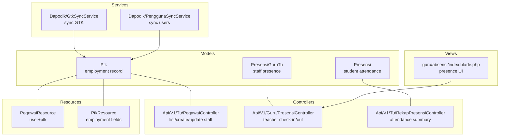
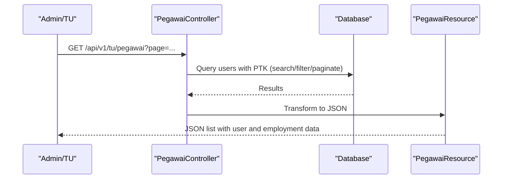
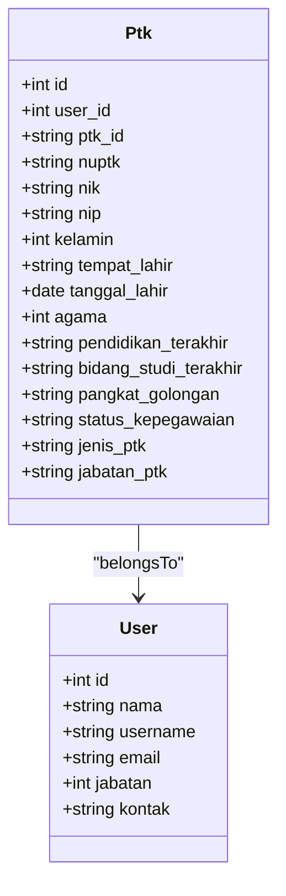
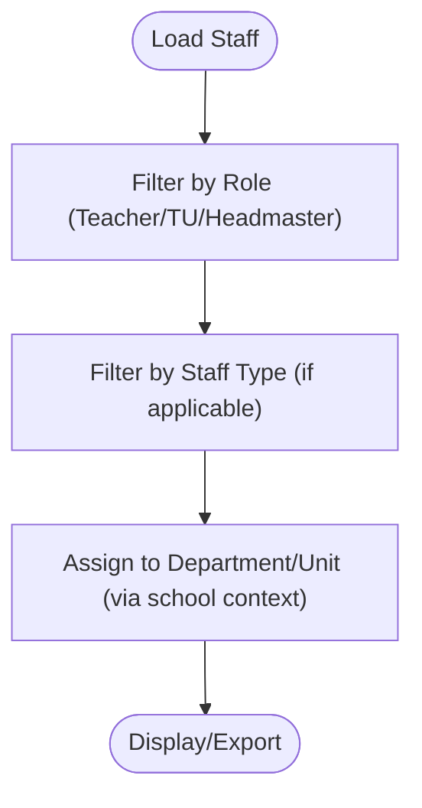
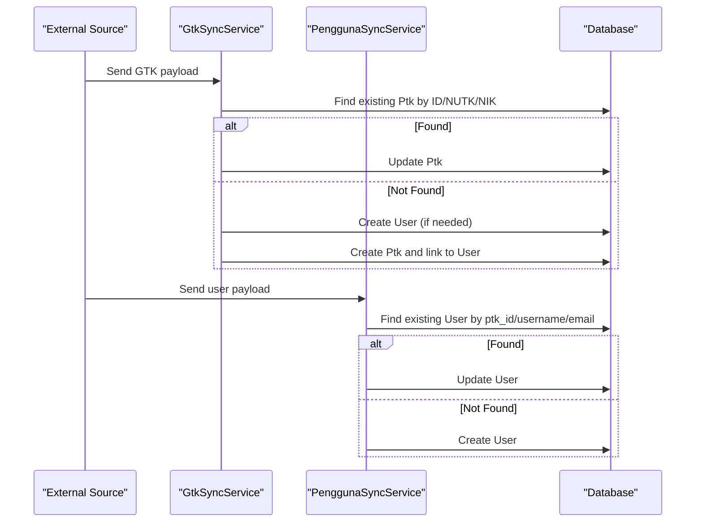
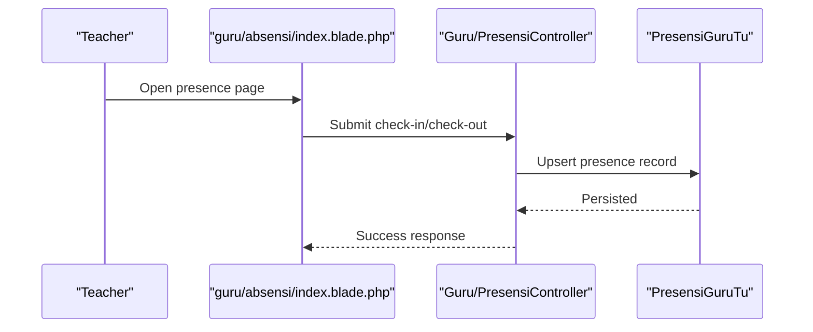
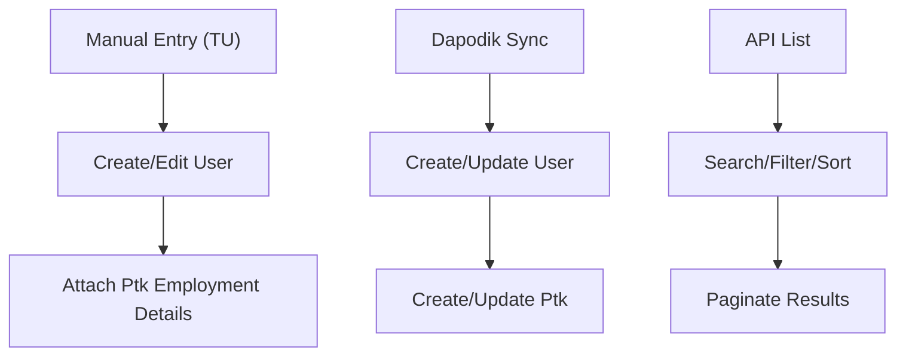
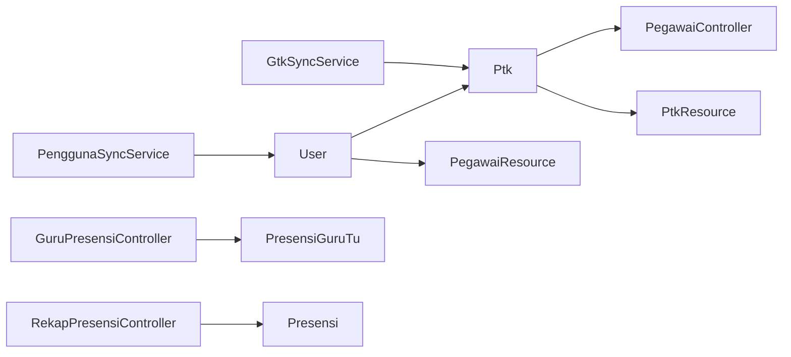

# Staff Management

<cite>
**Referenced Files in This Document**
- [2026_06_04_120000_create_ptk_table_and_migrate_from_users.php](file://database/migrations/2026_06_04_120000_create_ptk_table_and_migrate_from_users.php)
- [Ptk.php](file://app/Models/Ptk.php)
- [PegawaiController.php](file://app/Http/Controllers/Api/V1/Tu/PegawaiController.php)
- [PegawaiResource.php](file://app/Http/Resources/V1/PegawaiResource.php)
- [PtkResource.php](file://app/Http/Resources/V1/PtkResource.php)
- [PegawaiApiTest.php](file://tests/Feature/Api/V1/PegawaiApiTest.php)
- [GtkSyncService.php](file://app/Services/Dapodik/GtkSyncService.php)
- [PenggunaSyncService.php](file://app/Services/Dapodik/PenggunaSyncService.php)
- [create_ref_kepegawaian_table.php](file://database/migrations/2026_06_01_010802_create_ref_kepegawaian_table.php)
- [Presensi.php](file://app/Models/Presensi.php)
- [PresensiGuruTu.php](file://app/Models/PresensiGuruTu.php)
- [PresensiController.php](file://app/Http/Controllers/Api/V1/Guru/PresensiController.php)
- [RekapPresensiController.php](file://app/Http/Controllers/Api/V1/Tu/RekapPresensiController.php)
- [PresensiFactory.php](file://database/factories/PresensiFactory.php)
- [LaporanPendidikanService.php](file://app/Services/LaporanPendidikanService.php)
- [index.blade.php](file://resources/views/guru/absensi/index.blade.php)
- [02-manajemen-pengguna.md](file://docs/manual-tu/02-manajemen-pengguna.md)
</cite>

## Table of Contents
1. [Introduction](#introduction)
2. [Project Structure](#project-structure)
3. [Core Components](#core-components)
4. [Architecture Overview](#architecture-overview)
5. [Detailed Component Analysis](#detailed-component-analysis)
6. [Dependency Analysis](#dependency-analysis)
7. [Performance Considerations](#performance-considerations)
8. [Troubleshooting Guide](#troubleshooting-guide)
9. [Conclusion](#conclusion)
10. [Appendices](#appendices)

## Introduction
This document describes the staff management capabilities implemented in the system with a focus on teacher and employee information management. It covers staff registration, employment records, personnel data maintenance, classification and roles, departmental organization, performance tracking and evaluations, payroll integration, scheduling and duty assignments, attendance tracking, training and certification records, and administrative workflows. The system integrates with Dapodik for synchronization of staff data and supports both API and web interfaces for HR operations.

## Project Structure
The staff management features span models, controllers, resources, services, migrations, factories, and views. Key areas include:
- Data model for staff employment records
- API endpoints for staff CRUD and lists
- Resource classes for API serialization
- Services for Dapodik synchronization
- Attendance and presence models and controllers
- Documentation and manual pages for administrative workflows

**Diagram sources**
- [Ptk.php:1-41](file://app/Models/Ptk.php#L1-L41)
- [PegawaiController.php:1-48](file://app/Http/Controllers/Api/V1/Tu/PegawaiController.php#L1-L48)
- [PegawaiResource.php:1-27](file://app/Http/Resources/V1/PegawaiResource.php#L1-L27)
- [PtkResource.php:1-27](file://app/Http/Resources/V1/PtkResource.php#L1-L27)
- [Presensi.php:1-200](file://app/Models/Presensi.php#L1-L200)
- [PresensiGuruTu.php:1-200](file://app/Models/PresensiGuruTu.php#L1-L200)
- [PresensiController.php:1-200](file://app/Http/Controllers/Api/V1/Guru/PresensiController.php#L1-L200)
- [RekapPresensiController.php:1-200](file://app/Http/Controllers/Api/V1/Tu/RekapPresensiController.php#L1-L200)
- [GtkSyncService.php:74-150](file://app/Services/Dapodik/GtkSyncService.php#L74-L150)
- [PenggunaSyncService.php:89-133](file://app/Services/Dapodik/PenggunaSyncService.php#L89-L133)
- [index.blade.php:95-114](file://resources/views/guru/absensi/index.blade.php#L95-L114)

**Section sources**
- [2026_06_04_120000_create_ptk_table_and_migrate_from_users.php:1-33](file://database/migrations/2026_06_04_120000_create_ptk_table_and_migrate_from_users.php#L1-L33)
- [PegawaiController.php:1-48](file://app/Http/Controllers/Api/V1/Tu/PegawaiController.php#L1-L48)
- [PegawaiResource.php:1-27](file://app/Http/Resources/V1/PegawaiResource.php#L1-L27)
- [PtkResource.php:1-27](file://app/Http/Resources/V1/PtkResource.php#L1-L27)
- [Ptk.php:1-41](file://app/Models/Ptk.php#L1-L41)
- [Presensi.php:1-200](file://app/Models/Presensi.php#L1-L200)
- [PresensiGuruTu.php:1-200](file://app/Models/PresensiGuruTu.php#L1-L200)
- [PresensiController.php:1-200](file://app/Http/Controllers/Api/V1/Guru/PresensiController.php#L1-L200)
- [RekapPresensiController.php:1-200](file://app/Http/Controllers/Api/V1/Tu/RekapPresensiController.php#L1-L200)
- [GtkSyncService.php:74-150](file://app/Services/Dapodik/GtkSyncService.php#L74-L150)
- [PenggunaSyncService.php:89-133](file://app/Services/Dapodik/PenggunaSyncService.php#L89-L133)
- [index.blade.php:95-114](file://resources/views/guru/absensi/index.blade.php#L95-L114)

## Core Components
- Employment record model: Ptk encapsulates staff employment attributes such as NUPTK, NIP, gender, birthplace, date of birth, religion, last education, field of study, rank and grade, civil service status, staff type, and position title. It belongs to a User account.
- Staff API controller: Provides listing with search and filtering, pagination, and integrates with Ptk and User relations.
- Resource classes: Serialize user data plus Ptk employment details for API responses.
- Dapodik synchronization: Services synchronize GTK (teachers) and user accounts from external data sources, mapping gender and creating/updating records and linking to existing users.
- Attendance tracking: Presence models and controllers support staff check-in/check-out and summary reporting.

**Section sources**
- [Ptk.php:1-41](file://app/Models/Ptk.php#L1-L41)
- [PegawaiController.php:20-48](file://app/Http/Controllers/Api/V1/Tu/PegawaiController.php#L20-L48)
- [PegawaiResource.php:10-27](file://app/Http/Resources/V1/PegawaiResource.php#L10-L27)
- [PtkResource.php:10-27](file://app/Http/Resources/V1/PtkResource.php#L10-L27)
- [GtkSyncService.php:74-150](file://app/Services/Dapodik/GtkSyncService.php#L74-L150)
- [PenggunaSyncService.php:89-133](file://app/Services/Dapodik/PenggunaSyncService.php#L89-L133)

## Architecture Overview
The system separates concerns across models, controllers, resources, services, and views. Data flows from Dapodik via services into the database, while controllers expose staff and presence APIs. Views render UI for presence operations.

**Diagram sources**
- [PegawaiController.php:20-48](file://app/Http/Controllers/Api/V1/Tu/PegawaiController.php#L20-L48)
- [PegawaiResource.php:10-27](file://app/Http/Resources/V1/PegawaiResource.php#L10-L27)

## Detailed Component Analysis

### Staff Registration and Employment Records
- Data model: Ptk stores employment identifiers and attributes and links to a User.
- Migration: Creates the ptk table and adds foreign key constraints.
- API: Lists staff with optional search and filter by role, paginated or unpaginated.
- Resources: Expose user and Ptk data for consumption.

**Diagram sources**
- [Ptk.php:13-41](file://app/Models/Ptk.php#L13-L41)
- [2026_06_04_120000_create_ptk_table_and_migrate_from_users.php:14-32](file://database/migrations/2026_06_04_120000_create_ptk_table_and_migrate_from_users.php#L14-L32)

**Section sources**
- [Ptk.php:13-41](file://app/Models/Ptk.php#L13-L41)
- [2026_06_04_120000_create_ptk_table_and_migrate_from_users.php:12-33](file://database/migrations/2026_06_04_120000_create_ptk_table_and_migrate_from_users.php#L12-L33)
- [PegawaiController.php:20-48](file://app/Http/Controllers/Api/V1/Tu/PegawaiController.php#L20-L48)
- [PegawaiResource.php:10-27](file://app/Http/Resources/V1/PegawaiResource.php#L10-L27)
- [PtkResource.php:10-27](file://app/Http/Resources/V1/PtkResource.php#L10-L27)

### Staff Classification and Departmental Organization
- Role-based classification: Users have a role field indicating positions such as teacher, staff (TU), or headmaster.
- Employment classification: Ptk includes fields for staff type and position title.
- Reference data: Migrations define reference tables for civil service status and other enumerations.

**Section sources**
- [create_ref_kepegawaian_table.php:14-19](file://database/migrations/2026_06_01_010802_create_ref_kepegawaian_table.php#L14-L19)
- [PegawaiController.php:33-35](file://app/Http/Controllers/Api/V1/Tu/PegawaiController.php#L33-L35)
- [Ptk.php:29-30](file://app/Models/Ptk.php#L29-L30)

### Personnel Data Maintenance and Dapodik Integration
- Synchronization: Services map incoming GTK data to create or update Ptk and associated User records, including gender mapping and username/email generation.
- User synchronization: Similar mapping for general users, linking to Ptk when available.

**Diagram sources**
- [GtkSyncService.php:74-150](file://app/Services/Dapodik/GtkSyncService.php#L74-L150)
- [PenggunaSyncService.php:89-133](file://app/Services/Dapodik/PenggunaSyncService.php#L89-L133)

**Section sources**
- [GtkSyncService.php:74-150](file://app/Services/Dapodik/GtkSyncService.php#L74-L150)
- [PenggunaSyncService.php:89-133](file://app/Services/Dapodik/PenggunaSyncService.php#L89-L133)

### Attendance Tracking and Duty Assignments
- Presence models: Separate models for student attendance and staff presence.
- Teacher presence UI: Provides check-in/check-out actions for daily duty tracking.
- Rekapitulation: Controllers summarize presence counts by type.

**Diagram sources**
- [index.blade.php:95-114](file://resources/views/guru/absensi/index.blade.php#L95-L114)
- [PresensiController.php:1-200](file://app/Http/Controllers/Api/V1/Guru/PresensiController.php#L1-L200)
- [PresensiGuruTu.php:1-200](file://app/Models/PresensiGuruTu.php#L1-L200)

**Section sources**
- [Presensi.php:1-200](file://app/Models/Presensi.php#L1-L200)
- [PresensiGuruTu.php:1-200](file://app/Models/PresensiGuruTu.php#L1-L200)
- [index.blade.php:95-114](file://resources/views/guru/absensi/index.blade.php#L95-L114)
- [PresensiController.php:1-200](file://app/Http/Controllers/Api/V1/Guru/PresensiController.php#L1-L200)
- [RekapPresensiController.php:1-200](file://app/Http/Controllers/Api/V1/Tu/RekapPresensiController.php#L1-L200)
- [LaporanPendidikanService.php:122-138](file://app/Services/LaporanPendidikanService.php#L122-L138)

### Performance Tracking, Evaluation Systems, and Career Progression
- Current scope: The codebase does not include dedicated performance evaluation or career progression models or controllers. Attendance and basic presence are supported.
- Recommendation: Introduce evaluation models and controllers aligned with Ptk and User to track goals, reviews, and promotions.

[No sources needed since this section provides general guidance]

### Payroll Integration, Salary Management, and Benefits Administration
- Current scope: No explicit payroll or benefits models or controllers were identified in the examined files.
- Recommendation: Add salary/benefit models linked to Ptk/User and integrate with presence/attendance data for computation.

[No sources needed since this section provides general guidance]

### Training Records, Certifications, and Professional Development
- Current scope: No dedicated training or certification models were identified.
- Recommendation: Create training and certification models with pivot tables to associate with Ptk and track completion dates and issuing authorities.

[No sources needed since this section provides general guidance]

### Administrative Workflows and Examples
- Staff data entry: Manual creation/editing of staff via the TU interface with role and employment details.
- Bulk operations: Dapodik synchronization services process batches of GTK and user records.
- API usage: Tests demonstrate listing staff via API with authentication tokens.

**Section sources**
- [02-manajemen-pengguna.md:12-38](file://docs/manual-tu/02-manajemen-pengguna.md#L12-L38)
- [PegawaiApiTest.php:48-53](file://tests/Feature/Api/V1/PegawaiApiTest.php#L48-L53)
- [GtkSyncService.php:74-150](file://app/Services/Dapodik/GtkSyncService.php#L74-L150)

## Dependency Analysis
- Ptk depends on User via foreign key.
- Controllers depend on models and resources for data access and serialization.
- Services depend on models and external data sources for synchronization.
- Views depend on controllers for rendering presence forms.

**Diagram sources**
- [Ptk.php:37-40](file://app/Models/Ptk.php#L37-L40)
- [PegawaiController.php:16-48](file://app/Http/Controllers/Api/V1/Tu/PegawaiController.php#L16-L48)
- [PegawaiResource.php:10-27](file://app/Http/Resources/V1/PegawaiResource.php#L10-L27)
- [PtkResource.php:10-27](file://app/Http/Resources/V1/PtkResource.php#L10-L27)
- [GtkSyncService.php:74-150](file://app/Services/Dapodik/GtkSyncService.php#L74-L150)
- [PenggunaSyncService.php:89-133](file://app/Services/Dapodik/PenggunaSyncService.php#L89-L133)
- [PresensiGuruTu.php:1-200](file://app/Models/PresensiGuruTu.php#L1-L200)
- [Presensi.php:1-200](file://app/Models/Presensi.php#L1-L200)

**Section sources**
- [PegawaiController.php:16-48](file://app/Http/Controllers/Api/V1/Tu/PegawaiController.php#L16-L48)
- [PegawaiResource.php:10-27](file://app/Http/Resources/V1/PegawaiResource.php#L10-L27)
- [PtkResource.php:10-27](file://app/Http/Resources/V1/PtkResource.php#L10-L27)
- [Ptk.php:37-40](file://app/Models/Ptk.php#L37-L40)
- [GtkSyncService.php:74-150](file://app/Services/Dapodik/GtkSyncService.php#L74-L150)
- [PenggunaSyncService.php:89-133](file://app/Services/Dapodik/PenggunaSyncService.php#L89-L133)
- [PresensiGuruTu.php:1-200](file://app/Models/PresensiGuruTu.php#L1-L200)
- [Presensi.php:1-200](file://app/Models/Presensi.php#L1-L200)

## Performance Considerations
- Pagination: The staff listing endpoint supports pagination to avoid large result sets.
- Search and filters: Indexable fields (name, username, contact) enable efficient queries.
- Synchronization: Batch processing in services reduces repeated lookups and updates.

[No sources needed since this section provides general guidance]

## Troubleshooting Guide
- Authentication failures: Ensure API requests include a valid bearer token.
- Presence submission errors: Verify current day’s presence record and check-in/check-out state.
- Sync issues: Confirm identity fields (ptk_id, nuptk, nik) and gender mapping in synchronization services.

**Section sources**
- [PegawaiApiTest.php:38-46](file://tests/Feature/Api/V1/PegawaiApiTest.php#L38-L46)
- [index.blade.php:101-111](file://resources/views/guru/absensi/index.blade.php#L101-L111)
- [GtkSyncService.php:132-139](file://app/Services/Dapodik/GtkSyncService.php#L132-L139)

## Conclusion
The system provides a solid foundation for staff management with employment records, role-based classification, Dapodik synchronization, and presence tracking. To meet comprehensive HR needs, extend the system with performance evaluation, career progression, payroll, benefits, training/certifications, and standardized administrative workflows.

[No sources needed since this section summarizes without analyzing specific files]

## Appendices
- Example administrative tasks:
  - Add/edit staff via TU interface with role and employment details.
  - Trigger Dapodik sync to import GTK and user accounts.
  - Use API endpoints to list and filter staff programmatically.

[No sources needed since this section provides general guidance]