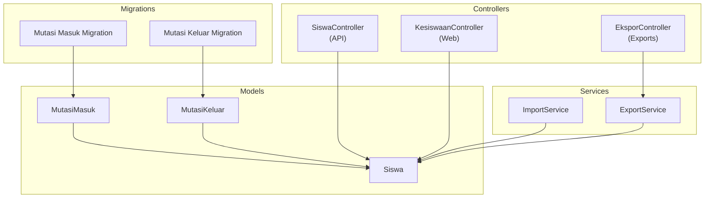
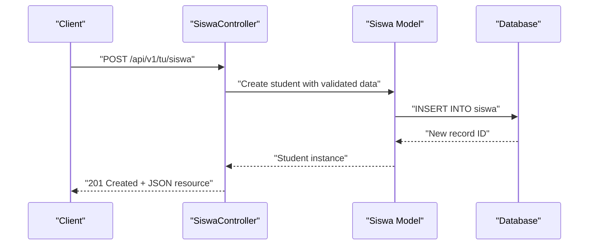
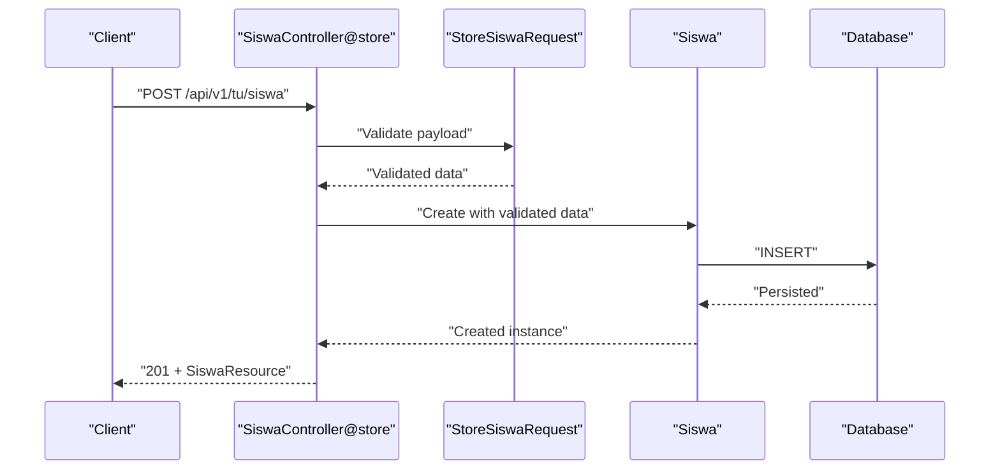
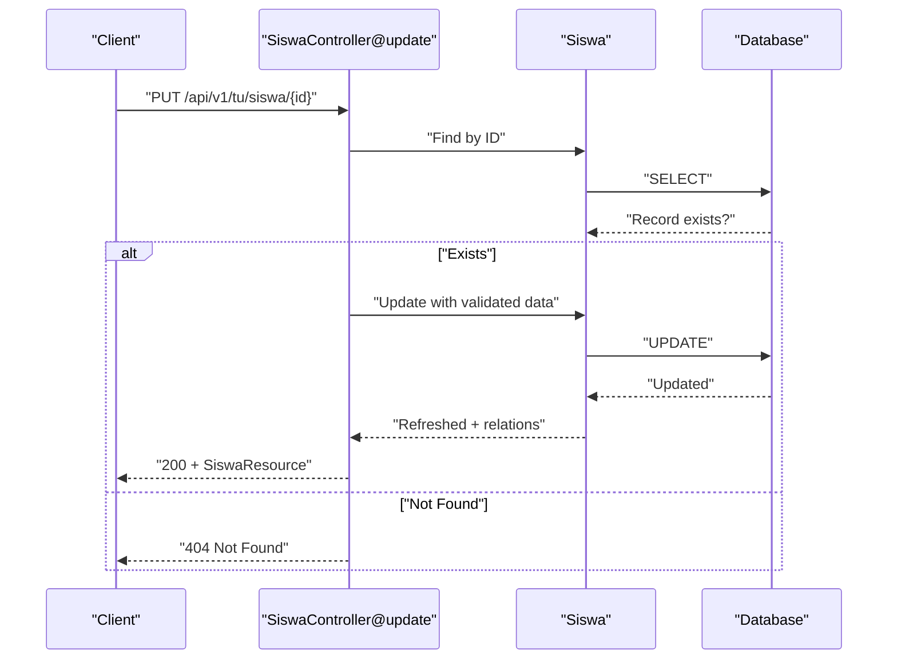
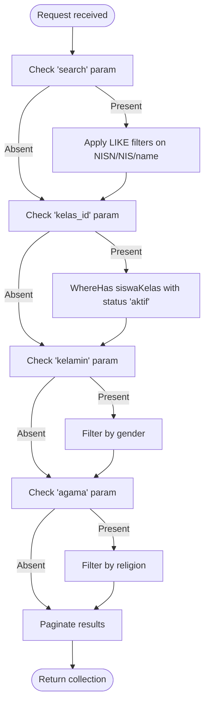
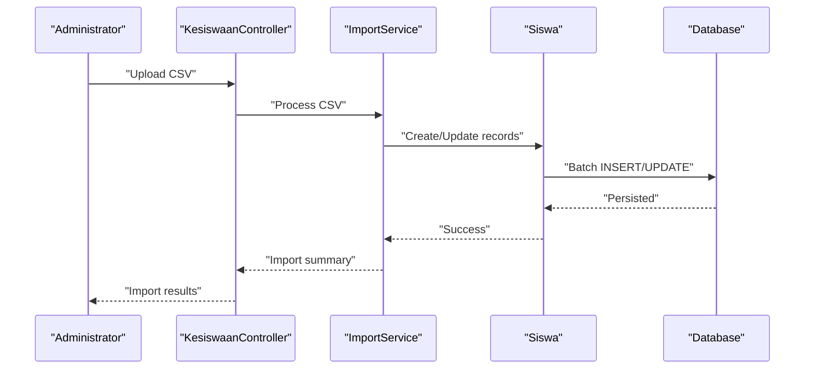
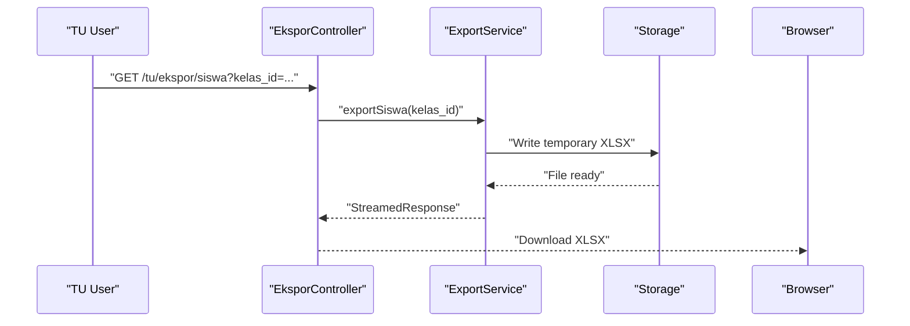
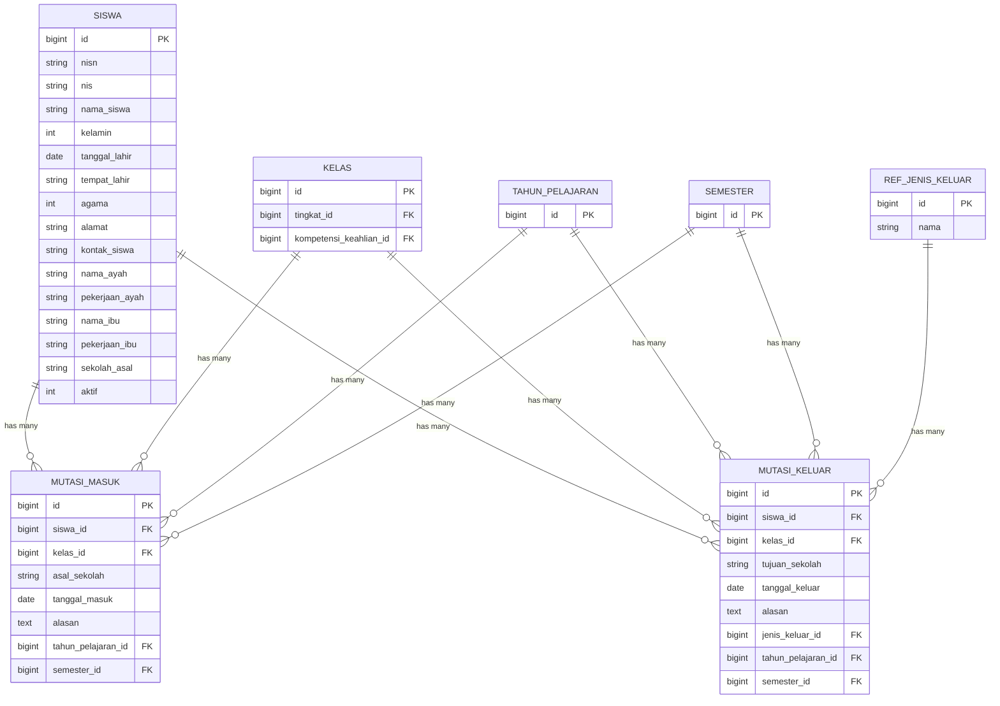
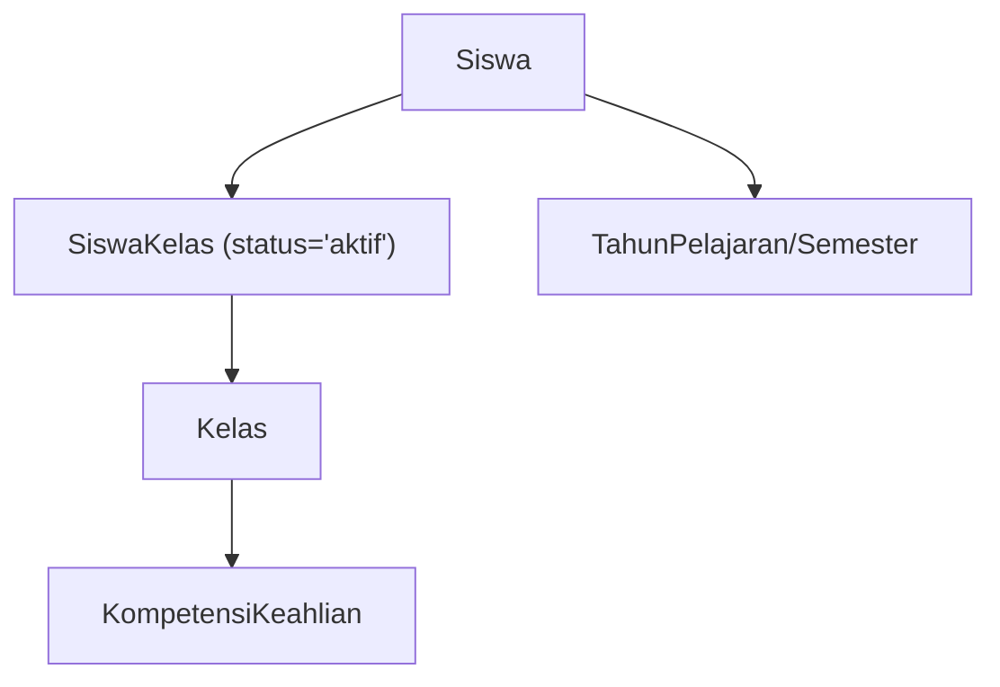
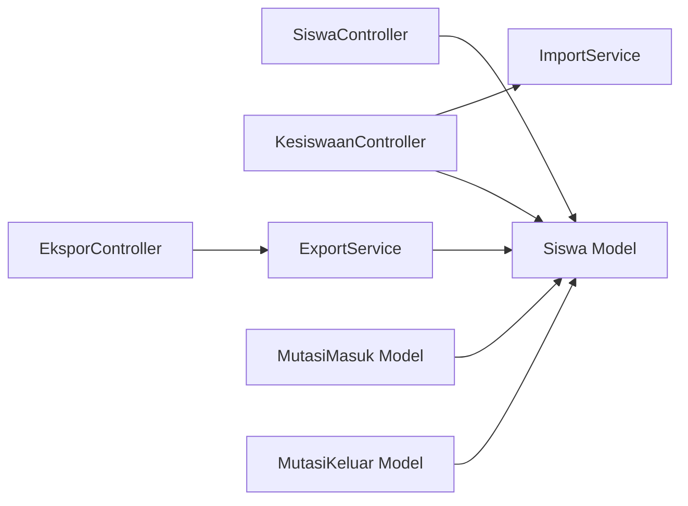

# Student Registration & Management

<cite>
**Referenced Files in This Document**
- [SiswaController.php](file://app/Http/Controllers/Api/V1/Tu/SiswaController.php)
- [KesiswaanController.php](file://app/Http/Controllers/TU/KesiswaanController.php)
- [EksporController.php](file://app/Http/Controllers/TU/EksporController.php)
- [ImportService.php](file://app/Services/ImportService.php)
- [ExportService.php](file://app/Services/ExportService.php)
- [Siswa.php](file://app/Models/Siswa.php)
- [MutasiMasuk.php](file://app/Models/MutasiMasuk.php)
- [MutasiKeluar.php](file://app/Models/MutasiKeluar.php)
- [2026_06_01_010821_create_mutasi_masuk_table.php](file://database/migrations/2026_06_01_010821_create_mutasi_masuk_table.php)
- [2026_06_01_010821_create_mutasi_keluar_table.php](file://database/migrations/2026_06_01_010821_create_mutasi_keluar_table.php)
- [SiswaExportTest.php](file://tests/Feature/Ekspor/SiswaExportTest.php)
- [MutasiMasukTest.php](file://tests/Feature/Tu/Mutasi/MutasiMasukTest.php)
- [MutasiKeluarTest.php](file://tests/Feature/Tu/Mutasi/MutasiKeluarTest.php)
- [03-manajemen-siswa.md](file://docs/manual-tu/03-manajemen-siswa.md)
</cite>

## Table of Contents
1. [Introduction](#introduction)
2. [Project Structure](#project-structure)
3. [Core Components](#core-components)
4. [Architecture Overview](#architecture-overview)
5. [Detailed Component Analysis](#detailed-component-analysis)
6. [Dependency Analysis](#dependency-analysis)
7. [Performance Considerations](#performance-considerations)
8. [Troubleshooting Guide](#troubleshooting-guide)
9. [Conclusion](#conclusion)

## Introduction
This document describes the complete student registration and management functionality within the system. It covers new student registration, transfer procedures (incoming and outgoing), student data maintenance, import/export capabilities for bulk operations, profile management, academic record tracking, classification systems, enrollment status management, and graduation procedures. The content is grounded in the actual implementation present in the repository.

## Project Structure
Student-related functionality spans controllers, services, models, migrations, and tests:
- Controllers handle HTTP requests for CRUD operations, exports, and bulk imports
- Services encapsulate import/export logic and data transformations
- Models define the domain entities and relationships
- Migrations establish the underlying database schema
- Tests validate export behavior and mutation workflows

**Diagram sources**
- [SiswaController.php:13-139](file://app/Http/Controllers/Api/V1/Tu/SiswaController.php#L13-L139)
- [KesiswaanController.php:16-39](file://app/Http/Controllers/TU/KesiswaanController.php#L16-L39)
- [EksporController.php:55-62](file://app/Http/Controllers/TU/EksporController.php#L55-L62)
- [ImportService.php](file://app/Services/ImportService.php)
- [ExportService.php](file://app/Services/ExportService.php)
- [Siswa.php](file://app/Models/Siswa.php)
- [MutasiMasuk.php:10-43](file://app/Models/MutasiMasuk.php#L10-L43)
- [MutasiKeluar.php:10-48](file://app/Models/MutasiKeluar.php#L10-L48)
- [2026_06_01_010821_create_mutasi_masuk_table.php:14-30](file://database/migrations/2026_06_01_010821_create_mutasi_masuk_table.php#L14-L30)
- [2026_06_01_010821_create_mutasi_keluar_table.php:14-32](file://database/migrations/2026_06_01_010821_create_mutasi_keluar_table.php#L14-L32)

**Section sources**
- [SiswaController.php:13-139](file://app/Http/Controllers/Api/V1/Tu/SiswaController.php#L13-L139)
- [KesiswaanController.php:16-39](file://app/Http/Controllers/TU/KesiswaanController.php#L16-L39)
- [EksporController.php:55-62](file://app/Http/Controllers/TU/EksporController.php#L55-L62)
- [ImportService.php](file://app/Services/ImportService.php)
- [ExportService.php](file://app/Services/ExportService.php)
- [Siswa.php](file://app/Models/Siswa.php)
- [MutasiMasuk.php:10-43](file://app/Models/MutasiMasuk.php#L10-L43)
- [MutasiKeluar.php:10-48](file://app/Models/MutasiKeluar.php#L10-L48)
- [2026_06_01_010821_create_mutasi_masuk_table.php:14-30](file://database/migrations/2026_06_01_010821_create_mutasi_masuk_table.php#L14-L30)
- [2026_06_01_010821_create_mutasi_keluar_table.php:14-32](file://database/migrations/2026_06_01_010821_create_mutasi_keluar_table.php#L14-L32)

## Core Components
- Student entity and API endpoints: The API controller supports listing, creating, updating, and soft-deleting students with filtering and pagination.
- Web-based student management: The KesiswaanController provides search and filtering for active students and integrates with import functionality via ImportService.
- Export capability: The EksporController exposes endpoints to export student lists, filtered by class or all students, using ExportService.
- Import/export services: ImportService handles CSV import workflows; ExportService streams Excel files with standardized column sets.
- Transfer records: MutasiMasuk and MutasiKeluar models track incoming and outgoing transfers with foreign key relationships to students, classes, and academic terms.
- Tests validate export behavior and mutation workflows.

**Section sources**
- [SiswaController.php:15-138](file://app/Http/Controllers/Api/V1/Tu/SiswaController.php#L15-L138)
- [KesiswaanController.php:20-39](file://app/Http/Controllers/TU/KesiswaanController.php#L20-L39)
- [EksporController.php:55-62](file://app/Http/Controllers/TU/EksporController.php#L55-L62)
- [ImportService.php](file://app/Services/ImportService.php)
- [ExportService.php:132-172](file://app/Services/ExportService.php#L132-L172)
- [MutasiMasuk.php:10-43](file://app/Models/MutasiMasuk.php#L10-L43)
- [MutasiKeluar.php:10-48](file://app/Models/MutasiKeluar.php#L10-L48)
- [SiswaExportTest.php:29-62](file://tests/Feature/Ekspor/SiswaExportTest.php#L29-L62)
- [MutasiMasukTest.php:43-61](file://tests/Feature/Tu/Mutasi/MutasiMasukTest.php#L43-L61)
- [MutasiKeluarTest.php:45-65](file://tests/Feature/Tu/Mutasi/MutasiKeluarTest.php#L45-L65)

## Architecture Overview
The student lifecycle is supported by a layered architecture:
- Presentation: Controllers expose REST endpoints for API and web interfaces
- Application: Services orchestrate import/export operations
- Domain: Models represent entities and enforce referential integrity
- Infrastructure: Migrations define schema and relationships

**Diagram sources**
- [SiswaController.php:87-96](file://app/Http/Controllers/Api/V1/Tu/SiswaController.php#L87-L96)
- [Siswa.php](file://app/Models/Siswa.php)

**Section sources**
- [SiswaController.php:87-96](file://app/Http/Controllers/Api/V1/Tu/SiswaController.php#L87-L96)
- [Siswa.php](file://app/Models/Siswa.php)

## Detailed Component Analysis

### Student Registration (New Students)
- Endpoint: API endpoint for creating students with validation and response wrapping
- Validation: Uses dedicated request classes to ensure data integrity
- Response: Returns created resource with metadata

**Diagram sources**
- [SiswaController.php:87-96](file://app/Http/Controllers/Api/V1/Tu/SiswaController.php#L87-L96)

**Section sources**
- [SiswaController.php:87-96](file://app/Http/Controllers/Api/V1/Tu/SiswaController.php#L87-L96)

### Student Data Maintenance (Update/Delete)
- Update: Validates incoming data, finds existing student, updates fields, refreshes relations, returns updated resource
- Delete: Soft-deletes and marks as inactive before deletion

**Diagram sources**
- [SiswaController.php:98-118](file://app/Http/Controllers/Api/V1/Tu/SiswaController.php#L98-L118)

**Section sources**
- [SiswaController.php:98-118](file://app/Http/Controllers/Api/V1/Tu/SiswaController.php#L98-L118)

### Student Search and Filtering
- Web interface: KesiswaanController supports search by NISN/NIS/name, class filter, gender, and religion
- API interface: Similar filters are applied in the API controller for listing students

**Diagram sources**
- [KesiswaanController.php:20-39](file://app/Http/Controllers/TU/KesiswaanController.php#L20-L39)
- [SiswaController.php:15-44](file://app/Http/Controllers/Api/V1/Tu/SiswaController.php#L15-L44)

**Section sources**
- [KesiswaanController.php:20-39](file://app/Http/Controllers/TU/KesiswaanController.php#L20-L39)
- [SiswaController.php:15-44](file://app/Http/Controllers/Api/V1/Tu/SiswaController.php#L15-L44)

### Import Functionality (Bulk Student Data)
- Purpose: Enable administrators to import student data in bulk
- Implementation: ImportService orchestrates parsing and persistence
- Usage: Integrated into web-based student management screens

**Diagram sources**
- [KesiswaanController.php](file://app/Http/Controllers/TU/KesiswaanController.php#L18)
- [ImportService.php](file://app/Services/ImportService.php)

**Section sources**
- [KesiswaanController.php](file://app/Http/Controllers/TU/KesiswaanController.php#L18)
- [ImportService.php](file://app/Services/ImportService.php)

### Export Functionality (CSV/XLSX)
- Purpose: Generate downloadable Excel reports of student data
- Filters: Export by class or all students
- Columns: Includes personal info, class/jurusan, birth details, contact, parents' info, origin school, and status

**Diagram sources**
- [EksporController.php:55-62](file://app/Http/Controllers/TU/EksporController.php#L55-L62)
- [ExportService.php:132-172](file://app/Services/ExportService.php#L132-L172)
- [SiswaExportTest.php:29-62](file://tests/Feature/Ekspor/SiswaExportTest.php#L29-L62)

**Section sources**
- [EksporController.php:55-62](file://app/Http/Controllers/TU/EksporController.php#L55-L62)
- [ExportService.php:132-172](file://app/Services/ExportService.php#L132-L172)
- [SiswaExportTest.php:29-62](file://tests/Feature/Ekspor/SiswaExportTest.php#L29-L62)

### Transfer Procedures (Incoming/Outgoing)
- Incoming transfers: Record admission from another school with date and academic term
- Outgoing transfers: Record departure to another school with reason and term
- Both use soft deletes for audit trails

**Diagram sources**
- [MutasiMasuk.php:10-43](file://app/Models/MutasiMasuk.php#L10-L43)
- [MutasiKeluar.php:10-48](file://app/Models/MutasiKeluar.php#L10-L48)
- [2026_06_01_010821_create_mutasi_masuk_table.php:14-30](file://database/migrations/2026_06_01_010821_create_mutasi_masuk_table.php#L14-L30)
- [2026_06_01_010821_create_mutasi_keluar_table.php:14-32](file://database/migrations/2026_06_01_010821_create_mutasi_keluar_table.php#L14-L32)

**Section sources**
- [MutasiMasuk.php:10-43](file://app/Models/MutasiMasuk.php#L10-L43)
- [MutasiKeluar.php:10-48](file://app/Models/MutasiKeluar.php#L10-L48)
- [2026_06_01_010821_create_mutasi_masuk_table.php:14-30](file://database/migrations/2026_06_01_010821_create_mutasi_masuk_table.php#L14-L30)
- [2026_06_01_010821_create_mutasi_keluar_table.php:14-32](file://database/migrations/2026_06_01_010821_create_mutasi_keluar_table.php#L14-L32)
- [MutasiMasukTest.php:43-61](file://tests/Feature/Tu/Mutasi/MutasiMasukTest.php#L43-L61)
- [MutasiKeluarTest.php:45-65](file://tests/Feature/Tu/Mutasi/MutasiKeluarTest.php#L45-L65)

### Student Classification and Enrollment Status
- Active students: Filtered by `aktif = 1` in controllers
- Class membership: Linked via `siswa_kelas` with status `aktif`
- Jurusan (major): Retrieved through `kelas.kompetensiKeahlian.nama`
- Academic term: Transitive relationship via `tahun_pelajaran` and `semester`

**Diagram sources**
- [SiswaController.php:17-18](file://app/Http/Controllers/Api/V1/Tu/SiswaController.php#L17-L18)
- [KesiswaanController.php:22-23](file://app/Http/Controllers/TU/KesiswaanController.php#L22-L23)

**Section sources**
- [SiswaController.php:17-18](file://app/Http/Controllers/Api/V1/Tu/SiswaController.php#L17-L18)
- [KesiswaanController.php:22-23](file://app/Http/Controllers/TU/KesiswaanController.php#L22-L23)

### Graduation Procedures
- The system includes a `lulusan` table in migrations, indicating planned support for graduation tracking
- No explicit graduation API/controller was identified in the current codebase snapshot; however, the presence of the migration suggests future integration points for marking graduates and generating certificates

**Section sources**
- [2026_06_01_010821_create_lulusan_table.php](file://database/migrations/2026_06_01_010821_create_lulusan_table.php)

### Administrative Workflows and Examples
- New student registration: Use the API endpoint to create a student with validated fields; the controller returns a structured JSON resource
- Bulk import: Upload CSV via the web interface integrated with ImportService; administrators can process large datasets efficiently
- Export by class: Generate an Excel report filtered by a specific class; the controller validates inputs and delegates to ExportService
- Transfer recording: Log incoming/outgoing transfers with required metadata; tests confirm validation and soft-delete behavior
- Student profile maintenance: Update personal and family details through the update endpoint; ensure proper validation and response handling

**Section sources**
- [SiswaController.php:87-118](file://app/Http/Controllers/Api/V1/Tu/SiswaController.php#L87-L118)
- [KesiswaanController.php](file://app/Http/Controllers/TU/KesiswaanController.php#L18)
- [EksporController.php:55-62](file://app/Http/Controllers/TU/EksporController.php#L55-L62)
- [MutasiMasukTest.php:43-61](file://tests/Feature/Tu/Mutasi/MutasiMasukTest.php#L43-L61)
- [MutasiKeluarTest.php:45-65](file://tests/Feature/Tu/Mutasi/MutasiKeluarTest.php#L45-L65)
- [03-manajemen-siswa.md:78-80](file://docs/manual-tu/03-manajemen-siswa.md#L78-L80)

## Dependency Analysis
- Controllers depend on models and services for persistence and data transformation
- Services encapsulate cross-cutting concerns like file handling and batch operations
- Models define relationships and constraints enforced by migrations
- Tests validate controller behavior and service outputs

**Diagram sources**
- [SiswaController.php:87-118](file://app/Http/Controllers/Api/V1/Tu/SiswaController.php#L87-L118)
- [KesiswaanController.php](file://app/Http/Controllers/TU/KesiswaanController.php#L18)
- [EksporController.php:55-62](file://app/Http/Controllers/TU/EksporController.php#L55-L62)
- [ExportService.php:132-172](file://app/Services/ExportService.php#L132-L172)
- [MutasiMasuk.php:10-43](file://app/Models/MutasiMasuk.php#L10-L43)
- [MutasiKeluar.php:10-48](file://app/Models/MutasiKeluar.php#L10-L48)

**Section sources**
- [SiswaController.php:87-118](file://app/Http/Controllers/Api/V1/Tu/SiswaController.php#L87-L118)
- [KesiswaanController.php](file://app/Http/Controllers/TU/KesiswaanController.php#L18)
- [EksporController.php:55-62](file://app/Http/Controllers/TU/EksporController.php#L55-L62)
- [ExportService.php:132-172](file://app/Services/ExportService.php#L132-L172)
- [MutasiMasuk.php:10-43](file://app/Models/MutasiMasuk.php#L10-L43)
- [MutasiKeluar.php:10-48](file://app/Models/MutasiKeluar.php#L10-L48)

## Performance Considerations
- Use pagination for listing endpoints to avoid large result sets
- Apply selective eager loading (already present) to minimize N+1 queries
- Batch operations for imports/exports to reduce memory overhead
- Indexes on frequently filtered columns (e.g., NISN/NIS, class membership) improve query performance

## Troubleshooting Guide
- Import errors: Verify CSV format matches expected columns and encoding; check server-side validation messages
- Export failures: Confirm class filters are valid and user roles permit exports; inspect temporary file generation and streaming
- Transfer validation: Ensure required fields (dates, school names, terms) are provided; review soft-delete behavior for audit trails
- API responses: For 404 on update/delete, confirm the student ID exists and is accessible

**Section sources**
- [SiswaController.php:98-118](file://app/Http/Controllers/Api/V1/Tu/SiswaController.php#L98-L118)
- [SiswaExportTest.php:64-69](file://tests/Feature/Ekspor/SiswaExportTest.php#L64-L69)
- [MutasiMasukTest.php:63-68](file://tests/Feature/Tu/Mutasi/MutasiMasukTest.php#L63-L68)
- [MutasiKeluarTest.php:67-72](file://tests/Feature/Tu/Mutasi/MutasiKeluarTest.php#L67-L72)

## Conclusion
The system provides a robust foundation for student registration and management, including new registrations, transfer tracking, data maintenance, and scalable import/export capabilities. The architecture cleanly separates presentation, application, and domain layers, with strong test coverage for key workflows. Future enhancements could include explicit graduation processing aligned with the existing `lulusan` migration.