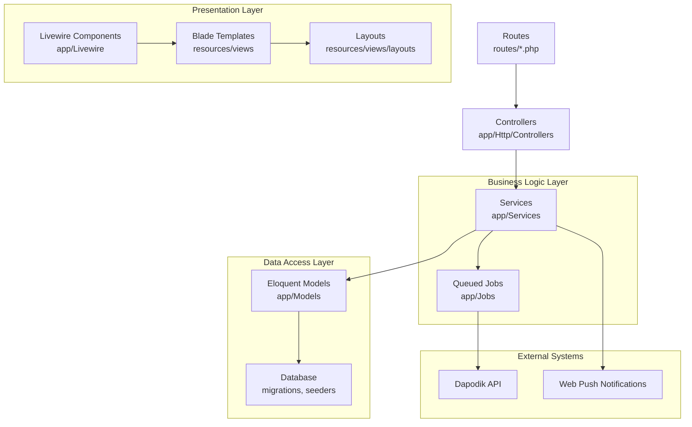
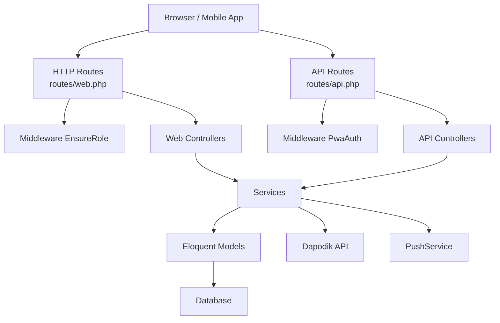
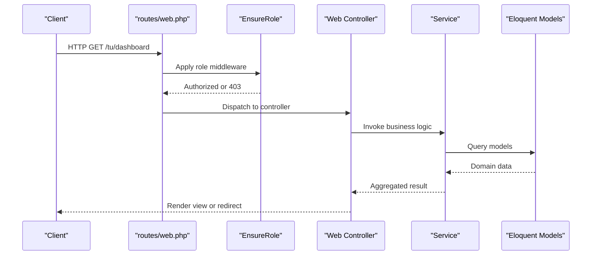
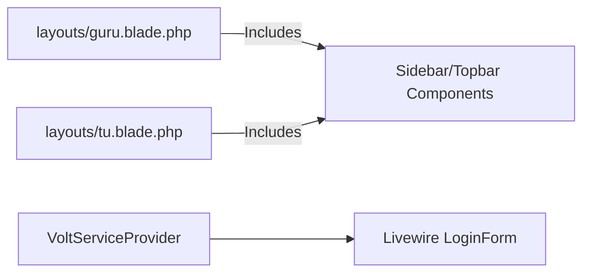
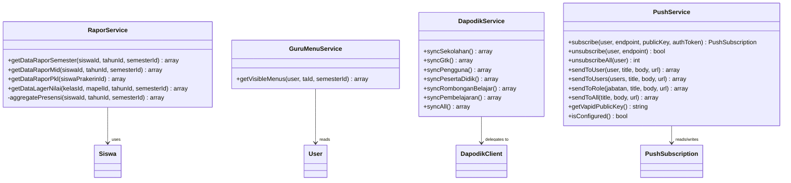
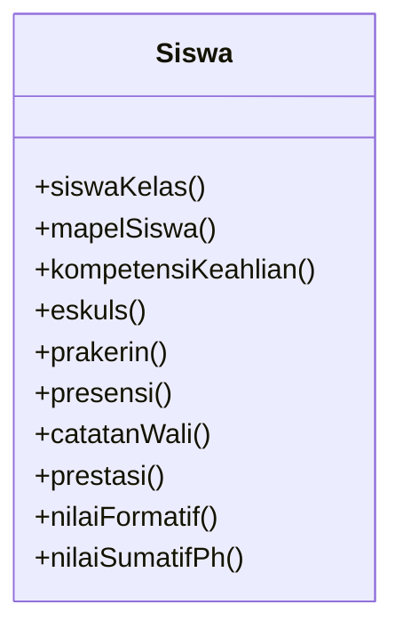
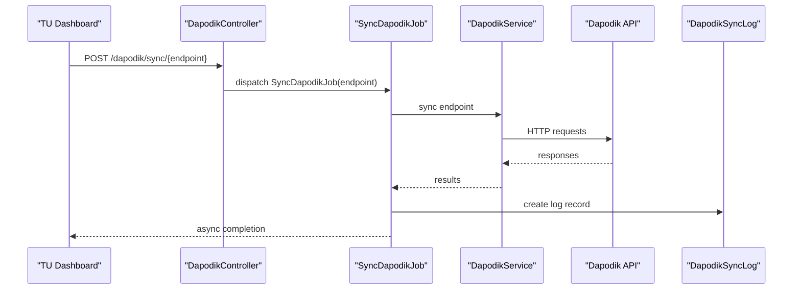
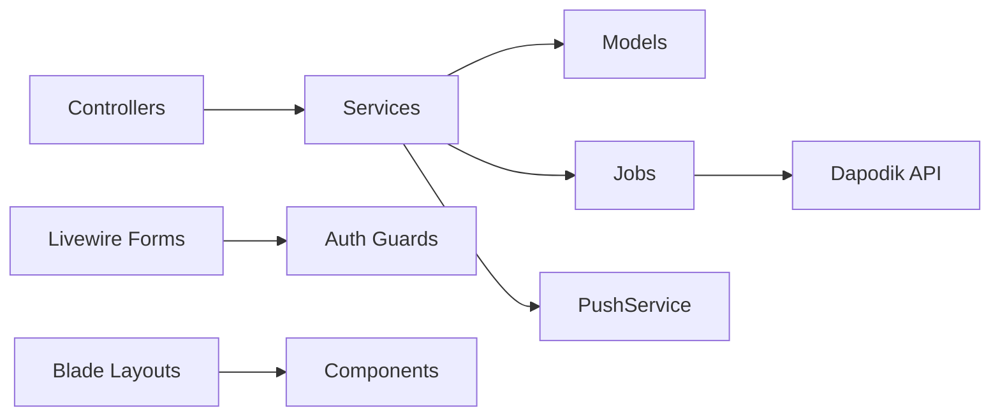

# Architecture Overview

<cite>
**Referenced Files in This Document**
- [bootstrap/app.php](file://bootstrap/app.php)
- [config/app.php](file://config/app.php)
- [config/auth.php](file://config/auth.php)
- [config/push.php](file://config/push.php)
- [routes/web.php](file://routes/web.php)
- [routes/api.php](file://routes/api.php)
- [app/Http/Middleware/EnsureRole.php](file://app/Http/Middleware/EnsureRole.php)
- [app/Http/Middleware/PwaAuth.php](file://app/Http/Middleware/PwaAuth.php)
- [app/Http/Controllers/Controller.php](file://app/Http/Controllers/Controller.php)
- [app/Services/RaporService.php](file://app/Services/RaporService.php)
- [app/Services/DapodikService.php](file://app/Services/DapodikService.php)
- [app/Services/GuruMenuService.php](file://app/Services/GuruMenuService.php)
- [app/Services/PushService.php](file://app/Services/PushService.php)
- [app/Jobs/SyncDapodikJob.php](file://app/Jobs/SyncDapodikJob.php)
- [app/View/Components/AppLayout.php](file://app/View/Components/AppLayout.php)
- [app/Livewire/Forms/LoginForm.php](file://app/Livewire/Forms/LoginForm.php)
- [app/Providers/VoltServiceProvider.php](file://app/Providers/VoltServiceProvider.php)
- [resources/views/layouts/guru.blade.php](file://resources/views/layouts/guru.blade.php)
- [resources/views/layouts/tu.blade.php](file://resources/views/layouts/tu.blade.php)
- [app/Models/Siswa.php](file://app/Models/Siswa.php)
</cite>

## Table of Contents
1. [Introduction](#introduction)
2. [Project Structure](#project-structure)
3. [Core Components](#core-components)
4. [Architecture Overview](#architecture-overview)
5. [Detailed Component Analysis](#detailed-component-analysis)
6. [Dependency Analysis](#dependency-analysis)
7. [Performance Considerations](#performance-considerations)
8. [Troubleshooting Guide](#troubleshooting-guide)
9. [Conclusion](#conclusion)

## Introduction
This document presents the architecture of RaporKM Laravel, a school report management system. It explains the high-level MVC architecture aligned with Laravel conventions, the layered design separating presentation, business logic, data access, and external integrations, and the end-to-end request-response flow. It also documents system boundaries, integration patterns with external systems (Dapodik API, push notifications), cross-cutting concerns (authentication, authorization, logging, caching), and technology stack choices that support scalability and maintainability.

## Project Structure
RaporKM follows Laravel’s conventional structure:
- Presentation Layer: Blade templates and Livewire components for interactive UI
- Business Logic Layer: Services encapsulating domain logic
- Data Access Layer: Eloquent models and database migrations/seeding
- External Integrations: Dapodik synchronization and push notifications
- Routing and Middleware: HTTP routing with role-based access and PWA authentication

**Diagram sources**
- [routes/web.php:1-298](file://routes/web.php#L1-L298)
- [routes/api.php:1-277](file://routes/api.php#L1-L277)
- [app/Http/Controllers/Controller.php:1-9](file://app/Http/Controllers/Controller.php#L1-L9)
- [app/Services/RaporService.php:1-174](file://app/Services/RaporService.php#L1-L174)
- [app/Services/DapodikService.php:1-108](file://app/Services/DapodikService.php#L1-L108)
- [app/Jobs/SyncDapodikJob.php:1-80](file://app/Jobs/SyncDapodikJob.php#L1-L80)
- [app/Models/Siswa.php:1-88](file://app/Models/Siswa.php#L1-L88)

**Section sources**
- [routes/web.php:1-298](file://routes/web.php#L1-L298)
- [routes/api.php:1-277](file://routes/api.php#L1-L277)
- [app/Http/Controllers/Controller.php:1-9](file://app/Http/Controllers/Controller.php#L1-L9)
- [app/View/Components/AppLayout.php:1-18](file://app/View/Components/AppLayout.php#L1-L18)
- [resources/views/layouts/guru.blade.php:1-99](file://resources/views/layouts/guru.blade.php#L1-L99)
- [resources/views/layouts/tu.blade.php:1-116](file://resources/views/layouts/tu.blade.php#L1-L116)

## Core Components
- Controllers: Thin HTTP handlers delegating to services and returning responses or redirects
- Services: Orchestrate business logic, coordinate models, and integrate with external systems
- Models: Eloquent models representing domain entities with relationships
- Middleware: Role enforcement, session timeout, and PWA token validation
- Livewire: Interactive UI components and form handling
- Jobs: Asynchronous Dapodik synchronization with retries and logging

**Section sources**
- [app/Http/Controllers/Controller.php:1-9](file://app/Http/Controllers/Controller.php#L1-L9)
- [app/Services/RaporService.php:1-174](file://app/Services/RaporService.php#L1-L174)
- [app/Services/DapodikService.php:1-108](file://app/Services/DapodikService.php#L1-L108)
- [app/Services/GuruMenuService.php:1-175](file://app/Services/GuruMenuService.php#L1-L175)
- [app/Services/PushService.php:1-131](file://app/Services/PushService.php#L1-L131)
- [app/Jobs/SyncDapodikJob.php:1-80](file://app/Jobs/SyncDapodikJob.php#L1-L80)
- [app/Http/Middleware/EnsureRole.php:1-24](file://app/Http/Middleware/EnsureRole.php#L1-L24)
- [app/Http/Middleware/PwaAuth.php:1-44](file://app/Http/Middleware/PwaAuth.php#L1-L44)
- [app/Livewire/Forms/LoginForm.php:1-62](file://app/Livewire/Forms/LoginForm.php#L1-L62)

## Architecture Overview
RaporKM employs a layered architecture:
- Presentation: Blade templates and Livewire components render views and handle interactivity
- Controllers: Route handlers for web and API, enforcing authentication and roles
- Services: Encapsulate business logic and orchestration
- Data Access: Eloquent models and migrations
- External Integrations: Dapodik API synchronization and Web Push notifications

**Diagram sources**
- [routes/web.php:1-298](file://routes/web.php#L1-L298)
- [routes/api.php:1-277](file://routes/api.php#L1-L277)
- [app/Http/Middleware/EnsureRole.php:1-24](file://app/Http/Middleware/EnsureRole.php#L1-L24)
- [app/Http/Middleware/PwaAuth.php:1-44](file://app/Http/Middleware/PwaAuth.php#L1-L44)
- [app/Services/RaporService.php:1-174](file://app/Services/RaporService.php#L1-L174)
- [app/Services/DapodikService.php:1-108](file://app/Services/DapodikService.php#L1-L108)
- [app/Services/PushService.php:1-131](file://app/Services/PushService.php#L1-L131)
- [app/Models/Siswa.php:1-88](file://app/Models/Siswa.php#L1-L88)

## Detailed Component Analysis

### MVC and Request Flow
- Web requests enter via routes/web.php, pass through middleware (session timeout), and reach controllers. Controllers delegate to services for business logic and return views or redirects.
- API requests enter via routes/api.php, pass through PWA or Sanctum authentication, enforce rate limits, and route to controllers that call services and return JSON responses.
- Role-based access is enforced via the EnsureRole middleware.

**Diagram sources**
- [routes/web.php:64-86](file://routes/web.php#L64-L86)
- [app/Http/Middleware/EnsureRole.php:11-22](file://app/Http/Middleware/EnsureRole.php#L11-L22)
- [app/Http/Controllers/Controller.php:1-9](file://app/Http/Controllers/Controller.php#L1-L9)
- [app/Services/RaporService.php:22-74](file://app/Services/RaporService.php#L22-L74)
- [app/Models/Siswa.php:37-45](file://app/Models/Siswa.php#L37-L45)

**Section sources**
- [routes/web.php:64-86](file://routes/web.php#L64-L86)
- [routes/api.php:65-271](file://routes/api.php#L65-L271)
- [app/Http/Middleware/EnsureRole.php:11-22](file://app/Http/Middleware/EnsureRole.php#L11-L22)
- [app/Http/Middleware/PwaAuth.php:14-42](file://app/Http/Middleware/PwaAuth.php#L14-L42)

### Presentation Layer: Views and Livewire
- Blade templates under resources/views provide page layouts and components. Layouts include shared header, sidebar, and topbar partials for different panels (TU and Guru).
- Livewire forms encapsulate login logic with rate limiting and validation.
- Volt is registered to mount Livewire views.

**Diagram sources**
- [resources/views/layouts/guru.blade.php:1-99](file://resources/views/layouts/guru.blade.php#L1-L99)
- [resources/views/layouts/tu.blade.php:1-116](file://resources/views/layouts/tu.blade.php#L1-L116)
- [app/Livewire/Forms/LoginForm.php:24-37](file://app/Livewire/Forms/LoginForm.php#L24-L37)
- [app/Providers/VoltServiceProvider.php:23-26](file://app/Providers/VoltServiceProvider.php#L23-L26)

**Section sources**
- [resources/views/layouts/guru.blade.php:1-99](file://resources/views/layouts/guru.blade.php#L1-L99)
- [resources/views/layouts/tu.blade.php:1-116](file://resources/views/layouts/tu.blade.php#L1-L116)
- [app/Livewire/Forms/LoginForm.php:1-62](file://app/Livewire/Forms/LoginForm.php#L1-L62)
- [app/Providers/VoltServiceProvider.php:1-29](file://app/Providers/VoltServiceProvider.php#L1-L29)

### Business Logic Layer: Services
- RaporService aggregates student report data by querying related models and computing derived metrics (e.g., presence counts).
- GuruMenuService computes visible menus per user based on roles, class assignments, and overrides.
- DapodikService orchestrates synchronization across multiple domains (school, staff, users, students, classes, subjects).
- PushService manages Web Push subscriptions and sends notifications to users or roles.

**Diagram sources**
- [app/Services/RaporService.php:17-174](file://app/Services/RaporService.php#L17-L174)
- [app/Services/GuruMenuService.php:10-175](file://app/Services/GuruMenuService.php#L10-L175)
- [app/Services/DapodikService.php:20-108](file://app/Services/DapodikService.php#L20-L108)
- [app/Services/PushService.php:10-131](file://app/Services/PushService.php#L10-L131)
- [app/Models/Siswa.php:21-88](file://app/Models/Siswa.php#L21-L88)

**Section sources**
- [app/Services/RaporService.php:17-174](file://app/Services/RaporService.php#L17-L174)
- [app/Services/GuruMenuService.php:10-175](file://app/Services/GuruMenuService.php#L10-L175)
- [app/Services/DapodikService.php:20-108](file://app/Services/DapodikService.php#L20-L108)
- [app/Services/PushService.php:10-131](file://app/Services/PushService.php#L10-L131)

### Data Access Layer: Eloquent Models
- Models define relationships and casts. For example, Siswa has many related records (classes, subjects, absences, achievements, etc.) and belongs to a competence area.
- Services query models to build report datasets and compute aggregations.

**Diagram sources**
- [app/Models/Siswa.php:37-87](file://app/Models/Siswa.php#L37-L87)

**Section sources**
- [app/Models/Siswa.php:1-88](file://app/Models/Siswa.php#L1-L88)
- [app/Services/RaporService.php:22-74](file://app/Services/RaporService.php#L22-L74)

### External Integrations
- Dapodik API: Synchronization jobs are queued and executed asynchronously with retries and logging.
- Push Notifications: Web Push via VAPID keys configured in environment settings.

**Diagram sources**
- [routes/web.php:236-242](file://routes/web.php#L236-L242)
- [app/Jobs/SyncDapodikJob.php:26-63](file://app/Jobs/SyncDapodikJob.php#L26-L63)
- [app/Services/DapodikService.php:47-106](file://app/Services/DapodikService.php#L47-L106)

**Section sources**
- [routes/web.php:236-242](file://routes/web.php#L236-L242)
- [app/Jobs/SyncDapodikJob.php:14-80](file://app/Jobs/SyncDapodikJob.php#L14-L80)
- [app/Services/DapodikService.php:13-108](file://app/Services/DapodikService.php#L13-L108)
- [config/push.php:1-10](file://config/push.php#L1-L10)

### Cross-Cutting Concerns
- Authentication and Authorization:
  - Session-based authentication for web routes
  - Sanctum for API authentication
  - Role middleware restricts access by user jabatan
- Logging and Monitoring:
  - Exception rendering tailored for API vs web
  - Dapodik sync logs track success/failure and progress
- Caching and Sessions:
  - Laravel cache/session drivers configured in environment
- Push Notifications:
  - VAPID configuration supports Web Push delivery

**Section sources**
- [config/auth.php:40-79](file://config/auth.php#L40-L79)
- [app/Http/Middleware/EnsureRole.php:11-22](file://app/Http/Middleware/EnsureRole.php#L11-L22)
- [bootstrap/app.php:29-32](file://bootstrap/app.php#L29-L32)
- [app/Jobs/SyncDapodikJob.php:41-59](file://app/Jobs/SyncDapodikJob.php#L41-L59)
- [config/push.php:4-8](file://config/push.php#L4-L8)

## Dependency Analysis
RaporKM exhibits clean separation of concerns:
- Controllers depend on Services
- Services depend on Models and external clients/jobs
- Middleware depends on configuration and guards
- Views depend on layouts and components

**Diagram sources**
- [routes/web.php:1-298](file://routes/web.php#L1-L298)
- [routes/api.php:1-277](file://routes/api.php#L1-L277)
- [app/Services/RaporService.php:17-174](file://app/Services/RaporService.php#L17-L174)
- [app/Services/DapodikService.php:20-108](file://app/Services/DapodikService.php#L20-L108)
- [app/Jobs/SyncDapodikJob.php:26-63](file://app/Jobs/SyncDapodikJob.php#L26-L63)
- [app/Services/PushService.php:10-131](file://app/Services/PushService.php#L10-L131)
- [app/Livewire/Forms/LoginForm.php:24-37](file://app/Livewire/Forms/LoginForm.php#L24-L37)
- [resources/views/layouts/guru.blade.php:27-39](file://resources/views/layouts/guru.blade.php#L27-L39)
- [resources/views/layouts/tu.blade.php:63-76](file://resources/views/layouts/tu.blade.php#L63-L76)

**Section sources**
- [routes/web.php:1-298](file://routes/web.php#L1-L298)
- [routes/api.php:1-277](file://routes/api.php#L1-L277)
- [bootstrap/app.php:18-28](file://bootstrap/app.php#L18-L28)
- [config/auth.php:40-79](file://config/auth.php#L40-L79)

## Performance Considerations
- Asynchronous processing: Dapodik synchronization runs via queued jobs to avoid blocking requests and improve responsiveness.
- Efficient queries: Services use eager loading and joins to minimize N+1 queries when building report datasets.
- Rate limiting: API routes apply rate limits to protect backend resources.
- Middleware ordering: Session timeout middleware ensures idle sessions are cleared, reducing stale state.

[No sources needed since this section provides general guidance]

## Troubleshooting Guide
- Authentication failures:
  - Verify session-based login and rate limiting in Livewire LoginForm
  - Confirm Sanctum guard configuration and PWA token middleware
- Role access denied:
  - Ensure user jabatan matches expected values and middleware alias is registered
- API errors:
  - Check JSON rendering for API requests and throttle middleware
- Push notifications:
  - Validate VAPID keys and subscription lifecycle
- Dapodik sync issues:
  - Inspect job logs and batch progress; confirm endpoint selection and client credentials

**Section sources**
- [app/Livewire/Forms/LoginForm.php:39-55](file://app/Livewire/Forms/LoginForm.php#L39-L55)
- [config/auth.php:40-79](file://config/auth.php#L40-L79)
- [app/Http/Middleware/PwaAuth.php:14-42](file://app/Http/Middleware/PwaAuth.php#L14-L42)
- [bootstrap/app.php:29-32](file://bootstrap/app.php#L29-L32)
- [config/push.php:4-8](file://config/push.php#L4-L8)
- [app/Jobs/SyncDapodikJob.php:41-62](file://app/Jobs/SyncDapodikJob.php#L41-L62)

## Conclusion
RaporKM leverages Laravel’s MVC architecture with clear separation across presentation, business logic, data access, and external integrations. Role-based middleware, asynchronous jobs, and structured services enable scalable and maintainable development. The documented request-response flows, component interactions, and cross-cutting concerns provide a blueprint for extending functionality while preserving system coherence.