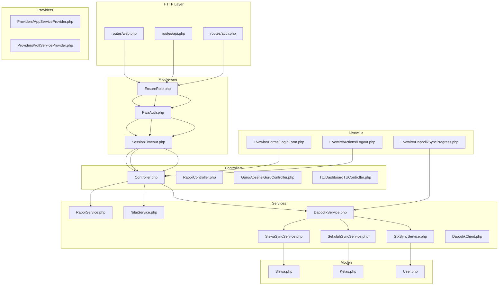
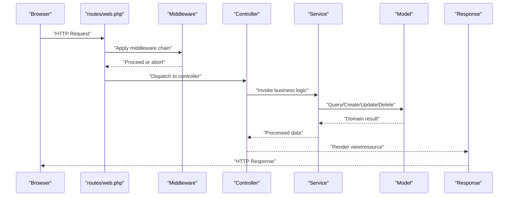
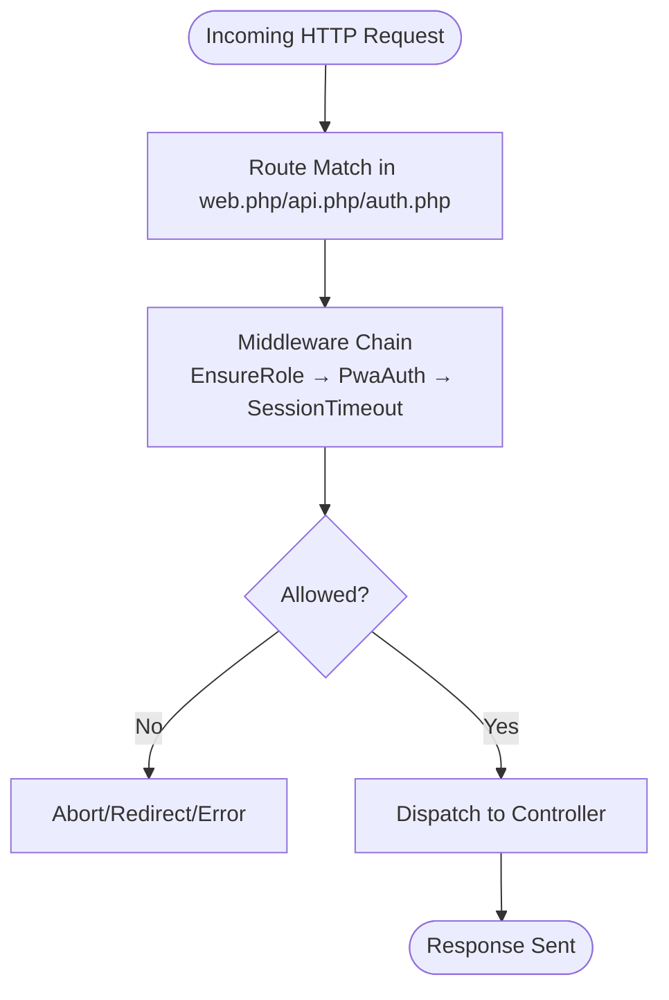
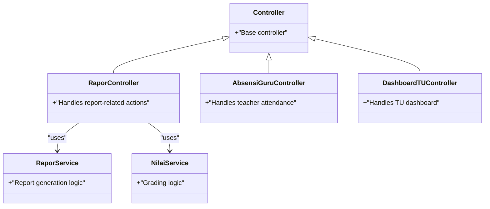
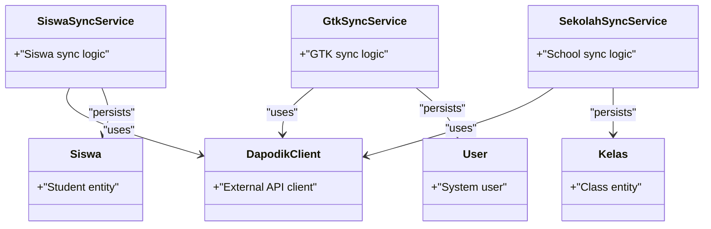
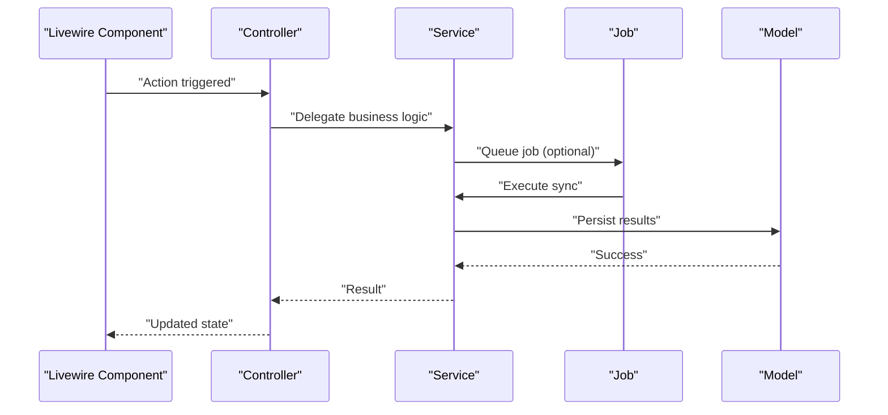
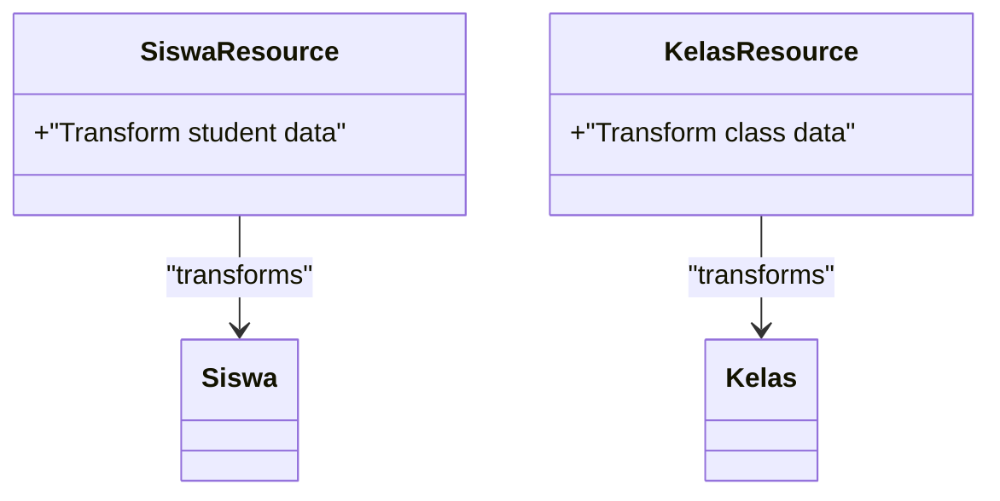
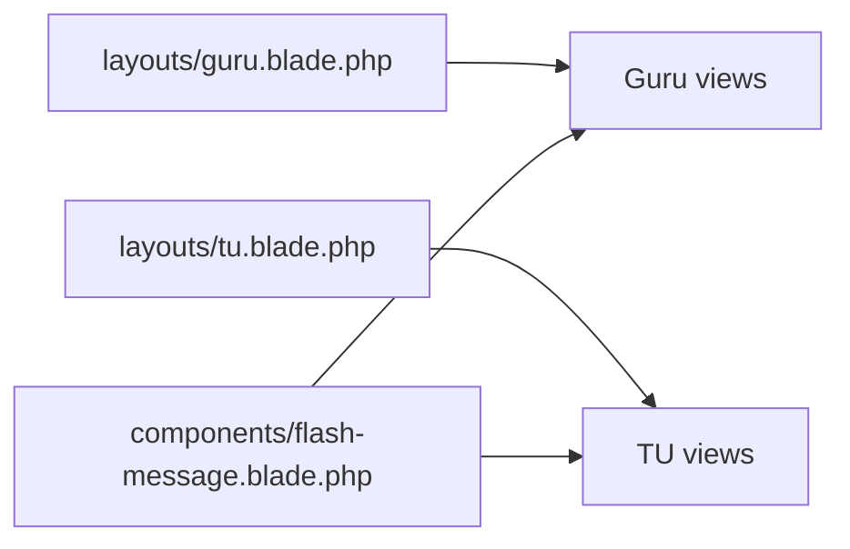
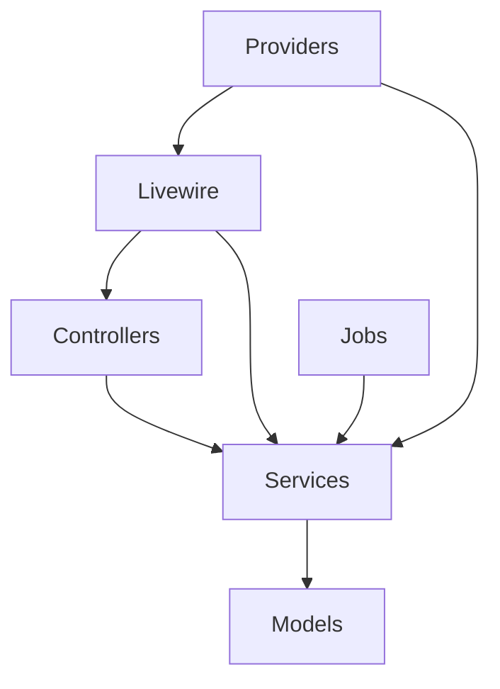

# Component Interactions

<cite>
**Referenced Files in This Document**
- [routes/web.php](file://routes/web.php)
- [routes/api.php](file://routes/api.php)
- [routes/auth.php](file://routes/auth.php)
- [app/Http/Middleware/EnsureRole.php](file://app/Http/Middleware/EnsureRole.php)
- [app/Http/Middleware/PwaAuth.php](file://app/Http/Middleware/PwaAuth.php)
- [app/Http/Middleware/SessionTimeout.php](file://app/Http/Middleware/SessionTimeout.php)
- [app/Http/Controllers/Controller.php](file://app/Http/Controllers/Controller.php)
- [app/Http/Controllers/RaporController.php](file://app/Http/Controllers/RaporController.php)
- [app/Http/Controllers/Guru/AbsensiGuruController.php](file://app/Http/Controllers/Guru/AbsensiGuruController.php)
- [app/Http/Controllers/TU/DashboardTUController.php](file://app/Http/Controllers/TU/DashboardTUController.php)
- [app/Services/RaporService.php](file://app/Services/RaporService.php)
- [app/Services/NilaiService.php](file://app/Services/NilaiService.php)
- [app/Services/Dapodik/DapodikClient.php](file://app/Services/Dapodik/DapodikClient.php)
- [app/Services/Dapodik/SiswaSyncService.php](file://app/Services/Dapodik/SiswaSyncService.php)
- [app/Services/Dapodik/GtkSyncService.php](file://app/Services/Dapodik/GtkSyncService.php)
- [app/Services/Dapodik/SekolahSyncService.php](file://app/Services/Dapodik/SekolahSyncService.php)
- [app/Models/Siswa.php](file://app/Models/Siswa.php)
- [app/Models/Kelas.php](file://app/Models/Kelas.php)
- [app/Models/User.php](file://app/Models/User.php)
- [app/Providers/AppServiceProvider.php](file://app/Providers/AppServiceProvider.php)
- [app/Providers/VoltServiceProvider.php](file://app/Providers/VoltServiceProvider.php)
- [app/Livewire/Forms/LoginForm.php](file://app/Livewire/Forms/LoginForm.php)
- [app/Livewire/Actions/Logout.php](file://app/Livewire/Actions/Logout.php)
- [app/Livewire/DapodikSyncProgress.php](file://app/Livewire/DapodikSyncProgress.php)
- [app/Http/Resources/V1/SiswaResource.php](file://app/Http/Resources/V1/SiswaResource.php)
- [app/Http/Resources/V1/KelasResource.php](file://app/Http/Resources/V1/KelasResource.php)
- [app/Jobs/SyncDapodikJob.php](file://app/Jobs/SyncDapodikJob.php)
- [app/Jobs/ProcessPwaSyncJob.php](file://app/Jobs/ProcessPwaSyncJob.php)
- [bootstrap/app.php](file://bootstrap/app.php)
- [bootstrap/providers.php](file://bootstrap/providers.php)
- [config/app.php](file://config/app.php)
- [resources/views/layouts/guru.blade.php](file://resources/views/layouts/guru.blade.php)
- [resources/views/layouts/tu.blade.php](file://resources/views/layouts/tu.blade.php)
- [resources/views/components/flash-message.blade.php](file://resources/views/components/flash-message.blade.php)
</cite>

## Table of Contents
1. [Introduction](#introduction)
2. [Project Structure](#project-structure)
3. [Core Components](#core-components)
4. [Architecture Overview](#architecture-overview)
5. [Detailed Component Analysis](#detailed-component-analysis)
6. [Dependency Analysis](#dependency-analysis)
7. [Performance Considerations](#performance-considerations)
8. [Troubleshooting Guide](#troubleshooting-guide)
9. [Conclusion](#conclusion)

## Introduction
This document explains how RaporKM Laravel processes requests from HTTP entrypoints through routing, middleware, controllers, services, and models. It also documents how Livewire components integrate with the traditional MVC flow, the role of service providers and dependency injection, and how events and jobs participate in the system. Typical request-processing scenarios illustrate component collaboration patterns across the stack.

## Project Structure
RaporKM follows Laravel conventions:
- Routes define HTTP entrypoints for web, API, and authentication.
- Middleware enforce roles, PWA authentication, and session timeouts.
- Controllers handle request orchestration and delegate business logic to services.
- Services encapsulate domain-specific operations and coordinate with models.
- Models represent data and persistence.
- Livewire components provide reactive UI updates integrated with Blade templates.
- Providers register bindings and configure framework services.
- Jobs process asynchronous tasks like Dapodik synchronization.

**Diagram sources**
- [routes/web.php](file://routes/web.php)
- [routes/api.php](file://routes/api.php)
- [routes/auth.php](file://routes/auth.php)
- [app/Http/Middleware/EnsureRole.php](file://app/Http/Middleware/EnsureRole.php)
- [app/Http/Middleware/PwaAuth.php](file://app/Http/Middleware/PwaAuth.php)
- [app/Http/Middleware/SessionTimeout.php](file://app/Http/Middleware/SessionTimeout.php)
- [app/Http/Controllers/Controller.php](file://app/Http/Controllers/Controller.php)
- [app/Http/Controllers/RaporController.php](file://app/Http/Controllers/RaporController.php)
- [app/Http/Controllers/Guru/AbsensiGuruController.php](file://app/Http/Controllers/Guru/AbsensiGuruController.php)
- [app/Http/Controllers/TU/DashboardTUController.php](file://app/Http/Controllers/TU/DashboardTUController.php)
- [app/Services/RaporService.php](file://app/Services/RaporService.php)
- [app/Services/NilaiService.php](file://app/Services/NilaiService.php)
- [app/Services/Dapodik/DapodikClient.php](file://app/Services/Dapodik/DapodikClient.php)
- [app/Services/Dapodik/SiswaSyncService.php](file://app/Services/Dapodik/SiswaSyncService.php)
- [app/Services/Dapodik/GtkSyncService.php](file://app/Services/Dapodik/GtkSyncService.php)
- [app/Services/Dapodik/SekolahSyncService.php](file://app/Services/Dapodik/SekolahSyncService.php)
- [app/Models/Siswa.php](file://app/Models/Siswa.php)
- [app/Models/Kelas.php](file://app/Models/Kelas.php)
- [app/Models/User.php](file://app/Models/User.php)
- [app/Providers/AppServiceProvider.php](file://app/Providers/AppServiceProvider.php)
- [app/Providers/VoltServiceProvider.php](file://app/Providers/VoltServiceProvider.php)
- [app/Livewire/Forms/LoginForm.php](file://app/Livewire/Forms/LoginForm.php)
- [app/Livewire/Actions/Logout.php](file://app/Livewire/Actions/Logout.php)
- [app/Livewire/DapodikSyncProgress.php](file://app/Livewire/DapodikSyncProgress.php)

**Section sources**
- [routes/web.php](file://routes/web.php)
- [routes/api.php](file://routes/api.php)
- [routes/auth.php](file://routes/auth.php)
- [bootstrap/app.php](file://bootstrap/app.php)
- [bootstrap/providers.php](file://bootstrap/providers.php)
- [config/app.php](file://config/app.php)

## Core Components
- Routing: Web routes, API routes, and auth routes define entrypoints and attach middleware.
- Middleware: Role enforcement, PWA authentication, and session timeout controls access and lifecycle.
- Controllers: Base controller and feature-specific controllers orchestrate requests and responses.
- Services: Business logic containers for reporting, grading, Dapodik sync, and other domain operations.
- Models: Eloquent models representing entities like students, classes, and users.
- Livewire: Reactive components for login, logout, and Dapodik sync progress.
- Providers: Register container bindings and framework integrations.
- Jobs: Asynchronous tasks for Dapodik synchronization.

**Section sources**
- [app/Http/Controllers/Controller.php](file://app/Http/Controllers/Controller.php)
- [app/Services/RaporService.php](file://app/Services/RaporService.php)
- [app/Services/NilaiService.php](file://app/Services/NilaiService.php)
- [app/Services/Dapodik/DapodikClient.php](file://app/Services/Dapodik/DapodikClient.php)
- [app/Services/Dapodik/SiswaSyncService.php](file://app/Services/Dapodik/SiswaSyncService.php)
- [app/Services/Dapodik/GtkSyncService.php](file://app/Services/Dapodik/GtkSyncService.php)
- [app/Services/Dapodik/SekolahSyncService.php](file://app/Services/Dapodik/SekolahSyncService.php)
- [app/Models/Siswa.php](file://app/Models/Siswa.php)
- [app/Models/Kelas.php](file://app/Models/Kelas.php)
- [app/Models/User.php](file://app/Models/User.php)
- [app/Providers/AppServiceProvider.php](file://app/Providers/AppServiceProvider.php)
- [app/Providers/VoltServiceProvider.php](file://app/Providers/VoltServiceProvider.php)
- [app/Livewire/Forms/LoginForm.php](file://app/Livewire/Forms/LoginForm.php)
- [app/Livewire/Actions/Logout.php](file://app/Livewire/Actions/Logout.php)
- [app/Livewire/DapodikSyncProgress.php](file://app/Livewire/DapodikSyncProgress.php)

## Architecture Overview
The request lifecycle begins at the router, passes through middleware, reaches a controller, delegates work to services, manipulates models, and returns responses via resources or views. Livewire components integrate seamlessly with Blade layouts and controllers.

**Diagram sources**
- [routes/web.php](file://routes/web.php)
- [app/Http/Middleware/EnsureRole.php](file://app/Http/Middleware/EnsureRole.php)
- [app/Http/Middleware/PwaAuth.php](file://app/Http/Middleware/PwaAuth.php)
- [app/Http/Middleware/SessionTimeout.php](file://app/Http/Middleware/SessionTimeout.php)
- [app/Http/Controllers/Controller.php](file://app/Http/Controllers/Controller.php)
- [app/Services/RaporService.php](file://app/Services/RaporService.php)
- [app/Models/Siswa.php](file://app/Models/Siswa.php)

## Detailed Component Analysis

### Routing and Middleware Chain
- Web routes define page handlers and attach middleware stacks for role checks, PWA auth, and session timeout.
- API routes expose endpoints for external clients.
- Auth routes manage authentication flows.

**Diagram sources**
- [routes/web.php](file://routes/web.php)
- [routes/api.php](file://routes/api.php)
- [routes/auth.php](file://routes/auth.php)
- [app/Http/Middleware/EnsureRole.php](file://app/Http/Middleware/EnsureRole.php)
- [app/Http/Middleware/PwaAuth.php](file://app/Http/Middleware/PwaAuth.php)
- [app/Http/Middleware/SessionTimeout.php](file://app/Http/Middleware/SessionTimeout.php)

**Section sources**
- [routes/web.php](file://routes/web.php)
- [routes/api.php](file://routes/api.php)
- [routes/auth.php](file://routes/auth.php)
- [app/Http/Middleware/EnsureRole.php](file://app/Http/Middleware/EnsureRole.php)
- [app/Http/Middleware/PwaAuth.php](file://app/Http/Middleware/PwaAuth.php)
- [app/Http/Middleware/SessionTimeout.php](file://app/Http/Middleware/SessionTimeout.php)

### Controllers and Service Collaboration
- Base controller provides shared behaviors.
- Feature controllers (e.g., report generation, class attendance) depend on services for business logic.
- Services encapsulate domain operations and coordinate with models.

**Diagram sources**
- [app/Http/Controllers/Controller.php](file://app/Http/Controllers/Controller.php)
- [app/Http/Controllers/RaporController.php](file://app/Http/Controllers/RaporController.php)
- [app/Http/Controllers/Guru/AbsensiGuruController.php](file://app/Http/Controllers/Guru/AbsensiGuruController.php)
- [app/Http/Controllers/TU/DashboardTUController.php](file://app/Http/Controllers/TU/DashboardTUController.php)
- [app/Services/RaporService.php](file://app/Services/RaporService.php)
- [app/Services/NilaiService.php](file://app/Services/NilaiService.php)

**Section sources**
- [app/Http/Controllers/Controller.php](file://app/Http/Controllers/Controller.php)
- [app/Http/Controllers/RaporController.php](file://app/Http/Controllers/RaporController.php)
- [app/Http/Controllers/Guru/AbsensiGuruController.php](file://app/Http/Controllers/Guru/AbsensiGuruController.php)
- [app/Http/Controllers/TU/DashboardTUController.php](file://app/Http/Controllers/TU/DashboardTUController.php)
- [app/Services/RaporService.php](file://app/Services/RaporService.php)
- [app/Services/NilaiService.php](file://app/Services/NilaiService.php)

### Services and Models Interaction
- Services depend on models to persist and retrieve data.
- Dapodik services consume a client to synchronize data from external systems.

**Diagram sources**
- [app/Services/Dapodik/DapodikClient.php](file://app/Services/Dapodik/DapodikClient.php)
- [app/Services/Dapodik/SiswaSyncService.php](file://app/Services/Dapodik/SiswaSyncService.php)
- [app/Services/Dapodik/GtkSyncService.php](file://app/Services/Dapodik/GtkSyncService.php)
- [app/Services/Dapodik/SekolahSyncService.php](file://app/Services/Dapodik/SekolahSyncService.php)
- [app/Models/Siswa.php](file://app/Models/Siswa.php)
- [app/Models/Kelas.php](file://app/Models/Kelas.php)
- [app/Models/User.php](file://app/Models/User.php)

**Section sources**
- [app/Services/Dapodik/DapodikClient.php](file://app/Services/Dapodik/DapodikClient.php)
- [app/Services/Dapodik/SiswaSyncService.php](file://app/Services/Dapodik/SiswaSyncService.php)
- [app/Services/Dapodik/GtkSyncService.php](file://app/Services/Dapodik/GtkSyncService.php)
- [app/Services/Dapodik/SekolahSyncService.php](file://app/Services/Dapodik/SekolahSyncService.php)
- [app/Models/Siswa.php](file://app/Models/Siswa.php)
- [app/Models/Kelas.php](file://app/Models/Kelas.php)
- [app/Models/User.php](file://app/Models/User.php)

### Livewire Integration with MVC
- Livewire components render reactive UI parts and can trigger controller actions or background jobs.
- Login form and logout actions demonstrate Livewire-to-controller collaboration.
- Dapodik sync progress integrates with services and jobs.

**Diagram sources**
- [app/Livewire/Forms/LoginForm.php](file://app/Livewire/Forms/LoginForm.php)
- [app/Livewire/Actions/Logout.php](file://app/Livewire/Actions/Logout.php)
- [app/Livewire/DapodikSyncProgress.php](file://app/Livewire/DapodikSyncProgress.php)
- [app/Http/Controllers/Controller.php](file://app/Http/Controllers/Controller.php)
- [app/Services/Dapodik/SiswaSyncService.php](file://app/Services/Dapodik/SiswaSyncService.php)
- [app/Jobs/SyncDapodikJob.php](file://app/Jobs/SyncDapodikJob.php)
- [app/Models/Siswa.php](file://app/Models/Siswa.php)

**Section sources**
- [app/Livewire/Forms/LoginForm.php](file://app/Livewire/Forms/LoginForm.php)
- [app/Livewire/Actions/Logout.php](file://app/Livewire/Actions/Logout.php)
- [app/Livewire/DapodikSyncProgress.php](file://app/Livewire/DapodikSyncProgress.php)
- [app/Http/Controllers/Controller.php](file://app/Http/Controllers/Controller.php)
- [app/Services/Dapodik/SiswaSyncService.php](file://app/Services/Dapodik/SiswaSyncService.php)
- [app/Jobs/SyncDapodikJob.php](file://app/Jobs/SyncDapodikJob.php)
- [app/Models/Siswa.php](file://app/Models/Siswa.php)

### Resource Transformation
- API responses use resource classes to normalize data for clients.

**Diagram sources**
- [app/Http/Resources/V1/SiswaResource.php](file://app/Http/Resources/V1/SiswaResource.php)
- [app/Http/Resources/V1/KelasResource.php](file://app/Http/Resources/V1/KelasResource.php)
- [app/Models/Siswa.php](file://app/Models/Siswa.php)
- [app/Models/Kelas.php](file://app/Models/Kelas.php)

**Section sources**
- [app/Http/Resources/V1/SiswaResource.php](file://app/Http/Resources/V1/SiswaResource.php)
- [app/Http/Resources/V1/KelasResource.php](file://app/Http/Resources/V1/KelasResource.php)
- [app/Models/Siswa.php](file://app/Models/Siswa.php)
- [app/Models/Kelas.php](file://app/Models/Kelas.php)

### Layouts and Views
- Blade layouts provide role-specific scaffolding for views.
- Flash messages and other components enhance UX.

**Diagram sources**
- [resources/views/layouts/guru.blade.php](file://resources/views/layouts/guru.blade.php)
- [resources/views/layouts/tu.blade.php](file://resources/views/layouts/tu.blade.php)
- [resources/views/components/flash-message.blade.php](file://resources/views/components/flash-message.blade.php)

**Section sources**
- [resources/views/layouts/guru.blade.php](file://resources/views/layouts/guru.blade.php)
- [resources/views/layouts/tu.blade.php](file://resources/views/layouts/tu.blade.php)
- [resources/views/components/flash-message.blade.php](file://resources/views/components/flash-message.blade.php)

## Dependency Analysis
- Controllers depend on services for business logic.
- Services depend on models for persistence.
- Livewire components depend on controllers and services for state updates.
- Providers bind abstractions to implementations and register framework features.
- Jobs offload long-running tasks to services and models.

**Diagram sources**
- [app/Http/Controllers/Controller.php](file://app/Http/Controllers/Controller.php)
- [app/Services/RaporService.php](file://app/Services/RaporService.php)
- [app/Models/Siswa.php](file://app/Models/Siswa.php)
- [app/Livewire/Forms/LoginForm.php](file://app/Livewire/Forms/LoginForm.php)
- [app/Jobs/SyncDapodikJob.php](file://app/Jobs/SyncDapodikJob.php)
- [app/Providers/AppServiceProvider.php](file://app/Providers/AppServiceProvider.php)

**Section sources**
- [app/Http/Controllers/Controller.php](file://app/Http/Controllers/Controller.php)
- [app/Services/RaporService.php](file://app/Services/RaporService.php)
- [app/Models/Siswa.php](file://app/Models/Siswa.php)
- [app/Livewire/Forms/LoginForm.php](file://app/Livewire/Forms/LoginForm.php)
- [app/Jobs/SyncDapodikJob.php](file://app/Jobs/SyncDapodikJob.php)
- [app/Providers/AppServiceProvider.php](file://app/Providers/AppServiceProvider.php)

## Performance Considerations
- Use service-layer caching for frequently accessed reports and grading computations.
- Batch model writes during Dapodik sync to reduce database overhead.
- Offload heavy operations to queued jobs to keep request latency low.
- Minimize N+1 queries by eager-loading relationships in services.
- Leverage database indexing for common filter/sort keys in models.

## Troubleshooting Guide
- Authentication failures: Verify PWA auth middleware and session timeout middleware are configured correctly.
- Authorization errors: Confirm role middleware aligns with user roles and permissions.
- Report generation delays: Check service-level caching and job queues.
- Livewire state issues: Ensure components dispatch actions to controllers/services and refresh state appropriately.
- Dapodik sync errors: Inspect job logs and client credentials.

**Section sources**
- [app/Http/Middleware/PwaAuth.php](file://app/Http/Middleware/PwaAuth.php)
- [app/Http/Middleware/SessionTimeout.php](file://app/Http/Middleware/SessionTimeout.php)
- [app/Jobs/SyncDapodikJob.php](file://app/Jobs/SyncDapodikJob.php)
- [app/Services/Dapodik/DapodikClient.php](file://app/Services/Dapodik/DapodikClient.php)

## Conclusion
RaporKM’s architecture cleanly separates concerns: routers define entrypoints, middleware enforces policies, controllers orchestrate, services encapsulate business logic, models manage persistence, Livewire enhances interactivity, providers bind dependencies, and jobs handle async work. Understanding these interactions enables predictable development and reliable operation across the system.