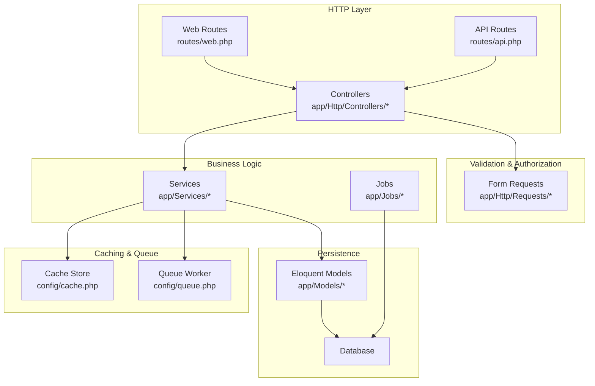
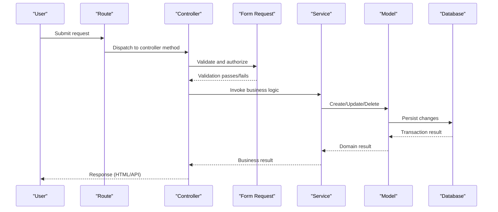
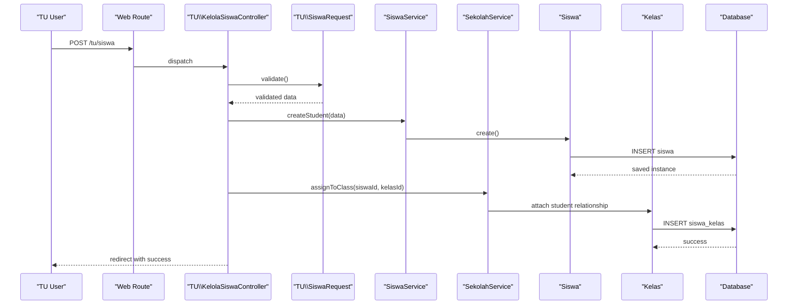
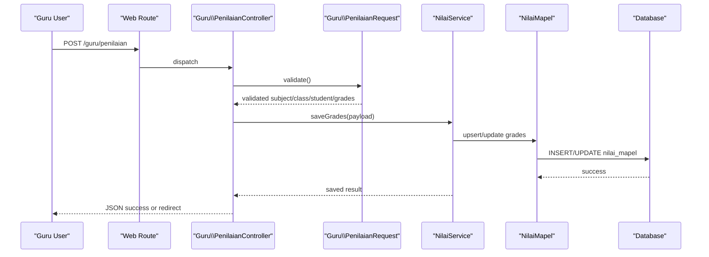
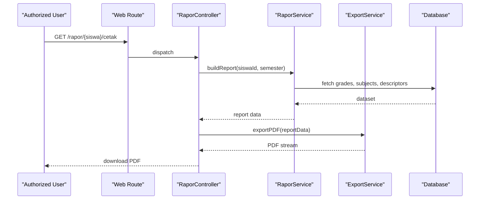
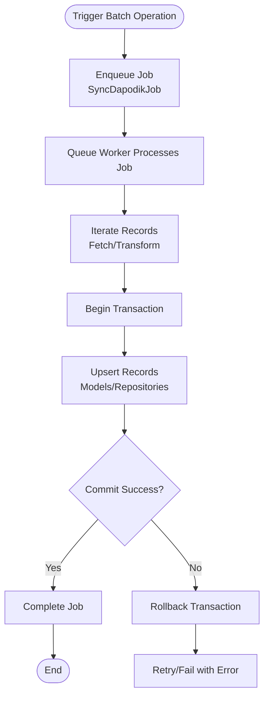
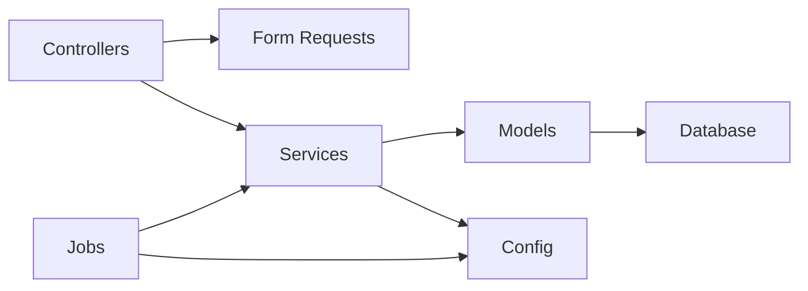

# Data Flow Architecture

<cite>
**Referenced Files in This Document**
- [routes/web.php](file://routes/web.php)
- [routes/api.php](file://routes/api.php)
- [app/Http/Controllers/Controller.php](file://app/Http/Controllers/Controller.php)
- [app/Http/Controllers/Guru/AbsensiGuruController.php](file://app/Http/Controllers/Guru/AbsensiGuruController.php)
- [app/Http/Controllers/TU/KelolaSiswaController.php](file://app/Http/Controllers/TU/KelolaSiswaController.php)
- [app/Http/Controllers/RaporController.php](file://app/Http/Controllers/RaporController.php)
- [app/Http/Requests/Guru/PenilaianRequest.php](file://app/Http/Requests/Guru/PenilaianRequest.php)
- [app/Http/Requests/TU/SiswaRequest.php](file://app/Http/Requests/TU/SiswaRequest.php)
- [app/Services/NilaiService.php](file://app/Services/NilaiService.php)
- [app/Services/RaporService.php](file://app/Services/RaporService.php)
- [app/Services/DapodikService.php](file://app/Services/DapodikService.php)
- [app/Jobs/SyncDapodikJob.php](file://app/Jobs/SyncDapodikJob.php)
- [app/Models/Siswa.php](file://app/Models/Siswa.php)
- [app/Models/NilaiMapel.php](file://app/Models/NilaiMapel.php)
- [app/Models/Kelas.php](file://app/Models/Kelas.php)
- [app/Models/Sekolah.php](file://app/Models/Sekolah.php)
- [config/database.php](file://config/database.php)
- [config/cache.php](file://config/cache.php)
- [config/queue.php](file://config/queue.php)
- [bootstrap/app.php](file://bootstrap/app.php)
</cite>

## Table of Contents
1. [Introduction](#introduction)
2. [Project Structure](#project-structure)
3. [Core Components](#core-components)
4. [Architecture Overview](#architecture-overview)
5. [Detailed Component Analysis](#detailed-component-analysis)
6. [Dependency Analysis](#dependency-analysis)
7. [Performance Considerations](#performance-considerations)
8. [Troubleshooting Guide](#troubleshooting-guide)
9. [Conclusion](#conclusion)

## Introduction
This document describes the data flow architecture of RaporKM Laravel, tracing how user input moves through validation, business logic, persistence, and response generation. It covers CRUD operations, batch processing, and real-time updates, and explains validation layers, caching strategies, transaction management, data consistency, error handling, and rollback mechanisms. Typical operation scenarios include student enrollment, grade entry, and report generation.

## Project Structure
RaporKM follows a layered Laravel architecture:
- Routing: HTTP routes define entry points for web and API traffic.
- Controllers: Handle requests, delegate to services, and return responses/resources.
- Requests: Validation and authorization occur via Form Request classes.
- Services: Encapsulate business logic and orchestrate model interactions.
- Models: Define Eloquent ORM relationships and attributes.
- Jobs: Asynchronous tasks for batch operations (e.g., Dapodik sync).
- Configuration: Database, cache, and queue settings govern runtime behavior.

**Diagram sources**
- [routes/web.php](file://routes/web.php)
- [routes/api.php](file://routes/api.php)
- [app/Http/Controllers/Controller.php](file://app/Http/Controllers/Controller.php)
- [app/Http/Requests/Guru/PenilaianRequest.php](file://app/Http/Requests/Guru/PenilaianRequest.php)
- [app/Services/NilaiService.php](file://app/Services/NilaiService.php)
- [app/Models/Siswa.php](file://app/Models/Siswa.php)
- [config/cache.php](file://config/cache.php)
- [config/queue.php](file://config/queue.php)

**Section sources**
- [routes/web.php](file://routes/web.php)
- [routes/api.php](file://routes/api.php)
- [bootstrap/app.php](file://bootstrap/app.php)

## Core Components
- Routing: Defines endpoints for web and API controllers.
- Controllers: Base controller and role-specific controllers (Guru/TU) handle request lifecycle.
- Form Requests: Centralize validation rules and authorization checks.
- Services: Business logic for grading, reporting, Dapodik synchronization, and exports.
- Models: Represent domain entities and relationships (students, classes, subjects, grades).
- Jobs: Background processing for heavy operations like Dapodik sync.
- Configuration: Database, cache, and queue drivers influence data flow behavior.

**Section sources**
- [routes/web.php](file://routes/web.php)
- [routes/api.php](file://routes/api.php)
- [app/Http/Controllers/Controller.php](file://app/Http/Controllers/Controller.php)
- [app/Services/NilaiService.php](file://app/Services/NilaiService.php)
- [app/Services/RaporService.php](file://app/Services/RaporService.php)
- [app/Services/DapodikService.php](file://app/Services/DapodikService.php)
- [app/Models/Siswa.php](file://app/Models/Siswa.php)

## Architecture Overview
The system enforces a clean separation of concerns:
- Input validation occurs early via Form Requests.
- Controllers coordinate authorization, validation, and service invocation.
- Services encapsulate domain logic and manage transactions.
- Models persist data with Eloquent relationships.
- Caching accelerates reads; queues defer long-running tasks.
- Responses are returned as HTML views or API resources.

**Diagram sources**
- [routes/web.php](file://routes/web.php)
- [app/Http/Controllers/Controller.php](file://app/Http/Controllers/Controller.php)
- [app/Http/Requests/Guru/PenilaianRequest.php](file://app/Http/Requests/Guru/PenilaianRequest.php)
- [app/Services/NilaiService.php](file://app/Services/NilaiService.php)
- [app/Models/Siswa.php](file://app/Models/Siswa.php)

## Detailed Component Analysis

### Student Enrollment Workflow
This scenario covers creating a new student record and assigning to a class.

**Diagram sources**
- [routes/web.php](file://routes/web.php)
- [app/Http/Controllers/TU/KelolaSiswaController.php](file://app/Http/Controllers/TU/KelolaSiswaController.php)
- [app/Http/Requests/TU/SiswaRequest.php](file://app/Http/Requests/TU/SiswaRequest.php)
- [app/Services/SekolahService.php](file://app/Services/SekolahService.php)
- [app/Models/Siswa.php](file://app/Models/Siswa.php)
- [app/Models/Kelas.php](file://app/Models/Kelas.php)

**Section sources**
- [app/Http/Controllers/TU/KelolaSiswaController.php](file://app/Http/Controllers/TU/KelolaSiswaController.php)
- [app/Http/Requests/TU/SiswaRequest.php](file://app/Http/Requests/TU/SiswaRequest.php)
- [app/Services/SekolahService.php](file://app/Services/SekolahService.php)
- [app/Models/Siswa.php](file://app/Models/Siswa.php)
- [app/Models/Kelas.php](file://app/Models/Kelas.php)

### Grade Entry Workflow
This scenario handles entering formative and summative grades for students.

**Diagram sources**
- [routes/web.php](file://routes/web.php)
- [app/Http/Controllers/Guru/AbsensiGuruController.php](file://app/Http/Controllers/Guru/AbsensiGuruController.php)
- [app/Http/Requests/Guru/PenilaianRequest.php](file://app/Http/Requests/Guru/PenilaianRequest.php)
- [app/Services/NilaiService.php](file://app/Services/NilaiService.php)
- [app/Models/NilaiMapel.php](file://app/Models/NilaiMapel.php)

**Section sources**
- [app/Http/Controllers/Guru/AbsensiGuruController.php](file://app/Http/Controllers/Guru/AbsensiGuruController.php)
- [app/Http/Requests/Guru/PenilaianRequest.php](file://app/Http/Requests/Guru/PenilaianRequest.php)
- [app/Services/NilaiService.php](file://app/Services/NilaiService.php)
- [app/Models/NilaiMapel.php](file://app/Models/NilaiMapel.php)

### Report Generation Workflow
This scenario generates academic reports for students.

**Diagram sources**
- [routes/web.php](file://routes/web.php)
- [app/Http/Controllers/RaporController.php](file://app/Http/Controllers/RaporController.php)
- [app/Services/RaporService.php](file://app/Services/RaporService.php)
- [app/Services/ExportService.php](file://app/Services/ExportService.php)

**Section sources**
- [app/Http/Controllers/RaporController.php](file://app/Http/Controllers/RaporController.php)
- [app/Services/RaporService.php](file://app/Services/RaporService.php)
- [app/Services/ExportService.php](file://app/Services/ExportService.php)

### Batch Processing and Real-Time Updates
Batch operations leverage queued jobs for asynchronous processing.

**Diagram sources**
- [app/Jobs/SyncDapodikJob.php](file://app/Jobs/SyncDapodikJob.php)
- [app/Services/DapodikService.php](file://app/Services/DapodikService.php)
- [config/queue.php](file://config/queue.php)

**Section sources**
- [app/Jobs/SyncDapodikJob.php](file://app/Jobs/SyncDapodikJob.php)
- [app/Services/DapodikService.php](file://app/Services/DapodikService.php)
- [config/queue.php](file://config/queue.php)

## Dependency Analysis
RaporKM exhibits cohesive, loosely coupled components:
- Controllers depend on Form Requests for validation and on Services for business logic.
- Services depend on Models for persistence and on configuration for runtime behavior.
- Jobs depend on services and database configuration for background processing.
- Views and resources depend on controllers and services for data rendering.

**Diagram sources**
- [app/Http/Controllers/Controller.php](file://app/Http/Controllers/Controller.php)
- [app/Http/Requests/Guru/PenilaianRequest.php](file://app/Http/Requests/Guru/PenilaianRequest.php)
- [app/Services/NilaiService.php](file://app/Services/NilaiService.php)
- [app/Models/Siswa.php](file://app/Models/Siswa.php)
- [config/database.php](file://config/database.php)
- [config/queue.php](file://config/queue.php)

**Section sources**
- [app/Http/Controllers/Controller.php](file://app/Http/Controllers/Controller.php)
- [app/Services/NilaiService.php](file://app/Services/NilaiService.php)
- [app/Models/Siswa.php](file://app/Models/Siswa.php)
- [config/database.php](file://config/database.php)

## Performance Considerations
- Caching: Use cache stores configured in cache.php to cache frequently accessed reference data and computed report segments. This reduces repeated database queries during report generation and improves response times.
- Queues: Offload heavy operations (Dapodik sync, exports) to background jobs to keep the web request/response cycle fast.
- Transactions: Wrap batch writes in database transactions to maintain atomicity and reduce partial writes.
- Indexing: Ensure database indexes on foreign keys and frequently filtered columns (e.g., student/class/subject identifiers) to optimize joins and lookups.
- Pagination: For large datasets, paginate results in controllers to limit memory usage and response payload sizes.

[No sources needed since this section provides general guidance]

## Troubleshooting Guide
- Validation Failures: Form Requests centralize validation errors. Inspect request classes for validation messages and adjust rules as needed.
- Transaction Rollbacks: When batch operations fail mid-way, database transactions roll back automatically. Confirm transaction boundaries in services and review job failure logs.
- Queue Backlogs: Monitor queue worker health and retry policies. Investigate stalled jobs and adjust queue configurations.
- Caching Issues: Clear cache when reference data changes. Validate cache keys and TTLs to prevent stale data.
- Model Integrity: Review Eloquent relationships and constraints to ensure referential integrity across siswa_kelas, nilai_mapel, and related tables.

**Section sources**
- [app/Http/Requests/Guru/PenilaianRequest.php](file://app/Http/Requests/Guru/PenilaianRequest.php)
- [app/Services/DapodikService.php](file://app/Services/DapodikService.php)
- [config/queue.php](file://config/queue.php)
- [config/cache.php](file://config/cache.php)

## Conclusion
RaporKM’s data flow architecture emphasizes clear separation of concerns, robust validation, and scalable processing. By leveraging Form Requests, Services, Models, Jobs, and configuration-driven caching and queuing, the system ensures reliable CRUD operations, efficient batch processing, and responsive report generation while maintaining data consistency and recoverability.