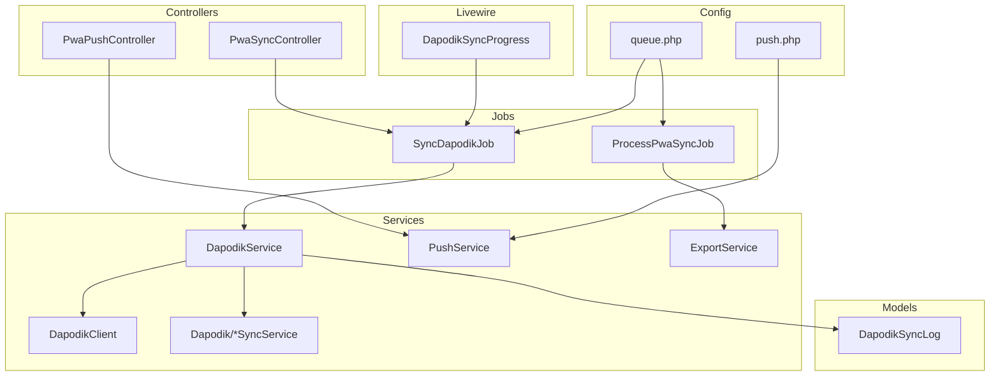
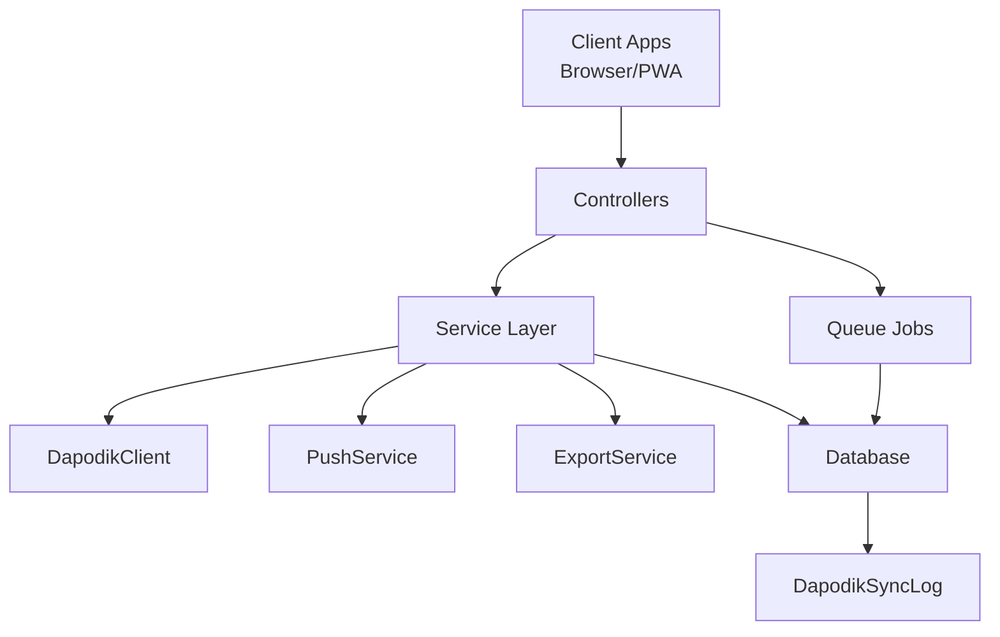
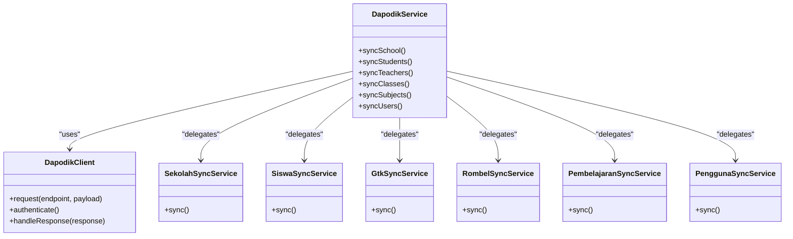
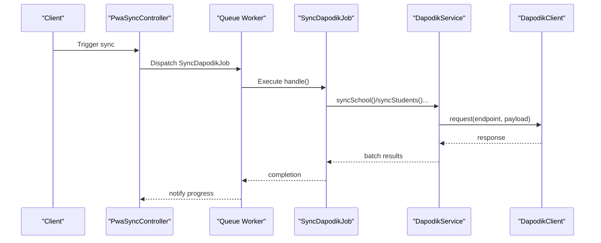
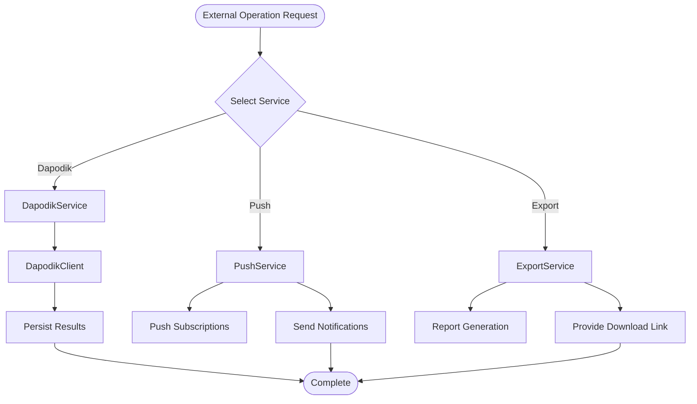
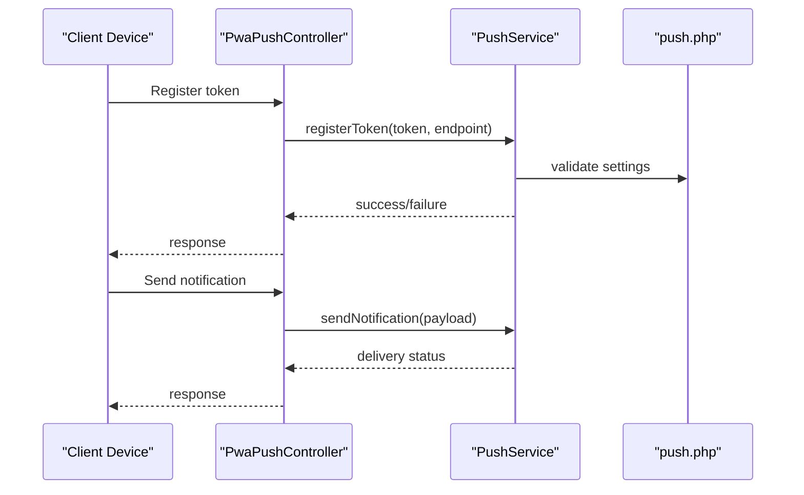
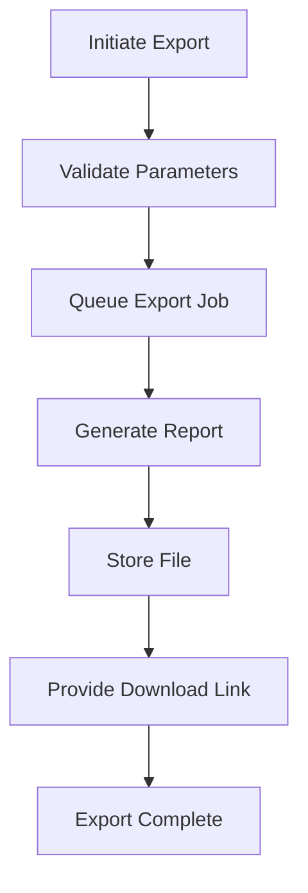
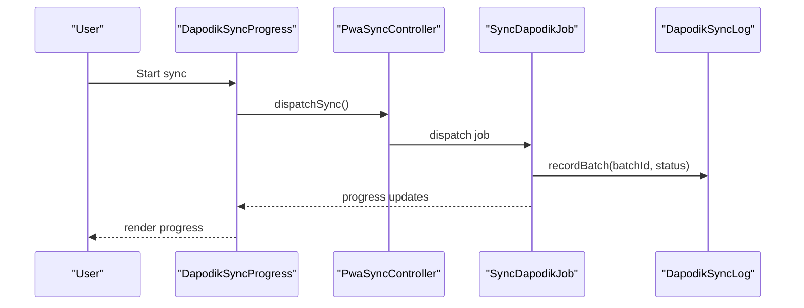
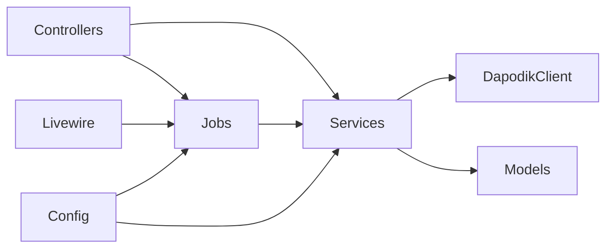

# Integration Patterns

<cite>
**Referenced Files in This Document**
- [DapodikClient.php](file://app/Services/Dapodik/DapodikClient.php)
- [DapodikService.php](file://app/Services/DapodikService.php)
- [GtkSyncService.php](file://app/Services/Dapodik/GtkSyncService.php)
- [SekolahSyncService.php](file://app/Services/Dapodik/SekolahSyncService.php)
- [SiswaSyncService.php](file://app/Services/Dapodik/SiswaSyncService.php)
- [PembelajaranSyncService.php](file://app/Services/Dapodik/PembelajaranSyncService.php)
- [PenggunaSyncService.php](file://app/Services/Dapodik/PenggunaSyncService.php)
- [RombelSyncService.php](file://app/Services/Dapodik/RombelSyncService.php)
- [SyncDapodikJob.php](file://app/Jobs/SyncDapodikJob.php)
- [ProcessPwaSyncJob.php](file://app/Jobs/ProcessPwaSyncJob.php)
- [DapodikSyncProgress.php](file://app/Livewire/DapodikSyncProgress.php)
- [PwaSyncController.php](file://app/Http/Controllers/PwaSyncController.php)
- [PwaPushController.php](file://app/Http/Controllers/PwaPushController.php)
- [PushService.php](file://app/Services/PushService.php)
- [ExportService.php](file://app/Services/ExportService.php)
- [DapodikSyncLog.php](file://app/Models/DapodikSyncLog.php)
- [push.php](file://config/push.php)
- [queue.php](file://config/queue.php)
- [jobs.php](file://database/migrations/2026_06_01_010802_create_jobs_table.php)
- [dapodik_sync_logs.php](file://database/migrations/2026_06_02_040000_create_dapodik_sync_logs_table.php)
- [pwa_tokens.php](file://database/migrations/2026_06_02_080001_add_dapodik_id_to_sekolah_table.php)
- [sekolah.php](file://database/migrations/2026_06_02_080000_add_dapodik_id_to_sekolah_table.php)
- [kelas.php](file://database/migrations/2026_06_02_080001_add_dapodik_id_to_kelas_table.php)
- [mapel.php](file://database/migrations/2026_06_02_080002_add_dapodik_id_to_mapel_table.php)
- [mapel_kelas.php](file://database/migrations/2026_06_02_080003_add_dapodik_id_to_mapel_kelas_table.php)
- [users.php](file://database/migrations/2026_06_10_000001_add_fcm_token_to_users_table.php)
- [push_subscriptions.php](file://database/migrations/2026_06_08_100000_create_push_subscriptions_table.php)
</cite>

## Table of Contents
1. [Introduction](#introduction)
2. [Project Structure](#project-structure)
3. [Core Components](#core-components)
4. [Architecture Overview](#architecture-overview)
5. [Detailed Component Analysis](#detailed-component-analysis)
6. [Dependency Analysis](#dependency-analysis)
7. [Performance Considerations](#performance-considerations)
8. [Troubleshooting Guide](#troubleshooting-guide)
9. [Security Considerations](#security-considerations)
10. [Conclusion](#conclusion)

## Introduction
This document explains the integration patterns used in RaporKM Laravel for connecting with external systems and services. It focuses on:
- Adapter pattern implementation for Dapodik API integration
- Job-based background processing for large data operations
- Service layer abstractions for external dependencies
- Integration architecture for push notifications, file exports, and real-time data synchronization
- Failure handling, retry mechanisms, and data consistency strategies
- Security considerations for external communications and authentication

## Project Structure
The integration-related components are organized across services, jobs, controllers, Livewire components, and supporting configurations and migrations:
- Services encapsulate external integrations (Dapodik, Push, Export)
- Jobs handle background tasks for synchronization and processing
- Controllers expose endpoints for PWA sync and push operations
- Livewire components provide real-time progress feedback
- Configurations define queue behavior and push notification settings
- Migrations establish persistence for sync logs and related identifiers

**Diagram sources**
- [PwaSyncController.php](file://app/Http/Controllers/PwaSyncController.php)
- [PwaPushController.php](file://app/Http/Controllers/PwaPushController.php)
- [SyncDapodikJob.php](file://app/Jobs/SyncDapodikJob.php)
- [ProcessPwaSyncJob.php](file://app/Jobs/ProcessPwaSyncJob.php)
- [DapodikSyncProgress.php](file://app/Livewire/DapodikSyncProgress.php)
- [DapodikService.php](file://app/Services/DapodikService.php)
- [DapodikClient.php](file://app/Services/Dapodik/DapodikClient.php)
- [SekolahSyncService.php](file://app/Services/Dapodik/SekolahSyncService.php)
- [PushService.php](file://app/Services/PushService.php)
- [ExportService.php](file://app/Services/ExportService.php)
- [DapodikSyncLog.php](file://app/Models/DapodikSyncLog.php)
- [queue.php](file://config/queue.php)
- [push.php](file://config/push.php)

**Section sources**
- [PwaSyncController.php](file://app/Http/Controllers/PwaSyncController.php)
- [PwaPushController.php](file://app/Http/Controllers/PwaPushController.php)
- [SyncDapodikJob.php](file://app/Jobs/SyncDapodikJob.php)
- [ProcessPwaSyncJob.php](file://app/Jobs/ProcessPwaSyncJob.php)
- [DapodikSyncProgress.php](file://app/Livewire/DapodikSyncProgress.php)
- [DapodikService.php](file://app/Services/DapodikService.php)
- [DapodikClient.php](file://app/Services/Dapodik/DapodikClient.php)
- [SekolahSyncService.php](file://app/Services/Dapodik/SekolahSyncService.php)
- [PushService.php](file://app/Services/PushService.php)
- [ExportService.php](file://app/Services/ExportService.php)
- [DapodikSyncLog.php](file://app/Models/DapodikSyncLog.php)
- [queue.php](file://config/queue.php)
- [push.php](file://config/push.php)

## Core Components
- Dapodik integration via a dedicated service layer with an adapter client and specialized sync services for different entity types
- Background job processing for large-scale synchronization and export operations
- Push notification service with FCM integration and subscription management
- Export service for generating reports and documents
- Real-time progress reporting using Livewire components

Key implementation patterns:
- Adapter pattern: DapodikClient encapsulates HTTP communication and authentication, while DapodikService orchestrates higher-level operations
- Service layer abstraction: Each sync domain (school, students, teachers, classes, subjects, users) has a dedicated service
- Queue-based processing: Jobs encapsulate long-running tasks and leverage Laravel queues for reliability and scalability
- Persistence: DapodikSyncLog tracks sync batches and outcomes for audit and recovery

**Section sources**
- [DapodikClient.php](file://app/Services/Dapodik/DapodikClient.php)
- [DapodikService.php](file://app/Services/DapodikService.php)
- [SekolahSyncService.php](file://app/Services/Dapodik/SekolahSyncService.php)
- [SiswaSyncService.php](file://app/Services/Dapodik/SiswaSyncService.php)
- [GtkSyncService.php](file://app/Services/Dapodik/GtkSyncService.php)
- [PembelajaranSyncService.php](file://app/Services/Dapodik/PembelajaranSyncService.php)
- [PenggunaSyncService.php](file://app/Services/Dapodik/PenggunaSyncService.php)
- [RombelSyncService.php](file://app/Services/Dapodik/RombelSyncService.php)
- [SyncDapodikJob.php](file://app/Jobs/SyncDapodikJob.php)
- [ProcessPwaSyncJob.php](file://app/Jobs/ProcessPwaSyncJob.php)
- [DapodikSyncProgress.php](file://app/Livewire/DapodikSyncProgress.php)
- [DapodikSyncLog.php](file://app/Models/DapodikSyncLog.php)

## Architecture Overview
The integration architecture follows layered patterns:
- Presentation layer: Controllers expose endpoints for PWA sync and push operations
- Application layer: Services encapsulate business logic for external integrations
- Infrastructure layer: Jobs process background tasks; Livewire components provide real-time UI updates
- Persistence layer: Models and migrations maintain state for sync logs and identifiers
- Configuration layer: Queue and push settings govern runtime behavior

**Diagram sources**
- [PwaSyncController.php](file://app/Http/Controllers/PwaSyncController.php)
- [PwaPushController.php](file://app/Http/Controllers/PwaPushController.php)
- [SyncDapodikJob.php](file://app/Jobs/SyncDapodikJob.php)
- [ProcessPwaSyncJob.php](file://app/Jobs/ProcessPwaSyncJob.php)
- [DapodikService.php](file://app/Services/DapodikService.php)
- [DapodikClient.php](file://app/Services/Dapodik/DapodikClient.php)
- [PushService.php](file://app/Services/PushService.php)
- [ExportService.php](file://app/Services/ExportService.php)
- [DapodikSyncLog.php](file://app/Models/DapodikSyncLog.php)

## Detailed Component Analysis

### Dapodik Adapter Pattern Implementation
The Dapodik integration employs an adapter pattern:
- DapodikClient: Encapsulates HTTP client configuration, authentication, and request/response handling
- DapodikService: Coordinates synchronization operations and delegates to specialized sync services
- Domain-specific sync services: Handle school, student, teacher, class, subject, and user data synchronization

**Diagram sources**
- [DapodikClient.php](file://app/Services/Dapodik/DapodikClient.php)
- [DapodikService.php](file://app/Services/DapodikService.php)
- [SekolahSyncService.php](file://app/Services/Dapodik/SekolahSyncService.php)
- [SiswaSyncService.php](file://app/Services/Dapodik/SiswaSyncService.php)
- [GtkSyncService.php](file://app/Services/Dapodik/GtkSyncService.php)
- [RombelSyncService.php](file://app/Services/Dapodik/RombelSyncService.php)
- [PembelajaranSyncService.php](file://app/Services/Dapodik/PembelajaranSyncService.php)
- [PenggunaSyncService.php](file://app/Services/Dapodik/PenggunaSyncService.php)

**Section sources**
- [DapodikClient.php](file://app/Services/Dapodik/DapodikClient.php)
- [DapodikService.php](file://app/Services/DapodikService.php)
- [SekolahSyncService.php](file://app/Services/Dapodik/SekolahSyncService.php)
- [SiswaSyncService.php](file://app/Services/Dapodik/SiswaSyncService.php)
- [GtkSyncService.php](file://app/Services/Dapodik/GtkSyncService.php)
- [RombelSyncService.php](file://app/Services/Dapodik/RombelSyncService.php)
- [PembelajaranSyncService.php](file://app/Services/Dapodik/PembelajaranSyncService.php)
- [PenggunaSyncService.php](file://app/Services/Dapodik/PenggunaSyncService.php)

### Job-Based Background Processing
Large data operations are executed asynchronously using jobs:
- SyncDapodikJob: Orchestrates Dapodik synchronization tasks
- ProcessPwaSyncJob: Handles PWA-specific synchronization processing
- Queue configuration enables reliable, retryable background processing

**Diagram sources**
- [PwaSyncController.php](file://app/Http/Controllers/PwaSyncController.php)
- [SyncDapodikJob.php](file://app/Jobs/SyncDapodikJob.php)
- [DapodikService.php](file://app/Services/DapodikService.php)
- [DapodikClient.php](file://app/Services/Dapodik/DapodikClient.php)

**Section sources**
- [SyncDapodikJob.php](file://app/Jobs/SyncDapodikJob.php)
- [ProcessPwaSyncJob.php](file://app/Jobs/ProcessPwaSyncJob.php)
- [queue.php](file://config/queue.php)
- [jobs.php](file://database/migrations/2026_06_01_010802_create_jobs_table.php)

### Service Layer Abstractions for External Dependencies
External dependencies are abstracted behind service interfaces:
- DapodikService coordinates multiple sync services and persists logs
- PushService manages push notification subscriptions and delivery
- ExportService generates reports and documents

**Diagram sources**
- [DapodikService.php](file://app/Services/DapodikService.php)
- [DapodikClient.php](file://app/Services/Dapodik/DapodikClient.php)
- [PushService.php](file://app/Services/PushService.php)
- [ExportService.php](file://app/Services/ExportService.php)

**Section sources**
- [DapodikService.php](file://app/Services/DapodikService.php)
- [PushService.php](file://app/Services/PushService.php)
- [ExportService.php](file://app/Services/ExportService.php)

### Push Notification Integration
Push notifications are handled through:
- PwaPushController: Exposes endpoints for push operations
- PushService: Manages FCM tokens and subscription lifecycle
- PushSubscription model: Stores device tokens and subscription metadata
- Configuration: push.php defines push notification settings

**Diagram sources**
- [PwaPushController.php](file://app/Http/Controllers/PwaPushController.php)
- [PushService.php](file://app/Services/PushService.php)
- [push.php](file://config/push.php)
- [users.php](file://database/migrations/2026_06_10_000001_add_fcm_token_to_users_table.php)
- [push_subscriptions.php](file://database/migrations/2026_06_08_100000_create_push_subscriptions_table.php)

**Section sources**
- [PwaPushController.php](file://app/Http/Controllers/PwaPushController.php)
- [PushService.php](file://app/Services/PushService.php)
- [push.php](file://config/push.php)
- [users.php](file://database/migrations/2026_06_10_000001_add_fcm_token_to_users_table.php)
- [push_subscriptions.php](file://database/migrations/2026_06_08_100000_create_push_subscriptions_table.php)

### File Export Integration
ExportService provides report generation and download capabilities:
- Generates PDFs and other formats
- Integrates with DOMPDF and storage subsystems
- Supports background processing for large exports

**Diagram sources**
- [ExportService.php](file://app/Services/ExportService.php)
- [ProcessPwaSyncJob.php](file://app/Jobs/ProcessPwaSyncJob.php)

**Section sources**
- [ExportService.php](file://app/Services/ExportService.php)
- [ProcessPwaSyncJob.php](file://app/Jobs/ProcessPwaSyncJob.php)

### Real-Time Data Synchronization
Real-time synchronization is supported through:
- Livewire component DapodikSyncProgress: Provides live progress updates during sync
- PwaSyncController: Triggers synchronization and coordinates with jobs
- DapodikSyncLog: Records batch-level sync outcomes for auditing and recovery

**Diagram sources**
- [DapodikSyncProgress.php](file://app/Livewire/DapodikSyncProgress.php)
- [PwaSyncController.php](file://app/Http/Controllers/PwaSyncController.php)
- [SyncDapodikJob.php](file://app/Jobs/SyncDapodikJob.php)
- [DapodikSyncLog.php](file://app/Models/DapodikSyncLog.php)

**Section sources**
- [DapodikSyncProgress.php](file://app/Livewire/DapodikSyncProgress.php)
- [PwaSyncController.php](file://app/Http/Controllers/PwaSyncController.php)
- [SyncDapodikJob.php](file://app/Jobs/SyncDapodikJob.php)
- [DapodikSyncLog.php](file://app/Models/DapodikSyncLog.php)

## Dependency Analysis
The integration components exhibit clear separation of concerns:
- Controllers depend on Jobs and Services
- Jobs depend on Services and Models
- Services depend on Adapters and Models
- Livewire components depend on Jobs for progress updates
- Configuration files govern queue and push behavior

**Diagram sources**
- [PwaSyncController.php](file://app/Http/Controllers/PwaSyncController.php)
- [PwaPushController.php](file://app/Http/Controllers/PwaPushController.php)
- [SyncDapodikJob.php](file://app/Jobs/SyncDapodikJob.php)
- [ProcessPwaSyncJob.php](file://app/Jobs/ProcessPwaSyncJob.php)
- [DapodikService.php](file://app/Services/DapodikService.php)
- [DapodikClient.php](file://app/Services/Dapodik/DapodikClient.php)
- [DapodikSyncProgress.php](file://app/Livewire/DapodikSyncProgress.php)
- [queue.php](file://config/queue.php)
- [push.php](file://config/push.php)

**Section sources**
- [PwaSyncController.php](file://app/Http/Controllers/PwaSyncController.php)
- [PwaPushController.php](file://app/Http/Controllers/PwaPushController.php)
- [SyncDapodikJob.php](file://app/Jobs/SyncDapodikJob.php)
- [ProcessPwaSyncJob.php](file://app/Jobs/ProcessPwaSyncJob.php)
- [DapodikService.php](file://app/Services/DapodikService.php)
- [DapodikClient.php](file://app/Services/Dapodik/DapodikClient.php)
- [DapodikSyncProgress.php](file://app/Livewire/DapodikSyncProgress.php)
- [queue.php](file://config/queue.php)
- [push.php](file://config/push.php)

## Performance Considerations
- Use queue workers to process heavy operations asynchronously
- Batch synchronization operations to reduce API round trips
- Implement pagination and incremental sync to manage large datasets
- Cache frequently accessed configuration and metadata
- Monitor queue backlog and scale worker processes accordingly

## Troubleshooting Guide
Common failure scenarios and remedies:
- External API timeouts or rate limits: Implement exponential backoff and retry policies in jobs
- Authentication failures: Validate credentials and refresh tokens before requests
- Data conflicts: Use upsert logic and conflict resolution strategies in sync services
- Queue failures: Inspect failed jobs and requeue with appropriate delays
- Push delivery issues: Verify device tokens and FCM configuration

Operational artifacts:
- DapodikSyncLog records batch outcomes and errors for auditing
- Queue tables track job execution history and failures

**Section sources**
- [DapodikSyncLog.php](file://app/Models/DapodikSyncLog.php)
- [dapodik_sync_logs.php](file://database/migrations/2026_06_02_040000_create_dapodik_sync_logs_table.php)
- [jobs.php](file://database/migrations/2026_06_01_010802_create_jobs_table.php)

## Security Considerations
- Transport security: Enforce HTTPS for all external communications
- Authentication: Use secure tokens and avoid exposing secrets in client-side code
- Input validation: Sanitize and validate all external data before processing
- Access control: Restrict endpoints to authorized users and roles
- Audit logging: Maintain logs of sensitive operations for compliance

## Conclusion
RaporKM Laravel employs robust integration patterns:
- An adapter-based Dapodik client with specialized sync services
- Reliable background processing via jobs and queues
- Service-layer abstractions for external dependencies
- Real-time progress reporting and comprehensive logging
- Secure, auditable operations with clear separation of concerns

These patterns enable scalable, maintainable, and resilient integrations with external systems while preserving data consistency and operational visibility.