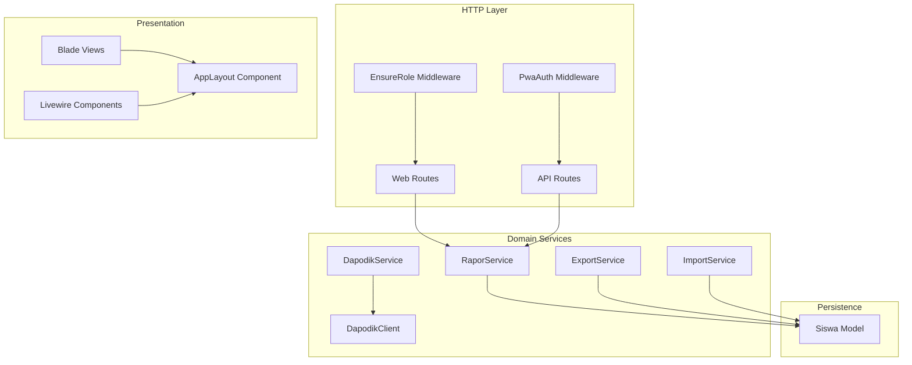
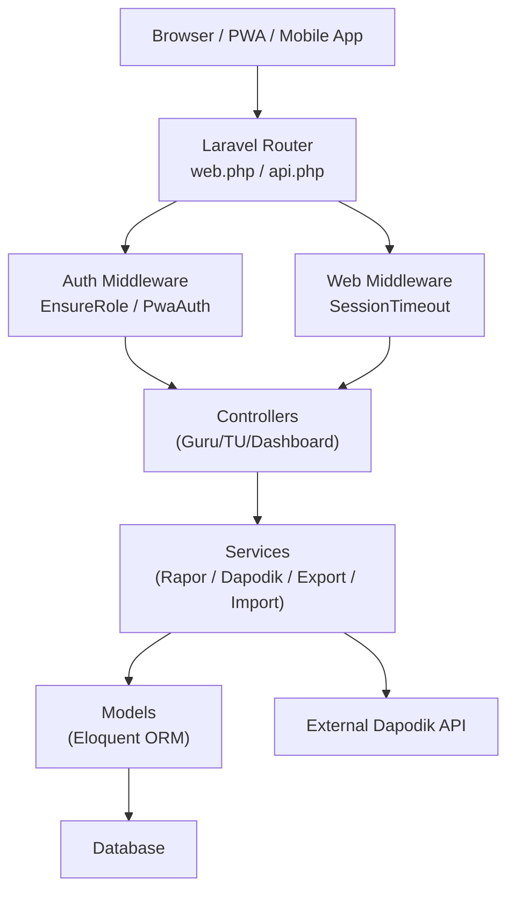
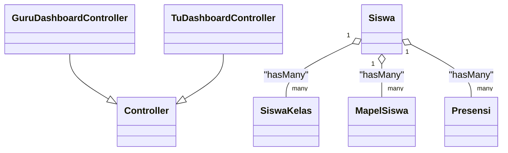
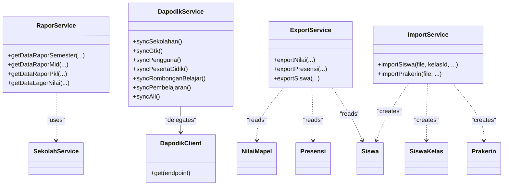
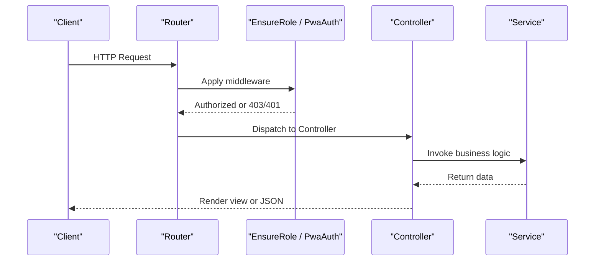
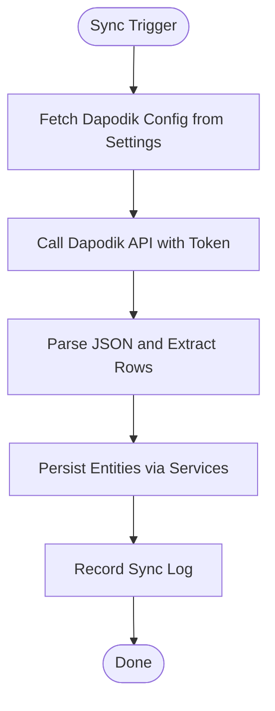
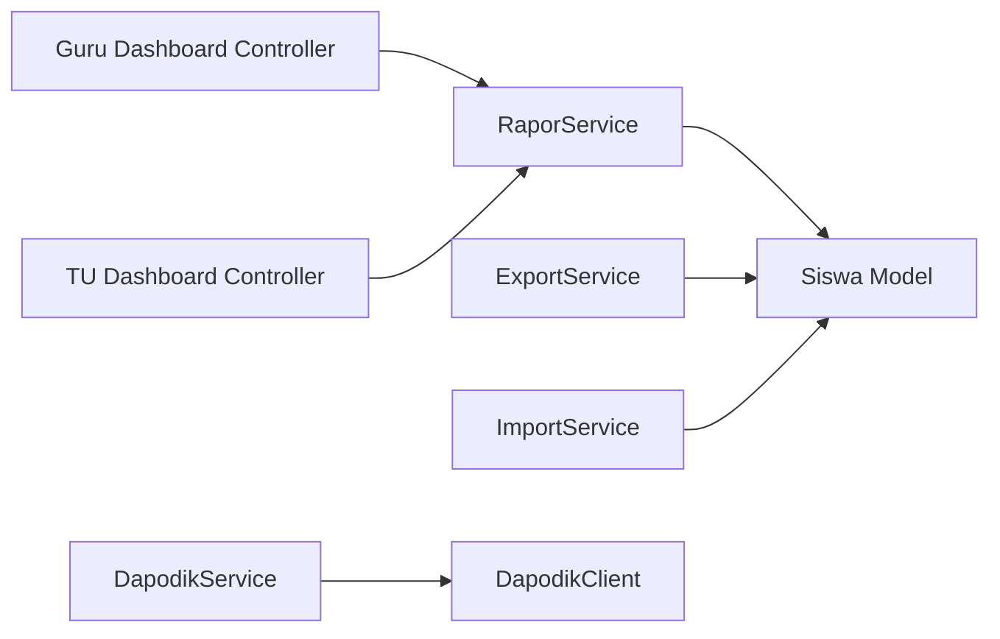

# System Design

<cite>
**Referenced Files in This Document**
- [bootstrap/app.php](file://bootstrap/app.php)
- [routes/web.php](file://routes/web.php)
- [routes/api.php](file://routes/api.php)
- [app/Http/Middleware/EnsureRole.php](file://app/Http/Middleware/EnsureRole.php)
- [app/Http/Middleware/PwaAuth.php](file://app/Http/Middleware/PwaAuth.php)
- [app/Http/Controllers/Controller.php](file://app/Http/Controllers/Controller.php)
- [app/Http/Controllers/Guru/DashboardController.php](file://app/Http/Controllers/Guru/DashboardController.php)
- [app/Http/Controllers/TU/DashboardController.php](file://app/Http/Controllers/TU/DashboardController.php)
- [app/Services/RaporService.php](file://app/Services/RaporService.php)
- [app/Services/DapodikService.php](file://app/Services/DapodikService.php)
- [app/Services/Dapodik/DapodikClient.php](file://app/Services/Dapodik/DapodikClient.php)
- [app/Services/ExportService.php](file://app/Services/ExportService.php)
- [app/Services/ImportService.php](file://app/Services/ImportService.php)
- [app/Models/Siswa.php](file://app/Models/Siswa.php)
- [app/Providers/AppServiceProvider.php](file://app/Providers/AppServiceProvider.php)
- [app/View/Components/AppLayout.php](file://app/View/Components/AppLayout.php)
- [config/app.php](file://config/app.php)
- [composer.json](file://composer.json)
</cite>

## Table of Contents
1. [Introduction](#introduction)
2. [Project Structure](#project-structure)
3. [Core Components](#core-components)
4. [Architecture Overview](#architecture-overview)
5. [Detailed Component Analysis](#detailed-component-analysis)
6. [Dependency Analysis](#dependency-analysis)
7. [Performance Considerations](#performance-considerations)
8. [Troubleshooting Guide](#troubleshooting-guide)
9. [Conclusion](#conclusion)

## Introduction
This document describes the system design of RaporKM Laravel, focusing on the MVC pattern implementation, service layer design, separation of concerns, and integration points. It explains how Laravel conventions are applied, outlines system boundaries, and documents external dependencies such as the Dapodik API and third-party libraries. Scalability and performance optimization strategies are addressed alongside architectural patterns that maintain code organization and extensibility.

## Project Structure
RaporKM follows Laravel’s conventional structure with clear separation between HTTP layer (controllers, middleware), domain/business logic (services), persistence (models), and presentation (Blade views, Livewire components). Routing is split into web and API groups, with role-based access control and PWA-specific authentication middleware. The service layer orchestrates business operations and delegates to specialized services and clients.

**Diagram sources**
- [routes/web.php:1-298](file://routes/web.php#L1-L298)
- [routes/api.php:1-277](file://routes/api.php#L1-L277)
- [app/Http/Middleware/EnsureRole.php:1-24](file://app/Http/Middleware/EnsureRole.php#L1-L24)
- [app/Http/Middleware/PwaAuth.php:1-44](file://app/Http/Middleware/PwaAuth.php#L1-L44)
- [app/Services/RaporService.php:1-174](file://app/Services/RaporService.php#L1-L174)
- [app/Services/DapodikService.php:1-109](file://app/Services/DapodikService.php#L1-L109)
- [app/Services/Dapodik/DapodikClient.php:1-70](file://app/Services/Dapodik/DapodikClient.php#L1-L70)
- [app/Services/ExportService.php:1-184](file://app/Services/ExportService.php#L1-L184)
- [app/Services/ImportService.php:1-254](file://app/Services/ImportService.php#L1-L254)
- [app/Models/Siswa.php:1-88](file://app/Models/Siswa.php#L1-L88)
- [app/View/Components/AppLayout.php:1-18](file://app/View/Components/AppLayout.php#L1-L18)

**Section sources**
- [routes/web.php:1-298](file://routes/web.php#L1-L298)
- [routes/api.php:1-277](file://routes/api.php#L1-L277)
- [bootstrap/app.php:1-34](file://bootstrap/app.php#L1-L34)
- [config/app.php:1-127](file://config/app.php#L1-L127)
- [composer.json:1-99](file://composer.json#L1-L99)

## Core Components
- MVC Pattern
  - Controllers: Handle HTTP requests and delegate to services; base controller class provides shared behavior.
  - Models: Define data structures and relationships; leverage Eloquent for persistence.
  - Views: Blade templates and Livewire components for rendering.
- Service Layer
  - RaporService: Aggregates report data for academic, co-curricular, attendance, and practice fields.
  - DapodikService: Orchestrates synchronization with the Dapodik API via DapodikClient.
  - ExportService: Streams Excel exports for grades, attendance, and student lists.
  - ImportService: Reads CSV/XLSX and persists student/practicum records.
- Middleware
  - EnsureRole: Enforces role-based access control.
  - PwaAuth: Authenticates PWA clients via hashed tokens stored in the database.
- Providers and Observers
  - AppServiceProvider: Registers observers and policies; composes school context across views.

**Section sources**
- [app/Http/Controllers/Controller.php:1-9](file://app/Http/Controllers/Controller.php#L1-L9)
- [app/Http/Controllers/Guru/DashboardController.php:1-140](file://app/Http/Controllers/Guru/DashboardController.php#L1-L140)
- [app/Http/Controllers/TU/DashboardController.php:1-109](file://app/Http/Controllers/TU/DashboardController.php#L1-L109)
- [app/Services/RaporService.php:1-174](file://app/Services/RaporService.php#L1-L174)
- [app/Services/DapodikService.php:1-109](file://app/Services/DapodikService.php#L1-L109)
- [app/Services/Dapodik/DapodikClient.php:1-70](file://app/Services/Dapodik/DapodikClient.php#L1-L70)
- [app/Services/ExportService.php:1-184](file://app/Services/ExportService.php#L1-L184)
- [app/Services/ImportService.php:1-254](file://app/Services/ImportService.php#L1-L254)
- [app/Http/Middleware/EnsureRole.php:1-24](file://app/Http/Middleware/EnsureRole.php#L1-L24)
- [app/Http/Middleware/PwaAuth.php:1-44](file://app/Http/Middleware/PwaAuth.php#L1-L44)
- [app/Providers/AppServiceProvider.php:1-45](file://app/Providers/AppServiceProvider.php#L1-L45)
- [app/View/Components/AppLayout.php:1-18](file://app/View/Components/AppLayout.php#L1-L18)

## Architecture Overview
RaporKM employs a layered architecture aligned with Laravel conventions:
- Presentation Layer: Web and API routes, Blade and Livewire views, reusable layout components.
- Application Layer: Controllers and middleware implement cross-cutting concerns (authentication, authorization, timeouts).
- Domain Layer: Services encapsulate business logic and orchestration.
- Infrastructure Layer: Models, database, external HTTP client for Dapodik, and streaming exporters.

**Diagram sources**
- [routes/web.php:1-298](file://routes/web.php#L1-L298)
- [routes/api.php:1-277](file://routes/api.php#L1-L277)
- [app/Http/Middleware/EnsureRole.php:1-24](file://app/Http/Middleware/EnsureRole.php#L1-L24)
- [app/Http/Middleware/PwaAuth.php:1-44](file://app/Http/Middleware/PwaAuth.php#L1-L44)
- [app/Services/Dapodik/DapodikClient.php:1-70](file://app/Services/Dapodik/DapodikClient.php#L1-L70)

## Detailed Component Analysis

### MVC Pattern Implementation
- Controllers
  - Base controller class centralizes common controller behavior.
  - Role-specific dashboards demonstrate separation of concerns: TU dashboard focuses on administrative metrics; Guru dashboard focuses on teaching and reporting tasks.
- Models
  - Siswa model defines fillable attributes, soft deletes, and relationships to related entities (classes, subjects, activities).
- Views
  - Blade templates and Livewire components render dynamic UIs; AppLayout component standardizes layout rendering.

**Diagram sources**
- [app/Http/Controllers/Controller.php:1-9](file://app/Http/Controllers/Controller.php#L1-L9)
- [app/Http/Controllers/Guru/DashboardController.php:1-140](file://app/Http/Controllers/Guru/DashboardController.php#L1-L140)
- [app/Http/Controllers/TU/DashboardController.php:1-109](file://app/Http/Controllers/TU/DashboardController.php#L1-L109)
- [app/Models/Siswa.php:1-88](file://app/Models/Siswa.php#L1-L88)

**Section sources**
- [app/Http/Controllers/Controller.php:1-9](file://app/Http/Controllers/Controller.php#L1-L9)
- [app/Http/Controllers/Guru/DashboardController.php:1-140](file://app/Http/Controllers/Guru/DashboardController.php#L1-L140)
- [app/Http/Controllers/TU/DashboardController.php:1-109](file://app/Http/Controllers/TU/DashboardController.php#L1-L109)
- [app/Models/Siswa.php:1-88](file://app/Models/Siswa.php#L1-L88)
- [app/View/Components/AppLayout.php:1-18](file://app/View/Components/AppLayout.php#L1-L18)

### Service Layer Design
- RaporService
  - Aggregates report data for semester, mid-term, and practice programs; computes attendance summaries; integrates with SekolahService for institutional context.
- DapodikService
  - Orchestrates synchronization across multiple domains (school, staff, users, students, classes, learning); delegates to focused services and uses DapodikClient for HTTP communication.
- ExportService
  - Streams XLSX exports for grades, attendance, and student lists using OpenSpout; returns streamed responses for large datasets.
- ImportService
  - Reads CSV/XLSX files and validates required fields; persists student and practice program records; handles errors and batch creation.

**Diagram sources**
- [app/Services/RaporService.php:1-174](file://app/Services/RaporService.php#L1-L174)
- [app/Services/DapodikService.php:1-109](file://app/Services/DapodikService.php#L1-L109)
- [app/Services/Dapodik/DapodikClient.php:1-70](file://app/Services/Dapodik/DapodikClient.php#L1-L70)
- [app/Services/ExportService.php:1-184](file://app/Services/ExportService.php#L1-L184)
- [app/Services/ImportService.php:1-254](file://app/Services/ImportService.php#L1-L254)

**Section sources**
- [app/Services/RaporService.php:1-174](file://app/Services/RaporService.php#L1-L174)
- [app/Services/DapodikService.php:1-109](file://app/Services/DapodikService.php#L1-L109)
- [app/Services/Dapodik/DapodikClient.php:1-70](file://app/Services/Dapodik/DapodikClient.php#L1-L70)
- [app/Services/ExportService.php:1-184](file://app/Services/ExportService.php#L1-L184)
- [app/Services/ImportService.php:1-254](file://app/Services/ImportService.php#L1-L254)

### Middleware and Routing
- Web routes define panel-specific routes for TU and Guru, grouped by roles and prefixed accordingly.
- API routes expose public endpoints and protected endpoints with rate limiting and Sanctum authentication; includes PWA endpoints and legacy ping endpoint.
- Middleware aliases:
  - role: EnsureRole
  - session.timeout: Session timeout handling
  - pwa.auth: PWA token-based authentication

**Diagram sources**
- [routes/web.php:1-298](file://routes/web.php#L1-L298)
- [routes/api.php:1-277](file://routes/api.php#L1-L277)
- [app/Http/Middleware/EnsureRole.php:1-24](file://app/Http/Middleware/EnsureRole.php#L1-L24)
- [app/Http/Middleware/PwaAuth.php:1-44](file://app/Http/Middleware/PwaAuth.php#L1-L44)

**Section sources**
- [routes/web.php:1-298](file://routes/web.php#L1-L298)
- [routes/api.php:1-277](file://routes/api.php#L1-L277)
- [bootstrap/app.php:1-34](file://bootstrap/app.php#L1-L34)

### Separation of Concerns
- Presentation vs Business vs Data
  - Presentation: Controllers and views; Livewire components; Blade templates.
  - Business: Services encapsulate report generation, Dapodik sync, import/export operations.
  - Data: Models define schema and relationships; repositories are implicit via Eloquent.
- Cross-Cutting Concerns
  - Authentication and authorization handled by middleware and policies registered in AppServiceProvider.
  - Observers enforce domain rules (e.g., NilaiSumatifAsObserver).
  - View composers inject shared data (e.g., school context).

**Section sources**
- [app/Providers/AppServiceProvider.php:1-45](file://app/Providers/AppServiceProvider.php#L1-L45)
- [app/Services/RaporService.php:1-174](file://app/Services/RaporService.php#L1-L174)
- [app/Services/DapodikService.php:1-109](file://app/Services/DapodikService.php#L1-L109)
- [app/Models/Siswa.php:1-88](file://app/Models/Siswa.php#L1-L88)

### External Dependencies and Integration Points
- Dapodik API
  - DapodikClient resolves base URL, reads credentials from settings, and performs authenticated GET requests; extracts rows from JSON responses.
  - DapodikService orchestrates sync operations across multiple entities.
- Third-party Libraries
  - PDF generation, push notifications, spreadsheet handling, activity logging, Livewire/Volt, Sanctum, and DOMPDF are declared in composer.json.

**Diagram sources**
- [app/Services/Dapodik/DapodikClient.php:1-70](file://app/Services/Dapodik/DapodikClient.php#L1-L70)
- [app/Services/DapodikService.php:1-109](file://app/Services/DapodikService.php#L1-L109)

**Section sources**
- [app/Services/Dapodik/DapodikClient.php:1-70](file://app/Services/Dapodik/DapodikClient.php#L1-L70)
- [app/Services/DapodikService.php:1-109](file://app/Services/DapodikService.php#L1-L109)
- [composer.json:1-99](file://composer.json#L1-L99)

## Dependency Analysis
- Internal Coupling
  - Controllers depend on Services; Services depend on Models; Services may depend on other Services (e.g., RaporService depends on SekolahService).
  - Middleware is decoupled and applied via route definitions.
- External Coupling
  - DapodikClient depends on HTTP client and database-backed configuration.
  - ExportService depends on OpenSpout; ImportService depends on OpenSpout readers.
- Potential Circular Dependencies
  - None observed among controllers, services, and models in the analyzed files.

**Diagram sources**
- [app/Http/Controllers/Guru/DashboardController.php:1-140](file://app/Http/Controllers/Guru/DashboardController.php#L1-L140)
- [app/Http/Controllers/TU/DashboardController.php:1-109](file://app/Http/Controllers/TU/DashboardController.php#L1-L109)
- [app/Services/RaporService.php:1-174](file://app/Services/RaporService.php#L1-L174)
- [app/Services/ExportService.php:1-184](file://app/Services/ExportService.php#L1-L184)
- [app/Services/ImportService.php:1-254](file://app/Services/ImportService.php#L1-L254)
- [app/Services/DapodikService.php:1-109](file://app/Services/DapodikService.php#L1-L109)
- [app/Services/Dapodik/DapodikClient.php:1-70](file://app/Services/Dapodik/DapodikClient.php#L1-L70)
- [app/Models/Siswa.php:1-88](file://app/Models/Siswa.php#L1-L88)

**Section sources**
- [app/Services/RaporService.php:1-174](file://app/Services/RaporService.php#L1-L174)
- [app/Services/DapodikService.php:1-109](file://app/Services/DapodikService.php#L1-L109)
- [app/Services/Dapodik/DapodikClient.php:1-70](file://app/Services/Dapodik/DapodikClient.php#L1-L70)
- [app/Services/ExportService.php:1-184](file://app/Services/ExportService.php#L1-L184)
- [app/Services/ImportService.php:1-254](file://app/Services/ImportService.php#L1-L254)
- [app/Models/Siswa.php:1-88](file://app/Models/Siswa.php#L1-L88)

## Performance Considerations
- Query Efficiency
  - Use eager loading (with) to reduce N+1 queries in controllers and services.
  - Group and aggregate data (e.g., attendance counts) in services to minimize downstream processing.
- Streaming Exports
  - ExportService streams XLSX files to avoid memory spikes for large datasets.
- External API Calls
  - DapodikClient sets a timeout and validates responses; consider adding retry/backoff and caching for repeated reads.
- Middleware Overhead
  - Keep middleware lightweight; ensure role checks and PWA auth are fast and indexed appropriately.
- Queueing and Background Jobs
  - Long-running tasks (sync, exports) can be queued to improve responsiveness.

[No sources needed since this section provides general guidance]

## Troubleshooting Guide
- Authentication Failures
  - PWA token missing or expired: PwaAuth middleware returns 401 with message indicating missing or invalid token.
  - Role mismatch: EnsureRole middleware redirects unauthenticated users or aborts with 403.
- Dapodik Configuration
  - Missing base URL, NPSN, or token triggers configuration error; verify settings and reattempt.
- Import Errors
  - ImportService validates required fields and reports row-specific errors; limit exceeded errors are truncated for readability.
- Export Failures
  - ExportService writes to temporary files and streams responses; check permissions and available disk space.

**Section sources**
- [app/Http/Middleware/PwaAuth.php:1-44](file://app/Http/Middleware/PwaAuth.php#L1-L44)
- [app/Http/Middleware/EnsureRole.php:1-24](file://app/Http/Middleware/EnsureRole.php#L1-L24)
- [app/Services/Dapodik/DapodikClient.php:1-70](file://app/Services/Dapodik/DapodikClient.php#L1-L70)
- [app/Services/ImportService.php:1-254](file://app/Services/ImportService.php#L1-L254)
- [app/Services/ExportService.php:1-184](file://app/Services/ExportService.php#L1-L184)

## Conclusion
RaporKM leverages Laravel’s MVC architecture with a robust service layer to separate presentation, business logic, and data concerns. Role-based routing and middleware ensure secure access, while services encapsulate report generation, Dapodik integration, and data import/export. External dependencies are managed through dedicated clients and libraries, and performance is addressed via streaming exports and efficient querying. The design supports scalability through modular services, background job support, and clear separation of responsibilities.