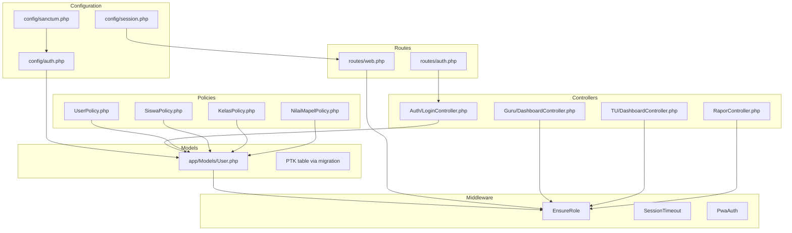
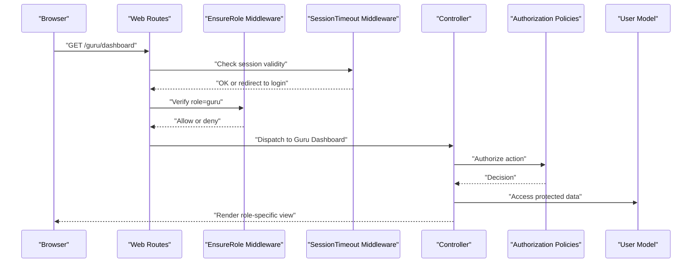
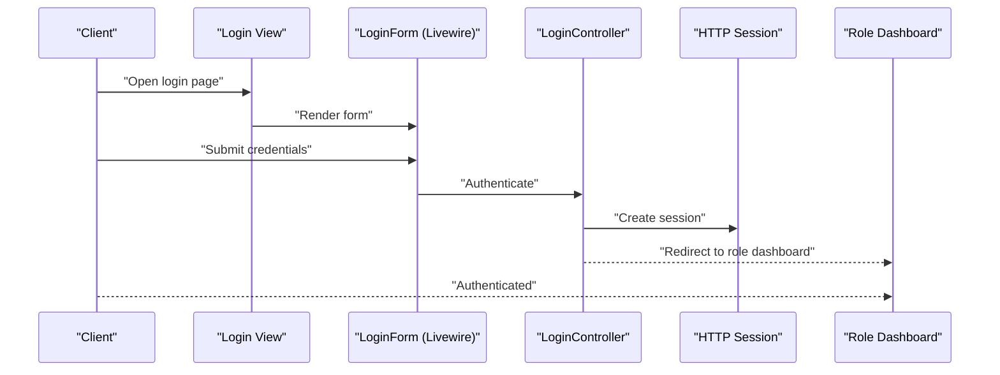
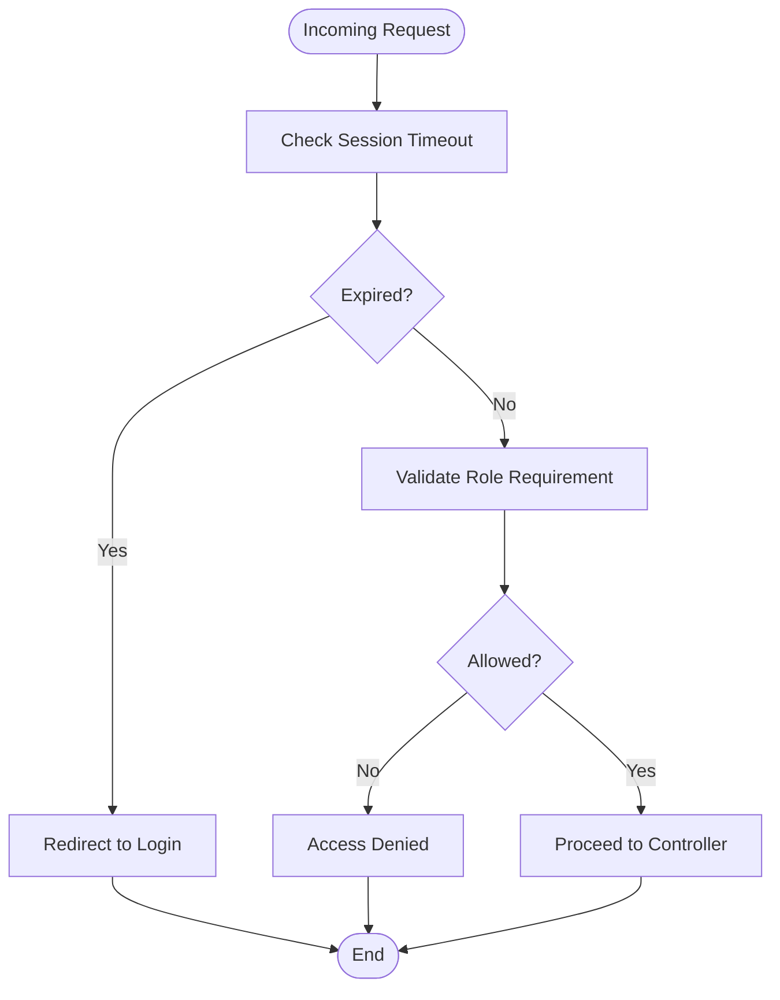
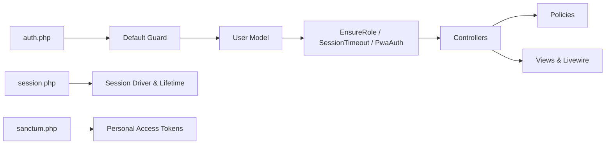

# Authentication & Authorization

<cite>
**Referenced Files in This Document**
- [app/Models/User.php](file://app/Models/User.php)
- [config/auth.php](file://config/auth.php)
- [config/session.php](file://config/session.php)
- [config/sanctum.php](file://config/sanctum.php)
- [routes/web.php](file://routes/web.php)
- [routes/auth.php](file://routes/auth.php)
- [app/Http/Middleware/EnsureRole.php](file://app/Http/Middleware/EnsureRole.php)
- [app/Http/Middleware/SessionTimeout.php](file://app/Http/Middleware/SessionTimeout.php)
- [app/Http/Middleware/PwaAuth.php](file://app/Http/Middleware/PwaAuth.php)
- [app/Http/Controllers/Auth/LoginController.php](file://app/Http/Controllers/Auth/LoginController.php)
- [app/Http/Controllers/Guru/DashboardController.php](file://app/Http/Controllers/Guru/DashboardController.php)
- [app/Http/Controllers/TU/DashboardController.php](file://app/Http/Controllers/TU/DashboardController.php)
- [app/Http/Controllers/RaporController.php](file://app/Http/Controllers/RaporController.php)
- [app/Policies/UserPolicy.php](file://app/Policies/UserPolicy.php)
- [app/Policies/SiswaPolicy.php](file://app/Policies/SiswaPolicy.php)
- [app/Policies/KelasPolicy.php](file://app/Policies/KelasPolicy.php)
- [app/Policies/NilaiMapelPolicy.php](file://app/Policies/NilaiMapelPolicy.php)
- [resources/views/layouts/guru.blade.php](file://resources/views/layouts/guru.blade.php)
- [resources/views/layouts/tu.blade.php](file://resources/views/layouts/tu.blade.php)
- [resources/views/livewire/pages/auth/login.blade.php](file://resources/views/livewire/pages/auth/login.blade.php)
- [app/Livewire/Forms/LoginForm.php](file://app/Livewire/Forms/LoginForm.php)
- [app/Livewire/Actions/Logout.php](file://app/Livewire/Actions/Logout.php)
- [database/migrations/0001_01_01_000000_create_users_table.php](file://database/migrations/0001_01_01_000000_create_users_table.php)
- [database/migrations/2026_06_04_120000_create_ptk_table_and_migrate_from_users.php](file://database/migrations/2026_06_04_120000_create_ptk_table_and_migrate_from_users.php)
- [database/factories/UserFactory.php](file://database/factories/UserFactory.php)
- [database/seeders/UserSeeder.php](file://database/seeders/UserSeeder.php)
- [app/Services/DapodikService.php](file://app/Services/DapodikService.php)
- [app/Services/GuruMenuService.php](file://app/Services/GuruMenuService.php)
- [app/Providers/AppServiceProvider.php](file://app/Providers/AppServiceProvider.php)
- [bootstrap/app.php](file://bootstrap/app.php)
</cite>

## Table of Contents
1. [Introduction](#introduction)
2. [Project Structure](#project-structure)
3. [Core Components](#core-components)
4. [Architecture Overview](#architecture-overview)
5. [Detailed Component Analysis](#detailed-component-analysis)
6. [Dependency Analysis](#dependency-analysis)
7. [Performance Considerations](#performance-considerations)
8. [Troubleshooting Guide](#troubleshooting-guide)
9. [Conclusion](#conclusion)
10. [Appendices](#appendices)

## Introduction
This document describes the authentication and authorization system in RaporKM Laravel. It covers multi-role authentication for teachers (guru), administrators (TU), and students, along with role-based access control, middleware enforcement, session management, timeout handling, user model structure, password hashing, CSRF protection, token management, authorization policies, route guards, controller-level restrictions, user registration, password reset, and email verification. It also outlines security best practices, session security, protections against common vulnerabilities, and guidance for extending the system.

## Project Structure
The authentication and authorization system spans several layers:
- Configuration: auth guard, session, and Sanctum settings
- Models: User and related entities
- Routes: web and auth-specific routes
- Middleware: role enforcement, session timeout, and PWA auth
- Controllers: role-specific dashboards and authentication handlers
- Policies: authorization rules per domain entity
- Views and Livewire: login form and logout actions
- Database: migration for users and related tables

**Diagram sources**
- [config/auth.php](file://config/auth.php)
- [config/session.php](file://config/session.php)
- [config/sanctum.php](file://config/sanctum.php)
- [app/Models/User.php](file://app/Models/User.php)
- [routes/web.php](file://routes/web.php)
- [routes/auth.php](file://routes/auth.php)
- [app/Http/Middleware/EnsureRole.php](file://app/Http/Middleware/EnsureRole.php)
- [app/Http/Middleware/SessionTimeout.php](file://app/Http/Middleware/SessionTimeout.php)
- [app/Http/Middleware/PwaAuth.php](file://app/Http/Middleware/PwaAuth.php)
- [app/Http/Controllers/Auth/LoginController.php](file://app/Http/Controllers/Auth/LoginController.php)
- [app/Http/Controllers/Guru/DashboardController.php](file://app/Http/Controllers/Guru/DashboardController.php)
- [app/Http/Controllers/TU/DashboardController.php](file://app/Http/Controllers/TU/DashboardController.php)
- [app/Http/Controllers/RaporController.php](file://app/Http/Controllers/RaporController.php)
- [app/Policies/UserPolicy.php](file://app/Policies/UserPolicy.php)
- [app/Policies/SiswaPolicy.php](file://app/Policies/SiswaPolicy.php)
- [app/Policies/KelasPolicy.php](file://app/Policies/KelasPolicy.php)
- [app/Policies/NilaiMapelPolicy.php](file://app/Policies/NilaiMapelPolicy.php)

**Section sources**
- [config/auth.php](file://config/auth.php)
- [config/session.php](file://config/session.php)
- [config/sanctum.php](file://config/sanctum.php)
- [app/Models/User.php](file://app/Models/User.php)
- [routes/web.php](file://routes/web.php)
- [routes/auth.php](file://routes/auth.php)

## Core Components
- User Model and Guard: Central identity model with hashed passwords and guard configuration.
- Multi-role System: Roles for guru, TU, and student are enforced via middleware and policies.
- Session Management: Configured session lifetime, driver, and timeout middleware.
- Token Management: Sanctum tokens for API and SPA-like flows.
- Authorization Policies: Fine-grained controls for users, students, classes, and academic scores.
- Route Guards: Role-based route middleware and controller-level checks.
- Login and Logout: Form-based login and Livewire-based logout.

**Section sources**
- [app/Models/User.php](file://app/Models/User.php)
- [config/auth.php](file://config/auth.php)
- [config/session.php](file://config/session.php)
- [config/sanctum.php](file://config/sanctum.php)
- [app/Http/Middleware/EnsureRole.php](file://app/Http/Middleware/EnsureRole.php)
- [app/Http/Middleware/SessionTimeout.php](file://app/Http/Middleware/SessionTimeout.php)
- [app/Http/Middleware/PwaAuth.php](file://app/Http/Middleware/PwaAuth.php)
- [app/Policies/UserPolicy.php](file://app/Policies/UserPolicy.php)
- [app/Policies/SiswaPolicy.php](file://app/Policies/SiswaPolicy.php)
- [app/Policies/KelasPolicy.php](file://app/Policies/KelasPolicy.php)
- [app/Policies/NilaiMapelPolicy.php](file://app/Policies/NilaiMapelPolicy.php)

## Architecture Overview
The system uses a layered approach:
- Configuration defines the default guard and session behavior.
- Middleware enforces roles and session timeouts.
- Controllers gate access by role and delegate to services.
- Policies enforce domain-level authorization.
- Views and Livewire provide user interactions.

**Diagram sources**
- [routes/web.php](file://routes/web.php)
- [app/Http/Middleware/EnsureRole.php](file://app/Http/Middleware/EnsureRole.php)
- [app/Http/Middleware/SessionTimeout.php](file://app/Http/Middleware/SessionTimeout.php)
- [app/Http/Controllers/Guru/DashboardController.php](file://app/Http/Controllers/Guru/DashboardController.php)
- [app/Policies/UserPolicy.php](file://app/Policies/UserPolicy.php)
- [app/Models/User.php](file://app/Models/User.php)

## Detailed Component Analysis

### User Model and Identity
- The User model integrates with the configured auth guard and handles hashed credentials.
- Password hashing is managed by the framework’s hashing mechanism.
- The migration establishes the users table with identifiers and metadata.
- A dedicated PTK table migration indicates role separation and teacher records.

Key implementation references:
- User model definition and relationships
- Users table migration
- PTK migration indicating teacher records

**Section sources**
- [app/Models/User.php](file://app/Models/User.php)
- [database/migrations/0001_01_01_000000_create_users_table.php](file://database/migrations/0001_01_01_000000_create_users_table.php)
- [database/migrations/2026_06_04_120000_create_ptk_table_and_migrate_from_users.php](file://database/migrations/2026_06_04_120000_create_ptk_table_and_migrate_from_users.php)

### Authentication Flow: Login to Session Establishment
- Login is handled by a controller action and Livewire form.
- The login view renders a form for credentials.
- On successful authentication, the session is established and the user is redirected to their role-specific dashboard.
- CSRF protection is enforced by the framework’s request pipeline.
- Logout is performed via a Livewire action.

**Diagram sources**
- [resources/views/livewire/pages/auth/login.blade.php](file://resources/views/livewire/pages/auth/login.blade.php)
- [app/Livewire/Forms/LoginForm.php](file://app/Livewire/Forms/LoginForm.php)
- [app/Http/Controllers/Auth/LoginController.php](file://app/Http/Controllers/Auth/LoginController.php)
- [app/Livewire/Actions/Logout.php](file://app/Livewire/Actions/Logout.php)

**Section sources**
- [resources/views/livewire/pages/auth/login.blade.php](file://resources/views/livewire/pages/auth/login.blade.php)
- [app/Livewire/Forms/LoginForm.php](file://app/Livewire/Forms/LoginForm.php)
- [app/Http/Controllers/Auth/LoginController.php](file://app/Http/Controllers/Auth/LoginController.php)
- [app/Livewire/Actions/Logout.php](file://app/Livewire/Actions/Logout.php)

### Role-Based Access Control and Middleware
- EnsureRole middleware validates the authenticated user’s role against route- or controller-declared requirements.
- SessionTimeout middleware enforces idle timeouts and invalidates expired sessions.
- PwaAuth middleware supports Progressive Web App authentication scenarios.

**Diagram sources**
- [app/Http/Middleware/SessionTimeout.php](file://app/Http/Middleware/SessionTimeout.php)
- [app/Http/Middleware/EnsureRole.php](file://app/Http/Middleware/EnsureRole.php)
- [app/Http/Middleware/PwaAuth.php](file://app/Http/Middleware/PwaAuth.php)

**Section sources**
- [app/Http/Middleware/EnsureRole.php](file://app/Http/Middleware/EnsureRole.php)
- [app/Http/Middleware/SessionTimeout.php](file://app/Http/Middleware/SessionTimeout.php)
- [app/Http/Middleware/PwaAuth.php](file://app/Http/Middleware/PwaAuth.php)

### Authorization Policies
- Policies define who can perform actions on entities such as users, students, classes, and academic scores.
- They integrate with controllers and Blade components to enforce fine-grained permissions.

Examples of policy targets:
- UserPolicy: manage user-related operations
- SiswaPolicy: manage student-related operations
- KelasPolicy: manage class-related operations
- NilaiMapelPolicy: manage subject score-related operations

**Section sources**
- [app/Policies/UserPolicy.php](file://app/Policies/UserPolicy.php)
- [app/Policies/SiswaPolicy.php](file://app/Policies/SiswaPolicy.php)
- [app/Policies/KelasPolicy.php](file://app/Policies/KelasPolicy.php)
- [app/Policies/NilaiMapelPolicy.php](file://app/Policies/NilaiMapelPolicy.php)

### Session Management and Timeout Handling
- Session lifetime and driver are configured centrally.
- SessionTimeout middleware ensures idle sessions are invalidated and users are logged out automatically.
- This mitigates session fixation and improves security posture.

**Section sources**
- [config/session.php](file://config/session.php)
- [app/Http/Middleware/SessionTimeout.php](file://app/Http/Middleware/SessionTimeout.php)

### Token Management (Sanctum)
- Sanctum configuration governs token issuance and API access for authenticated users.
- Tokens enable secure API interactions and SPA-like flows.

**Section sources**
- [config/sanctum.php](file://config/sanctum.php)

### Route Guards and Controller-Level Access Restrictions
- Routes are grouped and guarded by role middleware.
- Controllers implement role-specific dashboards and restrict access accordingly.
- Layouts provide role-specific UI scaffolding.

**Section sources**
- [routes/web.php](file://routes/web.php)
- [app/Http/Controllers/Guru/DashboardController.php](file://app/Http/Controllers/Guru/DashboardController.php)
- [app/Http/Controllers/TU/DashboardController.php](file://app/Http/Controllers/TU/DashboardController.php)
- [resources/views/layouts/guru.blade.php](file://resources/views/layouts/guru.blade.php)
- [resources/views/layouts/tu.blade.php](file://resources/views/layouts/tu.blade.php)

### User Registration, Password Reset, and Email Verification
- Registration: new users can be provisioned via seeders and factories.
- Password reset: handled by the framework’s built-in mechanisms integrated with the auth guard.
- Email verification: supported by the auth guard configuration.

**Section sources**
- [database/seeders/UserSeeder.php](file://database/seeders/UserSeeder.php)
- [database/factories/UserFactory.php](file://database/factories/UserFactory.php)
- [config/auth.php](file://config/auth.php)

### Security Measures and Best Practices
- Password hashing is enforced by the framework.
- CSRF protection is enabled by default in forms.
- Session timeout reduces exposure windows.
- Policies prevent unauthorized access to sensitive operations.
- Sanctum tokens provide secure API access.
- Middleware ensures role boundaries are enforced consistently.

[No sources needed since this section provides general guidance]

### Extending the Authentication System
- Add new roles by updating middleware and routes.
- Define new policies for additional domain entities.
- Introduce new guards or custom user providers if needed.
- Extend the User model with additional attributes and relationships.

[No sources needed since this section provides general guidance]

## Dependency Analysis
The authentication system exhibits clear separation of concerns:
- Configuration drives behavior.
- Middleware enforces cross-cutting concerns.
- Controllers orchestrate role-specific flows.
- Policies encapsulate authorization logic.
- Views and Livewire provide user interactions.

**Diagram sources**
- [config/auth.php](file://config/auth.php)
- [config/session.php](file://config/session.php)
- [config/sanctum.php](file://config/sanctum.php)
- [app/Models/User.php](file://app/Models/User.php)
- [app/Http/Middleware/EnsureRole.php](file://app/Http/Middleware/EnsureRole.php)
- [app/Http/Middleware/SessionTimeout.php](file://app/Http/Middleware/SessionTimeout.php)
- [app/Http/Middleware/PwaAuth.php](file://app/Http/Middleware/PwaAuth.php)
- [app/Http/Controllers/Guru/DashboardController.php](file://app/Http/Controllers/Guru/DashboardController.php)
- [app/Http/Controllers/TU/DashboardController.php](file://app/Http/Controllers/TU/DashboardController.php)
- [app/Policies/UserPolicy.php](file://app/Policies/UserPolicy.php)

**Section sources**
- [config/auth.php](file://config/auth.php)
- [config/session.php](file://config/session.php)
- [config/sanctum.php](file://config/sanctum.php)
- [app/Models/User.php](file://app/Models/User.php)
- [app/Http/Middleware/EnsureRole.php](file://app/Http/Middleware/EnsureRole.php)
- [app/Http/Middleware/SessionTimeout.php](file://app/Http/Middleware/SessionTimeout.php)
- [app/Http/Middleware/PwaAuth.php](file://app/Http/Middleware/PwaAuth.php)
- [app/Http/Controllers/Guru/DashboardController.php](file://app/Http/Controllers/Guru/DashboardController.php)
- [app/Http/Controllers/TU/DashboardController.php](file://app/Http/Controllers/TU/DashboardController.php)
- [app/Policies/UserPolicy.php](file://app/Policies/UserPolicy.php)

## Performance Considerations
- Keep middleware lightweight; avoid heavy computations inside role checks.
- Use caching for menu and permission lookups where appropriate.
- Minimize database queries in controllers by eager-loading relations.
- Optimize session storage backend for scale.

[No sources needed since this section provides general guidance]

## Troubleshooting Guide
Common issues and resolutions:
- Session timeout during inactivity: adjust session lifetime and middleware timeout thresholds.
- Role mismatch errors: verify EnsureRole middleware usage and role assignments.
- CSRF failures: ensure forms include CSRF tokens and headers are set for AJAX requests.
- Sanctum token problems: confirm token creation and header usage for API calls.
- Logout not working: check Livewire logout action and session destruction.

**Section sources**
- [config/session.php](file://config/session.php)
- [app/Http/Middleware/SessionTimeout.php](file://app/Http/Middleware/SessionTimeout.php)
- [app/Http/Middleware/EnsureRole.php](file://app/Http/Middleware/EnsureRole.php)
- [app/Livewire/Actions/Logout.php](file://app/Livewire/Actions/Logout.php)
- [config/sanctum.php](file://config/sanctum.php)

## Conclusion
RaporKM’s authentication and authorization system leverages Laravel’s guard, session, Sanctum, middleware, policies, and controllers to provide a robust, role-based access control framework. By enforcing session timeouts, validating roles, and applying fine-grained authorization policies, the system maintains strong security while enabling role-specific workflows for teachers, administrators, and students.

## Appendices
- Additional role-specific dashboards and controllers are organized under role namespaces for maintainability.
- Services such as Dapodik and GuruMenu support role-based data access and navigation.

**Section sources**
- [app/Services/DapodikService.php](file://app/Services/DapodikService.php)
- [app/Services/GuruMenuService.php](file://app/Services/GuruMenuService.php)
- [app/Providers/AppServiceProvider.php](file://app/Providers/AppServiceProvider.php)
- [bootstrap/app.php](file://bootstrap/app.php)