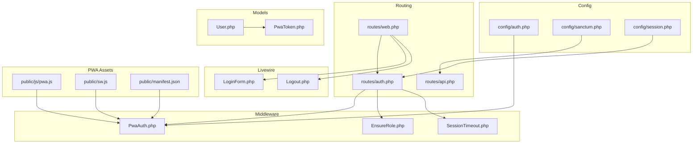
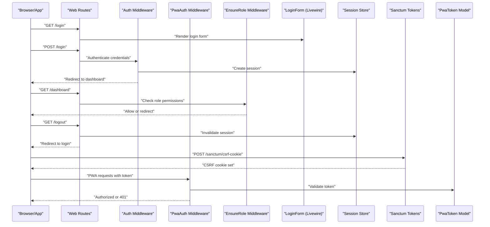
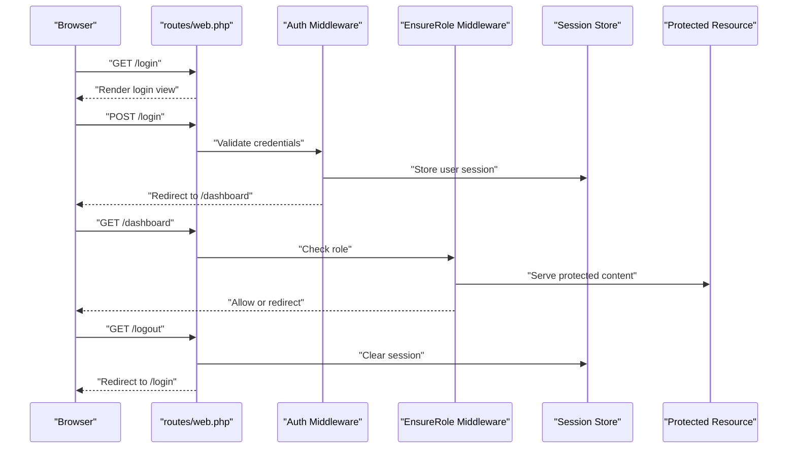
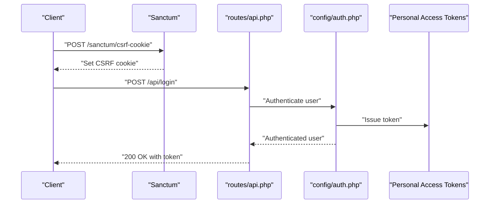
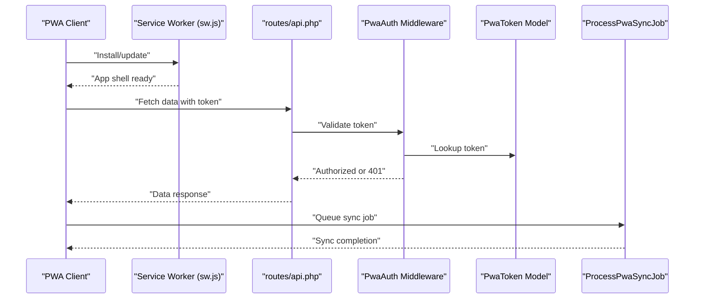
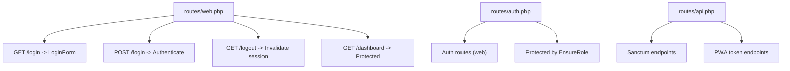
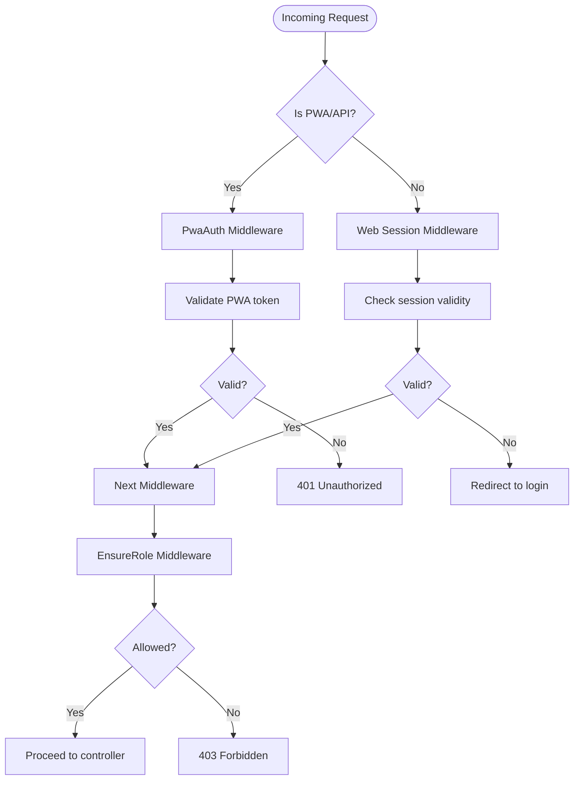
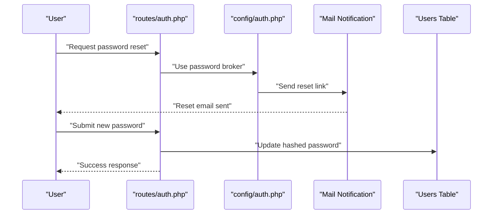
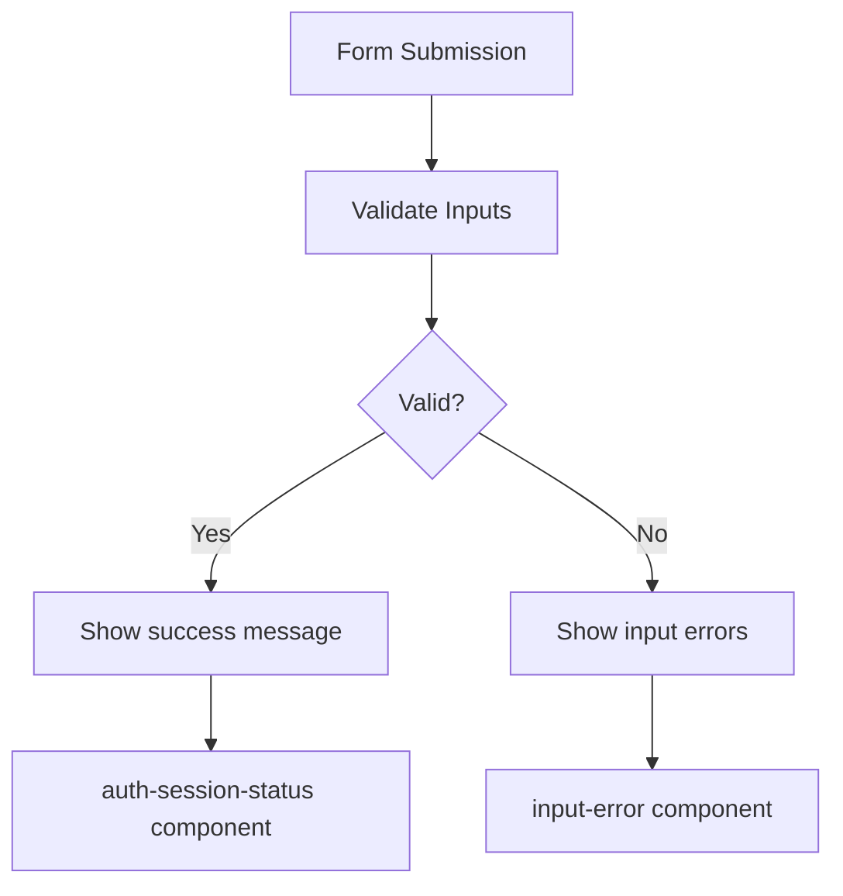
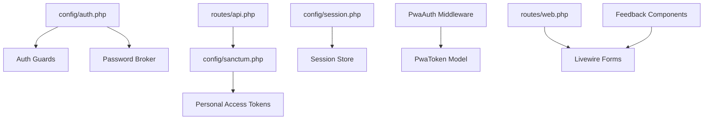

# Authentication Flow & Routes

<cite>
**Referenced Files in This Document**
- [routes/web.php](file://routes/web.php)
- [routes/auth.php](file://routes/auth.php)
- [routes/api.php](file://routes/api.php)
- [config/auth.php](file://config/auth.php)
- [config/sanctum.php](file://config/sanctum.php)
- [config/session.php](file://config/session.php)
- [app/Http/Middleware/PwaAuth.php](file://app/Http/Middleware/PwaAuth.php)
- [app/Http/Middleware/EnsureRole.php](file://app/Http/Middleware/EnsureRole.php)
- [app/Http/Middleware/SessionTimeout.php](file://app/Http/Middleware/SessionTimeout.php)
- [app/Livewire/Forms/LoginForm.php](file://app/Livewire/Forms/LoginForm.php)
- [app/Livewire/Actions/Logout.php](file://app/Livewire/Actions/Logout.php)
- [resources/views/livewire/pages/auth/login.blade.php](file://resources/views/livewire/pages/auth/login.blade.php)
- [resources/views/components/auth-session-status.blade.php](file://resources/views/components/auth-session-status.blade.php)
- [resources/views/components/input-error.blade.php](file://resources/views/components/input-error.blade.php)
- [public/js/pwa.js](file://public/js/pwa.js)
- [public/sw.js](file://public/sw.js)
- [public/manifest.json](file://public/manifest.json)
- [app/Models/User.php](file://app/Models/User.php)
- [app/Models/PwaToken.php](file://app/Models/PwaToken.php)
- [database/migrations/2026_06_01_010827_create_pwa_tokens_table.php](file://database/migrations/2026_06_01_010827_create_pwa_tokens_table.php)
- [database/migrations/2026_06_01_010828_create_remember_tokens_table.php](file://database/migrations/2026_06_01_010828_create_remember_tokens_table.php)
- [app/Jobs/ProcessPwaSyncJob.php](file://app/Jobs/ProcessPwaSyncJob.php)
</cite>

## Table of Contents
1. [Introduction](#introduction)
2. [Project Structure](#project-structure)
3. [Core Components](#core-components)
4. [Architecture Overview](#architecture-overview)
5. [Detailed Component Analysis](#detailed-component-analysis)
6. [Dependency Analysis](#dependency-analysis)
7. [Performance Considerations](#performance-considerations)
8. [Troubleshooting Guide](#troubleshooting-guide)
9. [Conclusion](#conclusion)

## Introduction
This document provides comprehensive documentation for the authentication flow and routing system in RaporKM Laravel. It covers the complete authentication journey from initial login through session establishment and protected resource access. The documentation details route definitions for authentication endpoints (login, logout, registration, and password reset), explains the separation between web and API authentication flows (including PWA functionality), and documents email verification, password reset workflows, and account confirmation procedures. It also includes examples of middleware application, route protection patterns, redirect handling, integration between traditional web authentication and modern PWA authentication, error handling, validation responses, and user feedback mechanisms.

## Project Structure
The authentication system spans routing, middleware, Livewire components, configuration, models, and PWA assets. Key areas include:
- Route definitions for web and API authentication
- Authentication middleware for role enforcement and PWA-specific checks
- Livewire forms and actions for login/logout
- Configuration for authentication guards, password reset, and Sanctum
- PWA token model and synchronization job
- Frontend components for user feedback and PWA integration

**Diagram sources**
- [routes/web.php](file://routes/web.php)
- [routes/auth.php](file://routes/auth.php)
- [routes/api.php](file://routes/api.php)
- [app/Http/Middleware/PwaAuth.php](file://app/Http/Middleware/PwaAuth.php)
- [app/Http/Middleware/EnsureRole.php](file://app/Http/Middleware/EnsureRole.php)
- [app/Http/Middleware/SessionTimeout.php](file://app/Http/Middleware/SessionTimeout.php)
- [app/Livewire/Forms/LoginForm.php](file://app/Livewire/Forms/LoginForm.php)
- [app/Livewire/Actions/Logout.php](file://app/Livewire/Actions/Logout.php)
- [config/auth.php](file://config/auth.php)
- [config/sanctum.php](file://config/sanctum.php)
- [config/session.php](file://config/session.php)
- [app/Models/User.php](file://app/Models/User.php)
- [app/Models/PwaToken.php](file://app/Models/PwaToken.php)
- [public/js/pwa.js](file://public/js/pwa.js)
- [public/sw.js](file://public/sw.js)
- [public/manifest.json](file://public/manifest.json)

**Section sources**
- [routes/web.php](file://routes/web.php)
- [routes/auth.php](file://routes/auth.php)
- [routes/api.php](file://routes/api.php)
- [config/auth.php](file://config/auth.php)
- [config/sanctum.php](file://config/sanctum.php)
- [config/session.php](file://config/session.php)

## Core Components
- Authentication routes: Define endpoints for login, logout, registration, password reset, and email verification.
- Middleware: Enforce role-based access, PWA authentication, and session timeout policies.
- Livewire forms/actions: Provide reactive login/logout flows integrated with Blade components.
- Configuration: Guards, password broker, Sanctum tokens, and session settings.
- PWA integration: Token-based authentication and service worker for offline-capable experiences.
- Feedback components: Display authentication status and validation errors.

**Section sources**
- [routes/auth.php](file://routes/auth.php)
- [app/Http/Middleware/PwaAuth.php](file://app/Http/Middleware/PwaAuth.php)
- [app/Http/Middleware/EnsureRole.php](file://app/Http/Middleware/EnsureRole.php)
- [app/Http/Middleware/SessionTimeout.php](file://app/Http/Middleware/SessionTimeout.php)
- [app/Livewire/Forms/LoginForm.php](file://app/Livewire/Forms/LoginForm.php)
- [app/Livewire/Actions/Logout.php](file://app/Livewire/Actions/Logout.php)
- [config/auth.php](file://config/auth.php)
- [config/sanctum.php](file://config/sanctum.php)
- [config/session.php](file://config/session.php)
- [public/js/pwa.js](file://public/js/pwa.js)

## Architecture Overview
The authentication architecture separates concerns between web and API flows while supporting PWA capabilities. Web authentication relies on sessions and CSRF protection, while API authentication leverages Sanctum tokens. PWA authentication extends API flows with persistent tokens stored via the PWA token model.

**Diagram sources**
- [routes/web.php](file://routes/web.php)
- [routes/auth.php](file://routes/auth.php)
- [app/Http/Middleware/PwaAuth.php](file://app/Http/Middleware/PwaAuth.php)
- [app/Http/Middleware/EnsureRole.php](file://app/Http/Middleware/EnsureRole.php)
- [app/Http/Middleware/SessionTimeout.php](file://app/Http/Middleware/SessionTimeout.php)
- [app/Livewire/Forms/LoginForm.php](file://app/Livewire/Forms/LoginForm.php)
- [app/Models/PwaToken.php](file://app/Models/PwaToken.php)
- [config/sanctum.php](file://config/sanctum.php)

## Detailed Component Analysis

### Web Authentication Flow
The web authentication flow uses session-based authentication with middleware for role enforcement and session timeout. The typical journey includes:
- Login page rendering via Livewire form
- Credential submission processed by authentication middleware
- Session creation and redirect to dashboard
- Role-based route protection
- Logout invalidating the session

**Diagram sources**
- [routes/web.php](file://routes/web.php)
- [app/Http/Middleware/EnsureRole.php](file://app/Http/Middleware/EnsureRole.php)
- [app/Http/Middleware/SessionTimeout.php](file://app/Http/Middleware/SessionTimeout.php)
- [app/Livewire/Forms/LoginForm.php](file://app/Livewire/Forms/LoginForm.php)
- [app/Livewire/Actions/Logout.php](file://app/Livewire/Actions/Logout.php)

**Section sources**
- [routes/web.php](file://routes/web.php)
- [app/Http/Middleware/EnsureRole.php](file://app/Http/Middleware/EnsureRole.php)
- [app/Http/Middleware/SessionTimeout.php](file://app/Http/Middleware/SessionTimeout.php)
- [app/Livewire/Forms/LoginForm.php](file://app/Livewire/Forms/LoginForm.php)
- [app/Livewire/Actions/Logout.php](file://app/Livewire/Actions/Logout.php)

### API Authentication Flow (Sanctum)
API authentication uses Laravel Sanctum for stateless token-based authentication. The flow includes:
- Requesting CSRF cookie for cross-site requests
- Authenticating via API endpoints
- Returning authenticated responses with token scopes

**Diagram sources**
- [routes/api.php](file://routes/api.php)
- [config/sanctum.php](file://config/sanctum.php)
- [config/auth.php](file://config/auth.php)

**Section sources**
- [routes/api.php](file://routes/api.php)
- [config/sanctum.php](file://config/sanctum.php)
- [config/auth.php](file://config/auth.php)

### PWA Authentication Flow
PWA authentication extends API flows with persistent token storage and offline capabilities:
- Service worker enables offline access
- Token persistence via PWA token model
- Background synchronization jobs
- Manifest and app shell support

**Diagram sources**
- [public/sw.js](file://public/sw.js)
- [routes/api.php](file://routes/api.php)
- [app/Http/Middleware/PwaAuth.php](file://app/Http/Middleware/PwaAuth.php)
- [app/Models/PwaToken.php](file://app/Models/PwaToken.php)
- [app/Jobs/ProcessPwaSyncJob.php](file://app/Jobs/ProcessPwaSyncJob.php)

**Section sources**
- [public/sw.js](file://public/sw.js)
- [routes/api.php](file://routes/api.php)
- [app/Http/Middleware/PwaAuth.php](file://app/Http/Middleware/PwaAuth.php)
- [app/Models/PwaToken.php](file://app/Models/PwaToken.php)
- [app/Jobs/ProcessPwaSyncJob.php](file://app/Jobs/ProcessPwaSyncJob.php)

### Authentication Routes
Key route groups and endpoints:
- Web routes: login, logout, registration, password reset, email verification
- API routes: Sanctum endpoints, PWA token management
- Protected routes: enforced by EnsureRole middleware

**Diagram sources**
- [routes/web.php](file://routes/web.php)
- [routes/auth.php](file://routes/auth.php)
- [routes/api.php](file://routes/api.php)
- [app/Http/Middleware/EnsureRole.php](file://app/Http/Middleware/EnsureRole.php)

**Section sources**
- [routes/web.php](file://routes/web.php)
- [routes/auth.php](file://routes/auth.php)
- [routes/api.php](file://routes/api.php)

### Middleware Application and Route Protection
- PwaAuth: Validates PWA tokens for API requests
- EnsureRole: Restricts access based on user roles
- SessionTimeout: Manages session lifecycle and idle timeouts
- Session-based auth: Uses session store for web flows

**Diagram sources**
- [app/Http/Middleware/PwaAuth.php](file://app/Http/Middleware/PwaAuth.php)
- [app/Http/Middleware/EnsureRole.php](file://app/Http/Middleware/EnsureRole.php)
- [app/Http/Middleware/SessionTimeout.php](file://app/Http/Middleware/SessionTimeout.php)

**Section sources**
- [app/Http/Middleware/PwaAuth.php](file://app/Http/Middleware/PwaAuth.php)
- [app/Http/Middleware/EnsureRole.php](file://app/Http/Middleware/EnsureRole.php)
- [app/Http/Middleware/SessionTimeout.php](file://app/Http/Middleware/SessionTimeout.php)

### Email Verification and Password Reset
- Email verification: Laravel default verification routes and notifications
- Password reset: Laravel password broker with email notifications
- Configuration: Defined in authentication configuration

**Diagram sources**
- [routes/auth.php](file://routes/auth.php)
- [config/auth.php](file://config/auth.php)

**Section sources**
- [routes/auth.php](file://routes/auth.php)
- [config/auth.php](file://config/auth.php)

### User Feedback and Validation Responses
- Auth session status: Displays success/error messages after auth actions
- Input error components: Render validation errors for form submissions
- Livewire forms: Reactive validation and submission handling

**Diagram sources**
- [resources/views/components/auth-session-status.blade.php](file://resources/views/components/auth-session-status.blade.php)
- [resources/views/components/input-error.blade.php](file://resources/views/components/input-error.blade.php)
- [app/Livewire/Forms/LoginForm.php](file://app/Livewire/Forms/LoginForm.php)

**Section sources**
- [resources/views/components/auth-session-status.blade.php](file://resources/views/components/auth-session-status.blade.php)
- [resources/views/components/input-error.blade.php](file://resources/views/components/input-error.blade.php)
- [app/Livewire/Forms/LoginForm.php](file://app/Livewire/Forms/LoginForm.php)

## Dependency Analysis
Authentication depends on configuration, middleware, models, and frontend components. The following diagram shows key dependencies:

**Diagram sources**
- [config/auth.php](file://config/auth.php)
- [config/sanctum.php](file://config/sanctum.php)
- [config/session.php](file://config/session.php)
- [app/Http/Middleware/PwaAuth.php](file://app/Http/Middleware/PwaAuth.php)
- [app/Models/PwaToken.php](file://app/Models/PwaToken.php)
- [routes/web.php](file://routes/web.php)
- [routes/api.php](file://routes/api.php)
- [resources/views/components/auth-session-status.blade.php](file://resources/views/components/auth-session-status.blade.php)
- [resources/views/components/input-error.blade.php](file://resources/views/components/input-error.blade.php)

**Section sources**
- [config/auth.php](file://config/auth.php)
- [config/sanctum.php](file://config/sanctum.php)
- [config/session.php](file://config/session.php)
- [app/Http/Middleware/PwaAuth.php](file://app/Http/Middleware/PwaAuth.php)
- [app/Models/PwaToken.php](file://app/Models/PwaToken.php)
- [routes/web.php](file://routes/web.php)
- [routes/api.php](file://routes/api.php)

## Performance Considerations
- Prefer Sanctum tokens for API-heavy clients to reduce session overhead
- Use PWA token model judiciously; avoid excessive token churn
- Leverage service worker caching for static assets and app shell
- Minimize middleware stack for public endpoints
- Cache frequently accessed user data with appropriate invalidation

## Troubleshooting Guide
Common issues and resolutions:
- Authentication fails silently: Verify CSRF cookie is present for API requests
- PWA requests unauthorized: Confirm PWA token exists and is valid
- Role-based access denied: Check EnsureRole middleware configuration and user roles
- Session timeout: Review session lifetime and timeout middleware settings
- Email verification failures: Validate mail configuration and notification delivery

**Section sources**
- [config/sanctum.php](file://config/sanctum.php)
- [app/Http/Middleware/PwaAuth.php](file://app/Http/Middleware/PwaAuth.php)
- [app/Http/Middleware/EnsureRole.php](file://app/Http/Middleware/EnsureRole.php)
- [app/Http/Middleware/SessionTimeout.php](file://app/Http/Middleware/SessionTimeout.php)
- [config/session.php](file://config/session.php)

## Conclusion
RaporKM Laravel implements a robust authentication system that supports both traditional web sessions and modern PWA token-based authentication. The architecture cleanly separates concerns across routing, middleware, configuration, and frontend components, enabling secure and scalable authentication flows. Proper middleware application, route protection patterns, and user feedback mechanisms ensure a smooth user experience across web and PWA contexts.