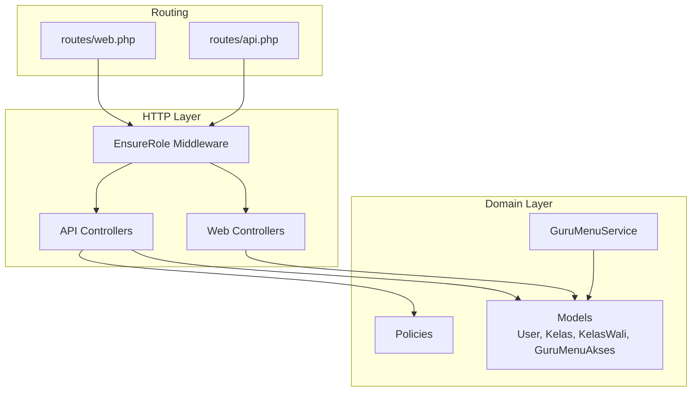
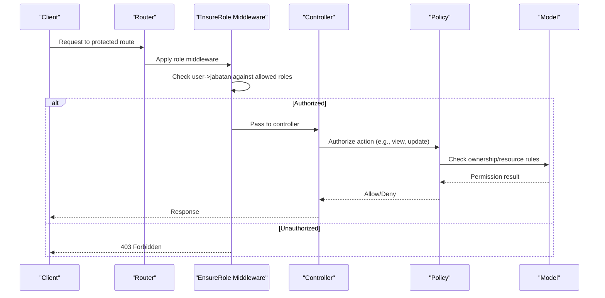
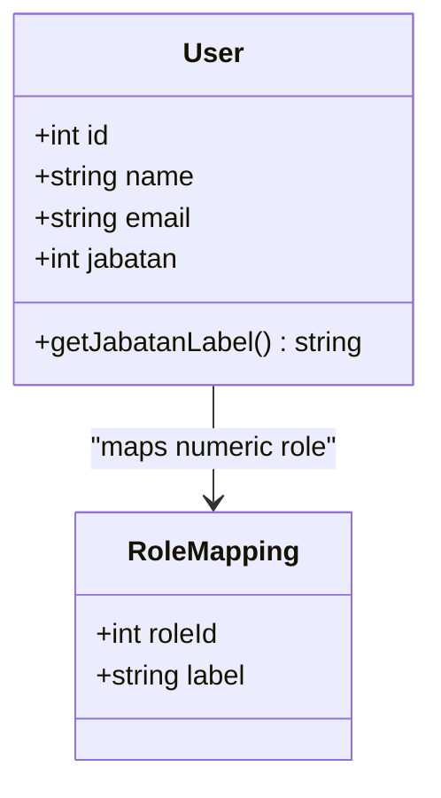
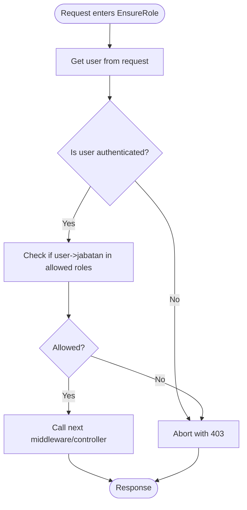
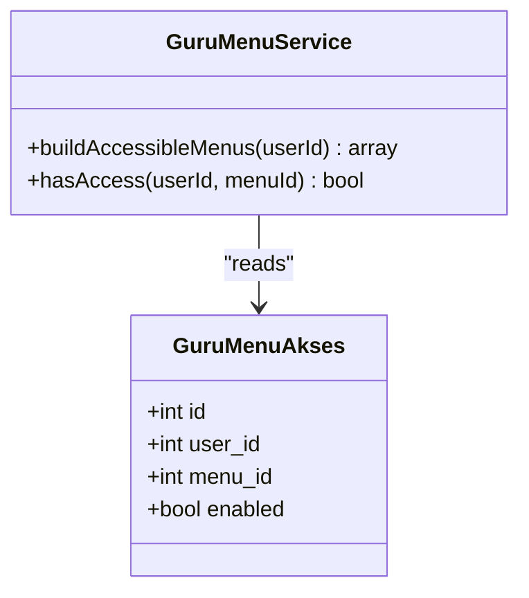
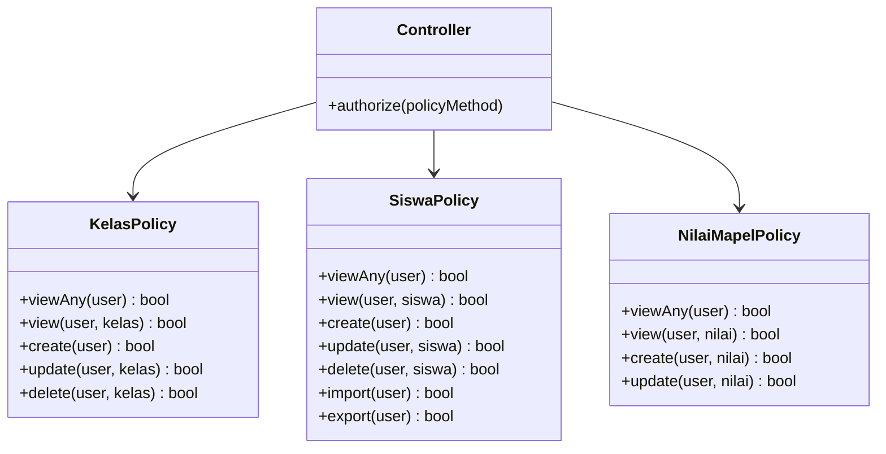
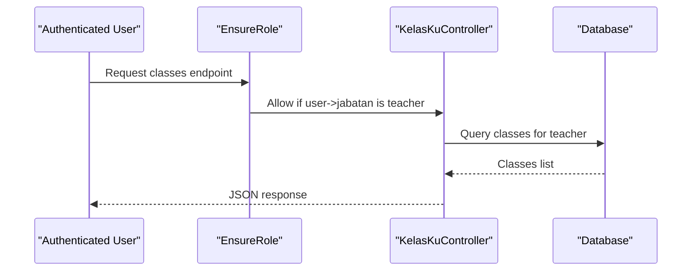
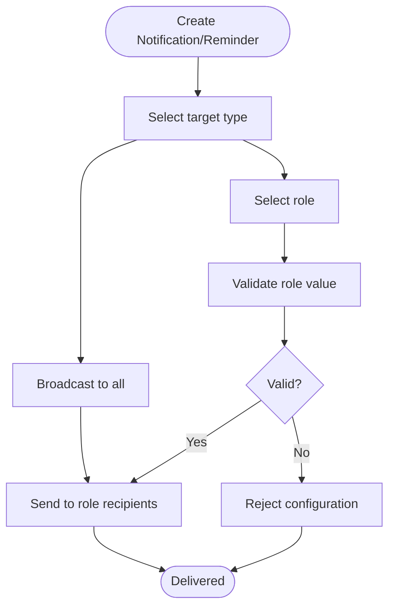
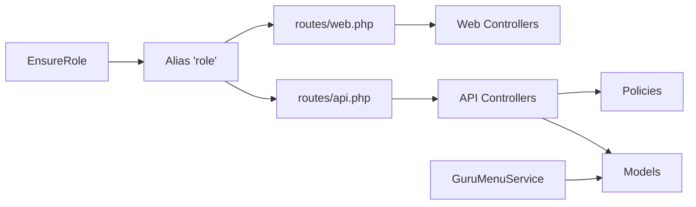

# Role-Based Access Control

<cite>
**Referenced Files in This Document**
- [EnsureRole.php](file://app/Http/Middleware/EnsureRole.php)
- [app.php](file://bootstrap/app.php)
- [PRD-rapor-migrasi.md](file://PRD-rapor-migrasi.md)
- [User.php](file://app/Models/User.php)
- [Kelas.php](file://app/Models/Kelas.php)
- [KelasWali.php](file://app/Models/KelasWali.php)
- [GuruMenuAkses.php](file://app/Models/GuruMenuAkses.php)
- [GuruMenuService.php](file://app/Services/GuruMenuService.php)
- [KelasKuController.php](file://app/Http/Controllers/Api/V1/Guru/KelasKuController.php)
- [KelasPolicy.php](file://app/Policies/KelasPolicy.php)
- [SiswaPolicy.php](file://app/Policies/SiswaPolicy.php)
- [NilaiMapelPolicy.php](file://app/Policies/NilaiMapelPolicy.php)
- [UserResource.php](file://app/Http/Resources/V1/UserResource.php)
- [PenggunaSyncService.php](file://app/Services/Dapodik/PenggunaSyncService.php)
- [Pengingat.php](file://app/Models/Pengingat.php)
- [PwaPushController.php](file://app/Http/Controllers/Api/PwaPushController.php)
- [PengaturanController.php](file://app/Http/Controllers/TU/PengaturanController.php)
- [AbsensiGuruController.php](file://app/Http/Controllers/Api/V1/Guru/AbsensiGuruController.php)
- [AbsensiGuruTuController.php](file://app/Http/Controllers/Api/V1/TU/AbsensiGuruTuController.php)
- [web.php](file://routes/web.php)
- [api.php](file://routes/api.php)
</cite>

## Table of Contents
1. [Introduction](#introduction)
2. [Project Structure](#project-structure)
3. [Core Components](#core-components)
4. [Architecture Overview](#architecture-overview)
5. [Detailed Component Analysis](#detailed-component-analysis)
6. [Dependency Analysis](#dependency-analysis)
7. [Performance Considerations](#performance-considerations)
8. [Troubleshooting Guide](#troubleshooting-guide)
9. [Conclusion](#conclusion)

## Introduction
This document explains the role-based access control (RBAC) system in RaporKM Laravel. It covers the three main roles (TU, Guru, Kepala Sekolah), the EnsureRole middleware, menu access controls for teachers, policy-based authorization, and practical examples for enforcing access in controllers and protecting sensitive operations.

## Project Structure
The RBAC system spans middleware, models, services, controllers, policies, and routes. Key areas:
- Middleware: EnsureRole validates user roles for protected routes
- Models: User, Kelas, KelasWali, GuruMenuAkses define role semantics and relationships
- Services: GuruMenuService manages teacher menu access
- Controllers: API endpoints enforce role checks and apply policies
- Policies: Class-level and resource-level authorization rules
- Routes: Grouped routes with role middleware

**Diagram sources**
- [EnsureRole.php:1-25](file://app/Http/Middleware/EnsureRole.php#L1-L25)
- [app.php:18-28](file://bootstrap/app.php#L18-L28)
- [GuruMenuService.php](file://app/Services/GuruMenuService.php)
- [KelasKuController.php:1-50](file://app/Http/Controllers/Api/V1/Guru/KelasKuController.php#L1-L50)

**Section sources**
- [app.php:18-28](file://bootstrap/app.php#L18-L28)
- [PRD-rapor-migrasi.md:856-874](file://PRD-rapor-migrasi.md#L856-L874)

## Core Components
- Roles and User Model
  - Users have a numeric role field (jabatan) used for access control
  - Role labels are mapped for display and notifications
- EnsureRole Middleware
  - Validates that the authenticated user's role matches the route's allowed roles
  - Aborts with 403 when unauthorized
- Policy Layer
  - Class policies (KelasPolicy, SiswaPolicy, NilaiMapelPolicy) define granular permissions
  - Resource-level checks restrict operations per user and entity
- Menu Access for Teachers
  - GuruMenuAkses and GuruMenuService manage visible menu items per teacher
- Route Protection
  - Routes grouped under role-specific prefixes apply EnsureRole middleware

**Section sources**
- [User.php](file://app/Models/User.php)
- [UserResource.php:1-25](file://app/Http/Resources/V1/UserResource.php#L1-L25)
- [EnsureRole.php:1-25](file://app/Http/Middleware/EnsureRole.php#L1-L25)
- [KelasPolicy.php](file://app/Policies/KelasPolicy.php)
- [SiswaPolicy.php](file://app/Policies/SiswaPolicy.php)
- [NilaiMapelPolicy.php](file://app/Policies/NilaiMapelPolicy.php)
- [GuruMenuAkses.php](file://app/Models/GuruMenuAkses.php)
- [GuruMenuService.php](file://app/Services/GuruMenuService.php)
- [web.php](file://routes/web.php)
- [api.php](file://routes/api.php)

## Architecture Overview
The RBAC architecture enforces role-based access at the HTTP boundary via middleware, delegates authorization decisions to policies, and maintains role semantics in models and services.

**Diagram sources**
- [EnsureRole.php:1-25](file://app/Http/Middleware/EnsureRole.php#L1-L25)
- [KelasPolicy.php](file://app/Policies/KelasPolicy.php)
- [SiswaPolicy.php](file://app/Policies/SiswaPolicy.php)
- [NilaiMapelPolicy.php](file://app/Policies/NilaiMapelPolicy.php)

## Detailed Component Analysis

### Roles and User Model
- Role hierarchy and labels
  - Numeric role identifiers are used for enforcement
  - Labels map numeric roles to readable names for UI and notifications
- Role assignment and synchronization
  - Role values are derived from external data (Dapodik sync service)
  - Existing users are matched and updated based on role metadata

**Diagram sources**
- [User.php](file://app/Models/User.php)
- [UserResource.php:1-25](file://app/Http/Resources/V1/UserResource.php#L1-L25)
- [PenggunaSyncService.php:54-119](file://app/Services/Dapodik/PenggunaSyncService.php#L54-L119)

**Section sources**
- [UserResource.php:1-25](file://app/Http/Resources/V1/UserResource.php#L1-L25)
- [PenggunaSyncService.php:54-119](file://app/Services/Dapodik/PenggunaSyncService.php#L54-L119)

### EnsureRole Middleware
- Purpose
  - Validates that the authenticated user's role matches the route's allowed roles
  - Returns 403 if the user lacks permission
- Registration
  - Registered under alias "role" in middleware groups
- Usage
  - Applied to route groups for TU and Guru to restrict access

**Diagram sources**
- [EnsureRole.php:1-25](file://app/Http/Middleware/EnsureRole.php#L1-L25)
- [app.php:18-28](file://bootstrap/app.php#L18-L28)

**Section sources**
- [EnsureRole.php:1-25](file://app/Http/Middleware/EnsureRole.php#L1-L25)
- [app.php:18-28](file://bootstrap/app.php#L18-L28)
- [PRD-rapor-migrasi.md:858-867](file://PRD-rapor-migrasi.md#L858-L867)

### Teacher Menu Access System
- Data model
  - GuruMenuAkses stores teacher-specific menu visibility
- Service logic
  - GuruMenuService builds accessible menus per teacher based on role and permissions
- Integration
  - Used by teacher views to render only permitted navigation items

**Diagram sources**
- [GuruMenuAkses.php](file://app/Models/GuruMenuAkses.php)
- [GuruMenuService.php](file://app/Services/GuruMenuService.php)

**Section sources**
- [GuruMenuAkses.php](file://app/Models/GuruMenuAkses.php)
- [GuruMenuService.php](file://app/Services/GuruMenuService.php)

### Policy-Based Authorization
- Class policies
  - KelasPolicy: viewAny, view, create, update, delete
  - SiswaPolicy: viewAny, view, create, update, delete, import, export
  - NilaiMapelPolicy: viewAny, view, create, update (restricts to teacher's own classes)
- Resource-level checks
  - Policies verify ownership and role constraints before allowing actions
- Practical examples
  - Controllers call policy methods to authorize operations
  - API endpoints enforce role middleware and policy gates

**Diagram sources**
- [KelasPolicy.php](file://app/Policies/KelasPolicy.php)
- [SiswaPolicy.php](file://app/Policies/SiswaPolicy.php)
- [NilaiMapelPolicy.php](file://app/Policies/NilaiMapelPolicy.php)

**Section sources**
- [PRD-rapor-migrasi.md:869-874](file://PRD-rapor-migrasi.md#L869-L874)
- [KelasPolicy.php](file://app/Policies/KelasPolicy.php)
- [SiswaPolicy.php](file://app/Policies/SiswaPolicy.php)
- [NilaiMapelPolicy.php](file://app/Policies/NilaiMapelPolicy.php)

### Role Checking in Controllers
- Example: Teacher class retrieval
  - Controller queries classes associated with the authenticated teacher
  - EnsureRole middleware guarantees the user is a teacher
- Example: Absence tracking
  - Controllers for teacher absence and TU oversight demonstrate role-specific data access

**Diagram sources**
- [KelasKuController.php:1-50](file://app/Http/Controllers/Api/V1/Guru/KelasKuController.php#L1-L50)
- [EnsureRole.php:1-25](file://app/Http/Middleware/EnsureRole.php#L1-L25)

**Section sources**
- [KelasKuController.php:1-50](file://app/Http/Controllers/Api/V1/Guru/KelasKuController.php#L1-L50)
- [AbsensiGuruController.php:1-50](file://app/Http/Controllers/Api/V1/Guru/AbsensiGuruController.php#L1-L50)
- [AbsensiGuruTuController.php:1-80](file://app/Http/Controllers/Api/V1/TU/AbsensiGuruTuController.php#L1-L80)

### Protecting Sensitive Operations
- Role-based notifications and broadcasts
  - Push notifications target specific roles (TU, Guru, Kepala Sekolah)
  - Settings validate role targets and prevent invalid configurations
- Reminder distribution
  - Reminders can be targeted to specific roles for timely communication

**Diagram sources**
- [PwaPushController.php:80-100](file://app/Http/Controllers/Api/PwaPushController.php#L80-L100)
- [PengaturanController.php:80-100](file://app/Http/Controllers/TU/PengaturanController.php#L80-L100)
- [Pengingat.php:1-30](file://app/Models/Pengingat.php#L1-L30)

**Section sources**
- [PwaPushController.php:80-100](file://app/Http/Controllers/Api/PwaPushController.php#L80-L100)
- [PengaturanController.php:80-100](file://app/Http/Controllers/TU/PengaturanController.php#L80-L100)
- [Pengingat.php:1-30](file://app/Models/Pengingat.php#L1-L30)

## Dependency Analysis
- Middleware registration
  - EnsureRole is registered under alias "role" and applied to web and API routes
- Route protection
  - Routes are grouped by role (e.g., "/tu", "/guru") and protected by EnsureRole
- Model relationships
  - User-role relationships and class-teacher associations underpin authorization decisions
- Service integration
  - GuruMenuService depends on GuruMenuAkses and User models

**Diagram sources**
- [app.php:18-28](file://bootstrap/app.php#L18-L28)
- [web.php](file://routes/web.php)
- [api.php](file://routes/api.php)
- [GuruMenuService.php](file://app/Services/GuruMenuService.php)

**Section sources**
- [app.php:18-28](file://bootstrap/app.php#L18-L28)
- [web.php](file://routes/web.php)
- [api.php](file://routes/api.php)

## Performance Considerations
- Middleware efficiency
  - EnsureRole performs a single role comparison; keep middleware lightweight
- Policy evaluation
  - Policies should minimize database queries; eager-load relations when needed
- Menu access computation
  - Cache frequently accessed menu structures per teacher to reduce repeated computations
- Database joins
  - EnsureRole-related queries avoid ambiguous column names by scoping properly

## Troubleshooting Guide
- 403 Forbidden errors
  - Verify the user's role (jabatan) aligns with the route's allowed roles
  - Confirm EnsureRole middleware is applied to the route group
- Ambiguous column errors
  - Ensure database joins specify table prefixes for shared column names
- Role mismatch after sync
  - Confirm Dapodik sync service correctly maps role strings to numeric values
- Menu visibility issues
  - Check GuruMenuAkses entries and GuruMenuService logic for the specific teacher

**Section sources**
- [EnsureRole.php:1-25](file://app/Http/Middleware/EnsureRole.php#L1-L25)
- [PenggunaSyncService.php:54-119](file://app/Services/Dapodik/PenggunaSyncService.php#L54-L119)
- [GuruMenuAkses.php](file://app/Models/GuruMenuAkses.php)
- [GuruMenuService.php](file://app/Services/GuruMenuService.php)

## Conclusion
RaporKM Laravel implements a clear RBAC system centered on the EnsureRole middleware, numeric role semantics, and policy-based authorization. The system grants distinct capabilities to TU, Guru, and Kepala Sekolah while enabling customizable teacher menu access and protecting sensitive operations through role-targeted communications.