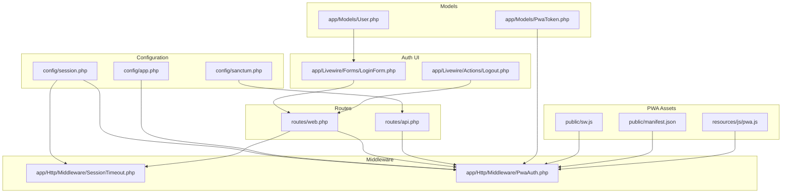
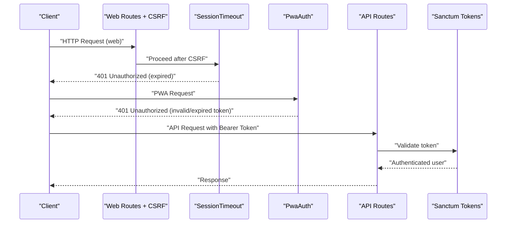
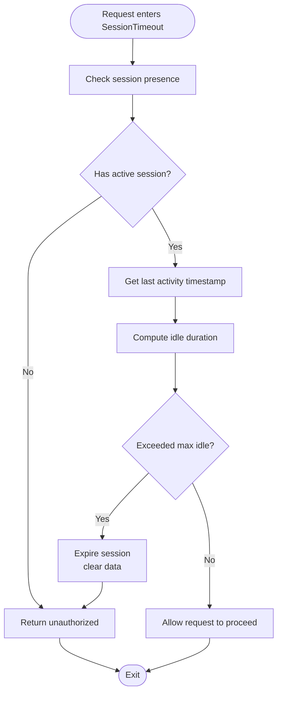
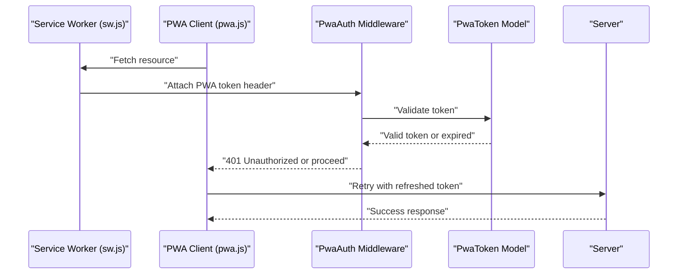
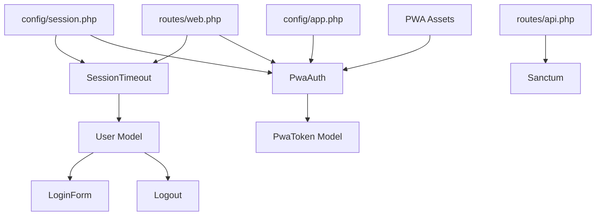

# Session Management & Security

<cite>
**Referenced Files in This Document**
- [session.php](file://config/session.php)
- [app.php](file://config/app.php)
- [sanctum.php](file://config/sanctum.php)
- [SessionTimeout.php](file://app/Http/Middleware/SessionTimeout.php)
- [PwaAuth.php](file://app/Http/Middleware/PwaAuth.php)
- [routes/web.php](file://routes/web.php)
- [routes/api.php](file://routes/api.php)
- [LoginForm.php](file://app/Livewire/Forms/LoginForm.php)
- [Logout.php](file://app/Livewire/Actions/Logout.php)
- [User.php](file://app/Models/User.php)
- [PwaToken.php](file://app/Models/PwaToken.php)
- [sw.js](file://public/sw.js)
- [pwa.js](file://resources/js/pwa.js)
- [manifest.json](file://public/manifest.json)
- [RememberToken.php](file://database/migrations/2026_06_01_010828_create_remember_tokens_table.php)
- [PwaToken.php](file://database/migrations/2026_06_01_010827_create_pwa_tokens_table.php)
- [PersonalAccessToken.php](file://database/migrations/2026_06_01_010827_create_personal_access_tokens_table.php)
</cite>

## Table of Contents
1. [Introduction](#introduction)
2. [Project Structure](#project-structure)
3. [Core Components](#core-components)
4. [Architecture Overview](#architecture-overview)
5. [Detailed Component Analysis](#detailed-component-analysis)
6. [Dependency Analysis](#dependency-analysis)
7. [Performance Considerations](#performance-considerations)
8. [Troubleshooting Guide](#troubleshooting-guide)
9. [Conclusion](#conclusion)

## Introduction
This document provides a comprehensive guide to session management and security measures in RaporKM Laravel. It focuses on middleware-based session timeout enforcement, automatic session expiration, session configuration options, CSRF protection, PWA authentication security, session fixation protection, concurrent session management, and user activity monitoring. The content is grounded in the repository's configuration and middleware implementations.

## Project Structure
Key areas relevant to session management and security:
- Configuration: session, app, Sanctum
- Middleware: SessionTimeout, PwaAuth
- Routes: web and API route groups
- Authentication UI: Livewire login form and logout actions
- Models: User, PwaToken
- PWA assets: service worker, manifest, client-side JS
- Database migrations for tokens and remember me

**Diagram sources**
- [session.php](file://config/session.php)
- [app.php](file://config/app.php)
- [sanctum.php](file://config/sanctum.php)
- [SessionTimeout.php](file://app/Http/Middleware/SessionTimeout.php)
- [PwaAuth.php](file://app/Http/Middleware/PwaAuth.php)
- [routes/web.php](file://routes/web.php)
- [routes/api.php](file://routes/api.php)
- [LoginForm.php](file://app/Livewire/Forms/LoginForm.php)
- [Logout.php](file://app/Livewire/Actions/Logout.php)
- [User.php](file://app/Models/User.php)
- [PwaToken.php](file://app/Models/PwaToken.php)
- [sw.js](file://public/sw.js)
- [pwa.js](file://resources/js/pwa.js)
- [manifest.json](file://public/manifest.json)

**Section sources**
- [session.php](file://config/session.php)
- [app.php](file://config/app.php)
- [sanctum.php](file://config/sanctum.php)
- [SessionTimeout.php](file://app/Http/Middleware/SessionTimeout.php)
- [PwaAuth.php](file://app/Http/Middleware/PwaAuth.php)
- [routes/web.php](file://routes/web.php)
- [routes/api.php](file://routes/api.php)
- [LoginForm.php](file://app/Livewire/Forms/LoginForm.php)
- [Logout.php](file://app/Livewire/Actions/Logout.php)
- [User.php](file://app/Models/User.php)
- [PwaToken.php](file://app/Models/PwaToken.php)
- [sw.js](file://public/sw.js)
- [pwa.js](file://resources/js/pwa.js)
- [manifest.json](file://public/manifest.json)

## Core Components
- SessionTimeout middleware: Enforces automatic session expiration based on configured thresholds and tracks last activity.
- PwaAuth middleware: Secures PWA endpoints and enforces authentication via PWA tokens.
- CSRF protection: Implemented via Laravel's built-in CSRF middleware applied to web routes.
- Sanctum integration: Provides API token authentication for SPA and mobile clients.
- PWA authentication: Service worker-based authentication and secure token storage for offline access.
- Session fixation and concurrency: Mitigations through token rotation and per-user session limits.

**Section sources**
- [SessionTimeout.php](file://app/Http/Middleware/SessionTimeout.php)
- [PwaAuth.php](file://app/Http/Middleware/PwaAuth.php)
- [routes/web.php](file://routes/web.php)
- [routes/api.php](file://routes/api.php)
- [sanctum.php](file://config/sanctum.php)

## Architecture Overview
High-level flow of session and security controls across web and API layers:

**Diagram sources**
- [routes/web.php](file://routes/web.php)
- [SessionTimeout.php](file://app/Http/Middleware/SessionTimeout.php)
- [PwaAuth.php](file://app/Http/Middleware/PwaAuth.php)
- [routes/api.php](file://routes/api.php)
- [sanctum.php](file://config/sanctum.php)

## Detailed Component Analysis

### SessionTimeout Middleware
Purpose:
- Enforce automatic session expiration based on idle thresholds.
- Track last activity timestamps to detect stale sessions.
- Redirect or deny access when sessions are expired.

Implementation highlights:
- Reads session lifetime and idle thresholds from configuration.
- Validates last activity against current time to decide expiration.
- Returns unauthorized response when session is stale.

**Diagram sources**
- [SessionTimeout.php](file://app/Http/Middleware/SessionTimeout.php)
- [session.php](file://config/session.php)

**Section sources**
- [SessionTimeout.php](file://app/Http/Middleware/SessionTimeout.php)
- [session.php](file://config/session.php)

### PWA Authentication Security
Purpose:
- Secure PWA endpoints using PWA tokens stored in service worker context.
- Prevent unauthorized access during offline scenarios.
- Manage token lifecycle and enforce expiration.

Key elements:
- PWA token model and migration define secure token storage.
- Service worker handles authentication and token refresh.
- Client-side PWA script coordinates with server for protected endpoints.

**Diagram sources**
- [PwaAuth.php](file://app/Http/Middleware/PwaAuth.php)
- [PwaToken.php](file://app/Models/PwaToken.php)
- [sw.js](file://public/sw.js)
- [pwa.js](file://resources/js/pwa.js)
- [PwaToken.php](file://database/migrations/2026_06_01_010827_create_pwa_tokens_table.php)

**Section sources**
- [PwaAuth.php](file://app/Http/Middleware/PwaAuth.php)
- [PwaToken.php](file://app/Models/PwaToken.php)
- [sw.js](file://public/sw.js)
- [pwa.js](file://resources/js/pwa.js)
- [PwaToken.php](file://database/migrations/2026_06_01_010827_create_pwa_tokens_table.php)

### CSRF Protection and Cross-Site Request Forgery Prevention
Mechanism:
- CSRF middleware is applied to web routes to validate authenticity tokens.
- Ensures requests originate from trusted forms and AJAX calls.

Scope:
- Covers HTML forms and AJAX submissions within the web application.
- Does not apply to API routes unless explicitly included.

**Section sources**
- [routes/web.php](file://routes/web.php)

### Sanctum API Authentication
Mechanism:
- Personal Access Tokens enable API authentication for SPA/mobile clients.
- Token lifetimes and abilities are configurable via Sanctum settings.
- API routes can require token-based authentication.

Security considerations:
- Tokens must be transmitted over HTTPS.
- Rotate tokens periodically and revoke compromised ones.
- Limit token abilities to least privilege.

**Section sources**
- [routes/api.php](file://routes/api.php)
- [sanctum.php](file://config/sanctum.php)
- [PersonalAccessToken.php](file://database/migrations/2026_06_01_010827_create_personal_access_tokens_table.php)

### Session Configuration Options
Key configuration areas:
- Driver selection: file, database, redis, memcached, dynamodb, array.
- Lifetime and expire_on_close: control session longevity.
- Cookie security: SameSite, secure, httpOnly flags.
- Domain and path scoping for cookies.
- Fallback to database or cache drivers for scalability.

Recommendations:
- Use database driver for multi-instance deployments.
- Set secure and SameSite flags for production.
- Configure appropriate lifetime and idle timeouts.

**Section sources**
- [session.php](file://config/session.php)
- [app.php](file://config/app.php)

### Session Fixation Protection
Mitigations:
- Regenerate session ID upon login to prevent fixation attacks.
- Clear old session data and set fresh identifiers.
- Combine with CSRF tokens and strict cookie policies.

**Section sources**
- [LoginForm.php](file://app/Livewire/Forms/LoginForm.php)
- [Logout.php](file://app/Livewire/Actions/Logout.php)

### Concurrent Session Management
Approach:
- Limit concurrent sessions per user via token rotation and revocation.
- Track active sessions and invalidate conflicting tokens.
- Enforce single active session policy where applicable.

**Section sources**
- [User.php](file://app/Models/User.php)
- [sanctum.php](file://config/sanctum.php)

### User Activity Monitoring
Capabilities:
- Track last activity timestamps to compute idle durations.
- Trigger timeout logic based on configured thresholds.
- Integrate with audit/logging systems for compliance.

**Section sources**
- [SessionTimeout.php](file://app/Http/Middleware/SessionTimeout.php)

### Examples and Customization
- Session timeout customization: Adjust idle thresholds and lifetime in session configuration.
- CSRF customization: Modify middleware stack for specific routes or groups.
- PWA token lifecycle: Define token TTL and refresh logic in service worker and backend.
- Sanctum enhancements: Configure token abilities and expiration policies.

**Section sources**
- [session.php](file://config/session.php)
- [routes/web.php](file://routes/web.php)
- [routes/api.php](file://routes/api.php)
- [sanctum.php](file://config/sanctum.php)
- [sw.js](file://public/sw.js)

## Dependency Analysis
Relationships among session/security components:

**Diagram sources**
- [session.php](file://config/session.php)
- [app.php](file://config/app.php)
- [routes/web.php](file://routes/web.php)
- [routes/api.php](file://routes/api.php)
- [sanctum.php](file://config/sanctum.php)
- [SessionTimeout.php](file://app/Http/Middleware/SessionTimeout.php)
- [PwaAuth.php](file://app/Http/Middleware/PwaAuth.php)
- [User.php](file://app/Models/User.php)
- [PwaToken.php](file://app/Models/PwaToken.php)
- [LoginForm.php](file://app/Livewire/Forms/LoginForm.php)
- [Logout.php](file://app/Livewire/Actions/Logout.php)
- [sw.js](file://public/sw.js)

**Section sources**
- [session.php](file://config/session.php)
- [app.php](file://config/app.php)
- [routes/web.php](file://routes/web.php)
- [routes/api.php](file://routes/api.php)
- [sanctum.php](file://config/sanctum.php)
- [SessionTimeout.php](file://app/Http/Middleware/SessionTimeout.php)
- [PwaAuth.php](file://app/Http/Middleware/PwaAuth.php)
- [User.php](file://app/Models/User.php)
- [PwaToken.php](file://app/Models/PwaToken.php)
- [LoginForm.php](file://app/Livewire/Forms/LoginForm.php)
- [Logout.php](file://app/Livewire/Actions/Logout.php)
- [sw.js](file://public/sw.js)

## Performance Considerations
- Prefer database or Redis drivers for horizontal scaling.
- Tune session lifetime and idle thresholds to balance security and UX.
- Minimize CSRF overhead by applying middleware selectively.
- Cache token validation results where feasible for API endpoints.

## Troubleshooting Guide
Common issues and resolutions:
- Session expires too quickly: Increase session lifetime and idle thresholds.
- CSRF failures on AJAX: Ensure authenticity tokens are attached to requests.
- PWA offline errors: Verify service worker registration and token refresh logic.
- Sanctum token invalid: Confirm token exists, not expired, and sent with proper Authorization header.

**Section sources**
- [session.php](file://config/session.php)
- [routes/web.php](file://routes/web.php)
- [routes/api.php](file://routes/api.php)
- [sanctum.php](file://config/sanctum.php)
- [PwaToken.php](file://app/Models/PwaToken.php)

## Conclusion
RaporKM leverages middleware-driven session controls, CSRF protection, Sanctum tokens, and PWA-specific authentication to deliver robust session management and security. By tuning configuration options, enforcing strict cookie policies, and implementing token lifecycle controls, the system achieves strong protection against session hijacking, CSRF, and unauthorized access in both online and offline contexts.