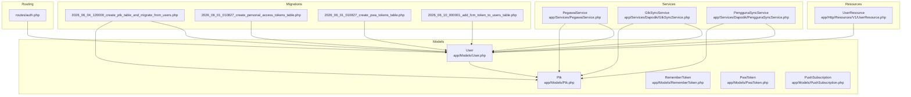
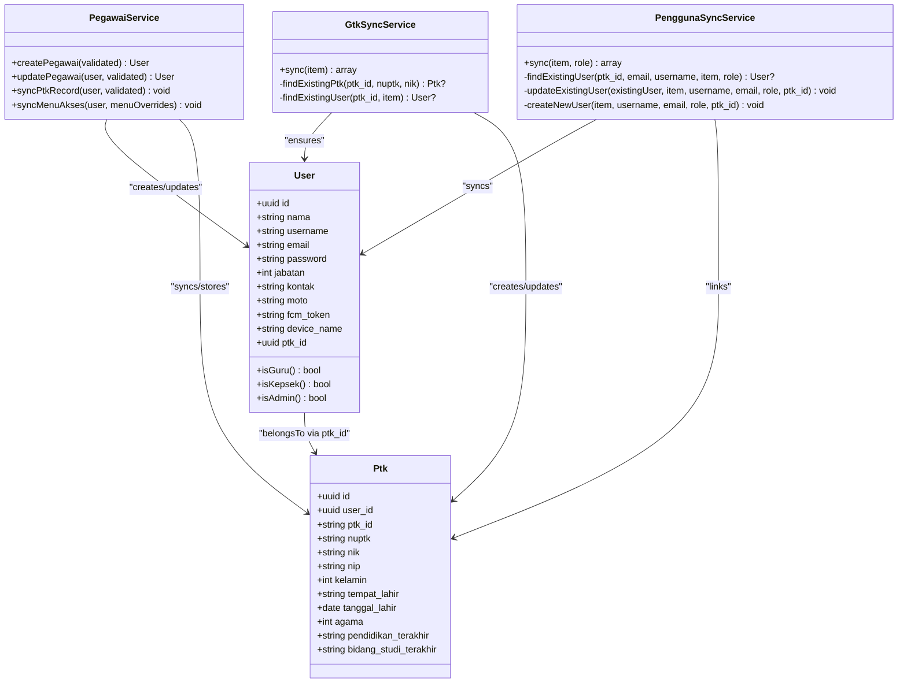
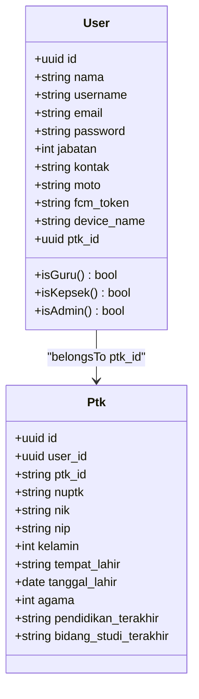
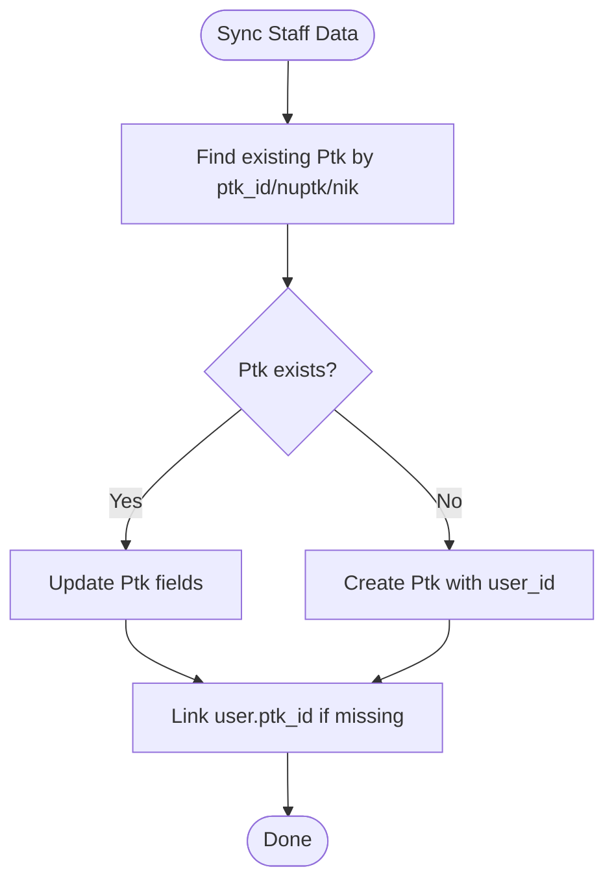
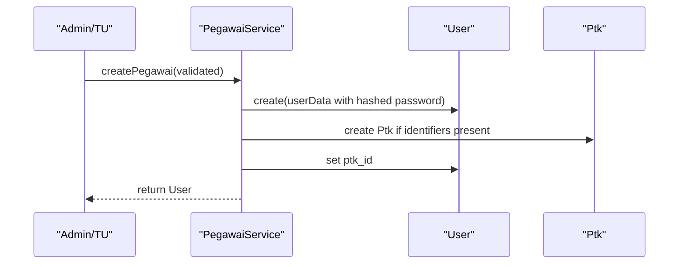
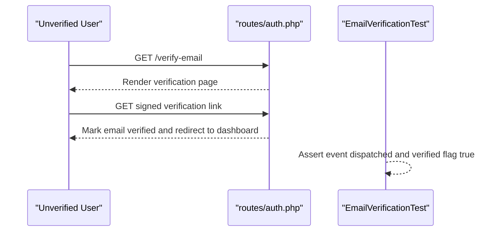
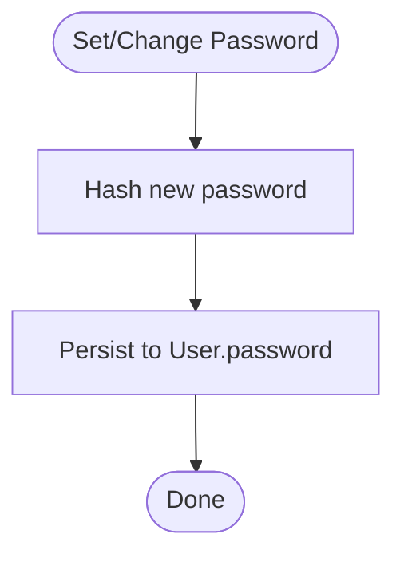
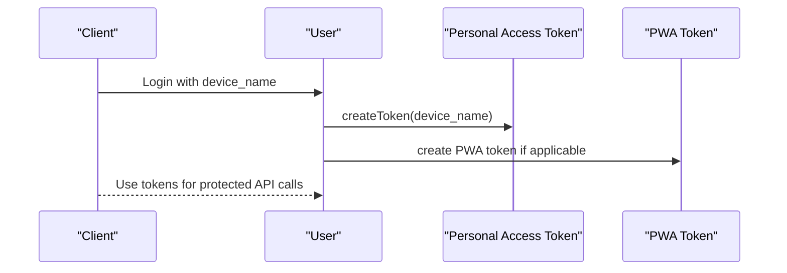
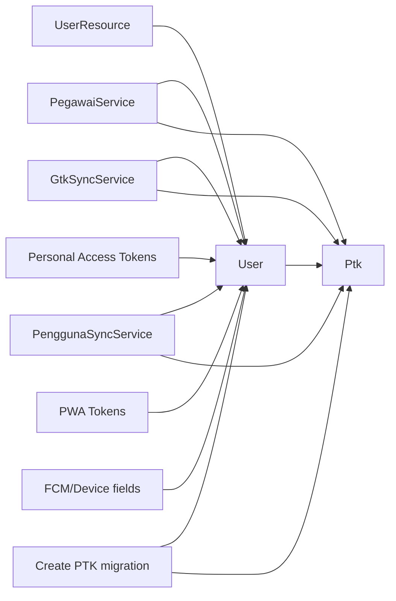

# User Management

<cite>
**Referenced Files in This Document**
- [User.php](file://app/Models/User.php)
- [Ptk.php](file://app/Models/Ptk.php)
- [UserResource.php](file://app/Http/Resources/V1/UserResource.php)
- [PegawaiService.php](file://app/Services/PegawaiService.php)
- [GtkSyncService.php](file://app/Services/Dapodik/GtkSyncService.php)
- [PenggunaSyncService.php](file://app/Services/Dapodik/PenggunaSyncService.php)
- [2026_06_04_120000_create_ptk_table_and_migrate_from_users.php](file://database/migrations/2026_06_04_120000_create_ptk_table_and_migrate_from_users.php)
- [2026_06_01_010827_create_personal_access_tokens_table.php](file://database/migrations/2026_06_01_010827_create_personal_access_tokens_table.php)
- [2026_06_01_010827_create_pwa_tokens_table.php](file://database/migrations/2026_06_01_010827_create_pwa_tokens_table.php)
- [2026_06_10_000001_add_fcm_token_to_users_table.php](file://database/migrations/2026_06_10_000001_add_fcm_token_to_users_table.php)
- [auth.php](file://routes/auth.php)
- [EmailVerificationTest.php](file://tests/Feature/Auth/EmailVerificationTest.php)
- [AuthTest.php](file://tests/Feature/Api/V1/AuthTest.php)
- [LoginForm.php](file://app/Livewire/Forms/LoginForm.php)
- [RememberToken.php](file://app/Models/RememberToken.php)
- [PwaToken.php](file://app/Models/PwaToken.php)
- [PushSubscription.php](file://app/Models/PushSubscription.php)
- [UserPolicy.php](file://app/Policies/UserPolicy.php)
- [UserFactory.php](file://database/factories/UserFactory.php)
- [UserSeeder.php](file://database/seeders/UserSeeder.php)
</cite>

## Table of Contents
1. [Introduction](#introduction)
2. [Project Structure](#project-structure)
3. [Core Components](#core-components)
4. [Architecture Overview](#architecture-overview)
5. [Detailed Component Analysis](#detailed-component-analysis)
6. [Dependency Analysis](#dependency-analysis)
7. [Performance Considerations](#performance-considerations)
8. [Troubleshooting Guide](#troubleshooting-guide)
9. [Conclusion](#conclusion)

## Introduction
This document describes the user management system in RaporKM Laravel, focusing on the User model, relationships with staff (PTK) entities, role assignments, registration and verification workflows, password management, profile operations, authentication tokens, session handling, and integration with staff records for teachers and administrators. It synthesizes implementation details from migration files, service classes, models, resources, policies, and tests to provide a comprehensive yet accessible guide.

## Project Structure
The user management system spans several layers:
- Models define domain entities and relationships (User, Ptk).
- Services encapsulate business logic for user creation, updates, and synchronization with staff records.
- Migrations establish schema and relationships, including pivot-like integration between users and staff.
- Resources shape serialized API responses.
- Routes and controllers handle authentication flows.
- Tests verify email verification, token handling, and access control.

**Diagram sources**
- [User.php](file://app/Models/User.php)
- [Ptk.php](file://app/Models/Ptk.php)
- [PegawaiService.php](file://app/Services/PegawaiService.php)
- [GtkSyncService.php](file://app/Services/Dapodik/GtkSyncService.php)
- [PenggunaSyncService.php](file://app/Services/Dapodik/PenggunaSyncService.php)
- [UserResource.php](file://app/Http/Resources/V1/UserResource.php)
- [2026_06_04_120000_create_ptk_table_and_migrate_from_users.php](file://database/migrations/2026_06_04_120000_create_ptk_table_and_migrate_from_users.php)
- [2026_06_01_010827_create_personal_access_tokens_table.php](file://database/migrations/2026_06_01_010827_create_personal_access_tokens_table.php)
- [2026_06_01_010827_create_pwa_tokens_table.php](file://database/migrations/2026_06_01_010827_create_pwa_tokens_table.php)
- [2026_06_10_000001_add_fcm_token_to_users_table.php](file://database/migrations/2026_06_10_000001_add_fcm_token_to_users_table.php)
- [auth.php](file://routes/auth.php)

**Section sources**
- [User.php](file://app/Models/User.php)
- [PegawaiService.php](file://app/Services/PegawaiService.php)
- [2026_06_04_120000_create_ptk_table_and_migrate_from_users.php](file://database/migrations/2026_06_04_120000_create_ptk_table_and_migrate_from_users.php)

## Core Components
- User model: central identity entity with attributes for personal info, credentials, roles, and staff linkage via ptk_id.
- Ptk model: staff/personnel record linked to User, containing identifiers (NUPTK/NIP/NIK) and demographic data.
- Services:
  - PegawaiService: creates/updates users and synchronizes staff records and menu access for teachers/administrators.
  - GtkSyncService: integrates Dapodik GTK data into users and staff records.
  - PenggunaSyncService: synchronizes general user accounts from external data with deduplication logic.
- Tokens and sessions:
  - Personal access tokens for API authentication.
  - PWA tokens for Progressive Web App sessions.
  - RememberMe tokens and FCM/device metadata stored on users.
- Resources: UserResource serializes user data for API responses.
- Policies: UserPolicy governs authorization rules for user-related actions.

Key implementation highlights:
- Role assignment via jabatan field with constants for teacher, kepala sekolah, and staff.
- Password hashing using framework hashing facilities.
- Staff-user linkage via foreign key ptk_id on users and user_id on ptk.
- Deduplication strategies for user creation/sync based on identifiers and names.

**Section sources**
- [User.php](file://app/Models/User.php)
- [Ptk.php](file://app/Models/Ptk.php)
- [PegawaiService.php](file://app/Services/PegawaiService.php)
- [GtkSyncService.php](file://app/Services/Dapodik/GtkSyncService.php)
- [PenggunaSyncService.php](file://app/Services/Dapodik/PenggunaSyncService.php)
- [UserResource.php](file://app/Http/Resources/V1/UserResource.php)
- [RememberToken.php](file://app/Models/RememberToken.php)
- [PwaToken.php](file://app/Models/PwaToken.php)
- [PushSubscription.php](file://app/Models/PushSubscription.php)
- [UserPolicy.php](file://app/Policies/UserPolicy.php)

## Architecture Overview
The user management architecture separates concerns across models, services, migrations, and resources. Authentication flows leverage Laravel Sanctum for personal access tokens and custom PWA tokens. Staff records are integrated through dedicated services that maintain referential integrity and handle role-specific menu access for educators and administrators.

**Diagram sources**
- [User.php](file://app/Models/User.php)
- [Ptk.php](file://app/Models/Ptk.php)
- [PegawaiService.php](file://app/Services/PegawaiService.php)
- [GtkSyncService.php](file://app/Services/Dapodik/GtkSyncService.php)
- [PenggunaSyncService.php](file://app/Services/Dapodik/PenggunaSyncService.php)

## Detailed Component Analysis

### User Model and Relationships
- Attributes include personal info, credentials, contact, role (jabatan), and optional staff linkage (ptk_id).
- Roles:
  - Teacher: isGuru()
  - Headteacher: isKepsek()
  - Administrator/Staff: isAdmin()
- Relationship: User belongs to Ptk via optional ptk_id, enabling staff integration for educators and administrators.

**Diagram sources**
- [User.php](file://app/Models/User.php)
- [Ptk.php](file://app/Models/Ptk.php)

**Section sources**
- [User.php](file://app/Models/User.php)
- [Ptk.php](file://app/Models/Ptk.php)
- [2026_06_04_120000_create_ptk_table_and_migrate_from_users.php](file://database/migrations/2026_06_04_120000_create_ptk_table_and_migrate_from_users.php)

### Staff Record Integration (Ptk)
- Migration establishes foreign key relationship from users.ptk_id to ptk.id and migrates existing GTK data from users to ptk.
- Services create/update Ptk records when user data includes staff identifiers (NIP/NUPTK/NIK).

**Diagram sources**
- [2026_06_04_120000_create_ptk_table_and_migrate_from_users.php](file://database/migrations/2026_06_04_120000_create_ptk_table_and_migrate_from_users.php)
- [GtkSyncService.php](file://app/Services/Dapodik/GtkSyncService.php)

**Section sources**
- [2026_06_04_120000_create_ptk_table_and_migrate_from_users.php](file://database/migrations/2026_06_04_120000_create_ptk_table_and_migrate_from_users.php)
- [GtkSyncService.php](file://app/Services/Dapodik/GtkSyncService.php)

### User Creation, Modification, and Deletion
- Creation:
  - Via PegawaiService for internal management, hashing passwords and optionally linking staff records.
  - Via GtkSyncService for Dapodik GTK integration, generating usernames and default passwords.
  - Via PenggunaSyncService for general user synchronization with deduplication.
- Modification:
  - Update user profile fields and password when provided.
  - Sync staff record and menu access for teachers/administrators.
- Deletion:
  - Not explicitly shown in referenced files; typical Laravel soft/hard delete patterns apply depending on policy.

**Diagram sources**
- [PegawaiService.php](file://app/Services/PegawaiService.php)
- [User.php](file://app/Models/User.php)
- [Ptk.php](file://app/Models/Ptk.php)

**Section sources**
- [PegawaiService.php](file://app/Services/PegawaiService.php)
- [GtkSyncService.php](file://app/Services/Dapodik/GtkSyncService.php)
- [PenggunaSyncService.php](file://app/Services/Dapodik/PenggunaSyncService.php)

### Registration and Email Verification
- Email verification screen rendering and signed route verification are covered by tests.
- Verification flow ensures email is marked verified and redirects to dashboard with success indicator.

**Diagram sources**
- [EmailVerificationTest.php](file://tests/Feature/Auth/EmailVerificationTest.php)
- [auth.php](file://routes/auth.php)

**Section sources**
- [EmailVerificationTest.php](file://tests/Feature/Auth/EmailVerificationTest.php)
- [auth.php](file://routes/auth.php)

### Password Management
- Hashing: Passwords are hashed during user creation and updates using framework hashing facilities.
- Reset mechanisms: Not visible in referenced files; typically handled by Laravel password reset functionality and Sanctum token lifecycle.

**Diagram sources**
- [PegawaiService.php](file://app/Services/PegawaiService.php)

**Section sources**
- [PegawaiService.php](file://app/Services/PegawaiService.php)

### Authentication Tokens and Sessions
- Personal Access Tokens: Created per device for API access; login with different devices maintains separate tokens.
- PWA Tokens: Dedicated tokens for Progressive Web App sessions with expiration.
- Remember Me: Stored remember tokens for persistent sessions.
- Device Metadata: Users store optional device_name and FCM token for notifications.

**Diagram sources**
- [2026_06_01_010827_create_personal_access_tokens_table.php](file://database/migrations/2026_06_01_010827_create_personal_access_tokens_table.php)
- [2026_06_01_010827_create_pwa_tokens_table.php](file://database/migrations/2026_06_01_010827_create_pwa_tokens_table.php)
- [2026_06_10_000001_add_fcm_token_to_users_table.php](file://database/migrations/2026_06_10_000001_add_fcm_token_to_users_table.php)
- [AuthTest.php](file://tests/Feature/Api/V1/AuthTest.php)

**Section sources**
- [2026_06_01_010827_create_personal_access_tokens_table.php](file://database/migrations/2026_06_01_010827_create_personal_access_tokens_table.php)
- [2026_06_01_010827_create_pwa_tokens_table.php](file://database/migrations/2026_06_01_010827_create_pwa_tokens_table.php)
- [2026_06_10_000001_add_fcm_token_to_users_table.php](file://database/migrations/2026_06_10_000001_add_fcm_token_to_users_table.php)
- [AuthTest.php](file://tests/Feature/Api/V1/AuthTest.php)

### Profile Management
- UserResource serializes user data for API responses, ensuring consistent exposure of profile fields.
- Profile updates are handled via service methods that update user and associated staff records.

**Section sources**
- [UserResource.php](file://app/Http/Resources/V1/UserResource.php)
- [PegawaiService.php](file://app/Services/PegawaiService.php)

### Authorization and Access Control
- UserPolicy defines authorization rules for user-related actions.
- Menu access overrides for teachers/headteachers are synchronized via service logic.

**Section sources**
- [UserPolicy.php](file://app/Policies/UserPolicy.php)
- [PegawaiService.php](file://app/Services/PegawaiService.php)

## Dependency Analysis
The user management system exhibits clear separation of concerns:
- Models depend on Eloquent ORM and relationships.
- Services encapsulate business logic and coordinate model interactions.
- Migrations define schema and relationships, including foreign keys and indexes.
- Resources transform models for API consumption.
- Tests validate authentication flows and token behavior.

**Diagram sources**
- [User.php](file://app/Models/User.php)
- [Ptk.php](file://app/Models/Ptk.php)
- [PegawaiService.php](file://app/Services/PegawaiService.php)
- [GtkSyncService.php](file://app/Services/Dapodik/GtkSyncService.php)
- [PenggunaSyncService.php](file://app/Services/Dapodik/PenggunaSyncService.php)
- [UserResource.php](file://app/Http/Resources/V1/UserResource.php)
- [2026_06_04_120000_create_ptk_table_and_migrate_from_users.php](file://database/migrations/2026_06_04_120000_create_ptk_table_and_migrate_from_users.php)
- [2026_06_01_010827_create_personal_access_tokens_table.php](file://database/migrations/2026_06_01_010827_create_personal_access_tokens_table.php)
- [2026_06_01_010827_create_pwa_tokens_table.php](file://database/migrations/2026_06_01_010827_create_pwa_tokens_table.php)
- [2026_06_10_000001_add_fcm_token_to_users_table.php](file://database/migrations/2026_06_10_000001_add_fcm_token_to_users_table.php)

**Section sources**
- [User.php](file://app/Models/User.php)
- [PegawaiService.php](file://app/Services/PegawaiService.php)
- [2026_06_04_120000_create_ptk_table_and_migrate_from_users.php](file://database/migrations/2026_06_04_120000_create_ptk_table_and_migrate_from_users.php)

## Performance Considerations
- Indexing: Foreign keys and unique constraints on tokens and identifiers improve lookup performance.
- Token lifecycle: Personal access tokens enable per-device sessions; manage token rotation to limit long-lived credentials.
- Deduplication: Synchronization services avoid redundant user creation by checking multiple identifiers.
- Serialization: Resource classes ensure efficient API responses by selecting necessary fields.

## Troubleshooting Guide
- Email verification failures:
  - Verify signed route generation and hash matching.
  - Confirm user is unverified before attempting verification.
- Token issues:
  - Ensure device_name uniqueness per user for personal access tokens.
  - Validate PWA token expiration and existence.
- Staff linkage problems:
  - Confirm ptk_id is set after creating staff records.
  - Check migration completeness for foreign key constraints.

**Section sources**
- [EmailVerificationTest.php](file://tests/Feature/Auth/EmailVerificationTest.php)
- [AuthTest.php](file://tests/Feature/Api/V1/AuthTest.php)
- [2026_06_01_010827_create_pwa_tokens_table.php](file://database/migrations/2026_06_01_010827_create_pwa_tokens_table.php)

## Conclusion
RaporKM’s user management system integrates users with staff records through a robust model-service architecture. It supports role-based access, secure password handling, flexible authentication tokens, and comprehensive synchronization from external data sources. The modular design enables maintainable extensions for profile management, authorization, and integration workflows.