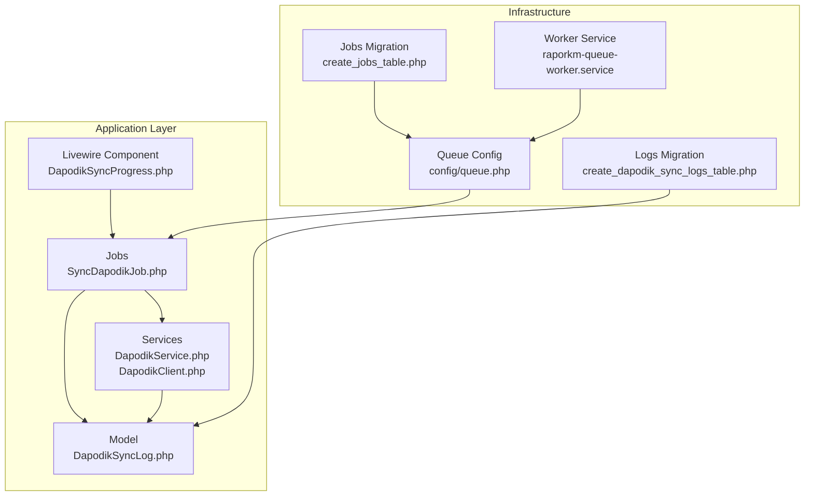
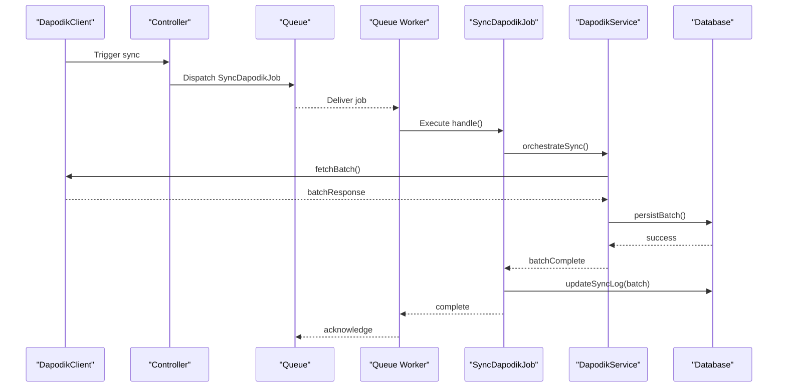
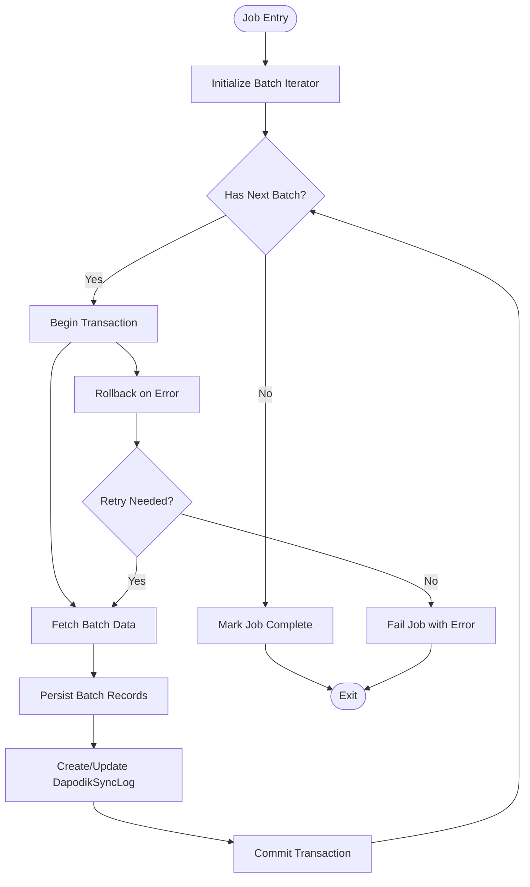
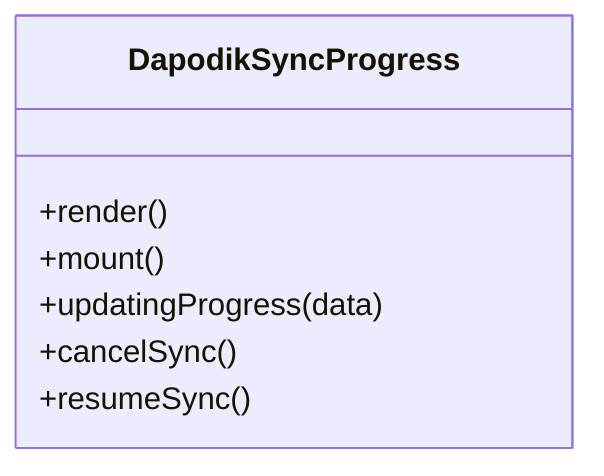
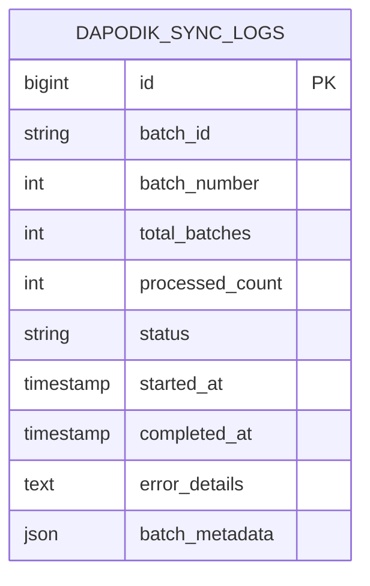
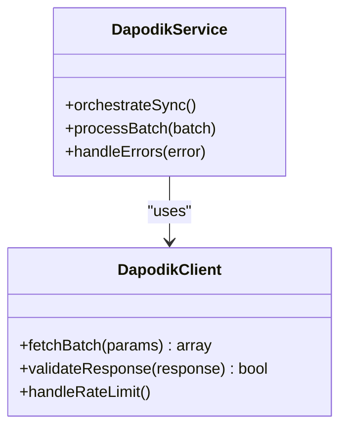
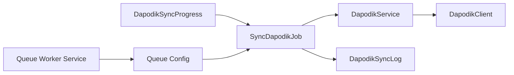

# Batch Processing & Performance

<cite>
**Referenced Files in This Document**
- [SyncDapodikJob.php](file://app/Jobs/SyncDapodikJob.php)
- [DapodikSyncProgress.php](file://app/Livewire/DapodikSyncProgress.php)
- [DapodikSyncLog.php](file://app/Models/DapodikSyncLog.php)
- [DapodikService.php](file://app/Services/DapodikService.php)
- [DapodikClient.php](file://app/Services/Dapodik/DapodikClient.php)
- [dapodik_sync_logs_table.php](file://database/migrations/2026_06_02_040000_create_dapodik_sync_logs_table.php)
- [batch_fields_migration.php](file://database/migrations/2026_06_04_000001_add_batch_fields_to_dapodik_sync_logs_table.php)
- [queue.php](file://config/queue.php)
- [jobs_table.php](file://database/migrations/2026_06_01_000002_create_jobs_table.php)
- [raporkm-queue-worker.service](file://deploy/raporkm-queue-worker.service)
- [ProcessPwaSyncJob.php](file://app/Jobs/ProcessPwaSyncJob.php)
</cite>

## Table of Contents
1. [Introduction](#introduction)
2. [Project Structure](#project-structure)
3. [Core Components](#core-components)
4. [Architecture Overview](#architecture-overview)
5. [Detailed Component Analysis](#detailed-component-analysis)
6. [Dependency Analysis](#dependency-analysis)
7. [Performance Considerations](#performance-considerations)
8. [Troubleshooting Guide](#troubleshooting-guide)
9. [Conclusion](#conclusion)

## Introduction
This document provides comprehensive documentation for batch processing capabilities and performance optimization in the Dapodik integration. It covers the job-based architecture for background processing, including job queuing, execution, and monitoring. It explains batch size optimization, memory management, and processing efficiency techniques. The DapodikSyncLog system for tracking sync operations, monitoring progress, and identifying bottlenecks is detailed, along with error handling strategies, retry mechanisms, and failure recovery procedures. Performance metrics, monitoring dashboards, and alerting systems are documented, including examples of batch configuration, resource allocation, and scaling considerations. Concurrent processing, thread safety, and database transaction management are addressed for reliable batch operations.

## Project Structure
The Dapodik integration leverages Laravel's queue system for asynchronous processing. Key components include:
- Job classes for encapsulating batch operations
- A dedicated Livewire component for real-time progress monitoring
- A model and migration for tracking sync logs with batch metadata
- Service classes for interacting with the Dapodik API client
- Queue configuration and worker service for deployment

**Diagram sources**
- [SyncDapodikJob.php](file://app/Jobs/SyncDapodikJob.php)
- [DapodikSyncProgress.php](file://app/Livewire/DapodikSyncProgress.php)
- [DapodikSyncLog.php](file://app/Models/DapodikSyncLog.php)
- [DapodikService.php](file://app/Services/DapodikService.php)
- [DapodikClient.php](file://app/Services/Dapodik/DapodikClient.php)
- [queue.php](file://config/queue.php)
- [jobs_table.php](file://database/migrations/2026_06_01_000002_create_jobs_table.php)
- [dapodik_sync_logs_table.php](file://database/migrations/2026_06_02_040000_create_dapodik_sync_logs_table.php)
- [raporkm-queue-worker.service](file://deploy/raporkm-queue-worker.service)

**Section sources**
- [SyncDapodikJob.php](file://app/Jobs/SyncDapodikJob.php)
- [DapodikSyncProgress.php](file://app/Livewire/DapodikSyncProgress.php)
- [DapodikSyncLog.php](file://app/Models/DapodikSyncLog.php)
- [DapodikService.php](file://app/Services/DapodikService.php)
- [DapodikClient.php](file://app/Services/Dapodik/DapodikClient.php)
- [queue.php](file://config/queue.php)
- [jobs_table.php](file://database/migrations/2026_06_01_000002_create_jobs_table.php)
- [dapodik_sync_logs_table.php](file://database/migrations/2026_06_02_040000_create_dapodik_sync_logs_table.php)
- [raporkm-queue-worker.service](file://deploy/raporkm-queue-worker.service)

## Core Components
- SyncDapodikJob: Encapsulates the batch synchronization logic, including pagination, chunking, and error handling.
- DapodikSyncProgress: Real-time Livewire component for monitoring sync progress and displaying metrics.
- DapodikSyncLog: Model representing individual sync log entries with batch metadata for tracking and analysis.
- DapodikService: Orchestrates the overall sync process, coordinating service clients and batch operations.
- DapodikClient: Handles API communication with the Dapodik endpoint, including request/response processing.
- Queue Configuration: Defines queue connections, workers, and job handling behavior.
- Database Migrations: Provide schema for jobs and sync logs, including batch-specific fields.

**Section sources**
- [SyncDapodikJob.php](file://app/Jobs/SyncDapodikJob.php)
- [DapodikSyncProgress.php](file://app/Livewire/DapodikSyncProgress.php)
- [DapodikSyncLog.php](file://app/Models/DapodikSyncLog.php)
- [DapodikService.php](file://app/Services/DapodikService.php)
- [DapodikClient.php](file://app/Services/Dapodik/DapodikClient.php)
- [queue.php](file://config/queue.php)
- [dapodik_sync_logs_table.php](file://database/migrations/2026_06_02_040000_create_dapodik_sync_logs_table.php)
- [batch_fields_migration.php](file://database/migrations/2026_06_04_000001_add_batch_fields_to_dapodik_sync_logs_table.php)

## Architecture Overview
The Dapodik integration follows a job-based architecture:
- Web requests enqueue SyncDapodikJob instances.
- Laravel's queue worker processes jobs asynchronously.
- Jobs iterate through batches, invoking service clients to fetch and persist data.
- Progress updates are emitted via Livewire for real-time monitoring.
- Sync logs record batch metadata, statuses, and timestamps for auditing and troubleshooting.

**Diagram sources**
- [SyncDapodikJob.php](file://app/Jobs/SyncDapodikJob.php)
- [DapodikService.php](file://app/Services/DapodikService.php)
- [DapodikClient.php](file://app/Services/Dapodik/DapodikClient.php)
- [DapodikSyncLog.php](file://app/Models/DapodikSyncLog.php)

## Detailed Component Analysis

### SyncDapodikJob Analysis
The job encapsulates the core batch processing logic:
- Iterates through paginated datasets using configurable batch sizes.
- Manages per-batch transactions to ensure atomicity and rollback on errors.
- Emits progress updates and persists DapodikSyncLog entries for each batch.
- Implements retry logic and failure handling for transient errors.

**Diagram sources**
- [SyncDapodikJob.php](file://app/Jobs/SyncDapodikJob.php)
- [DapodikSyncLog.php](file://app/Models/DapodikSyncLog.php)

**Section sources**
- [SyncDapodikJob.php](file://app/Jobs/SyncDapodikJob.php)
- [DapodikSyncLog.php](file://app/Models/DapodikSyncLog.php)

### DapodikSyncProgress Analysis
The Livewire component provides real-time monitoring:
- Subscribes to progress events emitted during batch processing.
- Displays current batch number, total batches, processed records, and elapsed time.
- Supports user-initiated actions such as canceling or resuming sync.

**Diagram sources**
- [DapodikSyncProgress.php](file://app/Livewire/DapodikSyncProgress.php)

**Section sources**
- [DapodikSyncProgress.php](file://app/Livewire/DapodikSyncProgress.php)

### DapodikSyncLog Analysis
The model tracks sync operations with batch metadata:
- Fields capture batch identifiers, status, timestamps, and error details.
- Supports filtering and aggregation for reporting and monitoring dashboards.
- Migration additions introduce batch-specific fields for enhanced tracking.

**Diagram sources**
- [dapodik_sync_logs_table.php](file://database/migrations/2026_06_02_040000_create_dapodik_sync_logs_table.php)
- [batch_fields_migration.php](file://database/migrations/2026_06_04_000001_add_batch_fields_to_dapodik_sync_logs_table.php)
- [DapodikSyncLog.php](file://app/Models/DapodikSyncLog.php)

**Section sources**
- [DapodikSyncLog.php](file://app/Models/DapodikSyncLog.php)
- [dapodik_sync_logs_table.php](file://database/migrations/2026_06_02_040000_create_dapodik_sync_logs_table.php)
- [batch_fields_migration.php](file://database/migrations/2026_06_04_000001_add_batch_fields_to_dapodik_sync_logs_table.php)

### DapodikService and DapodikClient Analysis
The service layer coordinates batch operations:
- DapodikService orchestrates fetching, transforming, and persisting data.
- DapodikClient handles HTTP requests, response parsing, and rate limiting.
- Both components integrate with the job pipeline and logging system.

**Diagram sources**
- [DapodikService.php](file://app/Services/DapodikService.php)
- [DapodikClient.php](file://app/Services/Dapodik/DapodikClient.php)

**Section sources**
- [DapodikService.php](file://app/Services/DapodikService.php)
- [DapodikClient.php](file://app/Services/Dapodik/DapodikClient.php)

## Dependency Analysis
The batch processing system exhibits clear separation of concerns:
- Jobs depend on Services for orchestration and on Models for persistence.
- Services depend on Clients for external API interactions.
- Livewire components depend on Jobs for triggering and on Models for progress data.
- Queue infrastructure supports asynchronous execution and worker scaling.

**Diagram sources**
- [SyncDapodikJob.php](file://app/Jobs/SyncDapodikJob.php)
- [DapodikService.php](file://app/Services/DapodikService.php)
- [DapodikClient.php](file://app/Services/Dapodik/DapodikClient.php)
- [DapodikSyncLog.php](file://app/Models/DapodikSyncLog.php)
- [DapodikSyncProgress.php](file://app/Livewire/DapodikSyncProgress.php)
- [queue.php](file://config/queue.php)
- [raporkm-queue-worker.service](file://deploy/raporkm-queue-worker.service)

**Section sources**
- [SyncDapodikJob.php](file://app/Jobs/SyncDapodikJob.php)
- [DapodikService.php](file://app/Services/DapodikService.php)
- [DapodikClient.php](file://app/Services/Dapodik/DapodikClient.php)
- [DapodikSyncLog.php](file://app/Models/DapodikSyncLog.php)
- [DapodikSyncProgress.php](file://app/Livewire/DapodikSyncProgress.php)
- [queue.php](file://config/queue.php)
- [raporkm-queue-worker.service](file://deploy/raporkm-queue-worker.service)

## Performance Considerations
- Batch Size Optimization: Tune batch sizes to balance throughput and memory usage. Smaller batches reduce memory footprint but increase overhead; larger batches improve throughput but risk timeouts and memory pressure.
- Memory Management: Use chunked processing and eager loading judiciously. Clear temporary variables and avoid accumulating large arrays in memory.
- Database Transactions: Wrap each batch in a transaction to ensure atomicity and enable rollback on failures. Keep transactions short to minimize lock contention.
- Concurrency and Scaling: Configure multiple queue workers and appropriate queue connections. Scale horizontally by adding workers and vertically by increasing CPU/memory resources.
- Monitoring and Metrics: Track batch completion rates, error rates, and latency. Use DapodikSyncLog for historical analysis and alerting thresholds for anomalies.
- Caching and Rate Limiting: Implement caching for frequently accessed data and respect API rate limits to prevent throttling.

[No sources needed since this section provides general guidance]

## Troubleshooting Guide
- Error Handling Strategies: Implement robust error handling within jobs, including retries for transient errors and permanent failure handling with detailed logging.
- Retry Mechanisms: Leverage Laravel's built-in retry capabilities and exponential backoff for failed jobs. Configure retry counts and timeout values appropriately.
- Failure Recovery: On persistent failures, mark the batch as failed, log detailed error information, and notify administrators. Provide mechanisms to reprocess failed batches.
- Monitoring Dashboards: Utilize DapodikSyncLog data to build dashboards tracking sync health, trends, and bottlenecks. Set up alerts for high error rates or prolonged delays.
- Alerting Systems: Integrate with monitoring tools to trigger alerts when sync operations exceed thresholds or encounter repeated failures.

**Section sources**
- [SyncDapodikJob.php](file://app/Jobs/SyncDapodikJob.php)
- [DapodikSyncLog.php](file://app/Models/DapodikSyncLog.php)

## Conclusion
The Dapodik integration employs a robust job-based architecture for reliable, scalable batch processing. By leveraging Laravel's queue system, structured logging, and real-time monitoring, the solution ensures efficient data synchronization while maintaining observability and resilience. Proper configuration of batch sizes, memory management, and concurrency enables optimal performance. The DapodikSyncLog system provides comprehensive tracking for progress monitoring and bottleneck identification, supporting effective troubleshooting and operational insights.