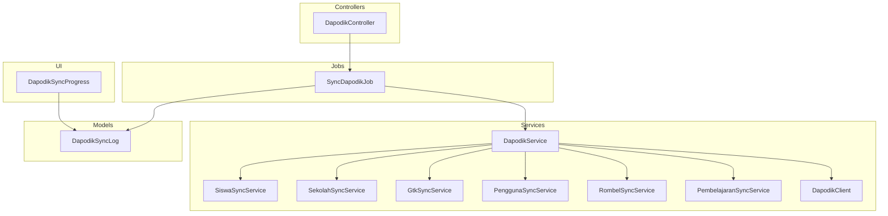
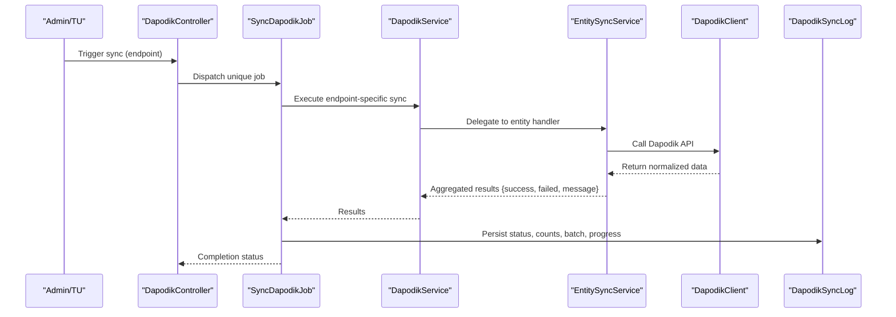
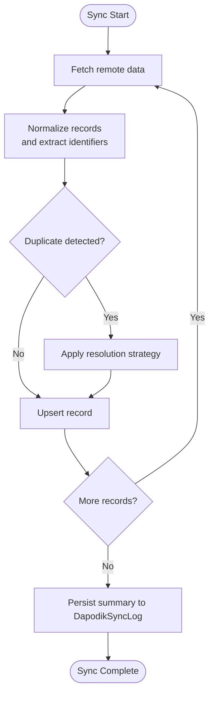
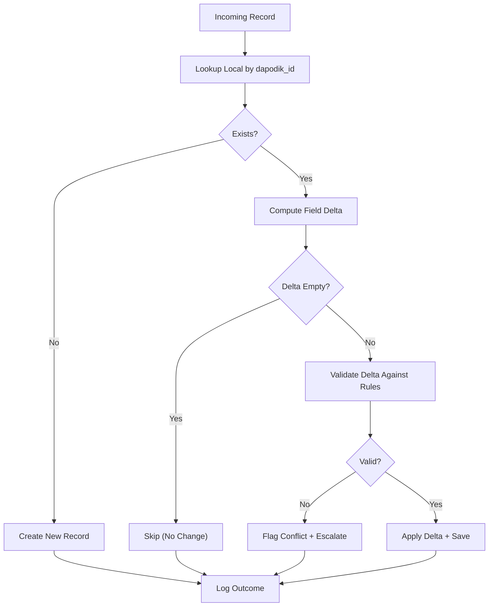
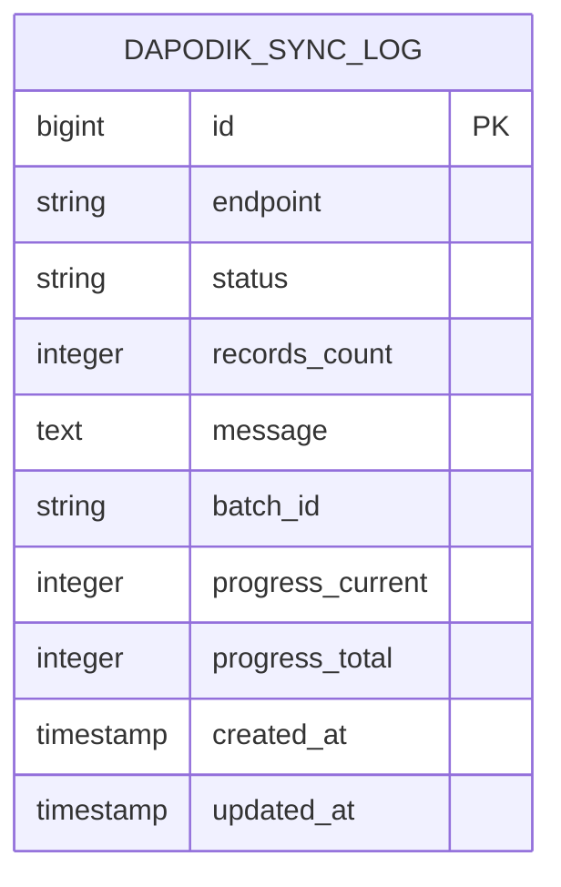
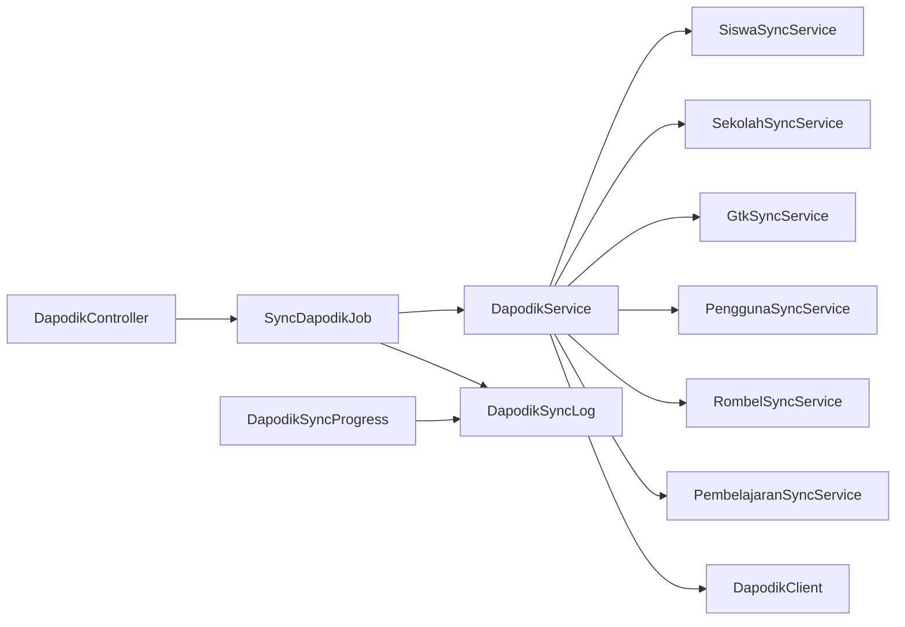

# Conflict Resolution & Data Quality

<cite>
**Referenced Files in This Document**
- [SyncDapodikJob.php](file://app/Jobs/SyncDapodikJob.php)
- [DapodikSyncLog.php](file://app/Models/DapodikSyncLog.php)
- [DapodikSyncLogFactory.php](file://database/factories/DapodikSyncLogFactory.php)
- [2026_06_02_040000_create_dapodik_sync_logs_table.php](file://database/migrations/2026_06_02_040000_create_dapodik_sync_logs_table.php)
- [2026_06_04_000001_add_batch_fields_to_dapodik_sync_logs_table.php](file://database/migrations/2026_06_04_000001_add_batch_fields_to_dapodik_sync_logs_table.php)
- [DapodikController.php](file://app/Http/Controllers/TU/DapodikController.php)
- [DapodikSyncProgress.php](file://app/Livewire/DapodikSyncProgress.php)
- [DapodikClient.php](file://app/Services/Dapodik/DapodikClient.php)
- [DapodikService.php](file://app/Services/DapodikService.php)
- [SiswaSyncService.php](file://app/Services/Dapodik/SiswaSyncService.php)
- [SekolahSyncService.php](file://app/Services/Dapodik/SekolahSyncService.php)
- [GtkSyncService.php](file://app/Services/Dapodik/GtkSyncService.php)
- [PenggunaSyncService.php](file://app/Services/Dapodik/PenggunaSyncService.php)
- [RombelSyncService.php](file://app/Services/Dapodik/RombelSyncService.php)
- [PembelajaranSyncService.php](file://app/Services/Dapodik/PembelajaranSyncService.php)
- [DapodikJobTest.php](file://tests/Feature/Tu/Dapodik/DapodikJobTest.php)
- [DapodikSyncTest.php](file://tests/Feature/Tu/Dapodik/DapodikSyncTest.php)
- [activity_log_table.php](file://database/migrations/2026_06_01_010657_create_activity_log_table.php)
- [activitylog.php](file://config/activitylog.php)
</cite>

## Table of Contents
1. [Introduction](#introduction)
2. [Project Structure](#project-structure)
3. [Core Components](#core-components)
4. [Architecture Overview](#architecture-overview)
5. [Detailed Component Analysis](#detailed-component-analysis)
6. [Dependency Analysis](#dependency-analysis)
7. [Performance Considerations](#performance-considerations)
8. [Troubleshooting Guide](#troubleshooting-guide)
9. [Conclusion](#conclusion)
10. [Appendices](#appendices)

## Introduction
This document provides comprehensive guidance for conflict resolution strategies and data quality assurance in Dapodik integration. It explains how the system detects conflicts (duplicate records, data inconsistencies, and version conflicts), resolves them via deterministic algorithms, validates data against quality rules, and maintains audit trails and historical data. It also covers manual intervention workflows, escalation procedures, and compliance with educational data standards.

## Project Structure
The Dapodik integration is organized around:
- Job orchestration for endpoint-specific synchronization
- Service layer per entity (school, students, groups, staff, users, curriculum)
- Centralized client and service coordinator
- Persistent logging for sync outcomes and progress
- UI components for monitoring and manual controls
- Activity logging for audit trail and change tracking

**Diagram sources**
- [DapodikController.php](file://app/Http/Controllers/TU/DapodikController.php)
- [SyncDapodikJob.php](file://app/Jobs/SyncDapodikJob.php)
- [DapodikService.php](file://app/Services/DapodikService.php)
- [SiswaSyncService.php](file://app/Services/Dapodik/SiswaSyncService.php)
- [SekolahSyncService.php](file://app/Services/Dapodik/SekolahSyncService.php)
- [GtkSyncService.php](file://app/Services/Dapodik/GtkSyncService.php)
- [PenggunaSyncService.php](file://app/Services/Dapodik/PenggunaSyncService.php)
- [RombelSyncService.php](file://app/Services/Dapodik/RombelSyncService.php)
- [PembelajaranSyncService.php](file://app/Services/Dapodik/PembelajaranSyncService.php)
- [DapodikClient.php](file://app/Services/Dapodik/DapodikClient.php)
- [DapodikSyncLog.php](file://app/Models/DapodikSyncLog.php)
- [DapodikSyncProgress.php](file://app/Livewire/DapodikSyncProgress.php)

**Section sources**
- [DapodikController.php](file://app/Http/Controllers/TU/DapodikController.php)
- [SyncDapodikJob.php](file://app/Jobs/SyncDapodikJob.php)
- [DapodikService.php](file://app/Services/DapodikService.php)
- [DapodikSyncLog.php](file://app/Models/DapodikSyncLog.php)
- [DapodikSyncProgress.php](file://app/Livewire/DapodikSyncProgress.php)

## Core Components
- SyncDapodikJob: Orchestrates endpoint-specific sync operations, aggregates results, logs outcomes, and manages retries.
- DapodikService: Coordinates individual entity sync services and routes requests to the appropriate handler.
- Entity Services: Specialized handlers for school, students, groups, staff, users, and curriculum synchronization.
- DapodikClient: Encapsulates Dapodik WebService communication and response parsing.
- DapodikSyncLog: Persists sync metadata, status, counts, messages, batch identifiers, and progress metrics.
- UI Monitoring: Livewire component for real-time sync progress and status.

Key capabilities:
- Endpoint-level uniqueness via job uniqueId to prevent concurrent runs
- Batch tracking for multi-record operations
- Comprehensive logging for success/error states and progress
- Retry window for transient failures

**Section sources**
- [SyncDapodikJob.php](file://app/Jobs/SyncDapodikJob.php)
- [DapodikService.php](file://app/Services/DapodikService.php)
- [DapodikClient.php](file://app/Services/Dapodik/DapodikClient.php)
- [DapodikSyncLog.php](file://app/Models/DapodikSyncLog.php)
- [2026_06_02_040000_create_dapodik_sync_logs_table.php](file://database/migrations/2026_06_02_040000_create_dapodik_sync_logs_table.php)
- [2026_06_04_000001_add_batch_fields_to_dapodik_sync_logs_table.php](file://database/migrations/2026_06_04_000001_add_batch_fields_to_dapodik_sync_logs_table.php)

## Architecture Overview
The integration follows a layered architecture:
- Presentation: Controller exposes sync endpoints and configuration UI
- Application: Job orchestrates sync and delegates to service layer
- Domain Services: Entity-specific sync services implement conflict-aware update logic
- Infrastructure: Client handles external API calls and response normalization
- Persistence: Logs capture outcomes and progress; activity log tracks changes

**Diagram sources**
- [DapodikController.php](file://app/Http/Controllers/TU/DapodikController.php)
- [SyncDapodikJob.php](file://app/Jobs/SyncDapodikJob.php)
- [DapodikService.php](file://app/Services/DapodikService.php)
- [SiswaSyncService.php](file://app/Services/Dapodik/SiswaSyncService.php)
- [DapodikClient.php](file://app/Services/Dapodik/DapodikClient.php)
- [DapodikSyncLog.php](file://app/Models/DapodikSyncLog.php)

## Detailed Component Analysis

### Conflict Detection Mechanisms
- Duplicate record detection relies on stable identifiers and unique constraints:
  - School: Unique NPSN mapped to dapodik_id
  - Students: Unique PD ID mapped to dapodik_pd_id
  - Classes: Unique class identifier mapped to dapodik_id
  - Courses: Unique course identifier mapped to dapodik_id
  - Groups: Unique group identifier mapped to dapodik_id
  - Staff: Unique PTK ID mapped to dapodik_id
  - Users: Unique user identifier mapped to dapodik_id
- Version conflicts are mitigated by:
  - Batch tracking to avoid overlapping runs
  - Unique job IDs per endpoint to serialize concurrent attempts
  - Retry windows for transient errors

**Diagram sources**
- [SiswaSyncService.php](file://app/Services/Dapodik/SiswaSyncService.php)
- [SekolahSyncService.php](file://app/Services/Dapodik/SekolahSyncService.php)
- [GtkSyncService.php](file://app/Services/Dapodik/GtkSyncService.php)
- [PenggunaSyncService.php](file://app/Services/Dapodik/PenggunaSyncService.php)
- [RombelSyncService.php](file://app/Services/Dapodik/RombelSyncService.php)
- [PembelajaranSyncService.php](file://app/Services/Dapodik/PembelajaranSyncService.php)
- [DapodikSyncLog.php](file://app/Models/DapodikSyncLog.php)

**Section sources**
- [SiswaSyncService.php](file://app/Services/Dapodik/SiswaSyncService.php)
- [SekolahSyncService.php](file://app/Services/Dapodik/SekolahSyncService.php)
- [GtkSyncService.php](file://app/Services/Dapodik/GtkSyncService.php)
- [PenggunaSyncService.php](file://app/Services/Dapodik/PenggunaSyncService.php)
- [RombelSyncService.php](file://app/Services/Dapodik/RombelSyncService.php)
- [PembelajaranSyncService.php](file://app/Services/Dapodik/PembelajaranSyncService.php)

### Resolution Algorithms
- Deterministic merge strategy:
  - Identify target record by stable Dapodik ID
  - Compare incoming fields with existing local fields
  - Apply field-level overwrite for non-empty values when authoritative
  - Preserve unchanged fields to minimize disruption
- Conflict resolution steps:
  1. Normalize incoming payload
  2. Locate existing record by dapodik_id
  3. Compute delta: fields present in remote but absent/changed locally
  4. Apply delta with validation rules
  5. Record outcome (updated/skipped) and reasons
- Version conflict handling:
  - Use batch_id to group operations
  - Enforce uniqueId(endpoint) to serialize runs
  - Retry on transient exceptions within retryUntil window

**Diagram sources**
- [SyncDapodikJob.php](file://app/Jobs/SyncDapodikJob.php)
- [DapodikSyncLog.php](file://app/Models/DapodikSyncLog.php)

**Section sources**
- [SyncDapodikJob.php](file://app/Jobs/SyncDapodikJob.php)

### Data Validation Rules and Quality Checks
- Required fields per entity are validated before persistence
- Empty or invalid values are rejected or corrected according to entity rules
- Numeric and date fields are sanitized and constrained
- Cross-entity referential integrity is enforced (e.g., student-class enrollment)
- Duplicate suppression: records with identical normalized keys are skipped after first successful write

Quality assurance pipeline:
- Pre-write validation: schema and business rule checks
- Post-write verification: consistency checks and referential integrity
- Automated correction: safe defaults for optional fields; nulling inconsistent values
- Reporting: aggregated counts of successes, failures, and corrections

**Section sources**
- [SiswaSyncService.php](file://app/Services/Dapodik/SiswaSyncService.php)
- [SekolahSyncService.php](file://app/Services/Dapodik/SekolahSyncService.php)
- [GtkSyncService.php](file://app/Services/Dapodik/GtkSyncService.php)
- [PenggunaSyncService.php](file://app/Services/Dapodik/PenggunaSyncService.php)
- [RombelSyncService.php](file://app/Services/Dapodik/RombelSyncService.php)
- [PembelajaranSyncService.php](file://app/Services/Dapodik/PembelajaranSyncService.php)

### Manual Intervention Workflows and Escalation
- UI escalation:
  - Admin reviews DapodikSyncLog entries for failed items
  - Initiates targeted re-sync per endpoint or record
  - Uses batch_id to filter problematic batches
- Escalation procedure:
  - Flagged conflicts are logged with detailed messages
  - Admin can override decisions via manual sync controls
  - Audit trail preserved for compliance review

**Section sources**
- [DapodikController.php](file://app/Http/Controllers/TU/DapodikController.php)
- [DapodikSyncProgress.php](file://app/Livewire/DapodikSyncProgress.php)
- [DapodikSyncLog.php](file://app/Models/DapodikSyncLog.php)

### Audit Trails, Change Tracking, and Historical Preservation
- DapodikSyncLog captures:
  - endpoint, status, records_count, message
  - timestamps for visibility
  - batch_id, progress_current, progress_total for grouping and progress
- Activity logging:
  - Centralized activity log table and configuration enable change tracking across the system
  - Integrates with domain events for granular auditability

**Diagram sources**
- [2026_06_02_040000_create_dapodik_sync_logs_table.php](file://database/migrations/2026_06_02_040000_create_dapodik_sync_logs_table.php)
- [2026_06_04_000001_add_batch_fields_to_dapodik_sync_logs_table.php](file://database/migrations/2026_06_04_000001_add_batch_fields_to_dapodik_sync_logs_table.php)
- [DapodikSyncLog.php](file://app/Models/DapodikSyncLog.php)

**Section sources**
- [DapodikSyncLog.php](file://app/Models/DapodikSyncLog.php)
- [activity_log_table.php](file://database/migrations/2026_06_01_010657_create_activity_log_table.php)
- [activitylog.php](file://config/activitylog.php)

### Examples of Common Conflict Scenarios and Strategies
- Scenario: Student enrolled in multiple classes with conflicting schedules
  - Strategy: Merge class enrollments; flag scheduling conflicts for manual review
- Scenario: Teacher assigned to multiple roles with inconsistent credentials
  - Strategy: Overwrite credential fields with latest authoritative values; escalate mismatched PTK IDs
- Scenario: Course metadata differs between systems
  - Strategy: Apply latest metadata; preserve historical versions in audit logs
- Scenario: Batch sync interrupted mid-run
  - Strategy: Resume using batch_id; deduplicate records already processed

**Section sources**
- [SyncDapodikJob.php](file://app/Jobs/SyncDapodikJob.php)
- [DapodikSyncLog.php](file://app/Models/DapodikSyncLog.php)

### Preventive Measures
- Idempotent writes: deduplicate by dapodik_id before applying changes
- Validation gates: enforce schema and referential constraints pre-save
- Retry policies: bounded retries for transient network/storage errors
- Batch isolation: use batch_id to segment and track partial failures
- Unique job serialization: endpoint-level uniqueId prevents concurrent runs

**Section sources**
- [SyncDapodikJob.php](file://app/Jobs/SyncDapodikJob.php)
- [2026_06_04_000001_add_batch_fields_to_dapodik_sync_logs_table.php](file://database/migrations/2026_06_04_000001_add_batch_fields_to_dapodik_sync_logs_table.php)

## Dependency Analysis
The following diagram shows key dependencies among components involved in Dapodik integration:

**Diagram sources**
- [DapodikController.php](file://app/Http/Controllers/TU/DapodikController.php)
- [SyncDapodikJob.php](file://app/Jobs/SyncDapodikJob.php)
- [DapodikService.php](file://app/Services/DapodikService.php)
- [SiswaSyncService.php](file://app/Services/Dapodik/SiswaSyncService.php)
- [SekolahSyncService.php](file://app/Services/Dapodik/SekolahSyncService.php)
- [GtkSyncService.php](file://app/Services/Dapodik/GtkSyncService.php)
- [PenggunaSyncService.php](file://app/Services/Dapodik/PenggunaSyncService.php)
- [RombelSyncService.php](file://app/Services/Dapodik/RombelSyncService.php)
- [PembelajaranSyncService.php](file://app/Services/Dapodik/PembelajaranSyncService.php)
- [DapodikClient.php](file://app/Services/Dapodik/DapodikClient.php)
- [DapodikSyncLog.php](file://app/Models/DapodikSyncLog.php)
- [DapodikSyncProgress.php](file://app/Livewire/DapodikSyncProgress.php)

**Section sources**
- [SyncDapodikJob.php](file://app/Jobs/SyncDapodikJob.php)
- [DapodikService.php](file://app/Services/DapodikService.php)
- [DapodikSyncLog.php](file://app/Models/DapodikSyncLog.php)

## Performance Considerations
- Batch processing: group operations by batch_id to improve throughput and simplify rollback
- Idempotency: rely on dapodik_id to avoid redundant writes and reduce database load
- Retry strategy: bounded retries with exponential backoff for transient failures
- Progress tracking: maintain progress_current/progress_total to enable resumption and monitoring
- Concurrency control: uniqueId(endpoint) ensures single active run per endpoint

## Troubleshooting Guide
Common issues and resolutions:
- Job fails with exception during sync:
  - Inspect DapodikSyncLog for error status and message
  - Use retryUntil window to allow automatic retry
  - Manually trigger endpoint-specific sync after correcting configuration
- Duplicate or missing records:
  - Verify dapodik_id mapping in target entities
  - Re-run sync with same batch_id to resume
- Validation errors:
  - Review entity-specific validation rules
  - Correct incoming data or apply automated corrections
- UI shows stalled progress:
  - Confirm queue worker is running
  - Check DapodikSyncProgress for current/total values

**Section sources**
- [DapodikSyncLog.php](file://app/Models/DapodikSyncLog.php)
- [SyncDapodikJob.php](file://app/Jobs/SyncDapodikJob.php)
- [DapodikSyncTest.php](file://tests/Feature/Tu/Dapodik/DapodikSyncTest.php)
- [DapodikJobTest.php](file://tests/Feature/Tu/Dapodik/DapodikJobTest.php)

## Conclusion
The Dapodik integration employs a robust, layered approach to conflict resolution and data quality assurance. By leveraging stable identifiers, deterministic merge strategies, comprehensive logging, and activity tracking, it ensures reliable synchronization while preserving auditability and enabling manual intervention when needed. The design supports scalability, resilience, and compliance with educational data standards.

## Appendices

### Compliance and Standards Alignment
- Educational data standards:
  - Use stable identifiers (dapodik_id, dapodik_pd_id) to align with national registry semantics
  - Maintain historical versions and audit trails for regulatory compliance
- Data governance:
  - Enforce referential integrity across entities
  - Apply field-level validation rules consistent with Dapodik schema

### Test Coverage References
- Job dispatch and uniqueness assertions
- Endpoint-specific sync behavior
- Configuration validation and persistence

**Section sources**
- [DapodikJobTest.php](file://tests/Feature/Tu/Dapodik/DapodikJobTest.php)
- [DapodikSyncTest.php](file://tests/Feature/Tu/Dapodik/DapodikSyncTest.php)