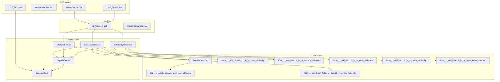
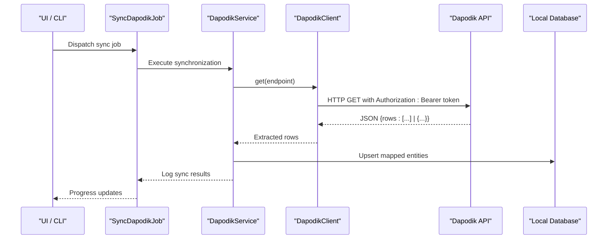
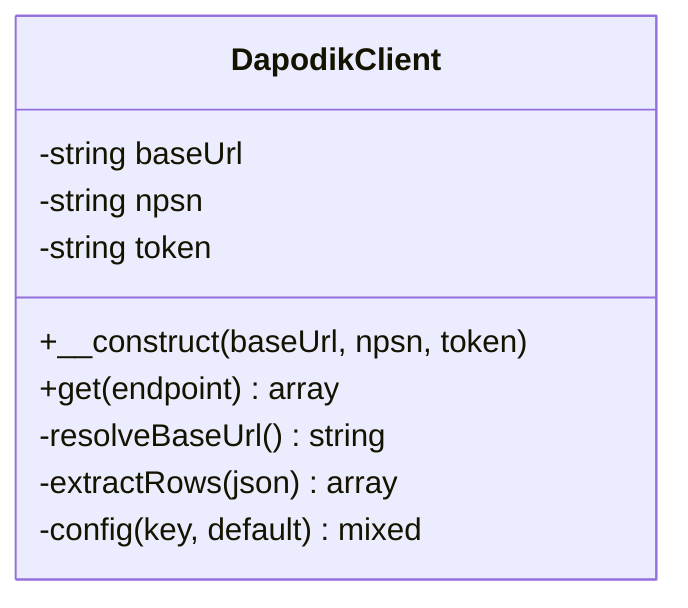
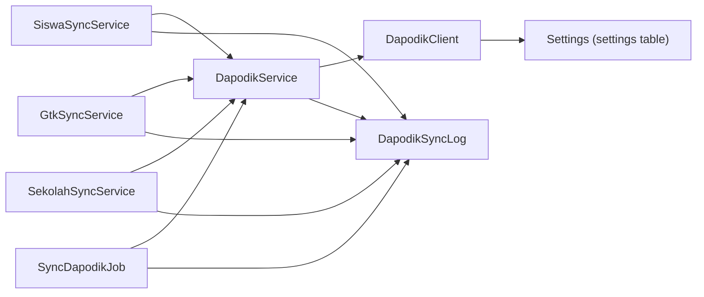

# Dapodik API Integration

<cite>
**Referenced Files in This Document**
- [DapodikClient.php](file://app/Services/Dapodik/DapodikClient.php)
- [DapodikService.php](file://app/Services/DapodikService.php)
- [SiswaSyncService.php](file://app/Services/Dapodik/SiswaSyncService.php)
- [GtkSyncService.php](file://app/Services/Dapodik/GtkSyncService.php)
- [SekolahSyncService.php](file://app/Services/Dapodik/SekolahSyncService.php)
- [SyncDapodikJob.php](file://app/Jobs/SyncDapodikJob.php)
- [DapodikSyncProgress.php](file://app/Livewire/DapodikSyncProgress.php)
- [DapodikSyncLog.php](file://app/Models/DapodikSyncLog.php)
- [2026_06_02_040000_create_dapodik_sync_logs_table.php](file://database/migrations/2026_06_02_040000_create_dapodik_sync_logs_table.php)
- [2026_06_02_050000_add_dapodik_pd_id_to_siswa_table.php](file://database/migrations/2026_06_02_050000_add_dapodik_pd_id_to_siswa_table.php)
- [2026_06_02_080000_add_dapodik_id_to_sekolah_table.php](file://database/migrations/2026_06_02_080000_add_dapodik_id_to_sekolah_table.php)
- [2026_06_02_080001_add_dapodik_id_to_kelas_table.php](file://database/migrations/2026_06_02_080001_add_dapodik_id_to_kelas_table.php)
- [2026_06_02_080002_add_dapodik_id_to_mapel_table.php](file://database/migrations/2026_06_02_080002_add_dapodik_id_to_mapel_table.php)
- [2026_06_02_080003_add_dapodik_id_to_mapel_kelas_table.php](file://database/migrations/2026_06_02_080003_add_dapodik_id_to_mapel_kelas_table.php)
- [2026_06_04_000001_add_batch_fields_to_dapodik_sync_logs_table.php](file://database/migrations/2026_06_04_000001_add_batch_fields_to_dapodik_sync_logs_table.php)
- [app.php](file://config/app.php)
- [database.php](file://config/database.php)
- [logging.php](file://config/logging.php)
- [queue.php](file://config/queue.php)
- [2026_06_10_090001_add_gps_fields_to_sekolah_table.php](file://database/migrations/2026_06_10_090001_add_gps_fields_to_sekolah_table.php)
</cite>

## Table of Contents
1. [Introduction](#introduction)
2. [Project Structure](#project-structure)
3. [Core Components](#core-components)
4. [Architecture Overview](#architecture-overview)
5. [Detailed Component Analysis](#detailed-component-analysis)
6. [Dependency Analysis](#dependency-analysis)
7. [Performance Considerations](#performance-considerations)
8. [Troubleshooting Guide](#troubleshooting-guide)
9. [Conclusion](#conclusion)
10. [Appendices](#appendices)

## Introduction
This document explains the Dapodik API integration within the Laravel application. It covers authentication mechanisms, API endpoints, data exchange protocols, client implementation details, configuration management, synchronization services, data mapping between Dapodik standard formats and local database structures, error handling, retry strategies, timeouts, rate limiting considerations, and security practices including SSL/TLS and certificate validation.

## Project Structure
The Dapodik integration is organized around a dedicated service layer under `app/Services/Dapodik`. The core client handles HTTP communication and response parsing, while specialized sync services manage data synchronization for students, teachers/guru, and schools. Background jobs orchestrate batch synchronization, and Livewire components provide progress feedback. Database migrations define persistent settings and sync logs.

**Diagram sources**
- [DapodikClient.php](file://app/Services/Dapodik/DapodikClient.php)
- [DapodikService.php](file://app/Services/DapodikService.php)
- [SiswaSyncService.php](file://app/Services/Dapodik/SiswaSyncService.php)
- [GtkSyncService.php](file://app/Services/Dapodik/GtkSyncService.php)
- [SekolahSyncService.php](file://app/Services/Dapodik/SekolahSyncService.php)
- [SyncDapodikJob.php](file://app/Jobs/SyncDapodikJob.php)
- [DapodikSyncProgress.php](file://app/Livewire/DapodikSyncProgress.php)
- [DapodikSyncLog.php](file://app/Models/DapodikSyncLog.php)
- [2026_06_02_040000_create_dapodik_sync_logs_table.php](file://database/migrations/2026_06_02_040000_create_dapodik_sync_logs_table.php)
- [2026_06_02_050000_add_dapodik_pd_id_to_siswa_table.php](file://database/migrations/2026_06_02_050000_add_dapodik_pd_id_to_siswa_table.php)
- [2026_06_02_080000_add_dapodik_id_to_sekolah_table.php](file://database/migrations/2026_06_02_080000_add_dapodik_id_to_sekolah_table.php)
- [2026_06_02_080001_add_dapodik_id_to_kelas_table.php](file://database/migrations/2026_06_02_080001_add_dapodik_id_to_kelas_table.php)
- [2026_06_02_080002_add_dapodik_id_to_mapel_table.php](file://database/migrations/2026_06_02_080002_add_dapodik_id_to_mapel_table.php)
- [2026_06_02_080003_add_dapodik_id_to_mapel_kelas_table.php](file://database/migrations/2026_06_02_080003_add_dapodik_id_to_mapel_kelas_table.php)
- [2026_06_04_000001_add_batch_fields_to_dapodik_sync_logs_table.php](file://database/migrations/2026_06_04_000001_add_batch_fields_to_dapodik_sync_logs_table.php)

**Section sources**
- [DapodikClient.php](file://app/Services/Dapodik/DapodikClient.php)
- [DapodikService.php](file://app/Services/DapodikService.php)
- [SiswaSyncService.php](file://app/Services/Dapodik/SiswaSyncService.php)
- [GtkSyncService.php](file://app/Services/Dapodik/GtkSyncService.php)
- [SekolahSyncService.php](file://app/Services/Dapodik/SekolahSyncService.php)
- [SyncDapodikJob.php](file://app/Jobs/SyncDapodikJob.php)
- [DapodikSyncProgress.php](file://app/Livewire/DapodikSyncProgress.php)
- [DapodikSyncLog.php](file://app/Models/DapodikSyncLog.php)
- [2026_06_02_040000_create_dapodik_sync_logs_table.php](file://database/migrations/2026_06_02_040000_create_dapodik_sync_logs_table.php)
- [2026_06_02_050000_add_dapodik_pd_id_to_siswa_table.php](file://database/migrations/2026_06_02_050000_add_dapodik_pd_id_to_siswa_table.php)
- [2026_06_02_080000_add_dapodik_id_to_sekolah_table.php](file://database/migrations/2026_06_02_080000_add_dapodik_id_to_sekolah_table.php)
- [2026_06_02_080001_add_dapodik_id_to_kelas_table.php](file://database/migrations/2026_06_02_080001_add_dapodik_id_to_kelas_table.php)
- [2026_06_02_080002_add_dapodik_id_to_mapel_table.php](file://database/migrations/2026_06_02_080002_add_dapodik_id_to_mapel_table.php)
- [2026_06_02_080003_add_dapodik_id_to_mapel_kelas_table.php](file://database/migrations/2026_06_02_080003_add_dapodik_id_to_mapel_kelas_table.php)
- [2026_06_04_000001_add_batch_fields_to_dapodik_sync_logs_table.php](file://database/migrations/2026_06_04_000001_add_batch_fields_to_dapodik_sync_logs_table.php)

## Core Components
- DapodikClient: Handles base URL resolution, authentication via bearer token, HTTP GET requests with timeout, and response extraction of rows from JSON payload.
- DapodikService: Orchestrates synchronization operations across data types (students, teachers, schools).
- SiswaSyncService: Student data synchronization.
- GtkSyncService: Teacher/personnel data synchronization.
- SekolahSyncService: School data synchronization.
- SyncDapodikJob: Queued job to execute synchronization tasks.
- DapodikSyncProgress: Livewire component to render sync progress.
- DapodikSyncLog: Model and migration for persisting sync logs and batch metadata.

Key configuration keys stored in settings:
- dapodik_url
- dapodik_npsn
- dapodik_token

These are retrieved from the settings table during client initialization.

**Section sources**
- [DapodikClient.php](file://app/Services/Dapodik/DapodikClient.php)
- [DapodikService.php](file://app/Services/DapodikService.php)
- [SiswaSyncService.php](file://app/Services/Dapodik/SiswaSyncService.php)
- [GtkSyncService.php](file://app/Services/Dapodik/GtkSyncService.php)
- [SekolahSyncService.php](file://app/Services/Dapodik/SekolahSyncService.php)
- [SyncDapodikJob.php](file://app/Jobs/SyncDapodikJob.php)
- [DapodikSyncProgress.php](file://app/Livewire/DapodikSyncProgress.php)
- [DapodikSyncLog.php](file://app/Models/DapodikSyncLog.php)

## Architecture Overview
The integration follows a layered architecture:
- Configuration layer reads settings from the database.
- Client layer performs HTTP requests with token authentication and timeout handling.
- Service layer coordinates synchronization per entity type.
- Persistence layer stores sync logs and mapped identifiers.
- Asynchronous execution via queued jobs ensures reliability and scalability.

**Diagram sources**
- [SyncDapodikJob.php](file://app/Jobs/SyncDapodikJob.php)
- [DapodikService.php](file://app/Services/DapodikService.php)
- [DapodikClient.php](file://app/Services/Dapodik/DapodikClient.php)
- [DapodikSyncLog.php](file://app/Models/DapodikSyncLog.php)

## Detailed Component Analysis

### DapodikClient
Responsibilities:
- Resolve base URL with protocol and port defaults.
- Load configuration values from settings table.
- Perform authenticated GET requests with timeout.
- Validate response status and parse rows from JSON.

Authentication:
- Uses bearer token via HTTP client.
- Throws exceptions on missing configuration or unsuccessful HTTP responses.

Request formatting:
- Base URL resolution ensures trailing slash removal and adds endpoint path.
- Appends query parameter npsn for school identification.

Response parsing:
- Extracts rows from JSON payload, supporting both single record and array formats.

**Diagram sources**
- [DapodikClient.php](file://app/Services/Dapodik/DapodikClient.php)

**Section sources**
- [DapodikClient.php](file://app/Services/Dapodik/DapodikClient.php)

### DapodikService
Responsibilities:
- Coordinates synchronization across different entity types.
- Delegates to specialized services for students, teachers, and schools.
- Manages transaction boundaries and error propagation.

Integration pattern:
- Calls DapodikClient.get for each endpoint.
- Applies data mapping to local structures.
- Persists logs via DapodikSyncLog.

**Section sources**
- [DapodikService.php](file://app/Services/DapodikService.php)

### SiswaSyncService
Responsibilities:
- Fetch student records from Dapodik API.
- Map to local student model.
- Persist mapped identifiers and update batch metadata.

Mappings:
- Students: Uses migration adding dapodik_pd_id to siswa table.

**Section sources**
- [SiswaSyncService.php](file://app/Services/Dapodik/SiswaSyncService.php)
- [2026_06_02_050000_add_dapodik_pd_id_to_siswa_table.php](file://database/migrations/2026_06_02_050000_add_dapodik_pd_id_to_siswa_table.php)

### GtkSyncService
Responsibilities:
- Fetch teacher/personnel records from Dapodik API.
- Map to local personnel structures.
- Maintain audit trail via sync logs.

**Section sources**
- [GtkSyncService.php](file://app/Services/Dapodik/GtkSyncService.php)

### SekolahSyncService
Responsibilities:
- Fetch school records from Dapodik API.
- Map to local school, class, subject, and class-subject structures.
- Persist dapodik_id fields for cross-referencing.

Mappings:
- School: dapodik_id to sekolah table.
- Class: dapodik_id to kelas table.
- Subject: dapodik_id to mapel table.
- Class-Subject: dapodik_id to mapel_kelas table.

**Section sources**
- [SekolahSyncService.php](file://app/Services/Dapodik/SekolahSyncService.php)
- [2026_06_02_080000_add_dapodik_id_to_sekolah_table.php](file://database/migrations/2026_06_02_080000_add_dapodik_id_to_sekolah_table.php)
- [2026_06_02_080001_add_dapodik_id_to_kelas_table.php](file://database/migrations/2026_06_02_080001_add_dapodik_id_to_kelas_table.php)
- [2026_06_02_080002_add_dapodik_id_to_mapel_table.php](file://database/migrations/2026_06_02_080002_add_dapodik_id_to_mapel_table.php)
- [2026_06_02_080003_add_dapodik_id_to_mapel_kelas_table.php](file://database/migrations/2026_06_02_080003_add_dapodik_id_to_mapel_kelas_table.php)

### SyncDapodikJob
Responsibilities:
- Executes synchronization tasks asynchronously.
- Invokes DapodikService to coordinate all entity types.
- Updates DapodikSyncLog with batch metadata and outcomes.

Queue configuration:
- Relies on configured queue driver and worker processes.

**Section sources**
- [SyncDapodikJob.php](file://app/Jobs/SyncDapodikJob.php)
- [config/queue.php](file://config/queue.php)

### DapodikSyncProgress
Responsibilities:
- Provides real-time progress UI for sync operations.
- Polls or listens for sync status updates.

**Section sources**
- [DapodikSyncProgress.php](file://app/Livewire/DapodikSyncProgress.php)

### DapodikSyncLog
Responsibilities:
- Stores sync execution logs with timestamps, entity counts, and errors.
- Supports batch tracking with additional fields introduced later.

Schema evolution:
- Initial creation of sync logs table.
- Addition of batch-related fields for improved reporting.

**Section sources**
- [DapodikSyncLog.php](file://app/Models/DapodikSyncLog.php)
- [2026_06_02_040000_create_dapodik_sync_logs_table.php](file://database/migrations/2026_06_02_040000_create_dapodik_sync_logs_table.php)
- [2026_06_04_000001_add_batch_fields_to_dapodik_sync_logs_table.php](file://database/migrations/2026_06_04_000001_add_batch_fields_to_dapodik_sync_logs_table.php)

## Dependency Analysis
The following diagram shows key dependencies among components involved in Dapodik integration.

**Diagram sources**
- [DapodikClient.php](file://app/Services/Dapodik/DapodikClient.php)
- [DapodikService.php](file://app/Services/DapodikService.php)
- [SiswaSyncService.php](file://app/Services/Dapodik/SiswaSyncService.php)
- [GtkSyncService.php](file://app/Services/Dapodik/GtkSyncService.php)
- [SekolahSyncService.php](file://app/Services/Dapodik/SekolahSyncService.php)
- [SyncDapodikJob.php](file://app/Jobs/SyncDapodikJob.php)
- [DapodikSyncLog.php](file://app/Models/DapodikSyncLog.php)

**Section sources**
- [DapodikClient.php](file://app/Services/Dapodik/DapodikClient.php)
- [DapodikService.php](file://app/Services/DapodikService.php)
- [SiswaSyncService.php](file://app/Services/Dapodik/SiswaSyncService.php)
- [GtkSyncService.php](file://app/Services/Dapodik/GtkSyncService.php)
- [SekolahSyncService.php](file://app/Services/Dapodik/SekolahSyncService.php)
- [SyncDapodikJob.php](file://app/Jobs/SyncDapodikJob.php)
- [DapodikSyncLog.php](file://app/Models/DapodikSyncLog.php)

## Performance Considerations
- Timeout configuration: The client enforces a 60-second timeout for API requests to prevent hanging operations.
- Batch processing: Use queued jobs to avoid blocking synchronous requests and to enable parallelism where appropriate.
- Retry mechanisms: Implement retry logic with exponential backoff at the job level to handle transient failures gracefully.
- Rate limiting: Monitor upstream API rate limits and throttle requests accordingly; consider staggering requests across batches.
- Network efficiency: Reuse connections via HTTP client pooling and minimize unnecessary retries.
- Logging and monitoring: Capture latency metrics and error rates in DapodikSyncLog for observability.

[No sources needed since this section provides general guidance]

## Troubleshooting Guide
Common issues and resolutions:
- Missing configuration: Ensure dapodik_url, dapodik_npsn, and dapodik_token are set in the settings table.
- Authentication failures: Verify the bearer token validity and that the API endpoint supports token-based authentication.
- HTTP errors: Inspect thrown exceptions for HTTP status codes and response bodies; check network connectivity and proxy settings.
- Timeout errors: Increase timeout value cautiously and consider splitting large datasets into smaller batches.
- Data inconsistencies: Review DapodikSyncLog entries for failed records and reconcile discrepancies manually if needed.
- Queue failures: Confirm queue worker availability and proper configuration; monitor failed job handling.

**Section sources**
- [DapodikClient.php](file://app/Services/Dapodik/DapodikClient.php)
- [DapodikSyncLog.php](file://app/Models/DapodikSyncLog.php)

## Conclusion
The Dapodik integration leverages a clean separation of concerns: a configurable client for HTTP communication, specialized services for each entity type, asynchronous job execution, and robust persistence for auditability. By adhering to secure configuration practices, implementing retry and timeout strategies, and maintaining clear logs, the system achieves reliable and maintainable synchronization with the Dapodik API.

[No sources needed since this section summarizes without analyzing specific files]

## Appendices

### API Endpoints and Request Examples
Note: The following examples describe typical endpoint patterns inferred from the codebase. Replace placeholders with actual values from your Dapodik deployment.

- Students
  - Endpoint pattern: `/sekolah/{sekolah_id}/siswa`
  - Request: GET with Authorization: Bearer {token}, query param npsn={school_npsn}
  - Response: JSON containing rows array or single record object

- Teachers/Guru
  - Endpoint pattern: `/sekolah/{sekolah_id}/guru`
  - Request: GET with Authorization: Bearer {token}, query param npsn={school_npsn}

- Schools
  - Endpoint pattern: `/sekolah`
  - Request: GET with Authorization: Bearer {token}, query param npsn={school_npsn}

- Subjects and Classes
  - Endpoint pattern: `/sekolah/{sekolah_id}/mata_pelajaran`
  - Endpoint pattern: `/sekolah/{sekolah_id}/kelas`

Mapping highlights:
- Students: Local siswa table receives dapodik_pd_id mapping.
- Schools: Local sekolah, kelas, mapel, and mapel_kelas tables receive dapodik_id mappings.
- Batch tracking: DapodikSyncLog captures batch metadata for auditing.

**Section sources**
- [SiswaSyncService.php](file://app/Services/Dapodik/SiswaSyncService.php)
- [SekolahSyncService.php](file://app/Services/Dapodik/SekolahSyncService.php)
- [2026_06_02_050000_add_dapodik_pd_id_to_siswa_table.php](file://database/migrations/2026_06_02_050000_add_dapodik_pd_id_to_siswa_table.php)
- [2026_06_02_080000_add_dapodik_id_to_sekolah_table.php](file://database/migrations/2026_06_02_080000_add_dapodik_id_to_sekolah_table.php)
- [2026_06_02_080001_add_dapodik_id_to_kelas_table.php](file://database/migrations/2026_06_02_080001_add_dapodik_id_to_kelas_table.php)
- [2026_06_02_080002_add_dapodik_id_to_mapel_table.php](file://database/migrations/2026_06_02_080002_add_dapodik_id_to_mapel_table.php)
- [2026_06_02_080003_add_dapodik_id_to_mapel_kelas_table.php](file://database/migrations/2026_06_02_080003_add_dapodik_id_to_mapel_kelas_table.php)

### Security and SSL/TLS Configuration
- Transport security: The client constructs URLs with explicit scheme handling. When a scheme is not provided, it defaults to HTTP with a fixed port. Ensure production deployments use HTTPS by setting dapodik_url to a https:// scheme.
- Certificate validation: Configure PHP’s cURL or OpenSSL settings according to your environment to enforce strict certificate validation.
- Token protection: Store dapodik_token securely in the settings table and restrict access to administrative roles only.
- Network hardening: Restrict outbound traffic to the Dapodik API domain, and consider using VPN or private network links for sensitive environments.

**Section sources**
- [DapodikClient.php](file://app/Services/Dapodik/DapodikClient.php)
- [config/app.php](file://config/app.php)
- [config/database.php](file://config/database.php)
- [config/logging.php](file://config/logging.php)