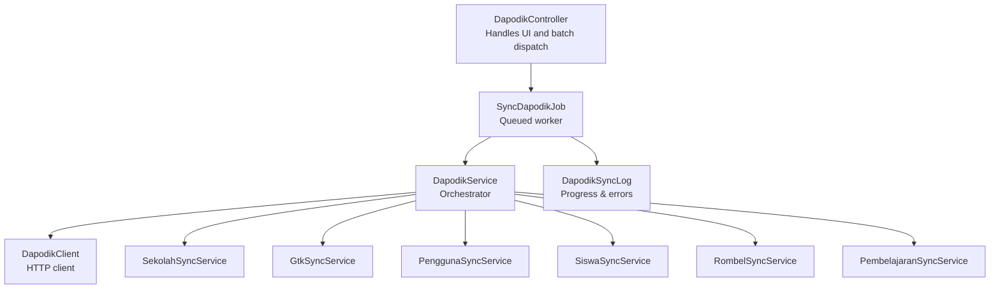
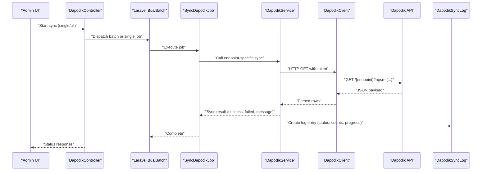
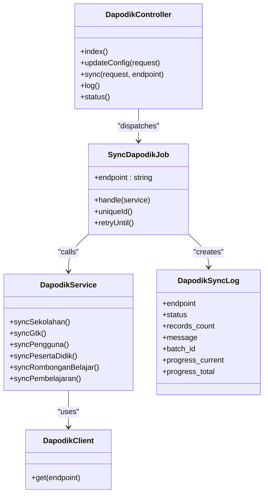

# Dapodik Integration

<cite>
**Referenced Files in This Document**
- [DapodikController.php](file://app/Http/Controllers/TU/DapodikController.php)
- [DapodikService.php](file://app/Services/DapodikService.php)
- [DapodikClient.php](file://app/Services/Dapodik/DapodikClient.php)
- [SekolahSyncService.php](file://app/Services/Dapodik/SekolahSyncService.php)
- [SyncDapodikJob.php](file://app/Jobs/SyncDapodikJob.php)
- [DapodikSyncLog.php](file://app/Models/DapodikSyncLog.php)
- [2026_06_04_000001_add_batch_fields_to_dapodik_sync_logs_table.php](file://database/migrations/2026_06_04_000001_add_batch_fields_to_dapodik_sync_logs_table.php)
- [DapodikJobTest.php](file://tests/Feature/Tu/Dapodik/DapodikJobTest.php)
- [DapodikSyncTest.php](file://tests/Feature/Tu/Dapodik/DapodikSyncTest.php)
- [DapodikSyncProgress.php](file://app/Livewire/DapodikSyncProgress.php)
</cite>

## Table of Contents
1. [Introduction](#introduction)
2. [Project Structure](#project-structure)
3. [Core Components](#core-components)
4. [Architecture Overview](#architecture-overview)
5. [Detailed Component Analysis](#detailed-component-analysis)
6. [Dependency Analysis](#dependency-analysis)
7. [Performance Considerations](#performance-considerations)
8. [Troubleshooting Guide](#troubleshooting-guide)
9. [Conclusion](#conclusion)
10. [Appendices](#appendices)

## Introduction
This document describes the Dapodik integration for synchronizing educational data between the local system and the Dapodik API. It covers authentication, data mapping, synchronization protocols, batch processing, conflict resolution, error handling, real-time and scheduled synchronization options, validation, quality assurance, logging, and operational controls. The integration supports synchronized updates for schools, teachers, students, and curriculum-related data, ensuring compliance with official educational standards.

## Project Structure
The Dapodik integration is organized around a controller for administration, a central service orchestrator delegating to specialized sync services, a dedicated HTTP client for Dapodik API communication, queued jobs for background processing, and a robust logging model with migration support for batch progress tracking.

**Diagram sources**
- [DapodikController.php:26-113](file://app/Http/Controllers/TU/DapodikController.php#L26-L113)
- [SyncDapodikJob.php:26-63](file://app/Jobs/SyncDapodikJob.php#L26-L63)
- [DapodikService.php:20-46](file://app/Services/DapodikService.php#L20-L46)
- [DapodikClient.php:8-35](file://app/Services/Dapodik/DapodikClient.php#L8-L35)
- [SekolahSyncService.php:9-38](file://app/Services/Dapodik/SekolahSyncService.php#L9-L38)
- [DapodikSyncLog.php:9-15](file://app/Models/DapodikSyncLog.php#L9-L15)

**Section sources**
- [DapodikController.php:26-113](file://app/Http/Controllers/TU/DapodikController.php#L26-L113)
- [DapodikService.php:20-46](file://app/Services/DapodikService.php#L20-L46)
- [DapodikClient.php:8-35](file://app/Services/Dapodik/DapodikClient.php#L8-L35)
- [SyncDapodikJob.php:26-63](file://app/Jobs/SyncDapodikJob.php#L26-L63)
- [DapodikSyncLog.php:9-15](file://app/Models/DapodikSyncLog.php#L9-L15)

## Core Components
- DapodikController: Provides admin UI, configuration persistence, endpoint-specific sync initiation, batch orchestration, and status polling.
- DapodikService: Central orchestrator that delegates to specialized services for each domain (school, teacher, user, student, class, curriculum).
- DapodikClient: Encapsulates HTTP communication with the Dapodik API, including authentication via bearer token and base URL resolution.
- SyncDapodikJob: Queued job implementing unique concurrency, retries, timeouts, and comprehensive logging.
- DapodikSyncLog: Persistent record of sync operations, including endpoint, status, counts, messages, and batch progress.
- Migrations: Add batch_id and progress tracking fields to the sync logs table.

Key capabilities:
- Real-time sync per endpoint and batched sync for all endpoints.
- Unique job execution per endpoint to prevent concurrent conflicts.
- Retry and timeout policies for resilience.
- Structured logging with batch-aware progress metrics.

**Section sources**
- [DapodikController.php:26-113](file://app/Http/Controllers/TU/DapodikController.php#L26-L113)
- [DapodikService.php:20-46](file://app/Services/DapodikService.php#L20-L46)
- [DapodikClient.php:8-35](file://app/Services/Dapodik/DapodikClient.php#L8-L35)
- [SyncDapodikJob.php:26-63](file://app/Jobs/SyncDapodikJob.php#L26-L63)
- [DapodikSyncLog.php:9-15](file://app/Models/DapodikSyncLog.php#L9-L15)
- [2026_06_04_000001_add_batch_fields_to_dapodik_sync_logs_table.php:9-24](file://database/migrations/2026_06_04_000001_add_batch_fields_to_dapodik_sync_logs_table.php#L9-L24)

## Architecture Overview
The integration follows a layered pattern:
- Presentation: Web UI and Livewire components for monitoring.
- Control: Controller handles requests, validates configuration, dispatches jobs, and exposes status.
- Orchestration: DapodikService coordinates domain-specific sync services.
- Data Access: DapodikClient performs authenticated API calls and parses responses.
- Background Processing: Laravel queues and batches manage concurrency and progress.
- Persistence: DapodikSyncLog records outcomes and progress.

**Diagram sources**
- [DapodikController.php:64-113](file://app/Http/Controllers/TU/DapodikController.php#L64-L113)
- [SyncDapodikJob.php:26-63](file://app/Jobs/SyncDapodikJob.php#L26-L63)
- [DapodikService.php:48-76](file://app/Services/DapodikService.php#L48-L76)
- [DapodikClient.php:20-35](file://app/Services/Dapodik/DapodikClient.php#L20-L35)
- [DapodikSyncLog.php:9-15](file://app/Models/DapodikSyncLog.php#L9-L15)

## Detailed Component Analysis

### Authentication and API Communication
- Configuration resolution: Base URL, NPSN, and token are loaded from settings.
- Token-based authentication: Requests include a bearer token.
- Endpoint invocation: GET requests append the NPSN query parameter.
- Error handling: Non-successful responses raise exceptions with HTTP status and body.

Operational notes:
- Missing configuration triggers immediate exceptions during client calls.
- Timeout set to 60 seconds for outbound requests.

**Section sources**
- [DapodikClient.php:8-35](file://app/Services/Dapodik/DapodikClient.php#L8-L35)

### Data Mapping and Synchronization Protocols
- School data: Single-record mapping from API response to school entity.
- Teacher (GTK), Users (Pengguna), Students (Peserta Didik), Classes (Rombongan Belajar), Curriculum (Pembelajaran): Each domain has a dedicated service that fetches data and persists it locally.
- Mapping strategy: Services fill local models with available fields from API responses, preserving existing values when fields are missing.

Quality assurance:
- Empty responses return structured messages indicating no data.
- Local ID fields are populated to maintain cross-system linkage.

**Section sources**
- [SekolahSyncService.php:15-38](file://app/Services/Dapodik/SekolahSyncService.php#L15-L38)
- [DapodikService.php:48-76](file://app/Services/DapodikService.php#L48-L76)

### Batch Processing and Concurrency Control
- Unique jobs: Each endpoint has a unique job identifier preventing concurrent runs.
- Retries and timeout: Jobs are retried up to three times with a 300-second timeout.
- Batch orchestration: Dispatching "all" endpoints creates a batch with per-job completion tracking.
- Progress tracking: Logs include current and total progress for batch-aware UI.

Conflict resolution:
- Unique constraint per endpoint prevents duplicate executions.
- Batch failures are recorded and surfaced in status queries.

**Section sources**
- [SyncDapodikJob.php:14-24](file://app/Jobs/SyncDapodikJob.php#L14-L24)
- [SyncDapodikJob.php:30-63](file://app/Jobs/SyncDapodikJob.php#L30-L63)
- [DapodikController.php:69-78](file://app/Http/Controllers/TU/DapodikController.php#L69-L78)

### Real-time and Scheduled Synchronization
- Real-time: Admin initiates sync via UI; jobs run in background with immediate feedback.
- Scheduled: Not implemented in the referenced code; administrators can leverage Laravel scheduler externally to trigger periodic syncs.

Monitoring:
- Status endpoint returns running state, batch metrics, and recent logs.

**Section sources**
- [DapodikController.php:109-153](file://app/Http/Controllers/TU/DapodikController.php#L109-L153)

### Data Validation and Quality Assurance
- Input validation: URL, NPSN, and token are validated on configuration save.
- API validation: Client checks HTTP success and raises exceptions otherwise.
- Domain validation: Services return structured results with counts and messages.

**Section sources**
- [DapodikController.php:42-62](file://app/Http/Controllers/TU/DapodikController.php#L42-L62)
- [DapodikClient.php:30-32](file://app/Services/Dapodik/DapodikClient.php#L30-L32)

### Sync Log System and Monitoring
- Fields: endpoint, status, records_count, message, batch_id, progress_current, progress_total.
- Indexing: batch_id is indexed for efficient filtering.
- UI: Dedicated log page and Livewire progress component for real-time updates.

**Section sources**
- [DapodikSyncLog.php:9-15](file://app/Models/DapodikSyncLog.php#L9-L15)
- [2026_06_04_000001_add_batch_fields_to_dapodik_sync_logs_table.php:11-22](file://database/migrations/2026_06_04_000001_add_batch_fields_to_dapodik_sync_logs_table.php#L11-L22)
- [DapodikController.php:115-120](file://app/Http/Controllers/TU/DapodikController.php#L115-L120)
- [DapodikSyncProgress.php](file://app/Livewire/DapodikSyncProgress.php)

### Conflict Resolution and Rollback Procedures
- Conflict prevention: Unique job identifiers per endpoint avoid concurrent writes.
- Error logging: Exceptions are captured and logged with context; jobs fail gracefully.
- Rollback: No automatic rollback logic exists in the referenced code; recommended approach is to keep previous IDs and selectively revert on failure, implemented outside the provided services.

**Section sources**
- [SyncDapodikJob.php:50-62](file://app/Jobs/SyncDapodikJob.php#L50-L62)

### Administrative Controls and Examples
- Configuration management: Save URL, NPSN, and token; validation ensures required fields.
- Endpoint selection: Supports individual endpoints and bulk sync.
- Status polling: JSON endpoint returns batch progress and last log entries.

**Section sources**
- [DapodikController.php:26-62](file://app/Http/Controllers/TU/DapodikController.php#L26-L62)
- [DapodikController.php:64-113](file://app/Http/Controllers/TU/DapodikController.php#L64-L113)
- [DapodikController.php:122-153](file://app/Http/Controllers/TU/DapodikController.php#L122-L153)

## Dependency Analysis

**Diagram sources**
- [DapodikController.php:26-113](file://app/Http/Controllers/TU/DapodikController.php#L26-L113)
- [SyncDapodikJob.php:26-63](file://app/Jobs/SyncDapodikJob.php#L26-L63)
- [DapodikService.php:48-76](file://app/Services/DapodikService.php#L48-L76)
- [DapodikClient.php:20-35](file://app/Services/Dapodik/DapodikClient.php#L20-L35)
- [DapodikSyncLog.php:9-15](file://app/Models/DapodikSyncLog.php#L9-L15)

**Section sources**
- [DapodikController.php:26-113](file://app/Http/Controllers/TU/DapodikController.php#L26-L113)
- [SyncDapodikJob.php:26-63](file://app/Jobs/SyncDapodikJob.php#L26-L63)
- [DapodikService.php:48-76](file://app/Services/DapodikService.php#L48-L76)
- [DapodikClient.php:20-35](file://app/Services/Dapodik/DapodikClient.php#L20-L35)
- [DapodikSyncLog.php:9-15](file://app/Models/DapodikSyncLog.php#L9-L15)

## Performance Considerations
- Queue-based processing: Offloads long-running sync tasks from web requests.
- Unique jobs: Prevents redundant work and reduces contention.
- Batch processing: Efficiently coordinates multiple endpoints with shared progress tracking.
- Logging overhead: Minimal impact due to lightweight log creation per job completion.
- Recommendations:
  - Tune queue workers and concurrency based on server capacity.
  - Monitor batch progress to detect slow endpoints and adjust processing order.
  - Consider pagination or chunking for very large datasets if API responses grow substantially.

[No sources needed since this section provides general guidance]

## Troubleshooting Guide
Common issues and resolutions:
- Missing configuration: Client throws an exception when URL/NPSN/token are empty; ensure settings are saved via the admin interface.
- HTTP errors: Client propagates non-successful responses; check API availability and network connectivity.
- Job failures: Exceptions are logged; inspect recent logs and batch status for details.
- Duplicate runs: Unique job identifiers prevent concurrent execution; wait for completion or cancel the batch.

Verification via tests:
- Job dispatching and uniqueness assertions.
- Exception logging behavior when configuration is invalid.
- Configuration validation and persistence.

**Section sources**
- [DapodikClient.php:22-32](file://app/Services/Dapodik/DapodikClient.php#L22-L32)
- [SyncDapodikJob.php:50-62](file://app/Jobs/SyncDapodikJob.php#L50-L62)
- [DapodikJobTest.php:48-81](file://tests/Feature/Tu/Dapodik/DapodikJobTest.php#L48-L81)
- [DapodikSyncTest.php:33-54](file://tests/Feature/Tu/Dapodik/DapodikSyncTest.php#L33-L54)

## Conclusion
The Dapodik integration provides a robust, queue-backed synchronization pipeline with strong logging, batch coordination, and admin controls. It supports real-time and scalable batch operations across key educational domains while maintaining data integrity through unique job execution and comprehensive error logging. Administrators can monitor progress, troubleshoot issues, and manage sync configurations through the provided UI and status endpoints.

[No sources needed since this section summarizes without analyzing specific files]

## Appendices

### Sync Endpoints and Coverage
- School: Full mapping of institutional data.
- Teachers (GTK): Staff data synchronization.
- Users (Pengguna): User account synchronization.
- Students (Peserta Didik): Student data synchronization.
- Classes (Rombongan Belajar): Classroom and grouping data.
- Curriculum (Pembelajaran): Subject and learning program data.

**Section sources**
- [DapodikService.php:48-76](file://app/Services/DapodikService.php#L48-L76)
- [DapodikController.php:64-78](file://app/Http/Controllers/TU/DapodikController.php#L64-L78)

### Configuration Fields
- URL: Dapodik API base URL (auto-formatted if missing protocol/port).
- NPSN: National education unit identifier.
- Token: Bearer token for API authentication.

**Section sources**
- [DapodikController.php:42-62](file://app/Http/Controllers/TU/DapodikController.php#L42-L62)

### Monitoring Dashboard Elements
- Recent logs list.
- Batch status: total, processed, failed, pending, progress percentage.
- Last log entry and recent logs for quick diagnostics.

**Section sources**
- [DapodikController.php:115-153](file://app/Http/Controllers/TU/DapodikController.php#L115-L153)