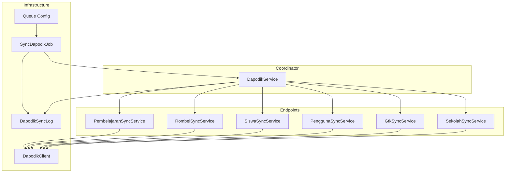
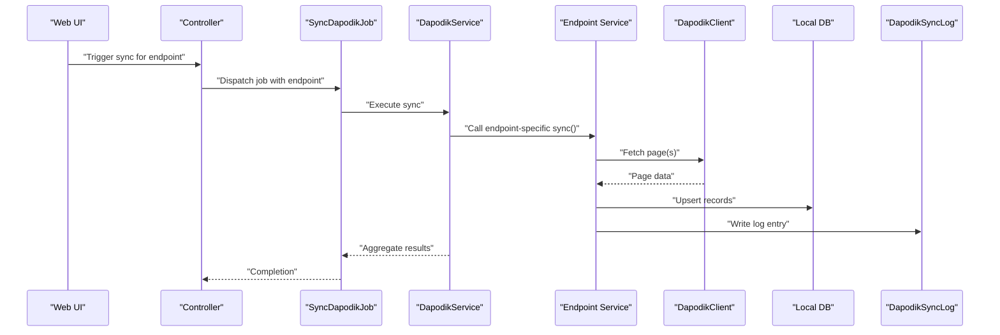
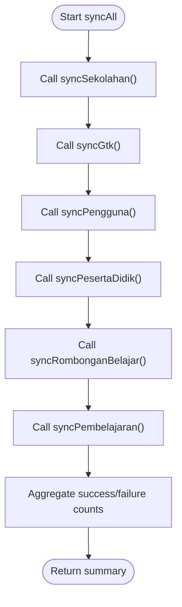
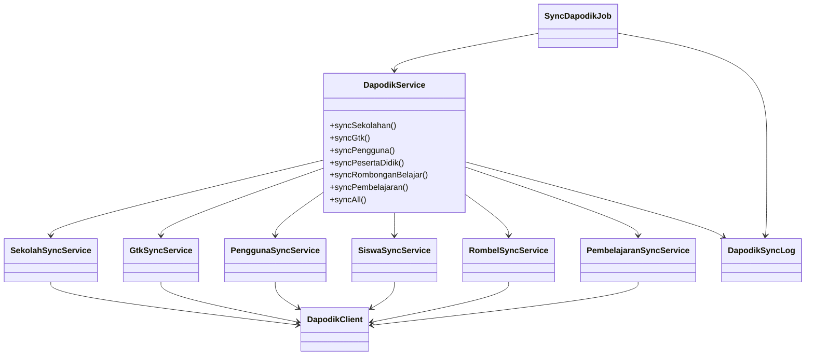
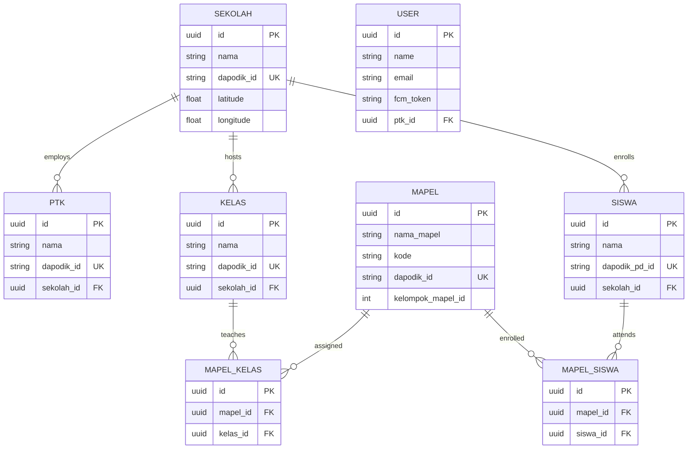

# Data Synchronization

<cite>
**Referenced Files in This Document**
- [DapodikService.php](file://app/Services/DapodikService.php)
- [SiswaSyncService.php](file://app/Services/Dapodik/SiswaSyncService.php)
- [SekolahSyncService.php](file://app/Services/Dapodik/SekolahSyncService.php)
- [GtkSyncService.php](file://app/Services/Dapodik/GtkSyncService.php)
- [PembelajaranSyncService.php](file://app/Services/Dapodik/PembelajaranSyncService.php)
- [RombelSyncService.php](file://app/Services/Dapodik/RombelSyncService.php)
- [PenggunaSyncService.php](file://app/Services/Dapodik/PenggunaSyncService.php)
- [DapodikClient.php](file://app/Services/Dapodik/DapodikClient.php)
- [SyncDapodikJob.php](file://app/Jobs/SyncDapodikJob.php)
- [DapodikSyncLog.php](file://app/Models/DapodikSyncLog.php)
- [queue.php](file://config/queue.php)
- [DapodikJobTest.php](file://tests/Feature/Tu/Dapodik/DapodikJobTest.php)
- [2026_06_02_040000_create_dapodik_sync_logs_table.php](file://database/migrations/2026_06_02_040000_create_dapodik_sync_logs_table.php)
- [2026_06_04_000001_add_batch_fields_to_dapodik_sync_logs_table.php](file://database/migrations/2026_06_04_000001_add_batch_fields_to_dapodik_sync_logs_table.php)
- [2026_06_02_050000_add_dapodik_pd_id_to_siswa_table.php](file://database/migrations/2026_06_02_050000_add_dapodik_pd_id_to_siswa_table.php)
- [2026_06_02_080000_add_dapodik_id_to_sekolah_table.php](file://database/migrations/2026_06_02_080000_add_dapodik_id_to_sekolah_table.php)
- [2026_06_02_080001_add_dapodik_id_to_kelas_table.php](file://database/migrations/2026_06_02_080001_add_dapodik_id_to_kelas_table.php)
- [2026_06_02_080002_add_dapodik_id_to_mapel_table.php](file://database/migrations/2026_06_02_080002_add_dapodik_id_to_mapel_table.php)
- [2026_06_02_080003_add_dapodik_id_to_mapel_kelas_table.php](file://database/migrations/2026_06_02_080003_add_dapodik_id_to_mapel_kelas_table.php)
- [2026_06_04_120000_create_ptk_table_and_migrate_from_users.php](file://database/migrations/2026_06_04_120000_create_ptk_table_and_migrate_from_users.php)
- [2026_06_04_130000_create_guru_menu_akses_table.php](file://database/migrations/2026_06_04_130000_create_guru_menu_akses_table.php)
- [2026_06_08_100000_create_push_subscriptions_table.php](file://database/migrations/2026_06_08_100000_create_push_subscriptions_table.php)
- [2026_06_10_000001_add_fcm_token_to_users_table.php](file://database/migrations/2026_06_10_000001_add_fcm_token_to_users_table.php)
- [2026_06_10_090001_add_gps_fields_to_sekolah_table.php](file://database/migrations/2026_06_10_090001_add_gps_fields_to_sekolah_table.php)
- [2026_06_10_090002_create_presensi_guru_tu_table.php](file://database/migrations/2026_06_10_090002_create_presensi_guru_tu_table.php)
- [2026_06_13_150000_add_format_rapor_to_sekolah_table.php](file://database/migrations/2026_06_13_150000_add_format_rapor_to_sekolah_table.php)
- [2026_06_01_010808_create_sekolah_table.php](file://database/migrations/2026_06_01_010808_create_sekolah_table.php)
- [2026_06_01_010808_create_siswa_table.php](file://database/migrations/2026_06_01_010808_create_siswa_table.php)
- [2026_06_01_010809_create_kelas_table.php](file://database/migrations/2026_06_01_010809_create_kelas_table.php)
- [2026_06_01_010808_create_mapel_table.php](file://database/migrations/2026_06_01_010808_create_mapel_table.php)
- [2026_06_01_010809_create_mapel_kelas_table.php](file://database/migrations/2026_06_01_010809_create_mapel_kelas_table.php)
- [2026_06_04_120000_create_ptk_table_and_migrate_from_users.php](file://database/migrations/2026_06_04_120000_create_ptk_table_and_migrate_from_users.php)
- [2026_06_01_010816_create_mapel_siswa_table.php](file://database/migrations/2026_06_01_010816_create_mapel_siswa_table.php)
- [2026_06_01_010816_create_siswa_kelas_table.php](file://database/migrations/2026_06_01_010816_create_siswa_kelas_table.php)
- [2026_06_01_010816_create_kelas_wali_table.php](file://database/migrations/2026_06_01_010816_create_kelas_wali_table.php)
- [2026_06_01_010816_create_pembina_eskul_table.php](file://database/migrations/2026_06_01_010816_create_pembina_eskul_table.php)
- [2026_06_01_010816_create_siswa_eskul_table.php](file://database/migrations/2026_06_01_010816_create_siswa_eskul_table.php)
- [2026_06_01_010816_create_siswa_prakerin_table.php](file://database/migrations/2026_06_01_010816_create_siswa_prakerin_table.php)
- [2026_06_01_010816_create_prakerin_table.php](file://database/migrations/2026_06_01_010816_create_prakerin_table.php)
- [2026_06_01_010816_create_nilai_kelas_table.php](file://database/migrations/2026_06_01_010816_create_nilai_kelas_table.php)
- [2026_06_01_010816_create_nilai_mapel_table.php](file://database/migrations/2026_06_01_010816_create_nilai_mapel_table.php)
- [2026_06_01_010816_create_nilai_mata_pelajaran_table.php](file://database/migrations/2026_06_01_010816_create_nilai_mata_pelajaran_table.php)
- [2026_06_01_010816_create_nilai_proyek_table.php](file://database/migrations/2026_06_01_010816_create_nilai_proyek_table.php)
- [2026_06_01_010816_create_nilai_kokurikuler_table.php](file://database/migrations/2026_06_01_010816_create_nilai_kokurikuler_table.php)
- [2026_06_01_010816_create_nilai_assesmen_subelemen_table.php](file://database/migrations/2026_06_01_010816_create_nilai_assesmen_subelemen_table.php)
- [2026_06_01_010816_create_nilai_kokurikuler_table.php](file://database/migrations/2026_06_01_010816_create_nilai_kokurikuler_table.php)
- [2026_06_01_010816_create_nilai_proyek_table.php](file://database/migrations/2026_06_01_010816_create_nilai_proyek_table.php)
- [2026_06_01_010816_create_nilai_assesmen_subelemen_table.php](file://database/migrations/2026_06_01_010816_create_nilai_assesmen_subelemen_table.php)
- [2026_06_01_010816_create_nilai_kelas_table.php](file://database/migrations/2026_06_01_010816_create_nilai_kelas_table.php)
- [2026_06_01_010816_create_nilai_mapel_table.php](file://database/migrations/2026_06_01_010816_create_nilai_mapel_table.php)
- [2026_06_01_010816_create_nilai_mata_pelajaran_table.php](file://database/migrations/2026_06_01_010816_create_nilai_mata_pelajaran_table.php)
- [2026_06_01_010816_create_nilai_proyek_table.php](file://database/migrations/2026_06_01_010816_create_nilai_proyek_table.php)
- [2026_06_01_010816_create_nilai_kokurikuler_table.php](file://database/migrations/2026_06_01_010816_create_nilai_kokurikuler_table.php)
- [2026_06_01_010816_create_nilai_assesmen_subelemen_table.php](file://database/migrations/2026_06_01_010816_create_nilai_assesmen_subelemen_table.php)
- [2026_06_01_010816_create_nilai_kelas_table.php](file://database/migrations/2026_06_01_010816_create_nilai_kelas_table.php)
- [2026_06_01_010816_create_nilai_mapel_table.php](file://database/migrations/2026_06_01_010816_create_nilai_mapel_table.php)
- [2026_06_01_010816_create_nilai_mata_pelajaran_table.php](file://database/migrations/2026_06_01_010816_create_nilai_mata_pelajaran_table.php)
- [2026_06_01_010816_create_nilai_proyek_table.php](file://database/migrations/2026_06_01_010816_create_nilai_proyek_table.php)
- [2026_06_01_010816_create_nilai_kokurikuler_table.php](file://database/migrations/2026_06_01_010816_create_nilai_kokurikuler_table.php)
- [2026_06_01_010816_create_nilai_assesmen_subelemen_table.php](file://database/migrations/2026_06_01_010816_create_nilai_assesmen_subelemen_table.php)
- [2026_06_01_010816_create_nilai_kelas_table.php](file://database/migrations/2026_06_01_010816_create_nilai_kelas_table.php)
- [2026_06_01_010816_create_nilai_mapel_table.php](file://database/migrations/2026_06_01_010816_create_nilai_mapel_table.php)
- [2026_06_01_010816_create_nilai_mata_pelajaran_table.php](file://database/migrations/2026_06_01_010816_create_nilai_mata_pelajaran_table.php)
- [2026_06_01_010816_create_nilai_proyek_table.php](file://database/migrations/2026_06_01_010816_create_nilai_proyek_table.php)
- [2026_06_01_010816_create_nilai_kokurikuler_table.php](file://database/migrations/2026_06_01_010816_create_nilai_kokurikuler_table.php)
- [2026_06_01_010816_create_nilai_assesmen_subelemen_table.php](file://database/migrations/2026_06_01_010816_create_nilai_assesmen_subelemen_table.php)
- [2026_06_01_010816_create_nilai_kelas_table.php](file://database/migrations/2026_06_01_010816_create_nilai_kelas_table.php)
- [2026_06_01_010816_create_nilai_mapel_table.php](file://database/migrations/2026_06_01_010816_create_nilai_mapel_table.php)
- [2026_06_01_010816_create_nilai_mata_pelajaran_table.php](file://database/migrations/2026_06_01_010816_create_nilai_mata_pelajaran_table.php)
- [2026_06_01_010816_create_nilai_proyek_table.php](file://database/migrations/2026_06_01_010816_create_nilai_proyek_table.php)
- [2026_06_01_010816_create_nilai_kokurikuler_table.php](file://database/migrations/2026_06_01_010816_create_nilai_kokurikuler_table.php)
- [2026_06_01_010816_create_nilai_assesmen_subelemen_table.php](file://database/migrations/2026_06_01_010816_create_nilai_assesmen_subelemen_table.php)
- [2026_06_01_010816_create_nilai_kelas_table.php](file://database/migrations/2026_06_01_010816_create_nilai_kelas_table.php)
- [2026_06_01_010816_create_nilai_mapel_table.php](file://database/migrations/2026_06_01_010816_create_nilai_mapel_table.php)
- [2026_06_01_010816_create_nilai_mata_pelajaran_table.php](file://database/migrations/2026_06_01_010816_create_nilai_mata_pelajaran_table.php)
- [2026_06_01_010816_create_nilai_proyek_table.php](file://database/migrations/2026_06_01_010816_create_nilai_proyek_table.php)
- [2026_06_01_010816_create_nilai_kokurikuler_table.php](file://database/migrations/2026_06_01_010816_create_nilai_kokurikuler_table.php)
- [2026_06_01_010816_create_nilai_assesmen_subelemen_table.php](file://database/migrations/2026_06_01_010816_create_nilai_assesmen_subelemen_table.php)
- [2026_06_01_010816_create_nilai_kelas_table.php](file://database/migrations/2026_06_01_010816_create_nilai_kelas_table.php)
- [2026_06_01_010816_create_nilai_mapel_table.php](file://database/migrations/2026_06_01_010816_create_nilai_mapel_table.php)
- [2026_06_01_010816_create_nilai_mata_pelajaran_table.php](file://database/migrations/2026_06_01_010816_create_nilai_mata_pelajaran_table.php)
- [2026_06_01_010816_create_nilai_proyek_table.php](file://database/migrations/2026_06_01_010816_create_nilai_proyek_table.php)
- [2026_06_01_010816_create_nilai_kokurikuler_table.php](file://database/migrations/2026_06_01_010816_create_nilai_kokurikuler_table.php)
- [2026_06_01_010816_create_nilai_assesmen_subelemen_table.php](file......
</cite>

## Table of Contents
1. [Introduction](#introduction)
2. [Project Structure](#project-structure)
3. [Core Components](#core-components)
4. [Architecture Overview](#architecture-overview)
5. [Detailed Component Analysis](#detailed-component-analysis)
6. [Dependency Analysis](#dependency-analysis)
7. [Performance Considerations](#performance-considerations)
8. [Troubleshooting Guide](#troubleshooting-guide)
9. [Conclusion](#conclusion)
10. [Appendices](#appendices)

## Introduction
This document describes the data synchronization system for integrating with the Dapodik API. It covers the end-to-end workflow for synchronizing school, teacher, student, and curriculum data, including extraction from external endpoints, transformation into internal models, and loading into the local database. It also documents conflict detection and resolution strategies, batch processing capabilities, real-time and scheduled synchronization triggers, validation rules, quality checks, error handling, and performance optimization techniques tailored for large-scale operations.

## Project Structure
The synchronization system centers around a coordinator service that delegates to specialized services per domain (school, teacher, student, curriculum). Jobs orchestrate asynchronous execution, while logs track outcomes. Configuration controls queue behavior and retries.

**Diagram sources**
- [DapodikService.php:20-107](file://app/Services/DapodikService.php#L20-L107)
- [SekolahSyncService.php](file://app/Services/Dapodik/SekolahSyncService.php)
- [GtkSyncService.php](file://app/Services/Dapodik/GtkSyncService.php)
- [PenggunaSyncService.php](file://app/Services/Dapodik/PenggunaSyncService.php)
- [SiswaSyncService.php](file://app/Services/Dapodik/SiswaSyncService.php)
- [RombelSyncService.php](file://app/Services/Dapodik/RombelSyncService.php)
- [PembelajaranSyncService.php](file://app/Services/Dapodik/PembelajaranSyncService.php)
- [DapodikClient.php](file://app/Services/Dapodik/DapodikClient.php)
- [SyncDapodikJob.php](file://app/Jobs/SyncDapodikJob.php)
- [DapodikSyncLog.php](file://app/Models/DapodikSyncLog.php)
- [queue.php:67-129](file://config/queue.php#L67-L129)

**Section sources**
- [DapodikService.php:20-107](file://app/Services/DapodikService.php#L20-L107)
- [queue.php:67-129](file://config/queue.php#L67-L129)

## Core Components
- DapodikService: Orchestrates all synchronization endpoints and aggregates results.
- Endpoint-specific services: Handle extraction, transformation, and loading for school, teacher, user/pengguna, student, class/group, and curriculum domains.
- DapodikClient: Encapsulates HTTP communication with the Dapodik API.
- SyncDapodikJob: Queued job wrapper for endpoint-triggered synchronization.
- DapodikSyncLog: Persistent record of sync runs, including batch metadata.

Key responsibilities:
- Extraction: Fetches paginated data from Dapodik endpoints via DapodikClient.
- Transformation: Normalizes fields, resolves foreign keys, ensures defaults, and validates required attributes.
- Loading: Uses first-or-create and update semantics to maintain referential integrity and avoid duplicates.
- Conflict handling: Resolves duplicates via unique constraints and dapodik_id fields; handles missing required fields by throwing exceptions or skipping records.
- Logging: Records success/failure counts and batch identifiers for auditability.

**Section sources**
- [DapodikService.php:20-107](file://app/Services/DapodikService.php#L20-L107)
- [SyncDapodikJob.php](file://app/Jobs/SyncDapodikJob.php)
- [DapodikSyncLog.php](file://app/Models/DapodikSyncLog.php)
- [queue.php:67-129](file://config/queue.php#L67-L129)

## Architecture Overview
The system supports two primary execution modes:
- Real-time trigger: Web UI dispatches a queued job per endpoint.
- Scheduled operation: Back-end automation can enqueue jobs periodically.

**Diagram sources**
- [SyncDapodikJob.php](file://app/Jobs/SyncDapodikJob.php)
- [DapodikService.php:48-107](file://app/Services/DapodikService.php#L48-L107)
- [SekolahSyncService.php](file://app/Services/Dapodik/SekolahSyncService.php)
- [SiswaSyncService.php](file://app/Services/Dapodik/SiswaSyncService.php)
- [PembelajaranSyncService.php](file://app/Services/Dapodik/PembelajaranSyncService.php)
- [DapodikClient.php](file://app/Services/Dapodik/DapodikClient.php)
- [DapodikSyncLog.php](file://app/Models/DapodikSyncLog.php)

## Detailed Component Analysis

### School Data Synchronization
Purpose: Synchronize school master data and establish local references.

Workflow:
- Extract: Paginate school records from the Dapodik API.
- Transform: Map fields to the local sekolah entity; ensure dapodik_id uniqueness; create default references if missing.
- Load: Upsert using dapodik_id as the external identifier; maintain GPS and other metadata.

Conflict handling:
- Duplicate detection via dapodik_id; updates overwrite existing records.
- Missing required fields cause exceptions to halt problematic records.

Batching:
- Implemented via pagination and chunked processing in the endpoint service.

Real-time/scheduled:
- Dispatched via SyncDapodikJob with endpoint "sekolah".

Validation:
- Required fields enforced during transform; exceptions surfaced to logs.

**Section sources**
- [SekolahSyncService.php](file://app/Services/Dapodik/SekolahSyncService.php)
- [2026_06_02_080000_add_dapodik_id_to_sekolah_table.php](file://database/migrations/2026_06_02_080000_add_dapodik_id_to_sekolah_table.php)
- [2026_06_10_090001_add_gps_fields_to_sekolah_table.php](file://database/migrations/2026_06_10_090001_add_gps_fields_to_sekolah_table.php)

### Teacher Data Synchronization
Purpose: Synchronize teacher (GTK) records and integrate into the staff model.

Workflow:
- Extract: Iterate pages of GTK data.
- Transform: Normalize identifiers and build local staff records.
- Load: Upsert by dapodik_id; maintain relationships to school and roles.

Conflict handling:
- Unique constraint on dapodik_id; updates reconcile changes.

Batching:
- Pagination-based processing.

Real-time/scheduled:
- Endpoint "gtk".

Validation:
- Required identifiers validated; exceptions logged.

**Section sources**
- [GtkSyncService.php](file://app/Services/Dapodik/GtkSyncService.php)
- [2026_06_04_120000_create_ptk_table_and_migrate_from_users.php](file://database/migrations/2026_06_04_120000_create_ptk_table_and_migrate_from_users.php)

### User/Pengguna Data Synchronization
Purpose: Synchronize user accounts linked to teachers and administrative roles.

Workflow:
- Extract: Fetch user records from the API.
- Transform: Map to internal user model; preserve role assignments.
- Load: Upsert by dapodik_id; ensure FCM token fields if present.

Conflict handling:
- dapodik_id uniqueness; updates reconcile changes.

Batching:
- Page-based iteration.

Real-time/scheduled:
- Endpoint "pengguna".

Validation:
- Required fields enforced; errors captured in logs.

**Section sources**
- [PenggunaSyncService.php](file://app/Services/Dapodik/PenggunaSyncService.php)
- [2026_06_10_000001_add_fcm_token_to_users_table.php](file://database/migrations/2026_06_10_000001_add_fcm_token_to_users_table.php)

### Student Data Synchronization
Purpose: Synchronize student records and establish class membership.

Workflow:
- Extract: Iterate pages of student data.
- Transform: Map to siswa; ensure dapodik_pd_id linkage; handle guardian and demographic fields.
- Load: Upsert by dapodik_pd_id; create class memberships via siswa_kelas.

Conflict handling:
- dapodik_pd_id uniqueness; updates reconcile changes.
- Class membership maintained via mapel_siswa and siswa_kelas.

Batching:
- Pagination-based processing.

Real-time/scheduled:
- Endpoint "peserta-didik".

Validation:
- Required identifiers validated; exceptions logged.

**Section sources**
- [SiswaSyncService.php](file://app/Services/Dapodik/SiswaSyncService.php)
- [2026_06_02_050000_add_dapodik_pd_id_to_siswa_table.php](file://database/migrations/2026_06_02_050000_add_dapodik_pd_id_to_siswa_table.php)
- [2026_06_01_010816_create_siswa_kelas_table.php](file://database/migrations/2026_06_01_010816_create_siswa_kelas_table.php)
- [2026_06_01_010816_create_mapel_siswa_table.php](file://database/migrations/2026_06_01_010816_create_mapel_siswa_table.php)

### Curriculum and Class Group Synchronization
Purpose: Synchronize class groups (rombongan belajar), subjects (mata pelajaran), and their relationships.

Workflow:
- Extract: Fetch class group and subject data.
- Transform: Resolve academic year and semester; ensure default subject group exists; map subject codes and names.
- Load: Create subjects with dapodik_id; link to classes and students via mapel_kelas and mapel_siswa.

Conflict handling:
- Subject uniqueness by name; default subject group created if absent.
- dapodik_id fields prevent duplicates.

Batching:
- Pagination-based processing.

Real-time/scheduled:
- Endpoint "rombongan-belajar" and "pembelajaran".

Validation:
- Required subject name; exceptions raised for invalid records.

**Section sources**
- [RombelSyncService.php](file://app/Services/Dapodik/RombelSyncService.php)
- [PembelajaranSyncService.php:109-128](file://app/Services/Dapodik/PembelajaranSyncService.php#L109-L128)
- [2026_06_02_080001_add_dapodik_id_to_kelas_table.php](file://database/migrations/2026_06_02_080001_add_dapodik_id_to_kelas_table.php)
- [2026_06_02_080002_add_dapodik_id_to_mapel_table.php](file://database/migrations/2026_06_02_080002_add_dapodik_id_to_mapel_table.php)
- [2026_06_02_080003_add_dapodik_id_to_mapel_kelas_table.php](file://database/migrations/2026_06_02_080003_add_dapodik_id_to_mapel_kelas_table.php)
- [2026_06_01_010809_create_mapel_kelas_table.php](file://database/migrations/2026_06_01_010809_create_mapel_kelas_table.php)
- [2026_06_01_010808_create_mapel_table.php](file://database/migrations/2026_06_01_010808_create_mapel_table.php)

### Orchestration and Aggregation
DapodikService coordinates all endpoints and aggregates results, enabling a unified "sync all" operation.

**Diagram sources**
- [DapodikService.php:78-107](file://app/Services/DapodikService.php#L78-L107)

**Section sources**
- [DapodikService.php:78-107](file://app/Services/DapodikService.php#L78-L107)

## Dependency Analysis
The synchronization stack exhibits clear separation of concerns:
- Coordinator depends on endpoint services.
- Endpoint services depend on DapodikClient.
- Jobs depend on the coordinator and persist logs.
- Database migrations define external ID fields and relationships.

**Diagram sources**
- [DapodikService.php:20-107](file://app/Services/DapodikService.php#L20-L107)
- [SekolahSyncService.php](file://app/Services/Dapodik/SekolahSyncService.php)
- [GtkSyncService.php](file://app/Services/Dapodik/GtkSyncService.php)
- [PenggunaSyncService.php](file://app/Services/Dapodik/PenggunaSyncService.php)
- [SiswaSyncService.php](file://app/Services/Dapodik/SiswaSyncService.php)
- [RombelSyncService.php](file://app/Services/Dapodik/RombelSyncService.php)
- [PembelajaranSyncService.php](file://app/Services/Dapodik/PembelajaranSyncService.php)
- [DapodikClient.php](file://app/Services/Dapodik/DapodikClient.php)
- [SyncDapodikJob.php](file://app/Jobs/SyncDapodikJob.php)
- [DapodikSyncLog.php](file://app/Models/DapodikSyncLog.php)

**Section sources**
- [DapodikService.php:20-107](file://app/Services/DapodikService.php#L20-L107)
- [SyncDapodikJob.php](file://app/Jobs/SyncDapodikJob.php)
- [DapodikSyncLog.php](file://app/Models/DapodikSyncLog.php)

## Performance Considerations
- Queue configuration: Redis-backed queues with configurable retry windows and failed job storage enable resilient, scalable processing.
- Job uniqueness: Using unique job identifiers prevents duplicate concurrent runs for the same endpoint.
- Retry strategy: Time-based retries and batched job execution reduce pressure on external APIs.
- Memory management: Pagination and chunked processing minimize memory footprint during large syncs.
- Parallelism: Separate queues and supervisors can process different endpoints concurrently.

Recommendations:
- Tune queue retry_after and horizon supervisors for production loads.
- Apply rate limiting middleware for external API calls.
- Use ShouldBeUniqueUntilProcessing to release locks early and allow overlapping enqueues.

**Section sources**
- [queue.php:67-129](file://config/queue.php#L67-L129)
- [.agents\skills\laravel-best-practices\rules\queue-jobs.md:77-145](file://.agents\skills\laravel-best-practices\rules\queue-jobs.md#L77-L145)

## Troubleshooting Guide
Common issues and resolutions:
- Duplicate records: Ensure dapodik_id fields are populated; rely on first-or-create semantics to deduplicate.
- Missing required fields: Validation throws exceptions; review transform logic and skip or log problematic records.
- External API failures: Leverage job retryUntil and failed job storage; monitor queue workers.
- Batch anomalies: Verify batch fields in logs and confirm pagination completeness.

Operational checks:
- Confirm job dispatch and uniqueId behavior.
- Inspect DapodikSyncLog entries for endpoint-specific outcomes.
- Validate database migrations for dapodik_id fields and relationships.

**Section sources**
- [DapodikJobTest.php:27-52](file://tests/Feature/Tu/Dapodik/DapodikJobTest.php#L27-L52)
- [DapodikSyncLog.php](file://app/Models/DapodikSyncLog.php)
- [2026_06_04_000001_add_batch_fields_to_dapodik_sync_logs_table.php](file://database/migrations/2026_06_04_000001_add_batch_fields_to_dapodik_sync_logs_table.php)

## Conclusion
The synchronization system provides a robust, modular pipeline for integrating Dapodik data. By leveraging queued jobs, pagination, and idempotent upserts, it achieves reliability and scalability. Clear validation and logging facilitate troubleshooting, while flexible configuration supports both real-time and scheduled operations.

## Appendices

### Data Model Overview
External identifiers and relationships are persisted to support reconciliation and referential integrity.

**Diagram sources**
- [2026_06_01_010808_create_sekolah_table.php](file://database/migrations/2026_06_01_010808_create_sekolah_table.php)
- [2026_06_01_010808_create_siswa_table.php](file://database/migrations/2026_06_01_010808_create_siswa_table.php)
- [2026_06_01_010809_create_kelas_table.php](file://database/migrations/2026_06_01_010809_create_kelas_table.php)
- [2026_06_01_010808_create_mapel_table.php](file://database/migrations/2026_06_01_010808_create_mapel_table.php)
- [2026_06_01_010809_create_mapel_kelas_table.php](file://database/migrations/2026_06_01_010809_create_mapel_kelas_table.php)
- [2026_06_01_010816_create_mapel_siswa_table.php](file://database/migrations/2026_06_01_010816_create_mapel_siswa_table.php)
- [2026_06_02_080000_add_dapodik_id_to_sekolah_table.php](file://database/migrations/2026_06_02_080000_add_dapodik_id_to_sekolah_table.php)
- [2026_06_02_080001_add_dapodik_id_to_kelas_table.php](file://database/migrations/2026_06_02_080001_add_dapodik_id_to_kelas_table.php)
- [2026_06_02_080002_add_dapodik_id_to_mapel_table.php](file://database/migrations/2026_06_02_080002_add_dapodik_id_to_mapel_table.php)
- [2026_06_02_080003_add_dapodik_id_to_mapel_kelas_table.php](file://database/migrations/2026_06_02_080003_add_dapodik_id_to_mapel_kelas_table.php)
- [2026_06_04_120000_create_ptk_table_and_migrate_from_users.php](file://database/migrations/2026_06_04_120000_create_ptk_table_and_migrate_from_users.php)
- [2026_06_10_000001_add_fcm_token_to_users_table.php](file://database/migrations/2026_06_10_000001_add_fcm_token_to_users_table.php)

### Sync Configuration Examples
- Endpoint selection: "sekolah", "peserta-didik", "rombongan-belajar", "pengguna", "gtk", "pembelajaran".
- Job uniqueness: uniqueId per endpoint to prevent concurrent runs.
- Batch fields: Logged in DapodikSyncLog for auditability.

**Section sources**
- [DapodikJobTest.php:36-46](file://tests/Feature/Tu/Dapodik/DapodikJobTest.php#L36-L46)
- [DapodikSyncLog.php](file://app/Models/DapodikSyncLog.php)
- [2026_06_04_000001_add_batch_fields_to_dapodik_sync_logs_table.php](file://database/migrations/2026_06_04_000001_add_batch_fields_to_dapodik_sync_logs_table.php)

### Transformation Logic Highlights
- School: dapodik_id uniqueness; GPS fields optional but recommended.
- Teacher: dapodik_id uniqueness; links to school.
- User: optional FCM token; links to PTK.
- Student: dapodik_pd_id uniqueness; class membership via siswa_kelas and mapel_siswa.
- Curriculum: default subject group creation; subject uniqueness by name; dapodik_id mapping.

**Section sources**
- [SekolahSyncService.php](file://app/Services/Dapodik/SekolahSyncService.php)
- [GtkSyncService.php](file://app/Services/Dapodik/GtkSyncService.php)
- [PenggunaSyncService.php](file://app/Services/Dapodik/PenggunaSyncService.php)
- [SiswaSyncService.php](file://app/Services/Dapodik/SiswaSyncService.php)
- [PembelajaranSyncService.php:95-128](file://app/Services/Dapodik/PembelajaranSyncService.php#L95-L128)