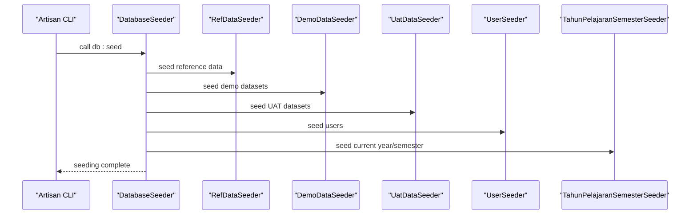
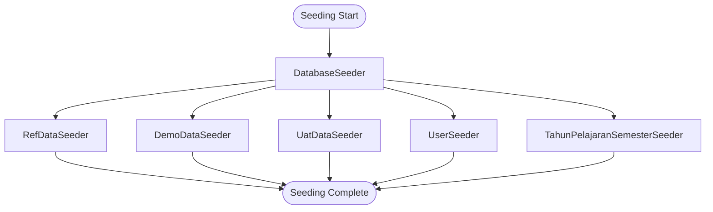

# Data Factories & Seeders

<cite>
**Referenced Files in This Document**
- [DatabaseSeeder.php](file://database/seeders/DatabaseSeeder.php)
- [RefDataSeeder.php](file://database/seeders/RefDataSeeder.php)
- [DemoDataSeeder.php](file://database/seeders/DemoDataSeeder.php)
- [UatDataSeeder.php](file://database/seeders/UatDataSeeder.php)
- [UserSeeder.php](file://database/seeders/UserSeeder.php)
- [TahunPelajaranSemesterSeeder.php](file://database/seeders/TahunPelajaranSemesterSeeder.php)
- [SiswaFactory.php](file://database/factories/SiswaFactory.php)
- [UserFactory.php](file://database/factories/UserFactory.php)
- [KelasFactory.php](file://database/factories/KelasFactory.php)
- [NilaiMapelFactory.php](file://database/factories/NilaiMapelFactory.php)
- [DeskripsiRaporFactory.php](file://database/factories/DeskripsiRaporFactory.php)
- [PresensiFactory.php](file://database/factories/PresensiFactory.php)
- [SiswaKelasFactory.php](file://database/factories/SiswaKelasFactory.php)
- [MapelFactory.php](file://database/factories/MapelFactory.php)
- [CatatanWaliFactory.php](file://database/factories/CatatanWaliFactory.php)
- [PrestasiFactory.php](file://database/factories/PrestasiFactory.php)
- [EskulFactory.php](file://database/factories/EskulFactory.php)
- [SiswaEskulFactory.php](file://database/factories/SiswaEskulFactory.php)
- [PrakerinFactory.php](file://database/factories/PrakerinFactory.php)
- [SiswaPrakerinFactory.php](file://database/factories/SiswaPrakerinFactory.php)
- [NilaiKokurikulerFactory.php](file://database/factories/NilaiKokurikulerFactory.php)
- [NilaiPrakerinFactory.php](file://database/factories/NilaiPrakerinFactory.php)
- [DapodikSyncLogFactory.php](file://database/factories/DapodikSyncLogFactory.php)
- [PembinaEskulFactory.php](file://database/factories/PembinaEskulFactory.php)
- [KelasWaliFactory.php](file://database/factories/KelasWaliFactory.php)
- [PiketHarianFactory.php](file://database/factories/PiketHarianFactory.php)
- [PengingatFactory.php](file://database/factories/PengingatFactory.php)
- [OrganisasiFactory.php](file://database/factories/OrganisasiFactory.php)
- [ProyekKelasFactory.php](file://database/factories/ProyekKelasFactory.php)
- [ProyekTemaFactory.php](file://database/factories/ProyekTemaFactory.php)
- [SubElemenFactory.php](file://database/factories/SubElemenFactory.php)
- [ElemenFactory.php](file://database/factories/ElemenFactory.php)
- [DimensiFactory.php](file://database/factories/DimensiFactory.php)
- [TingkatFactory.php](file://database/factories/TingkatFactory.php)
- [KompetensiKeahlianFactory.php](file://database/factories/KompetensiKeahlianFactory.php)
- [KelompokMapelFactory.php](file://database/factories/KelompokMapelFactory.php)
- [SekolahFactory.php](file://database/factories/SekolahFactory.php)
- [TahunPelajaranFactory.php](file://database/factories/TahunPelajaranFactory.php)
- [SemesterFactory.php](file://database/factories/SemesterFactory.php)
- [RefHariFactory.php](file://database/factories/RefHariFactory.php)
- [RefJenisKeluarFactory.php](file://database/factories/RefJenisKeluarFactory.php)
- [NilaiFormatifFactory.php](file://database/factories/NilaiFormatifFactory.php)
- [NilaiSumatifAsFactory.php](file://database/factories/NilaiSumatifAsFactory.php)
- [NilaiSumatifPhFactory.php](file://database/factories/NilaiSumatifPhFactory.php)
- [NilaiSumatifTsFactory.php](file://database/factories/NilaiSumatifTsFactory.php)
- [LulusanFactory.php](file://database/factories/LulusanFactory.php)
- [MutasiMasukFactory.php](file://database/factories/MutasiMasukFactory.php)
- [MutasiKeluarFactory.php](file://database/factories/MutasiKeluarFactory.php)
- [MapelKelasFactory.php](file://database/factories/MapelKelasFactory.php)
- [MapelSiswaFactory.php](file://database/factories/MapelSiswaFactory.php)
- [KepalaSekolahFactory.php](file://database/factories/KepalaSekolahFactory.php)
- [GuruMenuAksesFactory.php](file://database/factories/GuruMenuAksesFactory.php)
- [PushSubscriptionFactory.php](file://database/factories/PushSubscriptionFactory.php)
- [PwaTokenFactory.php](file://database/factories/PwaTokenFactory.php)
- [DapodikClient.php](file://app/Services/Dapodik/DapodikClient.php)
- [SiswaSyncService.php](file://app/Services/Dapodik/SiswaSyncService.php)
- [GtkSyncService.php](file://app/Services/Dapodik/GtkSyncService.php)
- [SekolahSyncService.php](file://app/Services/Dapodik/SekolahSyncService.php)
- [DapodikSyncLog.php](file://app/Models/DapodikSyncLog.php)
- [Siswa.php](file://app/Models/Siswa.php)
- [User.php](file://app/Models/User.php)
- [Kelas.php](file://app/Models/Kelas.php)
- [NilaiMapel.php](file://app/Models/NilaiMapel.php)
- [DeskripsiRapor.php](file://app/Models/DeskripsiRapor.php)
- [Presensi.php](file://app/Models/Presensi.php)
- [SiswaKelas.php](file://app/Models/SiswaKelas.php)
- [Mapel.php](file://app/Models/Mapel.php)
- [CatatanWali.php](file://app/Models/CatatanWali.php)
- [Prestasi.php](file://app/Models/Prestasi.php)
- [Eskul.php](file://app/Models/Eskul.php)
- [SiswaEskul.php](file://app/Models/SiswaEskul.php)
- [Prakerin.php](file://app/Models/Prakerin.php)
- [SiswaPrakerin.php](file://app/Models/SiswaPrakerin.php)
- [NilaiKokurikuler.php](file://app/Models/NilaiKokurikuler.php)
- [NilaiPrakerin.php](file://app/Models/NilaiPrakerin.php)
- [DapodikSyncLog.php](file://app/Models/DapodikSyncLog.php)
- [PembinaEskul.php](file://app/Models/PembinaEskul.php)
- [KelasWali.php](file://app/Models/KelasWali.php)
- [PiketHarian.php](file://app/Models/PiketHarian.php)
- [Pengingat.php](file://app/Models/Pengingat.php)
- [Organisasi.php](file://app/Models/Organisasi.php)
- [ProyekKelas.php](file://app/Models/ProyekKelas.php)
- [ProyekTema.php](file://app/Models/ProyekTema.php)
- [SubElemen.php](file://app/Models/SubElemen.php)
- [Elemen.php](file://app/Models/Elemen.php)
- [Dimensi.php](file://app/Models/Dimensi.php)
- [Tingkat.php](file://app/Models/Tingkat.php)
- [KompetensiKeahlian.php](file://app/Models/KompetensiKeahlian.php)
- [KelompokMapel.php](file://app/Models/KelompokMapel.php)
- [Sekolah.php](file://app/Models/Sekolah.php)
- [TahunPelajaran.php](file://app/Models/TahunPelajaran.php)
- [Semester.php](file://app/Models/Semester.php)
- [RefHari.php](file://app/Models/RefHari.php)
- [RefJenisKeluar.php](file://app/Models/RefJenisKeluar.php)
- [NilaiFormatif.php](file://app/Models/NilaiFormatif.php)
- [NilaiSumatifAs.php](file://app/Models/NilaiSumatifAs.php)
- [NilaiSumatifPh.php](file://app/Models/NilaiSumatifPh.php)
- [NilaiSumatifTs.php](file://app/Models/NilaiSumatifTs.php)
- [Lulusan.php](file://app/Models/Lulusan.php)
- [MutasiMasuk.php](file://app/Models/MutasiMasuk.php)
- [MutasiKeluar.php](file://app/Models/MutasiKeluar.php)
- [MapelKelas.php](file://app/Models/MapelKelas.php)
- [MapelSiswa.php](file://app/Models/MapelSiswa.php)
- [KepalaSekolah.php](file://app/Models/KepalaSekolah.php)
- [GuruMenuAkses.php](file://app/Models/GuruMenuAkses.php)
- [PushSubscription.php](file://app/Models/PushSubscription.php)
- [PwaToken.php](file://app/Models/PwaToken.php)
</cite>

## Table of Contents
1. [Introduction](#introduction)
2. [Project Structure](#project-structure)
3. [Core Components](#core-components)
4. [Architecture Overview](#architecture-overview)
5. [Detailed Component Analysis](#detailed-component-analysis)
6. [Dependency Analysis](#dependency-analysis)
7. [Performance Considerations](#performance-considerations)
8. [Troubleshooting Guide](#troubleshooting-guide)
9. [Conclusion](#conclusion)
10. [Appendices](#appendices)

## Introduction
This document explains the data generation and seeding systems in RaporKM Laravel. It covers factory implementations for realistic test data (students, staff, classes, scores), seeder classes for initial dataset population (reference data, demo datasets, user accounts), and the orchestration of seeding order and dependencies. It also provides guidance on managing testing data, cleanup procedures, environment-specific strategies, and maintaining data consistency across environments.

## Project Structure
The data generation system is organized around Laravel’s Eloquent factories and database seeders:
- Factories live under database/factories and define model states, sequences, and Faker-based attribute generation.
- Seeders live under database/seeders and populate reference data, demo datasets, and user accounts in a controlled order.
- Models under app/Models represent the domain entities and relationships seeded by factories and consumed by seeders.

```mermaid
graph TB
subgraph "Seeders"
DS["DatabaseSeeder"]
RDS["RefDataSeeder"]
DDS["DemoDataSeeder"]
UDS["UatDataSeeder"]
US["UserSeeder"]
YPS["TahunPelajaranSemesterSeeder"]
end
subgraph "Factories"
SF["SiswaFactory"]
UF["UserFactory"]
KF["KelasFactory"]
NF["NilaiMapelFactory"]
DF["DeskripsiRaporFactory"]
PF["PresensiFactory"]
SKF["SiswaKelasFactory"]
MF["MapelFactory"]
CWF["CatatanWaliFactory"]
PRF["PrestasiFactory"]
EF["EskulFactory"]
SEF["SiswaEskulFactory"]
PkF["PrakerinFactory"]
SPkF["SiswaPrakerinFactory"]
NKF["NilaiKokurikulerFactory"]
NPkF["NilaiPrakerinFactory"]
DLF["DapodikSyncLogFactory"]
PBF["PembinaEskulFactory"]
KWF["KelasWaliFactory"]
PhF["PiketHarianFactory"]
PgF["PengingatFactory"]
OF["OrganisasiFactory"]
PkCF["ProyekKelasFactory"]
PTF["ProyekTemaFactory"]
SElF["SubElemenFactory"]
EF2["ElemenFactory"]
DF2["DimensiFactory"]
TF["TingkatFactory"]
KCF["KompetensiKeahlianFactory"]
KMF["KelompokMapelFactory"]
SchF["SekolahFactory"]
TPf["TahunPelajaranFactory"]
SemF["SemesterFactory"]
RHf["RefHariFactory"]
RJKF["RefJenisKeluarFactory"]
NFF["NilaiFormatifFactory"]
NSAF["NilaiSumatifAsFactory"]
NSPF["NilaiSumatifPhFactory"]
NSTF["NilaiSumatifTsFactory"]
LuF["LulusanFactory"]
MMF["MutasiMasukFactory"]
MKF["MutasiKeluarFactory"]
MKfF["MapelKelasFactory"]
MSF["MapelSiswaFactory"]
KSf["KepalaSekolahFactory"]
GMAF["GuruMenuAksesFactory"]
PSF["PushSubscriptionFactory"]
PwSF["PwaTokenFactory"]
end
DS --> RDS
DS --> DDS
DS --> UDS
DS --> US
DS --> YPS
DDS --> SF
DDS --> UF
DDS --> KF
DDS --> NF
DDS --> DF
DDS --> PF
DDS --> SKF
DDS --> MF
DDS --> CWF
DDS --> PRF
DDS --> EF
DDS --> SEF
DDS --> PkF
DDS --> SPkF
DDS --> NKF
DDS --> NPkF
DDS --> DLF
DDS --> PBF
DDS --> KWF
DDS --> PhF
DDS --> PgF
DDS --> OF
DDS --> PkCF
DDS --> PTF
DDS --> SElF
DDS --> EF2
DDS --> DF2
DDS --> TF
DDS --> KCF
DDS --> KMF
DDS --> SchF
DDS --> TPf
DDS --> SemF
DDS --> RHf
DDS --> RJKF
DDS --> NFF
DDS --> NSAF
DDS --> NSPF
DDS --> NSTF
DDS --> LuF
DDS --> MMF
DDS --> MKF
DDS --> MKfF
DDS --> MSF
DDS --> KSf
DDS --> GMAF
DDS --> PSF
DDS --> PwSF
```

**Diagram sources**
- [DatabaseSeeder.php](file://database/seeders/DatabaseSeeder.php)
- [RefDataSeeder.php](file://database/seeders/RefDataSeeder.php)
- [DemoDataSeeder.php](file://database/seeders/DemoDataSeeder.php)
- [UatDataSeeder.php](file://database/seeders/UatDataSeeder.php)
- [UserSeeder.php](file://database/seeders/UserSeeder.php)
- [TahunPelajaranSemesterSeeder.php](file://database/seeders/TahunPelajaranSemesterSeeder.php)
- [SiswaFactory.php](file://database/factories/SiswaFactory.php)
- [UserFactory.php](file://database/factories/UserFactory.php)
- [KelasFactory.php](file://database/factories/KelasFactory.php)
- [NilaiMapelFactory.php](file://database/factories/NilaiMapelFactory.php)
- [DeskripsiRaporFactory.php](file://database/factories/DeskripsiRaporFactory.php)
- [PresensiFactory.php](file://database/factories/PresensiFactory.php)
- [SiswaKelasFactory.php](file://database/factories/SiswaKelasFactory.php)
- [MapelFactory.php](file://database/factories/MapelFactory.php)
- [CatatanWaliFactory.php](file://database/factories/CatatanWaliFactory.php)
- [PrestasiFactory.php](file://database/factories/PrestasiFactory.php)
- [EskulFactory.php](file://database/factories/EskulFactory.php)
- [SiswaEskulFactory.php](file://database/factories/SiswaEskulFactory.php)
- [PrakerinFactory.php](file://database/factories/PrakerinFactory.php)
- [SiswaPrakerinFactory.php](file://database/factories/SiswaPrakerinFactory.php)
- [NilaiKokurikulerFactory.php](file://database/factories/NilaiKokurikulerFactory.php)
- [NilaiPrakerinFactory.php](file://database/factories/NilaiPrakerinFactory.php)
- [DapodikSyncLogFactory.php](file://database/factories/DapodikSyncLogFactory.php)
- [PembinaEskulFactory.php](file://database/factories/PembinaEskulFactory.php)
- [KelasWaliFactory.php](file://database/factories/KelasWaliFactory.php)
- [PiketHarianFactory.php](file://database/factories/PiketHarianFactory.php)
- [PengingatFactory.php](file://database/factories/PengingatFactory.php)
- [OrganisasiFactory.php](file://database/factories/OrganisasiFactory.php)
- [ProyekKelasFactory.php](file://database/factories/ProyekKelasFactory.php)
- [ProyekTemaFactory.php](file://database/factories/ProyekTemaFactory.php)
- [SubElemenFactory.php](file://database/factories/SubElemenFactory.php)
- [ElemenFactory.php](file://database/factories/ElemenFactory.php)
- [DimensiFactory.php](file://database/factories/DimensiFactory.php)
- [TingkatFactory.php](file://database/factories/TingkatFactory.php)
- [KompetensiKeahlianFactory.php](file://database/factories/KompetensiKeahlianFactory.php)
- [KelompokMapelFactory.php](file://database/factories/KelompokMapelFactory.php)
- [SekolahFactory.php](file://database/factories/SekolahFactory.php)
- [TahunPelajaranFactory.php](file://database/factories/TahunPelajaranFactory.php)
- [SemesterFactory.php](file://database/factories/SemesterFactory.php)
- [RefHariFactory.php](file://database/factories/RefHariFactory.php)
- [RefJenisKeluarFactory.php](file://database/factories/RefJenisKeluarFactory.php)
- [NilaiFormatifFactory.php](file://database/factories/NilaiFormatifFactory.php)
- [NilaiSumatifAsFactory.php](file://database/factories/NilaiSumatifAsFactory.php)
- [NilaiSumatifPhFactory.php](file://database/factories/NilaiSumatifPhFactory.php)
- [NilaiSumatifTsFactory.php](file://database/factories/NilaiSumatifTsFactory.php)
- [LulusanFactory.php](file://database/factories/LulusanFactory.php)
- [MutasiMasukFactory.php](file://database/factories/MutasiMasukFactory.php)
- [MutasiKeluarFactory.php](file://database/factories/MutasiKeluarFactory.php)
- [MapelKelasFactory.php](file://database/factories/MapelKelasFactory.php)
- [MapelSiswaFactory.php](file://database/factories/MapelSiswaFactory.php)
- [KepalaSekolahFactory.php](file://database/factories/KepalaSekolahFactory.php)
- [GuruMenuAksesFactory.php](file://database/factories/GuruMenuAksesFactory.php)
- [PushSubscriptionFactory.php](file://database/factories/PushSubscriptionFactory.php)
- [PwaTokenFactory.php](file://database/factories/PwaTokenFactory.php)

**Section sources**
- [DatabaseSeeder.php](file://database/seeders/DatabaseSeeder.php)
- [DemoDataSeeder.php](file://database/seeders/DemoDataSeeder.php)
- [RefDataSeeder.php](file://database/seeders/RefDataSeeder.php)
- [UatDataSeeder.php](file://database/seeders/UatDataSeeder.php)
- [UserSeeder.php](file://database/seeders/UserSeeder.php)
- [TahunPelajaranSemesterSeeder.php](file://database/seeders/TahunPelajaranSemesterSeeder.php)

## Core Components
- Factories: Define model creation strategies, default attributes, sequences, and custom states for realistic data generation.
- Seeders: Orchestrate initial data population, ensuring referential integrity and environment-appropriate datasets.
- Models: Represent domain entities and relationships; factories and seeders target these models.

Key factory categories:
- Student lifecycle: [SiswaFactory.php](file://database/factories/SiswaFactory.php), [SiswaKelasFactory.php](file://database/factories/SiswaKelasFactory.php), [SiswaEskulFactory.php](file://database/factories/SiswaEskulFactory.php), [SiswaPrakerinFactory.php](file://database/factories/SiswaPrakerinFactory.php), [MutasiMasukFactory.php](file://database/factories/MutasiMasukFactory.php), [MutasiKeluarFactory.php](file://database/factories/MutasiKeluarFactory.php), [LulusanFactory.php](file://database/factories/LulusanFactory.php)
- Academic records: [NilaiMapelFactory.php](file://database/factories/NilaiMapelFactory.php), [NilaiFormatifFactory.php](file://database/factories/NilaiFormatifFactory.php), [NilaiSumatifAsFactory.php](file://database/factories/NilaiSumatifAsFactory.php), [NilaiSumatifPhFactory.php](file://database/factories/NilaiSumatifPhFactory.php), [NilaiSumatifTsFactory.php](file://database/factories/NilaiSumatifTsFactory.php), [NilaiKokurikulerFactory.php](file://database/factories/NilaiKokurikulerFactory.php), [NilaiPrakerinFactory.php](file://database/factories/NilaiPrakerinFactory.php)
- Class and curriculum: [KelasFactory.php](file://database/factories/KelasFactory.php), [MapelFactory.php](file://database/factories/MapelFactory.php), [MapelKelasFactory.php](file://database/factories/MapelKelasFactory.php), [MapelSiswaFactory.php](file://database/factories/MapelSiswaFactory.php), [TingkatFactory.php](file://database/factories/TingkatFactory.php), [KompetensiKeahlianFactory.php](file://database/factories/KompetensiKeahlianFactory.php), [KelompokMapelFactory.php](file://database/factories/KelompokMapelFactory.php), [ProyekKelasFactory.php](file://database/factories/ProyekKelasFactory.php), [ProyekTemaFactory.php](file://database/factories/ProyekTemaFactory.php), [ElemenFactory.php](file://database/factories/ElemenFactory.php), [SubElemenFactory.php](file://database/factories/SubElemenFactory.php), [DimensiFactory.php](file://database/factories/DimensiFactory.php), [TujuanPembelajaranFactory.php](file://database/factories/TujuanPembelajaranFactory.php)
- Staff and administration: [UserFactory.php](file://database/factories/UserFactory.php), [KelasWaliFactory.php](file://database/factories/KelasWaliFactory.php), [PembinaEskulFactory.php](file://database/factories/PembinaEskulFactory.php), [KepalaSekolahFactory.php](file://database/factories/KepalaSekolahFactory.php), [GuruMenuAksesFactory.php](file://database/factories/GuruMenuAksesFactory.php)
- Activities and attendance: [PresensiFactory.php](file://database/factories/PresensiFactory.php), [PiketHarianFactory.php](file://database/factories/PiketHarianFactory.php), [PengingatFactory.php](file://database/factories/PengingatFactory.php), [EskulFactory.php](file://database/factories/EskulFactory.php), [PrestasiFactory.php](file://database/factories/PrestasiFactory.php), [CatatanWaliFactory.php](file://database/factories/CatatanWaliFactory.php), [DeskripsiRaporFactory.php](file://database/factories/DeskripsiRaporFactory.php)
- Reference data: [RefHariFactory.php](file://database/factories/RefHariFactory.php), [RefJenisKeluarFactory.php](file://database/factories/RefJenisKeluarFactory.php), [TahunPelajaranFactory.php](file://database/factories/TahunPelajaranFactory.php), [SemesterFactory.php](file://database/factories/SemesterFactory.php), [SekolahFactory.php](file://database/factories/SekolahFactory.php)
- External sync: [DapodikSyncLogFactory.php](file://database/factories/DapodikSyncLogFactory.php), [SiswaSyncService.php](file://app/Services/Dapodik/SiswaSyncService.php), [GtkSyncService.php](file://app/Services/Dapodik/GtkSyncService.php), [SekolahSyncService.php](file://app/Services/Dapodik/SekolahSyncService.php), [DapodikClient.php](file://app/Services/Dapodik/DapodikClient.php)

**Section sources**
- [SiswaFactory.php](file://database/factories/SiswaFactory.php)
- [UserFactory.php](file://database/factories/UserFactory.php)
- [KelasFactory.php](file://database/factories/KelasFactory.php)
- [NilaiMapelFactory.php](file://database/factories/NilaiMapelFactory.php)
- [DeskripsiRaporFactory.php](file://database/factories/DeskripsiRaporFactory.php)
- [PresensiFactory.php](file://database/factories/PresensiFactory.php)
- [SiswaKelasFactory.php](file://database/factories/SiswaKelasFactory.php)
- [MapelFactory.php](file://database/factories/MapelFactory.php)
- [CatatanWaliFactory.php](file://database/factories/CatatanWaliFactory.php)
- [PrestasiFactory.php](file://database/factories/PrestasiFactory.php)
- [EskulFactory.php](file://database/factories/EskulFactory.php)
- [SiswaEskulFactory.php](file://database/factories/SiswaEskulFactory.php)
- [PrakerinFactory.php](file://database/factories/PrakerinFactory.php)
- [SiswaPrakerinFactory.php](file://database/factories/SiswaPrakerinFactory.php)
- [NilaiKokurikulerFactory.php](file://database/factories/NilaiKokurikulerFactory.php)
- [NilaiPrakerinFactory.php](file://database/factories/NilaiPrakerinFactory.php)
- [DapodikSyncLogFactory.php](file://database/factories/DapodikSyncLogFactory.php)
- [PembinaEskulFactory.php](file://database/factories/PembinaEskulFactory.php)
- [KelasWaliFactory.php](file://database/factories/KelasWaliFactory.php)
- [PiketHarianFactory.php](file://database/factories/PiketHarianFactory.php)
- [PengingatFactory.php](file://database/factories/PengingatFactory.php)
- [OrganisasiFactory.php](file://database/factories/OrganisasiFactory.php)
- [ProyekKelasFactory.php](file://database/factories/ProyekKelasFactory.php)
- [ProyekTemaFactory.php](file://database/factories/ProyekTemaFactory.php)
- [SubElemenFactory.php](file://database/factories/SubElemenFactory.php)
- [ElemenFactory.php](file://database/factories/ElemenFactory.php)
- [DimensiFactory.php](file://database/factories/DimensiFactory.php)
- [TingkatFactory.php](file://database/factories/TingkatFactory.php)
- [KompetensiKeahlianFactory.php](file://database/factories/KompetensiKeahlianFactory.php)
- [KelompokMapelFactory.php](file://database/factories/KelompokMapelFactory.php)
- [SekolahFactory.php](file://database/factories/SekolahFactory.php)
- [TahunPelajaranFactory.php](file://database/factories/TahunPelajaranFactory.php)
- [SemesterFactory.php](file://database/factories/SemesterFactory.php)
- [RefHariFactory.php](file://database/factories/RefHariFactory.php)
- [RefJenisKeluarFactory.php](file://database/factories/RefJenisKeluarFactory.php)
- [NilaiFormatifFactory.php](file://database/factories/NilaiFormatifFactory.php)
- [NilaiSumatifAsFactory.php](file://database/factories/NilaiSumatifAsFactory.php)
- [NilaiSumatifPhFactory.php](file://database/factories/NilaiSumatifPhFactory.php)
- [NilaiSumatifTsFactory.php](file://database/factories/NilaiSumatifTsFactory.php)
- [LulusanFactory.php](file://database/factories/LulusanFactory.php)
- [MutasiMasukFactory.php](file://database/factories/MutasiMasukFactory.php)
- [MutasiKeluarFactory.php](file://database/factories/MutasiKeluarFactory.php)
- [MapelKelasFactory.php](file://database/factories/MapelKelasFactory.php)
- [MapelSiswaFactory.php](file://database/factories/MapelSiswaFactory.php)
- [KepalaSekolahFactory.php](file://database/factories/KepalaSekolahFactory.php)
- [GuruMenuAksesFactory.php](file://database/factories/GuruMenuAksesFactory.php)
- [PushSubscriptionFactory.php](file://database/factories/PushSubscriptionFactory.php)
- [PwaTokenFactory.php](file://database/factories/PwaTokenFactory.php)

## Architecture Overview
The seeding architecture follows a layered approach:
- DatabaseSeeder orchestrates the seeding order and delegates to specialized seeders.
- RefDataSeeder seeds static reference data (academic years, semesters, days, exit reasons).
- DemoDataSeeder generates realistic demo datasets for students, classes, subjects, grades, activities, and administrative entities.
- UatDataSeeder prepares datasets for user acceptance testing.
- UserSeeder creates admin and role-based user accounts.
- TahunPelajaranSemesterSeeder ensures current academic year and semester are set.

**Diagram sources**
- [DatabaseSeeder.php](file://database/seeders/DatabaseSeeder.php)
- [RefDataSeeder.php](file://database/seeders/RefDataSeeder.php)
- [DemoDataSeeder.php](file://database/seeders/DemoDataSeeder.php)
- [UatDataSeeder.php](file://database/seeders/UatDataSeeder.php)
- [UserSeeder.php](file://database/seeders/UserSeeder.php)
- [TahunPelajaranSemesterSeeder.php](file://database/seeders/TahunPelajaranSemesterSeeder.php)

## Detailed Component Analysis

### Factory Attributes, States, and Sequences
Factories define realistic attribute generation using Faker and sequences. They support custom states for domain-specific scenarios.

- Student records
  - [SiswaFactory.php](file://database/factories/SiswaFactory.php): Generates realistic student profiles with sequences for student identifiers and Faker-based personal attributes.
  - [SiswaKelasFactory.php](file://database/factories/SiswaKelasFactory.php): Assigns students to classes with academic year and enrollment dates.
  - [SiswaEskulFactory.php](file://database/factories/SiswaEskulFactory.php): Links students to extracurricular activities.
  - [SiswaPrakerinFactory.php](file://database/factories/SiswaPrakerinFactory.php): Records student practice programs.
  - [MutasiMasukFactory.php](file://database/factories/MutasiMasukFactory.php) and [MutasiKeluarFactory.php](file://database/factories/MutasiKeluarFactory.php): Handles student transfers in/out with dates and reasons.
  - [LulusanFactory.php](file://database/factories/LulusanFactory.php): Marks students as graduates with graduation date and certificate number.

- Academic scores
  - [NilaiMapelFactory.php](file://database/factories/NilaiMapelFactory.php): Generates subject scores with grade boundaries and assessment types.
  - [NilaiFormatifFactory.php](file://database/factories/NilaiFormatifFactory.php), [NilaiSumatifAsFactory.php](file://database/factories/NilaiSumatifAsFactory.php), [NilaiSumatifPhFactory.php](file://database/factories/NilaiSumatifPhFactory.php), [NilaiSumatifTsFactory.php](file://database/factories/NilaiSumatifTsFactory.php): Creates formative and summative assessments across terms.
  - [NilaiKokurikulerFactory.php](file://database/factories/NilaiKokurikulerFactory.php): Generates co-curricular descriptors and ratings.
  - [NilaiPrakerinFactory.php](file://database/factories/NilaiPrakerinFactory.php): Scores practice program evaluations.

- Class and curriculum
  - [KelasFactory.php](file://database/factories/KelasFactory.php): Creates class groups with grade levels and competencies.
  - [MapelFactory.php](file://database/factories/MapelFactory.php), [MapelKelasFactory.php](file://database/factories/MapelKelasFactory.php), [MapelSiswaFactory.php](file://database/factories/MapelSiswaFactory.php): Establishes subjects, class-subject allocations, and student-subject enrollments.
  - [TingkatFactory.php](file://database/factories/TingkatFactory.php), [KompetensiKeahlianFactory.php](file://database/factories/KompetensiKeahlianFactory.php), [KelompokMapelFactory.php](file://database/factories/KelompokMapelFactory.php): Defines grade levels, specializations, and subject groups.
  - [ProyekKelasFactory.php](file://database/factories/ProyekKelasFactory.php), [ProyekTemaFactory.php](file://database/factories/ProyekTemaFactory.php), [ElemenFactory.php](file://database/factories/ElemenFactory.php), [SubElemenFactory.php](file://database/factories/SubElemenFactory.php), [DimensiFactory.php](file://database/factories/DimensiFactory.php), [TujuanPembelajaranFactory.php](file://database/factories/TujuanPembelajaranFactory.php): Builds project and competency frameworks.

- Staff and administration
  - [UserFactory.php](file://database/factories/UserFactory.php): Creates user accounts with roles and permissions.
  - [KelasWaliFactory.php](file://database/factories/KelasWaliFactory.php): Assigns homeroom teachers to classes.
  - [PembinaEskulFactory.php](file://database/factories/PembinaEskulFactory.php): Links staff to extracurricular activities.
  - [KepalaSekolahFactory.php](file://database/factories/KepalaSekolahFactory.php): Creates headteacher records.
  - [GuruMenuAksesFactory.php](file://database/factories/GuruMenuAksesFactory.php): Manages teacher menu access.

- Activities and attendance
  - [PresensiFactory.php](file://database/factories/PresensiFactory.php): Records daily attendance with absence types.
  - [PiketHarianFactory.php](file://database/factories/PiketHarianFactory.php), [PengingatFactory.php](file://database/factories/PengingatFactory.php): Handles duty rosters and reminders.
  - [EskulFactory.php](file://database/factories/EskulFactory.php), [PrestasiFactory.php](file://database/factories/PrestasiFactory.php): Defines extracurricular activities and student achievements.
  - [CatatanWaliFactory.php](file://database/factories/CatatanWaliFactory.php), [DeskripsiRaporFactory.php](file://database/factories/DeskripsiRaporFactory.php): Creates class advisor notes and report descriptors.

- Reference data
  - [RefHariFactory.php](file://database/factories/RefHariFactory.php), [RefJenisKeluarFactory.php](file://database/factories/RefJenisKeluarFactory.php): Seeding reference enumerations.
  - [TahunPelajaranFactory.php](file://database/factories/TahunPelajaranFactory.php), [SemesterFactory.php](file://database/factories/SemesterFactory.php): Academic year and term definitions.
  - [SekolahFactory.php](file://database/factories/SekolahFactory.php): School entity for context.

- External sync
  - [DapodikSyncLogFactory.php](file://database/factories/DapodikSyncLogFactory.php): Logs synchronization events.
  - [SiswaSyncService.php](file://app/Services/Dapodik/SiswaSyncService.php), [GtkSyncService.php](file://app/Services/Dapodik/GtkSyncService.php), [SekolahSyncService.php](file://app/Services/Dapodik/SekolahSyncService.php), [DapodikClient.php](file://app/Services/Dapodik/DapodikClient.php): Integrate with external data sources.

```mermaid
classDiagram
class SiswaFactory {
+sequences()
+states()
+fakerAttributes()
}
class UserFactory {
+roles()
+permissions()
+fakerAttributes()
}
class KelasFactory {
+gradeLevels()
+competencyFields()
}
class NilaiMapelFactory {
+assessmentTypes()
+scoreBoundaries()
}
class PresensiFactory {
+attendanceTypes()
+dates()
}
class SiswaKelasFactory {
+academicYear()
+enrollmentDates()
}
class MapelFactory {
+subjectGroups()
+curriculumFields()
}
class CatatanWaliFactory {
+advisorNotes()
+descriptiveText()
}
class PrestasiFactory {
+achievements()
+categories()
}
class EskulFactory {
+activities()
+types()
}
class SiswaEskulFactory {
+studentActivityLinks()
}
class PrakerinFactory {
+practicePrograms()
+supervisors()
}
class SiswaPrakerinFactory {
+studentPracticeLinks()
}
class NilaiKokurikulerFactory {
+dimensions()
+ratings()
}
class NilaiPrakerinFactory {
+practiceScores()
}
class DapodikSyncLogFactory {
+syncEvents()
+timestamps()
}
class PembinaEskulFactory {
+activityAdvisors()
}
class KelasWaliFactory {
+homeroomTeachers()
}
class PiketHarianFactory {
+dutyRosters()
+dates()
}
class PengingatFactory {
+reminders()
+deadlines()
}
class OrganisasiFactory {
+organizations()
+roles()
}
class ProyekKelasFactory {
+projectClasses()
+themes()
}
class ProyekTemaFactory {
+projectThemes()
+objectives()
}
class SubElemenFactory {
+subElements()
+descriptions()
}
class ElemenFactory {
+elements()
+descriptors()
}
class DimensiFactory {
+dimensions()
+criteria()
}
class TingkatFactory {
+gradeLevels()
+levelNumbers()
}
class KompetensiKeahlianFactory {
+specializations()
+codes()
}
class KelompokMapelFactory {
+subjectGroups()
+groupCodes()
}
class SekolahFactory {
+schoolProfiles()
+settings()
}
class TahunPelajaranFactory {
+academicYears()
+startEndDates()
}
class SemesterFactory {
+semesters()
+terms()
}
class RefHariFactory {
+weekDays()
+dayCodes()
}
class RefJenisKeluarFactory {
+exitReasons()
+codes()
}
class NilaiFormatifFactory {
+formativeAssessments()
+scores()
}
class NilaiSumatifAsFactory {
+summativeAssessments()
+scores()
}
class NilaiSumatifPhFactory {
+summativeAssessments()
+scores()
}
class NilaiSumatifTsFactory {
+summativeAssessments()
+scores()
}
class LulusanFactory {
+graduationDate()
+certificateNumber()
}
class MutasiMasukFactory {
+transferInDate()
+reasons()
}
class MutasiKeluarFactory {
+transferOutDate()
+reasons()
}
class MapelKelasFactory {
+subjectClassAssignments()
}
class MapelSiswaFactory {
+studentSubjectEnrollments()
}
class KepalaSekolahFactory {
+headTeacherProfiles()
}
class GuruMenuAksesFactory {
+menuAccess()
+permissions()
}
class PushSubscriptionFactory {
+pushTokens()
+endpoints()
}
class PwaTokenFactory {
+pwaTokens()
+devices()
}
```

**Diagram sources**
- [SiswaFactory.php](file://database/factories/SiswaFactory.php)
- [UserFactory.php](file://database/factories/UserFactory.php)
- [KelasFactory.php](file://database/factories/KelasFactory.php)
- [NilaiMapelFactory.php](file://database/factories/NilaiMapelFactory.php)
- [PresensiFactory.php](file://database/factories/PresensiFactory.php)
- [SiswaKelasFactory.php](file://database/factories/SiswaKelasFactory.php)
- [MapelFactory.php](file://database/factories/MapelFactory.php)
- [CatatanWaliFactory.php](file://database/factories/CatatanWaliFactory.php)
- [PrestasiFactory.php](file://database/factories/PrestasiFactory.php)
- [EskulFactory.php](file://database/factories/EskulFactory.php)
- [SiswaEskulFactory.php](file://database/factories/SiswaEskulFactory.php)
- [PrakerinFactory.php](file://database/factories/PrakerinFactory.php)
- [SiswaPrakerinFactory.php](file://database/factories/SiswaPrakerinFactory.php)
- [NilaiKokurikulerFactory.php](file://database/factories/NilaiKokurikulerFactory.php)
- [NilaiPrakerinFactory.php](file://database/factories/NilaiPrakerinFactory.php)
- [DapodikSyncLogFactory.php](file://database/factories/DapodikSyncLogFactory.php)
- [PembinaEskulFactory.php](file://database/factories/PembinaEskulFactory.php)
- [KelasWaliFactory.php](file://database/factories/KelasWaliFactory.php)
- [PiketHarianFactory.php](file://database/factories/PiketHarianFactory.php)
- [PengingatFactory.php](file://database/factories/PengingatFactory.php)
- [OrganisasiFactory.php](file://database/factories/OrganisasiFactory.php)
- [ProyekKelasFactory.php](file://database/factories/ProyekKelasFactory.php)
- [ProyekTemaFactory.php](file://database/factories/ProyekTemaFactory.php)
- [SubElemenFactory.php](file://database/factories/SubElemenFactory.php)
- [ElemenFactory.php](file://database/factories/ElemenFactory.php)
- [DimensiFactory.php](file://database/factories/DimensiFactory.php)
- [TingkatFactory.php](file://database/factories/TingkatFactory.php)
- [KompetensiKeahlianFactory.php](file://database/factories/KompetensiKeahlianFactory.php)
- [KelompokMapelFactory.php](file://database/factories/KelompokMapelFactory.php)
- [SekolahFactory.php](file://database/factories/SekolahFactory.php)
- [TahunPelajaranFactory.php](file://database/factories/TahunPelajaranFactory.php)
- [SemesterFactory.php](file://database/factories/SemesterFactory.php)
- [RefHariFactory.php](file://database/factories/RefHariFactory.php)
- [RefJenisKeluarFactory.php](file://database/factories/RefJenisKeluarFactory.php)
- [NilaiFormatifFactory.php](file://database/factories/NilaiFormatifFactory.php)
- [NilaiSumatifAsFactory.php](file://database/factories/NilaiSumatifAsFactory.php)
- [NilaiSumatifPhFactory.php](file://database/factories/NilaiSumatifPhFactory.php)
- [NilaiSumatifTsFactory.php](file://database/factories/NilaiSumatifTsFactory.php)
- [LulusanFactory.php](file://database/factories/LulusanFactory.php)
- [MutasiMasukFactory.php](file://database/factories/MutasiMasukFactory.php)
- [MutasiKeluarFactory.php](file://database/factories/MutasiKeluarFactory.php)
- [MapelKelasFactory.php](file://database/factories/MapelKelasFactory.php)
- [MapelSiswaFactory.php](file://database/factories/MapelSiswaFactory.php)
- [KepalaSekolahFactory.php](file://database/factories/KepalaSekolahFactory.php)
- [GuruMenuAksesFactory.php](file://database/factories/GuruMenuAksesFactory.php)
- [PushSubscriptionFactory.php](file://database/factories/PushSubscriptionFactory.php)
- [PwaTokenFactory.php](file://database/factories/PwaTokenFactory.php)

### Seeder Classes and Orchestration
- [DatabaseSeeder.php](file://database/seeders/DatabaseSeeder.php): Central orchestrator invoking other seeders in a deterministic order.
- [RefDataSeeder.php](file://database/seeders/RefDataSeeder.php): Seeds reference enumerations (days, exit reasons, academic year/semester).
- [DemoDataSeeder.php](file://database/seeders/DemoDataSeeder.php): Generates comprehensive demo datasets spanning students, classes, subjects, scores, activities, and administrative entities.
- [UatDataSeeder.php](file://database/seeders/UatDataSeeder.php): Prepares datasets tailored for user acceptance testing scenarios.
- [UserSeeder.php](file://database/seeders/UserSeeder.php): Creates admin and role-based user accounts.
- [TahunPelajaranSemesterSeeder.php](file://database/seeders/TahunPelajaranSemesterSeeder.php): Ensures current academic year and semester are established.

**Diagram sources**
- [DatabaseSeeder.php](file://database/seeders/DatabaseSeeder.php)
- [RefDataSeeder.php](file://database/seeders/RefDataSeeder.php)
- [DemoDataSeeder.php](file://database/seeders/DemoDataSeeder.php)
- [UatDataSeeder.php](file://database/seeders/UatDataSeeder.php)
- [UserSeeder.php](file://database/seeders/UserSeeder.php)
- [TahunPelajaranSemesterSeeder.php](file://database/seeders/TahunPelajaranSemesterSeeder.php)

**Section sources**
- [DatabaseSeeder.php](file://database/seeders/DatabaseSeeder.php)
- [RefDataSeeder.php](file://database/seeders/RefDataSeeder.php)
- [DemoDataSeeder.php](file://database/seeders/DemoDataSeeder.php)
- [UatDataSeeder.php](file://database/seeders/UatDataSeeder.php)
- [UserSeeder.php](file://database/seeders/UserSeeder.php)
- [TahunPelajaranSemesterSeeder.php](file://database/seeders/TahunPelajaranSemesterSeeder.php)

### Data Generation Strategies and Faker Integration
- Faker-based attributes: Factories use Faker providers for realistic names, addresses, phone numbers, emails, and timestamps.
- Sequences: Unique identifiers and batched increments ensure reproducibility and scalability (e.g., student ID prefixes, class numbers).
- Custom states: Factories implement states for common scenarios (e.g., active students, graduated students, transfer-in/transfer-out).
- Relationships: Factories establish foreign keys and pivot tables (e.g., student-class, student-subject, student-activity) to maintain referential integrity.

Examples of strategies:
- Student lifecycle: Transfer-in/out and graduation states are modeled via dedicated factories and attributes.
- Academic scoring: Multiple assessment types (formative, summative) are generated with realistic score distributions.
- Class and curriculum: Subject-class-enrollment links are created consistently across factories.

**Section sources**
- [SiswaFactory.php](file://database/factories/SiswaFactory.php)
- [SiswaKelasFactory.php](file://database/factories/SiswaKelasFactory.php)
- [SiswaEskulFactory.php](file://database/factories/SiswaEskulFactory.php)
- [SiswaPrakerinFactory.php](file://database/factories/SiswaPrakerinFactory.php)
- [MutasiMasukFactory.php](file://database/factories/MutasiMasukFactory.php)
- [MutasiKeluarFactory.php](file://database/factories/MutasiKeluarFactory.php)
- [LulusanFactory.php](file://database/factories/LulusanFactory.php)
- [NilaiMapelFactory.php](file://database/factories/NilaiMapelFactory.php)
- [NilaiFormatifFactory.php](file://database/factories/NilaiFormatifFactory.php)
- [NilaiSumatifAsFactory.php](file://database/factories/NilaiSumatifAsFactory.php)
- [NilaiSumatifPhFactory.php](file://database/factories/NilaiSumatifPhFactory.php)
- [NilaiSumatifTsFactory.php](file://database/factories/NilaiSumatifTsFactory.php)
- [NilaiKokurikulerFactory.php](file://database/factories/NilaiKokurikulerFactory.php)
- [NilaiPrakerinFactory.php](file://database/factories/NilaiPrakerinFactory.php)
- [KelasFactory.php](file://database/factories/KelasFactory.php)
- [MapelFactory.php](file://database/factories/MapelFactory.php)
- [MapelKelasFactory.php](file://database/factories/MapelKelasFactory.php)
- [MapelSiswaFactory.php](file://database/factories/MapelSiswaFactory.php)
- [TingkatFactory.php](file://database/factories/TingkatFactory.php)
- [KompetensiKeahlianFactory.php](file://database/factories/KompetensiKeahlianFactory.php)
- [KelompokMapelFactory.php](file://database/factories/KelompokMapelFactory.php)
- [ProyekKelasFactory.php](file://database/factories/ProyekKelasFactory.php)
- [ProyekTemaFactory.php](file://database/factories/ProyekTemaFactory.php)
- [ElemenFactory.php](file://database/factories/ElemenFactory.php)
- [SubElemenFactory.php](file://database/factories/SubElemenFactory.php)
- [DimensiFactory.php](file://database/factories/DimensiFactory.php)
- [TujuanPembelajaranFactory.php](file://database/factories/TujuanPembelajaranFactory.php)

### Environment-Specific Seeding Strategies
- Development: Use [DemoDataSeeder.php](file://database/seeders/DemoDataSeeder.php) to generate comprehensive datasets for development and feature testing.
- Testing/QA: Use [UatDataSeeder.php](file://database/seeders/UatDataSeeder.php) to prepare focused datasets for UAT scenarios.
- Production: Prefer minimal datasets via [RefDataSeeder.php](file://database/seeders/RefDataSeeder.php) and [UserSeeder.php](file://database/seeders/UserSeeder.php). Avoid heavy demo data in production; rely on controlled inserts and migrations.
- External sync: Use [DapodikSyncLogFactory.php](file://database/factories/DapodikSyncLogFactory.php) and related services to integrate real data while keeping local datasets manageable.

**Section sources**
- [DemoDataSeeder.php](file://database/seeders/DemoDataSeeder.php)
- [UatDataSeeder.php](file://database/seeders/UatDataSeeder.php)
- [RefDataSeeder.php](file://database/seeders/RefDataSeeder.php)
- [UserSeeder.php](file://database/seeders/UserSeeder.php)
- [DapodikSyncLogFactory.php](file://database/factories/DapodikSyncLogFactory.php)

### Data Cleanup Procedures
- Truncate or delete seed-generated data using Laravel migrations or dedicated cleanup commands.
- For external sync logs, leverage [DapodikSyncLogFactory.php](file://database/factories/DapodikSyncLogFactory.php) to manage log retention policies.
- Remove demo/UAT datasets after testing phases to avoid interference with production data.

**Section sources**
- [DapodikSyncLogFactory.php](file://database/factories/DapodikSyncLogFactory.php)

## Dependency Analysis
Factories and seeders depend on models and each other to maintain referential integrity. The following diagram highlights key dependencies:

```mermaid
graph TB
DS["DatabaseSeeder"] --> RDS["RefDataSeeder"]
DS --> DDS["DemoDataSeeder"]
DS --> UDS["UatDataSeeder"]
DS --> US["UserSeeder"]
DS --> YPS["TahunPelajaranSemesterSeeder"]
DDS --> SF["SiswaFactory"]
DDS --> UF["UserFactory"]
DDS --> KF["KelasFactory"]
DDS --> NF["NilaiMapelFactory"]
DDS --> DF["DeskripsiRaporFactory"]
DDS --> PF["PresensiFactory"]
DDS --> SKF["SiswaKelasFactory"]
DDS --> MF["MapelFactory"]
DDS --> CWF["CatatanWaliFactory"]
DDS --> PRF["PrestasiFactory"]
DDS --> EF["EskulFactory"]
DDS --> SEF["SiswaEskulFactory"]
DDS --> PkF["PrakerinFactory"]
DDS --> SPkF["SiswaPrakerinFactory"]
DDS --> NKF["NilaiKokurikulerFactory"]
DDS --> NPkF["NilaiPrakerinFactory"]
DDS --> DLF["DapodikSyncLogFactory"]
DDS --> PBF["PembinaEskulFactory"]
DDS --> KWF["KelasWaliFactory"]
DDS --> PhF["PiketHarianFactory"]
DDS --> PgF["PengingatFactory"]
DDS --> OF["OrganisasiFactory"]
DDS --> PkCF["ProyekKelasFactory"]
DDS --> PTF["ProyekTemaFactory"]
DDS --> SElF["SubElemenFactory"]
DDS --> EF2["ElemenFactory"]
DDS --> DF2["DimensiFactory"]
DDS --> TF["TingkatFactory"]
DDS --> KCF["KompetensiKeahlianFactory"]
DDS --> KMF["KelompokMapelFactory"]
DDS --> SchF["SekolahFactory"]
DDS --> TPf["TahunPelajaranFactory"]
DDS --> SemF["SemesterFactory"]
DDS --> RHf["RefHariFactory"]
DDS --> RJKF["RefJenisKeluarFactory"]
DDS --> NFF["NilaiFormatifFactory"]
DDS --> NSAF["NilaiSumatifAsFactory"]
DDS --> NSPF["NilaiSumatifPhFactory"]
DDS --> NSTF["NilaiSumatifTsFactory"]
DDS --> LuF["LulusanFactory"]
DDS --> MMF["MutasiMasukFactory"]
DDS --> MKF["MutasiKeluarFactory"]
DDS --> MKfF["MapelKelasFactory"]
DDS --> MSF["MapelSiswaFactory"]
DDS --> KSf["KepalaSekolahFactory"]
DDS --> GMAF["GuruMenuAksesFactory"]
DDS --> PSF["PushSubscriptionFactory"]
DDS --> PwSF["PwaTokenFactory"]
SF --> Siswa["Siswa"]
UF --> User["User"]
KF --> Kelas["Kelas"]
NF --> NilaiMapel["NilaiMapel"]
DF --> DeskripsiRapor["DeskripsiRapor"]
PF --> Presensi["Presensi"]
SKF --> SiswaKelas["SiswaKelas"]
MF --> Mapel["Mapel"]
CWF --> CatatanWali["CatatanWali"]
PRF --> Prestasi["Prestasi"]
EF --> Eskul["Eskul"]
SEF --> SiswaEskul["SiswaEskul"]
PkF --> Prakerin["Prakerin"]
SPkF --> SiswaPrakerin["SiswaPrakerin"]
NKF --> NilaiKokurikuler["NilaiKokurikuler"]
NPkF --> NilaiPrakerin["NilaiPrakerin"]
DLF --> DapodikSyncLog["DapodikSyncLog"]
PBF --> PembinaEskul["PembinaEskul"]
KWF --> KelasWali["KelasWali"]
PhF --> PiketHarian["PiketHarian"]
PgF --> Pengingat["Pengingat"]
OF --> Organisasi["Organisasi"]
PkCF --> ProyekKelas["ProyekKelas"]
PTF --> ProyekTema["ProyekTema"]
SElF --> SubElemen["SubElemen"]
EF2 --> Elemen["Elemen"]
DF2 --> Dimensi["Dimensi"]
TF --> Tingkat["Tingkat"]
KCF --> KompetensiKeahlian["KompetensiKeahlian"]
KMF --> KelompokMapel["KelompokMapel"]
SchF --> Sekolah["Sekolah"]
TPf --> TahunPelajaran["TahunPelajaran"]
SemF --> Semester["Semester"]
RHf --> RefHari["RefHari"]
RJKF --> RefJenisKeluar["RefJenisKeluar"]
NFF --> NilaiFormatif["NilaiFormatif"]
NSAF --> NilaiSumatifAs["NilaiSumatifAs"]
NSPF --> NilaiSumatifPh["NilaiSumatifPh"]
NSTF --> NilaiSumatifTs["NilaiSumatifTs"]
LuF --> Lulusan["Lulusan"]
MMF --> MutasiMasuk["MutasiMasuk"]
MKF --> MutasiKeluar["MutasiKeluar"]
MKfF --> MapelKelas["MapelKelas"]
MSF --> MapelSiswa["MapelSiswa"]
KSf --> KepalaSekolah["KepalaSekolah"]
GMAF --> GuruMenuAkses["GuruMenuAkses"]
PSF --> PushSubscription["PushSubscription"]
PwSF --> PwaToken["PwaToken"]
```

**Diagram sources**
- [DatabaseSeeder.php](file://database/seeders/DatabaseSeeder.php)
- [RefDataSeeder.php](file://database/seeders/RefDataSeeder.php)
- [DemoDataSeeder.php](file://database/seeders/DemoDataSeeder.php)
- [UatDataSeeder.php](file://database/seeders/UatDataSeeder.php)
- [UserSeeder.php](file://database/seeders/UserSeeder.php)
- [TahunPelajaranSemesterSeeder.php](file://database/seeders/TahunPelajaranSemesterSeeder.php)
- [SiswaFactory.php](file://database/factories/SiswaFactory.php)
- [UserFactory.php](file://database/factories/UserFactory.php)
- [KelasFactory.php](file://database/factories/KelasFactory.php)
- [NilaiMapelFactory.php](file://database/factories/NilaiMapelFactory.php)
- [DeskripsiRaporFactory.php](file://database/factories/DeskripsiRaporFactory.php)
- [PresensiFactory.php](file://database/factories/PresensiFactory.php)
- [SiswaKelasFactory.php](file://database/factories/SiswaKelasFactory.php)
- [MapelFactory.php](file://database/factories/MapelFactory.php)
- [CatatanWaliFactory.php](file://database/factories/CatatanWaliFactory.php)
- [PrestasiFactory.php](file://database/factories/PrestasiFactory.php)
- [EskulFactory.php](file://database/factories/EskulFactory.php)
- [SiswaEskulFactory.php](file://database/factories/SiswaEskulFactory.php)
- [PrakerinFactory.php](file://database/factories/PrakerinFactory.php)
- [SiswaPrakerinFactory.php](file://database/factories/SiswaPrakerinFactory.php)
- [NilaiKokurikulerFactory.php](file://database/factories/NilaiKokurikulerFactory.php)
- [NilaiPrakerinFactory.php](file://database/factories/NilaiPrakerinFactory.php)
- [DapodikSyncLogFactory.php](file://database/factories/DapodikSyncLogFactory.php)
- [PembinaEskulFactory.php](file://database/factories/PembinaEskulFactory.php)
- [KelasWaliFactory.php](file://database/factories/KelasWaliFactory.php)
- [PiketHarianFactory.php](file://database/factories/PiketHarianFactory.php)
- [PengingatFactory.php](file://database/factories/PengingatFactory.php)
- [OrganisasiFactory.php](file://database/factories/OrganisasiFactory.php)
- [ProyekKelasFactory.php](file://database/factories/ProyekKelasFactory.php)
- [ProyekTemaFactory.php](file://database/factories/ProyekTemaFactory.php)
- [SubElemenFactory.php](file://database/factories/SubElemenFactory.php)
- [ElemenFactory.php](file://database/factories/ElemenFactory.php)
- [DimensiFactory.php](file://database/factories/DimensiFactory.php)
- [TingkatFactory.php](file://database/factories/TingkatFactory.php)
- [KompetensiKeahlianFactory.php](file://database/factories/KompetensiKeahlianFactory.php)
- [KelompokMapelFactory.php](file://database/factories/KelompokMapelFactory.php)
- [SekolahFactory.php](file://database/factories/SekolahFactory.php)
- [TahunPelajaranFactory.php](file://database/factories/TahunPelajaranFactory.php)
- [SemesterFactory.php](file://database/factories/SemesterFactory.php)
- [RefHariFactory.php](file://database/factories/RefHariFactory.php)
- [RefJenisKeluarFactory.php](file://database/factories/RefJenisKeluarFactory.php)
- [NilaiFormatifFactory.php](file://database/factories/NilaiFormatifFactory.php)
- [NilaiSumatifAsFactory.php](file://database/factories/NilaiSumatifAsFactory.php)
- [NilaiSumatifPhFactory.php](file://database/factories/NilaiSumatifPhFactory.php)
- [NilaiSumatifTsFactory.php](file://database/factories/NilaiSumatifTsFactory.php)
- [LulusanFactory.php](file://database/factories/LulusanFactory.php)
- [MutasiMasukFactory.php](file://database/factories/MutasiMasukFactory.php)
- [MutasiKeluarFactory.php](file://database/factories/MutasiKeluarFactory.php)
- [MapelKelasFactory.php](file://database/factories/MapelKelasFactory.php)
- [MapelSiswaFactory.php](file://database/factories/MapelSiswaFactory.php)
- [KepalaSekolahFactory.php](file://database/factories/KepalaSekolahFactory.php)
- [GuruMenuAksesFactory.php](file://database/factories/GuruMenuAksesFactory.php)
- [PushSubscriptionFactory.php](file://database/factories/PushSubscriptionFactory.php)
- [PwaTokenFactory.php](file://database/factories/PwaTokenFactory.php)

**Section sources**
- [DatabaseSeeder.php](file://database/seeders/DatabaseSeeder.php)
- [DemoDataSeeder.php](file://database/seeders/DemoDataSeeder.php)
- [RefDataSeeder.php](file://database/seeders/RefDataSeeder.php)
- [UatDataSeeder.php](file://database/seeders/UatDataSeeder.php)
- [UserSeeder.php](file://database/seeders/UserSeeder.php)
- [TahunPelajaranSemesterSeeder.php](file://database/seeders/TahunPelajaranSemesterSeeder.php)

## Performance Considerations
- Batch generation: Use factory sequences and batched creation to reduce overhead during seeding.
- Indexes and constraints: Ensure database indexes exist on foreign keys to speed up relationship creation.
- Transaction batching: Wrap large seed operations in transactions to improve performance and rollback safety.
- Selective seeding: Avoid generating excessive demo data in production; prefer targeted inserts and migrations.

[No sources needed since this section provides general guidance]

## Troubleshooting Guide
Common issues and resolutions:
- Foreign key constraint violations: Ensure reference data (e.g., academic year, semester, days) is seeded before dependent entities.
- Duplicate entries: Use sequences and unique constraints to prevent duplicates; clean up existing data before re-seeding.
- Slow seeding: Split large datasets into smaller batches; use transactions; disable non-essential observers during seeding.
- External sync failures: Review [DapodikSyncLogFactory.php](file://database/factories/DapodikSyncLogFactory.php) and related services for error logs and retry mechanisms.

**Section sources**
- [DapodikSyncLogFactory.php](file://database/factories/DapodikSyncLogFactory.php)

## Conclusion
RaporKM Laravel’s data generation and seeding systems combine robust factories and ordered seeders to produce realistic, consistent datasets across environments. Factories encapsulate Faker-based attribute generation, sequences, and custom states; seeders orchestrate reference data, demo datasets, UAT datasets, and user accounts. By following the seeding order and leveraging environment-specific strategies, teams can reliably manage testing data, maintain data consistency, and integrate external data sources.

[No sources needed since this section summarizes without analyzing specific files]

## Appendices
- Best practices for creating realistic datasets:
  - Use Faker providers for natural-looking attributes.
  - Implement sequences for unique identifiers and batched increments.
  - Define custom states for common scenarios (active, graduated, transfer-in/out).
  - Maintain referential integrity by seeding reference data first.
- Maintaining data consistency:
  - Keep factories and seeders aligned with migration schemas.
  - Use transactions for large seed operations.
  - Clean up demo/UAT datasets after testing phases.

[No sources needed since this section provides general guidance]