# Database Design

<cite>
**Referenced Files in This Document**
- [create_users_table.php](file://database/migrations/0001_01_01_000000_create_users_table.php)
- [create_sekolah_table.php](file://database/migrations/2026_06_01_010808_create_sekolah_table.php)
- [create_siswa_table.php](file://database/migrations/2026_06_01_010808_create_siswa_table.php)
- [create_kelas_table.php](file://database/migrations/2026_06_01_010809_create_kelas_table.php)
- [create_mapel_table.php](file://database/migrations/2026_06_01_010808_create_mapel_table.php)
- [create_semester_table.php](file://database/migrations/2026_06_01_010808_create_semester_table.php)
- [create_tahun_pelajaran_table.php](file://database/migrations/2026_06_01_010807_create_tahun_pelajaran_table.php)
- [create_kelas_wali_table.php](file://database/migrations/2026_06_01_010816_create_kelas_wali_table.php)
- [create_mapel_kelas_table.php](file://database/migrations/2026_06_01_010816_create_mapel_kelas_table.php)
- [create_mapel_siswa_table.php](file://database/migrations/2026_06_01_010816_create_mapel_siswa_table.php)
- [create_siswa_kelas_table.php](file://database/migrations/2026_06_01_010816_create_siswa_kelas_table.php)
- [create_nilai_mapel_table.php](file://database/migrations/2026_06_01_010817_create_nilai_mapel_table.php)
- [create_nilai_kelas_table.php](file://database/migrations/2026_06_01_010818_create_nilai_kelas_table.php)
- [create_nilai_formatif_table.php](file://database/migrations/2026_06_01_010817_create_nilai_formatif_table.php)
- [create_nilai_kokurikuler_table.php](file://database/migrations/2026_06_01_010819_create_nilai_kokurikuler_table.php)
- [create_presensi_table.php](file://database/migrations/2026_06_01_010820_create_presensi_table.php)
- [create_ptk_table.php](file://database/migrations/2026_06_04_120000_create_ptk_table_and_migrate_from_users.php)
- [create_dapodik_sync_logs_table.php](file://database/migrations/2026_06_02_040000_create_dapodik_sync_logs_table.php)
- [add_dapodik_id_to_sekolah_table.php](file://database/migrations/2026_06_02_080000_add_dapodik_id_to_sekolah_table.php)
- [add_dapodik_id_to_kelas_table.php](file://database/migrations/2026_06_02_080001_add_dapodik_id_to_kelas_table.php)
- [add_dapodik_id_to_mapel_table.php](file://database/migrations/2026_06_02_080002_add_dapodik_id_to_mapel_table.php)
- [add_dapodik_id_to_mapel_kelas_table.php](file://database/migrations/2026_06_02_080003_add_dapodik_id_to_mapel_kelas_table.php)
- [make_user_id_nullable_in_mapel_kelas_table.php](file://database/migrations/2026_06_02_090000_make_user_id_nullable_in_mapel_kelas_table.php)
- [add_urutan_to_mapel_table.php](file://database/migrations/2026_06_03_044817_add_urutan_to_mapel_table.php)
- [add_favicon_to_sekolah_table.php](file://database/migrations/2026_06_03_044817_add_favicon_to_sekolah_table.php)
- [add_batch_fields_to_dapodik_sync_logs_table.php](file://database/migrations/2026_06_04_040000_add_batch_fields_to_dapodik_sync_logs_table.php)
- [add_fcm_token_to_users_table.php](file://database/migrations/2026_06_10_000001_add_fcm_token_to_users_table.php)
- [add_gps_fields_to_sekolah_table.php](file://database/migrations/2026_06_10_090001_add_gps_fields_to_sekolah_table.php)
- [create_presensi_guru_tu_table.php](file://database/migrations/2026_06_10_090002_create_presensi_guru_tu_table.php)
- [add_format_rapor_to_sekolah_table.php](file://database/migrations/2026_06_13_150000_add_format_rapor_to_sekolah_table.php)
- [Siswa.php](file://app/Models/Siswa.php)
- [Kelas.php](file://app/Models/Kelas.php)
- [Mapel.php](file://app/Models/Mapel.php)
- [Ptk.php](file://app/Models/Ptk.php)
- [SiswaFactory.php](file://database/factories/SiswaFactory.php)
- [KelasFactory.php](file://database/factories/KelasFactory.php)
- [MapelFactory.php](file://database/factories/MapelFactory.php)
- [NilaiMapelFactory.php](file://database/factories/NilaiMapelFactory.php)
- [NilaiKelasFactory.php](file://database/factories/NilaiKelasFactory.php)
- [backup-db.sh](file://scripts/backup-db.sh)
</cite>

## Table of Contents
1. [Introduction](#introduction)
2. [Project Structure](#project-structure)
3. [Core Components](#core-components)
4. [Architecture Overview](#architecture-overview)
5. [Detailed Component Analysis](#detailed-component-analysis)
6. [Dependency Analysis](#dependency-analysis)
7. [Performance Considerations](#performance-considerations)
8. [Troubleshooting Guide](#troubleshooting-guide)
9. [Conclusion](#conclusion)
10. [Appendices](#appendices)

## Introduction
This document presents a comprehensive data model for RaporKM’s database schema. It focuses on core entities such as students (siswa), teachers (ptk), classes (kelas), subjects (mapel), and academic records. The documentation covers table structures, primary and foreign keys, indexes, constraints, relationships (one-to-many, many-to-many), Eloquent model associations, validation/business constraints, referential integrity, and practical operational topics like data access patterns, performance, lifecycle, backups, and migrations.

## Project Structure
The database design is primarily defined by Laravel migrations under database/migrations and reinforced by Eloquent models under app/Models. Factories under database/factories support testing and seeding. Operational scripts for database backup are located under scripts/.

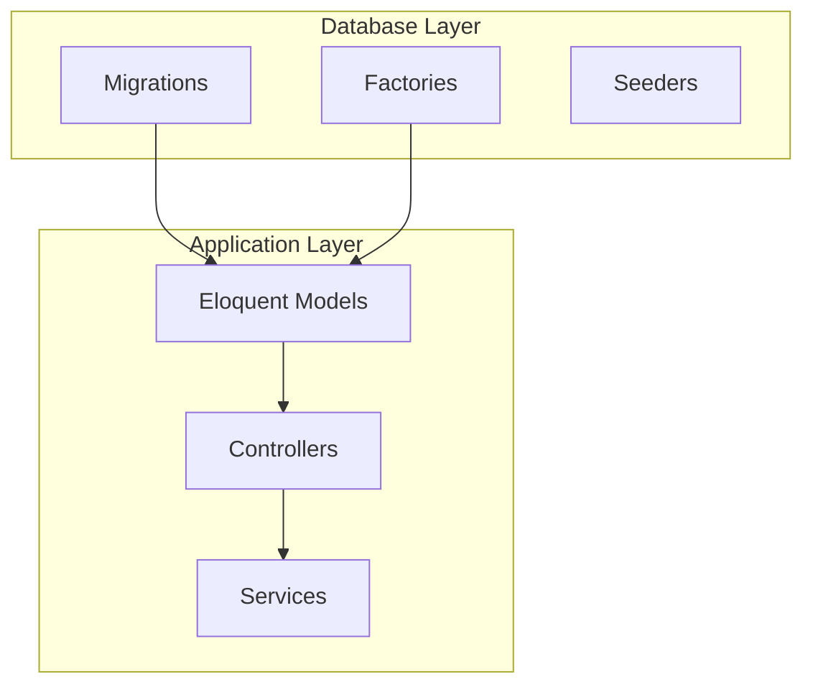

**Section sources**
- [create_users_table.php](file://database/migrations/0001_01_01_000000_create_users_table.php)
- [Siswa.php](file://app/Models/Siswa.php)

## Core Components
This section outlines the principal entities and their roles in the academic record system.

- School (sekolah): Central institution entity with metadata and operational settings.
- Academic Year/Term (tahun_pelajaran, semester): Defines the temporal scope of learning and reporting.
- Students (siswa): Learner records with demographic and enrollment attributes.
- Classes (kelas): Classroom groupings with grade level and optional homeroom teacher assignment.
- Subjects (mapel): Curriculum subjects linked to classes and students.
- Teachers (ptk): Staff members with roles and access permissions.
- Academic Records: Grades, assessments, attendance, co-curricular grades, and reports.

Key relationships:
- One-to-many: School → Classes, Classes → Students, Classes → Subjects, Subjects → Students, School → Academic Terms.
- Many-to-many: Classes ↔ Subjects via mapel_kelas, Students ↔ Subjects via mapel_siswa, Students ↔ Classes via siswa_kelas.
- Optional inheritance pattern: Users migrated to PTK for staff roles, preserving referential continuity.

**Section sources**
- [create_sekolah_table.php](file://database/migrations/2026_06_01_010808_create_sekolah_table.php)
- [create_tahun_pelajaran_table.php](file://database/migrations/2026_06_01_010807_create_tahun_pelajaran_table.php)
- [create_semester_table.php](file://database/migrations/2026_06_01_010808_create_semester_table.php)
- [create_siswa_table.php](file://database/migrations/2026_06_01_010808_create_siswa_table.php)
- [create_kelas_table.php](file://database/migrations/2026_06_01_010809_create_kelas_table.php)
- [create_mapel_table.php](file://database/migrations/2026_06_01_010808_create_mapel_table.php)
- [create_kelas_wali_table.php](file://database/migrations/2026_06_01_010816_create_kelas_wali_table.php)
- [create_mapel_kelas_table.php](file://database/migrations/2026_06_01_010816_create_mapel_kelas_table.php)
- [create_mapel_siswa_table.php](file://database/migrations/2026_06_01_010816_create_mapel_siswa_table.php)
- [create_siswa_kelas_table.php](file://database/migrations/2026_06_01_010816_create_siswa_kelas_table.php)
- [create_ptk_table.php](file://database/migrations/2026_06_04_120000_create_ptk_table_and_migrate_from_users.php)

## Architecture Overview
The database architecture centers around institutional hierarchy and academic progression. Schools define terms and house classes. Classes connect to subjects and students, while academic records track performance across assessments and evaluations.

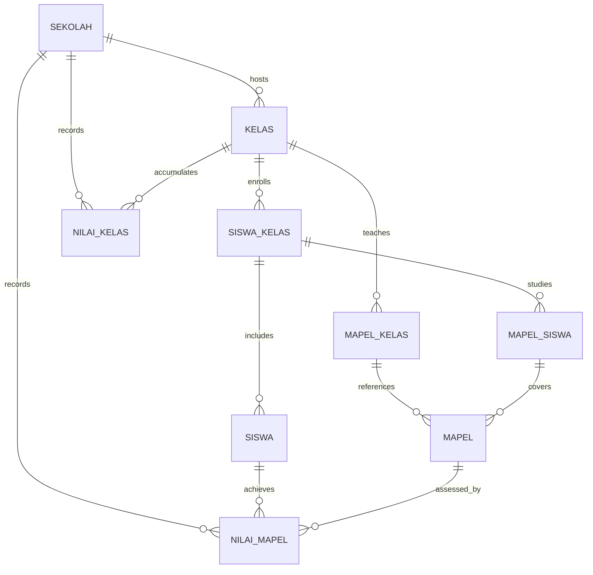

**Diagram sources**
- [create_sekolah_table.php](file://database/migrations/2026_06_01_010808_create_sekolah_table.php)
- [create_kelas_table.php](file://database/migrations/2026_06_01_010809_create_kelas_table.php)
- [create_siswa_table.php](file://database/migrations/2026_06_01_010808_create_siswa_table.php)
- [create_mapel_table.php](file://database/migrations/2026_06_01_010808_create_mapel_table.php)
- [create_kelas_wali_table.php](file://database/migrations/2026_06_01_010816_create_kelas_wali_table.php)
- [create_mapel_kelas_table.php](file://database/migrations/2026_06_01_010816_create_mapel_kelas_table.php)
- [create_mapel_siswa_table.php](file://database/migrations/2026_06_01_010816_create_mapel_siswa_table.php)
- [create_siswa_kelas_table.php](file://database/migrations/2026_06_01_010816_create_siswa_kelas_table.php)
- [create_nilai_mapel_table.php](file://database/migrations/2026_06_01_010817_create_nilai_mapel_table.php)
- [create_nilai_kelas_table.php](file://database/migrations/2026_06_01_010818_create_nilai_kelas_table.php)

## Detailed Component Analysis

### School (sekolah)
- Purpose: Institution-level metadata, settings, and operational identifiers.
- Key attributes: Unique identifiers for internal and external systems (dapodik), location coordinates, favicon, report format preferences.
- Constraints: Unique constraints on external identifiers; nullable fields for optional identifiers; spatial/geographic fields for mapping.

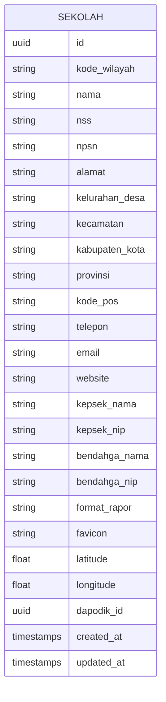

**Diagram sources**
- [create_sekolah_table.php](file://database/migrations/2026_06_01_010808_create_sekolah_table.php)
- [add_dapodik_id_to_sekolah_table.php](file://database/migrations/2026_06_02_080000_add_dapodik_id_to_sekolah_table.php)
- [add_favicon_to_sekolah_table.php](file://database/migrations/2026_06_03_044817_add_favicon_to_sekolah_table.php)
- [add_gps_fields_to_sekolah_table.php](file://database/migrations/2026_06_10_090001_add_gps_fields_to_sekolah_table.php)
- [add_format_rapor_to_sekolah_table.php](file://database/migrations/2026_06_13_150000_add_format_rapor_to_sekolah_table.php)

**Section sources**
- [create_sekolah_table.php](file://database/migrations/2026_06_01_010808_create_sekolah_table.php)
- [add_dapodik_id_to_sekolah_table.php](file://database/migrations/2026_06_02_080000_add_dapodik_id_to_sekolah_table.php)
- [add_favicon_to_sekolah_table.php](file://database/migrations/2026_06_03_044817_add_favicon_to_sekolah_table.php)
- [add_gps_fields_to_sekolah_table.php](file://database/migrations/2026_06_10_090001_add_gps_fields_to_sekolah_table.php)
- [add_format_rapor_to_sekolah_table.php](file://database/migrations/2026_06_13_150000_add_format_rapor_to_sekolah_table.php)

### Academic Year and Term (tahun_pelajaran, semester)
- Purpose: Define the academic calendar and term boundaries for assessments and reports.
- Relationships: Terms belong to academic years; multiple terms per year; used to scope student/class/subject enrollments and grading periods.

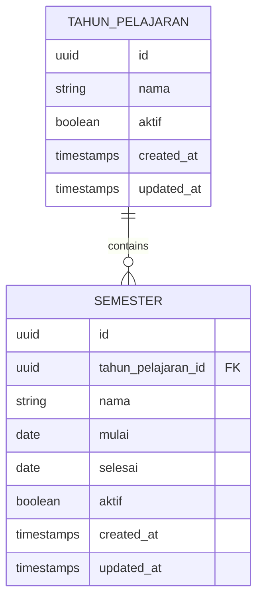

**Diagram sources**
- [create_tahun_pelajaran_table.php](file://database/migrations/2026_06_01_010807_create_tahun_pelajaran_table.php)
- [create_semester_table.php](file://database/migrations/2026_06_01_010808_create_semester_table.php)

**Section sources**
- [create_tahun_pelajaran_table.php](file://database/migrations/2026_06_01_010807_create_tahun_pelajaran_table.php)
- [create_semester_table.php](file://database/migrations/2026_06_01_010808_create_semester_table.php)

### Students (siswa)
- Purpose: Store learner identities, demographics, family contacts, and enrollment history.
- Key attributes: Personal data, family relationship references, gender, religion, and optional Dapodik linkage.
- Constraints: Unique constraints on external identifiers; foreign keys to reference tables for standardized attributes.

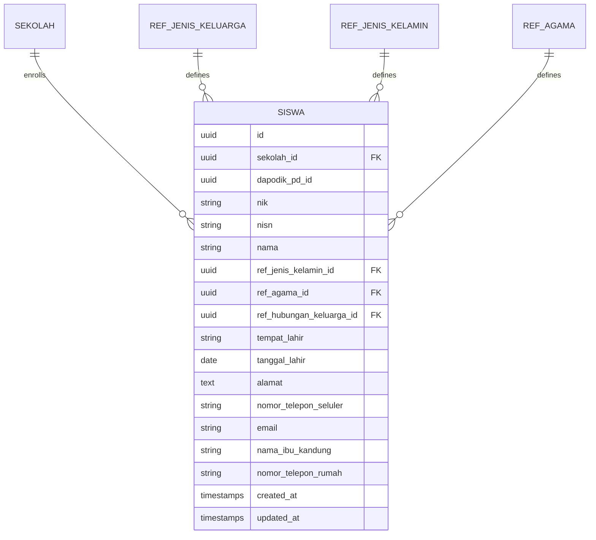

**Diagram sources**
- [create_siswa_table.php](file://database/migrations/2026_06_01_010808_create_siswa_table.php)
- [add_dapodik_id_to_siswa_table.php](file://database/migrations/2026_06_02_050000_add_dapodik_id_to_siswa_table.php)

**Section sources**
- [create_siswa_table.php](file://database/migrations/2026_06_01_010808_create_siswa_table.php)
- [add_dapodik_id_to_siswa_table.php](file://database/migrations/2026_06_02_050000_add_dapodik_id_to_siswa_table.php)

### Classes (kelas)
- Purpose: Classroom groupings by grade level and optional homeroom teacher assignment.
- Relationships: Linked to school, optional head teacher (wali), and subject offerings.

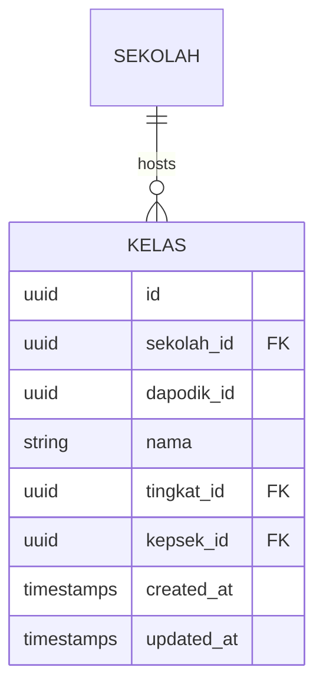

**Diagram sources**
- [create_kelas_table.php](file://database/migrations/2026_06_01_010809_create_kelas_table.php)
- [add_dapodik_id_to_kelas_table.php](file://database/migrations/2026_06_02_080001_add_dapodik_id_to_kelas_table.php)

**Section sources**
- [create_kelas_table.php](file://database/migrations/2026_06_01_010809_create_kelas_table.php)
- [add_dapodik_id_to_kelas_table.php](file://database/migrations/2026_06_02_080001_add_dapodik_id_to_kelas_table.php)

### Subjects (mapel)
- Purpose: Curriculum subjects with optional ordering and Dapodik linkage.
- Relationships: Offered in classes and studied by students; ordered within curriculum.

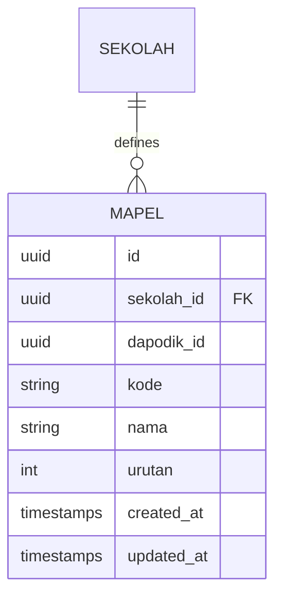

**Diagram sources**
- [create_mapel_table.php](file://database/migrations/2026_06_01_010808_create_mapel_table.php)
- [add_dapodik_id_to_mapel_table.php](file://database/migrations/2026_06_02_080002_add_dapodik_id_to_mapel_table.php)
- [add_urutan_to_mapel_table.php](file://database/migrations/2026_06_03_044817_add_urutan_to_mapel_table.php)

**Section sources**
- [create_mapel_table.php](file://database/migrations/2026_06_01_010808_create_mapel_table.php)
- [add_dapodik_id_to_mapel_table.php](file://database/migrations/2026_06_02_080002_add_dapodik_id_to_mapel_table.php)
- [add_urutan_to_mapel_table.php](file://database/migrations/2026_06_03_044817_add_urutan_to_mapel_table.php)

### Subject-Class Link (mapel_kelas)
- Purpose: Associates subjects with classes and optionally links to a teacher.
- Notes: User ID made nullable to decouple teacher assignments from user accounts.

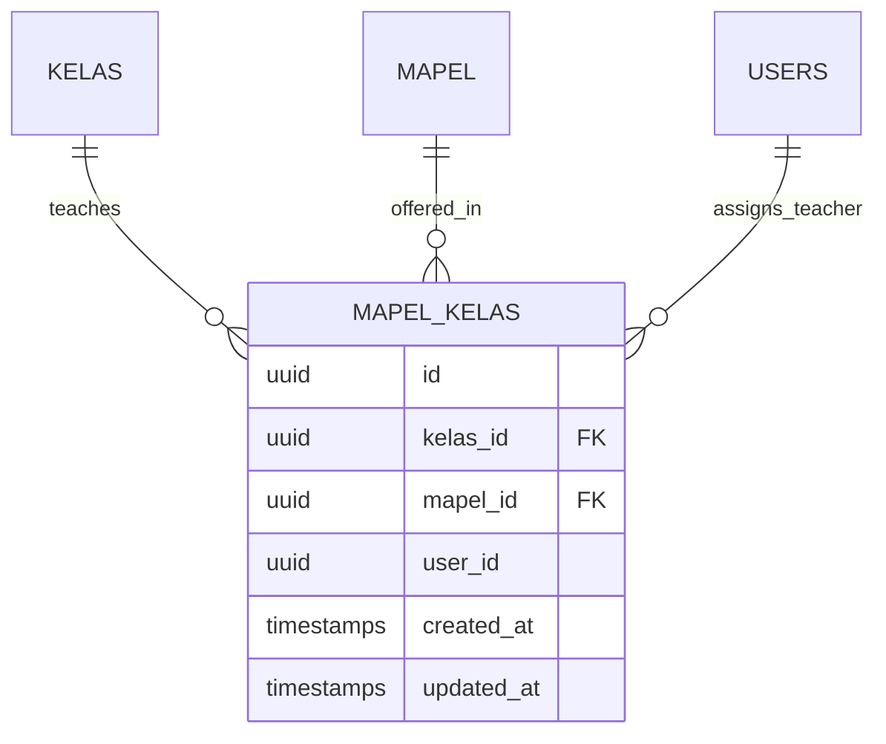

**Diagram sources**
- [create_mapel_kelas_table.php](file://database/migrations/2026_06_01_010816_create_mapel_kelas_table.php)
- [make_user_id_nullable_in_mapel_kelas_table.php](file://database/migrations/2026_06_02_090000_make_user_id_nullable_in_mapel_kelas_table.php)

**Section sources**
- [create_mapel_kelas_table.php](file://database/migrations/2026_06_01_010816_create_mapel_kelas_table.php)
- [make_user_id_nullable_in_mapel_kelas_table.php](file://database/migrations/2026_06_02_090000_make_user_id_nullable_in_mapel_kelas_table.php)

### Subject-Student Link (mapel_siswa)
- Purpose: Tracks which students study which subjects.

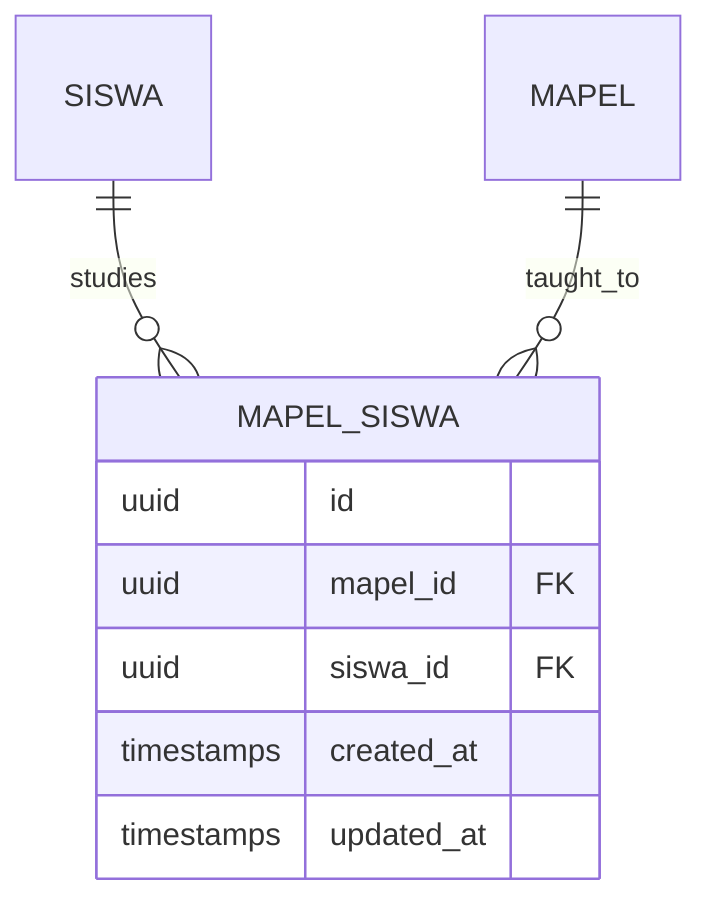

**Diagram sources**
- [create_mapel_siswa_table.php](file://database/migrations/2026_06_01_010816_create_mapel_siswa_table.php)

**Section sources**
- [create_mapel_siswa_table.php](file://database/migrations/2026_06_01_010816_create_mapel_siswa_table.php)

### Student-Class Link (siswa_kelas)
- Purpose: Enrollments linking students to classes during specific terms.

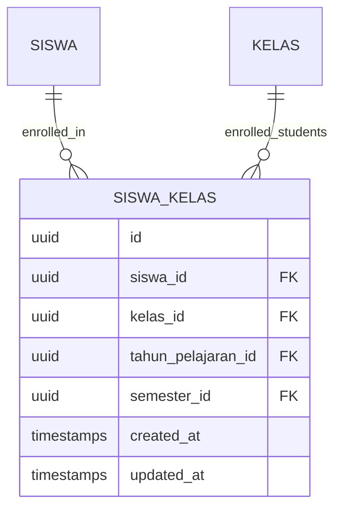

**Diagram sources**
- [create_siswa_kelas_table.php](file://database/migrations/2026_06_01_010816_create_siswa_kelas_table.php)

**Section sources**
- [create_siswa_kelas_table.php](file://database/migrations/2026_06_01_010816_create_siswa_kelas_table.php)

### Teachers (ptk)
- Purpose: Staff identity and role management, migrated from users.
- Relationships: Can be linked to classes as homeroom teachers and to subjects as instructors.

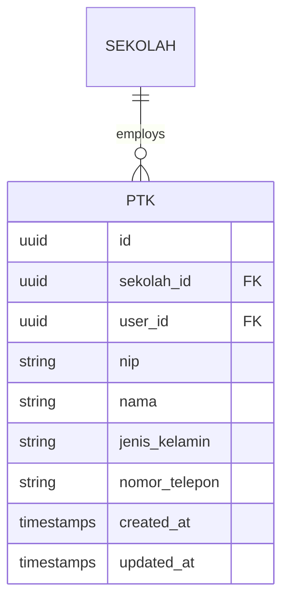

**Diagram sources**
- [create_ptk_table.php](file://database/migrations/2026_06_04_120000_create_ptk_table_and_migrate_from_users.php)

**Section sources**
- [create_ptk_table.php](file://database/migrations/2026_06_04_120000_create_ptk_table_and_migrate_from_users.php)

### Academic Records: Grades and Assessments
- Purpose: Capture student performance across subjects and classes, including formative, mid-term, and summative assessments, plus co-curricular grades.

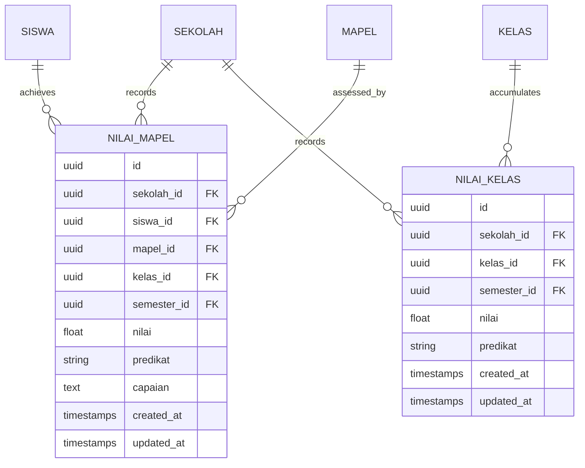

**Diagram sources**
- [create_nilai_mapel_table.php](file://database/migrations/2026_06_01_010817_create_nilai_mapel_table.php)
- [create_nilai_kelas_table.php](file://database/migrations/2026_06_01_010818_create_nilai_kelas_table.php)

**Section sources**
- [create_nilai_mapel_table.php](file://database/migrations/2026_06_01_010817_create_nilai_mapel_table.php)
- [create_nilai_kelas_table.php](file://database/migrations/2026_06_01_010818_create_nilai_kelas_table.php)

### Attendance and Presence (presensi, presensi_guru_tu)
- Purpose: Track student and staff attendance.

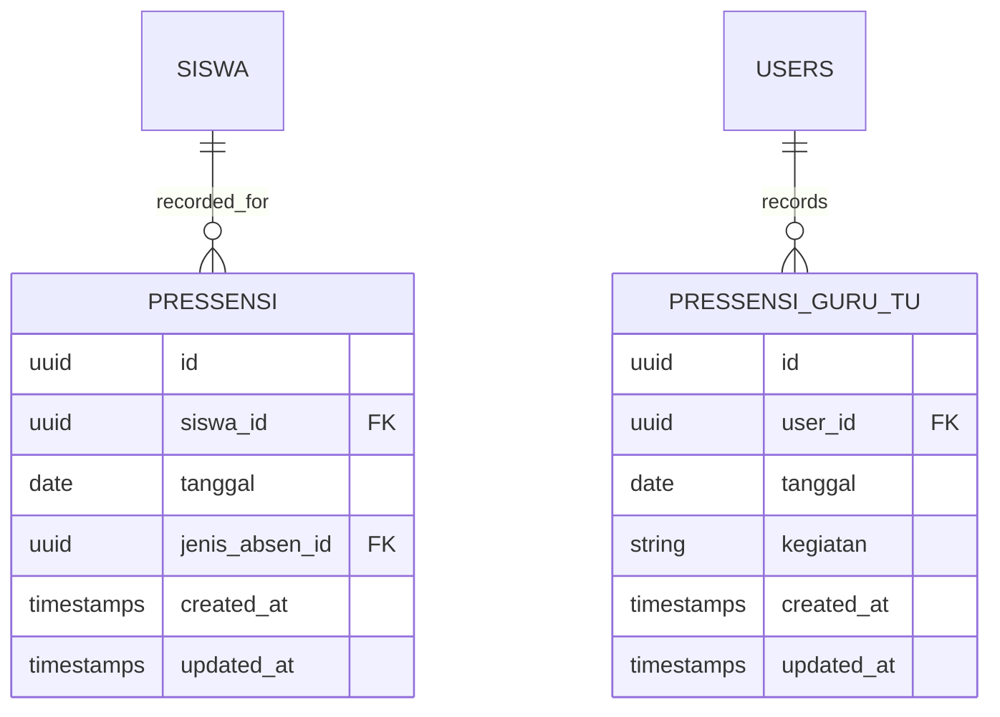

**Diagram sources**
- [create_presensi_table.php](file://database/migrations/2026_06_01_010820_create_presensi_table.php)
- [create_presensi_guru_tu_table.php](file://database/migrations/2026_06_10_090002_create_presensi_guru_tu_table.php)

**Section sources**
- [create_presensi_table.php](file://database/migrations/2026_06_01_010820_create_presensi_table.php)
- [create_presensi_guru_tu_table.php](file://database/migrations/2026_06_10_090002_create_presensi_guru_tu_table.php)

### Co-Curricular Grades (nilai_kokurikuler)
- Purpose: Record co-curricular activities and achievements.

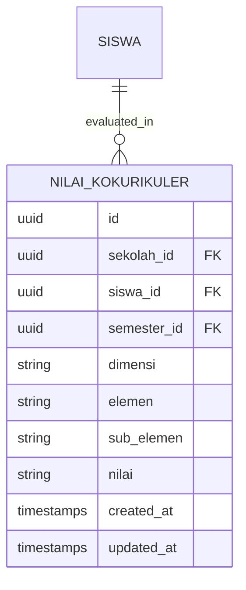

**Diagram sources**
- [create_nilai_kokurikuler_table.php](file://database/migrations/2026_06_01_010819_create_nilai_kokurikuler_table.php)

**Section sources**
- [create_nilai_kokurikuler_table.php](file://database/migrations/2026_06_01_010819_create_nilai_kokurikuler_table.php)

### Additional Entities and Cross-Entity Links
- Homeroom Teacher Assignment: kelas_wali links teachers to classes.
- Dapodik Sync Logs: Track synchronization status and batch metadata.

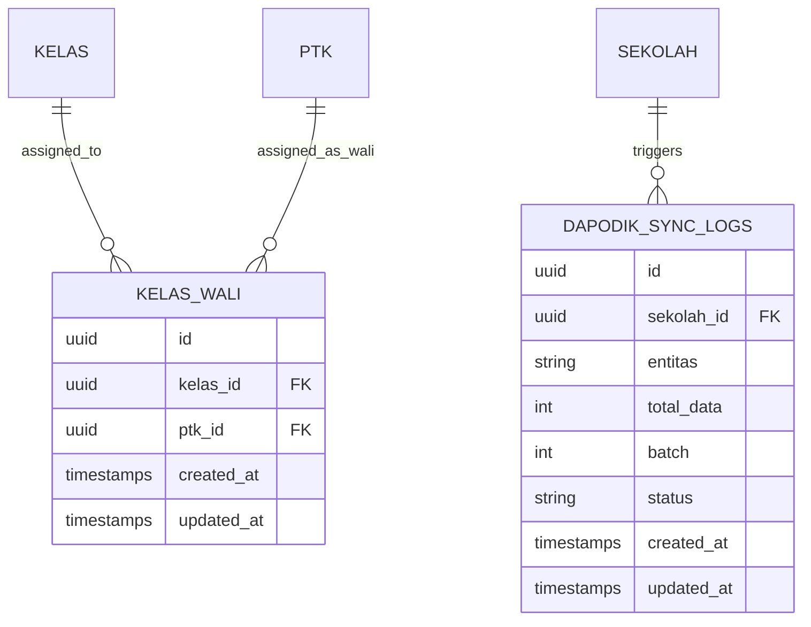

**Diagram sources**
- [create_kelas_wali_table.php](file://database/migrations/2026_06_01_010816_create_kelas_wali_table.php)
- [create_dapodik_sync_logs_table.php](file://database/migrations/2026_06_02_040000_create_dapodik_sync_logs_table.php)
- [add_batch_fields_to_dapodik_sync_logs_table.php](file://database/migrations/2026_06_04_040000_add_batch_fields_to_dapodik_sync_logs_table.php)

**Section sources**
- [create_kelas_wali_table.php](file://database/migrations/2026_06_01_010816_create_kelas_wali_table.php)
- [create_dapodik_sync_logs_table.php](file://database/migrations/2026_06_02_040000_create_dapodik_sync_logs_table.php)
- [add_batch_fields_to_dapodik_sync_logs_table.php](file://database/migrations/2026_06_04_040000_add_batch_fields_to_dapodik_sync_logs_table.php)

## Dependency Analysis
This section maps dependencies among core entities and highlights referential integrity enforced by foreign keys.

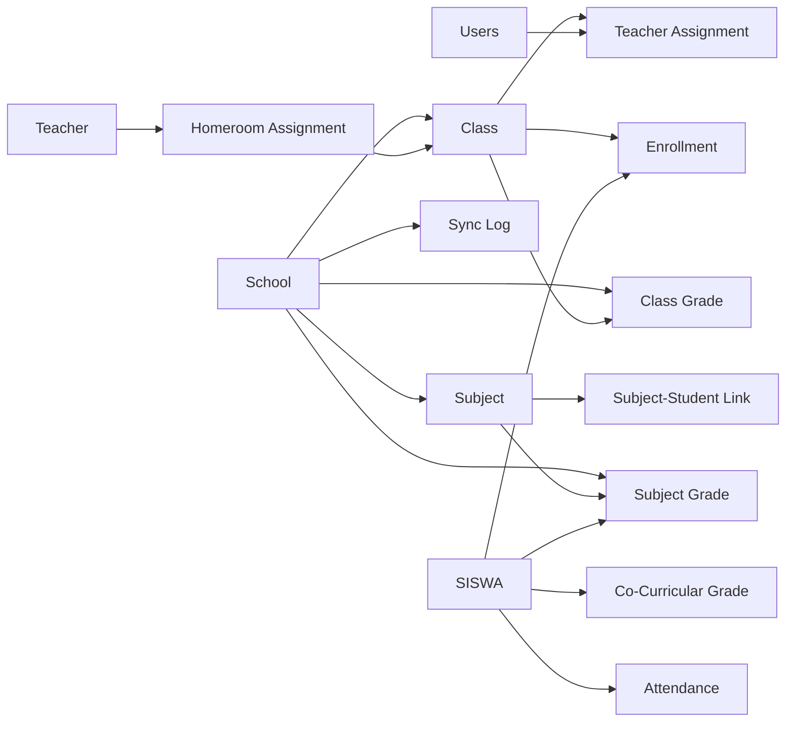

**Diagram sources**
- [create_sekolah_table.php](file://database/migrations/2026_06_01_010808_create_sekolah_table.php)
- [create_kelas_table.php](file://database/migrations/2026_06_01_010809_create_kelas_table.php)
- [create_mapel_table.php](file://database/migrations/2026_06_01_010808_create_mapel_table.php)
- [create_mapel_kelas_table.php](file://database/migrations/2026_06_01_010816_create_mapel_kelas_table.php)
- [create_mapel_siswa_table.php](file://database/migrations/2026_06_01_010816_create_mapel_siswa_table.php)
- [create_siswa_kelas_table.php](file://database/migrations/2026_06_01_010816_create_siswa_kelas_table.php)
- [create_nilai_mapel_table.php](file://database/migrations/2026_06_01_010817_create_nilai_mapel_table.php)
- [create_nilai_kelas_table.php](file://database/migrations/2026_06_01_010818_create_nilai_kelas_table.php)
- [create_kelas_wali_table.php](file://database/migrations/2026_06_01_010816_create_kelas_wali_table.php)
- [create_dapodik_sync_logs_table.php](file://database/migrations/2026_06_02_040000_create_dapodik_sync_logs_table.php)

**Section sources**
- [create_sekolah_table.php](file://database/migrations/2026_06_01_010808_create_sekolah_table.php)
- [create_kelas_table.php](file://database/migrations/2026_06_01_010809_create_kelas_table.php)
- [create_mapel_table.php](file://database/migrations/2026_06_01_010808_create_mapel_table.php)
- [create_mapel_kelas_table.php](file://database/migrations/2026_06_01_010816_create_mapel_kelas_table.php)
- [create_mapel_siswa_table.php](file://database/migrations/2026_06_01_010816_create_mapel_siswa_table.php)
- [create_siswa_kelas_table.php](file://database/migrations/2026_06_01_010816_create_siswa_kelas_table.php)
- [create_nilai_mapel_table.php](file://database/migrations/2026_06_01_010817_create_nilai_mapel_table.php)
- [create_nilai_kelas_table.php](file://database/migrations/2026_06_01_010818_create_nilai_kelas_table.php)
- [create_kelas_wali_table.php](file://database/migrations/2026_06_01_010816_create_kelas_wali_table.php)
- [create_dapodik_sync_logs_table.php](file://database/migrations/2026_06_02_040000_create_dapodik_sync_logs_table.php)

## Performance Considerations
- Indexing strategy:
  - Add indexes on frequently filtered/sorted columns: siswa.nisn, siswa.nama, kelas.nama, mapel.kode, mapel.nama, nilai_mapel.semester_id, nilai_kelas.semester_id.
  - Composite indexes for join-heavy queries: (kelas_id, semester_id), (mapel_id, siswa_id), (tahun_pelajaran_id, semester_id).
- Partitioning:
  - Consider partitioning large tables (nilai_mapel, nilai_kelas) by semester or academic year to improve query performance and simplify archiving.
- Caching:
  - Cache school settings, class lists, and subject offerings to reduce repeated reads.
- Denormalization:
  - Maintain aggregated class averages (nilai_kelas) to avoid expensive joins during report generation.
- Query patterns:
  - Prefer eager loading of related models (with includes) to prevent N+1 queries in report generation and class management screens.
- Batch operations:
  - Use batch inserts/updates for syncing and importing data (e.g., Dapodik) to minimize transaction overhead.

[No sources needed since this section provides general guidance]

## Troubleshooting Guide
- Referential integrity violations:
  - Ensure foreign keys are present and consistent; verify that enrollments (siswa_kelas) align with active academic terms and classes.
- Duplicate enrollments:
  - Prevent duplicate entries in siswa_kelas by enforcing uniqueness on (siswa_id, kelas_id, tahun_pelajaran_id, semester_id).
- Attendance anomalies:
  - Validate presence of jenis_absen records and ensure dates fall within active semesters.
- Sync failures:
  - Review dapodik_sync_logs for failed batches and re-run with corrected parameters.
- Token and notification issues:
  - Confirm FCM tokens exist for users requiring push notifications.

**Section sources**
- [create_siswa_kelas_table.php](file://database/migrations/2026_06_01_010816_create_siswa_kelas_table.php)
- [create_presensi_table.php](file://database/migrations/2026_06_01_010820_create_presensi_table.php)
- [create_dapodik_sync_logs_table.php](file://database/migrations/2026_06_02_040000_create_dapodik_sync_logs_table.php)
- [add_fcm_token_to_users_table.php](file://database/migrations/2026_06_10_000001_add_fcm_token_to_users_table.php)

## Conclusion
RaporKM’s database model establishes a robust foundation for managing academic records across schools. The schema emphasizes clear relationships among school, class, subject, and student entities, supported by dedicated assessment and attendance tables. By applying indexing, partitioning, caching, and batch processing strategies, the system can maintain performance at scale. Adhering to referential integrity and validation rules ensures data quality and reliability.

[No sources needed since this section summarizes without analyzing specific files]

## Appendices

### Migration Overview
- Initial setup: Users, cache, jobs, personal access tokens, PWA tokens, remember tokens.
- Reference data: Agama, Hubungan Keluarga, Jenis Kelamin, Bulan, Hari, Jabatan, Jenis Keluar, Kepegawaian, Pendidikan, Tugas Tambahan, Jenis Absen, Kurikulum, Tingkat, Kompetensi Keahlian, Dimensi Kokurikuler, Organisasi, Eskul, Deskrpsi Rapor, Deskrpsi Kokurikuler, Tujuan Pembelajaran, Proyek Tema, Elemen, Sub Elemen.
- Core entities: Sekolah, Tahun Pelajaran, Semester, Siswa, Kelas, Mapel, Kelas Wali, Mapel Kelas, Mapel Siswa, Siswa Kelas.
- Academic records: Nilai Mapel, Nilai Kelas, Nilai Formatif, Nilai Sumatif (AS, PH, TS), Lager Nilai Mapel/Mid, Nilai Mata Pelajaran, Nilai Kokurikuler, Nilai Prakerin, Nilai Asesmen Subelemen, Nilai Proyek.
- Operational: Presensi, Presensi Guru TU, Catatan Wali, Laporan WA, Pengingat, Settings, Surat Masuk, Lulusan, Mutasi Masuk/Keluar, Guru Menu Akses, Push Subscriptions.
- Dapodik sync: Logs, batch fields, external IDs for Sekolah, Kelas, Mapel, Mapel Kelas.

**Section sources**
- [create_users_table.php](file://database/migrations/0001_01_01_000000_create_users_table.php)
- [create_dapodik_sync_logs_table.php](file://database/migrations/2026_06_02_040000_create_dapodik_sync_logs_table.php)
- [add_batch_fields_to_dapodik_sync_logs_table.php](file://database/migrations/2026_06_04_040000_add_batch_fields_to_dapodik_sync_logs_table.php)
- [add_dapodik_id_to_sekolah_table.php](file://database/migrations/2026_06_02_080000_add_dapodik_id_to_sekolah_table.php)
- [add_dapodik_id_to_kelas_table.php](file://database/migrations/2026_06_02_080001_add_dapodik_id_to_kelas_table.php)
- [add_dapodik_id_to_mapel_table.php](file://database/migrations/2026_06_02_080002_add_dapodik_id_to_mapel_table.php)
- [add_dapodik_id_to_mapel_kelas_table.php](file://database/migrations/2026_06_02_080003_add_dapodik_id_to_mapel_kelas_table.php)
- [make_user_id_nullable_in_mapel_kelas_table.php](file://database/migrations/2026_06_02_090000_make_user_id_nullable_in_mapel_kelas_table.php)
- [add_urutan_to_mapel_table.php](file://database/migrations/2026_03_044817_add_urutan_to_mapel_table.php)
- [add_favicon_to_sekolah_table.php](file://database/migrations/2026_06_03_044817_add_favicon_to_sekolah_table.php)
- [add_fcm_token_to_users_table.php](file://database/migrations/2026_06_10_000001_add_fcm_token_to_users_table.php)
- [add_gps_fields_to_sekolah_table.php](file://database/migrations/2026_06_10_090001_add_gps_fields_to_sekolah_table.php)
- [create_presensi_guru_tu_table.php](file://database/migrations/2026_06_10_090002_create_presensi_guru_tu_table.php)
- [add_format_rapor_to_sekolah_table.php](file://database/migrations/2026_06_13_150000_add_format_rapor_to_sekolah_table.php)

### Factory Implementations for Testing
Factories enable rapid generation of realistic test data for models across the schema.

- SiswaFactory: Generates student records with relationships to school and reference entities.
- KelasFactory: Creates class records linked to school and optional head teacher.
- MapelFactory: Produces subject records with optional ordering and external IDs.
- NilaiMapelFactory: Creates subject-grade records scoped to school, class, student, and term.
- NilaiKelasFactory: Generates class-grade records aligned to term and class.

These factories streamline unit and feature testing for academic workflows.

**Section sources**
- [SiswaFactory.php](file://database/factories/SiswaFactory.php)
- [KelasFactory.php](file://database/factories/KelasFactory.php)
- [MapelFactory.php](file://database/factories/MapelFactory.php)
- [NilaiMapelFactory.php](file://database/factories/NilaiMapelFactory.php)
- [NilaiKelasFactory.php](file://database/factories/NilaiKelasFactory.php)

### Eloquent Model Relationships
Eloquent models encapsulate business logic and relationships. Representative examples:

- Siswa model: belongsTo school; belongsToMany kelas via siswa_kelas; belongsToMany mapel via mapel_siswa; hasMany nilaiMapel; hasMany presensi; hasMany nilaiKokurikuler.
- Kelas model: belongsTo school; belongsToMany siswa via siswa_kelas; belongsToMany mapel via mapel_kelas; hasMany nilaiKelas; hasOne kelasWali; hasMany siswaKelas.
- Mapel model: belongsToMany kelas via mapel_kelas; belongsToMany siswa via mapel_siswa; hasMany nilaiMapel.
- Ptk model: belongsTo sekolah; hasMany kelasWali; belongsToMany kelas via kelas_wali.

These relationships reflect the entity-relationship model and guide efficient querying.

**Section sources**
- [Siswa.php](file://app/Models/Siswa.php)
- [Kelas.php](file://app/Models/Kelas.php)
- [Mapel.php](file://app/Models/Mapel.php)
- [Ptk.php](file://app/Models/Ptk.php)

### Data Access Patterns and Query Optimization
- Use eager loading to fetch related models in single queries.
- Apply scopes for common filters (active term, current academic year).
- Paginate large result sets for reports and class lists.
- Cache frequently accessed reference data and school settings.

[No sources needed since this section provides general guidance]

### Data Lifecycle Management
- Archive old academic records by semester/year to keep active datasets lean.
- Implement retention policies for logs and temporary data.
- Regularly prune expired tokens and unused caches.

[No sources needed since this section provides general guidance]

### Backup Strategies
- Automated daily logical backups with point-in-time recovery.
- Offsite storage for disaster recovery.
- Test restore procedures periodically.

**Section sources**
- [backup-db.sh](file://scripts/backup-db.sh)

### Data Migration Procedures
- Plan migrations around academic cycles to minimize downtime.
- Use transactions for multi-table updates; validate referential integrity after each migration.
- Back up before running production migrations; monitor sync logs for errors.

[No sources needed since this section provides general guidance]