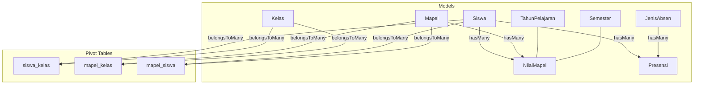
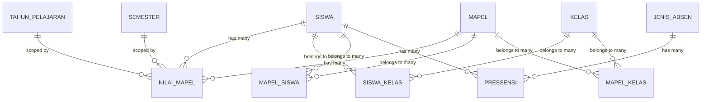
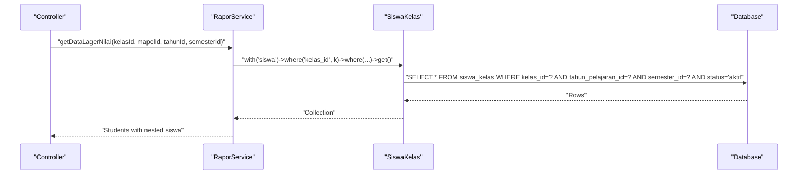
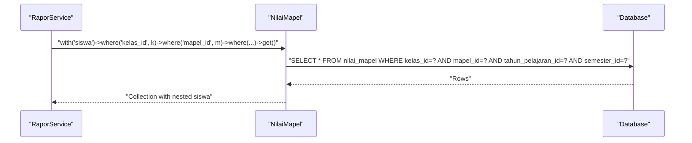
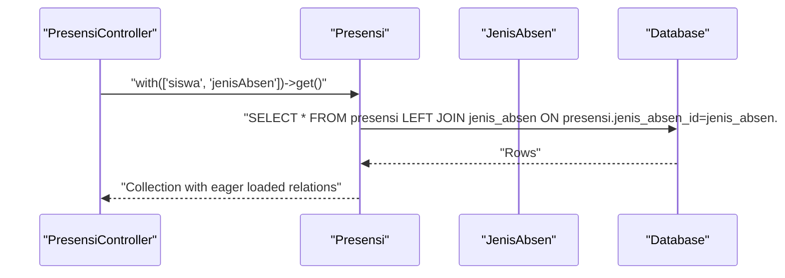
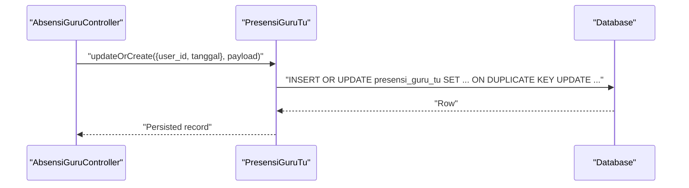
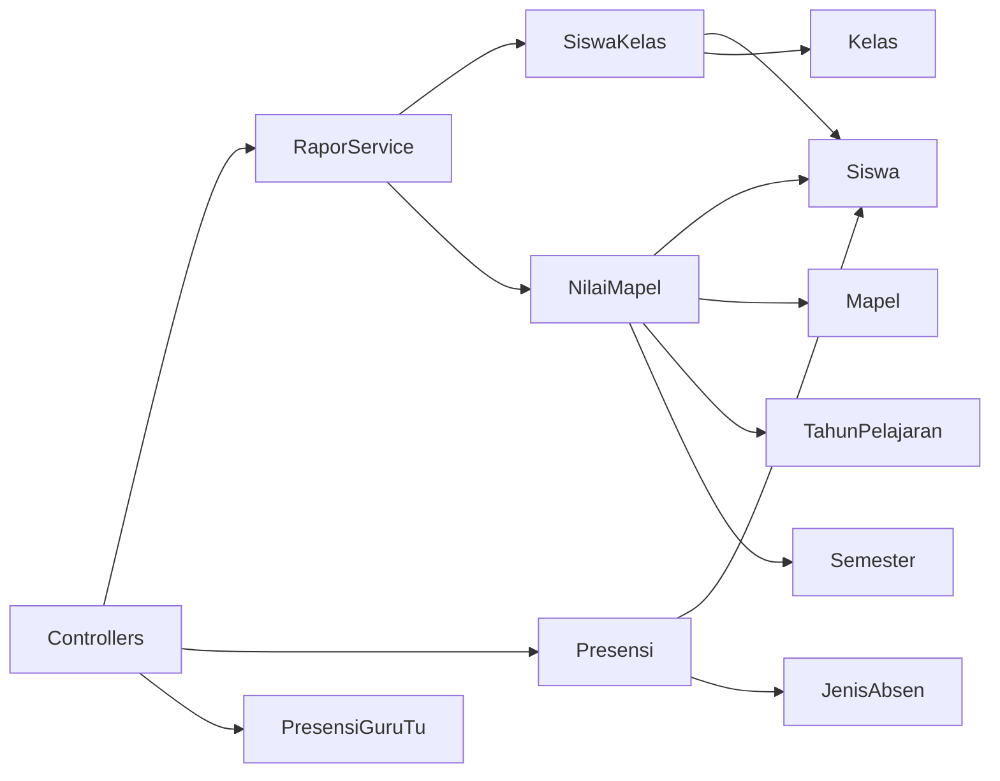

# Database Relationships & Constraints

<cite>
**Referenced Files in This Document**
- [RaporService.php](file://app/Services/RaporService.php)
- [PresensiController.php](file://app/Http/Controllers/Api/V1/Guru/PresensiController.php)
- [AbsensiGuruController.php](file://app/Http/Controllers/Api/V1/Guru/AbsensiGuruController.php)
- [NilaiMapel.php](file://app/Models/NilaiMapel.php)
- [SiswaKelas.php](file://app/Models/SiswaKelas.php)
- [Presensi.php](file://app/Models/Presensi.php)
- [PresensiGuruTu.php](file://app/Models/PresensiGuruTu.php)
- [Kelas.php](file://app/Models/Kelas.php)
- [Mapel.php](file://app/Models/Mapel.php)
- [Siswa.php](file://app/Models/Siswa.php)
- [TahunPelajaran.php](file://app/Models/TahunPelajaran.php)
- [Semester.php](file://app/Models/Semester.php)
- [JenisAbsen.php](file://app/Models/JenisAbsen.php)
- [mapel_kelas_table.php](file://database/migrations/2026_06_01_010816_create_mapel_kelas_table.php)
- [siswa_kelas_table.php](file://database/migrations/2026_06_01_010816_create_siswa_kelas_table.php)
- [mapel_siswa_table.php](file://database/migrations/2026_06_01_010816_create_mapel_siswa_table.php)
- [nilai_mapel_table.php](file://database/migrations/2026_06_01_010817_create_nilai_mapel_table.php)
- [presensi_table.php](file://database/migrations/2026_06_01_010820_create_presensi_table.php)
- [migrations.md](file://.agents/skills/laravel-best-practices/rules/migrations.md)
</cite>

## Table of Contents
1. [Introduction](#introduction)
2. [Project Structure](#project-structure)
3. [Core Components](#core-components)
4. [Architecture Overview](#architecture-overview)
5. [Detailed Component Analysis](#detailed-component-analysis)
6. [Dependency Analysis](#dependency-analysis)
7. [Performance Considerations](#performance-considerations)
8. [Troubleshooting Guide](#troubleshooting-guide)
9. [Conclusion](#conclusion)

## Introduction
This document explains the database relationship patterns and referential integrity constraints in RaporKM Laravel, focusing on student-class enrollment (siswa_kelas), subject-class assignments (mapel_kelas), grade records (nilai_mapel), and attendance tracking (presensi). It documents many-to-many relationships via pivot tables, foreign key constraints, cascading actions, and how the application enforces constraints through Eloquent models and migrations. It also covers relationship query patterns, eager loading strategies, transaction management, and error handling for relationship violations.

## Project Structure
The relationships are primarily defined in:
- Eloquent models under app/Models representing entities and their relationships
- Migrations under database/migrations defining tables, foreign keys, and indexes
- Services and controllers orchestrating queries and transactions



**Diagram sources**
- [SiswaKelas.php](file://app/Models/SiswaKelas.php)
- [Kelas.php](file://app/Models/Kelas.php)
- [Mapel.php](file://app/Models/Mapel.php)
- [NilaiMapel.php](file://app/Models/NilaiMapel.php)
- [Presensi.php](file://app/Models/Presensi.php)
- [siswa_kelas_table.php](file://database/migrations/2026_06_01_010816_create_siswa_kelas_table.php)
- [mapel_kelas_table.php](file://database/migrations/2026_06_01_010816_create_mapel_kelas_table.php)
- [mapel_siswa_table.php](file://database/migrations/2026_06_01_010816_create_mapel_siswa_table.php)
- [nilai_mapel_table.php](file://database/migrations/2026_06_01_010817_create_nilai_mapel_table.php)
- [presensi_table.php](file://database/migrations/2026_06_01_010820_create_presensi_table.php)

**Section sources**
- [RaporService.php:124-173](file://app/Services/RaporService.php#L124-L173)
- [PresensiController.php:32-86](file://app/Http/Controllers/Api/V1/Guru/PresensiController.php#L32-L86)
- [AbsensiGuruController.php:66-177](file://app/Http/Controllers/Api/V1/Guru/AbsensiGuruController.php#L66-L177)

## Core Components
- Student-Class Enrollment (siswa_kelas): Many-to-many between Siswa and Kelas, with additional year and semester scoping and status tracking.
- Subject-Class Assignments (mapel_kelas): Many-to-many between Mapel and Kelas, scoped by academic year and semester.
- Subject-Studying (mapel_siswa): Many-to-many between Mapel and Siswa, scoped similarly.
- Grade Records (nilai_mapel): One-to-many from Siswa and Mapel to NilaiMapel, with composite scoping by TahunPelajaran and Semester.
- Attendance Tracking (presensi): One-to-many from Siswa to Presensi, linked to JenisAbsen; includes a related table for teacher/tu attendance.

Key constraints enforced:
- Foreign keys via constrained() in migrations
- Cascading delete policies applied consistently
- Composite scopes on pivot and fact tables to prevent orphaned records

**Section sources**
- [siswa_kelas_table.php](file://database/migrations/2026_06_01_010816_create_siswa_kelas_table.php)
- [mapel_kelas_table.php](file://database/migrations/2026_06_01_010816_create_mapel_kelas_table.php)
- [mapel_siswa_table.php](file://database/migrations/2026_06_01_010816_create_mapel_siswa_table.php)
- [nilai_mapel_table.php](file://database/migrations/2026_06_01_010817_create_nilai_mapel_table.php)
- [presensi_table.php](file://database/migrations/2026_06_01_010820_create_presensi_table.php)
- [migrations.md:18-27](file://.agents/skills/laravel-best-practices/rules/migrations.md#L18-L27)

## Architecture Overview
The system enforces referential integrity at the database level and leverages Eloquent relationships for clean, maintainable queries. Pivot tables encapsulate many-to-many associations with scoping attributes to ensure accurate reporting and avoid cross-year contamination.



**Diagram sources**
- [TahunPelajaran.php](file://app/Models/TahunPelajaran.php)
- [Semester.php](file://app/Models/Semester.php)
- [NilaiMapel.php](file://app/Models/NilaiMapel.php)
- [Siswa.php](file://app/Models/Siswa.php)
- [Mapel.php](file://app/Models/Mapel.php)
- [Kelas.php](file://app/Models/Kelas.php)
- [SiswaKelas.php](file://app/Models/SiswaKelas.php)
- [Presensi.php](file://app/Models/Presensi.php)
- [JenisAbsen.php](file://app/Models/JenisAbsen.php)
- [siswa_kelas_table.php](file://database/migrations/2026_06_01_010816_create_siswa_kelas_table.php)
- [mapel_kelas_table.php](file://database/migrations/2026_06_01_010816_create_mapel_kelas_table.php)
- [mapel_siswa_table.php](file://database/migrations/2026_06_01_010816_create_mapel_siswa_table.php)
- [nilai_mapel_table.php](file://database/migrations/2026_06_01_010817_create_nilai_mapel_table.php)
- [presensi_table.php](file://database/migrations/2026_06_01_010820_create_presensi_table.php)

## Detailed Component Analysis

### Student-Class Enrollment (siswa_kelas)
- Purpose: Tracks which students belong to which classes during specific academic years and semesters.
- Relationship pattern: Many-to-many between Siswa and Kelas via SiswaKelas.
- Scoping: Includes tahun_pelajaran_id, semester_id, and status to ensure accurate reporting and historical separation.
- Query patterns: Filter by class, year, semester, and active status; eager load related student data.



**Diagram sources**
- [RaporService.php:138-144](file://app/Services/RaporService.php#L138-L144)
- [SiswaKelas.php](file://app/Models/SiswaKelas.php)

**Section sources**
- [RaporService.php:138-144](file://app/Services/RaporService.php#L138-L144)
- [SiswaKelas.php](file://app/Models/SiswaKelas.php)

### Subject-Class Assignments (mapel_kelas)
- Purpose: Associates subjects with classes per academic year and semester.
- Relationship pattern: Many-to-many between Mapel and Kelas via MapelKelas.
- Scoping: Tied to TahunPelajaran and Semester to prevent cross-year assignment leakage.

```mermaid
classDiagram
class Mapel {
+hasMany("MapelKelas")
}
class Kelas {
+hasMany("MapelKelas")
}
class MapelKelas {
+int kelas_id
+int mapel_id
+int tahun_pelajaran_id
+int semester_id
+belongsTo("Kelas")
+belongsTo("Mapel")
}
Mapel "1" <---> "n" MapelKelas
Kelas "1" <---> "n" MapelKelas
```

**Diagram sources**
- [Mapel.php](file://app/Models/Mapel.php)
- [Kelas.php](file://app/Models/Kelas.php)
- [mapel_kelas_table.php](file://database/migrations/2026_06_01_010816_create_mapel_kelas_table.php)

**Section sources**
- [mapel_kelas_table.php](file://database/migrations/2026_06_01_010816_create_mapel_kelas_table.php)

### Subject-Studying (mapel_siswa)
- Purpose: Tracks which students study which subjects during specific academic periods.
- Relationship pattern: Many-to-many between Mapel and Siswa via MapelSiswa.
- Scoping: Year and semester included to keep records coherent.

```mermaid
classDiagram
class Mapel {
+hasMany("MapelSiswa")
}
class Siswa {
+hasMany("MapelSiswa")
}
class MapelSiswa {
+int mapel_id
+int siswa_id
+int tahun_pelajaran_id
+int semester_id
+belongsTo("Mapel")
+belongsTo("Siswa")
}
Mapel "1" <---> "n" MapelSiswa
Siswa "1" <---> "n" MapelSiswa
```

**Diagram sources**
- [Mapel.php](file://app/Models/Mapel.php)
- [Siswa.php](file://app/Models/Siswa.php)
- [mapel_siswa_table.php](file://database/migrations/2026_06_01_010816_create_mapel_siswa_table.php)

**Section sources**
- [mapel_siswa_table.php](file://database/migrations/2026_06_01_010816_create_mapel_siswa_table.php)

### Grade Records (nilai_mapel)
- Purpose: Stores individual student grades per subject per term.
- Relationship pattern: One-to-many from Siswa and Mapel to NilaiMapel.
- Scoping: Composite constraints via tahun_pelajaran_id and semester_id ensure term-specific integrity.
- Eager loading: Service fetches related student data to minimize N+1 queries.



**Diagram sources**
- [RaporService.php:126-131](file://app/Services/RaporService.php#L126-L131)
- [NilaiMapel.php](file://app/Models/NilaiMapel.php)

**Section sources**
- [RaporService.php:126-131](file://app/Services/RaporService.php#L126-L131)
- [NilaiMapel.php](file://app/Models/NilaiMapel.php)

### Attendance Tracking (presensi)
- Purpose: Records daily attendance per student categorized by jenis_absen.
- Relationship pattern: One-to-many from Siswa to Presensi; one-to-many from JenisAbsen to Presensi.
- Query patterns: Aggregate counts by jenis_absen_id for summary reports; eager load related data for UI rendering.



**Diagram sources**
- [PresensiController.php:32-42](file://app/Http/Controllers/Api/V1/Guru/PresensiController.php#L32-L42)
- [Presensi.php](file://app/Models/Presensi.php)
- [JenisAbsen.php](file://app/Models/JenisAbsen.php)

**Section sources**
- [PresensiController.php:32-42](file://app/Http/Controllers/Api/V1/Guru/PresensiController.php#L32-L42)
- [Presensi.php](file://app/Models/Presensi.php)
- [JenisAbsen.php](file://app/Models/JenisAbsen.php)

### Teacher/TU Attendance (presensi_guru_tu)
- Purpose: Tracks check-in/check-out for teachers and TU staff.
- Relationship pattern: One-to-one per user per day, with joins to user and academic period tables.
- Transaction management: Uses updateOrCreate to ensure atomic updates.



**Diagram sources**
- [AbsensiGuruController.php:66-177](file://app/Http/Controllers/Api/V1/Guru/AbsensiGuruController.php#L66-L177)
- [PresensiGuruTu.php](file://app/Models/PresensiGuruTu.php)

**Section sources**
- [AbsensiGuruController.php:66-177](file://app/Http/Controllers/Api/V1/Guru/AbsensiGuruController.php#L66-L177)
- [PresensiGuruTu.php](file://app/Models/PresensiGuruTu.php)

## Dependency Analysis
- Cohesion: Each model encapsulates its relationships and constraints, keeping logic localized.
- Coupling: Controllers depend on services for complex queries; services depend on models and shared entities (TahunPelajaran, Semester).
- Integrity: Migrations enforce foreign keys and cascades; Eloquent relationships mirror these constraints.



**Diagram sources**
- [RaporService.php:124-173](file://app/Services/RaporService.php#L124-L173)
- [PresensiController.php:32-86](file://app/Http/Controllers/Api/V1/Guru/PresensiController.php#L32-L86)
- [AbsensiGuruController.php:66-177](file://app/Http/Controllers/Api/V1/Guru/AbsensiGuruController.php#L66-L177)
- [SiswaKelas.php](file://app/Models/SiswaKelas.php)
- [NilaiMapel.php](file://app/Models/NilaiMapel.php)
- [Presensi.php](file://app/Models/Presensi.php)
- [PresensiGuruTu.php](file://app/Models/PresensiGuruTu.php)

**Section sources**
- [RaporService.php:124-173](file://app/Services/RaporService.php#L124-L173)
- [PresensiController.php:32-86](file://app/Http/Controllers/Api/V1/Guru/PresensiController.php#L32-L86)
- [AbsensiGuruController.php:66-177](file://app/Http/Controllers/Api/V1/Guru/AbsensiGuruController.php#L66-L177)

## Performance Considerations
- Eager loading: Use with() to load related data and avoid N+1 queries, especially when iterating lists of students or presences.
- Indexing: Ensure foreign keys and composite scopes (tahun_pelajaran_id, semester_id) are indexed in pivot and fact tables.
- Aggregation: GroupBy and count operations on presensi by jenis_absen_id reduce repeated scans.
- Batch operations: Prefer chunked processing for large datasets in exports or reports.

[No sources needed since this section provides general guidance]

## Troubleshooting Guide
Common issues and resolutions:
- Duplicate enrollment entries: Verify unique constraints on siswa_kelas by (siswa_id, kelas_id, tahun_pelajaran_id, semester_id) and status field.
- Orphaned grade records: Confirm cascade policies on NilaiMapel and ensure deletion sequences remove dependent records first.
- Attendance aggregation errors: Validate that jenis_absen_id exists and that filtering by tahun_pelajaran_id and semester_id is applied consistently.
- Transaction failures: Wrap updates (e.g., updateOrCreate for presensi_guru_tu) in database transactions to ensure atomicity.

Constraint validation tips:
- Use constrained() foreign keys in migrations to enforce referential integrity automatically.
- Apply unique or composite unique constraints on pivots to prevent duplicates.
- Enforce cascading deletes where appropriate to maintain data consistency.

**Section sources**
- [migrations.md:18-27](file://.agents/skills/laravel-best-practices/rules/migrations.md#L18-L27)
- [AbsensiGuruController.php:66-177](file://app/Http/Controllers/Api/V1/Guru/AbsensiGuruController.php#L66-L177)

## Conclusion
RaporKM’s database design centers on robust many-to-many relationships mediated by pivot tables, with strong referential integrity enforced at the database level and mirrored in Eloquent models. Scoping by academic year and semester ensures accurate, time-bound reporting. Controllers and services leverage eager loading and aggregation to optimize performance while maintaining clean separation of concerns. Adhering to migration best practices and transactional updates helps prevent relationship violations and keeps the system reliable.