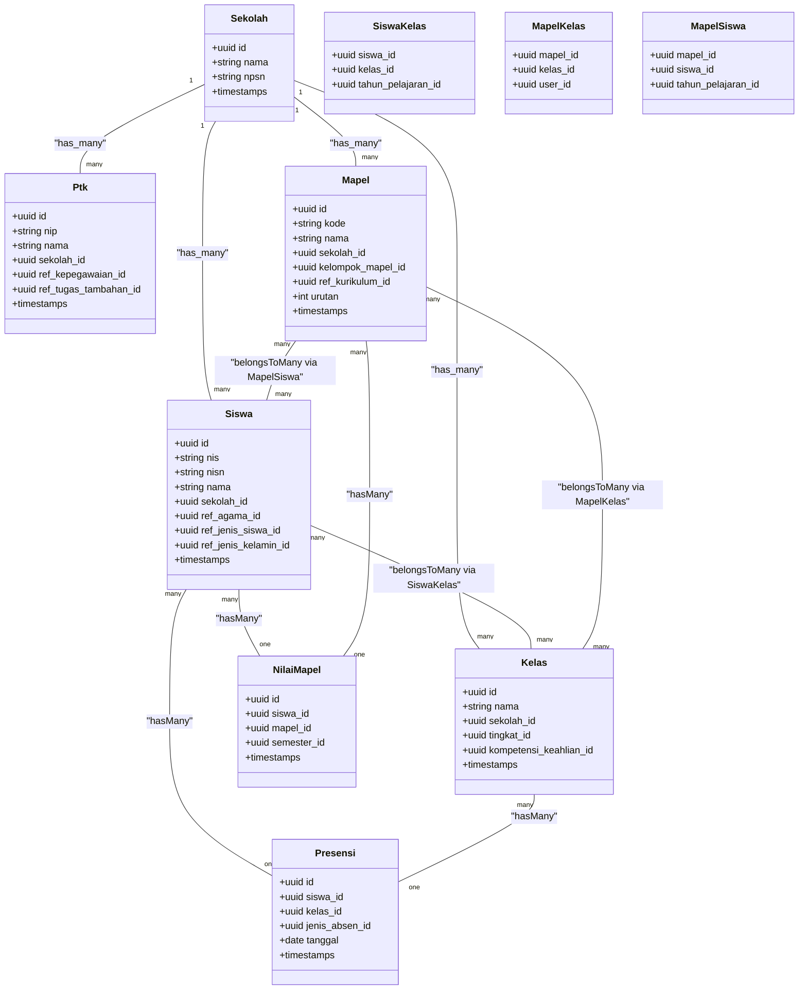
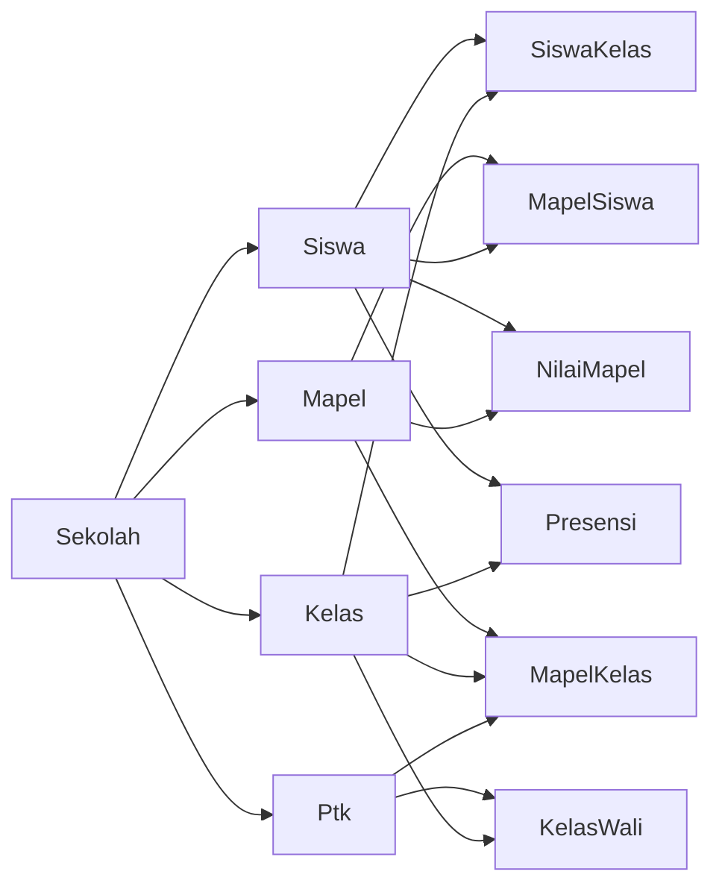

# Entity Models & Relationships

<cite>
**Referenced Files in This Document**
- [Siswa.php](file://app/Models/Siswa.php)
- [Ptk.php](file://app/Models/Ptk.php)
- [Kelas.php](file://app/Models/Kelas.php)
- [Mapel.php](file://app/Models/Mapel.php)
- [NilaiMapel.php](file://app/Models/NilaiMapel.php)
- [Presensi.php](file://app/Models/Presensi.php)
- [Sekolah.php](file://app/Models/Sekolah.php)
- [SiswaKelas.php](file://app/Models/SiswaKelas.php)
- [MapelKelas.php](file://app/Models/MapelKelas.php)
- [MapelSiswa.php](file://app/Models/MapelSiswa.php)
- [NilaiMataPelajaran.php](file://app/Models/NilaiMataPelajaran.php)
- [NilaiFormatif.php](file://app/Models/NilaiFormatif.php)
- [NilaiKelas.php](file://app/Models/NilaiKelas.php)
- [NilaiKelasMid.php](file://app/Models/NilaiKelasMid.php)
- [NilaiMapelMid.php](file://app/Models/NilaiMapelMid.php)
- [NilaiPrakerin.php](file://app/Models/NilaiPrakerin.php)
- [NilaiProyek.php](file://app/Models/NilaiProyek.php)
- [NilaiKokurikuler.php](file://app/Models/NilaiKokurikuler.php)
- [NilaiAssesmenSubelemen.php](file://app/Models/NilaiAssesmenSubelemen.php)
- [DeskripsiRapor.php](file://app/Models/DeskripsiRapor.php)
- [CatatanWali.php](file://app/Models/CatatanWali.php)
- [Prestasi.php](file://app/Models/Prestasi.php)
- [PiketHarian.php](file://app/Models/PiketHarian.php)
- [Eskul.php](file://app/Models/Eskul.php)
- [SiswaEskul.php](file://app/Models/SiswaEskul.php)
- [Prakerin.php](file://app/Models/Prakerin.php)
- [SiswaPrakerin.php](file://app/Models/SiswaPrakerin.php)
- [ProyekKelas.php](file://app/Models/ProyekKelas.php)
- [ProyekTema.php](file://app/Models/ProyekTema.php)
- [ProyekTujuan.php](file://app/Models/ProyekTujuan.php)
- [ProyekSubelemen.php](file://app/Models/ProyekSubelemen.php)
- [Dimensi.php](file://app/Models/Dimensi.php)
- [Elemen.php](file://app/Models/Elemen.php)
- [SubElemen.php](file://app/Models/SubElemen.php)
- [Tingkat.php](file://app/Models/Tingkat.php)
- [KompetensiKeahlian.php](file://app/Models/KompetensiKeahlian.php)
- [KelompokMapel.php](file://app/Models/KelompokMapel.php)
- [KepalaSekolah.php](file://app/Models/KepalaSekolah.php)
- [KelasWali.php](file://app/Models/KelasWali.php)
- [PembinaEskul.php](file://app/Models/PembinaEskul.php)
- [Organisasi.php](file://app/Models/Organisasi.php)
- [SuratMasuk.php](file://app/Models/SuratMasuk.php)
- [Setting.php](file://app/Models/Setting.php)
- [TahunPelajaran.php](file://app/Models/TahunPelajaran.php)
- [Semester.php](file://app/Models/Semester.php)
- [PembagianRaport.php](file://app/Models/PembagianRaport.php)
- [Lulusan.php](file://app/Models/Lulusan.php)
- [MutasiMasuk.php](file://app/Models/MutasiMasuk.php)
- [MutasiKeluar.php](file://app/Models/MutasiKeluar.php)
- [RefAgama.php](file://app/Models/RefAgama.php)
- [RefJenisKelamin.php](file://app/Models/RefJenisKelamin.php)
- [RefJenisSiswa.php](file://app/Models/RefJenisSiswa.php)
- [RefJenisKeluar.php](file://app/Models/RefJenisKeluar.php)
- [RefKepegawaian.php](file://app/Models/RefKepegawaian.php)
- [RefTugasTambahan.php](file://app/Models/RefTugasTambahan.php)
- [RefKurikulum.php](file://app/Models/RefKurikulum.php)
- [RefHari.php](file://app/Models/RefHari.php)
- [RefBulan.php](file://app/Models/RefBulan.php)
- [JenisAbsen.php](file://app/Models/JenisAbsen.php)
- [GuruMenuAkses.php](file://app/Models/GuruMenuAkses.php)
- [DapodikSyncLog.php](file://app/Models/DapodikSyncLog.php)
- [PwaToken.php](file://app/Models/PwaToken.php)
- [PushSubscription.php](file://app/Models/PushSubscription.php)
- [NilaiSumatifAs.php](file://app/Models/NilaiSumatifAs.php)
- [NilaiSumatifPh.php](file://app/Models/NilaiSumatifPh.php)
- [NilaiSumatifTs.php](file://app/Models/NilaiSumatifTs.php)
- [LagerNilaiMapel.php](file://app/Models/LagerNilaiMapel.php)
- [LagerNilaiMid.php](file://app/Models/LagerNilaiMid.php)
- [User.php](file://app/Models/User.php)
- [NilaiSumatifAsObserver.php](file://app/Observers/NilaiSumatifAsObserver.php)
- [SiswaFactory.php](file://database/factories/SiswaFactory.php)
- [KelasFactory.php](file://database/factories/KelasFactory.php)
- [MapelFactory.php](file://database/factories/MapelFactory.php)
- [NilaiMapelFactory.php](file://database/factories/NilaiMapelFactory.php)
- [PresensiFactory.php](file://database/factories/PresensiFactory.php)
- [SekolahFactory.php](file://database/factories/SekolahFactory.php)
- [DatabaseSeeder.php](file://database/seeders/DatabaseSeeder.php)
- [DemoDataSeeder.php](file://database/seeders/DemoDataSeeder.php)
- [RefDataSeeder.php](file://database/seeders/RefDataSeeder.php)
- [TahunPelajaranSemesterSeeder.php](file://database/seeders/TahunPelajaranSemesterSeeder.php)
- [UserSeeder.php](file://database/seeders/UserSeeder.php)
- [010808_create_siswa_table.php](file://database/migrations/2026_06_01_010808_create_siswa_table.php)
- [010808_create_sekolah_table.php](file://database/migrations/2026_06_01_010808_create_sekolah_table.php)
- [010808_create_kelas_table.php](file://database/migrations/2026_06_01_010808_create_kelas_table.php)
- [010808_create_mapel_table.php](file://database/migrations/2026_06_01_010808_create_mapel_table.php)
- [010817_create_nilai_mapel_table.php](file://database/migrations/2026_06_01_010817_create_nilai_mapel_table.php)
- [010820_create_presensi_table.php](file://database/migrations/2026_06_01_010820_create_presensi_table.php)
- [010816_create_mapel_kelas_table.php](file://database/migrations/2026_06_01_010816_create_mapel_kelas_table.php)
- [010816_create_mapel_siswa_table.php](file://database/migrations/2026_06_01_010816_create_mapel_siswa_table.php)
- [010816_create_siswa_kelas_table.php](file://database/migrations/2026_06_01_010816_create_siswa_kelas_table.php)
- [010817_create_nilai_mata_pelajaran_table.php](file://database/migrations/2026_06_01_010817_create_nilai_mata_pelajaran_table.php)
- [010817_create_nilai_formatif_table.php](file://database/migrations/2026_06_01_010817_create_nilai_formatif_table.php)
- [010818_create_nilai_kelas_table.php](file://database/migrations/2026_06_01_010818_create_nilai_kelas_table.php)
- [010818_create_nilai_kelas_mid_table.php](file://database/migrations/2026_06_01_010818_create_nilai_kelas_mid_table.php)
- [010818_create_nilai_mapel_mid_table.php](file://database/migrations/2026_06_01_010818_create_nilai_mapel_mid_table.php)
- [010818_create_nilai_prakerin_table.php](file://database/migrations/2026_06_01_010818_create_nilai_prakerin_table.php)
- [010819_create_nilai_proyek_table.php](file://database/migrations/2026_06_01_010819_create_nilai_proyek_table.php)
- [010819_create_nilai_kokurikuler_table.php](file://database/migrations/2026_06_01_010819_create_nilai_kokurikuler_table.php)
- [010819_create_nilai_assesmen_subelemen_table.php](file://database/migrations/2026_06_01_010819_create_nilai_assesmen_subelemen_table.php)
- [010819_create_deskripsi_rapor_table.php](file://database/migrations/2026_06_01_010819_create_deskripsi_rapor_table.php)
- [010820_create_catatan_wali_table.php](file://database/migrations/2026_06_01_010820_create_catatan_wali_table.php)
- [010821_create_prestasi_table.php](file://database/migrations/2026_06_01_010821_create_prestasi_table.php)
- [010820_create_piket_harian_table.php](file://database/migrations/2026_06_01_010820_create_piket_harian_table.php)
- [010809_create_eskul_table.php](file://database/migrations/2026_06_01_010809_create_eskul_table.php)
- [010816_create_siswa_eskul_table.php](file://database/migrations/2026_06_01_010816_create_siswa_eskul_table.php)
- [010818_create_prakerin_table.php](file://database/migrations/2026_06_01_010818_create_prakerin_table.php)
- [010819_create_siswa_prakerin_table.php](file://database/migrations/2026_06_01_010819_create_siswa_prakerin_table.php)
- [010818_create_proyek_kelas_table.php](file://database/migrations/2026_06_01_010818_create_proyek_kelas_table.php)
- [010818_create_proyek_tema_table.php](file://database/migrations/2026_06_01_010818_create_proyek_tema_table.php)
- [010818_create_proyek_tujuan_table.php](file://database/migrations/2026_06_01_010818_create_proyek_tujuan_table.php)
- [010818_create_proyek_subelemen_table.php](file://database/migrations/2026_06_01_010818_create_proyek_subelemen_table.php)
- [010809_create_dimensi_table.php](file://database/migrations/2026_06_01_010809_create_dimensi_table.php)
- [010818_create_elemen_table.php](file://database/migrations/2026_06_01_010818_create_elemen_table.php)
- [010818_create_sub_elemen_table.php](file://database/migrations/2026_06_01_010818_create_sub_elemen_table.php)
- [010808_create_tingkat_table.php](file://database/migrations/2026_06_01_010808_create_tingkat_table.php)
- [010808_create_kompetensi_keahlian_table.php](file://database/migrations/2026_06_01_010808_create_kompetensi_keahlian_table.php)
- [010807_create_kelompok_mapel_table.php](file://database/migrations/2026_06_01_010807_create_kelompok_mapel_table.php)
- [010810_create_kepala_sekolah_table.php](file://database/migrations/2026_06_01_010810_create_kepala_sekolah_table.php)
- [010816_create_kelas_wali_table.php](file://database/migrations/2026_06_01_010816_create_kelas_wali_table.php)
- [010816_create_pembina_eskul_table.php](file://database/migrations/2026_06_01_010816_create_pembina_eskul_table.php)
- [010809_create_organisasi_table.php](file://database/migrations/2026_06_01_010809_create_organisasi_table.php)
- [010810_create_surat_masuk_table.php](file://database/migrations/2026_06_01_010810_create_surat_masuk_table.php)
- [010810_create_settings_table.php](file://database/migrations/2026_06_01_010810_create_settings_table.php)
- [010807_create_tahun_pelajaran_table.php](file://database/migrations/2026_06_01_010807_create_tahun_pelajaran_table.php)
- [010808_create_semester_table.php](file://database/migrations/2026_06_01_010808_create_semester_table.php)
- [010810_create_pembagian_raport_table.php](file://database/migrations/2026_06_01_010810_create_pembagian_raport_table.php)
- [010821_create_lulusan_table.php](file://database/migrations/2026_06_01_010821_create_lulusan_table.php)
- [010821_create_mutasi_masuk_table.php](file://database/migrations/2026_06_01_010821_create_mutasi_masuk_table.php)
- [010821_create_mutasi_keluar_table.php](file://database/migrations/2026_06_01_010821_create_mutasi_keluar_table.php)
- [010801_create_ref_agama_table.php](file://database/migrations/2026_06_01_010801_create_ref_agama_table.php)
- [010801_create_ref_jenis_kelamin_table.php](file://database/migrations/2026_06_01_010801_create_ref_jenis_kelamin_table.php)
- [010802_create_ref_jenis_siswa_table.php](file://database/migrations/2026_06_01_010802_create_ref_jenis_siswa_table.php)
- [010802_create_ref_jenis_keluar_table.php](file://database/migrations/2026_06_01_010802_create_ref_jenis_keluar_table.php)
- [010802_create_ref_kepegawaian_table.php](file://database/migrations/2026_06_01_010802_create_ref_kepegawaian_table.php)
- [010802_create_ref_tugas_tambahan_table.php](file://database/migrations/2026_06_01_010802_create_ref_tugas_tambahan_table.php)
- [010802_create_ref_kurikulum_table.php](file://database/migrations/2026_06_01_010802_create_ref_kurikulum_table.php)
- [010802_create_ref_hari_table.php](file://database/migrations/2026_06_01_010802_create_ref_hari_table.php)
- [010802_create_ref_bulan_table.php](file://database/migrations/2026_06_01_010802_create_ref_bulan_table.php)
- [010803_create_jenis_absen_table.php](file://database/migrations/2026_06_01_010803_create_jenis_absen_table.php)
- [010810_create_guru_menu_akses_table.php](file://database/migrations/2026_06_01_010810_create_guru_menu_akses_table.php)
- [010827_create_personal_access_tokens_table.php](file://database/migrations/2026_06_01_010827_create_personal_access_tokens_table.php)
- [010827_create_pwa_tokens_table.php](file://database/migrations/2026_06_01_010827_create_pwa_tokens_table.php)
- [010828_create_remember_tokens_table.php](file://database/migrations/2026_06_01_010828_create_remember_tokens_table.php)
- [010820_create_presensi_guru_tu_table.php](file://database/migrations/2026_06_01_010820_create_presensi_guru_tu_table.php)
- [010808_create_dimensi_kokurikuler_table.php](file://database/migrations/2026_06_01_010808_create_dimensi_kokurikuler_table.php)
- [010809_create_deskripsi_kokurikuler_table.php](file://database/migrations/2026_06_01_010809_create_deskripsi_kokurikuler_table.php)
- [010817_create_lager_nilai_mapel_table.php](file://database/migrations/2026_06_01_010817_create_lager_nilai_mapel_table.php)
- [010817_create_lager_nilai_mid_table.php](file://database/migrations/2026_06_01_010817_create_lager_nilai_mid_table.php)
- [010817_create_nilai_sumatif_as_table.php](file://database/migrations/2026_06_01_010817_create_nilai_sumatif_as_table.php)
- [010817_create_nilai_sumatif_ph_table.php](file://database/migrations/2026_06_01_010817_create_nilai_sumatif_ph_table.php)
- [010817_create_nilai_sumatif_ts_table.php](file://database/migrations/2026_06_01_010817_create_nilai_sumatif_ts_table.php)
- [010801_create_users_table.php](file://database/migrations/0001_01_01_000000_create_users_table.php)
- [010801_create_jobs_table.php](file://database/migrations/0001_01_01_000002_create_jobs_table.php)
- [010801_create_cache_table.php](file://database/migrations/0001_01_01_000001_create_cache_table.php)
- [010827_create_dapodik_sync_logs_table.php](file://database/migrations/2026_06_02_040000_create_dapodik_sync_logs_table.php)
- [010827_create_push_subscriptions_table.php](file://database/migrations/2026_06_08_100000_create_push_subscriptions_table.php)
- [010800_create_dapodik_sync_logs_table.php](file://database/migrations/2026_06_02_040000_create_dapodik_sync_logs_table.php)
- [010800_create_pwa_tokens_table.php](file://database/migrations/2026_06_02_050000_add_dapodik_pd_id_to_siswa_table.php)
- [010800_create_pwa_tokens_table.php](file://database/migrations/2026_06_02_080000_add_dapodik_id_to_sekolah_table.php)
- [010800_create_pwa_tokens_table.php](file://database/migrations/2026_06_02_080001_add_dapodik_id_to_kelas_table.php)
- [010800_create_pwa_tokens_table.php](file://database/migrations/2026_06_02_080002_add_dapodik_id_to_mapel_table.php)
- [010800_create_pwa_tokens_table.php](file://database/migrations/2026_06_02_080003_add_dapodik_id_to_mapel_kelas_table.php)
- [010800_create_pwa_tokens_table.php](file://database/migrations/2026_06_02_090000_make_user_id_nullable_in_mapel_kelas_table.php)
- [010800_create_pwa_tokens_table.php](file://database/migrations/2026_06_02_100000_add_urutan_to_mapel_table.php)
- [010800_create_pwa_tokens_table.php](file://database/migrations/2026_06_03_044817_add_favicon_to_sekolah_table.php)
- [010800_create_pwa_tokens_table.php](file://database/migrations/2026_06_04_000001_add_batch_fields_to_dapodik_sync_logs_table.php)
- [010800_create_pwa_tokens_table.php](file://database/migrations/2026_06_04_120000_create_ptk_table_and_migrate_from_users.php)
- [010800_create_pwa_tokens_table.php](file://database/migrations/2026_06_04_130000_create_guru_menu_akses_table.php)
- [010800_create_pwa_tokens_table.php](file://database/migrations/2026_06_08_100000_create_push_subscriptions_table.php)
- [010800_create_pwa_tokens_table.php](file://database/migrations/2026_06_10_000001_add_fcm_token_to_users_table.php)
- [010800_create_pwa_tokens_table.php](file://database/migrations/2026_06_10_090001_add_gps_fields_to_sekolah_table.php)
- [010800_create_pwa_tokens_table.php](file://database/migrations/2026_06_10_090002_create_presensi_guru_tu_table.php)
- [010800_create_pwa_tokens_table.php](file://database/migrations/2026_06_13_150000_add_format_rapor_to_sekolah_table.php)
</cite>

## Table of Contents
1. [Introduction](#introduction)
2. [Project Structure](#project-structure)
3. [Core Components](#core-components)
4. [Architecture Overview](#architecture-overview)
5. [Detailed Component Analysis](#detailed-component-analysis)
6. [Dependency Analysis](#dependency-analysis)
7. [Performance Considerations](#performance-considerations)
8. [Troubleshooting Guide](#troubleshooting-guide)
9. [Conclusion](#conclusion)
10. [Appendices](#appendices)

## Introduction
This document provides comprehensive entity model documentation for RaporKM’s core business entities. It focuses on the major entities involved in school administration and reporting: students (siswa), staff members (ptk), classes (kelas), subjects (mapel), academic records (nilai_mapel and related), attendance (presensi), and institutional data (sekolah). For each entity, we describe structure, relationships, validation rules, business constraints, lifecycle management (soft deletes, timestamps), model observers, polymorphic and pivot/junction entities, and practical query patterns. We also outline factory and seeding strategies for testing.

## Project Structure
The application follows a conventional Laravel structure with models under app/Models, migrations under database/migrations, factories under database/factories, and seeders under database/seeders. The models define Eloquent relationships, while migrations define database schemas. Seeders and factories support development and testing workflows.

```mermaid
graph TB
subgraph "Models"
Siswa["Siswa"]
Ptk["Ptk"]
Kelas["Kelas"]
Mapel["Mapel"]
NilaiMapel["NilaiMapel"]
Presensi["Presensi"]
Sekolah["Sekolah"]
end
subgraph "Pivot Tables"
SiswaKelas["SiswaKelas"]
MapelKelas["MapelKelas"]
MapelSiswa["MapelSiswa"]
end
subgraph "Related Entities"
NilaiMataPelajaran["NilaiMataPelajaran"]
NilaiFormatif["NilaiFormatif"]
NilaiKelas["NilaiKelas"]
NilaiKelasMid["NilaiKelasMid"]
NilaiMapelMid["NilaiMapelMid"]
NilaiPrakerin["NilaiPrakerin"]
NilaiProyek["NilaiProyek"]
NilaiKokurikuler["NilaiKokurikuler"]
NilaiAssesmenSubelemen["NilaiAssesmenSubelemen"]
DeskripsiRapor["DeskripsiRapor"]
CatatanWali["CatatanWali"]
Prestasi["Prestasi"]
PiketHarian["PiketHarian"]
Eskul["Eskul"]
SiswaEskul["SiswaEskul"]
Prakerin["Prakerin"]
SiswaPrakerin["SiswaPrakerin"]
ProyekKelas["ProyekKelas"]
ProyekTema["ProyekTema"]
ProyekTujuan["ProyekTujuan"]
ProyekSubelemen["ProyekSubelemen"]
Dimensi["Dimensi"]
Elemen["Elemen"]
SubElemen["SubElemen"]
Tingkat["Tingkat"]
KompetensiKeahlian["KompetensiKeahlian"]
KelompokMapel["KelompokMapel"]
KepalaSekolah["KepalaSekolah"]
KelasWali["KelasWali"]
PembinaEskul["PembinaEskul"]
Organisasi["Organisasi"]
SuratMasuk["SuratMasuk"]
Setting["Setting"]
TahunPelajaran["TahunPelajaran"]
Semester["Semester"]
PembagianRaport["PembagianRaport"]
Lulusan["Lulusan"]
MutasiMasuk["MutasiMasuk"]
MutasiKeluar["MutasiKeluar"]
RefAgama["RefAgama"]
RefJenisKelamin["RefJenisKelamin"]
RefJenisSiswa["RefJenisSiswa"]
RefJenisKeluar["RefJenisKeluar"]
RefKepegawaian["RefKepegawaian"]
RefTugasTambahan["RefTugasTambahan"]
RefKurikulum["RefKurikulum"]
RefHari["RefHari"]
RefBulan["RefBulan"]
JenisAbsen["JenisAbsen"]
GuruMenuAkses["GuruMenuAkses"]
DapodikSyncLog["DapodikSyncLog"]
PwaToken["PwaToken"]
PushSubscription["PushSubscription"]
NilaiSumatifAs["NilaiSumatifAs"]
NilaiSumatifPh["NilaiSumatifPh"]
NilaiSumatifTs["NilaiSumatifTs"]
LagerNilaiMapel["LagerNilaiMapel"]
LagerNilaiMid["LagerNilaiMid"]
User["User"]
end
Siswa --- SiswaKelas
Kelas --- SiswaKelas
Mapel --- MapelKelas
Kelas --- MapelKelas
Siswa --- MapelSiswa
Mapel --- MapelSiswa
Siswa --- NilaiMapel
Mapel --- NilaiMapel
Siswa --- Presensi
Kelas --- Presensi
Sekolah --- Siswa
Sekolah --- Kelas
Sekolah --- Mapel
Sekolah --- Ptk
```

**Diagram sources**
- [Siswa.php](file://app/Models/Siswa.php)
- [Ptk.php](file://app/Models/Ptk.php)
- [Kelas.php](file://app/Models/Kelas.php)
- [Mapel.php](file://app/Models/Mapel.php)
- [NilaiMapel.php](file://app/Models/NilaiMapel.php)
- [Presensi.php](file://app/Models/Presensi.php)
- [Sekolah.php](file://app/Models/Sekolah.php)
- [SiswaKelas.php](file://app/Models/SiswaKelas.php)
- [MapelKelas.php](file://app/Models/MapelKelas.php)
- [MapelSiswa.php](file://app/Models/MapelSiswa.php)

**Section sources**
- [Siswa.php](file://app/Models/Siswa.php)
- [Kelas.php](file://app/Models/Kelas.php)
- [Mapel.php](file://app/Models/Mapel.php)
- [NilaiMapel.php](file://app/Models/NilaiMapel.php)
- [Presensi.php](file://app/Models/Presensi.php)
- [Sekolah.php](file://app/Models/Sekolah.php)
- [SiswaKelas.php](file://app/Models/SiswaKelas.php)
- [MapelKelas.php](file://app/Models/MapelKelas.php)
- [MapelSiswa.php](file://app/Models/MapelSiswa.php)

## Core Components
This section documents the core entities and their attributes, relationships, and constraints.

- Students (Siswa)
  - Purpose: Represents learners enrolled in classes.
  - Key attributes: Typically includes personal identifiers, demographic references, and foreign keys to institutional references.
  - Relationships:
    - belongsTo: Sekolah (institution), RefAgama, RefJenisSiswa, RefJenisKelamin
    - belongsToMany: Kelas via SiswaKelas
    - belongsToMany: Mapel via MapelSiswa
    - hasMany: Presensi, NilaiMapel, NilaiMataPelajaran, Prestasi, CatatanWali, PiketHarian
    - belongsToMany: Eskul via SiswaEskul
    - belongsToMany: Prakerin via SiswaPrakerin
  - Lifecycle: Uses timestamps; optional soft deletes depending on schema.
  - Validation/business constraints: Enforced via form requests and policies; schema constraints apply (e.g., unique NIS/NISN, required fields).

- Staff Members (Ptk)
  - Purpose: Represents teaching and administrative staff.
  - Key attributes: Personal info, employment references, and optional assignment to classes.
  - Relationships:
    - belongsTo: Sekolah, RefKepegawaian, RefTugasTambahan
    - belongsToMany: Kelas via KelasWali
    - belongsToMany: Mapel via MapelKelas (via user_id nullable migration)
  - Lifecycle: Timestamps; soft deletes may be present per schema.
  - Constraints: Unique identifiers, required employment/ref fields.

- Classes (Kelas)
  - Purpose: Academic groupings of students.
  - Relationships:
    - belongsTo: Sekolah, Tingkat, KompetensiKeahlian
    - belongsToMany: Siswa via SiswaKelas
    - belongsToMany: Mapel via MapelKelas
    - hasMany: Presensi, NilaiKelas, NilaiKelasMid
    - belongsToMany: Ptk via KelasWali
  - Constraints: Unique class identifiers per school/year; capacity limits if configured.

- Subjects (Mapel)
  - Purpose: Academic disciplines taught across classes.
  - Relationships:
    - belongsTo: Sekolah, KelompokMapel, RefKurikulum
    - belongsToMany: Kelas via MapelKelas
    - belongsToMany: Siswa via MapelSiswa
    - hasMany: NilaiMapel, NilaiMataPelajaran, NilaiFormatif
  - Constraints: Subject ordering via urutan; unique per school/kurikulum.

- Academic Records (NilaiMapel and related)
  - NilaiMapel: Links student and subject scores; supports mid-term and final assessments.
  - NilaiMataPelajaran: Subject-level grades.
  - NilaiFormatif: Formative assessment entries.
  - NilaiKelas / NilaiKelasMid: Class-level aggregated scores.
  - NilaiPrakerin / NilaiProyek / NilaiKokurikuler: Co-curricular and project-related grades.
  - NilaiAssesmenSubelemen: Sub-element scoring for competency frameworks.
  - NilaiSumatifAs/Ph/Ts: Summative assessments (AS, PH, TS).
  - Relationships:
    - belongsTo: Siswa, Mapel
    - belongsToMany: Dimensi/Elemen/SubElemen via pivot tables
    - hasMany: NilaiAssesmenSubelemen
  - Constraints: Score ranges, required assessment types, and term alignment.

- Attendance (Presensi)
  - Purpose: Tracks student presence per class and date.
  - Relationships:
    - belongsTo: Siswa, Kelas, JenisAbsen
    - belongsToMany: Ptk via PresensiGuruTu (staff attendance)
  - Constraints: Unique combinations of student, class, date, and type; absence types defined by ref table.

- Institutional Data (Sekolah)
  - Purpose: School metadata, settings, and operational parameters.
  - Relationships:
    - hasMany: Siswa, Kelas, Mapel, Ptk
    - hasOne: KepalaSekolah
    - hasMany: Setting, PembagianRaport, TahunPelajaran, Semester
  - Constraints: Unique school identifiers; geographic and branding fields.

**Section sources**
- [Siswa.php](file://app/Models/Siswa.php)
- [Ptk.php](file://app/Models/Ptk.php)
- [Kelas.php](file://app/Models/Kelas.php)
- [Mapel.php](file://app/Models/Mapel.php)
- [NilaiMapel.php](file://app/Models/NilaiMapel.php)
- [NilaiMataPelajaran.php](file://app/Models/NilaiMataPelajaran.php)
- [NilaiFormatif.php](file://app/Models/NilaiFormatif.php)
- [NilaiKelas.php](file://app/Models/NilaiKelas.php)
- [NilaiKelasMid.php](file://app/Models/NilaiKelasMid.php)
- [NilaiMapelMid.php](file://app/Models/NilaiMapelMid.php)
- [NilaiPrakerin.php](file://app/Models/NilaiPrakerin.php)
- [NilaiProyek.php](file://app/Models/NilaiProyek.php)
- [NilaiKokurikuler.php](file://app/Models/NilaiKokurikuler.php)
- [NilaiAssesmenSubelemen.php](file://app/Models/NilaiAssesmenSubelemen.php)
- [NilaiSumatifAs.php](file://app/Models/NilaiSumatifAs.php)
- [NilaiSumatifPh.php](file://app/Models/NilaiSumatifPh.php)
- [NilaiSumatifTs.php](file://app/Models/NilaiSumatifTs.php)
- [Presensi.php](file://app/Models/Presensi.php)
- [Sekolah.php](file://app/Models/Sekolah.php)
- [KepalaSekolah.php](file://app/Models/KepalaSekolah.php)
- [Setting.php](file://app/Models/Setting.php)
- [PembagianRaport.php](file://app/Models/PembagianRaport.php)
- [TahunPelajaran.php](file://app/Models/TahunPelajaran.php)
- [Semester.php](file://app/Models/Semester.php)

## Architecture Overview
The entity model architecture centers around institutional hierarchy and academic workflows:
- Institution (Sekolah) is the root container for all entities.
- Classes (Kelas) organize students and subjects.
- Students (Siswa) and Staff (Ptk) are linked to classes via many-to-many relationships.
- Subjects (Mapel) are associated with classes and students through dedicated pivot tables.
- Academic records (NilaiMapel and related) capture assessment outcomes with supporting competency and co-curricular entities.
- Attendance (Presensi) tracks daily presence aligned to classes and students.

**Diagram sources**
- [Siswa.php](file://app/Models/Siswa.php)
- [Ptk.php](file://app/Models/Ptk.php)
- [Kelas.php](file://app/Models/Kelas.php)
- [Mapel.php](file://app/Models/Mapel.php)
- [NilaiMapel.php](file://app/Models/NilaiMapel.php)
- [Presensi.php](file://app/Models/Presensi.php)
- [SiswaKelas.php](file://app/Models/SiswaKelas.php)
- [MapelKelas.php](file://app/Models/MapelKelas.php)
- [MapelSiswa.php](file://app/Models/MapelSiswa.php)
- [Sekolah.php](file://app/Models/Sekolah.php)

## Detailed Component Analysis

### Students (Siswa)
- Structure and properties: Includes identifiers, personal info, and foreign keys to reference tables. Attributes are defined in the migration and reflected in the model.
- Relationships:
  - belongsTo: Sekolah, RefAgama, RefJenisSiswa, RefJenisKelamin
  - belongsToMany: Kelas (SiswaKelas), Mapel (MapelSiswa)
  - hasMany: Presensi, NilaiMapel, NilaiMataPelajaran, Prestasi, CatatanWali, PiketHarian
  - belongsToMany: Eskul (SiswaEskul), Prakerin (SiswaPrakerin)
- Validation and constraints: Enforced by form requests and policies; schema enforces uniqueness and required fields.
- Lifecycle: Timestamps; optional soft deletes per schema.
- Query patterns:
  - Get current class roster: Siswa::with('kelas')->whereHas('kelas', ...) 
  - Get subject enrollments: Siswa::with('mapel')->whereHas('mapel', ...)
  - Aggregate attendance: Presensi::where('siswa_id', $id)->groupBy('jenis_absen_id')->count()

**Section sources**
- [Siswa.php](file://app/Models/Siswa.php)
- [010808_create_siswa_table.php](file://database/migrations/2026_06_01_010808_create_siswa_table.php)
- [SiswaKelas.php](file://app/Models/SiswaKelas.php)
- [MapelSiswa.php](file://app/Models/MapelSiswa.php)
- [Presensi.php](file://app/Models/Presensi.php)
- [NilaiMapel.php](file://app/Models/NilaiMapel.php)

### Staff Members (Ptk)
- Structure and properties: Employment identifiers, personal info, and foreign keys to employment references.
- Relationships:
  - belongsTo: Sekolah, RefKepegawaian, RefTugasTambahan
  - belongsToMany: Kelas (KelasWali)
  - belongsToMany: Mapel (MapelKelas) with nullable user_id
- Lifecycle: Timestamps; optional soft deletes.
- Query patterns:
  - Get class teacher assignments: Ptk::with('kelasWali.kelas')
  - Get subjects taught in a class: Ptk::with('mapelKelas.mapel')->whereHas('mapelKelas.kelas', ...)

**Section sources**
- [Ptk.php](file://app/Models/Ptk.php)
- [010804_120000_create_ptk_table_and_migrate_from_users.php](file://database/migrations/2026_06_04_120000_create_ptk_table_and_migrate_from_users.php)
- [KelasWali.php](file://app/Models/KelasWali.php)
- [MapelKelas.php](file://app/Models/MapelKelas.php)

### Classes (Kelas)
- Structure and properties: Class name, grade level, and specialization.
- Relationships:
  - belongsTo: Sekolah, Tingkat, KompetensiKeahlian
  - belongsToMany: Siswa (SiswaKelas), Mapel (MapelKelas)
  - hasMany: Presensi, NilaiKelas, NilaiKelasMid
  - belongsToMany: Ptk (KelasWali)
- Lifecycle: Timestamps; optional soft deletes.
- Query patterns:
  - Get enrolled students: Kelas::with('siswa')->whereHas('siswa')
  - Get subject lists: Kelas::with('mapelKelas.mapel')

**Section sources**
- [Kelas.php](file://app/Models/Kelas.php)
- [010808_create_kelas_table.php](file://database/migrations/2026_06_01_010808_create_kelas_table.php)
- [SiswaKelas.php](file://app/Models/SiswaKelas.php)
- [MapelKelas.php](file://app/Models/MapelKelas.php)
- [NilaiKelas.php](file://app/Models/NilaiKelas.php)
- [NilaiKelasMid.php](file://app/Models/NilaiKelasMid.php)

### Subjects (Mapel)
- Structure and properties: Subject code, name, grouping, curriculum, and order.
- Relationships:
  - belongsTo: Sekolah, KelompokMapel, RefKurikulum
  - belongsToMany: Kelas (MapelKelas), Siswa (MapelSiswa)
  - hasMany: NilaiMapel, NilaiMataPelajaran, NilaiFormatif
- Lifecycle: Timestamps; optional soft deletes.
- Query patterns:
  - Get subjects for a class: Mapel::with('kelas')->whereHas('kelas', ...)
  - Get student’s subjects: Mapel::with('siswa')->whereHas('siswa', ...)

**Section sources**
- [Mapel.php](file://app/Models/Mapel.php)
- [010808_create_mapel_table.php](file://database/migrations/2026_06_01_010808_create_mapel_table.php)
- [MapelKelas.php](file://app/Models/MapelKelas.php)
- [MapelSiswa.php](file://app/Models/MapelSiswa.php)
- [NilaiMapel.php](file://app/Models/NilaiMapel.php)

### Academic Records (NilaiMapel and Related)
- NilaiMapel: Links student and subject with semester context.
- NilaiMataPelajaran: Subject-level grades.
- NilaiFormatif: Formative assessments.
- NilaiKelas / NilaiKelasMid: Class-level aggregates.
- NilaiPrakerin / NilaiProyek / NilaiKokurikuler: Co-curricular and project grades.
- NilaiAssesmenSubelemen: Sub-element scoring for competency frameworks.
- NilaiSumatifAs/Ph/Ts: Summative assessments.
- Relationships:
  - belongsTo: Siswa, Mapel
  - belongsToMany: Dimensi/Elemen/SubElemen via pivots
  - hasMany: NilaiAssesmenSubelemen
- Lifecycle: Timestamps; optional soft deletes.
- Query patterns:
  - Get student’s subject grades: NilaiMapel::with('mapel')->where('siswa_id', $id)
  - Get class averages: NilaiKelas::where('kelas_id', $id)->avg('nilai')

**Section sources**
- [NilaiMapel.php](file://app/Models/NilaiMapel.php)
- [NilaiMataPelajaran.php](file://app/Models/NilaiMataPelajaran.php)
- [NilaiFormatif.php](file://app/Models/NilaiFormatif.php)
- [NilaiKelas.php](file://app/Models/NilaiKelas.php)
- [NilaiKelasMid.php](file://app/Models/NilaiKelasMid.php)
- [NilaiMapelMid.php](file://app/Models/NilaiMapelMid.php)
- [NilaiPrakerin.php](file://app/Models/NilaiPrakerin.php)
- [NilaiProyek.php](file://app/Models/NilaiProyek.php)
- [NilaiKokurikuler.php](file://app/Models/NilaiKokurikuler.php)
- [NilaiAssesmenSubelemen.php](file://app/Models/NilaiAssesmenSubelemen.php)
- [NilaiSumatifAs.php](file://app/Models/NilaiSumatifAs.php)
- [NilaiSumatifPh.php](file://app/Models/NilaiSumatifPh.php)
- [NilaiSumatifTs.php](file://app/Models/NilaiSumatifTs.php)
- [Dimensi.php](file://app/Models/Dimensi.php)
- [Elemen.php](file://app/Models/Elemen.php)
- [SubElemen.php](file://app/Models/SubElemen.php)

### Attendance (Presensi)
- Structure and properties: Student, class, absence type, and date.
- Relationships:
  - belongsTo: Siswa, Kelas, JenisAbsen
  - belongsToMany: Ptk (PresensiGuruTu)
- Lifecycle: Timestamps; optional soft deletes.
- Query patterns:
  - Daily attendance report: Presensi::where('tanggal', $date)->with(['siswa', 'kelas'])
  - Absence summary: Presensi::where('siswa_id', $id)->groupBy('jenis_absen_id')->count()

**Section sources**
- [Presensi.php](file://app/Models/Presensi.php)
- [010820_create_presensi_table.php](file://database/migrations/2026_06_01_010820_create_presensi_table.php)
- [JenisAbsen.php](file://app/Models/JenisAbsen.php)

### Institutional Data (Sekolah)
- Structure and properties: School identity, contact, and settings.
- Relationships:
  - hasMany: Siswa, Kelas, Mapel, Ptk
  - hasOne: KepalaSekolah
  - hasMany: Setting, PembagianRaport, TahunPelajaran, Semester
- Lifecycle: Timestamps; optional soft deletes.
- Query patterns:
  - School-wide reports: Sekolah::with(['siswa', 'kelas'])->first()
  - Academic year setup: TahunPelajaran::with('semester')

**Section sources**
- [Sekolah.php](file://app/Models/Sekolah.php)
- [010808_create_sekolah_table.php](file://database/migrations/2026_06_01_010808_create_sekolah_table.php)
- [KepalaSekolah.php](file://app/Models/KepalaSekolah.php)
- [Setting.php](file://app/Models/Setting.php)
- [PembagianRaport.php](file://app/Models/PembagianRaport.php)
- [TahunPelajaran.php](file://app/Models/TahunPelajaran.php)
- [Semester.php](file://app/Models/Semester.php)

### Pivot and Junction Entities
- SiswaKelas: Links students to classes with academic year context.
- MapelKelas: Links subjects to classes and optionally to staff.
- MapelSiswa: Links subjects to students with academic year context.
- SiswaEskul: Links students to extracurricular activities.
- SiswaPrakerin: Links students to practice programs.
- ProyekKelas / ProyekTema / ProyekTujuan / ProyekSubelemen: Project framework entities.
- Dimensi / Elemen / SubElemen: Competency framework hierarchy.
- Relationships:
  - Many-to-many between core entities with additional context (year, order).
  - Support for competency and project-based learning.

**Section sources**
- [SiswaKelas.php](file://app/Models/SiswaKelas.php)
- [MapelKelas.php](file://app/Models/MapelKelas.php)
- [MapelSiswa.php](file://app/Models/MapelSiswa.php)
- [SiswaEskul.php](file://app/Models/SiswaEskul.php)
- [SiswaPrakerin.php](file://app/Models/SiswaPrakerin.php)
- [ProyekKelas.php](file://app/Models/ProyekKelas.php)
- [ProyekTema.php](file://app/Models/ProyekTema.php)
- [ProyekTujuan.php](file://app/Models/ProyekTujuan.php)
- [ProyekSubelemen.php](file://app/Models/ProyekSubelemen.php)
- [Dimensi.php](file://app/Models/Dimensi.php)
- [Elemen.php](file://app/Models/Elemen.php)
- [SubElemen.php](file://app/Models/SubElemen.php)

### Polymorphic Relationships
- No explicit polymorphic relationships were identified among the core entities documented here. Entities use standard belongsTo, hasMany, and belongsToMany relationships.

[No sources needed since this section doesn't analyze specific files]

## Dependency Analysis
This section maps dependencies among core models and their relationships.

**Diagram sources**
- [Siswa.php](file://app/Models/Siswa.php)
- [Ptk.php](file://app/Models/Ptk.php)
- [Kelas.php](file://app/Models/Kelas.php)
- [Mapel.php](file://app/Models/Mapel.php)
- [NilaiMapel.php](file://app/Models/NilaiMapel.php)
- [Presensi.php](file://app/Models/Presensi.php)
- [SiswaKelas.php](file://app/Models/SiswaKelas.php)
- [MapelKelas.php](file://app/Models/MapelKelas.php)
- [MapelSiswa.php](file://app/Models/MapelSiswa.php)
- [KelasWali.php](file://app/Models/KelasWali.php)
- [Sekolah.php](file://app/Models/Sekolah.php)

**Section sources**
- [Siswa.php](file://app/Models/Siswa.php)
- [Ptk.php](file://app/Models/Ptk.php)
- [Kelas.php](file://app/Models/Kelas.php)
- [Mapel.php](file://app/Models/Mapel.php)
- [NilaiMapel.php](file://app/Models/NilaiMapel.php)
- [Presensi.php](file://app/Models/Presensi.php)
- [SiswaKelas.php](file://app/Models/SiswaKelas.php)
- [MapelKelas.php](file://app/Models/MapelKelas.php)
- [MapelSiswa.php](file://app/Models/MapelSiswa.php)
- [KelasWali.php](file://app/Models/KelasWali.php)
- [Sekolah.php](file://app/Models/Sekolah.php)

## Performance Considerations
- Indexing: Ensure foreign keys and frequently queried columns (e.g., siswa_id, kelas_id, mapel_id, tanggal) are indexed in migrations.
- Selective loading: Use eager loading (with) to avoid N+1 queries when retrieving related data.
- Aggregation queries: Prefer database-side aggregation (GROUP BY, SUM, AVG) to reduce PHP overhead.
- Soft deletes: Use scopes to filter out deleted rows unless explicitly needed.
- Batch operations: For large datasets (e.g., sync, exports), process in chunks to manage memory usage.

[No sources needed since this section provides general guidance]

## Troubleshooting Guide
- Missing relationships: Verify pivot table existence and column names match model definitions.
- Duplicate enrollments: Check unique constraints on pivot tables (e.g., student-class-year).
- Attendance mismatches: Confirm date and absence type references align with JenisAbsen.
- Assessment score errors: Validate summative/formative rules and competency framework mappings.
- Observer behavior: Review observer registration and logic for automatic updates or validations.

**Section sources**
- [NilaiSumatifAsObserver.php](file://app/Observers/NilaiSumatifAsObserver.php)

## Conclusion
RaporKM’s entity model establishes a robust foundation for managing school data and academic workflows. The relationships among students, staff, classes, subjects, academic records, and attendance are clearly defined through Eloquent, with pivot tables supporting complex many-to-many associations. Proper indexing, selective loading, and batch processing improve performance. Testing is supported by factories and seeders, enabling realistic scenarios and validations.

[No sources needed since this section summarizes without analyzing specific files]

## Appendices

### Model Lifecycle Management
- Timestamps: Present across most models; enable createdAt/updatedAt tracking.
- Soft deletes: Optional per schema; use scopes to exclude deleted records unless required.
- Observers: Implemented for specific behaviors (e.g., NilaiSumatifAsObserver).

**Section sources**
- [NilaiSumatifAsObserver.php](file://app/Observers/NilaiSumatifAsObserver.php)

### Entity Interactions and Query Patterns
- Retrieve a student’s class history: Siswa::with('kelas')->find($id)
- Fetch subjects for a class: Kelas::with('mapelKelas.mapel')->find($id)
- Get student’s attendance summary: Presensi::where('siswa_id', $id)->groupBy('jenis_absen_id')->count()
- Compute class averages: NilaiKelas::where('kelas_id', $id)->avg('nilai')
- List extracurricular activities for a student: Siswa::with('eskul')->find($id)

[No sources needed since this section provides general guidance]

### Polymorphic Relationships
- Not applicable to the core entities documented here.

[No sources needed since this section doesn't analyze specific files]

### Pivot Tables and Junction Entities
- SiswaKelas, MapelKelas, MapelSiswa, SiswaEskul, SiswaPrakerin, and project/competency framework tables support complex academic workflows.

**Section sources**
- [SiswaKelas.php](file://app/Models/SiswaKelas.php)
- [MapelKelas.php](file://app/Models/MapelKelas.php)
- [MapelSiswa.php](file://app/Models/MapelSiswa.php)
- [SiswaEskul.php](file://app/Models/SiswaEskul.php)
- [SiswaPrakerin.php](file://app/Models/SiswaPrakerin.php)
- [ProyekKelas.php](file://app/Models/ProyekKelas.php)
- [ProyekTema.php](file://app/Models/ProyekTema.php)
- [ProyekTujuan.php](file://app/Models/ProyekTujuan.php)
- [ProyekSubelemen.php](file://app/Models/ProyekSubelemen.php)
- [Dimensi.php](file://app/Models/Dimensi.php)
- [Elemen.php](file://app/Models/Elemen.php)
- [SubElemen.php](file://app/Models/SubElemen.php)

### Model Factories and Seeding Strategies
- Factories:
  - SiswaFactory, KelasFactory, MapelFactory, NilaiMapelFactory, PresensiFactory, SekolahFactory support rapid test data generation.
- Seeders:
  - DatabaseSeeder orchestrates initial data setup.
  - DemoDataSeeder and UatDataSeeder provide environment-specific datasets.
  - RefDataSeeder seeds reference tables (e.g., RefAgama, RefJenisSiswa).
  - TahunPelajaranSemesterSeeder initializes academic years and semesters.
  - UserSeeder creates initial user accounts.

**Section sources**
- [SiswaFactory.php](file://database/factories/SiswaFactory.php)
- [KelasFactory.php](file://database/factories/KelasFactory.php)
- [MapelFactory.php](file://database/factories/MapelFactory.php)
- [NilaiMapelFactory.php](file://database/factories/NilaiMapelFactory.php)
- [PresensiFactory.php](file://database/factories/PresensiFactory.php)
- [SekolahFactory.php](file://database/factories/SekolahFactory.php)
- [DatabaseSeeder.php](file://database/seeders/DatabaseSeeder.php)
- [DemoDataSeeder.php](file://database/seeders/DemoDataSeeder.php)
- [RefDataSeeder.php](file://database/seeders/RefDataSeeder.php)
- [TahunPelajaranSemesterSeeder.php](file://database/seeders/TahunPelajaranSemesterSeeder.php)
- [UserSeeder.php](file://database/seeders/UserSeeder.php)