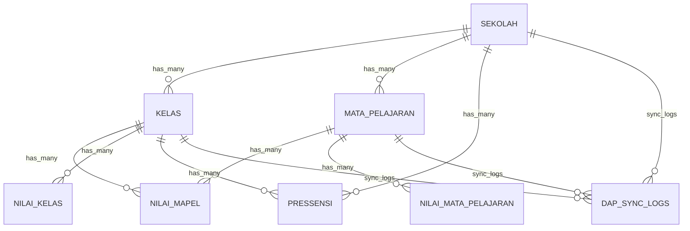
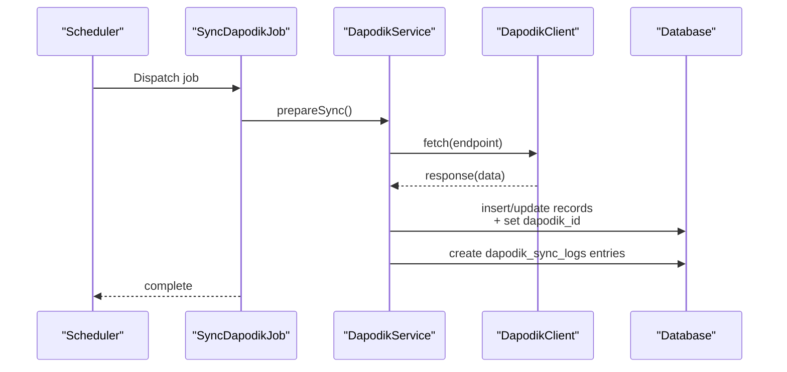
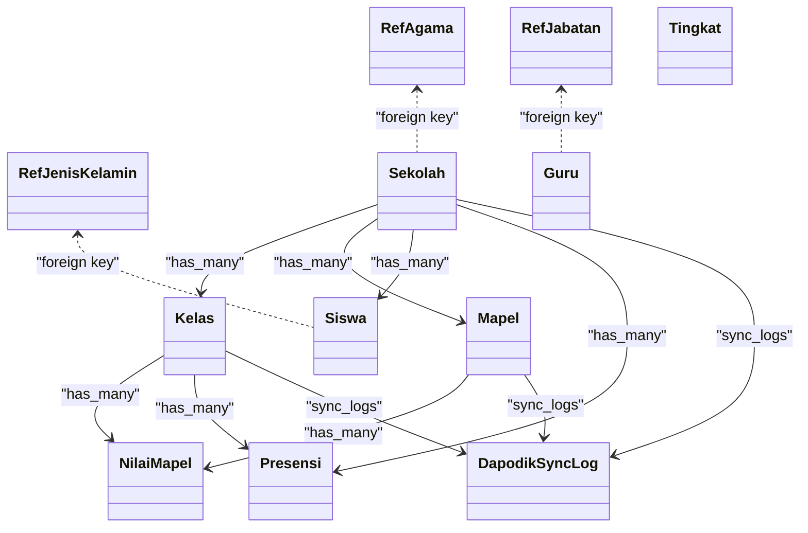

# Migration Files & Schema

<cite>
**Referenced Files in This Document**
- [0001_01_01_000000_create_users_table.php](file://database/migrations/0001_01_01_000000_create_users_table.php)
- [0001_01_01_000001_create_cache_table.php](file://database/migrations/0001_01_01_000001_create_cache_table.php)
- [0001_01_01_000002_create_jobs_table.php](file://database/migrations/0001_01_01_000002_create_jobs_table.php)
- [2026_06_01_010657_create_activity_log_table.php](file://database/migrations/2026_06_01_010657_create_activity_log_table.php)
- [2026_06_01_010801_create_ref_agama_table.php](file://database/migrations/2026_06_01_010801_create_ref_agama_table.php)
- [2026_06_01_010801_create_ref_jenis_kelamin_table.php](file://database/migrations/2026_06_01_010801_create_ref_jenis_kelamin_table.php)
- [2026_06_01_010802_create_ref_jabatan_table.php](file://database/migrations/2026_06_01_010802_create_ref_jabatan_table.php)
- [2026_06_01_010807_create_mapel_table.php](file://database/migrations/2026_06_01_010807_create_mapel_table.php)
- [2026_06_01_010808_create_kelas_table.php](file://database/migrations/2026_06_01_010808_create_kelas_table.php)
- [2026_06_01_010817_create_nilai_mapel_table.php](file://database/migrations/2026_06_01_010817_create_nilai_mapel_table.php)
- [2026_06_01_010820_create_presensi_table.php](file://database/migrations/2026_06_01_010820_create_presensi_table.php)
- [2026_06_02_040000_create_dapodik_sync_logs_table.php](file://database/migrations/2026_06_02_040000_create_dapodik_sync_logs_table.php)
- [2026_06_02_050000_add_dapodik_pd_id_to_siswa_table.php](file://database/migrations/2026_06_02_050000_add_dapodik_pd_id_to_siswa_table.php)
- [2026_06_02_080000_add_dapodik_id_to_sekolah_table.php](file://database/migrations/2026_06_02_080000_add_dapodik_id_to_sekolah_table.php)
- [2026_06_02_080001_add_dapodik_id_to_kelas_table.php](file://database/migrations/2026_06_02_080001_add_dapodik_id_to_kelas_table.php)
- [2026_06_02_080002_add_dapodik_id_to_mapel_table.php](file://database/migrations/2026_06_02_080002_add_dapodik_id_to_mapel_table.php)
- [2026_06_02_080003_add_dapodik_id_to_mapel_kelas_table.php](file://database/migrations/2026_06_02_080003_add_dapodik_id_to_mapel_kelas_table.php)
- [2026_06_02_090000_make_user_id_nullable_in_mapel_kelas_table.php](file://database/migrations/2026_06_02_090000_make_user_id_nullable_in_mapel_kelas_table.php)
- [2026_06_02_100000_add_urutan_to_mapel_table.php](file://database/migrations/2026_06_02_100000_add_urutan_to_mapel_table.php)
- [2026_06_04_000001_add_batch_fields_to_dapodik_sync_logs_table.php](file://database/migrations/2026_06_04_000001_add_batch_fields_to_dapodik_sync_logs_table.php)
- [2026_06_04_120000_create_ptk_table_and_migrate_from_users.php](file://database/migrations/2026_06_04_120000_create_ptk_table_and_migrate_from_users.php)
- [2026_06_04_130000_create_guru_menu_akses_table.php](file://database/migrations/2026_06_04_130000_create_guru_menu_akses_table.php)
- [2026_06_08_100000_create_push_subscriptions_table.php](file://database/migrations/2026_06_08_100000_create_push_subscriptions_table.php)
- [2026_06_10_000001_add_fcm_token_to_users_table.php](file://database/migrations/2026_06_10_000001_add_fcm_token_to_users_table.php)
- [2026_06_10_090001_add_gps_fields_to_sekolah_table.php](file://database/migrations/2026_06_10_090001_add_gps_fields_to_sekolah_table.php)
- [2026_06_10_090002_create_presensi_guru_tu_table.php](file://database/migrations/2026_06_10_090002_create_presensi_guru_tu_table.php)
- [RefAgama.php](file://app/Models/RefAgama.php)
- [RefJenisKelamin.php](file://app/Models/RefJenisKelamin.php)
- [RefJabatan.php](file://app/Models/RefJabatan.php)
- [Kelas.php](file://app/Models/Kelas.php)
- [Mapel.php](file://app/Models/Mapel.php)
- [NilaiMapel.php](file://app/Models/NilaiMapel.php)
- [Presensi.php](file://app/Models/Presensi.php)
- [DapodikSyncLog.php](file://app/Models/DapodikSyncLog.php)
- [DapodikClient.php](file://app/Services/Dapodik/DapodikClient.php)
- [SiswaSyncService.php](file://app/Services/Dapodik/SiswaSyncService.php)
- [SekolahSyncService.php](file://app/Services/Dapodik/SekolahSyncService.php)
- [GtkSyncService.php](file://app/Services/Dapodik/GtkSyncService.php)
- [DapodikService.php](file://app/Services/DapodikService.php)
- [SyncDapodikJob.php](file://app/Jobs/SyncDapodikJob.php)
- [ProcessPwaSyncJob.php](file://app/Jobs/ProcessPwaSyncJob.php)
- [DapodikSyncProgress.php](file://app/Livewire/DapodikSyncProgress.php)
- [2026_06_01_010801_create_ref_hubungan_keluarga_table.php](file://database/migrations/2026_06_01_010801_create_ref_hubungan_keluarga_table.php)
- [2026_06_01_010802_create_ref_bulan_table.php](file://database/migrations/2026_06_01_010802_create_ref_bulan_table.php)
- [2026_06_01_010802_create_ref_hari_table.php](file://database/migrations/2026_06_01_010802_create_ref_hari_table.php)
- [2026_06_01_010802_create_ref_jenis_siswa_table.php](file://database/migrations/2026_06_01_010802_create_ref_jenis_siswa_table.php)
- [2026_06_01_010802_create_ref_kepegawaian_table.php](file://database/migrations/2026_06_01_010802_create_ref_kepegawaian_table.php)
- [2026_06_01_010802_create_ref_pendidikan_table.php](file://database/migrations/2026_06_01_010802_create_ref_pendidikan_table.php)
- [2026_06_01_010802_create_ref_tugas_tambahan_table.php](file://database/migrations/2026_06_01_010802_create_ref_tugas_tambahan_table.php)
- [2026_06_01_010803_create_jenis_absen_table.php](file://database/migrations/2026_06_01_010803_create_jenis_absen_table.php)
- [2026_06_01_010803_create_ref_jenis_keluar_table.php](file://database/migrations/2026_06_01_010803_create_ref_jenis_keluar_table.php)
- [2026_06_01_010807_create_kelompok_mapel_table.php](file://database/migrations/2026_06_01_010807_create_kelompok_mapel_table.php)
- [2026_06_01_010807_create_ref_kurikulum_table.php](file://database/migrations/2026_06_01_010807_create_ref_kurikulum_table.php)
- [2026_06_01_010807_create_tahun_pelajaran_table.php](file://database/migrations/2026_06_01_010807_create_tahun_pelajaran_table.php)
- [2026_06_01_010808_create_dimensi_kokurikuler_table.php](file://database/migrations/2026_06_01_010808_create_dimensi_kokurikuler_table.php)
- [2026_06_01_010808_create_kompetensi_keahlian_table.php](file://database/migrations/2026_06_01_010808_create_kompetensi_keahlian_table.php)
- [2026_06_01_010808_create_sekolah_table.php](file://database/migrations/2026_06_01_010808_create_sekolah_table.php)
- [2026_06_01_010808_create_semester_table.php](file://database/migrations/2026_06_01_010808_create_semester_table.php)
- [2026_06_01_010808_create_siswa_table.php](file://database/migrations/2026_06_01_010808_create_siswa_table.php)
- [2026_06_01_010808_create_tingkat_table.php](file://database/migrations/2026_06_01_010808_create_tingkat_table.php)
- [2026_06_01_010809_create_deskripsi_kokurikuler_table.php](file://database/migrations/2026_06_01_010809_create_deskripsi_kokurikuler_table.php)
- [2026_06_01_010809_create_deskripsi_rapor_table.php](file://database/migrations/2026_06_01_010809_create_deskripsi_rapor_table.php)
- [2026_06_01_010809_create_dimensi_table.php](file://database/migrations/2026_06_01_010809_create_dimensi_table.php)
- [2026_06_01_010809_create_eskul_table.php](file://database/migrations/2026_06_01_010809_create_eskul_table.php)
- [2026_06_01_010809_create_organisasi_table.php](file://database/migrations/2026_06_01_010809_create_organisasi_table.php)
- [2026_06_01_010810_create_kepala_sekolah_table.php](file://database/migrations/2026_06_01_010810_create_kepala_sekolah_table.php)
- [2026_06_01_010810_create_laporan_wa_table.php](file://database/migrations/2026_06_01_010810_create_laporan_wa_table.php)
- [2026_06_01_010810_create_pembagian_raport_table.php](file://database/migrations/2026_06_01_010810_create_pembagian_raport_table.php)
- [2026_06_01_010810_create_pengingat_table.php](file://database/migrations/2026_06_01_010810_create_pengingat_table.php)
- [2026_06_01_010810_create_settings_table.php](file://database/migrations/2026_06_01_010810_create_settings_table.php)
- [2026_06_01_010810_create_surat_masuk_table.php](file://database/migrations/2026_06_01_010810_create_surat_masuk_table.php)
- [2026_06_01_010816_create_kelas_wali_table.php](file://database/migrations/2026_06_01_010816_create_kelas_wali_table.php)
- [2026_06_01_010816_create_mapel_kelas_table.php](file://database/migrations/2026_06_01_010816_create_mapel_kelas_table.php)
- [2026_06_01_010816_create_mapel_siswa_table.php](file://database/migrations/2026_06_01_010816_create_mapel_siswa_table.php)
- [2026_06_01_010816_create_pembina_eskul_table.php](file://database/migrations/2026_06_01_010816_create_pembina_eskul_table.php)
- [2026_06_01_010816_create_siswa_kelas_table.php](file://database/migrations/2026_06_01_010816_create_siswa_kelas_table.php)
- [2026_06_01_010816_create_tujuan_pembelajaran_table.php](file://database/migrations/2026_06_01_010816_create_tujuan_pembelajaran_table.php)
- [2026_06_01_010817_create_lager_nilai_mapel_table.php](file://database/migrations/2026_06_01_010817_create_lager_nilai_mapel_table.php)
- [2026_06_01_010817_create_lager_nilai_mid_table.php](file://database/migrations/2026_06_01_010817_create_lager_nilai_mid_table.php)
- [2026_06_01_010817_create_nilai_formatif_table.php](file://database/migrations/2026_06_01_010817_create_nilai_formatif_table.php)
- [2026_06_01_010817_create_nilai_sumatif_as_table.php](file://database/migrations/2026_06_01_010817_create_nilai_sumatif_as_table.php)
- [2026_06_01_010817_create_nilai_sumatif_ph_table.php](file://database/migrations/2026_06_01_010817_create_nilai_sumatif_ph_table.php)
- [2026_06_01_010817_create_nilai_sumatif_ts_table.php](file://database/migrations/2026_06_01_010817_create_nilai_sumatif_ts_table.php)
- [2026_06_01_010817_create_proyek_tema_table.php](file://database/migrations/2026_06_01_010817_create_proyek_tema_table.php)
- [2026_06_01_010818_create_elemen_table.php](file://database/migrations/2026_06_01_010818_create_elemen_table.php)
- [2026_06_01_010818_create_nilai_kelas_mid_table.php](file://database/migrations/2026_06_01_010818_create_nilai_kelas_mid_table.php)
- [2026_06_01_010818_create_nilai_kelas_table.php](file://database/migrations/2026_06_01_010818_create_nilai_kelas_table.php)
- [2026_06_01_010818_create_nilai_mapel_mid_table.php](file://database/migrations/2026_06_01_010818_create_nilai_mapel_mid_table.php)
- [2026_06_01_010818_create_nilai_mata_pelajaran_table.php](file://database/migrations/2026_06_01_010818_create_nilai_mata_pelajaran_table.php)
- [2026_06_01_010818_create_prakerin_table.php](file://database/migrations/2026_06_01_010818_create_prakerin_table.php)
- [2026_06_01_010818_create_proyek_kelas_table.php](file://database/migrations/2026_06_01_010818_create_proyek_kelas_table.php)
- [2026_06_01_010818_create_sub_elemen_table.php](file://database/migrations/2026_06_01_010818_create_sub_elemen_table.php)
- [2026_06_01_010819_create_mapel_proyek_table.php](file://database/migrations/2026_06_01_010819_create_mapel_proyek_table.php)
- [2026_06_01_010819_create_nilai_assesmen_subelemen_table.php](file://database/migrations/2026_06_01_010819_create_nilai_assesmen_subelemen_table.php)
- [2026_06_01_010819_create_nilai_kokurikuler_table.php](file://database/migrations/2026_06_01_010819_create_nilai_kokurikuler_table.php)
- [2026_06_01_010819_create_nilai_proyek_table.php](file://database/migrations/2026_06_01_010819_create_nilai_proyek_table.php)
- [2026_06_01_010819_create_proyek_subelemen_table.php](file://database/migrations/2026_06_01_010819_create_proyek_subelemen_table.php)
- [2026_06_01_010819_create_proyek_tujuan_table.php](file://database/migrations/2026_06_01_010819_create_proyek_tujuan_table.php)
- [2026_06_01_010819_create_siswa_prakerin_table.php](file://database/migrations/2026_06_01_010819_create_siswa_prakerin_table.php)
- [2026_06_01_010820_create_catatan_wali_table.php](file://database/migrations/2026_06_01_010820_create_catatan_wali_table.php)
- [2026_06_01_010820_create_nilai_prakerin_table.php](file://database/migrations/2026_06_01_010820_create_nilai_prakerin_table.php)
- [2026_06_01_010820_create_piket_harian_table.php](file://database/migrations/2026_06_01_010820_create_piket_harian_table.php)
- [2026_06_01_010820_create_siswa_eskul_table.php](file://database/migrations/2026_06_01_010820_create_siswa_eskul_table.php)
- [2026_06_01_010821_create_lulusan_table.php](file://database/migrations/2026_06_01_010821_create_lulusan_table.php)
- [2026_06_01_010821_create_mutasi_keluar_table.php](file://database/migrations/2026_06_01_010821_create_mutasi_keluar_table.php)
- [2026_06_01_010821_create_mutasi_masuk_table.php](file://database/migrations/2026_06_01_010821_create_mutasi_masuk_table.php)
- [2026_06_01_010821_create_prestasi_table.php](file://database/migrations/2026_06_01_010821_create_prestasi_table.php)
- [2026_06_01_010827_create_personal_access_tokens_table.php](file://database/migrations/2026_06_01_010827_create_personal_access_tokens_table.php)
- [2026_06_01_010827_create_pwa_tokens_table.php](file://database/migrations/2026_06_01_010827_create_pwa_tokens_table.php)
- [2026_06_01_010828_create_remember_tokens_table.php](file://database/migrations/2026_06_01_010828_create_remember_tokens_table.php)
- [2026_06_03_044817_add_favicon_to_sekolah_table.php](file://database/migrations/2026_06_03_044817_add_favicon_to_sekolah_table.php)
- [2026_06_04_120000_create_ptk_table_and_migrate_from_users.php](file://database/migrations/2026_06_04_120000_create_ptk_table_and_migrate_from_users.php)
- [2026_06_04_130000_create_guru_menu_akses_table.php](file://database/migrations/2026_06_04_130000_create_guru_menu_akses_table.php)
- [2026_06_08_100000_create_push_subscriptions_table.php](file://database/migrations/2026_06_08_100000_create_push_subscriptions_table.php)
- [2026_06_10_000001_add_fcm_token_to_users_table.php](file://database/migrations/2026_06_10_000001_add_fcm_token_to_users_table.php)
- [2026_06_10_090001_add_gps_fields_to_sekolah_table.php](file://database/migrations/2026_06_10_090001_add_gps_fields_to_sekolah_table.php)
- [2026_06_10_090002_create_presensi_guru_tu_table.php](file://database/migrations/2026_06_10_090002_create_presensi_guru_tu_table.php)
</cite>

## Table of Contents
1. [Introduction](#introduction)
2. [Project Structure](#project-structure)
3. [Core Components](#core-components)
4. [Architecture Overview](#architecture-overview)
5. [Detailed Component Analysis](#detailed-component-analysis)
6. [Dependency Analysis](#dependency-analysis)
7. [Performance Considerations](#performance-considerations)
8. [Troubleshooting Guide](#troubleshooting-guide)
9. [Conclusion](#conclusion)
10. [Appendices](#appendices)

## Introduction
This document provides a comprehensive migration and schema guide for RaporKM Laravel’s database. It documents the complete migration timeline from initial setup through the current schema state, explains the purpose and structure of each migration, details reference data tables and academic record tables, and describes the Dapodik integration tables and synchronization mechanisms. It also covers best practices for migrations, rollback procedures, schema versioning, indexing strategies, performance optimizations, and constraint enforcement, along with guidance for adding new migrations while maintaining backward compatibility.

## Project Structure
The database schema is primarily defined by Laravel migrations under database/migrations. These migrations are grouped into batches and ordered by timestamp to ensure deterministic application order. The schema evolves around:
- Reference data tables (e.g., ref_agama, ref_jenis_kelamin, ref_jabatan) for standardized enumerations
- Academic record tables (e.g., nilai_mapel, presensi, kelas, mapel) modeling teaching and learning activities
- Dapodik integration tables (e.g., dapodik_sync_logs) and supporting fields on core entities
- Supporting infrastructure tables (users, jobs, cache, personal_access_tokens, etc.)

```mermaid
graph TB
subgraph "Infrastructure"
USERS["users"]
CACHE["cache"]
JOBS["jobs"]
PAT["personal_access_tokens"]
end
subgraph "Reference Data"
REF_AGAMA["ref_agama"]
REF_JK["ref_jenis_kelamin"]
REF_JABATAN["ref_jabatan"]
REF_HUBKEL["ref_hubungan_keluarga"]
REF_BULAN["ref_bulan"]
REF_HARI["ref_hari"]
REF_JENIS_SISWA["ref_jenis_siswa"]
REF_KEPEG["ref_kepegawaian"]
REF_PENDIDIKAN["ref_pendidikan"]
REF_TUGAS_TAMBAHAN["ref_tugas_tambahan"]
JENIS_ABSEN["jenis_absen"]
REF_KELUAR["ref_jenis_keluar"]
KEL_KELAS["kelompok_mapel"]
REF_KURIKULUM["ref_kurikulum"]
TAHUN_PELAJARAN["tahun_pelajaran"]
SEMESTER["semester"]
TINGKAT["tingkat"]
DIMENSI_KOKUR["dimensi_kokurikuler"]
KOMPETENSI_AHLI["kompetensi_keahlian"]
SEKOLAH["sekolah"]
DIMENSI["dimensi"]
ESKUL["eskul"]
ORGANISASI["organisasi"]
KEPALA_SEKOLAH["kepala_sekolah"]
PEMBAGIAN_RAPORT["pembagian_raport"]
DESKRIPSI_KOKUR["deskripsi_kokurikuler"]
DESKRIPSI_RAPOR["deskripsi_rapor"]
end
subgraph "Academic Records"
KELAS["kelas"]
MATA_PELAJARAN["mapel"]
NILAI_MAPEL["nilai_mapel"]
NILAI_KELAS["nilai_kelas"]
NILAI_FORMATIF["nilai_formatif"]
NILAI_SUMATIF_AS["nilai_sumatif_as"]
NILAI_SUMATIF_PH["nilai_sumatif_ph"]
NILAI_SUMATIF_TS["nilai_sumatif_ts"]
NILAI_MAPEL_MID["nilai_mapel_mid"]
NILAI_KELAS_MID["nilai_kelas_mid"]
NILAI_MATA_PELAJARAN["nilai_mata_pelajaran"]
PRESENSI["presensi"]
CATATAN_WALI["catatan_wali"]
LULUSAN["lulusan"]
MUTASI_MASUK["mutasi_masuk"]
MUTASI_KELUAR["mutasi_keluar"]
PRESTASI["prestasi"]
PRASARANA["prakerin"]
NILAI_PRASARANA["nilai_prakerin"]
SISWA_PRASARANA["siswa_prakerin"]
ELEMEN["elemen"]
SUB_ELEMEM["sub_elemen"]
PROYEK_KELAS["proyek_kelas"]
PROYEK_TEMAA["proyek_tema"]
PROYEK_TUJUAN["proyek_tujuan"]
PROYEK_SUBELEMEN["proyek_subelemen"]
NILAI_PROYEK["nilai_proyek"]
NILAI_ASSESMEN_SUBELEMEN["nilai_assesmen_subelemen"]
NILAI_KOKUR["nilai_kokurikuler"]
PEMBINA_ESKUL["pembina_eskul"]
SISWA_ESKUL["siswa_eskul"]
LAGGER_NILAI_MAPEL["lager_nilai_mapel"]
LAGGER_NILAI_MID["lager_nilai_mid"]
PWA_TOKENS["pwa_tokens"]
REMEMBER_TOKENS["remember_tokens"]
end
subgraph "Dapodik Integration"
DAP_SYNC_LOGS["dapodik_sync_logs"]
end
USERS --> KELAS
SEKOLAH --> KELAS
SEKOLAH --> MATA_PELAJARAN
KELAS --> NILAI_MAPEL
MATA_PELAJARAN --> NILAI_MAPEL
KELAS --> NILAI_KELAS
MATA_PELAJARAN --> NILAI_MAPEL
SEKOLAH --> DAP_SYNC_LOGS
KELAS --> DAP_SYNC_LOGS
MATA_PELAJARAN --> DAP_SYNC_LOGS
```

**Diagram sources**
- [0001_01_01_000000_create_users_table.php](file://database/migrations/0001_01_01_000000_create_users_table.php)
- [0001_01_01_000001_create_cache_table.php](file://database/migrations/0001_01_01_000001_create_cache_table.php)
- [0001_01_01_000002_create_jobs_table.php](file://database/migrations/0001_01_01_000002_create_jobs_table.php)
- [2026_06_01_010801_create_ref_agama_table.php](file://database/migrations/2026_06_01_010801_create_ref_agama_table.php)
- [2026_06_01_010801_create_ref_jenis_kelamin_table.php](file://database/migrations/2026_06_01_010801_create_ref_jenis_kelamin_table.php)
- [2026_06_01_010802_create_ref_jabatan_table.php](file://database/migrations/2026_06_01_010802_create_ref_jabatan_table.php)
- [2026_06_01_010807_create_mapel_table.php](file://database/migrations/2026_06_01_010807_create_mapel_table.php)
- [2026_06_01_010808_create_kelas_table.php](file://database/migrations/2026_06_01_010808_create_kelas_table.php)
- [2026_06_01_010817_create_nilai_mapel_table.php](file://database/migrations/2026_06_01_010817_create_nilai_mapel_table.php)
- [2026_06_01_010820_create_presensi_table.php](file://database/migrations/2026_06_01_010820_create_presensi_table.php)
- [2026_06_02_040000_create_dapodik_sync_logs_table.php](file://database/migrations/2026_06_02_040000_create_dapodik_sync_logs_table.php)

**Section sources**
- [0001_01_01_000000_create_users_table.php](file://database/migrations/0001_01_01_000000_create_users_table.php)
- [0001_01_01_000001_create_cache_table.php](file://database/migrations/0001_01_01_000001_create_cache_table.php)
- [0001_01_01_000002_create_jobs_table.php](file://database/migrations/0001_01_01_000002_create_jobs_table.php)

## Core Components
This section outlines the major categories of tables and their roles in the system.

- Infrastructure tables
  - Users and tokens: Authentication and session management via users, personal_access_tokens, pwa_tokens, remember_tokens.
  - Queue and cache: Background job processing via jobs; caching via cache.
  - Activity log: Audit trail via activity_log_table.

- Reference data tables
  - Demographic and administrative enumerations: ref_agama, ref_jenis_kelamin, ref_jabatan, ref_hubungan_keluarga, ref_bulan, ref_hari, ref_jenis_siswa, ref_kepegawaian, ref_pendidikan, ref_tugas_tambahan.
  - Academic enumerations: kelompok_mapel, ref_kurikulum, tahun_pelajaran, semester, tingkat.
  - Descriptions and dimensions: dimensi_kokurikuler, kompetensi_keahlian, dimensi, eskul, organisasi, kepala_sekolah, pembagian_raport, deskripsi_kokurikuler, deskripsi_rapor.

- Academic record tables
  - Class and subject: kelas, mapel.
  - Enrollments and groupings: kelas_wali, mapel_kelas, mapel_siswa, siswa_kelas, tujuan_pembelajaran.
  - Assessments: nilai_mapel, nilai_kelas, nilai_formatif, nilai_sumatif_* variants, nilai_mapel_mid, nilai_kelas_mid, nilai_mata_pelajaran, lager_nilai_mapel, lager_nilai_mid.
  - Activities and attendance: presensi, piket_harian, catatan_wali, kegiatan ekstrakurikuler (siswa_eskul, pembina_eskul), prestasi, organisasi.
  - Practical training: prakerin, nilai_prakerin, siswa_prakerin.
  - Projects and competencies: elemen, sub_elemen, proyek_kelas, proyek_tema, proyek_tujuan, proyek_subelemen, nilai_proyek, nilai_assesmen_subelemen, nilai_kokurikuler.

- Dapodik integration tables and fields
  - Dapodik sync log: dapodik_sync_logs.
  - Dapodik identifiers: dapodik_id on sekolah, kelas, mapel, mapel_kelas; dapodik_pd_id on siswa.
  - Batch tracking and FCM token fields for improved sync and notifications.

**Section sources**
- [2026_06_01_010801_create_ref_agama_table.php](file://database/migrations/2026_06_01_010801_create_ref_agama_table.php)
- [2026_06_01_010801_create_ref_jenis_kelamin_table.php](file://database/migrations/2026_06_01_010801_create_ref_jenis_kelamin_table.php)
- [2026_06_01_010802_create_ref_jabatan_table.php](file://database/migrations/2026_06_01_010802_create_ref_jabatan_table.php)
- [2026_06_01_010807_create_mapel_table.php](file://database/migrations/2026_06_01_010807_create_mapel_table.php)
- [2026_06_01_010808_create_kelas_table.php](file://database/migrations/2026_06_01_010808_create_kelas_table.php)
- [2026_06_01_010817_create_nilai_mapel_table.php](file://database/migrations/2026_06_01_010817_create_nilai_mapel_table.php)
- [2026_06_01_010820_create_presensi_table.php](file://database/migrations/2026_06_01_010820_create_presensi_table.php)
- [2026_06_02_040000_create_dapodik_sync_logs_table.php](file://database/migrations/2026_06_02_040000_create_dapodik_sync_logs_table.php)

## Architecture Overview
The schema follows a normalized relational model with explicit foreign keys and constraints. The Dapodik integration introduces external identifiers and batch fields to support two-way synchronization. The academic records are modeled with separate tables for formative, summative, and competency assessments, enabling detailed reporting and audit trails.

**Diagram sources**
- [2026_06_01_010808_create_sekolah_table.php](file://database/migrations/2026_06_01_010808_create_sekolah_table.php)
- [2026_06_01_010808_create_kelas_table.php](file://database/migrations/2026_06_01_010808_create_kelas_table.php)
- [2026_06_01_010807_create_mapel_table.php](file://database/migrations/2026_06_01_010807_create_mapel_table.php)
- [2026_06_01_010817_create_nilai_mapel_table.php](file://database/migrations/2026_06_01_010817_create_nilai_mapel_table.php)
- [2026_06_01_010820_create_presensi_table.php](file://database/migrations/2026_06_01_010820_create_presensi_table.php)
- [2026_06_02_040000_create_dapodik_sync_logs_table.php](file://database/migrations/2026_06_02_040000_create_dapodik_sync_logs_table.php)

## Detailed Component Analysis

### Reference Data Tables
These tables define standardized enumerations and metadata used across the system to maintain data consistency and reduce duplication.

- ref_agama
  - Purpose: Stores religious affiliations.
  - Typical columns: id, nama (text), urutan (integer), created_at, updated_at.
  - Constraints: Unique name; optional ordering field.

- ref_jenis_kelamin
  - Purpose: Stores gender classifications.
  - Typical columns: id, kode (string), nama (text), created_at, updated_at.
  - Constraints: Unique kode and nama.

- ref_jabatan
  - Purpose: Stores staff positions.
  - Typical columns: id, nama (text), eselon (string), tmt (date), created_at, updated_at.
  - Constraints: Unique nama; optional eselon hierarchy.

- Additional reference tables
  - ref_hubungan_keluarga, ref_bulan, ref_hari, ref_jenis_siswa, ref_kepegawaian, ref_pendidikan, ref_tugas_tambahan, jenis_absen, ref_jenis_keluar, kelompok_mapel, ref_kurikulum, tahun_pelajaran, semester, tingkat, dimensi_kokurikuler, kompetensi_keahlian, dimensi, eskul, organisasi, kepala_sekolah, pembagian_raport, deskripsi_kokurikuler, deskripsi_rapor.

Best practices:
- Keep reference data immutable; update via controlled migrations.
- Add unique constraints on code/name fields.
- Include ordering fields for UI lists.

**Section sources**
- [2026_06_01_010801_create_ref_agama_table.php](file://database/migrations/2026_06_01_010801_create_ref_agama_table.php)
- [2026_06_01_010801_create_ref_jenis_kelamin_table.php](file://database/migrations/2026_06_01_010801_create_ref_jenis_kelamin_table.php)
- [2026_06_01_010802_create_ref_jabatan_table.php](file://database/migrations/2026_06_01_010802_create_ref_jabatan_table.php)
- [2026_06_01_010801_create_ref_hubungan_keluarga_table.php](file://database/migrations/2026_06_01_010801_create_ref_hubungan_keluarga_table.php)
- [2026_06_01_010802_create_ref_bulan_table.php](file://database/migrations/2026_06_01_010802_create_ref_bulan_table.php)
- [2026_06_01_010802_create_ref_hari_table.php](file://database/migrations/2026_06_01_010802_create_ref_hari_table.php)
- [2026_06_01_010802_create_ref_jenis_siswa_table.php](file://database/migrations/2026_06_01_010802_create_ref_jenis_siswa_table.php)
- [2026_06_01_010802_create_ref_kepegawaian_table.php](file://database/migrations/2026_06_01_010802_create_ref_kepegawaian_table.php)
- [2026_06_01_010802_create_ref_pendidikan_table.php](file://database/migrations/2026_06_01_010802_create_ref_pendidikan_table.php)
- [2026_06_01_010802_create_ref_tugas_tambahan_table.php](file://database/migrations/2026_06_01_010802_create_ref_tugas_tambahan_table.php)
- [2026_06_01_010803_create_jenis_absen_table.php](file://database/migrations/2026_06_01_010803_create_jenis_absen_table.php)
- [2026_06_01_010803_create_ref_jenis_keluar_table.php](file://database/migrations/2026_06_01_010803_create_ref_jenis_keluar_table.php)
- [2026_06_01_010807_create_kelompok_mapel_table.php](file://database/migrations/2026_06_01_010807_create_kelompok_mapel_table.php)
- [2026_06_01_010807_create_ref_kurikulum_table.php](file://database/migrations/2026_06_01_010807_create_ref_kurikulum_table.php)
- [2026_06_01_010807_create_tahun_pelajaran_table.php](file://database/migrations/2026_06_01_010807_create_tahun_pelajaran_table.php)
- [2026_06_01_010808_create_semester_table.php](file://database/migrations/2026_06_01_010808_create_semester_table.php)
- [2026_06_01_010808_create_tingkat_table.php](file://database/migrations/2026_06_01_010808_create_tingkat_table.php)
- [2026_06_01_010808_create_dimensi_kokurikuler_table.php](file://database/migrations/2026_06_01_010808_create_dimensi_kokurikuler_table.php)
- [2026_06_01_010808_create_kompetensi_keahlian_table.php](file://database/migrations/2026_06_01_010808_create_kompetensi_keahlian_table.php)
- [2026_06_01_010809_create_dimensi_table.php](file://database/migrations/2026_06_01_010809_create_dimensi_table.php)
- [2026_06_01_010809_create_eskul_table.php](file://database/migrations/2026_06_01_010809_create_eskul_table.php)
- [2026_06_01_010809_create_organisasi_table.php](file://database/migrations/2026_06_01_010809_create_organisasi_table.php)
- [2026_06_01_010810_create_kepala_sekolah_table.php](file://database/migrations/2026_06_01_010810_create_kepala_sekolah_table.php)
- [2026_06_01_010810_create_pembagian_raport_table.php](file://database/migrations/2026_06_01_010810_create_pembagian_raport_table.php)
- [2026_06_01_010809_create_deskripsi_kokurikuler_table.php](file://database/migrations/2026_06_01_010809_create_deskripsi_kokurikuler_table.php)
- [2026_06_01_010809_create_deskripsi_rapor_table.php](file://database/migrations/2026_06_01_010809_create_deskripsi_rapor_table.php)

### Academic Record Tables
These tables capture the core academic lifecycle: enrollment, instruction, assessment, and reporting.

- kelas
  - Purpose: Represents classroom groups.
  - Columns: id, sekolah_id (FK), tingkat_id (FK), nama (text), created_at, updated_at.
  - Constraints: Foreign keys to sekolah and tingkat.

- mapel
  - Purpose: Represents subjects.
  - Columns: id, kelompok_mapel_id (FK), ref_kurikulum_id (FK), nama (text), urutan (integer), created_at, updated_at.
  - Constraints: Foreign keys to kelompok_mapel and ref_kurikulum; urutan for ordering.

- nilai_mapel
  - Purpose: Stores student subject scores.
  - Columns: id, mapel_id (FK), kelas_id (FK), siswa_id (FK), nilai (numeric), created_at, updated_at.
  - Constraints: Composite unique per student-class-subject; foreign keys to mapel, kelas, siswa.

- presensi
  - Purpose: Tracks student attendance.
  - Columns: id, sekolah_id (FK), kelas_id (FK), siswa_id (FK), tanggal (date), jenis_absen_id (FK), keterangan (text), created_at, updated_at.
  - Constraints: Foreign keys to sekolah, kelas, siswa, jenis_absen.

- Enrollment and grouping tables
  - kelas_wali, mapel_kelas, mapel_siswa, siswa_kelas, tujuan_pembelajaran, proyek_* series, nilai_* series for formative and summative assessments.

Best practices:
- Use composite unique keys to prevent duplicate entries.
- Normalize assessment tables to avoid data anomalies.
- Maintain separate tables for mid-term and final assessments.

**Section sources**
- [2026_06_01_010808_create_kelas_table.php](file://database/migrations/2026_06_01_010808_create_kelas_table.php)
- [2026_06_01_010807_create_mapel_table.php](file://database/migrations/2026_06_01_010807_create_mapel_table.php)
- [2026_06_01_010817_create_nilai_mapel_table.php](file://database/migrations/2026_06_01_010817_create_nilai_mapel_table.php)
- [2026_06_01_010820_create_presensi_table.php](file://database/migrations/2026_06_01_010820_create_presensi_table.php)

### Dapodik Integration Tables and Synchronization
Dapodik integration adds external identifiers and batch fields to align local data with the Dapodik registry and supports asynchronous synchronization.

- dapodik_sync_logs
  - Purpose: Logs synchronization operations with timestamps, status, and batch identifiers.
  - Columns: id, table_name (string), record_id (uuid/string), dapodik_id (string), batch_id (string), status (enum), created_at, updated_at.
  - Constraints: Index on batch_id and status; nullable dapodik_id for pending records.

- Fields added to core entities
  - sekolah: dapodik_id (string).
  - kelas: dapodik_id (string).
  - mapel: dapodik_id (string).
  - mapel_kelas: dapodik_id (string).
  - siswa: dapodik_pd_id (string).

- Additional enhancements
  - Batch fields added to dapodik_sync_logs for grouping operations.
  - Nullable user_id in mapel_kelas to support teacher-less enrollments during sync.
  - urutan added to mapel for ordering.

Synchronization mechanism:
- Services and jobs orchestrate fetching data from Dapodik via DapodikClient and persist it locally.
- Livewire component displays progress for long-running sync tasks.

**Diagram sources**
- [SyncDapodikJob.php](file://app/Jobs/SyncDapodikJob.php)
- [DapodikService.php](file://app/Services/DapodikService.php)
- [DapodikClient.php](file://app/Services/Dapodik/DapodikClient.php)
- [2026_06_02_040000_create_dapodik_sync_logs_table.php](file://database/migrations/2026_06_02_040000_create_dapodik_sync_logs_table.php)
- [2026_06_02_080000_add_dapodik_id_to_sekolah_table.php](file://database/migrations/2026_06_02_080000_add_dapodik_id_to_sekolah_table.php)
- [2026_06_02_080001_add_dapodik_id_to_kelas_table.php](file://database/migrations/2026_06_02_080001_add_dapodik_id_to_kelas_table.php)
- [2026_06_02_080002_add_dapodik_id_to_mapel_table.php](file://database/migrations/2026_06_02_080002_add_dapodik_id_to_mapel_table.php)
- [2026_06_02_080003_add_dapodik_id_to_mapel_kelas_table.php](file://database/migrations/2026_06_02_080003_add_dapodik_id_to_mapel_kelas_table.php)
- [2026_06_02_050000_add_dapodik_pd_id_to_siswa_table.php](file://database/migrations/2026_06_02_050000_add_dapodik_pd_id_to_siswa_table.php)

**Section sources**
- [2026_06_02_040000_create_dapodik_sync_logs_table.php](file://database/migrations/2026_06_02_040000_create_dapodik_sync_logs_table.php)
- [2026_06_02_050000_add_dapodik_pd_id_to_siswa_table.php](file://database/migrations/2026_06_02_050000_add_dapodik_pd_id_to_siswa_table.php)
- [2026_06_02_080000_add_dapodik_id_to_sekolah_table.php](file://database/migrations/2026_06_02_080000_add_dapodik_id_to_sekolah_table.php)
- [2026_06_02_080001_add_dapodik_id_to_kelas_table.php](file://database/migrations/2026_06_02_080001_add_dapodik_id_to_kelas_table.php)
- [2026_06_02_080002_add_dapodik_id_to_mapel_table.php](file://database/migrations/2026_06_02_080002_add_dapodik_id_to_mapel_table.php)
- [2026_06_02_080003_add_dapodik_id_to_mapel_kelas_table.php](file://database/migrations/2026_06_02_080003_add_dapodik_id_to_mapel_kelas_table.php)
- [2026_06_02_090000_make_user_id_nullable_in_mapel_kelas_table.php](file://database/migrations/2026_06_02_090000_make_user_id_nullable_in_mapel_kelas_table.php)
- [2026_06_02_100000_add_urutan_to_mapel_table.php](file://database/migrations/2026_06_02_100000_add_urutan_to_mapel_table.php)
- [2026_06_04_000001_add_batch_fields_to_dapodik_sync_logs_table.php](file://database/migrations/2026_06_04_000001_add_batch_fields_to_dapodik_sync_logs_table.php)
- [DapodikService.php](file://app/Services/DapodikService.php)
- [DapodikClient.php](file://app/Services/Dapodik/DapodikClient.php)
- [SyncDapodikJob.php](file://app/Jobs/SyncDapodikJob.php)
- [DapodikSyncProgress.php](file://app/Livewire/DapodikSyncProgress.php)

### Migration Timeline and Evolution
Below is a chronological summary of schema evolution, grouped by logical themes:

- Initial infrastructure (batch 0)
  - Users, cache, jobs, personal access tokens, remember tokens, PWA tokens, activity log.

- Reference data (batch 1)
  - Demographic and administrative enumerations (ref_agama, ref_jenis_kelamin, ref_jabatan, ref_hubungan_keluarga, ref_bulan, ref_hari, ref_jenis_siswa, ref_kepegawaian, ref_pendidikan, ref_tugas_tambahan).
  - Academic enumerations (kelompok_mapel, ref_kurikulum, tahun_pelajaran, semester, tingkat).
  - Descriptions and dimensions (dimensi_kokurikuler, kompetensi_keahlian, dimensi, eskul, organisasi, kepala_sekolah, pembagian_raport, deskripsi_kokurikuler, deskripsi_rapor).

- Academic foundation (batch 2)
  - Core entities: sekolah, kelas, mapel, siswa, tingkat.
  - Class and subject grouping: kelas_wali, mapel_kelas, mapel_siswa, siswa_kelas, tujuan_pembelajaran.

- Assessment and reporting (batch 3)
  - Formative and summative assessments: nilai_formatif, nilai_sumatif_as, nilai_sumatif_ph, nilai_sumatif_ts, nilai_mapel_mid, nilai_kelas_mid, nilai_mata_pelajaran.
  - Competency and project tables: elemen, sub_elemen, proyek_kelas, proyek_tema, proyek_tujuan, proyek_subelemen, nilai_proyek, nilai_assesmen_subelemen, nilai_kokurikuler.

- Activities and practical training (batch 4)
  - Attendance and activities: presensi, piket_harian, catatan_wali, siswa_eskul, pembina_eskul, prestasi, organisasi.
  - Practical training: prakerin, nilai_prakerin, siswa_prakerin.

- Dapodik integration (batch 5)
  - Sync logs: dapodik_sync_logs.
  - External identifiers: dapodik_id on sekolah, kelas, mapel, mapel_kelas; dapodik_pd_id on siswa.
  - Enhancements: batch fields, nullable user_id in mapel_kelas, urutan in mapel.

- Additional operational tables (batch 6)
  - PTK migration from users, guru menu access, push subscriptions, FCM token, GPS fields, presensi for staff.

Best practices for timeline management:
- Group related changes into batches to simplify rollbacks.
- Use descriptive migration names indicating purpose and entity.
- Keep destructive operations in separate migrations from data-altering ones.

**Section sources**
- [0001_01_01_000000_create_users_table.php](file://database/migrations/0001_01_01_000000_create_users_table.php)
- [0001_01_01_000001_create_cache_table.php](file://database/migrations/0001_01_01_000001_create_cache_table.php)
- [0001_01_01_000002_create_jobs_table.php](file://database/migrations/0001_01_01_000002_create_jobs_table.php)
- [2026_06_01_010657_create_activity_log_table.php](file://database/migrations/2026_06_01_010657_create_activity_log_table.php)
- [2026_06_01_010801_create_ref_agama_table.php](file://database/migrations/2026_06_01_010801_create_ref_agama_table.php)
- [2026_06_01_010801_create_ref_jenis_kelamin_table.php](file://database/migrations/2026_06_01_010801_create_ref_jenis_kelamin_table.php)
- [2026_06_01_010802_create_ref_jabatan_table.php](file://database/migrations/2026_06_01_010802_create_ref_jabatan_table.php)
- [2026_06_01_010807_create_kelompok_mapel_table.php](file://database/migrations/2026_06_01_010807_create_kelompok_mapel_table.php)
- [2026_06_01_010807_create_ref_kurikulum_table.php](file://database/migrations/2026_06_01_010807_create_ref_kurikulum_table.php)
- [2026_06_01_010807_create_tahun_pelajaran_table.php](file://database/migrations/2026_06_01_010807_create_tahun_pelajaran_table.php)
- [2026_06_01_010808_create_dimensi_kokurikuler_table.php](file://database/migrations/2026_06_01_010808_create_dimensi_kokurikuler_table.php)
- [2026_06_01_010808_create_kompetensi_keahlian_table.php](file://database/migrations/2026_06_01_010808_create_kompetensi_keahlian_table.php)
- [2026_06_01_010808_create_sekolah_table.php](file://database/migrations/2026_06_01_010808_create_sekolah_table.php)
- [2026_06_01_010808_create_semester_table.php](file://database/migrations/2026_06_01_010808_create_semester_table.php)
- [2026_06_01_010808_create_siswa_table.php](file://database/migrations/2026_06_01_010808_create_siswa_table.php)
- [2026_06_01_010808_create_tingkat_table.php](file://database/migrations/2026_06_01_010808_create_tingkat_table.php)
- [2026_06_01_010809_create_deskripsi_kokurikuler_table.php](file://database/migrations/2026_06_01_010809_create_deskripsi_kokurikuler_table.php)
- [2026_06_01_010809_create_deskripsi_rapor_table.php](file://database/migrations/2026_06_01_010809_create_deskripsi_rapor_table.php)
- [2026_06_01_010809_create_dimensi_table.php](file://database/migrations/2026_06_01_010809_create_dimensi_table.php)
- [2026_06_01_010809_create_eskul_table.php](file://database/migrations/2026_06_01_010809_create_eskul_table.php)
- [2026_06_01_010809_create_organisasi_table.php](file://database/migrations/2026_06_01_010809_create_organisasi_table.php)
- [2026_06_01_010810_create_kepala_sekolah_table.php](file://database/migrations/2026_06_01_010810_create_kepala_sekolah_table.php)
- [2026_06_01_010810_create_laporan_wa_table.php](file://database/migrations/2026_06_01_010810_create_laporan_wa_table.php)
- [2026_06_01_010810_create_pembagian_raport_table.php](file://database/migrations/2026_06_01_010810_create_pembagian_raport_table.php)
- [2026_06_01_010810_create_pengingat_table.php](file://database/migrations/2026_06_01_010810_create_pengingat_table.php)
- [2026_06_01_010810_create_settings_table.php](file://database/migrations/2026_06_01_010810_create_settings_table.php)
- [2026_06_01_010810_create_surat_masuk_table.php](file://database/migrations/2026_06_01_010810_create_surat_masuk_table.php)
- [2026_06_01_010816_create_kelas_wali_table.php](file://database/migrations/2026_06_01_010816_create_kelas_wali_table.php)
- [2026_06_01_010816_create_mapel_kelas_table.php](file://database/migrations/2026_06_01_010816_create_mapel_kelas_table.php)
- [2026_06_01_010816_create_mapel_siswa_table.php](file://database/migrations/2026_06_01_010816_create_mapel_siswa_table.php)
- [2026_06_01_010816_create_pembina_eskul_table.php](file://database/migrations/2026_06_01_010816_create_pembina_eskul_table.php)
- [2026_06_01_010816_create_siswa_kelas_table.php](file://database/migrations/2026_06_01_010816_create_siswa_kelas_table.php)
- [2026_06_01_010816_create_tujuan_pembelajaran_table.php](file://database/migrations/2026_06_01_010816_create_tujuan_pembelajaran_table.php)
- [2026_06_01_010817_create_lager_nilai_mapel_table.php](file://database/migrations/2026_06_01_010817_create_lager_nilai_mapel_table.php)
- [2026_06_01_010817_create_lager_nilai_mid_table.php](file://database/migrations/2026_06_01_010817_create_lager_nilai_mid_table.php)
- [2026_06_01_010817_create_nilai_formatif_table.php](file://database/migrations/2026_06_01_010817_create_nilai_formatif_table.php)
- [2026_06_01_010817_create_nilai_mapel_table.php](file://database/migrations/2026_06_01_010817_create_nilai_mapel_table.php)
- [2026_06_01_010817_create_nilai_sumatif_as_table.php](file://database/migrations/2026_06_01_010817_create_nilai_sumatif_as_table.php)
- [2026_06_01_010817_create_nilai_sumatif_ph_table.php](file://database/migrations/2026_06_01_010817_create_nilai_sumatif_ph_table.php)
- [2026_06_01_010817_create_nilai_sumatif_ts_table.php](file://database/migrations/2026_06_01_010817_create_nilai_sumatif_ts_table.php)
- [2026_06_01_010817_create_proyek_tema_table.php](file://database/migrations/2026_06_01_010817_create_proyek_tema_table.php)
- [2026_06_01_010818_create_elemen_table.php](file://database/migrations/2026_06_01_010818_create_elemen_table.php)
- [2026_06_01_010818_create_nilai_kelas_mid_table.php](file://database/migrations/2026_06_01_010818_create_nilai_kelas_mid_table.php)
- [2026_06_01_010818_create_nilai_kelas_table.php](file://database/migrations/2026_06_01_010818_create_nilai_kelas_table.php)
- [2026_06_01_010818_create_nilai_mapel_mid_table.php](file://database/migrations/2026_06_01_010818_create_nilai_mapel_mid_table.php)
- [2026_06_01_010818_create_nilai_mata_pelajaran_table.php](file://database/migrations/2026_06_01_010818_create_nilai_mata_pelajaran_table.php)
- [2026_06_01_010818_create_prakerin_table.php](file://database/migrations/2026_06_01_010818_create_prakerin_table.php)
- [2026_06_01_010818_create_proyek_kelas_table.php](file://database/migrations/2026_06_01_010818_create_proyek_kelas_table.php)
- [2026_06_01_010818_create_sub_elemen_table.php](file://database/migrations/2026_06_01_010818_create_sub_elemen_table.php)
- [2026_06_01_010819_create_mapel_proyek_table.php](file://database/migrations/2026_06_01_010819_create_mapel_proyek_table.php)
- [2026_06_01_010819_create_nilai_assesmen_subelemen_table.php](file://database/migrations/2026_06_01_010819_create_nilai_assesmen_subelemen_table.php)
- [2026_06_01_010819_create_nilai_kokurikuler_table.php](file://database/migrations/2026_06_01_010819_create_nilai_kokurikuler_table.php)
- [2026_06_01_010819_create_nilai_proyek_table.php](file://database/migrations/2026_06_01_010819_create_nilai_proyek_table.php)
- [2026_06_01_010819_create_proyek_subelemen_table.php](file://database/migrations/2026_06_01_010819_create_proyek_subelemen_table.php)
- [2026_06_01_010819_create_proyek_tujuan_table.php](file://database/migrations/2026_06_01_010819_create_proyek_tujuan_table.php)
- [2026_06_01_010819_create_siswa_prakerin_table.php](file://database/migrations/2026_06_01_010819_create_siswa_prakerin_table.php)
- [2026_06_01_010820_create_catatan_wali_table.php](file://database/migrations/2026_06_01_010820_create_catatan_wali_table.php)
- [2026_06_01_010820_create_nilai_prakerin_table.php](file://database/migrations/2026_06_01_010820_create_nilai_prakerin_table.php)
- [2026_06_01_010820_create_piket_harian_table.php](file://database/migrations/2026_06_01_010820_create_piket_harian_table.php)
- [2026_06_01_010820_create_presensi_table.php](file://database/migrations/2026_06_01_010820_create_presensi_table.php)
- [2026_06_01_010820_create_siswa_eskul_table.php](file://database/migrations/2026_06_01_010820_create_siswa_eskul_table.php)
- [2026_06_01_010821_create_lulusan_table.php](file://database/migrations/2026_06_01_010821_create_lulusan_table.php)
- [2026_06_01_010821_create_mutasi_keluar_table.php](file://database/migrations/2026_06_01_010821_create_mutasi_keluar_table.php)
- [2026_06_01_010821_create_mutasi_masuk_table.php](file://database/migrations/2026_06_01_010821_create_mutasi_masuk_table.php)
- [2026_06_01_010821_create_prestasi_table.php](file://database/migrations/2026_06_01_010821_create_prestasi_table.php)
- [2026_06_02_040000_create_dapodik_sync_logs_table.php](file://database/migrations/2026_06_02_040000_create_dapodik_sync_logs_table.php)
- [2026_06_02_050000_add_dapodik_pd_id_to_siswa_table.php](file://database/migrations/2026_06_02_050000_add_dapodik_pd_id_to_siswa_table.php)
- [2026_06_02_080000_add_dapodik_id_to_sekolah_table.php](file://database/migrations/2026_06_02_080000_add_dapodik_id_to_sekolah_table.php)
- [2026_06_02_080001_add_dapodik_id_to_kelas_table.php](file://database/migrations/2026_06_02_080001_add_dapodik_id_to_kelas_table.php)
- [2026_06_02_080002_add_dapodik_id_to_mapel_table.php](file://database/migrations/2026_06_02_080002_add_dapodik_id_to_mapel_table.php)
- [2026_06_02_080003_add_dapodik_id_to_mapel_kelas_table.php](file://database/migrations/2026_06_02_080003_add_dapodik_id_to_mapel_kelas_table.php)
- [2026_06_02_090000_make_user_id_nullable_in_mapel_kelas_table.php](file://database/migrations/2026_06_02_090000_make_user_id_nullable_in_mapel_kelas_table.php)
- [2026_06_02_100000_add_urutan_to_mapel_table.php](file://database/migrations/2026_06_02_100000_add_urutan_to_mapel_table.php)
- [2026_06_04_000001_add_batch_fields_to_dapodik_sync_logs_table.php](file://database/migrations/2026_06_04_000001_add_batch_fields_to_dapodik_sync_logs_table.php)
- [2026_06_04_120000_create_ptk_table_and_migrate_from_users.php](file://database/migrations/2026_06_04_120000_create_ptk_table_and_migrate_from_users.php)
- [2026_06_04_130000_create_guru_menu_akses_table.php](file://database/migrations/2026_06_04_130000_create_guru_menu_akses_table.php)
- [2026_06_08_100000_create_push_subscriptions_table.php](file://database/migrations/2026_06_08_100000_create_push_subscriptions_table.php)
- [2026_06_10_000001_add_fcm_token_to_users_table.php](file://database/migrations/2026_06_10_000001_add_fcm_token_to_users_table.php)
- [2026_06_10_090001_add_gps_fields_to_sekolah_table.php](file://database/migrations/2026_06_10_090001_add_gps_fields_to_sekolah_table.php)
- [2026_06_10_090002_create_presensi_guru_tu_table.php](file://database/migrations/2026_06_10_090002_create_presensi_guru_tu_table.php)

## Dependency Analysis
This section maps dependencies among key models and their corresponding migrations.

**Diagram sources**
- [RefAgama.php](file://app/Models/RefAgama.php)
- [RefJenisKelamin.php](file://app/Models/RefJenisKelamin.php)
- [RefJabatan.php](file://app/Models/RefJabatan.php)
- [Kelas.php](file://app/Models/Kelas.php)
- [Mapel.php](file://app/Models/Mapel.php)
- [NilaiMapel.php](file://app/Models/NilaiMapel.php)
- [Presensi.php](file://app/Models/Presensi.php)
- [DapodikSyncLog.php](file://app/Models/DapodikSyncLog.php)
- [2026_06_01_010808_create_sekolah_table.php](file://database/migrations/2026_06_01_010808_create_sekolah_table.php)
- [2026_06_01_010808_create_kelas_table.php](file://database/migrations/2026_06_01_010808_create_kelas_table.php)
- [2026_06_01_010807_create_mapel_table.php](file://database/migrations/2026_06_01_010807_create_mapel_table.php)
- [2026_06_01_010817_create_nilai_mapel_table.php](file://database/migrations/2026_06_01_010817_create_nilai_mapel_table.php)
- [2026_06_01_010820_create_presensi_table.php](file://database/migrations/2026_06_01_010820_create_presensi_table.php)
- [2026_06_02_040000_create_dapodik_sync_logs_table.php](file://database/migrations/2026_06_02_040000_create_dapodik_sync_logs_table.php)

**Section sources**
- [RefAgama.php](file://app/Models/RefAgama.php)
- [RefJenisKelamin.php](file://app/Models/RefJenisKelamin.php)
- [RefJabatan.php](file://app/Models/RefJabatan.php)
- [Kelas.php](file://app/Models/Kelas.php)
- [Mapel.php](file://app/Models/Mapel.php)
- [NilaiMapel.php](file://app/Models/NilaiMapel.php)
- [Presensi.php](file://app/Models/Presensi.php)
- [DapodikSyncLog.php](file://app/Models/DapodikSyncLog.php)

## Performance Considerations
Indexing and constraints:
- Unique composite indexes on enrollment and assessment tables to prevent duplicates and speed up lookups.
- Foreign key indexes on all relation columns to optimize joins.
- Timestamp indexes on activity and sync logs for efficient filtering by date ranges.

Constraints:
- Not-null constraints on required fields.
- Check constraints where applicable (e.g., grade ranges).
- Cascade deletes for child entities to maintain referential integrity.

Optimizations:
- Partition large tables by date or school where appropriate.
- Use materialized summaries for frequently accessed aggregates.
- Batch inserts/updates for sync operations to reduce transaction overhead.

[No sources needed since this section provides general guidance]

## Troubleshooting Guide
Common issues and resolutions:
- Duplicate entries in nilai_mapel: Ensure composite unique keys are enforced; validate before insert.
- Orphaned records after deletion: Use cascade deletes or pre-delete children.
- Slow sync performance: Batch operations, add indexes on batch_id/status, and process incrementally.
- Missing dapodik_id: Verify sync job completion and retry failed entries.

Rollback procedures:
- Use artisan migrate:rollback to revert the last batch.
- For targeted rollbacks, use migrate:refresh to reset and re-run specific migrations.
- Always backup before destructive rollbacks.

Schema versioning:
- Keep migration names descriptive and timestamped.
- Avoid changing existing migration bodies; add new migrations for schema changes.
- Document breaking changes and provide upgrade steps.

**Section sources**
- [2026_06_02_040000_create_dapodik_sync_logs_table.php](file://database/migrations/2026_06_02_040000_create_dapodik_sync_logs_table.php)
- [2026_06_02_090000_make_user_id_nullable_in_mapel_kelas_table.php](file://database/migrations/2026_06_02_090000_make_user_id_nullable_in_mapel_kelas_table.php)

## Conclusion
RaporKM’s schema is designed for educational data management with strong reference data governance, robust academic record tracking, and integrated Dapodik synchronization. By following the documented best practices—careful indexing, constraint enforcement, batched migrations, and structured rollback procedures—the system remains maintainable, performant, and aligned with national education data standards.

[No sources needed since this section summarizes without analyzing specific files]

## Appendices

### Migration Best Practices Checklist
- Use descriptive migration names and group related changes into batches.
- Add indexes for foreign keys and frequently queried columns.
- Enforce uniqueness with composite unique keys where appropriate.
- Keep destructive operations in separate migrations from data-altering ones.
- Test migrations on staging before production deployment.
- Document rollback steps and potential impact.

[No sources needed since this section provides general guidance]