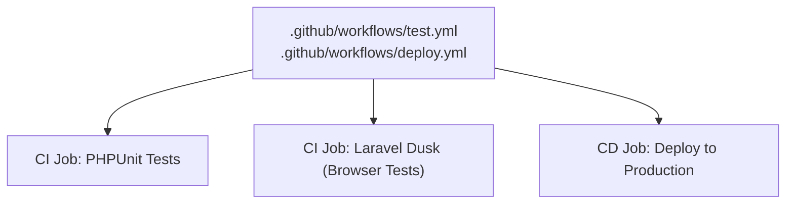
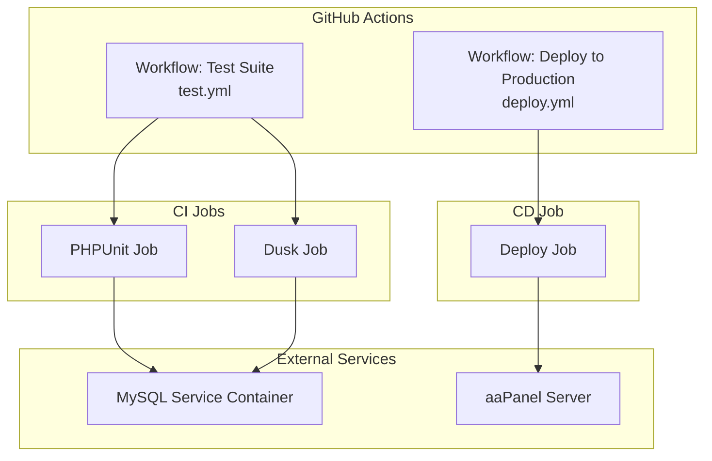
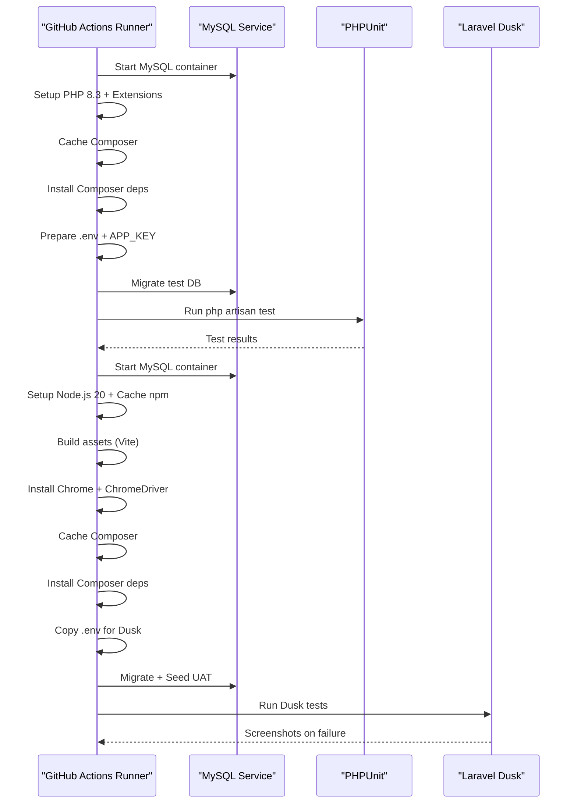
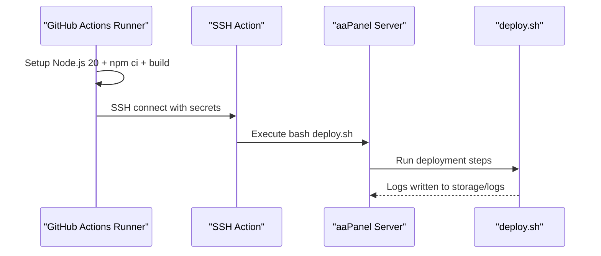
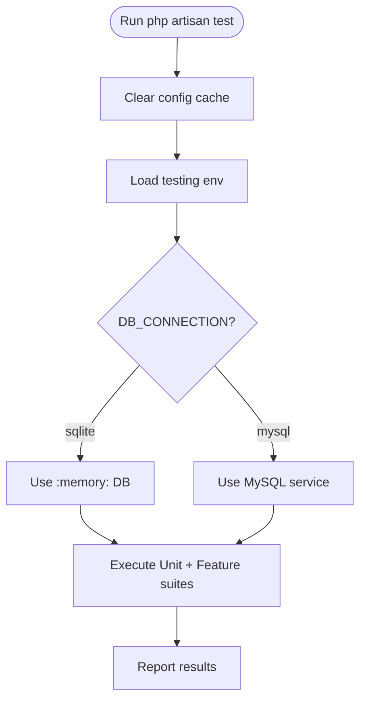
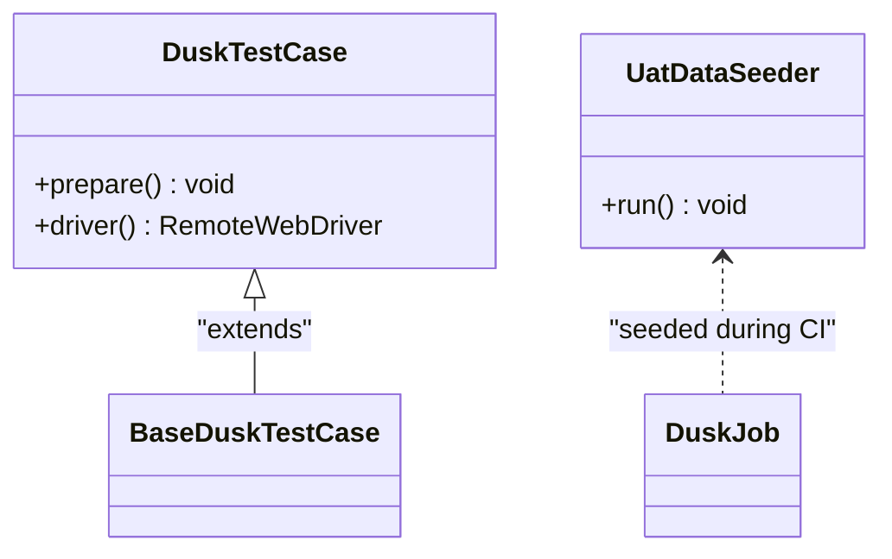
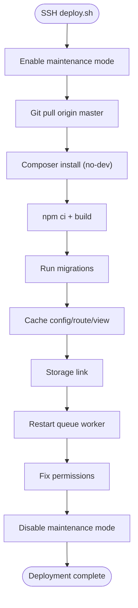
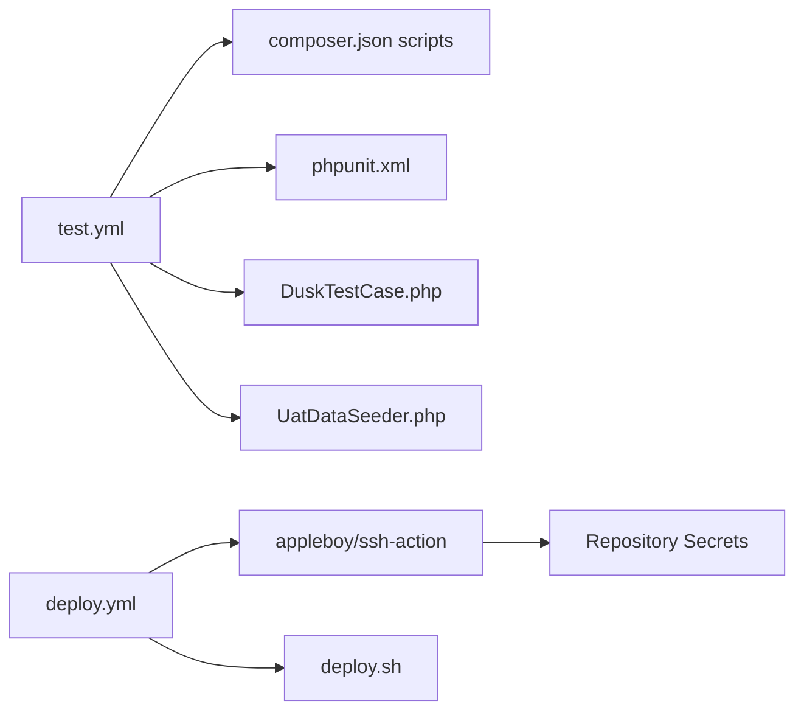

# CI/CD Pipeline

<cite>
**Referenced Files in This Document**
- [test.yml](file://.github/workflows/test.yml)
- [deploy.yml](file://.github/workflows/deploy.yml)
- [composer.json](file://composer.json)
- [phpunit.xml](file://phpunit.xml)
- [package.json](file://package.json)
- [DuskTestCase.php](file://tests/DuskTestCase.php)
- [UatDataSeeder.php](file://database/seeders/UatDataSeeder.php)
- [deploy.sh](file://deploy.sh)
</cite>

## Table of Contents
1. [Introduction](#introduction)
2. [Project Structure](#project-structure)
3. [Core Components](#core-components)
4. [Architecture Overview](#architecture-overview)
5. [Detailed Component Analysis](#detailed-component-analysis)
6. [Dependency Analysis](#dependency-analysis)
7. [Performance Considerations](#performance-considerations)
8. [Troubleshooting Guide](#troubleshooting-guide)
9. [Conclusion](#conclusion)
10. [Appendices](#appendices)

## Introduction
This document describes the CI/CD pipeline for RaporKM Laravel, focusing on automated testing and deployment workflows. It explains the GitHub Actions configuration for continuous integration and continuous deployment, details the automated testing pipeline (unit, feature, and browser tests), deployment triggers and environment handling, artifact management, and deployment notifications. It also covers customization options, environment-specific configurations, and manual approval workflows. Guidance for troubleshooting, failure analysis, and recovery is included.

## Project Structure
The CI/CD configuration is primarily defined in GitHub Actions workflow files under the repository’s .github/workflows directory. Supporting configuration includes Composer scripts for local and CI environments, PHPUnit configuration, Node/NPM scripts for asset builds, Laravel Dusk base test configuration, a UAT data seeder for browser tests, and a server-side deployment script executed via SSH.

**Diagram sources**
- [test.yml:1-169](file://.github/workflows/test.yml#L1-L169)
- [deploy.yml:1-40](file://.github/workflows/deploy.yml#L1-L40)

**Section sources**
- [.github/workflows/test.yml:1-169](file://.github/workflows/test.yml#L1-L169)
- [.github/workflows/deploy.yml:1-40](file://.github/workflows/deploy.yml#L1-L40)

## Core Components
- Continuous Integration (CI):
  - PHPUnit tests against a MySQL service container.
  - Laravel Dusk browser tests with Chrome/ChromeDriver, seeded with UAT data.
- Continuous Deployment (CD):
  - Automated deployment to an aaPanel server via SSH triggered on pushes to master or manual dispatch.
- Local/CI Scripts:
  - Composer scripts for setup, development, and test execution.
  - NPM scripts for Vite asset builds.
- Configuration:
  - PHPUnit configuration for test suites and environment overrides.
  - Laravel Dusk base test class for browser automation setup.
  - UAT data seeder for realistic browser test fixtures.
  - Server-side deployment script orchestrating maintenance mode, dependency installation, migrations, caching, and permissions.

**Section sources**
- [composer.json:47-81](file://composer.json#L47-L81)
- [package.json:5-8](file://package.json#L5-L8)
- [phpunit.xml:7-35](file://phpunit.xml#L7-L35)
- [DuskTestCase.php:12-48](file://tests/DuskTestCase.php#L12-L48)
- [UatDataSeeder.php:29-261](file://database/seeders/UatDataSeeder.php#L29-L261)
- [deploy.sh:1-60](file://deploy.sh#L1-L60)

## Architecture Overview
The CI/CD architecture comprises two primary workflows:
- Test workflow: Runs on push and pull_request to master/main, executing unit/feature tests and browser tests.
- Deploy workflow: Runs on push to master or manual dispatch, building assets and deploying via SSH to a production server.

**Diagram sources**
- [test.yml:9-74](file://.github/workflows/test.yml#L9-L74)
- [test.yml:75-169](file://.github/workflows/test.yml#L75-L169)
- [deploy.yml:8-40](file://.github/workflows/deploy.yml#L8-L40)

## Detailed Component Analysis

### Test Workflow (.github/workflows/test.yml)
- Triggers:
  - push to master/main
  - pull_request to master/main
- Jobs:
  - PHPUnit Tests:
    - Uses Ubuntu runner and a MySQL service container.
    - Sets up PHP 8.3 with required extensions.
    - Caches Composer dependencies.
    - Installs dependencies via Composer.
    - Prepares environment (key generation).
    - Runs migrations against the test database.
    - Executes the full test suite.
  - Laravel Dusk (Browser Tests):
    - Conditional execution on push events.
    - Uses Ubuntu runner and a MySQL service container.
    - Sets up Node.js 20 and caches npm dependencies.
    - Builds assets with Vite.
    - Installs Chrome and ChromeDriver for Dusk.
    - Caches Composer dependencies.
    - Installs dependencies via Composer.
    - Copies .env for Dusk and seeds UAT data.
    - Runs Dusk tests with TTY disabled.
    - On failure, uploads screenshots as artifacts.

**Diagram sources**
- [test.yml:9-74](file://.github/workflows/test.yml#L9-L74)
- [test.yml:75-169](file://.github/workflows/test.yml#L75-L169)

**Section sources**
- [.github/workflows/test.yml:1-169](file://.github/workflows/test.yml#L1-L169)

### Deploy Workflow (.github/workflows/deploy.yml)
- Triggers:
  - push to master
  - workflow_dispatch (manual)
- Conditions:
  - Only executes on refs/heads/master.
- Steps:
  - Checks out code.
  - Sets up Node.js 20 and caches npm.
  - Installs npm dependencies.
  - Builds frontend assets.
  - Deploys via SSH to aaPanel server using repository secrets for connection details.
  - Executes deploy.sh on the target server.

**Diagram sources**
- [deploy.yml:8-40](file://.github/workflows/deploy.yml#L8-L40)
- [deploy.sh:1-60](file://deploy.sh#L1-L60)

**Section sources**
- [.github/workflows/deploy.yml:1-40](file://.github/workflows/deploy.yml#L1-L40)
- [deploy.sh:1-60](file://deploy.sh#L1-L60)

### Testing Configuration and Execution

#### PHPUnit Suite
- Test Suites:
  - Unit tests under tests/Unit.
  - Feature tests under tests/Feature.
- Environment Overrides:
  - APP_ENV set to testing.
  - CACHE, QUEUE, MAIL, SESSION drivers configured for tests.
  - SQLite in-memory database for default test DB.
- Coverage:
  - Not enabled in CI configuration.

**Diagram sources**
- [phpunit.xml:7-35](file://phpunit.xml#L7-L35)
- [composer.json:60-63](file://composer.json#L60-L63)

**Section sources**
- [phpunit.xml:1-37](file://phpunit.xml#L1-L37)
- [composer.json:47-81](file://composer.json#L47-L81)

#### Laravel Dusk (Browser Tests)
- Base Setup:
  - Extends Dusk base class to configure Chrome options and headless behavior.
  - Supports maximized window or headless new mode depending on environment.
- CI Execution:
  - Installs Chrome and ChromeDriver.
  - Seeds UAT data for realistic browser scenarios.
  - Runs Dusk tests with TTY disabled.
  - Uploads screenshots on failure for debugging.

**Diagram sources**
- [DuskTestCase.php:12-48](file://tests/DuskTestCase.php#L12-L48)
- [UatDataSeeder.php:29-261](file://database/seeders/UatDataSeeder.php#L29-L261)

**Section sources**
- [DuskTestCase.php:1-49](file://tests/DuskTestCase.php#L1-L49)
- [UatDataSeeder.php:1-262](file://database/seeders/UatDataSeeder.php#L1-L262)
- [.github/workflows/test.yml:118-169](file://.github/workflows/test.yml#L118-L169)

### Deployment Script (Server-side)
The deploy.sh script orchestrates production deployments:
- Enables maintenance mode.
- Pulls latest code from origin master.
- Installs PHP dependencies (no-dev, optimized autoloader).
- Installs Node dependencies and builds assets.
- Runs database migrations.
- Caches configuration, routes, and views.
- Creates storage symlink.
- Restarts queue worker service.
- Fixes ownership and permissions.
- Disables maintenance mode.

**Diagram sources**
- [deploy.sh:1-60](file://deploy.sh#L1-L60)

**Section sources**
- [deploy.sh:1-60](file://deploy.sh#L1-L60)

## Dependency Analysis
- Workflow-to-Toolchain:
  - test.yml depends on GitHub-hosted runners, Docker service containers (MySQL), Composer, Artisan CLI, and Laravel Dusk.
  - deploy.yml depends on GitHub-hosted runners, Node.js, SSH action, and aaPanel server availability.
- Internal Dependencies:
  - Composer scripts define standardized commands for setup, dev, and test execution.
  - NPM scripts define asset build and dev commands.
  - PHPUnit configuration defines test suites and environment overrides.
  - Dusk base class centralizes browser driver configuration.
  - UAT seeder provides deterministic fixtures for browser tests.
- Secrets and Environment:
  - deploy.yml consumes SSH_HOST, SSH_USERNAME, SSH_PORT, SSH_PRIVATE_KEY, and DEPLOY_PATH from repository secrets.
  - test.yml uses MySQL service credentials and Dusk-specific environment for browser tests.

**Diagram sources**
- [test.yml:1-169](file://.github/workflows/test.yml#L1-L169)
- [deploy.yml:1-40](file://.github/workflows/deploy.yml#L1-L40)
- [composer.json:47-81](file://composer.json#L47-L81)
- [phpunit.xml:1-37](file://phpunit.xml#L1-L37)
- [DuskTestCase.php:1-49](file://tests/DuskTestCase.php#L1-L49)
- [UatDataSeeder.php:1-262](file://database/seeders/UatDataSeeder.php#L1-L262)
- [deploy.sh:1-60](file://deploy.sh#L1-L60)

**Section sources**
- [.github/workflows/test.yml:1-169](file://.github/workflows/test.yml#L1-L169)
- [.github/workflows/deploy.yml:1-40](file://.github/workflows/deploy.yml#L1-L40)
- [composer.json:47-81](file://composer.json#L47-L81)
- [phpunit.xml:1-37](file://phpunit.xml#L1-L37)
- [DuskTestCase.php:1-49](file://tests/DuskTestCase.php#L1-L49)
- [UatDataSeeder.php:1-262](file://database/seeders/UatDataSeeder.php#L1-L262)
- [deploy.sh:1-60](file://deploy.sh#L1-L60)

## Performance Considerations
- Dependency Caching:
  - Composer cache is keyed on composer.lock to speed up installs.
  - npm cache is enabled for Node dependencies.
- Parallelism:
  - Jobs run independently; consider splitting large test suites to reduce runtime.
- Asset Builds:
  - Vite build is executed in CI; ensure only necessary assets are built for tests.
- Database Efficiency:
  - MySQL service health checks ensure readiness before migrations.
  - Using separate databases for tests (raporkm_test, raporkm_dusk) avoids cross-contamination.

[No sources needed since this section provides general guidance]

## Troubleshooting Guide
- PHPUnit Failures:
  - Verify environment variables in phpunit.xml and ensure migrations succeed.
  - Confirm APP_KEY generation during CI preparation.
- Dusk Failures:
  - Check Chrome/ChromeDriver versions and compatibility.
  - Review uploaded screenshots from failed Dusk runs.
  - Validate UAT seeder data and database connectivity.
- Deployment Failures:
  - Inspect deploy.log on the server for detailed errors.
  - Confirm SSH secrets and DEPLOY_PATH are correct.
  - Ensure aaPanel server is reachable and deploy.sh has execution permissions.
- General Tips:
  - Re-run jobs with fresh caches if dependency issues occur.
  - Temporarily disable headless mode locally to inspect browser behavior.

**Section sources**
- [.github/workflows/test.yml:162-169](file://.github/workflows/test.yml#L162-L169)
- [deploy.sh:8-59](file://deploy.sh#L8-L59)

## Conclusion
The CI/CD pipeline for RaporKM Laravel integrates robust automated testing (unit/feature and browser) with a streamlined deployment process to production. The workflows are designed to be reliable, artifact-aware, and configurable for future enhancements such as quality gates, security scanning, and environment-specific overrides.

[No sources needed since this section summarizes without analyzing specific files]

## Appendices

### Pipeline Customization Options
- Environment-Specific Configurations:
  - Use separate .env files per environment (e.g., .env.ci, .env.dusk.local) and copy accordingly in CI.
  - Override database connections per job to isolate test data.
- Manual Approval Workflows:
  - Add a review stage before the deploy job using GitHub Environments and required reviewers.
- Quality Gates and Security Scanning:
  - Integrate code quality tools (e.g., PHPStan, Psalm) and static analysis in the test job.
  - Add security scanning (e.g., GitHub Security Alerts, Dependabot) and SAST tools in CI.
- Notifications:
  - Add Slack or Teams notifications after job completion using GitHub Actions.

[No sources needed since this section provides general guidance]

### Examples of Pipeline Configurations
- Custom Job Implementation:
  - Add a linting job before tests to enforce code standards.
  - Add a dedicated job for exporting test results and coverage reports.
- Integration with External Services:
  - Use encrypted secrets for database credentials and third-party tokens.
  - Store artifacts (screenshots, logs) with retention policies.

[No sources needed since this section provides general guidance]