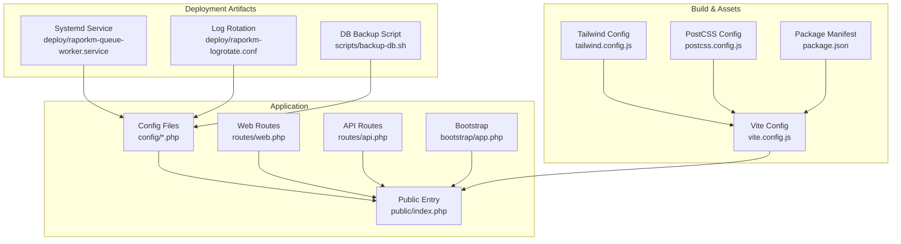
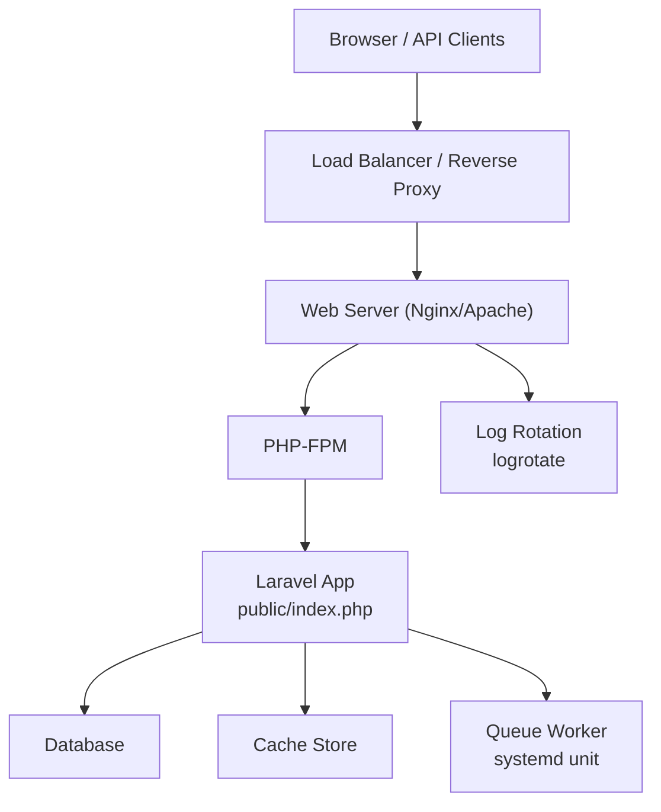
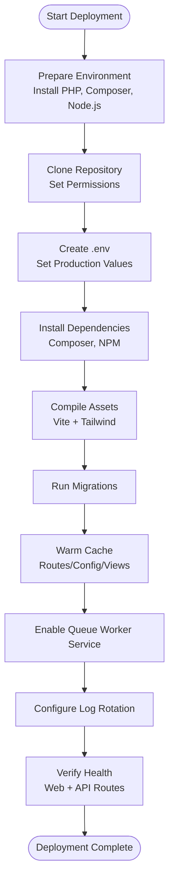
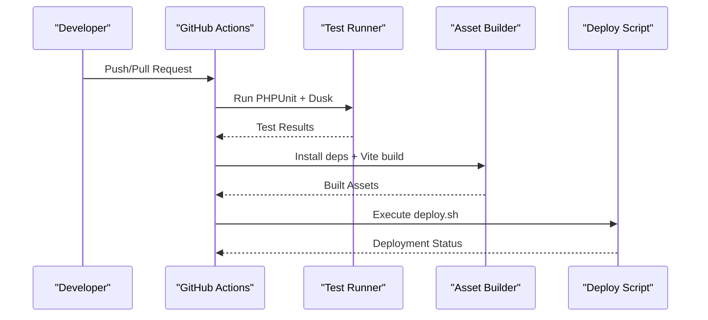
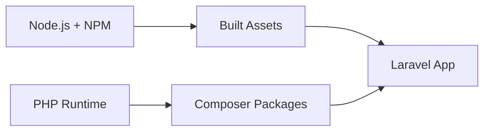

# Deployment & DevOps

<cite>
**Referenced Files in This Document**
- [DEPLOY.md](file://DEPLOY.md)
- [deploy.sh](file://deploy.sh)
- [raporkm-queue-worker.service](file://deploy/raporkm-queue-worker.service)
- [raporkm-logrotate.conf](file://deploy/raporkm-logrotate.conf)
- [backup-db.sh](file://scripts/backup-db.sh)
- [app.php](file://config/app.php)
- [database.php](file://config/database.php)
- [logging.php](file://config/logging.php)
- [queue.php](file://config/queue.php)
- [sanctum.php](file://config/sanctum.php)
- [session.php](file://config/session.php)
- [cache.php](file://config/cache.php)
- [mail.php](file://config/mail.php)
- [services.php](file://config/services.php)
- [livewire.php](file://config/livewire.php)
- [dompdf.php](file://config/dompdf.php)
- [activitylog.php](file://config/activitylog.php)
- [e-rapor.php](file://config/e-rapor.php)
- [routes/web.php](file://routes/web.php)
- [routes/api.php](file://routes/api.php)
- [public/index.php](file://public/index.php)
- [bootstrap/app.php](file://bootstrap/app.php)
- [composer.json](file://composer.json)
- [package.json](file://package.json)
- [vite.config.js](file://vite.config.js)
- [tailwind.config.js](file://tailwind.config.js)
- [postcss.config.js](file://postcss.config.js)
- [phpunit.xml](file://phpunit.xml)
- [phpunit.dusk.xml](file://phpunit.dusk.xml)
- [.gitignore](file://.gitignore)
- [README.md](file://README.md)
</cite>

## Table of Contents
1. [Introduction](#introduction)
2. [Project Structure](#project-structure)
3. [Core Components](#core-components)
4. [Architecture Overview](#architecture-overview)
5. [Detailed Component Analysis](#detailed-component-analysis)
6. [Dependency Analysis](#dependency-analysis)
7. [Performance Considerations](#performance-considerations)
8. [Troubleshooting Guide](#troubleshooting-guide)
9. [Conclusion](#conclusion)
10. [Appendices](#appendices)

## Introduction
This document provides comprehensive deployment and DevOps guidance for RaporKM Laravel. It covers environment configuration, production deployment, CI/CD pipeline, monitoring and logging, backup and recovery, scaling, security hardening, and operational runbooks. The content is derived from the repository’s configuration files, deployment artifacts, and documentation.

## Project Structure
RaporKM is a Laravel application with a modular structure supporting web and API endpoints, Livewire components, extensive database models, and a build pipeline for frontend assets. Key directories and files relevant to deployment and DevOps include:
- Configuration under config/
- Production deployment assets under deploy/
- Backup script under scripts/
- Frontend build configuration under vite.config.js, tailwind.config.js, postcss.config.js
- Testing configuration under phpunit.xml and phpunit.dusk.xml
- Application entry points under public/index.php and bootstrap/app.php

**Diagram sources**
- [app.php](file://config/app.php)
- [database.php](file://config/database.php)
- [logging.php](file://config/logging.php)
- [queue.php](file://config/queue.php)
- [routes/web.php](file://routes/web.php)
- [routes/api.php](file://routes/api.php)
- [public/index.php](file://public/index.php)
- [bootstrap/app.php](file://bootstrap/app.php)
- [vite.config.js](file://vite.config.js)
- [tailwind.config.js](file://tailwind.config.js)
- [postcss.config.js](file://postcss.config.js)
- [raporkm-queue-worker.service](file://deploy/raporkm-queue-worker.service)
- [raporkm-logrotate.conf](file://deploy/raporkm-logrotate.conf)
- [backup-db.sh](file://scripts/backup-db.sh)

**Section sources**
- [README.md](file://README.md)
- [composer.json](file://composer.json)
- [package.json](file://package.json)

## Core Components
- Configuration Management: Centralized via config/*.php, including application, database, logging, queue, cache, session, Sanctum, Livewire, DomPDF, activity log, and e-rapor settings.
- Routing: Web and API routes define entry points for HTTP requests.
- Bootstrap: Initializes the application kernel and service providers.
- Build Pipeline: Vite, Tailwind, and PostCSS manage frontend assets.
- Deployment Artifacts: Systemd service for queue workers and log rotation configuration.
- Backup: Database backup script for automated backups.

**Section sources**
- [app.php](file://config/app.php)
- [database.php](file://config/database.php)
- [logging.php](file://config/logging.php)
- [queue.php](file://config/queue.php)
- [routes/web.php](file://routes/web.php)
- [routes/api.php](file://routes/api.php)
- [bootstrap/app.php](file://bootstrap/app.php)
- [vite.config.js](file://vite.config.js)
- [tailwind.config.js](file://tailwind.config.js)
- [postcss.config.js](file://postcss.config.js)
- [raporkm-queue-worker.service](file://deploy/raporkm-queue-worker.service)
- [raporkm-logrotate.conf](file://deploy/raporkm-logrotate.conf)
- [backup-db.sh](file://scripts/backup-db.sh)

## Architecture Overview
The production runtime comprises:
- Web server (Nginx/Apache) serving public/index.php
- PHP-FPM running the Laravel application
- Queue worker service managed by systemd
- Database (MySQL/PostgreSQL) configured in config/database.php
- Log rotation and centralized logging
- Optional reverse proxy and load balancer for scaling

**Diagram sources**
- [public/index.php](file://public/index.php)
- [bootstrap/app.php](file://bootstrap/app.php)
- [database.php](file://config/database.php)
- [queue.php](file://config/queue.php)
- [raporkm-queue-worker.service](file://deploy/raporkm-queue-worker.service)
- [raporkm-logrotate.conf](file://deploy/raporkm-logrotate.conf)

## Detailed Component Analysis

### Environment Configuration
Production environment variables and settings are primarily configured in config/*.php and controlled via environment files (.env). Key areas:
- Application identity, debug mode, URL base, timezone, locale
- Database connections (default, MySQL/PostgreSQL)
- Logging channels and handlers
- Queue drivers and connection settings
- Cache stores
- Session configuration
- Sanctum tokens and API authentication
- Livewire behavior
- DomPDF rendering
- Activity logging
- E-rapor module settings

Operational guidance:
- Set APP_ENV=production and APP_DEBUG=false in production.
- Configure database credentials and driver in DB_CONNECTION and related keys.
- Choose appropriate LOG_CHANNEL and configure external log destinations if needed.
- Select QUEUE_CONNECTION aligned with your broker (Redis/Database/Beanstalkd/etc.).
- Set SESSION_DRIVER and related keys for distributed sessions if behind multiple nodes.
- Configure Sanctum for SPA/API token management.
- Adjust Livewire and DomPDF settings for production performance and security.

**Section sources**
- [app.php](file://config/app.php)
- [database.php](file://config/database.php)
- [logging.php](file://config/logging.php)
- [queue.php](file://config/queue.php)
- [cache.php](file://config/cache.php)
- [session.php](file://config/session.php)
- [sanctum.php](file://config/sanctum.php)
- [livewire.php](file://config/livewire.php)
- [dompdf.php](file://config/dompdf.php)
- [activitylog.php](file://config/activitylog.php)
- [e-rapor.php](file://config/e-rapor.php)

### Production Deployment
Deployment artifacts and scripts:
- deploy.sh: Orchestrates deployment steps such as environment preparation, dependency installation, asset compilation, database migrations, and cache warmup.
- raporkm-queue-worker.service: Systemd unit to run Laravel queue workers persistently.
- raporkm-logrotate.conf: Log rotation policy for application logs.
- backup-db.sh: Automated database backup script.

Deployment checklist:
- Prepare target server with PHP runtime, Composer, Node.js, and a web server.
- Clone repository and set ownership to web server user.
- Copy .env.example to .env and fill production values.
- Run deploy.sh to execute deployment tasks.
- Enable and start raporkm-queue-worker.service.
- Configure logrotate with raporkm-logrotate.conf.
- Verify application health via web and API routes.

**Diagram sources**
- [deploy.sh](file://deploy.sh)
- [raporkm-queue-worker.service](file://deploy/raporkm-queue-worker.service)
- [raporkm-logrotate.conf](file://deploy/raporkm-logrotate.conf)
- [routes/web.php](file://routes/web.php)
- [routes/api.php](file://routes/api.php)

**Section sources**
- [DEPLOY.md](file://DEPLOY.md)
- [deploy.sh](file://deploy.sh)
- [raporkm-queue-worker.service](file://deploy/raporkm-queue-worker.service)
- [raporkm-logrotate.conf](file://deploy/raporkm-logrotate.conf)

### CI/CD Pipeline
The repository includes GitHub Actions workflows for testing and deployment. Typical pipeline stages:
- Checkout code
- Setup PHP and extensions
- Install Composer dependencies
- Install NPM dependencies
- Build assets with Vite
- Run PHPUnit and Dusk tests
- Deploy to staging or production using deploy.sh

Recommended workflow:
- Separate workflows for test.yml and deploy.yml.
- Use matrix builds for multiple PHP versions.
- Cache Composer and NPM dependencies.
- Store secrets in GitHub Secrets for database credentials, deployment keys, and environment variables.
- Use encrypted .env for local development and keep production .env out of version control.

**Diagram sources**
- [test.yml](file://.github/workflows/test.yml)
- [deploy.yml](file://.github/workflows/deploy.yml)

**Section sources**
- [.github/workflows/test.yml](file://.github/workflows/test.yml)
- [.github/workflows/deploy.yml](file://.github/workflows/deploy.yml)

### Monitoring and Logging
Logging configuration:
- Channels and handlers defined in config/logging.php
- Consider syslog, cloud logging integrations, or file-based rotation
- Centralize logs for analysis and alerting

Monitoring recommendations:
- Metrics: Application response times, throughput, error rates, queue backlog, database metrics
- Dashboards: Grafana/Prometheus or cloud-native solutions
- Alerting: Threshold-based alerts for errors, latency, disk, and memory
- Health checks: Expose readiness/liveness endpoints

**Section sources**
- [logging.php](file://config/logging.php)
- [raporkm-logrotate.conf](file://deploy/raporkm-logrotate.conf)

### Backup and Recovery
Backup strategy:
- Schedule automated backups using scripts/backup-db.sh
- Store backups offsite or in cloud storage
- Test restoration procedures regularly
- Include application code snapshots if needed

Recovery procedure:
- Restore database from latest backup
- Re-run migrations if schema changed
- Clear caches and restart services
- Validate application functionality

**Section sources**
- [backup-db.sh](file://scripts/backup-db.sh)

### Scaling, Load Balancing, and High Availability
- Stateless application: Keep sessions and cache externalized
- Horizontal scaling: Add web servers behind a load balancer
- Queue scaling: Increase queue workers or use distributed queues
- Database: Use read replicas and failover mechanisms
- CDN: Serve static assets via CDN
- Auto-healing: Health checks and auto-restart for queue worker service

**Section sources**
- [session.php](file://config/session.php)
- [cache.php](file://config/cache.php)
- [queue.php](file://config/queue.php)
- [database.php](file://config/database.php)
- [raporkm-queue-worker.service](file://deploy/raporkm-queue-worker.service)

### Security Hardening
- TLS/SSL: Enforce HTTPS with strong ciphers and modern protocols
- Network security: Restrict inbound ports, firewall rules, and internal network segmentation
- Secrets management: Store sensitive data in environment variables/secrets manager
- Authentication: Use Sanctum tokens, enforce CSRF protection, secure session cookies
- Input validation and sanitization: Apply strict validation and escaping
- Dependency hygiene: Regularly update dependencies and monitor advisories
- Least privilege: Run services with minimal required permissions

**Section sources**
- [sanctum.php](file://config/sanctum.php)
- [session.php](file://config/session.php)
- [app.php](file://config/app.php)

### Deployment Checklists
- Pre-deployment
  - Review .env values and secrets
  - Confirm database connectivity and credentials
  - Verify queue broker accessibility
- During deployment
  - Run deploy.sh and confirm exit status
  - Restart services if needed
- Post-deployment
  - Validate web and API routes
  - Check queue worker status
  - Inspect logs and metrics

**Section sources**
- [DEPLOY.md](file://DEPLOY.md)
- [deploy.sh](file://deploy.sh)
- [raporkm-queue-worker.service](file://deploy/raporkm-queue-worker.service)

### Troubleshooting Guide
Common issues and resolutions:
- Composer install failures: Clear cache, retry with --no-cache, verify PHP extensions
- NPM/Vite build errors: Check Node.js version, reinstall dependencies, rebuild assets
- Database connection errors: Verify DB credentials and network access
- Queue worker not processing jobs: Check service status, logs, and queue connection
- Permission errors: Fix storage and bootstrap cache permissions
- 500 errors: Enable production logging, inspect recent changes, rollback if necessary

**Section sources**
- [logging.php](file://config/logging.php)
- [queue.php](file://config/queue.php)
- [database.php](file://config/database.php)

### Maintenance Procedures
- Routine tasks: Update dependencies, apply migrations, rotate logs, prune old backups
- Performance tuning: Monitor slow queries, optimize cache usage, review queue backlogs
- Security updates: Patch PHP, Laravel, and third-party packages; rotate secrets

**Section sources**
- [composer.json](file://composer.json)
- [package.json](file://package.json)
- [raporkm-logrotate.conf](file://deploy/raporkm-logrotate.conf)

## Dependency Analysis
Key runtime dependencies and their roles:
- PHP runtime and extensions required by Laravel
- Database client libraries for configured driver
- Queue client libraries for selected driver
- Node.js ecosystem for asset building

**Diagram sources**
- [composer.json](file://composer.json)
- [package.json](file://package.json)
- [vite.config.js](file://vite.config.js)

**Section sources**
- [composer.json](file://composer.json)
- [package.json](file://package.json)

## Performance Considerations
- Optimize database queries and indexing
- Use Redis/Memcached for cache and sessions
- Enable OPcache and optimize PHP-FPM settings
- Minimize asset sizes and enable compression
- Use persistent connections for databases and queues
- Monitor and scale queue workers based on workload

[No sources needed since this section provides general guidance]

## Troubleshooting Guide
- Environment configuration issues: Validate config files and .env values
- Asset build failures: Check Node.js version and dependency versions
- Database connectivity: Verify credentials and network access
- Queue processing: Confirm service status and broker connectivity
- Logging and monitoring: Ensure log rotation and channel configuration

**Section sources**
- [app.php](file://config/app.php)
- [database.php](file://config/database.php)
- [logging.php](file://config/logging.php)
- [queue.php](file://config/queue.php)
- [raporkm-queue-worker.service](file://deploy/raporkm-queue-worker.service)

## Conclusion
This guide consolidates deployment and DevOps practices for RaporKM Laravel, grounded in the repository’s configuration and artifacts. By following the outlined procedures—environment setup, deployment automation, CI/CD workflows, monitoring, backups, scaling, and security—you can operate a reliable, secure, and scalable production environment.

[No sources needed since this section summarizes without analyzing specific files]

## Appendices
- Operational runbooks: Define step-by-step procedures for incident response, change management, and emergency recovery
- Monitoring dashboards: Track application health, infrastructure metrics, and business KPIs
- Change management: Document approval workflows and rollback procedures

[No sources needed since this section provides general guidance]