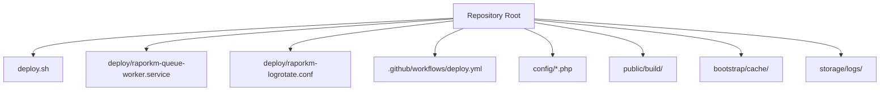
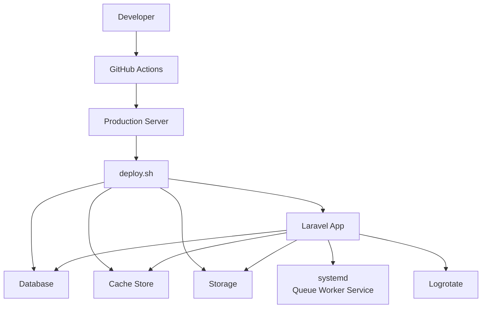
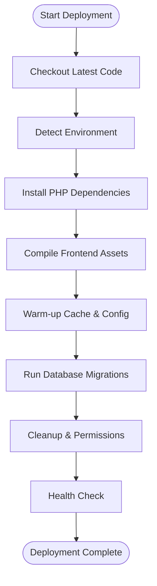
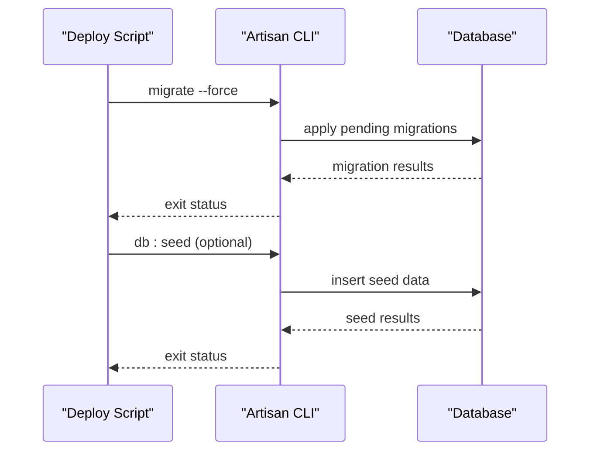
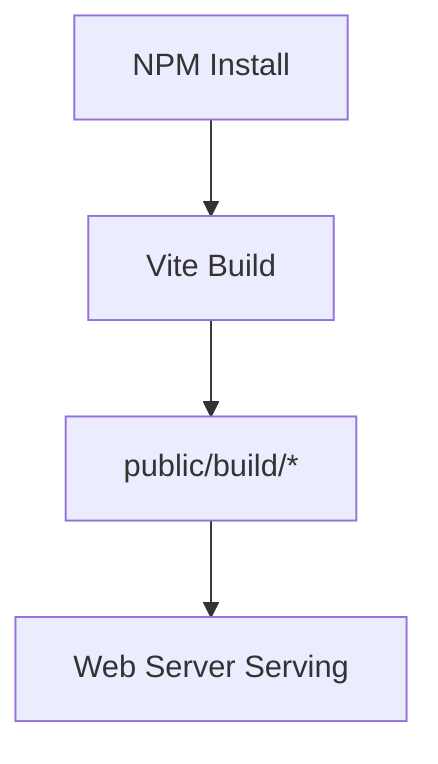
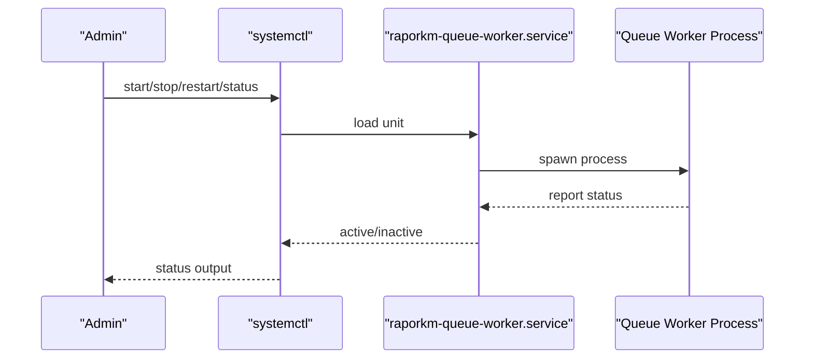
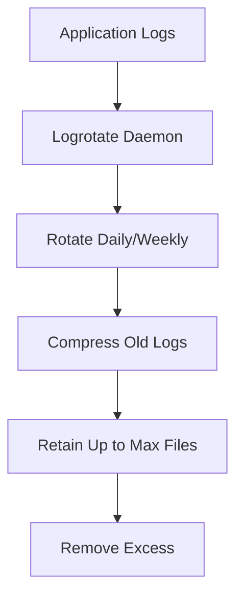
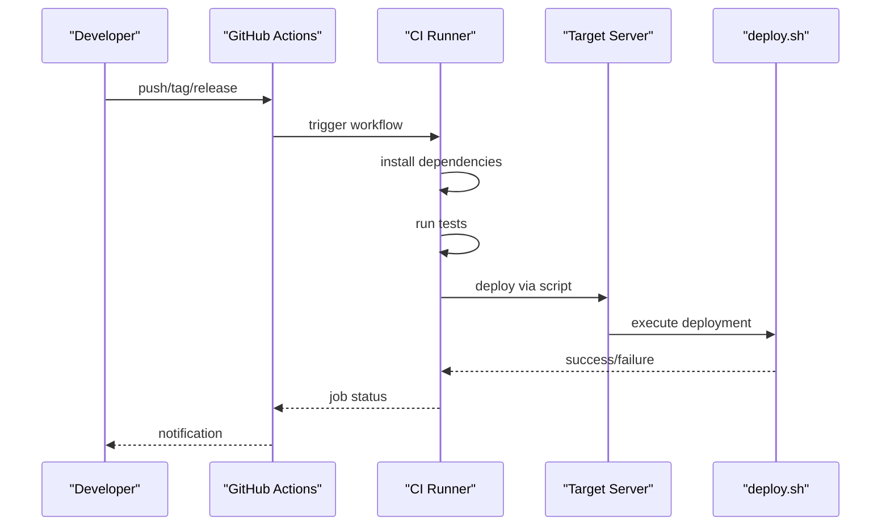
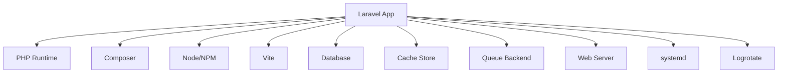

# Deployment Process

<cite>
**Referenced Files in This Document**
- [deploy.sh](file://deploy.sh)
- [raporkm-queue-worker.service](file://deploy/raporkm-queue-worker.service)
- [raporkm-logrotate.conf](file://deploy/raporkm-logrotate.conf)
- [.github/workflows/deploy.yml](file://.github/workflows/deploy.yml)
- [composer.json](file://composer.json)
- [package.json](file://package.json)
- [vite.config.js](file://vite.config.js)
- [config/app.php](file://config/app.php)
- [config/database.php](file://config/database.php)
- [config/queue.php](file://config/queue.php)
- [config/logging.php](file://config/logging.php)
- [config/cache.php](file://config/cache.php)
- [config/sanctum.php](file://config/sanctum.php)
- [config/session.php](file://config/session.php)
- [config/mail.php](file://config/mail.php)
- [config/services.php](file://config/services.php)
- [config/cache.php](file://config/cache.php)
- [storage/logs](file://storage/logs)
- [public/build](file://public/build)
- [bootstrap/cache](file://bootstrap/cache)
- [README.md](file://README.md)
- [DEPLOY.md](file://DEPLOY.md)
</cite>

## Table of Contents
1. [Introduction](#introduction)
2. [Project Structure](#project-structure)
3. [Core Components](#core-components)
4. [Architecture Overview](#architecture-overview)
5. [Detailed Component Analysis](#detailed-component-analysis)
6. [Dependency Analysis](#dependency-analysis)
7. [Performance Considerations](#performance-considerations)
8. [Troubleshooting Guide](#troubleshooting-guide)
9. [Conclusion](#conclusion)
10. [Appendices](#appendices)

## Introduction
This document provides a comprehensive deployment guide for RaporKM Laravel focused on production deployment procedures. It covers the complete deployment workflow including code checkout, dependency installation, database migrations, asset compilation, environment configuration, queue worker management via systemd, log rotation, monitoring, health checks, zero-downtime and blue-green strategies, validation, checklists, automation, manual procedures, emergency scenarios, and troubleshooting.

## Project Structure
RaporKM Laravel follows a standard Laravel application layout with deployment artifacts located under the deploy directory and a top-level deployment script. GitHub Actions workflow automates deployments. Key configuration files reside under config/, while assets are compiled into public/build. Caching and logs are stored under bootstrap/cache and storage/logs respectively.

**Diagram sources**
- [deploy.sh](file://deploy.sh)
- [raporkm-queue-worker.service](file://deploy/raporkm-queue-worker.service)
- [raporkm-logrotate.conf](file://deploy/raporkm-logrotate.conf)
- [deploy.yml](file://.github/workflows/deploy.yml)

**Section sources**
- [deploy.sh](file://deploy.sh)
- [raporkm-queue-worker.service](file://deploy/raporkm-queue-worker.service)
- [raporkm-logrotate.conf](file://deploy/raporkm-logrotate.conf)
- [deploy.yml](file://.github/workflows/deploy.yml)

## Core Components
- Deployment orchestration script: Centralizes deployment steps for repeatable, reliable production releases.
- Queue worker service: Manages background job processing via systemd.
- Log rotation: Ensures log files remain manageable and disk usage controlled.
- CI/CD pipeline: Automates build, test, and deployment stages.
- Configuration: Environment-specific settings for app, database, queue, logging, cache, sessions, mail, and services.
- Asset pipeline: Compiles frontend assets for production delivery.

**Section sources**
- [deploy.sh](file://deploy.sh)
- [raporkm-queue-worker.service](file://deploy/raporkm-queue-worker.service)
- [raporkm-logrotate.conf](file://deploy/raporkm-logrotate.conf)
- [deploy.yml](file://.github/workflows/deploy.yml)
- [config/app.php](file://config/app.php)
- [config/database.php](file://config/database.php)
- [config/queue.php](file://config/queue.php)
- [config/logging.php](file://config/logging.php)
- [config/cache.php](file://config/cache.php)
- [config/session.php](file://config/session.php)
- [config/mail.php](file://config/mail.php)
- [config/services.php](file://config/services.php)

## Architecture Overview
The deployment architecture integrates a deployment script with systemd-managed queue workers and log rotation. CI/CD automates release builds and deploys to target environments. Production readiness includes environment configuration, asset compilation, cache warm-up, database migrations, and health verification.

**Diagram sources**
- [deploy.sh](file://deploy.sh)
- [raporkm-queue-worker.service](file://deploy/raporkm-queue-worker.service)
- [raporkm-logrotate.conf](file://deploy/raporkm-logrotate.conf)
- [deploy.yml](file://.github/workflows/deploy.yml)

## Detailed Component Analysis

### Deployment Script Workflow
The deployment script orchestrates the following stages:
- Code checkout and update
- Environment detection and preparation
- Composer dependency installation
- NPM/Node-based asset compilation
- Laravel cache and configuration warm-up
- Database migrations and seeders
- Post-deployment cleanup and permissions
- Health verification

**Diagram sources**
- [deploy.sh](file://deploy.sh)

**Section sources**
- [deploy.sh](file://deploy.sh)

### Environment Switching and Configuration
Environment-specific configuration is managed via environment variables and Laravel config files. Critical areas include:
- Application settings: debug mode, maintenance mode, URL, timezone
- Database connections: host, port, database, username, password, charset, collation
- Queue configuration: default connection, Redis or database driver
- Logging: channels, daily rotation, max files retention
- Cache and sessions: stores, TTLs, lock timeouts
- Mail and third-party services: SMTP, mailers, API keys

Best practices:
- Use .env per environment with strict permission controls
- Keep secrets out of version control
- Validate critical config keys during deployment
- Use config caching in production

**Section sources**
- [config/app.php](file://config/app.php)
- [config/database.php](file://config/database.php)
- [config/queue.php](file://config/queue.php)
- [config/logging.php](file://config/logging.php)
- [config/cache.php](file://config/cache.php)
- [config/session.php](file://config/session.php)
- [config/mail.php](file://config/mail.php)
- [config/services.php](file://config/services.php)

### Database Migrations and Seeders
- Run pending migrations to align schema with application state
- Seeders populate reference and demo data as needed
- Use backup prior to destructive changes
- Validate migration success and rollback plan availability

**Diagram sources**
- [deploy.sh](file://deploy.sh)

**Section sources**
- [deploy.sh](file://deploy.sh)

### Asset Compilation and Static Delivery
- Compile frontend assets using Node/NPM and Vite
- Output assets placed under public/build for production serving
- Ensure proper permissions and ownership for web server access

**Diagram sources**
- [package.json](file://package.json)
- [vite.config.js](file://vite.config.js)
- [public/build](file://public/build)

**Section sources**
- [package.json](file://package.json)
- [vite.config.js](file://vite.config.js)
- [public/build](file://public/build)

### Queue Worker Service Management (systemd)
Queue workers process background jobs. The systemd unit file defines service behavior, restart policies, and user/group execution. Manage with systemctl commands.

**Diagram sources**
- [raporkm-queue-worker.service](file://deploy/raporkm-queue-worker.service)

**Section sources**
- [raporkm-queue-worker.service](file://deploy/raporkm-queue-worker.service)

### Log Rotation Setup
Centralized log rotation ensures logs are rotated, compressed, and retained according to policy. Configure log channels to write to rotating files.

**Diagram sources**
- [raporkm-logrotate.conf](file://deploy/raporkm-logrotate.conf)
- [config/logging.php](file://config/logging.php)

**Section sources**
- [raporkm-logrotate.conf](file://deploy/raporkm-logrotate.conf)
- [config/logging.php](file://config/logging.php)

### CI/CD Automation (GitHub Actions)
Automated deployment pipeline includes linting, testing, building, and deploying to target environments. Ensure secrets and environment variables are configured securely.

**Diagram sources**
- [deploy.yml](file://.github/workflows/deploy.yml)
- [deploy.sh](file://deploy.sh)

**Section sources**
- [deploy.yml](file://.github/workflows/deploy.yml)
- [deploy.sh](file://deploy.sh)

### Monitoring and Health Checks
- Application health endpoint: expose a lightweight route returning service status
- Queue health: monitor worker processes and queue length
- Database connectivity: periodic ping and simple query
- Disk and memory: OS-level metrics and alerts
- Log monitoring: watch for error spikes and critical messages

Implementation approach:
- Add a dedicated health route returning JSON with status fields
- Integrate with monitoring stack (Prometheus, Grafana, or similar)
- Set up alerting thresholds for response times and error rates

**Section sources**
- [config/app.php](file://config/app.php)
- [config/logging.php](file://config/logging.php)

### Zero-Downtime and Blue-Green Strategies
Zero-downtime deployment:
- Use atomic symlink updates for static assets and runtime directories
- Keep old application version available until validation passes
- Graceful shutdown of workers before swapping

Blue-Green deployment:
- Maintain two identical environments (blue/green)
- Route traffic to inactive environment after successful deployment
- Rollback by switching traffic back to previous environment

Validation gates:
- Pre-deployment: automated tests, linting, and dry-run checks
- Post-deployment: health checks, smoke tests, and user acceptance tests

**Section sources**
- [deploy.sh](file://deploy.sh)
- [README.md](file://README.md)

### Deployment Validation Checklist
Pre-deployment:
- Verify environment variables and secrets
- Confirm database backups are current
- Review pending migrations and seeders
- Test asset compilation locally

Post-deployment:
- Access health endpoint and confirm OK
- Verify critical pages render without errors
- Confirm queue workers are active and processing jobs
- Check recent log entries for errors
- Validate database connectivity and basic queries

**Section sources**
- [deploy.sh](file://deploy.sh)
- [config/logging.php](file://config/logging.php)

### Emergency Deployment Procedures
- Hotfix branch deployment: minimal, tested change deployed quickly
- Immediate rollback: revert to last known good release
- Traffic diversion: switch to backup environment or disable problematic features
- Incident communication: notify stakeholders and provide ETA

**Section sources**
- [deploy.sh](file://deploy.sh)
- [scripts/backup-db.sh](file://scripts/backup-db.sh)

## Dependency Analysis
The deployment relies on external systems and services:
- PHP runtime and Composer for backend dependencies
- Node.js and NPM for frontend asset compilation
- Database for persistent state
- Cache store for performance
- Queue backend (Redis or database) for background jobs
- Web server for serving static and dynamic content
- Systemd for service lifecycle management
- Logrotate for log lifecycle management

**Diagram sources**
- [composer.json](file://composer.json)
- [package.json](file://package.json)
- [config/database.php](file://config/database.php)
- [config/cache.php](file://config/cache.php)
- [config/queue.php](file://config/queue.php)
- [raporkm-queue-worker.service](file://deploy/raporkm-queue-worker.service)
- [raporkm-logrotate.conf](file://deploy/raporkm-logrotate.conf)

**Section sources**
- [composer.json](file://composer.json)
- [package.json](file://package.json)
- [config/database.php](file://config/database.php)
- [config/cache.php](file://config/cache.php)
- [config/queue.php](file://config/queue.php)

## Performance Considerations
- Enable config and route caching in production
- Use OPcache and optimize PHP-FPM settings
- Leverage Redis or Memcached for cache and sessions
- Minimize asset sizes and enable compression
- Scale queue workers based on workload
- Monitor database query performance and add indexes as needed

[No sources needed since this section provides general guidance]

## Troubleshooting Guide
Common deployment failures and recovery:
- Composer install fails: clear cache, retry with verbose output, check PHP version compatibility
- Migration errors: review failing migration, restore from backup, re-run with fixes
- Asset build failures: verify Node version, reinstall dependencies, rebuild assets
- Permission denied: fix file/directory ownership and permissions for web server
- Queue workers not processing: check systemd service status, logs, and queue configuration
- Health check failing: inspect application logs, database connectivity, and cache availability

Recovery procedures:
- Use rollback to previous working release
- Restore database from latest backup
- Restart affected services (web server, queue workers, cache)
- Re-run deployment script after fixing underlying issue

**Section sources**
- [deploy.sh](file://deploy.sh)
- [config/logging.php](file://config/logging.php)
- [storage/logs](file://storage/logs)

## Conclusion
This guide outlines a robust, repeatable deployment process for RaporKM Laravel in production. By leveraging the deployment script, systemd-managed queue workers, log rotation, and CI/CD automation, teams can achieve reliable, observable, and recoverable deployments. Adhering to zero-downtime and blue-green strategies, maintaining strict validation gates, and following the troubleshooting procedures ensures smooth operations and rapid recovery from incidents.

[No sources needed since this section summarizes without analyzing specific files]

## Appendices

### Deployment Checklist Template
- Pre-deployment
  - [ ] Environment variables validated
  - [ ] Database backups verified
  - [ ] Pending migrations reviewed
  - [ ] Asset build tested locally
- Post-deployment
  - [ ] Health endpoint OK
  - [ ] Critical pages functional
  - [ ] Queue workers active
  - [ ] Logs free of errors
  - [ ] Database connectivity confirmed

### Emergency Procedures Reference
- Hotfix deployment steps
- Rollback to previous release
- Traffic diversion to backup environment
- Communication templates for stakeholders

**Section sources**
- [deploy.sh](file://deploy.sh)
- [scripts/backup-db.sh](file://scripts/backup-db.sh)