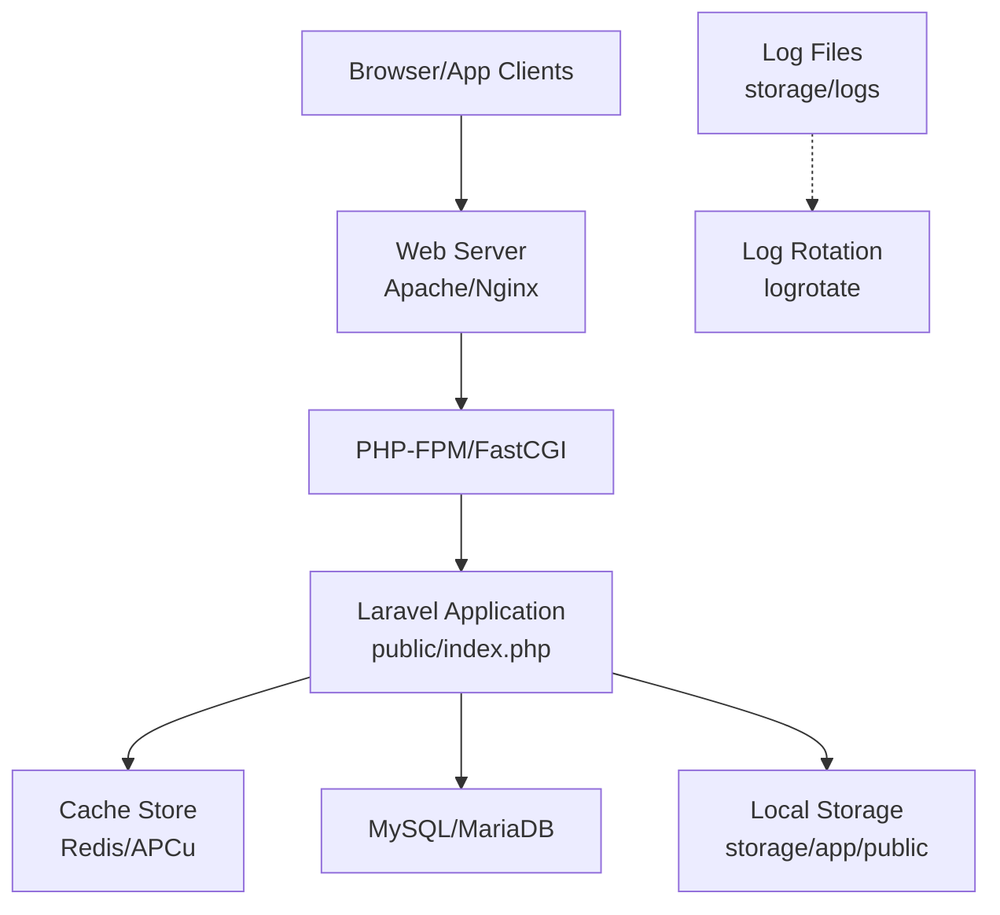
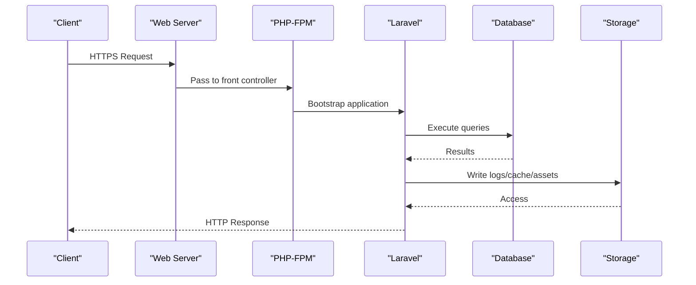
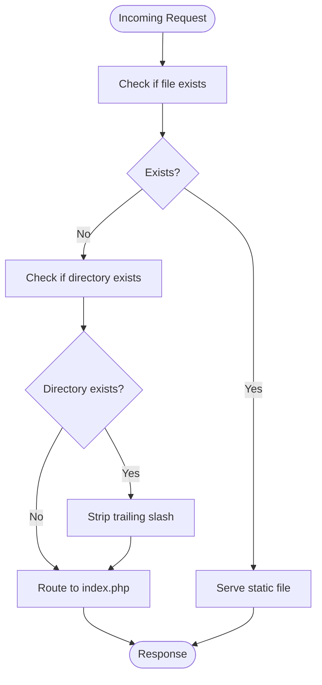
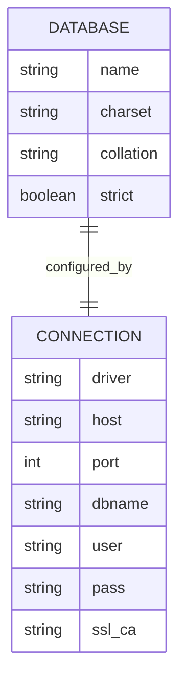
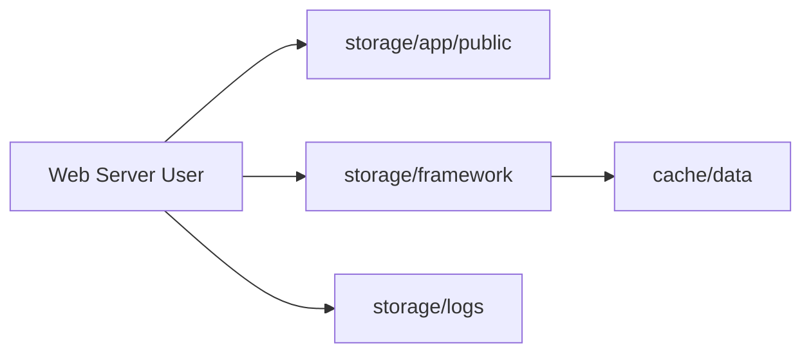
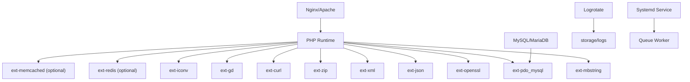

# Environment Setup

<cite>
**Referenced Files in This Document**
- [config/database.php](file://config/database.php)
- [config/app.php](file://config/app.php)
- [config/cache.php](file://config/cache.php)
- [config/filesystems.php](file://config/filesystems.php)
- [config/session.php](file://config/session.php)
- [config/logging.php](file://config/logging.php)
- [config/dompdf.php](file://config/dompdf.php)
- [public/.htaccess](file://public/.htaccess)
- [DEPLOY.md](file://DEPLOY.md)
- [deploy/raporkm-logrotate.conf](file://deploy/raporkm-logrotate.conf)
- [deploy/raporkm-queue-worker.service](file://deploy/raporkm-queue-worker.service)
- [scripts/backup-db.sh](file://scripts/backup-db.sh)
- [storage/framework/cache/data](file://storage/framework/cache/data)
- [storage/logs](file://storage/logs)
- [composer.lock](file://composer.lock)
</cite>

## Table of Contents
1. [Introduction](#introduction)
2. [Project Structure](#project-structure)
3. [Core Components](#core-components)
4. [Architecture Overview](#architecture-overview)
5. [Detailed Component Analysis](#detailed-component-analysis)
6. [Dependency Analysis](#dependency-analysis)
7. [Performance Considerations](#performance-considerations)
8. [Troubleshooting Guide](#troubleshooting-guide)
9. [Conclusion](#conclusion)
10. [Appendices](#appendices)

## Introduction
This document provides comprehensive environment setup guidance for deploying RaporKM Laravel in production. It covers server requirements, web server configuration (Apache/Nginx), SSL/TLS setup, database configuration for MySQL/MariaDB, environment variable management, file permissions, storage and cache configuration, security hardening, firewall and network settings, OS-specific installation steps, resource allocation, and troubleshooting.

## Project Structure
RaporKM is a Laravel application. Production deployment requires:
- Web server configured to serve the application via public/index.php
- PHP runtime with required extensions
- Database connectivity (MySQL/MariaDB recommended)
- Proper file permissions and writable storage directories
- Caching enabled for production
- Log rotation and queue worker service

**Diagram sources**
- [public/.htaccess:1-25](file://public/.htaccess#L1-L25)
- [config/cache.php](file://config/cache.php)
- [config/database.php:47-85](file://config/database.php#L47-L85)
- [config/filesystems.php](file://config/filesystems.php)
- [deploy/raporkm-logrotate.conf](file://deploy/raporkm-logrotate.conf)

**Section sources**
- [public/.htaccess:1-25](file://public/.htaccess#L1-L25)
- [config/app.php](file://config/app.php)
- [config/cache.php](file://config/cache.php)
- [config/filesystems.php](file://config/filesystems.php)
- [config/logging.php](file://config/logging.php)
- [config/database.php:47-85](file://config/database.php#L47-L85)

## Core Components
- Database configuration supports SQLite, MySQL, MariaDB, PostgreSQL, SQL Server, and a legacy MySQL connection. Production should use MySQL/MariaDB with utf8mb4 charset and proper collation.
- Cache configuration supports file, Redis, Memcached, Databases, and array drivers. Production typically uses Redis or file cache.
- Filesystems define local and public disk bindings for storing uploads and assets.
- Logging configuration controls log channels and file locations.
- Public directory .htaccess handles URL rewriting and security headers.
- Deployment guide includes Nginx configuration and SSL setup via Cloudflare.

**Section sources**
- [config/database.php:47-85](file://config/database.php#L47-L85)
- [config/cache.php](file://config/cache.php)
- [config/filesystems.php](file://config/filesystems.php)
- [config/logging.php](file://config/logging.php)
- [public/.htaccess:1-25](file://public/.htaccess#L1-L25)
- [DEPLOY.md:197-207](file://DEPLOY.md#L197-L207)

## Architecture Overview
The production stack routes client requests through the web server to PHP-FPM, which executes Laravel. Laravel interacts with the database and cache stores, writes logs and cached files to storage, and serves static assets from the public directory.

**Diagram sources**
- [public/.htaccess:1-25](file://public/.htaccess#L1-L25)
- [config/database.php:47-85](file://config/database.php#L47-L85)
- [config/logging.php](file://config/logging.php)
- [config/filesystems.php](file://config/filesystems.php)

## Detailed Component Analysis

### Server Requirements and PHP Extensions
- PHP version: The project indicates PHP 8.3 usage in deployment notes.
- Required extensions: Based on composer.lock, ensure the following are present:
  - ext-mbstring
  - ext-openssl
  - ext-pdo_mysql
  - ext-json
  - ext-xml
  - ext-zip
  - ext-curl
  - ext-gd
  - ext-iconv
  - ext-tokenizer
  - ext-ctype
  - ext-dom
  - ext-fileinfo
  - ext-filter
  - ext-hash
  - ext-session
  - ext-simplexml
  - ext-xmlreader
  - ext-xmlwriter
  - ext-sodium
  - ext-tokenizer
  - ext-ctype
  - ext-iconv
  - ext-mysqli
  - ext-pcntl
  - ext-posix
  - ext-readline
  - ext-sockets
  - ext-stream
  - ext-strings
  - ext-sysvmsg
  - ext-sysvsem
  - ext-sysvshm
  - ext-xmlrpc
  - ext-xsl
  - ext-zlib
  - ext-zts (optional)
  - ext-bcmath
  - ext-exif
  - ext-gettext
  - ext-intl
  - ext-imagick
  - ext-ldap
  - ext-memcached
  - ext-mongodb
  - ext-odbc
  - ext-pdo_pgsql
  - ext-pgsql
  - ext-phar
  - ext-pspell
  - ext-shmop
  - ext-soap
  - ext-sockets
  - ext-sqlsrv
  - ext-sqlite3
  - ext-sysvmsg
  - ext-sysvsem
  - ext-sysvshm
  - ext-tidy
  - ext-wddx
  - ext-xmlrpc
  - ext-xsl
  - ext-zip
  - ext-zlib
- Optional extensions for performance and features:
  - ext-redis (for Redis cache/session)
  - ext-apcu (for APCu cache)
  - ext-gmp (for big integers)
  - ext-imagick (image processing)
  - ext-memcached (alternative cache)
  - ext-oauth (OAuth integrations)
  - ext-ssh2 (SFTP/SSH)
  - ext-swoole (async runtime)
  - ext-event (event-driven programming)
  - ext-stats (statistics)
  - ext-vips (high-performance image processing)
  - ext-yaml (YAML parsing)
  - ext-zstd (compression)
  - ext-bz2 (compression)
  - ext-lz4 (compression)
  - ext-lzma (compression)
  - ext-snappy (compression)
  - ext-lz4 (compression)
  - ext-lzma (compression)
  - ext-snappy (compression)

Note: Verify availability of required extensions in your target environment and install missing ones using your distribution’s package manager.

**Section sources**
- [DEPLOY.md](file://DEPLOY.md#L194)
- [composer.lock:7166-7175](file://composer.lock#L7166-L7175)

### Web Server Configuration (Apache/Nginx) and Virtual Host
- Apache
  - Enable mod_rewrite and mod_negotiation.
  - Configure the virtual host to point DocumentRoot to the application public directory.
  - Ensure AllowOverride allows .htaccess directives.
  - The application provides a .htaccess that rewrites URLs to index.php and handles Authorization/XSRF headers.
- Nginx
  - Use try_files to route non-existent files to index.php.
  - Deny access to hidden files except .well-known for ACME challenges.
  - The deployment guide includes a sample Nginx block for Laravel applications.

**Diagram sources**
- [public/.htaccess:16-24](file://public/.htaccess#L16-L24)

**Section sources**
- [public/.htaccess:1-25](file://public/.htaccess#L1-L25)
- [DEPLOY.md:197-207](file://DEPLOY.md#L197-L207)

### SSL Certificate Installation
- The deployment guide demonstrates SSL setup via Cloudflare with "DNS only" or "Full Strict" modes.
- Ensure the web server listens on port 443 and presents a valid certificate chain.
- Enforce HTTPS redirects at the web server level for all traffic.

**Section sources**
- [DEPLOY.md](file://DEPLOY.md#L195)

### Database Configuration (MySQL/MariaDB)
- Driver selection: mysql or mariadb
- Connection parameters:
  - host, port, database, username, password
  - charset: utf8mb4
  - collation: utf8mb4_unicode_ci
  - strict mode enabled
  - optional SSL CA via MYSQL_ATTR_SSL_CA
- Legacy connection: mysql_old supports latin1 charset and collation for migration scenarios.
- Recommendations:
  - Use utf8mb4 to support full Unicode and emojis.
  - Set collation to utf8mb4_unicode_ci for proper sorting and comparisons.
  - Enable strict mode for data integrity.
  - Configure SSL/TLS for encrypted connections when applicable.
  - Tune MySQL/MariaDB buffer pool, query cache, and connection limits based on workload.

**Diagram sources**
- [config/database.php:47-85](file://config/database.php#L47-L85)

**Section sources**
- [config/database.php:47-85](file://config/database.php#L47-L85)

### Environment Variables, .env Management, and Secrets Handling
- Use config files to read environment variables via env(), then cache configuration for production.
- Prefer encrypted environment files for sensitive data and external secret stores in cloud platforms.
- Validate environment checks using App::environment() rather than raw env() comparisons.
- Keep .env out of version control; manage per-environment overrides securely.

**Section sources**
- [.agents\skills\laravel-best-practices\rules\config.md:1-74](file://.agents\skills\laravel-best-practices\rules\config.md#L1-L74)
- [.kiro\skills\laravel-best-practices\rules\config.md:1-74](file://.kiro\skills\laravel-best-practices\rules\config.md#L1-L74)
- [.claude\skills\laravel-best-practices\rules\config.md:1-74](file://.claude\skills\laravel-best-practices\rules\config.md#L1-L74)

### File Permissions, Storage, and Cache
- Storage directories:
  - storage/app/public: writable for uploaded assets
  - storage/framework/cache: writable for cache files
  - storage/logs: writable for log files
- Ownership: Ensure web server user owns storage directories.
- Cache:
  - Use Redis or file cache in production.
  - Clear and warm caches after deployments.
- Sessions:
  - Configure appropriate session driver (file/redis) and lifetime.

**Diagram sources**
- [config/filesystems.php](file://config/filesystems.php)
- [config/cache.php](file://config/cache.php)
- [config/session.php](file://config/session.php)
- [storage/framework/cache/data](file://storage/framework/cache/data)

**Section sources**
- [config/filesystems.php](file://config/filesystems.php)
- [config/cache.php](file://config/cache.php)
- [config/session.php](file://config/session.php)
- [storage/framework/cache/data](file://storage/framework/cache/data)
- [storage/logs](file://storage/logs)

### Security Hardening, Firewall, and Network Settings
- Web server:
  - Disable directory listings and limit access to sensitive files.
  - Restrict HTTP methods and headers.
- Laravel:
  - Set APP_ENV=production and APP_DEBUG=false.
  - Configure trusted proxies and hosts.
  - Enable CSRF protection and secure cookie flags.
- Database:
  - Limit user privileges to least privilege.
  - Use SSL/TLS for connections.
- Network:
  - Open only necessary ports (80/443 for web, SSH for admin).
  - Use firewalls to restrict access to administrative interfaces.
- Logging:
  - Rotate logs regularly and restrict access to log files.

**Section sources**
- [config/app.php](file://config/app.php)
- [config/dompdf.php:83-113](file://config/dompdf.php#L83-L113)
- [deploy/raporkm-logrotate.conf](file://deploy/raporkm-logrotate.conf)

### Installation Guides

#### Debian/Ubuntu (Nginx + PHP 8.3 + MySQL)
- Install prerequisites:
  - nginx, php8.3-fpm, php8.3-cli, php8.3-mbstring, php8.3-xml, php8.3-zip, php8.3-gd, php8.3-curl, php8.3-mysql, php8.3-redis, php8.3-imagick, php8.3-bcmath, php8.3-intl
- Configure Nginx site with try_files to index.php and deny dotfiles except .well-known
- Configure PHP-FPM pool and restart services
- Create MySQL database and user
- Set up Laravel storage permissions and ownership
- Run Laravel cache and route compilation
- Configure logrotate and queue worker service

**Section sources**
- [DEPLOY.md:197-207](file://DEPLOY.md#L197-L207)
- [composer.lock:7166-7175](file://composer.lock#L7166-L7175)

#### CentOS/RHEL/Rocky (Apache + PHP 8.3 + MariaDB)
- Install httpd, php8.3, php8.3-* extensions, mariadb, redis
- Enable mod_rewrite and configure virtual host pointing to public/
- Secure .htaccess and set proper file permissions
- Create MariaDB database and user
- Set storage permissions and ownership
- Compile configs and views
- Configure logrotate and systemd service for queue worker

**Section sources**
- [DEPLOY.md](file://DEPLOY.md#L194)
- [composer.lock:7166-7175](file://composer.lock#L7166-L7175)

#### Windows (IIS + PHP via FastCGI + SQL Server)
- Install IIS and PHP via FastCGI
- Configure application pool and handler mappings for .php
- Set up SQL Server connection and database
- Grant IIS_IUSRS write access to storage and bootstrap/cache
- Compile Laravel caches and restart IIS

**Section sources**
- [config/database.php:117-130](file://config/database.php#L117-L130)

### Memory Limits, Timeouts, and Resource Allocation
- PHP:
  - memory_limit: 512M–1G depending on workload
  - max_execution_time: 300+ for long-running tasks
  - opcache.enable=1 and opcache.memory_consumption set appropriately
- Web server:
  - Adjust keepalive timeouts and worker/process limits
- Database:
  - Tune innodb_buffer_pool_size and connection limits
- Queue workers:
  - Use systemd service or supervisor to manage persistent workers

**Section sources**
- [deploy/raporkm-queue-worker.service](file://deploy/raporkm-queue-worker.service)
- [config/database.php:47-85](file://config/database.php#L47-L85)

### Troubleshooting Common Environment Issues
- White screen or 500 errors:
  - Check storage permissions and ownership
  - Verify PHP extensions are loaded
  - Review storage/logs for errors
- Database connection failures:
  - Confirm host/port/credentials
  - Test connectivity externally
  - Verify charset/collation compatibility
- Cache/view compilation errors:
  - Clear bootstrap/cache/*.php and storage/framework/cache/data/*
  - Recompile caches in production
- PDF generation issues:
  - Review DOMPDF allowed protocols and artifact path validation
- Slow performance:
  - Enable Redis cache and OPcache
  - Optimize database queries and indexes
  - Use CDN for static assets

**Section sources**
- [config/logging.php](file://config/logging.php)
- [config/dompdf.php:83-113](file://config/dompdf.php#L83-L113)
- [storage/logs](file://storage/logs)

## Dependency Analysis
Key runtime dependencies and their roles:
- PHP extensions: mbstring, openssl, pdo_mysql, json, xml, zip, curl, gd, iconv
- Database clients: pdo_mysql for MySQL/MariaDB
- Optional: redis, memcached, imagick, intl, bcmath, swoole
- Web server: Nginx/Apache with rewrite rules
- OS services: systemd service for queue worker, logrotate for logs

**Diagram sources**
- [composer.lock:7166-7175](file://composer.lock#L7166-L7175)
- [config/database.php:47-85](file://config/database.php#L47-L85)
- [deploy/raporkm-logrotate.conf](file://deploy/raporkm-logrotate.conf)
- [deploy/raporkm-queue-worker.service](file://deploy/raporkm-queue-worker.service)

**Section sources**
- [composer.lock:7166-7175](file://composer.lock#L7166-L7175)
- [config/database.php:47-85](file://config/database.php#L47-L85)
- [deploy/raporkm-logrotate.conf](file://deploy/raporkm-logrotate.conf)
- [deploy/raporkm-queue-worker.service](file://deploy/raporkm-queue-worker.service)

## Performance Considerations
- Use Redis for cache and sessions in production.
- Enable OPcache and configure appropriate memory limits.
- Tune database buffer pools and connection limits.
- Use CDN for static assets and optimize images.
- Monitor queue backlog and scale workers horizontally.
- Implement database query profiling and indexing strategies.

## Troubleshooting Guide
- Verify storage permissions and ownership for storage directories.
- Confirm PHP extensions are installed and loaded.
- Check web server error logs and Laravel logs.
- Validate database credentials and network connectivity.
- Recompile caches after environment changes.
- Rotate logs and monitor disk usage.

**Section sources**
- [storage/logs](file://storage/logs)
- [config/logging.php](file://config/logging.php)

## Conclusion
A secure, performant RaporKM production environment requires correct PHP extensions, a properly configured web server, robust database settings, hardened security posture, and disciplined operational practices including cache and log management. Follow the steps outlined here to achieve reliable deployments across various operating systems and hosting environments.

## Appendices

### Appendix A: Production Checklist
- [ ] PHP 8.3+ with required extensions
- [ ] Nginx/Apache configured with rewrite rules
- [ ] MySQL/MariaDB with utf8mb4 and SSL/TLS
- [ ] Laravel cache and route compiled
- [ ] Storage directories writable and owned by web server
- [ ] Logrotate configured
- [ ] Queue worker service running
- [ ] SSL certificate installed and enforced

### Appendix B: Useful Commands
- Compile caches: php artisan config:cache, route:cache, view:cache
- Backup database: scripts/backup-db.sh
- Restart services: systemctl restart nginx/php8.3-fpm/mysql

**Section sources**
- [DEPLOY.md:181-187](file://DEPLOY.md#L181-L187)
- [scripts/backup-db.sh](file://scripts/backup-db.sh)