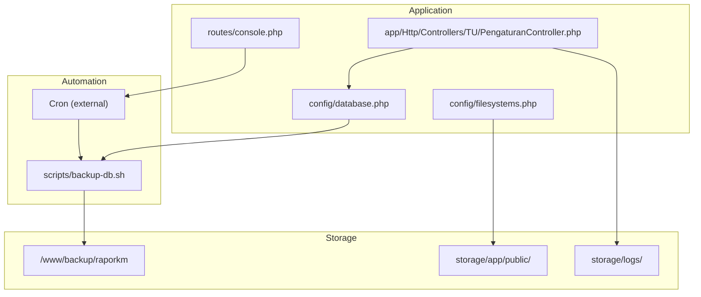
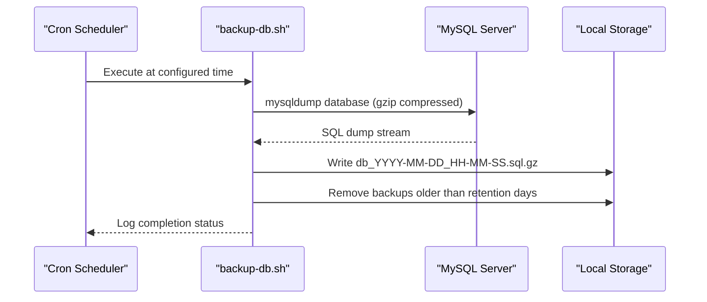
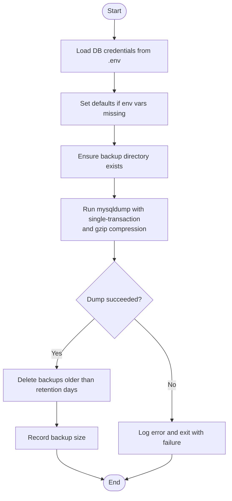
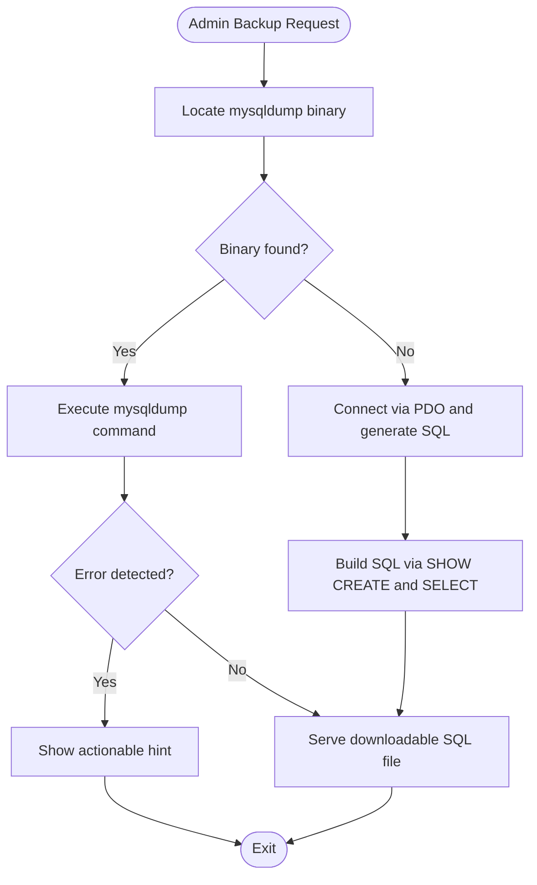
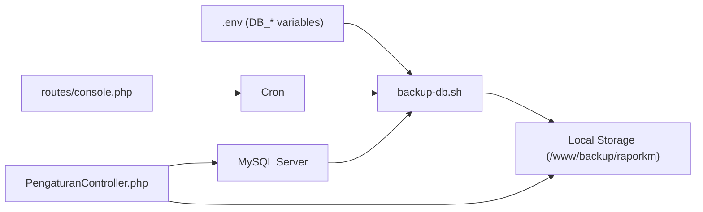

# Maintenance & Backup

<cite>
**Referenced Files in This Document**
- [backup-db.sh](file://scripts/backup-db.sh)
- [console.php](file://routes/console.php)
- [PengaturanController.php](file://app/Http/Controllers/TU/PengaturanController.php)
- [database.php](file://config/database.php)
- [filesystems.php](file://config/filesystems.php)
- [deploy.sh](file://deploy.sh)
- [raporkm-queue-worker.service](file://deploy/raporkm-queue-worker.service)
- [raporkm-logrotate.conf](file://deploy/raporkm-logrotate.conf)
- [README.md](file://README.md)
</cite>

## Table of Contents
1. [Introduction](#introduction)
2. [Project Structure](#project-structure)
3. [Core Components](#core-components)
4. [Architecture Overview](#architecture-overview)
5. [Detailed Component Analysis](#detailed-component-analysis)
6. [Dependency Analysis](#dependency-analysis)
7. [Performance Considerations](#performance-considerations)
8. [Troubleshooting Guide](#troubleshooting-guide)
9. [Conclusion](#conclusion)
10. [Appendices](#appendices)

## Introduction
This document provides comprehensive maintenance and backup guidance for RaporKM Laravel. It covers database backup procedures, file backup strategies, database maintenance tasks, backup storage and retention, disaster recovery, routine maintenance, monitoring, and automation. The content is derived from the repository’s configuration, scheduled tasks, and existing backup scripts.

## Project Structure
Key locations for backup and maintenance:
- Automated database backup script: scripts/backup-db.sh
- Scheduled tasks and cron integration: routes/console.php
- Application database configuration: config/database.php
- Filesystem configuration for storage: config/filesystems.php
- Deployment and service configuration: deploy.sh, deploy/raporkm-queue-worker.service, deploy/raporkm-logrotate.conf
- Application README for context: README.md

**Diagram sources**
- [backup-db.sh:1-53](file://scripts/backup-db.sh#L1-L53)
- [console.php:12-20](file://routes/console.php#L12-L20)
- [database.php](file://config/database.php)
- [filesystems.php](file://config/filesystems.php)

**Section sources**
- [backup-db.sh:1-53](file://scripts/backup-db.sh#L1-L53)
- [console.php:12-20](file://routes/console.php#L12-L20)
- [database.php](file://config/database.php)
- [filesystems.php](file://config/filesystems.php)

## Core Components
- Database backup script: performs mysqldump with compression, logs progress, enforces retention, and cleans old backups.
- Scheduled tasks: defines daily cleanup of old Dapodik sync logs and references external cron-based backup.
- Database configuration: centralizes connection settings for MySQL.
- Filesystem configuration: defines local and public storage paths used for uploaded content and exports.
- Deployment and services: systemd unit for queue worker and log rotation configuration.

**Section sources**
- [backup-db.sh:1-53](file://scripts/backup-db.sh#L1-L53)
- [console.php:12-20](file://routes/console.php#L12-L20)
- [database.php](file://config/database.php)
- [filesystems.php](file://config/filesystems.php)
- [deploy.sh](file://deploy.sh)
- [raporkm-queue-worker.service](file://deploy/raporkm-queue-worker.service)
- [raporkm-logrotate.conf](file://deploy/raporkm-logrotate.conf)

## Architecture Overview
The backup architecture combines:
- External cron scheduling invoking a Bash script for database dumps.
- Local filesystem storage for backups and application data.
- Optional offsite backup strategy via manual copy or third-party storage (see recommendations below).
- Daily cleanup of old Dapodik sync logs via Laravel scheduler.

**Diagram sources**
- [backup-db.sh:5-53](file://scripts/backup-db.sh#L5-L53)
- [console.php:19-20](file://routes/console.php#L19-L20)

## Detailed Component Analysis

### Database Backup Script (backup-db.sh)
Responsibilities:
- Loads database credentials from .env.
- Creates backup directory if missing.
- Executes mysqldump with transactional options and compresses output.
- Logs start/end timestamps and backup size.
- Enforces retention by deleting backups older than a threshold.
- Exits with failure status on dump errors.

Operational notes:
- Uses fixed application directory and backup directory paths.
- Retention policy set to N days via variable.
- Logs to application log directory.

**Diagram sources**
- [backup-db.sh:13-53](file://scripts/backup-db.sh#L13-L53)

**Section sources**
- [backup-db.sh:1-53](file://scripts/backup-db.sh#L1-L53)

### Scheduled Tasks and Cron Integration (console.php)
- Defines daily cleanup of Dapodik sync logs older than 30 days.
- References external cron job for database backup execution.

Recommendations:
- Ensure cron runs the backup script at a low-traffic time.
- Monitor scheduled task logs for cleanup operations.

**Section sources**
- [console.php:12-20](file://routes/console.php#L12-L20)

### Database Configuration (database.php)
- Centralizes MySQL connection settings (host, port, database, username, password).
- Used by the backup script and application.

Best practices:
- Store sensitive credentials in environment variables.
- Use dedicated backup user with minimal privileges when possible.

**Section sources**
- [database.php](file://config/database.php)

### Filesystem Configuration (filesystems.php)
- Defines local disk and public disk paths.
- Public uploads and exports are stored under storage/app/public.

Backup strategy:
- Include storage/app/public in file backups.
- Consider excluding temporary files under storage/temp.

**Section sources**
- [filesystems.php](file://config/filesystems.php)

### Web Server and Queue Worker (deploy.sh, raporkm-queue-worker.service)
- deploy.sh initializes application dependencies and environment.
- raporkm-queue-worker.service manages long-running queue jobs.

Maintenance notes:
- Restart queue worker after deployments to pick up code changes.
- Monitor queue worker logs for errors.

**Section sources**
- [deploy.sh](file://deploy.sh)
- [raporkm-queue-worker.service](file://deploy/raporkm-queue-worker.service)

### Log Rotation (raporkm-logrotate.conf)
- Configures log rotation for application logs.
- Prevents logs from consuming excessive disk space.

Maintenance notes:
- Verify logrotate schedule and rotation thresholds.
- Ensure rotated logs are retained per compliance needs.

**Section sources**
- [raporkm-logrotate.conf](file://deploy/raporkm-logrotate.conf)

### Manual Backup Functionality (PengaturanController.php)
The controller provides an administrative backup method:
- Attempts mysqldump binary first.
- Falls back to PDO-based generation if mysqldump is unavailable.
- Returns downloadable SQL file or error messages.

Operational notes:
- Requires appropriate permissions for mysqldump or database access.
- Validates error conditions and provides user feedback.

**Diagram sources**
- [PengaturanController.php:176-242](file://app/Http/Controllers/TU/PengaturanController.php#L176-L242)

**Section sources**
- [PengaturanController.php:148-242](file://app/Http/Controllers/TU/PengaturanController.php#L148-L242)

## Dependency Analysis
- Backup script depends on:
  - Environment variables for database credentials.
  - mysqldump availability and MySQL server connectivity.
  - Local filesystem write permissions.
- Scheduled tasks depend on Laravel scheduler and cron.
- Manual backup depends on PHP runtime, mysqldump availability, or PDO connectivity.

**Diagram sources**
- [backup-db.sh:13-22](file://scripts/backup-db.sh#L13-L22)
- [console.php:12-20](file://routes/console.php#L12-L20)
- [PengaturanController.php:176-242](file://app/Http/Controllers/TU/PengaturanController.php#L176-L242)

**Section sources**
- [backup-db.sh:13-22](file://scripts/backup-db.sh#L13-L22)
- [console.php:12-20](file://routes/console.php#L12-L20)
- [PengaturanController.php:176-242](file://app/Http/Controllers/TU/PengaturanController.php#L176-L242)

## Performance Considerations
- Use single-transaction and lock-tables=false for consistent logical backups without global locks.
- Prefer gzip compression to reduce I/O and storage overhead.
- Schedule backups during off-peak hours to minimize impact on production workloads.
- Monitor backup duration and adjust retention to balance recovery needs and storage costs.

[No sources needed since this section provides general guidance]

## Troubleshooting Guide
Common issues and resolutions:
- mysqldump not found:
  - Ensure mysqldump is installed and in PATH.
  - Verify database credentials loaded from .env.
- Access denied:
  - Confirm database user permissions and password.
  - Consider creating a dedicated backup user with minimal required privileges.
- Disk space exhaustion:
  - Review retention days and storage capacity.
  - Enable log rotation and monitor free space.
- Backup failures logged:
  - Check application log file path and permissions.
  - Validate MySQL connectivity and network settings.
- Restore verification:
  - Test restore on staging with a recent backup.
  - Validate data integrity and application functionality post-restore.

**Section sources**
- [backup-db.sh:13-22](file://scripts/backup-db.sh#L13-L22)
- [backup-db.sh:30-41](file://scripts/backup-db.sh#L30-L41)
- [raporkm-logrotate.conf](file://deploy/raporkm-logrotate.conf)

## Conclusion
RaporKM Laravel employs a straightforward, reliable backup strategy combining external cron-triggered mysqldump with retention-based cleanup and manual administrative backup capabilities. By formalizing offsite storage, automating alerts, and establishing robust verification and DR testing procedures, the system can achieve strong data protection and business continuity.

[No sources needed since this section summarizes without analyzing specific files]

## Appendices

### Backup Procedures Checklist
- Verify database credentials and connectivity.
- Confirm backup directory exists and is writable.
- Run backup script manually and review logs.
- Validate backup file integrity and size.
- Transfer backup to offsite location.
- Test restore on a staging environment.
- Update runbook with latest procedures and contacts.

[No sources needed since this section provides general guidance]

### Disaster Recovery Plan Outline
- Define Recovery Time Objective (RTO) and Recovery Point Objective (RPO).
- Identify critical data and systems.
- Document step-by-step restore process.
- Assign roles and responsibilities.
- Conduct quarterly DR tests and annual full failover drills.
- Maintain updated contact lists and escalation procedures.

[No sources needed since this section provides general guidance]

### Monitoring and Alerting Recommendations
- Monitor backup success via log parsing and alert thresholds.
- Send notifications on backup failures or retention violations.
- Track backup sizes and storage utilization trends.
- Integrate with monitoring stack (e.g., log aggregation, metrics).

[No sources needed since this section provides general guidance]