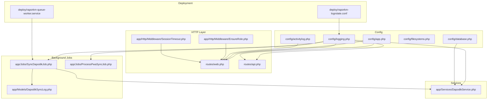
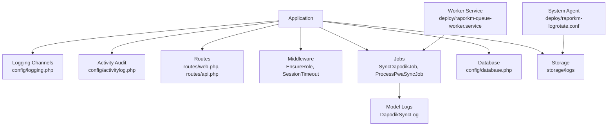
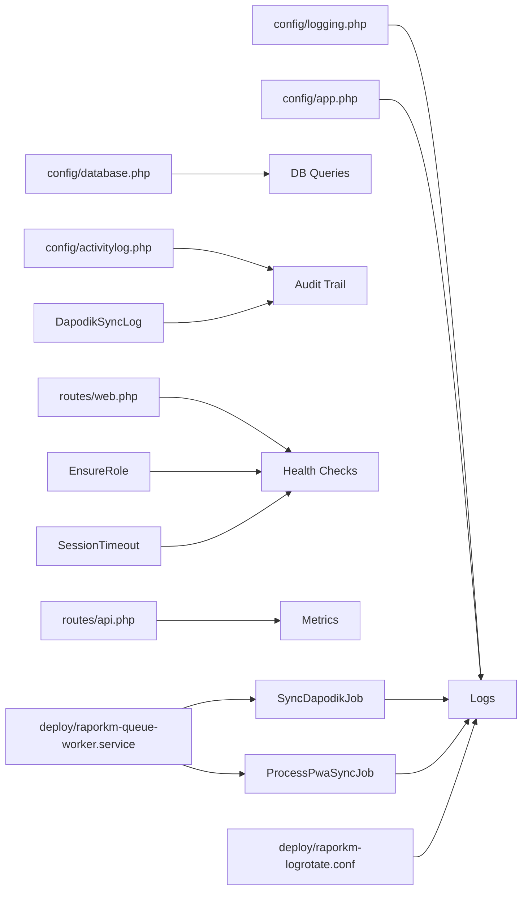

# Monitoring & Logging

<cite>
**Referenced Files in This Document**
- [logging.php](file://config/logging.php)
- [app.php](file://config/app.php)
- [database.php](file://config/database.php)
- [filesystems.php](file://config/filesystems.php)
- [activitylog.php](file://config/activitylog.php)
- [routes/web.php](file://routes/web.php)
- [routes/api.php](file://routes/api.php)
- [app/Http/Middleware/EnsureRole.php](file://app/Http/Middleware/EnsureRole.php)
- [app/Http/Middleware/SessionTimeout.php](file://app/Http/Middleware/SessionTimeout.php)
- [app/Services/DapodikService.php](file://app/Services/DapodikService.php)
- [app/Jobs/SyncDapodikJob.php](file://app/Jobs/SyncDapodikJob.php)
- [app/Jobs/ProcessPwaSyncJob.php](file://app/Jobs/ProcessPwaSyncJob.php)
- [app/Models/DapodikSyncLog.php](file://app/Models/DapodikSyncLog.php)
- [deploy/raporkm-logrotate.conf](file://deploy/raporkm-logrotate.conf)
- [deploy/raporkm-queue-worker.service](file://deploy/raporkm-queue-worker.service)
- [bootstrap/app.php](file://bootstrap/app.php)
- [storage/logs](file://storage/logs)
- [README.md](file://README.md)
</cite>

## Table of Contents
1. [Introduction](#introduction)
2. [Project Structure](#project-structure)
3. [Core Components](#core-components)
4. [Architecture Overview](#architecture-overview)
5. [Detailed Component Analysis](#detailed-component-analysis)
6. [Dependency Analysis](#dependency-analysis)
7. [Performance Considerations](#performance-considerations)
8. [Troubleshooting Guide](#troubleshooting-guide)
9. [Conclusion](#conclusion)
10. [Appendices](#appendices)

## Introduction
This document provides comprehensive monitoring and logging guidance for RaporKM Laravel focused on production observability and troubleshooting. It covers logging configuration (levels, rotation, storage), application monitoring and metrics, health checks, error tracking and exception logging, activity audit trails, system monitoring (server resources, database performance), alerting and notifications, centralized logging and dashboards, log analysis techniques, troubleshooting methodologies, and performance optimization strategies.

## Project Structure
RaporKM is a Laravel application with modular controllers, services, jobs, and extensive domain models. Logging and monitoring touchpoints span configuration, middleware, jobs, models, deployment artifacts, and routes.

**Diagram sources**
- [logging.php](file://config/logging.php)
- [app.php](file://config/app.php)
- [database.php](file://config/database.php)
- [filesystems.php](file://config/filesystems.php)
- [activitylog.php](file://config/activitylog.php)
- [routes/web.php](file://routes/web.php)
- [routes/api.php](file://routes/api.php)
- [app/Http/Middleware/EnsureRole.php](file://app/Http/Middleware/EnsureRole.php)
- [app/Http/Middleware/SessionTimeout.php](file://app/Http/Middleware/SessionTimeout.php)
- [app/Services/DapodikService.php](file://app/Services/DapodikService.php)
- [app/Jobs/SyncDapodikJob.php](file://app/Jobs/SyncDapodikJob.php)
- [app/Jobs/ProcessPwaSyncJob.php](file://app/Jobs/ProcessPwaSyncJob.php)
- [app/Models/DapodikSyncLog.php](file://app/Models/DapodikSyncLog.php)
- [deploy/raporkm-logrotate.conf](file://deploy/raporkm-logrotate.conf)
- [deploy/raporkm-queue-worker.service](file://deploy/raporkm-queue-worker.service)

**Section sources**
- [logging.php](file://config/logging.php)
- [app.php](file://config/app.php)
- [routes/web.php](file://routes/web.php)
- [routes/api.php](file://routes/api.php)
- [deploy/raporkm-logrotate.conf](file://deploy/raporkm-logrotate.conf)
- [deploy/raporkm-queue-worker.service](file://deploy/raporkm-queue-worker.service)

## Core Components
- Logging configuration defines channels, handlers, and retention via Monolog integrations.
- Application environment and debug settings influence log verbosity and error reporting.
- Database configuration affects SQL logging and performance insights.
- Activity logging is enabled for auditable actions.
- Routes expose endpoints for health and operational checks.
- Middleware enforces roles and session timeouts impacting request lifecycle and error surfaces.
- Background jobs perform long-running tasks and require robust logging and metrics.
- Deployment artifacts configure log rotation and worker service management.

**Section sources**
- [logging.php](file://config/logging.php)
- [app.php](file://config/app.php)
- [database.php](file://config/database.php)
- [activitylog.php](file://config/activitylog.php)
- [routes/web.php](file://routes/web.php)
- [routes/api.php](file://routes/api.php)
- [app/Http/Middleware/EnsureRole.php](file://app/Http/Middleware/EnsureRole.php)
- [app/Http/Middleware/SessionTimeout.php](file://app/Http/Middleware/SessionTimeout.php)
- [app/Jobs/SyncDapodikJob.php](file://app/Jobs/SyncDapodikJob.php)
- [app/Jobs/ProcessPwaSyncJob.php](file://app/Jobs/ProcessPwaSyncJob.php)
- [app/Models/DapodikSyncLog.php](file://app/Models/DapodikSyncLog.php)
- [deploy/raporkm-logrotate.conf](file://deploy/raporkm-logrotate.conf)
- [deploy/raporkm-queue-worker.service](file://deploy/raporkm-queue-worker.service)

## Architecture Overview
The monitoring and logging architecture integrates configuration-driven channels, middleware-augmented request processing, job-based workloads, and deployment-managed rotation and workers.

**Diagram sources**
- [logging.php](file://config/logging.php)
- [activitylog.php](file://config/activitylog.php)
- [routes/web.php](file://routes/web.php)
- [routes/api.php](file://routes/api.php)
- [app/Http/Middleware/EnsureRole.php](file://app/Http/Middleware/EnsureRole.php)
- [app/Http/Middleware/SessionTimeout.php](file://app/Http/Middleware/SessionTimeout.php)
- [app/Jobs/SyncDapodikJob.php](file://app/Jobs/SyncDapodikJob.php)
- [app/Jobs/ProcessPwaSyncJob.php](file://app/Jobs/ProcessPwaSyncJob.php)
- [app/Models/DapodikSyncLog.php](file://app/Models/DapodikSyncLog.php)
- [database.php](file://config/database.php)
- [storage/logs](file://storage/logs)
- [deploy/raporkm-logrotate.conf](file://deploy/raporkm-logrotate.conf)
- [deploy/raporkm-queue-worker.service](file://deploy/raporkm-queue-worker.service)

## Detailed Component Analysis

### Logging Configuration
- Channel selection and handler mapping are defined centrally.
- Log level thresholds control verbosity.
- File-based and stack-based channels enable layered logging.
- Environment-specific overrides support development vs production differences.
- Rotation policies and storage locations are managed via system-level logrotate and Laravel’s filesystem configuration.

Key areas to review:
- Channel drivers and Monolog processors.
- Daily/size-based rotation and retention.
- Storage path and permissions.
- Centralized logging integration (e.g., syslog, cloud logging).

**Section sources**
- [logging.php](file://config/logging.php)
- [filesystems.php](file://config/filesystems.php)
- [deploy/raporkm-logrotate.conf](file://deploy/raporkm-logrotate.conf)

### Application Monitoring Setup
- Health endpoints: Expose readiness/liveness probes via web routes.
- Metrics: Track request latency, throughput, error rates, and queue backlog.
- Middleware instrumentation: Capture role-based access and session timeouts for anomaly detection.
- Database performance: Enable slow query logging and connection pool metrics.

Operational hooks:
- Web routes for health checks.
- API routes for administrative metrics.
- Middleware for request tracing and timing.

**Section sources**
- [routes/web.php](file://routes/web.php)
- [routes/api.php](file://routes/api.php)
- [app/Http/Middleware/EnsureRole.php](file://app/Http/Middleware/EnsureRole.php)
- [app/Http/Middleware/SessionTimeout.php](file://app/Http/Middleware/SessionTimeout.php)
- [database.php](file://config/database.php)

### Performance Metrics Collection
- Request-level metrics: Duration, status codes, route names.
- Queue metrics: Job counts, retry attempts, failure rates.
- Database metrics: Query count, slow queries, connection usage.
- Background job profiling: Start/end timestamps, batch sizes, errors.

Collection strategies:
- Middleware-based counters.
- Event listeners for job lifecycle.
- Database query log parsing.

**Section sources**
- [app/Jobs/SyncDapodikJob.php](file://app/Jobs/SyncDapodikJob.php)
- [app/Jobs/ProcessPwaSyncJob.php](file://app/Jobs/ProcessPwaSyncJob.php)
- [database.php](file://config/database.php)

### Health Check Endpoints
- Define endpoints returning application and dependency status.
- Include database connectivity, queue worker status, and storage accessibility.
- Use consistent response formats for automation.

Implementation anchors:
- Route definitions for health checks.
- Service checks integrated into endpoint logic.

**Section sources**
- [routes/web.php](file://routes/web.php)
- [routes/api.php](file://routes/api.php)

### Error Tracking and Exception Logging
- Global exception handling captures uncaught exceptions.
- Structured logs include context (user, route, IP, correlation ID).
- Error severity classification supports alerting tiers.

Best practices:
- Log exceptions with full stack traces in non-production.
- Redact sensitive data in logs.
- Use structured JSON for downstream analysis.

**Section sources**
- [logging.php](file://config/logging.php)
- [app.php](file://config/app.php)

### Activity Audit Trails
- Activity logging records user actions against auditable models.
- Stores actor, event, subject, properties, and timestamps.
- Supports compliance and forensic analysis.

Usage:
- Enable per model or globally.
- Configure storage and retention.

**Section sources**
- [activitylog.php](file://config/activitylog.php)

### System Monitoring (Resources and Database)
- Server resources: CPU, memory, disk, network.
- Database performance: Slow queries, locks, buffer pool, replication lag.
- Filesystem: Disk usage for logs and temporary files.

Integration points:
- OS-level monitoring agents.
- Database performance schema or equivalent.
- Log volume and growth trends.

**Section sources**
- [deploy/raporkm-logrotate.conf](file://deploy/raporkm-logrotate.conf)
- [storage/logs](file://storage/logs)
- [filesystems.php](file://config/filesystems.php)
- [database.php](file://config/database.php)

### Alerting Configuration and Notifications
- Threshold-based alerts for error spikes, latency, queue backlog, and resource exhaustion.
- Notification channels: Email, Slack, PagerDuty, webhooks.
- Escalation policies and on-call schedules.

Operational guidance:
- Define SLOs and SLIs aligned with business outcomes.
- Use correlation IDs to trace incidents across logs and metrics.

**Section sources**
- [logging.php](file://config(logging.php)
- [routes/web.php](file://routes/web.php)
- [routes/api.php](file://routes/api.php)

### Centralized Logging, Aggregation, and Dashboards
- Ship logs to centralized collectors (e.g., ELK, Loki, Cloud Logging).
- Normalize logs with structured JSON and consistent fields.
- Build dashboards for error rates, latency, resource utilization, and sync job status.

Implementation steps:
- Configure log channels to forward to collector.
- Define log parsing rules and field extraction.
- Create Grafana/Prometheus/Kibana dashboards.

**Section sources**
- [logging.php](file://config/logging.php)
- [storage/logs](file://storage/logs)

### Log Analysis Techniques and Troubleshooting Methodologies
- Correlation IDs across requests and jobs.
- Pattern matching for recurring errors and slow paths.
- Backtracking from symptoms to root cause using middleware and job logs.
- Comparative analysis during deployments.

Workflow outline:
- Reproduce issue and capture logs.
- Filter by correlation ID and timeframe.
- Identify anomalous patterns (latency, errors, retries).
- Trace call chain from controller to jobs and external services.

**Section sources**
- [app/Http/Middleware/EnsureRole.php](file://app/Http/Middleware/EnsureRole.php)
- [app/Http/Middleware/SessionTimeout.php](file://app/Http/Middleware/SessionTimeout.php)
- [app/Jobs/SyncDapodikJob.php](file://app/Jobs/SyncDapodikJob.php)
- [app/Jobs/ProcessPwaSyncJob.php](file://app/Jobs/ProcessPwaSyncJob.php)

### Performance Optimization Strategies
- Optimize database queries and indexes.
- Reduce payload sizes and leverage pagination.
- Tune queue concurrency and retry policies.
- Cache frequently accessed data and invalidate efficiently.
- Monitor and cap log volume to avoid I/O bottlenecks.

**Section sources**
- [database.php](file://config/database.php)
- [app/Jobs/SyncDapodikJob.php](file://app/Jobs/SyncDapodikJob.php)
- [app/Jobs/ProcessPwaSyncJob.php](file://app/Jobs/ProcessPwaSyncJob.php)
- [deploy/raporkm-logrotate.conf](file://deploy/raporkm-logrotate.conf)

## Dependency Analysis
Logging and monitoring depend on configuration, middleware, jobs, and deployment artifacts. The following diagram highlights key dependencies.

**Diagram sources**
- [logging.php](file://config/logging.php)
- [app.php](file://config/app.php)
- [database.php](file://config/database.php)
- [activitylog.php](file://config/activitylog.php)
- [routes/web.php](file://routes/web.php)
- [routes/api.php](file://routes/api.php)
- [app/Http/Middleware/EnsureRole.php](file://app/Http/Middleware/EnsureRole.php)
- [app/Http/Middleware/SessionTimeout.php](file://app/Http/Middleware/SessionTimeout.php)
- [app/Jobs/SyncDapodikJob.php](file://app/Jobs/SyncDapodikJob.php)
- [app/Jobs/ProcessPwaSyncJob.php](file://app/Jobs/ProcessPwaSyncJob.php)
- [app/Models/DapodikSyncLog.php](file://app/Models/DapodikSyncLog.php)
- [deploy/raporkm-logrotate.conf](file://deploy/raporkm-logrotate.conf)
- [deploy/raporkm-queue-worker.service](file://deploy/raporkm-queue-worker.service)

**Section sources**
- [logging.php](file://config(logging.php)
- [app.php](file://config/app.php)
- [database.php](file://config/database.php)
- [activitylog.php](file://config(activitylog.php)
- [routes/web.php](file://routes/web.php)
- [routes/api.php](file://routes/api.php)
- [app/Http/Middleware/EnsureRole.php](file://app/Http/Middleware/EnsureRole.php)
- [app/Http/Middleware/SessionTimeout.php](file://app/Http/Middleware/SessionTimeout.php)
- [app/Jobs/SyncDapodikJob.php](file://app/Jobs/SyncDapodikJob.php)
- [app/Jobs/ProcessPwaSyncJob.php](file://app/Jobs/ProcessPwaSyncJob.php)
- [app/Models/DapodikSyncLog.php](file://app/Models/DapodikSyncLog.php)
- [deploy/raporkm-logrotate.conf](file://deploy/raporkm-logrotate.conf)
- [deploy/raporkm-queue-worker.service](file://deploy/raporkm-queue-worker.service)

## Performance Considerations
- Keep logs at appropriate levels to minimize overhead.
- Use asynchronous logging where supported.
- Rotate and prune logs regularly to prevent disk pressure.
- Monitor queue depth and adjust worker scaling.
- Profile slow endpoints and optimize database queries.

[No sources needed since this section provides general guidance]

## Troubleshooting Guide
Common scenarios and steps:
- Application crashes or 5xx errors: Inspect recent log entries around the incident time, correlate with middleware logs, and check database connectivity.
- Slow endpoints: Review latency metrics, examine slow query logs, and validate caching effectiveness.
- Queue failures: Check job logs, retry counts, and error messages; scale workers or adjust retry policies.
- Authentication/session issues: Validate role middleware and session timeout middleware logs; confirm session storage availability.
- Audit discrepancies: Verify activity log configuration and retention; cross-check with user actions and job logs.

**Section sources**
- [logging.php](file://config/logging.php)
- [app.php](file://config/app.php)
- [database.php](file://config/database.php)
- [activitylog.php](file://config/activitylog.php)
- [app/Http/Middleware/EnsureRole.php](file://app/Http/Middleware/EnsureRole.php)
- [app/Http/Middleware/SessionTimeout.php](file://app/Http/Middleware/SessionTimeout.php)
- [app/Jobs/SyncDapodikJob.php](file://app/Jobs/SyncDapodikJob.php)
- [app/Jobs/ProcessPwaSyncJob.php](file://app/Jobs/ProcessPwaSyncJob.php)

## Conclusion
Effective monitoring and logging in RaporKM rely on disciplined configuration, comprehensive middleware coverage, robust job instrumentation, and operational deployment practices. By combining structured logs, activity audits, health checks, and system metrics, teams can achieve strong observability, rapid incident response, and continuous performance improvement.

[No sources needed since this section summarizes without analyzing specific files]

## Appendices

### Appendix A: Log Levels and Severity Mapping
- Debug: Development diagnostics and verbose traces.
- Info: Operational events and milestones.
- Notice: Normal but significant conditions.
- Warning: Potentially harmful situations.
- Error: Runtime errors requiring intervention.
- Critical: Application errors causing severe impact.
- Alert: Action required immediately.
- Emergency: System unusable.

**Section sources**
- [logging.php](file://config(logging.php)

### Appendix B: Log Rotation and Retention Policies
- Daily rotation with size caps.
- Retention windows aligned with compliance.
- Offload to centralized storage for long-term archives.

**Section sources**
- [deploy/raporkm-logrotate.conf](file://deploy/raporkm-logrotate.conf)
- [filesystems.php](file://config/filesystems.php)

### Appendix C: Health Check Endpoint Examples
- GET /health (application status)
- GET /health/db (database connectivity)
- GET /health/queue (queue worker status)
- GET /metrics (application metrics)

**Section sources**
- [routes/web.php](file://routes/web.php)
- [routes/api.php](file://routes/api.php)

### Appendix D: Middleware Instrumentation Anchors
- EnsureRole: Role enforcement and access logs.
- SessionTimeout: Session lifecycle and timeout events.

**Section sources**
- [app/Http/Middleware/EnsureRole.php](file://app/Http/Middleware/EnsureRole.php)
- [app/Http/Middleware/SessionTimeout.php](file://app/Http/Middleware/SessionTimeout.php)

### Appendix E: Job-Level Monitoring Hooks
- Start/end timestamps, batch sizes, errors, retry counts.
- Model-backed sync logs for historical tracking.

**Section sources**
- [app/Jobs/SyncDapodikJob.php](file://app/Jobs/SyncDapodikJob.php)
- [app/Jobs/ProcessPwaSyncJob.php](file://app/Jobs/ProcessPwaSyncJob.php)
- [app/Models/DapodikSyncLog.php](file://app/Models/DapodikSyncLog.php)

### Appendix F: Deployment Artifacts
- Worker service ensures continuous job processing.
- Logrotate maintains disk hygiene.

**Section sources**
- [deploy/raporkm-queue-worker.service](file://deploy/raporkm-queue-worker.service)
- [deploy/raporkm-logrotate.conf](file://deploy/raporkm-logrotate.conf)