# Agent Skills Framework

<cite>
**Referenced Files in This Document**
- [AGENTS.md](file://AGENTS.md)
- [CLAUDE.md](file://CLAUDE.md)
- [GEMINI.md](file://GEMINI.md)
- [DESIGN.md](file://DESIGN.md)
- [README.md](file://README.md)
- [.agents/skills/laravel-best-practices/SKILL.md](file://.agents/skills/laravel-best-practices/SKILL.md)
- [.agents/skills/laravel-best-practices/rules/architecture.md](file://.agents/skills/laravel-best-practices/rules/architecture.md)
- [.agents/skills/laravel-best-practices/rules/testing.md](file://.agents/skills/laravel-best-practices/rules/testing.md)
- [.agents/skills/laravel-best-practices/rules/security.md](file://.agents/skills/laravel-best-practices/rules/security.md)
- [.agents/skills/laravel-best-practices/rules/db-performance.md](file://.agents/skills/laravel-best-practices/rules/db-performance.md)
- [.agents/skills/laravel-best-practices/rules/validation.md](file://.agents/skills/laravel-best-practices/rules/validation.md)
- [.agents/skills/laravel-best-practices/rules/collections.md](file://.agents/skills/laravel-best-practices/rules/collections.md)
- [.agents/skills/laravel-best-practices/rules/eloquent.md](file://.agents/skills/laravel-best-practices/rules/eloquent.md)
- [.agents/skills/laravel-best-practices/rules/routing.md](file://.agents/skills/laravel-best-practices/rules/routing.md)
- [.agents/skills/laravel-best-practices/rules/error-handling.md](file://.agents/skills/laravel-best-practices/rules/error-handling.md)
- [.agents/skills/laravel-best-practices/rules/migrations.md](file://.agents/skills/laravel-best-practices/rules/migrations.md)
- [.agents/skills/laravel-best-practices/rules/blade-views.md](file://.agents/skills/laravel-best-practices/rules/blade-views.md)
- [.agents/skills/laravel-best-practices/rules/queue-jobs.md](file://.agents/skills/laravel-best-practices/rules/queue-jobs.md)
- [.agents/skills/laravel-best-practices/rules/scheduling.md](file://.agents/skills/laravel-best-practices/rules/scheduling.md)
- [.agents/skills/laravel-best-practices/rules/mail.md](file://.agents/skills/laravel-best-practices/rules/mail.md)
- [.agents/skills/laravel-best-practices/rules/http-client.md](file://.agents/skills/laravel-best-practices/rules/http-client.md)
- [.agents/skills/laravel-best-practices/rules/events-notifications.md](file://.agents/skills/laravel-best-practices/rules/events-notifications.md)
- [.agents/skills/laravel-best-practices/rules/caching.md](file://.agents/skills/laravel-best-practices/rules/caching.md)
- [.agents/skills/laravel-best-practices/rules/config.md](file://.agents/skills/laravel-best-practices/rules/config.md)
- [.agents/skills/laravel-best-practices/rules/style.md](file://.agents/skills/laravel-best-practices/rules/style.md)
- [.claude/settings.local.json](file://.claude/settings.local.json)
- [.gemini/settings.json](file://.gemini/settings.json)
- [skills/api-and-interface-design/SKILL.md](file://skills/api-and-interface-design/SKILL.md)
- [skills/browser-testing-with-devtools/SKILL.md](file://skills/browser-testing-with-devtools/SKILL.md)
- [skills/ci-cd-and-automation/SKILL.md](file://skills/ci-cd-and-automation/SKILL.md)
- [skills/performance-optimization/SKILL.md](file://skills/performance-optimization/SKILL.md)
- [skills/debugging-and-error-recovery/SKILL.md](file://skills/debugging-and-error-recovery/SKILL.md)
- [skills/code-review-and-quality/SKILL.md](file://skills/code-review-and-quality/SKILL.md)
- [skills/git-workflow-and-versioning/SKILL.md](file://skills/git-workflow-and-versioning/SKILL.md)
- [skills/documentation-and-adrs/SKILL.md](file://skills/documentation-and-adrs/SKILL.md)
- [skills/spec-driven-development/SKILL.md](file://skills/spec-driven-development/SKILL.md)
- [skills/test-driven-development/SKILL.md](file://skills/test-driven-development/SKILL.md)
- [skills/source-driven-development/SKILL.md](file://skills/source-driven-development/SKILL.md)
- [skills/context-engineering/SKILL.md](file://skills/context-engineering/SKILL.md)
- [skills/planning-and-task-breakdown/SKILL.md](file://skills/planning-and-task-breakdown/SKILL.md)
- [skills/deprecation-and-migration/SKILL.md](file://skills/deprecation-and-migration/SKILL.md)
- [skills/using-agent-skills/SKILL.md](file://skills/using-agent-skills/SKILL.md)
- [.github/workflows/test.yml](file://.github/workflows/test.yml)
- [.github/workflows/deploy.yml](file://.github/workflows/deploy.yml)
- [app/Http/Controllers/RaporController.php](file://app/Http/Controllers/RaporController.php)
- [routes/api.php](file://routes/api.php)
- [app/Services/RaporService.php](file://app/Services/RaporService.php)
- [app/Models/Siswa.php](file://app/Models/Siswa.php)
- [app/Models/Kelas.php](file://app/Models/Kelas.php)
- [app/Models/User.php](file://app/Models/User.php)
- [config/app.php](file://config/app.php)
- [config/cache.php](file://config/cache.php)
- [config/database.php](file://config/database.php)
- [config/queue.php](file://config/queue.php)
- [config/services.php](file://config/services.php)
- [config/logging.php](file://config/logging.php)
- [config/mail.php](file://config/mail.php)
- [config/session.php](file://config/session.php)
- [config/auth.php](file://config/auth.php)
- [config/cache.php](file://config/cache.php)
- [config/database.php](file://config/database.php)
- [config/queue.php](file://config/queue.php)
- [config/services.php](file://config/services.php)
- [config/logging.php](file://config/logging.php)
- [config/mail.php](file://config/mail.php)
- [config/session.php](file://config/session.php)
- [config/auth.php](file://config/auth.php)
</cite>

## Table of Contents
1. [Introduction](#introduction)
2. [Project Structure](#project-structure)
3. [Core Components](#core-components)
4. [Architecture Overview](#architecture-overview)
5. [Detailed Component Analysis](#detailed-component-analysis)
6. [Dependency Analysis](#dependency-analysis)
7. [Performance Considerations](#performance-considerations)
8. [Troubleshooting Guide](#troubleshooting-guide)
9. [Conclusion](#conclusion)
10. [Appendices](#appendices)

## Introduction
This document describes the agent skills framework used in the RaporKM Laravel project. It explains how AI agents (Claude, Gemini, and others) are integrated into the development workflow to support Laravel best practices, testing, debugging, optimization, and CI/CD automation. The framework organizes reusable skills into structured directories and leverages configuration files to customize agent behavior. Practical examples demonstrate agent-assisted development scenarios, while best practices address quality control, limitations, and ethical considerations.

## Project Structure
The agent skills framework is organized around:
- Centralized agent documentation and integration guides
- Skill sets for Laravel-specific best practices
- General-purpose development skills (API design, testing, CI/CD, performance)
- Configuration files for Claude and Gemini
- GitHub Actions workflows for automated testing and deployment
- Application code demonstrating real-world usage of skills

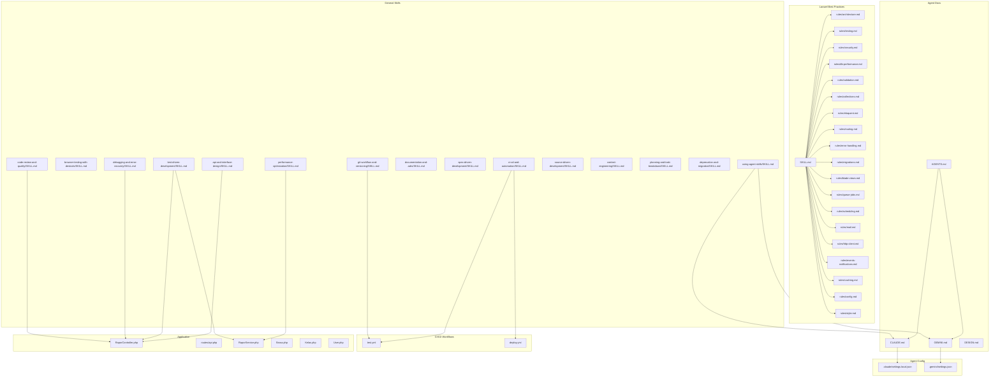

**Diagram sources**
- [AGENTS.md](file://AGENTS.md)
- [CLAUDE.md](file://CLAUDE.md)
- [GEMINI.md](file://GEMINI.md)
- [.agents/skills/laravel-best-practices/SKILL.md](file://.agents/skills/laravel-best-practices/SKILL.md)
- [skills/api-and-interface-design/SKILL.md](file://skills/api-and-interface-design/SKILL.md)
- [skills/ci-cd-and-automation/SKILL.md](file://skills/ci-cd-and-automation/SKILL.md)
- [skills/performance-optimization/SKILL.md](file://skills/performance-optimization/SKILL.md)
- [skills/test-driven-development/SKILL.md](file://skills/test-driven-development/SKILL.md)
- [skills/debugging-and-error-recovery/SKILL.md](file://skills/debugging-and-error-recovery/SKILL.md)
- [skills/code-review-and-quality/SKILL.md](file://skills/code-review-and-quality/SKILL.md)
- [skills/git-workflow-and-versioning/SKILL.md](file://skills/git-workflow-and-versioning/SKILL.md)
- [skills/using-agent-skills/SKILL.md](file://skills/using-agent-skills/SKILL.md)
- [.claude/settings.local.json](file://.claude/settings.local.json)
- [.gemini/settings.json](file://.gemini/settings.json)
- [.github/workflows/test.yml](file://.github/workflows/test.yml)
- [.github/workflows/deploy.yml](file://.github/workflows/deploy.yml)
- [app/Http/Controllers/RaporController.php](file://app/Http/Controllers/RaporController.php)
- [routes/api.php](file://routes/api.php)
- [app/Services/RaporService.php](file://app/Services/RaporService.php)
- [app/Models/Siswa.php](file://app/Models/Siswa.php)
- [app/Models/Kelas.php](file://app/Models/Kelas.php)
- [app/Models/User.php](file://app/Models/User.php)

**Section sources**
- [AGENTS.md](file://AGENTS.md)
- [CLAUDE.md](file://CLAUDE.md)
- [GEMINI.md](file://GEMINI.md)
- [DESIGN.md](file://DESIGN.md)

## Core Components
- Agent integration guides: centralize instructions for integrating Claude and Gemini into the development workflow.
- Laravel best practices skills: a curated set of rules covering architecture, testing, security, performance, validation, collections, Eloquent, routing, error handling, migrations, Blade views, queues/jobs, scheduling, mail, HTTP client, events/notifications, caching, configuration, and style.
- General development skills: API design, browser testing, CI/CD automation, performance optimization, debugging, code review, Git workflow, documentation, specification-driven development, test-driven development, source-driven development, context engineering, planning, deprecation and migration, and using agent skills.
- Agent configuration: local settings for Claude and global settings for Gemini.
- CI/CD workflows: automated testing and deployment orchestrated via GitHub Actions.
- Application usage: controllers, routes, services, and models demonstrate how skills are applied in practice.

**Section sources**
- [.agents/skills/laravel-best-practices/SKILL.md](file://.agents/skills/laravel-best-practices/SKILL.md)
- [skills/api-and-interface-design/SKILL.md](file://skills/api-and-interface-design/SKILL.md)
- [skills/browser-testing-with-devtools/SKILL.md](file://skills/browser-testing-with-devtools/SKILL.md)
- [skills/ci-cd-and-automation/SKILL.md](file://skills/ci-cd-and-automation/SKILL.md)
- [skills/performance-optimization/SKILL.md](file://skills/performance-optimization/SKILL.md)
- [skills/debugging-and-error-recovery/SKILL.md](file://skills/debugging-and-error-recovery/SKILL.md)
- [skills/code-review-and-quality/SKILL.md](file://skills/code-review-and-quality/SKILL.md)
- [skills/git-workflow-and-versioning/SKILL.md](file://skills/git-workflow-and-versioning/SKILL.md)
- [skills/documentation-and-adrs/SKILL.md](file://skills/documentation-and-adrs/SKILL.md)
- [skills/spec-driven-development/SKILL.md](file://skills/spec-driven-development/SKILL.md)
- [skills/test-driven-development/SKILL.md](file://skills/test-driven-development/SKILL.md)
- [skills/source-driven-development/SKILL.md](file://skills/source-driven-development/SKILL.md)
- [skills/context-engineering/SKILL.md](file://skills/context-engineering/SKILL.md)
- [skills/planning-and-task-breakdown/SKILL.md](file://skills/planning-and-task-breakdown/SKILL.md)
- [skills/deprecation-and-migration/SKILL.md](file://skills/deprecation-and-migration/SKILL.md)
- [skills/using-agent-skills/SKILL.md](file://skills/using-agent-skills/SKILL.md)
- [.claude/settings.local.json](file://.claude/settings.local.json)
- [.gemini/settings.json](file://.gemini/settings.json)
- [.github/workflows/test.yml](file://.github/workflows/test.yml)
- [.github/workflows/deploy.yml](file://.github/workflows/deploy.yml)

## Architecture Overview
The agent skills framework integrates AI agents into the Laravel development lifecycle. Agents consume skill definitions and configurations to assist with:
- Code generation and refactoring aligned with Laravel best practices
- Testing strategy design and execution
- Debugging and error recovery
- Performance tuning and optimization
- CI/CD pipeline automation
- Documentation and specification alignment

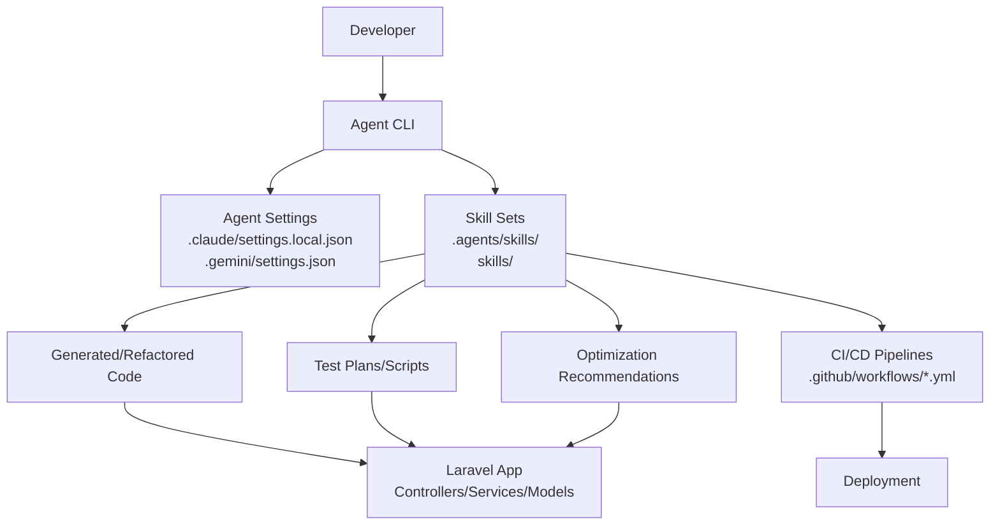

**Diagram sources**
- [.claude/settings.local.json](file://.claude/settings.local.json)
- [.gemini/settings.json](file://.gemini/settings.json)
- [.agents/skills/laravel-best-practices/SKILL.md](file://.agents/skills/laravel-best-practices/SKILL.md)
- [skills/api-and-interface-design/SKILL.md](file://skills/api-and-interface-design/SKILL.md)
- [skills/ci-cd-and-automation/SKILL.md](file://skills/ci-cd-and-automation/SKILL.md)
- [skills/performance-optimization/SKILL.md](file://skills/performance-optimization/SKILL.md)
- [.github/workflows/test.yml](file://.github/workflows/test.yml)
- [.github/workflows/deploy.yml](file://.github/workflows/deploy.yml)
- [app/Http/Controllers/RaporController.php](file://app/Http/Controllers/RaporController.php)
- [app/Services/RaporService.php](file://app/Services/RaporService.php)

## Detailed Component Analysis

### Laravel Best Practices Skills
These skills define Laravel-specific guidance across architecture, testing, security, performance, validation, collections, Eloquent, routing, error handling, migrations, Blade views, queues/jobs, scheduling, mail, HTTP client, events/notifications, caching, configuration, and style. They serve as the foundation for agent-assisted development in Laravel projects.

```mermaid
flowchart TD
Start(["Agent Request"]) --> LoadRules["Load Best Practices Rules"]
LoadRules --> Categorize{"Categorize by Topic"}
Categorize --> |Architecture| Arch["Apply Architecture Guidance"]
Categorize --> |Testing| Test["Suggest Testing Patterns"]
Categorize --> |Security| Sec["Recommend Security Measures"]
Categorize --> |Performance| Perf["Provide Performance Tips"]
Categorize --> |Validation| Val["Offer Validation Strategies"]
Categorize --> |Collections| Col["Guide Collections Usage"]
Categorize --> |Eloquent| Elo["Advise Eloquent Patterns"]
Categorize --> |Routing| Rot["Propose Routing Solutions"]
Categorize --> |Error Handling| Err["Suggest Error Handling"]
Categorize --> |Migrations| Mig["Recommend Migration Practices"]
Categorize --> |Blade Views| Blv["Advise Blade Patterns"]
Categorize --> |Queue/Jobs| Qj["Guide Queue/Job Usage"]
Categorize --> |Scheduling| Sch["Suggest Scheduling Approaches"]
Categorize --> |Mail| Ml["Recommend Mail Strategies"]
Categorize --> |HTTP Client| Hc["Advise HTTP Client Usage"]
Categorize --> |Events/Notifications| Evn["Guide Events/Notifications"]
Categorize --> |Caching| Cch["Recommend Caching Strategies"]
Categorize --> |Config| Cfg["Suggest Config Practices"]
Categorize --> |Style| Sty["Apply Style Guidelines"]
Arch --> Output["Return Actionable Advice"]
Test --> Output
Sec --> Output
Perf --> Output
Val --> Output
Col --> Output
Elo --> Output
Rot --> Output
Err --> Output
Mig --> Output
Blv --> Output
Qj --> Output
Sch --> Output
Ml --> Output
Hc --> Output
Evn --> Output
Cch --> Output
Cfg --> Output
Sty --> Output
```

**Diagram sources**
- [.agents/skills/laravel-best-practices/SKILL.md](file://.agents/skills/laravel-best-practices/SKILL.md)
- [.agents/skills/laravel-best-practices/rules/architecture.md](file://.agents/skills/laravel-best-practices/rules/architecture.md)
- [.agents/skills/laravel-best-practices/rules/testing.md](file://.agents/skills/laravel-best-practices/rules/testing.md)
- [.agents/skills/laravel-best-practices/rules/security.md](file://.agents/skills/laravel-best-practices/rules/security.md)
- [.agents/skills/laravel-best-practices/rules/db-performance.md](file://.agents/skills/laravel-best-practices/rules/db-performance.md)
- [.agents/skills/laravel-best-practices/rules/validation.md](file://.agents/skills/laravel-best-practices/rules/validation.md)
- [.agents/skills/laravel-best-practices/rules/collections.md](file://.agents/skills/laravel-best-practices/rules/collections.md)
- [.agents/skills/laravel-best-practices/rules/eloquent.md](file://.agents/skills/laravel-best-practices/rules/eloquent.md)
- [.agents/skills/laravel-best-practices/rules/routing.md](file://.agents/skills/laravel-best-practices/rules/routing.md)
- [.agents/skills/laravel-best-practices/rules/error-handling.md](file://.agents/skills/laravel-best-practices/rules/error-handling.md)
- [.agents/skills/laravel-best-practices/rules/migrations.md](file://.agents/skills/laravel-best-practices/rules/migrations.md)
- [.agents/skills/laravel-best-practices/rules/blade-views.md](file://.agents/skills/laravel-best-practices/rules/blade-views.md)
- [.agents/skills/laravel-best-practices/rules/queue-jobs.md](file://.agents/skills/laravel-best-practices/rules/queue-jobs.md)
- [.agents/skills/laravel-best-practices/rules/scheduling.md](file://.agents/skills/laravel-best-practices/rules/scheduling.md)
- [.agents/skills/laravel-best-practices/rules/mail.md](file://.agents/skills/laravel-best-practices/rules/mail.md)
- [.agents/skills/laravel-best-practices/rules/http-client.md](file://.agents/skills/laravel-best-practices/rules/http-client.md)
- [.agents/skills/laravel-best-practices/rules/events-notifications.md](file://.agents/skills/laravel-best-practices/rules/events-notifications.md)
- [.agents/skills/laravel-best-practices/rules/caching.md](file://.agents/skills/laravel-best-practices/rules/caching.md)
- [.agents/skills/laravel-best-practices/rules/config.md](file://.agents/skills/laravel-best-practices/rules/config.md)
- [.agents/skills/laravel-best-practices/rules/style.md](file://.agents/skills/laravel-best-practices/rules/style.md)

**Section sources**
- [.agents/skills/laravel-best-practices/SKILL.md](file://.agents/skills/laravel-best-practices/SKILL.md)
- [.agents/skills/laravel-best-practices/rules/architecture.md](file://.agents/skills/laravel-best-practices/rules/architecture.md)
- [.agents/skills/laravel-best-practices/rules/testing.md](file://.agents/skills/laravel-best-practices/rules/testing.md)
- [.agents/skills/laravel-best-practices/rules/security.md](file://.agents/skills/laravel-best-practices/rules/security.md)
- [.agents/skills/laravel-best-practices/rules/db-performance.md](file://.agents/skills/laravel-best-practices/rules/db-performance.md)
- [.agents/skills/laravel-best-practices/rules/validation.md](file://.agents/skills/laravel-best-practices/rules/validation.md)
- [.agents/skills/laravel-best-practices/rules/collections.md](file://.agents/skills/laravel-best-practices/rules/collections.md)
- [.agents/skills/laravel-best-practices/rules/eloquent.md](file://.agents/skills/laravel-best-practices/rules/eloquent.md)
- [.agents/skills/laravel-best-practices/rules/routing.md](file://.agents/skills/laravel-best-practices/rules/routing.md)
- [.agents/skills/laravel-best-practices/rules/error-handling.md](file://.agents/skills/laravel-best-practices/rules/error-handling.md)
- [.agents/skills/laravel-best-practices/rules/migrations.md](file://.agents/skills/laravel-best-practices/rules/migrations.md)
- [.agents/skills/laravel-best-practices/rules/blade-views.md](file://.agents/skills/laravel-best-practices/rules/blade-views.md)
- [.agents/skills/laravel-best-practices/rules/queue-jobs.md](file://.agents/skills/laravel-best-practices/rules/queue-jobs.md)
- [.agents/skills/laravel-best-practices/rules/scheduling.md](file://.agents/skills/laravel-best-practices/rules/scheduling.md)
- [.agents/skills/laravel-best-practices/rules/mail.md](file://.agents/skills/laravel-best-practices/rules/mail.md)
- [.agents/skills/laravel-best-practices/rules/http-client.md](file://.agents/skills/laravel-best-practices/rules/http-client.md)
- [.agents/skills/laravel-best-practices/rules/events-notifications.md](file://.agents/skills/laravel-best-practices/rules/events-notifications.md)
- [.agents/skills/laravel-best-practices/rules/caching.md](file://.agents/skills/laravel-best-practices/rules/caching.md)
- [.agents/skills/laravel-best-practices/rules/config.md](file://.agents/skills/laravel-best-practices/rules/config.md)
- [.agents/skills/laravel-best-practices/rules/style.md](file://.agents/skills/laravel-best-practices/rules/style.md)

### API Design Skills
API design skills focus on creating robust, maintainable APIs. They guide endpoint design, request/response schemas, versioning, error handling, and documentation standards. These skills integrate with Laravel’s routing and resource systems to produce consistent, testable APIs.

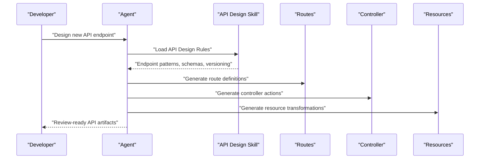

**Diagram sources**
- [skills/api-and-interface-design/SKILL.md](file://skills/api-and-interface-design/SKILL.md)
- [routes/api.php](file://routes/api.php)
- [app/Http/Controllers/RaporController.php](file://app/Http/Controllers/RaporController.php)
- [app/Http/Resources/V1/SiswaResource.php](file://app/Http/Resources/V1/SiswaResource.php)

**Section sources**
- [skills/api-and-interface-design/SKILL.md](file://skills/api-and-interface-design/SKILL.md)
- [routes/api.php](file://routes/api.php)
- [app/Http/Controllers/RaporController.php](file://app/Http/Controllers/RaporController.php)

### Browser Testing Skills
Browser testing skills enable developers to design and execute reliable front-end tests using DevTools and headless browsers. They emphasize test coverage, accessibility checks, cross-browser compatibility, and continuous verification.

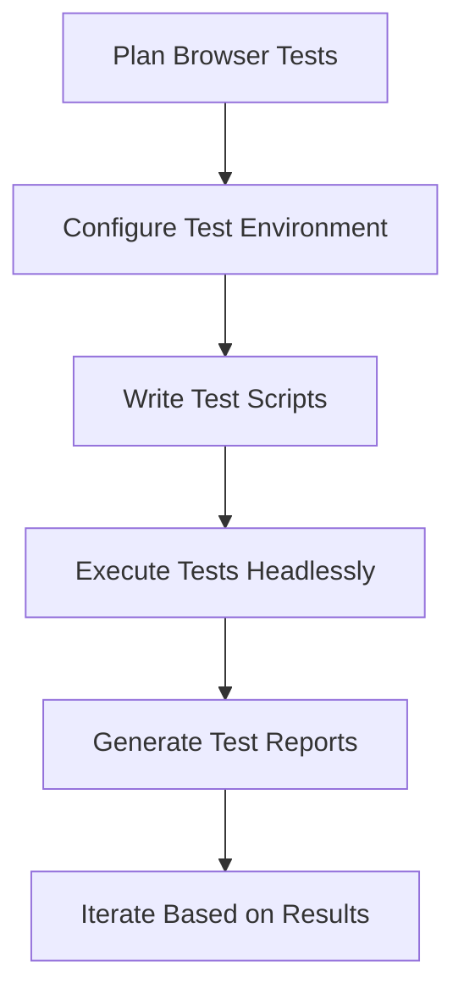

**Diagram sources**
- [skills/browser-testing-with-devtools/SKILL.md](file://skills/browser-testing-with-devtools/SKILL.md)

**Section sources**
- [skills/browser-testing-with-devtools/SKILL.md](file://skills/browser-testing-with-devtools/SKILL.md)

### CI/CD and Automation Skills
CI/CD skills automate testing, linting, building, and deployment. They define workflows for pull requests, feature branches, and releases, ensuring consistent quality gates and safe deployments.

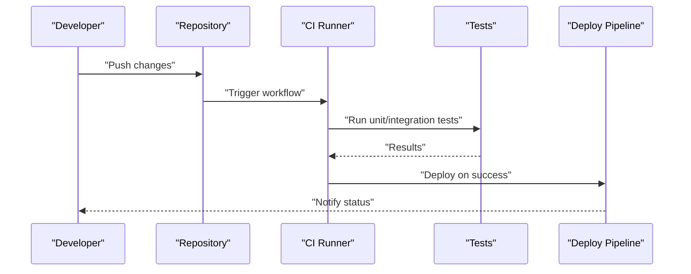

**Diagram sources**
- [skills/ci-cd-and-automation/SKILL.md](file://skills/ci-cd-and-automation/SKILL.md)
- [.github/workflows/test.yml](file://.github/workflows/test.yml)
- [.github/workflows/deploy.yml](file://.github/workflows/deploy.yml)

**Section sources**
- [skills/ci-cd-and-automation/SKILL.md](file://skills/ci-cd-and-automation/SKILL.md)
- [.github/workflows/test.yml](file://.github/workflows/test.yml)
- [.github/workflows/deploy.yml](file://.github/workflows/deploy.yml)

### Performance Optimization Skills
Performance optimization skills help identify bottlenecks, improve caching strategies, optimize queries, and reduce latency. They align with Laravel’s configuration and service layer to deliver scalable applications.

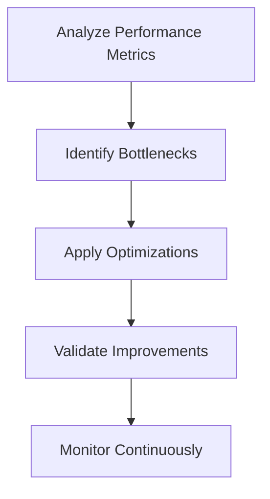

**Diagram sources**
- [skills/performance-optimization/SKILL.md](file://skills/performance-optimization/SKILL.md)
- [config/cache.php](file://config/cache.php)
- [config/database.php](file://config/database.php)
- [config/queue.php](file://config/queue.php)

**Section sources**
- [skills/performance-optimization/SKILL.md](file://skills/performance-optimization/SKILL.md)
- [config/cache.php](file://config/cache.php)
- [config/database.php](file://config/database.php)
- [config/queue.php](file://config/queue.php)

### Debugging and Error Recovery Skills
Debugging skills provide structured approaches to diagnosing issues, isolating failures, and implementing resilient error handling. They complement Laravel’s logging and exception management.

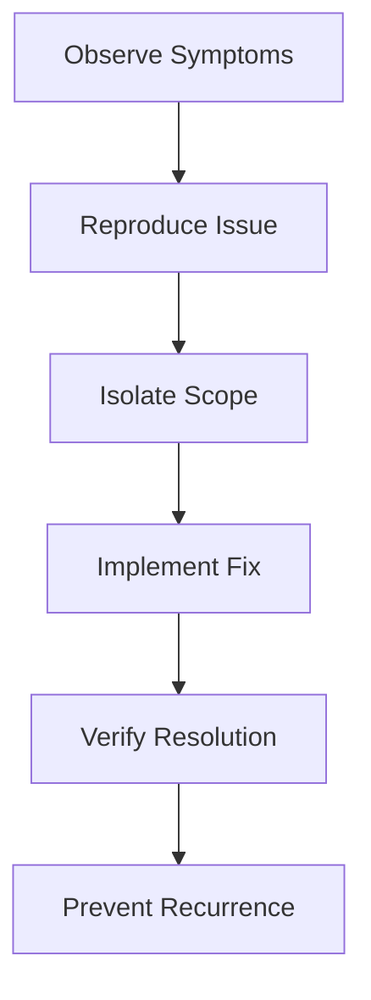

**Diagram sources**
- [skills/debugging-and-error-recovery/SKILL.md](file://skills/debugging-and-error-recovery/SKILL.md)
- [config/logging.php](file://config/logging.php)
- [app/Http/Controllers/RaporController.php](file://app/Http/Controllers/RaporController.php)

**Section sources**
- [skills/debugging-and-error-recovery/SKILL.md](file://skills/debugging-and-error-recovery/SKILL.md)
- [config/logging.php](file://config/logging.php)
- [app/Http/Controllers/RaporController.php](file://app/Http/Controllers/RaporController.php)

### Code Review and Quality Skills
Code review skills enforce style consistency, detect anti-patterns, and ensure adherence to best practices. They integrate with Laravel’s architecture and testing guidelines.

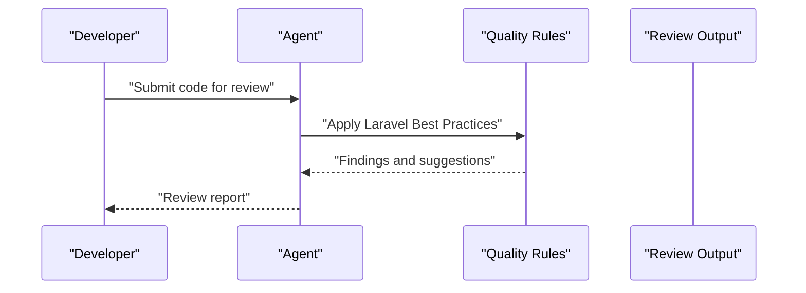

**Diagram sources**
- [skills/code-review-and-quality/SKILL.md](file://skills/code-review-and-quality/SKILL.md)
- [.agents/skills/laravel-best-practices/SKILL.md](file://.agents/skills/laravel-best-practices/SKILL.md)

**Section sources**
- [skills/code-review-and-quality/SKILL.md](file://skills/code-review-and-quality/SKILL.md)
- [.agents/skills/laravel-best-practices/SKILL.md](file://.agents/skills/laravel-best-practices/SKILL.md)

### Git Workflow and Versioning Skills
Git workflow skills standardize branching, commit messages, and release procedures. They support CI/CD automation and maintain a clean history.

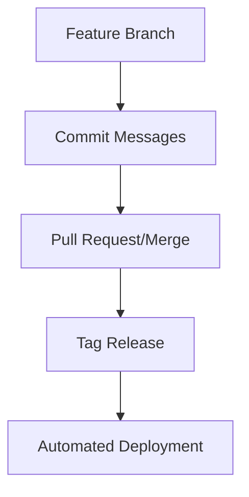

**Diagram sources**
- [skills/git-workflow-and-versioning/SKILL.md](file://skills/git-workflow-and-versioning/SKILL.md)
- [.github/workflows/test.yml](file://.github/workflows/test.yml)
- [.github/workflows/deploy.yml](file://.github/workflows/deploy.yml)

**Section sources**
- [skills/git-workflow-and-versioning/SKILL.md](file://skills/git-workflow-and-versioning/SKILL.md)
- [.github/workflows/test.yml](file://.github/workflows/test.yml)
- [.github/workflows/deploy.yml](file://.github/workflows/deploy.yml)

### Documentation and ADRs Skills
Documentation skills ensure that decisions and designs are recorded and discoverable. They promote transparency and continuity across teams.

**Section sources**
- [skills/documentation-and-adrs/SKILL.md](file://skills/documentation-and-adrs/SKILL.md)

### Specification-Driven and Test-Driven Development Skills
Specification-driven and test-driven development skills guide iterative development with clear acceptance criteria and automated tests.

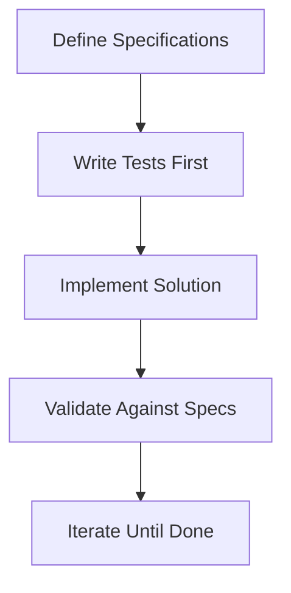

**Diagram sources**
- [skills/spec-driven-development/SKILL.md](file://skills/spec-driven-development/SKILL.md)
- [skills/test-driven-development/SKILL.md](file://skills/test-driven-development/SKILL.md)

**Section sources**
- [skills/spec-driven-development/SKILL.md](file://skills/spec-driven-development/SKILL.md)
- [skills/test-driven-development/SKILL.md](file://skills/test-driven-development/SKILL.md)

### Source-Driven and Context Engineering Skills
Source-driven and context engineering skills help agents understand existing codebases and propose meaningful changes grounded in context.

**Section sources**
- [skills/source-driven-development/SKILL.md](file://skills/source-driven-development/SKILL.md)
- [skills/context-engineering/SKILL.md](file://skills/context-engineering/SKILL.md)

### Planning and Task Breakdown Skills
Planning skills decompose complex tasks into actionable steps, estimate effort, and track progress.

**Section sources**
- [skills/planning-and-task-breakdown/SKILL.md](file://skills/planning-and-task-breakdown/SKILL.md)

### Deprecation and Migration Skills
Deprecation and migration skills manage legacy code transitions, ensuring backward compatibility and smooth upgrades.

**Section sources**
- [skills/deprecation-and-migration/SKILL.md](file://skills/deprecation-and-migration/SKILL.md)

### Using Agent Skills Skills
This skill demonstrates how to configure and invoke agent capabilities effectively, including selecting appropriate skills and interpreting outputs.

**Section sources**
- [skills/using-agent-skills/SKILL.md](file://skills/using-agent-skills/SKILL.md)

### Agent Configuration and Integration
Agent configuration files define runtime settings for Claude and Gemini, enabling tailored behavior per environment and team needs.

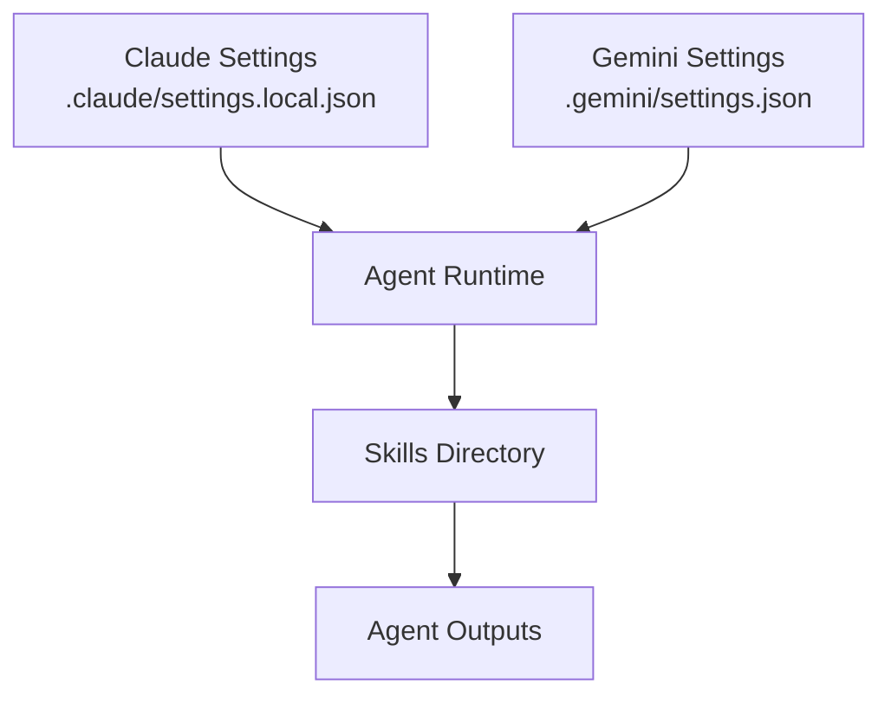

**Diagram sources**
- [.claude/settings.local.json](file://.claude/settings.local.json)
- [.gemini/settings.json](file://.gemini/settings.json)
- [skills/using-agent-skills/SKILL.md](file://skills/using-agent-skills/SKILL.md)

**Section sources**
- [.claude/settings.local.json](file://.claude/settings.local.json)
- [.gemini/settings.json](file://.gemini/settings.json)
- [CLAUDE.md](file://CLAUDE.md)
- [GEMINI.md](file://GEMINI.md)

### Practical Examples of Agent-Assisted Development
- Generating Laravel controllers aligned with best practices and resource patterns
- Creating API endpoints with proper routing, validation, and response transformation
- Writing tests for controllers and services using TDD/BDD approaches
- Optimizing database queries and caching strategies
- Automating CI/CD pipelines for testing and deployment
- Debugging runtime errors and suggesting fixes
- Refactoring legacy code to modern Laravel patterns

**Section sources**
- [app/Http/Controllers/RaporController.php](file://app/Http/Controllers/RaporController.php)
- [app/Services/RaporService.php](file://app/Services/RaporService.php)
- [app/Http/Resources/V1/SiswaResource.php](file://app/Http/Resources/V1/SiswaResource.php)
- [routes/api.php](file://routes/api.php)
- [.github/workflows/test.yml](file://.github/workflows/test.yml)
- [.github/workflows/deploy.yml](file://.github/workflows/deploy.yml)

## Dependency Analysis
The agent skills framework depends on:
- Agent configuration files for Claude and Gemini
- Skill definitions under .agents/skills and skills
- Laravel configuration files for cache, database, queue, services, logging, mail, session, and auth
- GitHub Actions workflows for CI/CD
- Application components (controllers, services, models) that apply skills

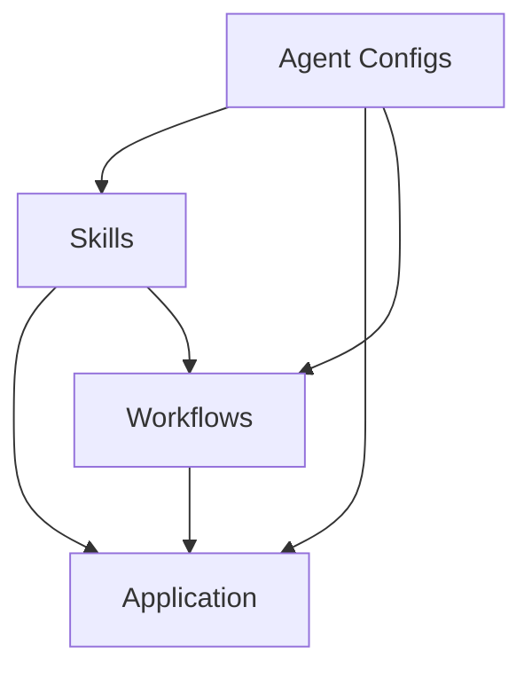

**Diagram sources**
- [.claude/settings.local.json](file://.claude/settings.local.json)
- [.gemini/settings.json](file://.gemini/settings.json)
- [.agents/skills/laravel-best-practices/SKILL.md](file://.agents/skills/laravel-best-practices/SKILL.md)
- [skills/api-and-interface-design/SKILL.md](file://skills/api-and-interface-design/SKILL.md)
- [skills/ci-cd-and-automation/SKILL.md](file://skills/ci-cd-and-automation/SKILL.md)
- [config/cache.php](file://config/cache.php)
- [config/database.php](file://config/database.php)
- [config/queue.php](file://config/queue.php)
- [config/services.php](file://config/services.php)
- [config/logging.php](file://config/logging.php)
- [config/mail.php](file://config/mail.php)
- [config/session.php](file://config/session.php)
- [config/auth.php](file://config/auth.php)
- [.github/workflows/test.yml](file://.github/workflows/test.yml)
- [.github/workflows/deploy.yml](file://.github/workflows/deploy.yml)
- [app/Http/Controllers/RaporController.php](file://app/Http/Controllers/RaporController.php)
- [app/Services/RaporService.php](file://app/Services/RaporService.php)

**Section sources**
- [.claude/settings.local.json](file://.claude/settings.local.json)
- [.gemini/settings.json](file://.gemini/settings.json)
- [.agents/skills/laravel-best-practices/SKILL.md](file://.agents/skills/laravel-best-practices/SKILL.md)
- [skills/api-and-interface-design/SKILL.md](file://skills/api-and-interface-design/SKILL.md)
- [skills/ci-cd-and-automation/SKILL.md](file://skills/ci-cd-and-automation/SKILL.md)
- [config/cache.php](file://config/cache.php)
- [config/database.php](file://config/database.php)
- [config/queue.php](file://config/queue.php)
- [config/services.php](file://config/services.php)
- [config/logging.php](file://config/logging.php)
- [config/mail.php](file://config/mail.php)
- [config/session.php](file://config/session.php)
- [config/auth.php](file://config/auth.php)
- [.github/workflows/test.yml](file://.github/workflows/test.yml)
- [.github/workflows/deploy.yml](file://.github/workflows/deploy.yml)
- [app/Http/Controllers/RaporController.php](file://app/Http/Controllers/RaporController.php)
- [app/Services/RaporService.php](file://app/Services/RaporService.php)

## Performance Considerations
- Use caching strategies defined in configuration to minimize repeated computations.
- Apply Laravel best practices for database performance to reduce query load.
- Leverage queue workers for background tasks to keep the application responsive.
- Monitor logs and metrics to identify performance regressions early.

[No sources needed since this section provides general guidance]

## Troubleshooting Guide
- Validate agent settings files for correctness and completeness.
- Confirm that CI/CD workflows are triggered on expected branches and events.
- Review Laravel configuration files for cache, database, queue, and logging.
- Inspect application logs for error traces and stack traces.
- Use debugging skills to isolate and resolve runtime issues.

**Section sources**
- [.claude/settings.local.json](file://.claude/settings.local.json)
- [.gemini/settings.json](file://.gemini/settings.json)
- [.github/workflows/test.yml](file://.github/workflows/test.yml)
- [.github/workflows/deploy.yml](file://.github/workflows/deploy.yml)
- [config/cache.php](file://config/cache.php)
- [config/database.php](file://config/database.php)
- [config/queue.php](file://config/queue.php)
- [config/logging.php](file://config/logging.php)
- [app/Http/Controllers/RaporController.php](file://app/Http/Controllers/RaporController.php)

## Conclusion
The agent skills framework in RaporKM Laravel provides a structured, extensible approach to integrating AI agents into the development lifecycle. By organizing skills into domain-specific categories, maintaining clear configurations, and aligning with Laravel best practices, teams can accelerate development, improve quality, and streamline operations. Adopting the recommended practices and addressing limitations and ethical considerations ensures responsible and effective use of AI-assisted development.

[No sources needed since this section summarizes without analyzing specific files]

## Appendices
- Agent integration guides: consult the central agent documentation for Claude and Gemini.
- Skill directories: explore .agents/skills and skills for comprehensive coverage.
- Configuration files: adjust Claude and Gemini settings to match project needs.
- Workflows: review CI/CD workflows for testing and deployment automation.
- Application usage: study controllers, services, and models to see skills in action.

**Section sources**
- [AGENTS.md](file://AGENTS.md)
- [CLAUDE.md](file://CLAUDE.md)
- [GEMINI.md](file://GEMINI.md)
- [.agents/skills/laravel-best-practices/SKILL.md](file://.agents/skills/laravel-best-practices/SKILL.md)
- [skills/using-agent-skills/SKILL.md](file://skills/using-agent-skills/SKILL.md)
- [.claude/settings.local.json](file://.claude/settings.local.json)
- [.gemini/settings.json](file://.gemini/settings.json)
- [.github/workflows/test.yml](file://.github/workflows/test.yml)
- [.github/workflows/deploy.yml](file://.github/workflows/deploy.yml)
- [app/Http/Controllers/RaporController.php](file://app/Http/Controllers/RaporController.php)
- [app/Services/RaporService.php](file://app/Services/RaporService.php)