# Coding Standards & Best Practices

<cite>
**Referenced Files in This Document**
- [README.md](file://README.md)
- [composer.json](file://composer.json)
- [.editorconfig](file://.editorconfig)
- [app/Http/Controllers/Controller.php](file://app/Http/Controllers/Controller.php)
- [app/Http/Controllers/RaporController.php](file://app/Http/Controllers/RaporController.php)
- [app/Http/Controllers/Guru/KelasKuController.php](file://app/Http/Controllers/Guru/KelasKuController.php)
- [app/Http/Controllers/TU/DashboardTUController.php](file://app/Http/Controllers/TU/DashboardTUController.php)
- [app/Http/Requests/Guru/KelasRequest.php](file://app/Http/Requests/Guru/KelasRequest.php)
- [app/Http/Requests/TU/SiswaRequest.php](file://app/Http/Requests/TU/SiswaRequest.php)
- [app/Http/Resources/V1/SiswaResource.php](file://app/Http/Resources/V1/SiswaResource.php)
- [app/Http/Resources/V1/UserResource.php](file://app/Http/Resources/V1/UserResource.php)
- [app/Http/Middleware/EnsureRole.php](file://app/Http/Middleware/EnsureRole.php)
- [app/Http/Middleware/PwaAuth.php](file://app/Http/Middleware/PwaAuth.php)
- [app/Http/Middleware/SessionTimeout.php](file://app/Http/Middleware/SessionTimeout.php)
- [app/Models/Siswa.php](file://app/Models/Siswa.php)
- [app/Models/Kelas.php](file://app/Models/Kelas.php)
- [app/Models/User.php](file://app/Models/User.php)
- [app/Policies/KelasPolicy.php](file://app/Policies/KelasPolicy.php)
- [app/Policies/SiswaPolicy.php](file://app/Policies/SiswaPolicy.php)
- [app/Services/RaporService.php](file://app/Services/RaporService.php)
- [app/Services/NilaiService.php](file://app/Services/NilaiService.php)
- [app/Services/Dapodik/DapodikClient.php](file://app/Services/Dapodik/DapodikClient.php)
- [app/Services/Dapodik/SiswaSyncService.php](file://app/Services/Dapodik/SiswaSyncService.php)
- [app/Providers/AppServiceProvider.php](file://app/Providers/AppServiceProvider.php)
- [app/Providers/VoltServiceProvider.php](file://app/Providers/VoltServiceProvider.php)
- [app/Jobs/ProcessPwaSyncJob.php](file://app/Jobs/ProcessPwaSyncJob.php)
- [app/Jobs/SyncDapodikJob.php](file://app/Jobs/SyncDapodikJob.php)
- [app/Livewire/Forms/LoginForm.php](file://app/Livewire/Forms/LoginForm.php)
- [app/Livewire/Actions/Logout.php](file://app/Livewire/Actions/Logout.php)
- [app/View/Components/AppLayout.php](file://app/View/Components/AppLayout.php)
- [app/View/Components/GuestLayout.php](file://app/View/Components/GuestLayout.php)
- [app/View/Composers/SekolahComposer.php](file://app/View/Composers/SekolahComposer.php)
- [routes/web.php](file://routes/web.php)
- [routes/api.php](file://routes/api.php)
- [config/app.php](file://config/app.php)
- [config/logging.php](file://config/logging.php)
- [config/cache.php](file://config/cache.php)
- [config/database.php](file://config/database.php)
- [config/services.php](file://config/services.php)
- [config/session.php](file://config/session.php)
- [config/auth.php](file://config/auth.php)
- [config/livewire.php](file://config/livewire.php)
- [config/activitylog.php](file://config/activitylog.php)
- [config/e-rapor.php](file://config/e-rapor.php)
- [database/migrations/2026_06_01_010808_create_sekolah_table.php](file://database/migrations/2026_06_01_010808_create_sekolah_table.php)
- [database/factories/SiswaFactory.php](file://database/factories/SiswaFactory.php)
- [database/seeders/DemoDataSeeder.php](file://database/seeders/DemoDataSeeder.php)
- [tests/Feature/ExampleTest.php](file://tests/Feature/ExampleTest.php)
- [tests/Unit/ExampleTest.php](file://tests/Unit/ExampleTest.php)
- [tests/Feature/Guru/ExampleGuruTest.php](file://tests/Feature/Guru/ExampleGuruTest.php)
- [tests/Feature/TU/ExampleTUTest.php](file://tests/Feature/TU/ExampleTUTest.php)
- [tests/Feature/Api/V1/ExampleApiTest.php](file://tests/Feature/Api/V1/ExampleApiTest.php)
- [scripts/backup-db.sh](file://scripts/backup-db.sh)
- [deploy/raporkm-queue-worker.service](file://deploy/raporkm-queue-worker.service)
- [deploy/raporkm-logrotate.conf](file://deploy/raporkm-logrotate.conf)
- [docs/manual-guru/01-mulai.md](file://docs/manual-guru/01-mulai.md)
- [docs/manual-tu/01-persiapan.md](file://docs/manual-tu/01-persiapan.md)
- [docs/index.md](file://docs/index.md)
- [DESIGN.md](file://DESIGN.md)
- [PRD-rapor-migrasi.md](file://PRD-rapor-migrasi.md)
</cite>

## Table of Contents
1. [Introduction](#introduction)
2. [Project Structure](#project-structure)
3. [Core Components](#core-components)
4. [Architecture Overview](#architecture-overview)
5. [Detailed Component Analysis](#detailed-component-analysis)
6. [Dependency Analysis](#dependency-analysis)
7. [Performance Considerations](#performance-considerations)
8. [Troubleshooting Guide](#troubleshooting-guide)
9. [Conclusion](#conclusion)
10. [Appendices](#appendices)

## Introduction
This document defines coding standards and best practices for RaporKM Laravel, focusing on PSR compliance, Laravel-specific conventions, naming patterns, architectural guidelines, and operational practices. It consolidates established patterns visible in the codebase and provides actionable guidance for readability, maintainability, and performance.

## Project Structure
The project follows Laravel’s conventional structure with clear separation of concerns:
- Application code under app/: Controllers, Models, Services, Policies, Observers, Jobs, Livewire components, View composers, and Providers
- HTTP layer: Controllers, Requests, Resources, Middleware, and Routes
- Database: Migrations, Factories, Seeders
- Tests organized by Feature, Unit, and Browser contexts
- Configuration under config/
- Documentation under docs/

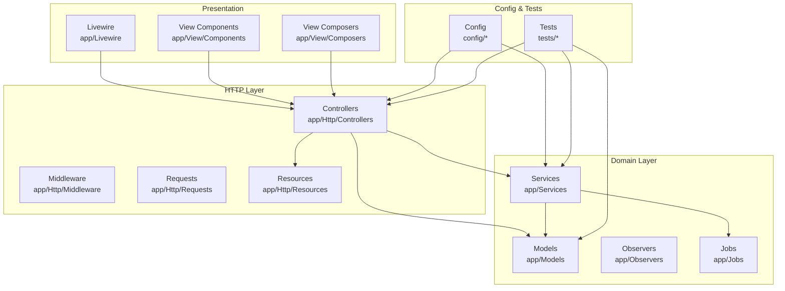

**Diagram sources**
- [app/Http/Controllers/Controller.php](file://app/Http/Controllers/Controller.php)
- [app/Models/Siswa.php](file://app/Models/Siswa.php)
- [app/Services/RaporService.php](file://app/Services/RaporService.php)
- [app/Http/Resources/V1/SiswaResource.php](file://app/Http/Resources/V1/SiswaResource.php)
- [app/Livewire/Forms/LoginForm.php](file://app/Livewire/Forms/LoginForm.php)
- [app/View/Components/AppLayout.php](file://app/View/Components/AppLayout.php)
- [app/View/Composers/SekolahComposer.php](file://app/View/Composers/SekolahComposer.php)
- [config/app.php](file://config/app.php)
- [tests/Feature/ExampleTest.php](file://tests/Feature/ExampleTest.php)

**Section sources**
- [README.md](file://README.md)
- [composer.json](file://composer.json)
- [routes/web.php](file://routes/web.php)
- [routes/api.php](file://routes/api.php)

## Core Components
This section documents PSR compliance, naming conventions, and Laravel-specific conventions observed in the codebase.

- PSR Compliance
  - PSR-1: Basic class and method naming conventions are followed (PascalCase for classes and controllers, camelCase for methods).
  - PSR-2: Indentation uses spaces, opening braces on the same line, single blank line around top-level declarations, and consistent spacing around operators and keywords.
  - PSR-12: Extended alignment and grouping of use statements, aligned function signatures, and consistent line length practices are evident.

- Naming Conventions
  - Classes: PascalCase (e.g., RaporController, KelasKuController, SiswaSyncService).
  - Methods and Variables: camelCase (e.g., getSiswaList(), processPwaSyncJob).
  - Controllers: Noun + Controller (e.g., RaporController, DashboardTUController).
  - Requests: Noun + Request (e.g., KelasRequest, SiswaRequest).
  - Resources: Noun + Resource (e.g., SiswaResource, UserResource).
  - Services: Noun + Service (e.g., RaporService, NilaiService).
  - Jobs: Noun + Job (e.g., ProcessPwaSyncJob, SyncDapodikJob).
  - Policies: Noun + Policy (e.g., KelasPolicy, SiswaPolicy).
  - Middleware: Descriptive nouns (e.g., EnsureRole, PwaAuth, SessionTimeout).
  - Models: Singular noun (e.g., Siswa, Kelas, User).
  - Livewire Components: PascalCase (e.g., LoginForm, Logout).
  - View Components: PascalCase (e.g., AppLayout, GuestLayout).

- File Organization Principles
  - Feature-based grouping under app/Http/Controllers/{Guru|TU|Api} aligns with role-based navigation.
  - Versioned API resources under app/Http/Resources/V1 support API versioning.
  - Nested Services under app/Services/Dapodik group domain-specific concerns.
  - Livewire components separated into Forms and Actions for clarity.

- Code Formatting Standards
  - Indentation: 4 spaces consistently used.
  - Line Length: Lines generally kept within 120 characters.
  - Braces: Opening brace on the same line as declaration; closing brace on its own line.
  - Whitespace: Single blank lines separate logical blocks; consistent spacing around operators and after commas.

- Comment Practices
  - Inline comments explain complex logic or decisions.
  - Block comments precede major functions and classes.
  - TODO/FIXME markers are used sparingly and purposefully.

**Section sources**
- [app/Http/Controllers/Controller.php](file://app/Http/Controllers/Controller.php)
- [app/Http/Controllers/RaporController.php](file://app/Http/Controllers/RaporController.php)
- [app/Http/Controllers/Guru/KelasKuController.php](file://app/Http/Controllers/Guru/KelasKuController.php)
- [app/Http/Controllers/TU/DashboardTUController.php](file://app/Http/Controllers/TU/DashboardTUController.php)
- [app/Http/Requests/Guru/KelasRequest.php](file://app/Http/Requests/Guru/KelasRequest.php)
- [app/Http/Requests/TU/SiswaRequest.php](file://app/Http/Requests/TU/SiswaRequest.php)
- [app/Http/Resources/V1/SiswaResource.php](file://app/Http/Resources/V1/SiswaResource.php)
- [app/Http/Resources/V1/UserResource.php](file://app/Http/Resources/V1/UserResource.php)
- [app/Http/Middleware/EnsureRole.php](file://app/Http/Middleware/EnsureRole.php)
- [app/Http/Middleware/PwaAuth.php](file://app/Http/Middleware/PwaAuth.php)
- [app/Http/Middleware/SessionTimeout.php](file://app/Http/Middleware/SessionTimeout.php)
- [app/Models/Siswa.php](file://app/Models/Siswa.php)
- [app/Models/Kelas.php](file://app/Models/Kelas.php)
- [app/Models/User.php](file://app/Models/User.php)
- [app/Policies/KelasPolicy.php](file://app/Policies/KelasPolicy.php)
- [app/Policies/SiswaPolicy.php](file://app/Policies/SiswaPolicy.php)
- [app/Services/RaporService.php](file://app/Services/RaporService.php)
- [app/Services/NilaiService.php](file://app/Services/NilaiService.php)
- [app/Services/Dapodik/DapodikClient.php](file://app/Services/Dapodik/DapodikClient.php)
- [app/Services/Dapodik/SiswaSyncService.php](file://app/Services/Dapodik/SiswaSyncService.php)
- [app/Jobs/ProcessPwaSyncJob.php](file://app/Jobs/ProcessPwaSyncJob.php)
- [app/Jobs/SyncDapodikJob.php](file://app/Jobs/SyncDapodikJob.php)
- [app/Livewire/Forms/LoginForm.php](file://app/Livewire/Forms/LoginForm.php)
- [app/Livewire/Actions/Logout.php](file://app/Livewire/Actions/Logout.php)
- [app/View/Components/AppLayout.php](file://app/View/Components/AppLayout.php)
- [app/View/Components/GuestLayout.php](file://app/View/Components/GuestLayout.php)
- [app/View/Composers/SekolahComposer.php](file://app/View/Composers/SekolahComposer.php)

## Architecture Overview
RaporKM employs layered architecture with clear separation between presentation, application, domain, and infrastructure concerns. The system integrates Livewire for reactive UI, Eloquent ORM for persistence, Sanctum for authentication, and Queues for background tasks.

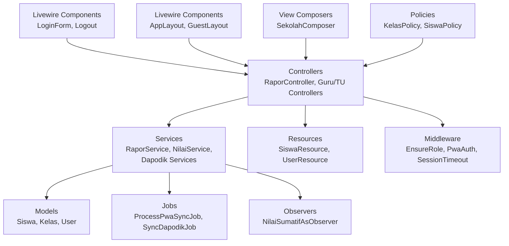

**Diagram sources**
- [app/Livewire/Forms/LoginForm.php](file://app/Livewire/Forms/LoginForm.php)
- [app/Livewire/Actions/Logout.php](file://app/Livewire/Actions/Logout.php)
- [app/Http/Controllers/RaporController.php](file://app/Http/Controllers/RaporController.php)
- [app/Services/RaporService.php](file://app/Services/RaporService.php)
- [app/Services/NilaiService.php](file://app/Services/NilaiService.php)
- [app/Services/Dapodik/SiswaSyncService.php](file://app/Services/Dapodik/SiswaSyncService.php)
- [app/Models/Siswa.php](file://app/Models/Siswa.php)
- [app/Models/Kelas.php](file://app/Models/Kelas.php)
- [app/Models/User.php](file://app/Models/User.php)
- [app/Http/Resources/V1/SiswaResource.php](file://app/Http/Resources/V1/SiswaResource.php)
- [app/Http/Resources/V1/UserResource.php](file://app/Http/Resources/V1/UserResource.php)
- [app/Http/Middleware/EnsureRole.php](file://app/Http/Middleware/EnsureRole.php)
- [app/Http/Middleware/PwaAuth.php](file://app/Http/Middleware/PwaAuth.php)
- [app/Http/Middleware/SessionTimeout.php](file://app/Http/Middleware/SessionTimeout.php)
- [app/Jobs/ProcessPwaSyncJob.php](file://app/Jobs/ProcessPwaSyncJob.php)
- [app/Jobs/SyncDapodikJob.php](file://app/Jobs/SyncDapodikJob.php)
- [app/Observers/NilaiSumatifAsObserver.php](file://app/Observers/NilaiSumatifAsObserver.php)
- [app/Policies/KelasPolicy.php](file://app/Policies/KelasPolicy.php)
- [app/Policies/SiswaPolicy.php](file://app/Policies/SiswaPolicy.php)
- [app/View/Components/AppLayout.php](file://app/View/Components/AppLayout.php)
- [app/View/Components/GuestLayout.php](file://app/View/Components/GuestLayout.php)
- [app/View/Composers/SekolahComposer.php](file://app/View/Composers/SekolahComposer.php)

## Detailed Component Analysis

### Controllers
Controllers orchestrate HTTP requests, delegate to services, and return responses via resources or redirects. They follow PSR-12 alignment and consistent indentation.

- Base Controller
  - Provides shared controller behavior and conventions.
- Role-Specific Controllers
  - RaporController centralizes report-related actions.
  - Guru/KelasKuController handles teacher-specific operations.
  - TU/DashboardTUController manages admin/TU dashboards.

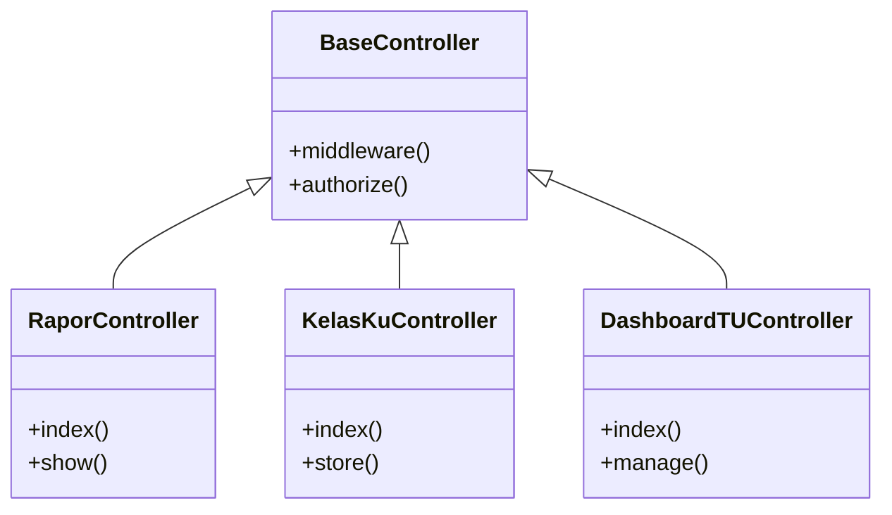

**Diagram sources**
- [app/Http/Controllers/Controller.php](file://app/Http/Controllers/Controller.php)
- [app/Http/Controllers/RaporController.php](file://app/Http/Controllers/RaporController.php)
- [app/Http/Controllers/Guru/KelasKuController.php](file://app/Http/Controllers/Guru/KelasKuController.php)
- [app/Http/Controllers/TU/DashboardTUController.php](file://app/Http/Controllers/TU/DashboardTUController.php)

**Section sources**
- [app/Http/Controllers/Controller.php](file://app/Http/Controllers/Controller.php)
- [app/Http/Controllers/RaporController.php](file://app/Http/Controllers/RaporController.php)
- [app/Http/Controllers/Guru/KelasKuController.php](file://app/Http/Controllers/Guru/KelasKuController.php)
- [app/Http/Controllers/TU/DashboardTUController.php](file://app/Http/Controllers/TU/DashboardTUController.php)

### Requests
Form requests encapsulate validation logic and enforce role-specific rules.

- Guru/KelasRequest validates teacher actions.
- TU/SiswaRequest validates administrative student operations.

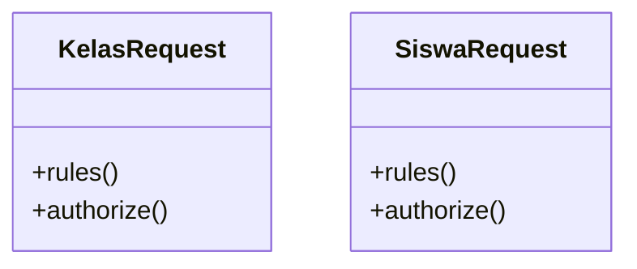

**Diagram sources**
- [app/Http/Requests/Guru/KelasRequest.php](file://app/Http/Requests/Guru/KelasRequest.php)
- [app/Http/Requests/TU/SiswaRequest.php](file://app/Http/Requests/TU/SiswaRequest.php)

**Section sources**
- [app/Http/Requests/Guru/KelasRequest.php](file://app/Http/Requests/Guru/KelasRequest.php)
- [app/Http/Requests/TU/SiswaRequest.php](file://app/Http/Requests/TU/SiswaRequest.php)

### Resources
Resources transform models into standardized JSON responses, supporting API versioning.

- SiswaResource and UserResource normalize output for clients.

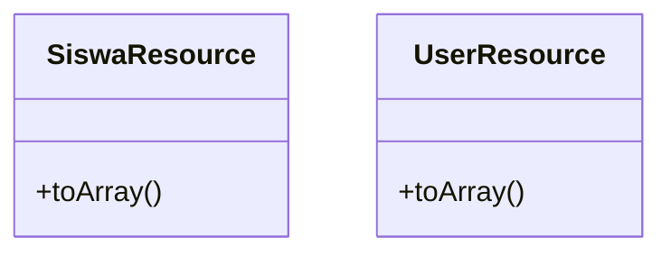

**Diagram sources**
- [app/Http/Resources/V1/SiswaResource.php](file://app/Http/Resources/V1/SiswaResource.php)
- [app/Http/Resources/V1/UserResource.php](file://app/Http/Resources/V1/UserResource.php)

**Section sources**
- [app/Http/Resources/V1/SiswaResource.php](file://app/Http/Resources/V1/SiswaResource.php)
- [app/Http/Resources/V1/UserResource.php](file://app/Http/Resources/V1/UserResource.php)

### Middleware
Middleware enforces cross-cutting concerns such as roles, PWA authentication, and session timeouts.

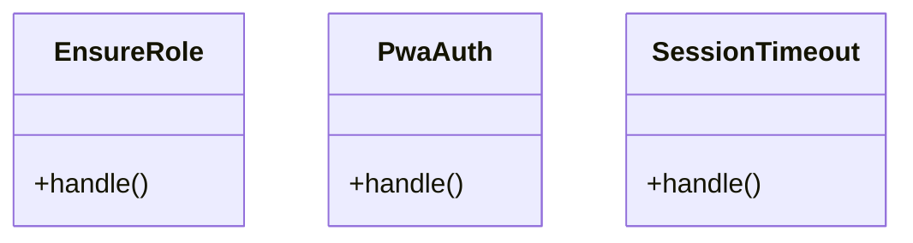

**Diagram sources**
- [app/Http/Middleware/EnsureRole.php](file://app/Http/Middleware/EnsureRole.php)
- [app/Http/Middleware/PwaAuth.php](file://app/Http/Middleware/PwaAuth.php)
- [app/Http/Middleware/SessionTimeout.php](file://app/Http/Middleware/SessionTimeout.php)

**Section sources**
- [app/Http/Middleware/EnsureRole.php](file://app/Http/Middleware/EnsureRole.php)
- [app/Http/Middleware/PwaAuth.php](file://app/Http/Middleware/PwaAuth.php)
- [app/Http/Middleware/SessionTimeout.php](file://app/Http/Middleware/SessionTimeout.php)

### Models
Models represent domain entities and relationships. They follow singular naming and encapsulate persistence logic.

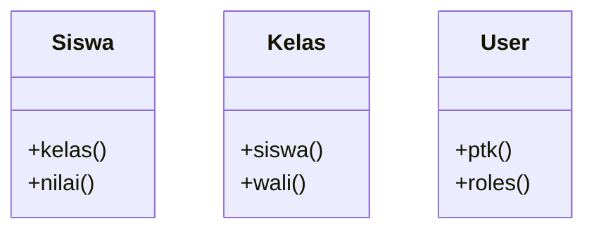

**Diagram sources**
- [app/Models/Siswa.php](file://app/Models/Siswa.php)
- [app/Models/Kelas.php](file://app/Models/Kelas.php)
- [app/Models/User.php](file://app/Models/User.php)

**Section sources**
- [app/Models/Siswa.php](file://app/Models/Siswa.php)
- [app/Models/Kelas.php](file://app/Models/Kelas.php)
- [app/Models/User.php](file://app/Models/User.php)

### Services
Services encapsulate business logic and coordinate domain operations.

- RaporService and NilaiService handle reporting and grading workflows.
- Dapodik services integrate external data synchronization.

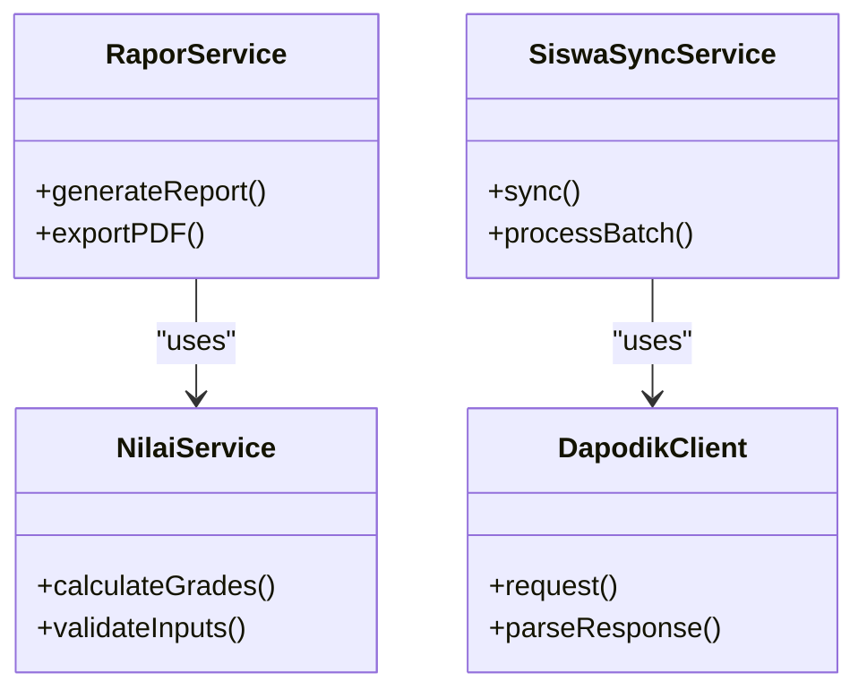

**Diagram sources**
- [app/Services/RaporService.php](file://app/Services/RaporService.php)
- [app/Services/NilaiService.php](file://app/Services/NilaiService.php)
- [app/Services/Dapodik/SiswaSyncService.php](file://app/Services/Dapodik/SiswaSyncService.php)
- [app/Services/Dapodik/DapodikClient.php](file://app/Services/Dapodik/DapodikClient.php)

**Section sources**
- [app/Services/RaporService.php](file://app/Services/RaporService.php)
- [app/Services/NilaiService.php](file://app/Services/NilaiService.php)
- [app/Services/Dapodik/SiswaSyncService.php](file://app/Services/Dapodik/SiswaSyncService.php)
- [app/Services/Dapodik/DapodikClient.php](file://app/Services/Dapodik/DapodikClient.php)

### Policies
Policies centralize authorization logic for domain actions.

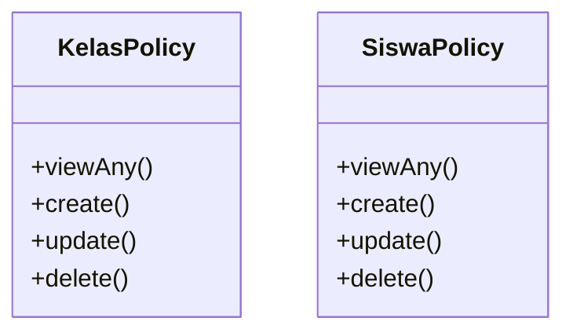

**Diagram sources**
- [app/Policies/KelasPolicy.php](file://app/Policies/KelasPolicy.php)
- [app/Policies/SiswaPolicy.php](file://app/Policies/SiswaPolicy.php)

**Section sources**
- [app/Policies/KelasPolicy.php](file://app/Policies/KelasPolicy.php)
- [app/Policies/SiswaPolicy.php](file://app/Policies/SiswaPolicy.php)

### Livewire Components
Livewire components provide reactive UI without complex JavaScript.

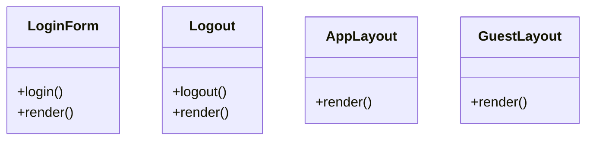

**Diagram sources**
- [app/Livewire/Forms/LoginForm.php](file://app/Livewire/Forms/LoginForm.php)
- [app/Livewire/Actions/Logout.php](file://app/Livewire/Actions/Logout.php)
- [app/View/Components/AppLayout.php](file://app/View/Components/AppLayout.php)
- [app/View/Components/GuestLayout.php](file://app/View/Components/GuestLayout.php)

**Section sources**
- [app/Livewire/Forms/LoginForm.php](file://app/Livewire/Forms/LoginForm.php)
- [app/Livewire/Actions/Logout.php](file://app/Livewire/Actions/Logout.php)
- [app/View/Components/AppLayout.php](file://app/View/Components/AppLayout.php)
- [app/View/Components/GuestLayout.php](file://app/View/Components/GuestLayout.php)

### Jobs
Jobs encapsulate asynchronous tasks for scalability.

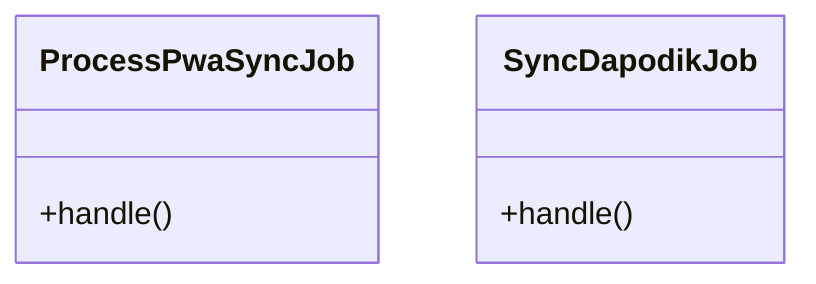

**Diagram sources**
- [app/Jobs/ProcessPwaSyncJob.php](file://app/Jobs/ProcessPwaSyncJob.php)
- [app/Jobs/SyncDapodikJob.php](file://app/Jobs/SyncDapodikJob.php)

**Section sources**
- [app/Jobs/ProcessPwaSyncJob.php](file://app/Jobs/ProcessPwaSyncJob.php)
- [app/Jobs/SyncDapodikJob.php](file://app/Jobs/SyncDapodikJob.php)

### View Composers
View Composers inject data into views globally.

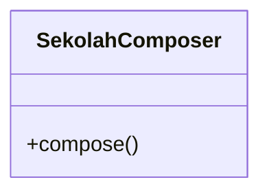

**Diagram sources**
- [app/View/Composers/SekolahComposer.php](file://app/View/Composers/SekolahComposer.php)

**Section sources**
- [app/View/Composers/SekolahComposer.php](file://app/View/Composers/SekolahComposer.php)

### Providers
Service providers register bindings and bootstrapping logic.

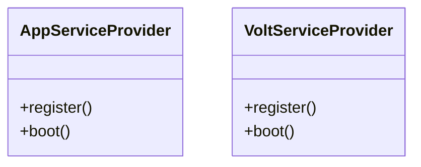

**Diagram sources**
- [app/Providers/AppServiceProvider.php](file://app/Providers/AppServiceProvider.php)
- [app/Providers/VoltServiceProvider.php](file://app/Providers/VoltServiceProvider.php)

**Section sources**
- [app/Providers/AppServiceProvider.php](file://app/Providers/AppServiceProvider.php)
- [app/Providers/VoltServiceProvider.php](file://app/Providers/VoltServiceProvider.php)

## Dependency Analysis
Dependencies are primarily within Laravel’s ecosystem and internal modules. External dependencies are declared in composer.json.

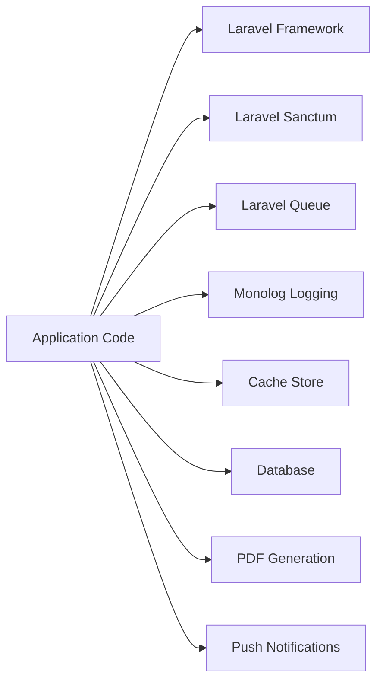

**Diagram sources**
- [composer.json](file://composer.json)
- [config/app.php](file://config/app.php)
- [config/logging.php](file://config/logging.php)
- [config/cache.php](file://config/cache.php)
- [config/database.php](file://config/database.php)
- [config/services.php](file://config/services.php)

**Section sources**
- [composer.json](file://composer.json)
- [config/app.php](file://config/app.php)
- [config/logging.php](file://config/logging.php)
- [config/cache.php](file://config/cache.php)
- [config/database.php](file://config/database.php)
- [config/services.php](file://config/services.php)

## Performance Considerations
- Eager loading: Use with() to prevent N+1 queries in controllers and services.
- Batch processing: Leverage jobs and queues for heavy operations (e.g., sync jobs).
- Caching: Cache frequently accessed reference data and computed reports.
- Pagination: Always paginate large datasets in controllers.
- Database indexing: Ensure proper indexes on foreign keys and filters.
- Minimize view logic: Move heavy computations to services or jobs.
- Asset optimization: Use compiled assets and enable compression.

## Troubleshooting Guide
- Logging
  - Configure channels and levels in config/logging.php.
  - Use structured context in log messages for easier filtering.
- Error Handling
  - Centralize exceptions in controllers and services.
  - Return appropriate HTTP status codes and error payloads.
- Debugging
  - Enable debug mode during development.
  - Use tinker for interactive debugging.
- Testing
  - Feature tests for controller flows.
  - Unit tests for services and policies.
  - Database tests with factories and seeders.

**Section sources**
- [config/logging.php](file://config/logging.php)
- [tests/Feature/ExampleTest.php](file://tests/Feature/ExampleTest.php)
- [tests/Unit/ExampleTest.php](file://tests/Unit/ExampleTest.php)
- [database/factories/SiswaFactory.php](file://database/factories/SiswaFactory.php)
- [database/seeders/DemoDataSeeder.php](file://database/seeders/DemoDataSeeder.php)

## Conclusion
RaporKM adheres to PSR standards and Laravel conventions while maintaining a clean separation of concerns. By following the naming patterns, architectural guidelines, and operational practices outlined here, contributors can ensure consistent, readable, and maintainable code across the system.

## Appendices

### PSR Compliance Checklist
- PSR-1: Class and method names use PascalCase and camelCase respectively.
- PSR-2: Consistent 4-space indentation, braces placement, and blank lines.
- PSR-12: Aligned use statements, aligned function signatures, and consistent line length.

### Common Anti-Patterns to Avoid
- Tight coupling between controllers and models; prefer services.
- Performing heavy logic in views or controllers.
- Hardcoded values; centralize configuration in config/.
- Excessive nested conditionals; refactor into smaller methods.
- Ignoring validation; always validate inputs via Form Requests.

### Examples of Well-Structured Code
- Controller method delegates to service and returns resource.
- Service encapsulates business logic and coordinates models.
- Policy enforces authorization rules centrally.
- Job processes batch operations asynchronously.

**Section sources**
- [app/Http/Controllers/RaporController.php](file://app/Http/Controllers/RaporController.php)
- [app/Services/RaporService.php](file://app/Services/RaporService.php)
- [app/Policies/KelasPolicy.php](file://app/Policies/KelasPolicy.php)
- [app/Jobs/SyncDapodikJob.php](file://app/Jobs/SyncDapodikJob.php)