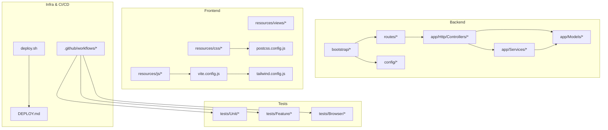
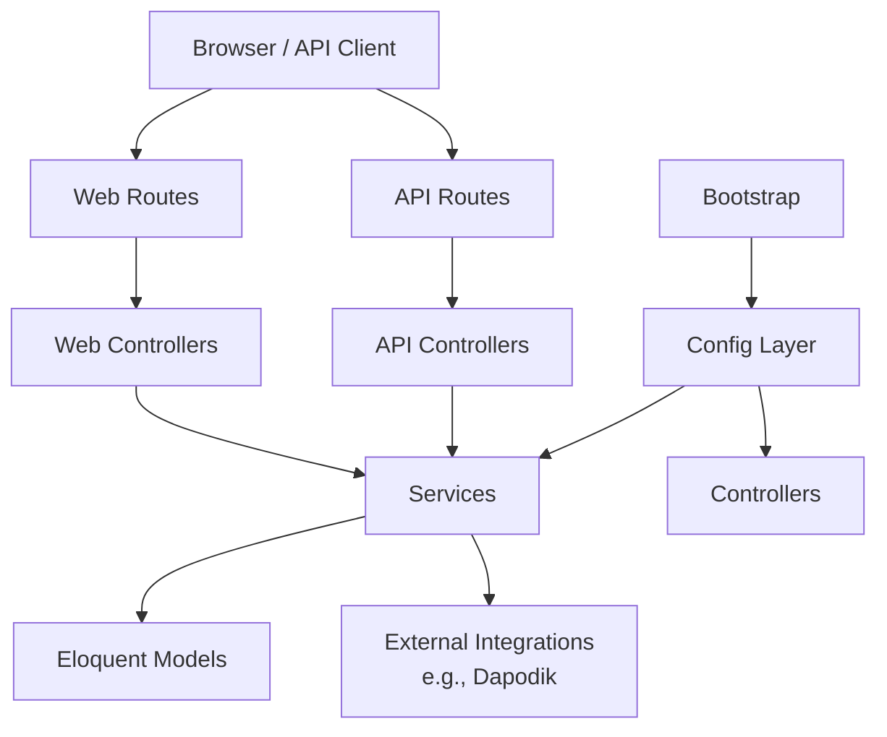
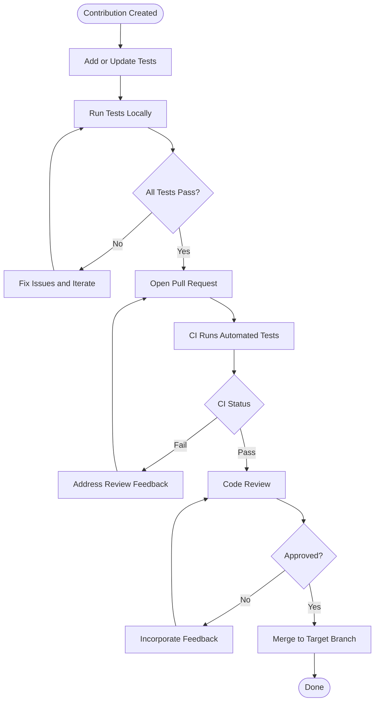
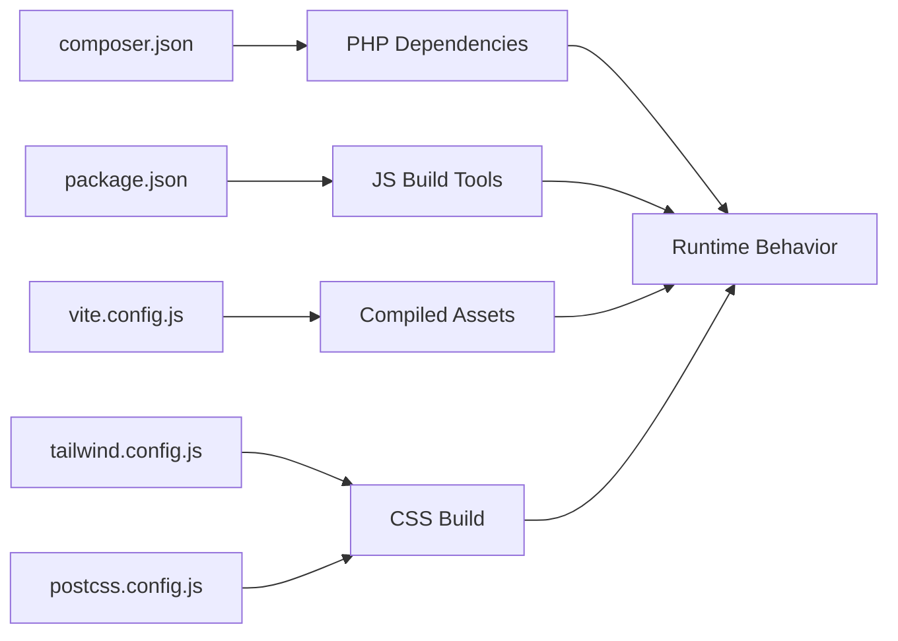

# Contribution Guidelines

<cite>
**Referenced Files in This Document**
- [README.md](file://README.md)
- [.github/workflows/test.yml](file://.github/workflows/test.yml)
- [.github/workflows/deploy.yml](file://.github/workflows/deploy.yml)
- [composer.json](file://composer.json)
- [package.json](file://package.json)
- [phpunit.xml](file://phpunit.xml)
- [tests/TestCase.php](file://tests/TestCase.php)
- [tests/Browser/UatBase.php](file://tests/Browser/UatBase.php)
- [docs/index.md](file://docs/index.md)
- [docs/manual-guru/index.md](file://docs/manual-guru/index.md)
- [docs/manual-tu/index.md](file://docs/manual-tu/index.md)
- [app/Http/Controllers/Controller.php](file://app/Http/Controllers/Controller.php)
- [app/Services/RaporService.php](file://app/Services/RaporService.php)
- [app/Services/DapodikService.php](file://app/Services/DapodikService.php)
- [app/Models/Siswa.php](file://app/Models/Siswa.php)
- [app/Models/Kelas.php](file://app/Models/Kelas.php)
- [routes/web.php](file://routes/web.php)
- [routes/api.php](file://routes/api.php)
- [config/app.php](file://config/app.php)
- [config/cache.php](file://config/cache.php)
- [config/database.php](file://config/database.php)
- [config/logging.php](file://config/logging.php)
- [config/session.php](file://config/session.php)
- [config/services.php](file://config/services.php)
- [bootstrap/app.php](file://bootstrap/app.php)
- [public/index.php](file://public/index.php)
- [resources/js/app.js](file://resources/js/app.js)
- [resources/css/app.css](file://resources/css/app.css)
- [vite.config.js](file://vite.config.js)
- [tailwind.config.js](file://tailwind.config.js)
- [postcss.config.js](file://postcss.config.js)
- [deploy.sh](file://deploy.sh)
- [DEPLOY.md](file://DEPLOY.md)
- [AGENTS.md](file://AGENTS.md)
- [CLAUDE.md](file://CLAUDE.md)
- [GEMINI.md](file://GEMINI.md)
- [DESIGN.md](file://DESIGN.md)
- [progres-pengerjaan.md](file://progres-pengerjaan.md)
- [PRD-rapor-migrasi.md](file://PRD-rapor-migrasi.md)
</cite>

## Table of Contents
1. [Introduction](#introduction)
2. [Project Structure](#project-structure)
3. [Core Components](#core-components)
4. [Architecture Overview](#architecture-overview)
5. [Detailed Component Analysis](#detailed-component-analysis)
6. [Dependency Analysis](#dependency-analysis)
7. [Performance Considerations](#performance-considerations)
8. [Troubleshooting Guide](#troubleshooting-guide)
9. [Conclusion](#conclusion)
10. [Appendices](#appendices)

## Introduction
This document provides comprehensive contribution guidelines for the RaporKM Laravel project. It covers how to set up a development environment, submit contributions via forks and branches, open pull requests, meet code quality and testing standards, document changes, and participate in reviews. It also outlines issue reporting, bug fixes, feature enhancements, community norms, and deployment practices observed in the repository.

## Project Structure
RaporKM is a Laravel application with a modern frontend stack. The repository includes:
- Backend: Laravel application under the app/ directory, with controllers, models, services, policies, jobs, Livewire components, and resources.
- Frontend: Blade templates, Vite-powered JavaScript and CSS assets.
- Tests: PHPUnit unit and feature tests, Dusk browser tests, and UAT suites.
- Workflows: GitHub Actions for automated testing and deployment.
- Docs: User manuals for teachers and staff, plus design and agent-related documentation.

**Diagram sources**
- [routes/web.php](file://routes/web.php)
- [routes/api.php](file://routes/api.php)
- [app/Http/Controllers/Controller.php](file://app/Http/Controllers/Controller.php)
- [app/Models/Siswa.php](file://app/Models/Siswa.php)
- [app/Services/RaporService.php](file://app/Services/RaporService.php)
- [resources/js/app.js](file://resources/js/app.js)
- [resources/css/app.css](file://resources/css/app.css)
- [vite.config.js](file://vite.config.js)
- [tailwind.config.js](file://tailwind.config.js)
- [postcss.config.js](file://postcss.config.js)
- [.github/workflows/test.yml](file://.github/workflows/test.yml)
- [.github/workflows/deploy.yml](file://.github/workflows/deploy.yml)
- [deploy.sh](file://deploy.sh)
- [DEPLOY.md](file://DEPLOY.md)

**Section sources**
- [README.md](file://README.md)
- [routes/web.php](file://routes/web.php)
- [routes/api.php](file://routes/api.php)
- [app/Http/Controllers/Controller.php](file://app/Http/Controllers/Controller.php)
- [app/Services/RaporService.php](file://app/Services/RaporService.php)
- [app/Models/Siswa.php](file://app/Models/Siswa.php)
- [resources/js/app.js](file://resources/js/app.js)
- [resources/css/app.css](file://resources/css/app.css)
- [vite.config.js](file://vite.config.js)
- [tailwind.config.js](file://tailwind.config.js)
- [postcss.config.js](file://postcss.config.js)
- [.github/workflows/test.yml](file://.github/workflows/test.yml)
- [.github/workflows/deploy.yml](file://.github/workflows/deploy.yml)
- [deploy.sh](file://deploy.sh)
- [DEPLOY.md](file://DEPLOY.md)

## Core Components
- Controllers: Central HTTP entry points for web and API routes.
- Services: Business logic encapsulation (e.g., report generation, Dapodik sync).
- Models: Eloquent ORM entities representing domain data.
- Routes: Web and API route definitions.
- Config: Application configuration for environment-specific behavior.
- Tests: PHPUnit, Dusk, and UAT test suites covering features and workflows.
- Docs: Manuals for user roles and design guidance.

Key areas to focus on when contributing:
- Respect controller boundaries and service-layer separation.
- Add or update tests alongside functional changes.
- Keep Blade templates and Livewire components consistent with existing patterns.
- Follow configuration and environment variable practices.

**Section sources**
- [app/Http/Controllers/Controller.php](file://app/Http/Controllers/Controller.php)
- [app/Services/RaporService.php](file://app/Services/RaporService.php)
- [app/Services/DapodikService.php](file://app/Services/DapodikService.php)
- [app/Models/Siswa.php](file://app/Models/Siswa.php)
- [app/Models/Kelas.php](file://app/Models/Kelas.php)
- [routes/web.php](file://routes/web.php)
- [routes/api.php](file://routes/api.php)
- [config/app.php](file://config/app.php)
- [config/cache.php](file://config/cache.php)
- [config/database.php](file://config/database.php)
- [config/logging.php](file://config/logging.php)
- [config/session.php](file://config/session.php)
- [config/services.php](file://config/services.php)
- [bootstrap/app.php](file://bootstrap/app.php)
- [public/index.php](file://public/index.php)

## Architecture Overview
The application follows a layered architecture:
- Presentation: Web and API routes, controllers, Blade views, Livewire components.
- Application: Route handlers delegate to services.
- Domain: Models and observers manage persistence and domain events.
- Infrastructure: Configuration, logging, caching, sessions, and external integrations.

**Diagram sources**
- [routes/web.php](file://routes/web.php)
- [routes/api.php](file://routes/api.php)
- [app/Http/Controllers/Controller.php](file://app/Http/Controllers/Controller.php)
- [app/Services/RaporService.php](file://app/Services/RaporService.php)
- [app/Services/DapodikService.php](file://app/Services/DapodikService.php)
- [app/Models/Siswa.php](file://app/Models/Siswa.php)
- [config/app.php](file://config/app.php)
- [bootstrap/app.php](file://bootstrap/app.php)

## Detailed Component Analysis

### Testing and Quality Expectations
- Test coverage includes unit, feature, and browser tests. New functionality should include appropriate tests.
- UAT-style tests validate end-to-end workflows for teacher and staff tasks.
- CI runs automated tests via GitHub Actions.

**Diagram sources**
- [.github/workflows/test.yml](file://.github/workflows/test.yml)
- [tests/TestCase.php](file://tests/TestCase.php)
- [tests/Browser/UatBase.php](file://tests/Browser/UatBase.php)

**Section sources**
- [.github/workflows/test.yml](file://.github/workflows/test.yml)
- [tests/TestCase.php](file://tests/TestCase.php)
- [tests/Browser/UatBase.php](file://tests/Browser/UatBase.php)

### Pull Request Requirements
- Fork the repository and create a feature branch from the latest main branch.
- Keep commits focused and atomic; reference related issues where applicable.
- Include tests and documentation updates with your changes.
- Ensure CI passes locally and on GitHub Actions.
- Use clear PR descriptions linking to issues and summarizing changes.

Common mistakes to avoid:
- Large, unfocused PRs that mix unrelated changes.
- Skipping tests or documentation updates.
- Not rebasing onto the latest upstream branch before requesting review.

**Section sources**
- [.github/workflows/test.yml](file://.github/workflows/test.yml)

### Issue Reporting and Bug Fixes
- Search existing issues before filing new ones.
- Provide reproduction steps, expected vs. actual behavior, and environment details.
- For bug fixes, link the issue in commit messages and PR descriptions.
- Include minimal test cases or reproduction scenarios when possible.

**Section sources**
- [README.md](file://README.md)

### Feature Enhancements
- Discuss significant features in issues before implementing.
- Align with existing architecture and naming conventions.
- Add comprehensive tests and update relevant documentation.
- Keep backward compatibility in mind for APIs and services.

**Section sources**
- [app/Services/RaporService.php](file://app/Services/RaporService.php)
- [app/Services/DapodikService.php](file://app/Services/DapodikService.php)

### Community Guidelines and Communication
- Be respectful and constructive in discussions.
- Use clear titles and descriptions in issues and PRs.
- Respond promptly to review comments and questions.
- First-time contributors are encouraged to start with “good first issue” items.

[No sources needed since this section provides general guidance]

### Licensing and Intellectual Property
- Contributions are made under the project’s existing license terms.
- Ensure you have the right to license your contributions.
- No separate Contributor License Agreement (CLA) is indicated in the repository.

[No sources needed since this section provides general guidance]

## Dependency Analysis
The project relies on Composer and npm/yarn for PHP and JavaScript dependencies respectively. Configuration files define build and runtime dependencies.

**Diagram sources**
- [composer.json](file://composer.json)
- [package.json](file://package.json)
- [vite.config.js](file://vite.config.js)
- [tailwind.config.js](file://tailwind.config.js)
- [postcss.config.js](file://postcss.config.js)

**Section sources**
- [composer.json](file://composer.json)
- [package.json](file://package.json)
- [vite.config.js](file://vite.config.js)
- [tailwind.config.js](file://tailwind.config.js)
- [postcss.config.js](file://postcss.config.js)

## Performance Considerations
- Prefer efficient queries and eager loading to minimize N+1 issues.
- Use caching where appropriate for expensive computations.
- Keep asset builds optimized; leverage Vite and Tailwind configurations.
- Monitor logs and consider performance profiling during heavy operations.

[No sources needed since this section provides general guidance]

## Troubleshooting Guide
- Local setup issues: Verify environment variables, database connectivity, and asset compilation.
- Test failures: Run targeted tests locally, inspect logs, and confirm environment parity with CI.
- CI failures: Review workflow logs and ensure local environment matches CI configuration.

**Section sources**
- [config/database.php](file://config/database.php)
- [config/logging.php](file://config/logging.php)
- [.github/workflows/test.yml](file://.github/workflows/test.yml)

## Conclusion
Contributions are welcome and appreciated. By following these guidelines—submitting well-scoped PRs, writing tests, updating documentation, and engaging constructively—you help maintain code quality and project momentum.

[No sources needed since this section summarizes without analyzing specific files]

## Appendices

### A. Getting Started for First-Time Contributors
- Fork the repository and clone it.
- Install PHP dependencies via Composer and Node dependencies via npm/yarn.
- Set up the database and environment variables.
- Run tests to confirm your environment is ready.
- Explore the user manuals to understand the application’s scope.

**Section sources**
- [README.md](file://README.md)
- [composer.json](file://composer.json)
- [package.json](file://package.json)
- [config/database.php](file://config/database.php)
- [docs/manual-guru/index.md](file://docs/manual-guru/index.md)
- [docs/manual-tu/index.md](file://docs/manual-tu/index.md)

### B. Code Style and Standards
- Follow Laravel conventions for controllers, services, and models.
- Maintain consistent naming and folder structures.
- Keep Blade templates readable and avoid embedding complex logic in views.
- Use Livewire components thoughtfully and keep state management clear.

**Section sources**
- [app/Http/Controllers/Controller.php](file://app/Http/Controllers/Controller.php)
- [app/Services/RaporService.php](file://app/Services/RaporService.php)
- [app/Models/Siswa.php](file://app/Models/Siswa.php)

### C. Documentation Standards
- Update user manuals when introducing role-specific features.
- Keep inline comments concise but meaningful.
- Document configuration changes and environment variables.

**Section sources**
- [docs/index.md](file://docs/index.md)
- [docs/manual-guru/index.md](file://docs/manual-guru/index.md)
- [docs/manual-tu/index.md](file://docs/manual-tu/index.md)
- [config/app.php](file://config/app.php)

### D. Deployment and Automation
- CI workflows automate testing; ensure your changes pass before merging.
- Deployment scripts and documentation are available for operational tasks.

**Section sources**
- [.github/workflows/test.yml](file://.github/workflows/test.yml)
- [.github/workflows/deploy.yml](file://.github/workflows/deploy.yml)
- [deploy.sh](file://deploy.sh)
- [DEPLOY.md](file://DEPLOY.md)

### E. Related Project Documents
- Agent and design documents provide context for tooling and design decisions.
- Migration and progress documents outline project history and direction.

**Section sources**
- [AGENTS.md](file://AGENTS.md)
- [CLAUDE.md](file://CLAUDE.md)
- [GEMINI.md](file://GEMINI.md)
- [DESIGN.md](file://DESIGN.md)
- [progres-pengerjaan.md](file://progres-pengerjaan.md)
- [PRD-rapor-migrasi.md](file://PRD-rapor-migrasi.md)