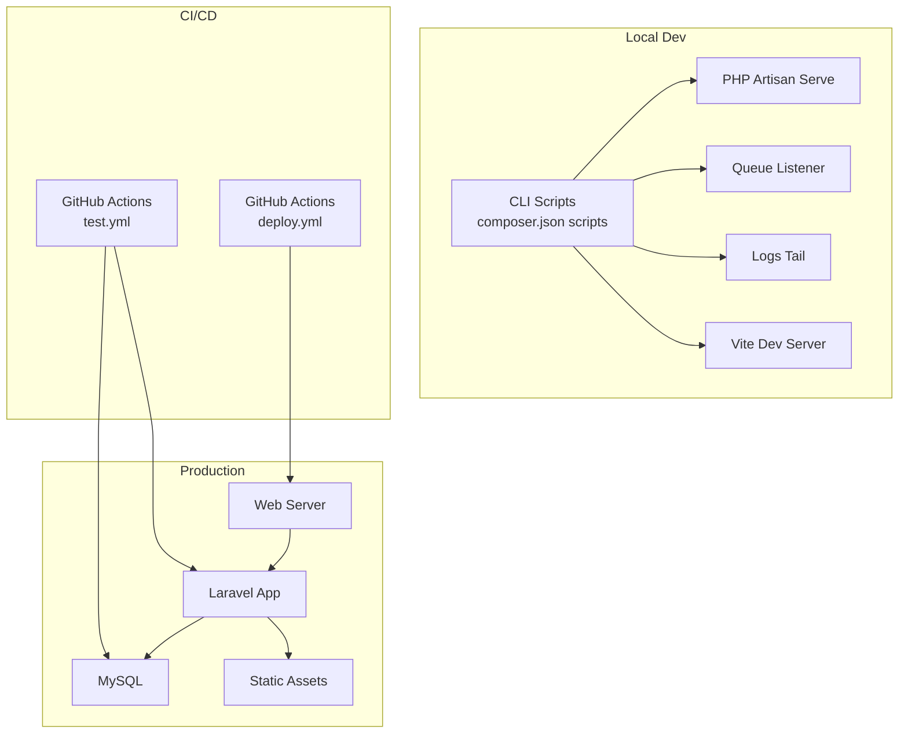
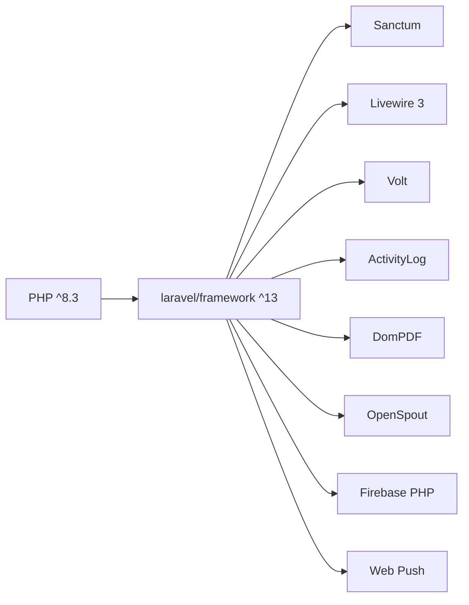

# Development Guidelines

<cite>
**Referenced Files in This Document**
- [README.md](file://README.md)
- [composer.json](file://composer.json)
- [package.json](file://package.json)
- [phpunit.xml](file://phpunit.xml)
- [.gitignore](file://.gitignore)
- [.editorconfig](file://.editorconfig)
- [.agents/skills/laravel-best-practices/SKILL.md](file://.agents/skills/laravel-best-practices/SKILL.md)
- [.agents/skills/laravel-best-practices/rules/style.md](file://.agents/skills/laravel-best-practices/rules/style.md)
- [.agents/skills/laravel-best-practices/rules/architecture.md](file://.agents/skills/laravel-best-practices/rules/architecture.md)
- [.agents/skills/laravel-best-practices/rules/testing.md](file://.agents/skills/laravel-best-practices/rules/testing.md)
- [skills/git-workflow-and-versioning/SKILL.md](file://skills/git-workflow-and-versioning/SKILL.md)
- [.github/workflows/test.yml](file://.github/workflows/test.yml)
- [.github/workflows/deploy.yml](file://.github/workflows/deploy.yml)
- [skills/code-review-and-quality/SKILL.md](file://skills/code-review-and-quality/SKILL.md)
- [skills/documentation-and-adrs/SKILL.md](file://skills/documentation-and-adrs/SKILL.md)
</cite>

## Table of Contents
1. [Introduction](#introduction)
2. [Project Structure](#project-structure)
3. [Core Components](#core-components)
4. [Architecture Overview](#architecture-overview)
5. [Detailed Component Analysis](#detailed-component-analysis)
6. [Dependency Analysis](#dependency-analysis)
7. [Performance Considerations](#performance-considerations)
8. [Troubleshooting Guide](#troubleshooting-guide)
9. [Conclusion](#conclusion)
10. [Appendices](#appendices)

## Introduction
This document defines comprehensive development guidelines for RaporKM Laravel. It establishes code standards aligned with Laravel conventions and PSR-like practices, outlines the development workflow with feature branching and pull request procedures, codifies Git practices for commit hygiene and version control, and details the code review process with multi-axis evaluation criteria. It also documents the skill-based development approach, local development setup, debugging techniques, code organization, dependency management, and contribution procedures.

## Project Structure
RaporKM Laravel follows Laravel’s standard MVC structure with additional domain-specific modules:
- app/ contains controllers, models, services, jobs, Livewire components, policies, and providers.
- database/ includes migrations, seeders, and factories.
- routes/ defines API and web endpoints.
- resources/views and resources/js provide frontend assets and Blade templates.
- tests/ organizes unit, feature, and browser tests.
- docs/ hosts user manuals and developer documentation.
- skills/ and .agents/skills/ provide agent-oriented best practices and rules.

```mermaid
graph TB
A["app/"] --> A1["Http/Controllers/"]
A --> A2["Models/"]
A --> A3["Services/"]
A --> A4["Jobs/"]
A --> A5["Livewire/"]
A --> A6["Policies/"]
A --> A7["Providers/"]
B["database/"] --> B1["migrations/"]
B --> B2["seeders/"]
B --> B3["factories/"]
C["routes/"] --> C1["web.php"]
C --> C2["api.php"]
C --> C3["auth.php"]
D["resources/"] --> D1["views/"]
D --> D2["js/"]
D --> D3["css/"]
E["tests/"] --> E1["Unit/"]
E --> E2["Feature/"]
E --> E3["Browser/"]
F["skills/"] --> F1["git-workflow-and-versioning/"]
F --> F2["code-review-and-quality/"]
F --> F3["documentation-and-adrs/"]
G[".agents/skills/laravel-best-practices/"] --> G1["rules/*"]
```

**Diagram sources**
- [composer.json:34-45](file://composer.json#L34-L45)
- [routes/web.php](file://routes/web.php)
- [routes/api.php](file://routes/api.php)
- [routes/auth.php](file://routes/auth.php)

**Section sources**
- [composer.json:34-45](file://composer.json#L34-L45)
- [README.md:10-31](file://README.md#L10-L31)

## Core Components
- Coding Standards and Conventions
  - Follow Laravel naming conventions for controllers, models, tables, routes, and views.
  - Prefer Laravel helpers (Str, Arr, Number, Uri) and fluent string operations.
  - Keep Blade templates free of inline JavaScript/CSS; pass data via data attributes.
  - Minimize comments; code should be self-documenting except for configuration files.
- Architectural Patterns
  - Use dependency injection and single-purpose action classes.
  - Favor interfaces at system boundaries for testability and swapability.
  - Default to ORDER BY id DESC or created_at DESC; use atomic locks for race conditions.
  - Use defer() for post-response tasks and Context for request-scoped data.
- Testing Patterns
  - Prefer LazilyRefreshDatabase, model assertions, and factory states.
  - Fake events after factory setup; use recycle() to share relationships.
- Git Workflow and Versioning
  - Trunk-based development with short-lived feature branches.
  - Atomic commits with descriptive messages; keep concerns separated.
  - Branch naming: feature/<short-description>, fix/<short-description>.
- Code Review and Quality
  - Multi-axis review: correctness, readability, architecture, security, performance.
  - Target ~100 lines per PR; split larger changes.
  - Use severity labels for actionable feedback.
- Documentation and ADRs
  - Record decisions with ADRs; document the “why,” not just the “what.”
  - Maintain README with quick start, commands, and architecture overview.

**Section sources**
- [.agents/skills/laravel-best-practices/SKILL.md:177-191](file://.agents/skills/laravel-best-practices/SKILL.md#L177-L191)
- [.agents/skills/laravel-best-practices/rules/style.md:3-22](file://.agents/skills/laravel-best-practices/rules/style.md#L3-L22)
- [.agents/skills/laravel-best-practices/rules/architecture.md:3-50](file://.agents/skills/laravel-best-practices/rules/architecture.md#L3-L50)
- [.agents/skills/laravel-best-practices/rules/testing.md:3-44](file://.agents/skills/laravel-best-practices/rules/testing.md#L3-L44)
- [skills/git-workflow-and-versioning/SKILL.md:18-33](file://skills/git-workflow-and-versioning/SKILL.md#L18-L33)
- [skills/code-review-and-quality/SKILL.md:22-82](file://skills/code-review-and-quality/SKILL.md#L22-L82)
- [skills/documentation-and-adrs/SKILL.md:23-91](file://skills/documentation-and-adrs/SKILL.md#L23-L91)

## Architecture Overview
The system integrates Laravel backend services with Livewire components and a Vite-powered frontend. CI/CD automates testing and deployment to a production server.

**Diagram sources**
- [composer.json:46-81](file://composer.json#L46-L81)
- [.github/workflows/test.yml:1-74](file://.github/workflows/test.yml#L1-L74)
- [.github/workflows/deploy.yml:1-40](file://.github/workflows/deploy.yml#L1-L40)

## Detailed Component Analysis

### Coding Standards and Naming Conventions
- Naming Conventions
  - Controllers: singular; Models: singular; Tables: plural snake_case; Pivot tables: singular alphabetical; Columns: snake_case without model prefix; Foreign keys: singular_model_id; Routes: plural; Route names: snake_case with dots; Methods and variables: camelCase; Views: kebab-case; Config: snake_case; Enums: singular.
- Readability and Helpers
  - Prefer Laravel helpers (Str, Arr, Number, Uri) and fluent operations.
  - Avoid inline JS/CSS in Blade; pass data via data attributes.
  - Comments only for configuration files; code should be self-explanatory.
- PSR Alignment
  - PSR-12 style is implicitly followed by EditorConfig and Laravel conventions.
  - Consistent indentation (spaces), line endings (LF), and trailing whitespace removal.

**Section sources**
- [.agents/skills/laravel-best-practices/rules/style.md:3-22](file://.agents/skills/laravel-best-practices/rules/style.md#L3-L22)
- [.agents/skills/laravel-best-practices/rules/style.md:38-95](file://.agents/skills/laravel-best-practices/rules/style.md#L38-L95)
- [.editorconfig:3-19](file://.editorconfig#L3-L19)

### Architectural Patterns and Best Practices
- Single-Purpose Actions and DI
  - Extract business operations into invokable Action classes with constructor injection.
  - Depend on interfaces at system boundaries; bind in providers.
- Ordering and Safety
  - Default to latest() ordering; use atomic locks for race conditions.
  - Use defer() for post-response tasks; Context for request-scoped data.
  - Prefer conventional Laravel patterns; avoid overriding defaults unnecessarily.

**Section sources**
- [.agents/skills/laravel-best-practices/rules/architecture.md:3-50](file://.agents/skills/laravel-best-practices/rules/architecture.md#L3-L50)
- [.agents/skills/laravel-best-practices/rules/architecture.md:83-96](file://.agents/skills/laravel-best-practices/rules/architecture.md#L83-L96)
- [.agents/skills/laravel-best-practices/rules/architecture.md:97-108](file://.agents/skills/laravel-best-practices/rules/architecture.md#L97-L108)
- [.agents/skills/laravel-best-practices/rules/architecture.md:130-144](file://.agents/skills/laravel-best-practices/rules/architecture.md#L130-L144)
- [.agents/skills/laravel-best-practices/rules/architecture.md:146-158](file://.agents/skills/laravel-best-practices/rules/architecture.md#L146-L158)
- [.agents/skills/laravel-best-practices/rules/architecture.md:160-174](file://.agents/skills/laravel-best-practices/rules/architecture.md#L160-L174)

### Testing Methodologies
- Unit and Feature Tests
  - PHPUnit configured with Unit and Feature suites; SQLite in-memory for tests.
- Best Practices
  - Use LazilyRefreshDatabase; assert model existence; leverage factory states and sequences.
  - Fake events after factory setup; recycle() to reuse relationships.

**Section sources**
- [phpunit.xml:7-19](file://phpunit.xml#L7-L19)
- [phpunit.xml:20-35](file://phpunit.xml#L20-L35)
- [.agents/skills/laravel-best-practices/rules/testing.md:3-14](file://.agents/skills/laravel-best-practices/rules/testing.md#L3-L14)
- [.agents/skills/laravel-best-practices/rules/testing.md:15-22](file://.agents/skills/laravel-best-practices/rules/testing.md#L15-L22)
- [.agents/skills/laravel-best-practices/rules/testing.md:23-34](file://.agents/skills/laravel-best-practices/rules/testing.md#L23-L34)
- [.agents/skills/laravel-best-practices/rules/testing.md:35-44](file://.agents/skills/laravel-best-practices/rules/testing.md#L35-L44)

### Git Workflow and Version Control
- Branching Strategy
  - Trunk-based development; short-lived feature branches; delete after merge.
  - Branch naming: feature/<short-description>, fix/<short-description>, chore/<short-description>, refactor/<short-description>.
- Commit Hygiene
  - Atomic commits; descriptive messages explaining “why”; keep concerns separate.
  - Pre-commit checks: staged diff review, secret scanning, tests, linting, type checking.
- Worktrees and Parallel Work
  - Use git worktrees for parallel experiments; isolate changes until explicitly merged.

**Section sources**
- [skills/git-workflow-and-versioning/SKILL.md:18-33](file://skills/git-workflow-and-versioning/SKILL.md#L18-L33)
- [skills/git-workflow-and-versioning/SKILL.md:121-146](file://skills/git-workflow-and-versioning/SKILL.md#L121-L146)
- [skills/git-workflow-and-versioning/SKILL.md:65-87](file://skills/git-workflow-and-versioning/SKILL.md#L65-L87)
- [skills/git-workflow-and-versioning/SKILL.md:211-231](file://skills/git-workflow-and-versioning/SKILL.md#L211-L231)

### Code Review Process
- Review Axes
  - Correctness, readability, architecture, security, performance.
- Change Sizing and Splitting
  - Target ~100 lines per PR; split larger changes using stacking, file grouping, horizontal, or vertical strategies.
- Severity Labels
  - Required, Critical, Nit, Optional/Consider, FYI to distinguish actionability.
- Multi-Model Review Pattern
  - Different models review for different perspectives; human final approval.

**Section sources**
- [skills/code-review-and-quality/SKILL.md:22-82](file://skills/code-review-and-quality/SKILL.md#L22-L82)
- [skills/code-review-and-quality/SKILL.md:83-107](file://skills/code-review-and-quality/SKILL.md#L83-L107)
- [skills/code-review-and-quality/SKILL.md:118-180](file://skills/code-review-and-quality/SKILL.md#L118-L180)
- [skills/code-review-and-quality/SKILL.md:181-199](file://skills/code-review-and-quality/SKILL.md#L181-L199)

### Documentation Standards and ADRs
- ADR Lifecycle
  - PROPOSED → ACCEPTED → (SUPERSEDED or DEPRECATED); preserve historical context.
- Inline Documentation
  - Document “why,” not “what”; avoid commented-out code; record known gotchas.
- README and API Docs
  - README should include quick start, commands, and architecture overview.
  - API documentation with typed signatures and examples.

**Section sources**
- [skills/documentation-and-adrs/SKILL.md:23-91](file://skills/documentation-and-adrs/SKILL.md#L23-L91)
- [skills/documentation-and-adrs/SKILL.md:92-141](file://skills/documentation-and-adrs/SKILL.md#L92-L141)
- [skills/documentation-and-adrs/SKILL.md:190-220](file://skills/documentation-and-adrs/SKILL.md#L190-L220)
- [skills/documentation-and-adrs/SKILL.md:221-239](file://skills/documentation-and-adrs/SKILL.md#L221-L239)

### Local Development Setup
- Environment Preparation
  - Composer install, .env generation, database migrations, npm install, and build.
- Development Server
  - Concurrent dev stack: artisan serve, queue listener, logs, and Vite dev server.
- Testing
  - Clear configs, run tests, and configure SQLite in-memory database.

**Section sources**
- [composer.json:46-81](file://composer.json#L46-L81)
- [phpunit.xml:20-35](file://phpunit.xml#L20-L35)

### Debugging Techniques
- Git-based Debugging
  - Use git bisect to locate problematic commits; inspect recent diffs; blame specific lines; search commit messages.
- Pre-Commit Hygiene
  - Review staged changes, scan for secrets, run tests, linting, and type checks.

**Section sources**
- [skills/git-workflow-and-versioning/SKILL.md:250-269](file://skills/git-workflow-and-versioning/SKILL.md#L250-L269)
- [skills/git-workflow-and-versioning/SKILL.md:211-231](file://skills/git-workflow-and-versioning/SKILL.md#L211-L231)

### Development Tools Configuration
- Frontend Tooling
  - Vite with TailwindCSS; build and dev scripts; PostCSS and autoprefixer.
- Backend Tooling
  - Laravel Boost, Laravel Pint, Pest plugins, Dusk for browser tests.

**Section sources**
- [package.json:5-18](file://package.json#L5-L18)
- [composer.json:22-33](file://composer.json#L22-L33)

### Dependency Management and Package Integration
- Composer Dependencies
  - Core: Laravel framework, Sanctum, Livewire, DomPDF, OpenSpout, Firebase, Web Push, ActivityLog.
  - Dev: Boost, Breeze, Dusk, Pail, PAO, Pint, Mockery, PHPUnit.
- Autoload and Scripts
  - PSR-4 autoload; optimized autoloader; scripts for setup, dev, and test.
- Environment Exclusions
  - .gitignore excludes logs, IDE configs, vendor, node_modules, storage/*.key, and build artifacts.

**Section sources**
- [composer.json:8-33](file://composer.json#L8-L33)
- [composer.json:34-45](file://composer.json#L34-L45)
- [composer.json:46-81](file://composer.json#L46-L81)
- [.gitignore:1-28](file://.gitignore#L1-L28)

### CI/CD and Deployment
- Test Pipeline
  - Ubuntu runners, PHP 8.3, MySQL service, cache Composer packages, install dependencies, prepare environment, run migrations, and execute tests.
- Browser Tests (Dusk)
  - Chrome and ChromeDriver setup, build assets, run migrations and seed with UAT data, execute Dusk tests, upload screenshots on failure.
- Deployment
  - Build frontend assets, SSH to aaPanel server, and run deploy script.

**Section sources**
- [.github/workflows/test.yml:1-74](file://.github/workflows/test.yml#L1-L74)
- [.github/workflows/test.yml:75-169](file://.github/workflows/test.yml#L75-L169)
- [.github/workflows/deploy.yml:1-40](file://.github/workflows/deploy.yml#L1-L40)

### Contribution Procedures and Issue Reporting
- Contributing
  - Follow Laravel contributions guide and code of conduct.
- Issue Reporting
  - Use repository issue templates; include environment details, reproduction steps, and expected vs actual behavior.
- Feature Requests
  - Open an issue with use cases, acceptance criteria, and potential ADR context.

**Section sources**
- [README.md:44-51](file://README.md#L44-L51)

## Dependency Analysis
The project relies on Laravel ecosystem packages and complementary libraries for PDF generation, push notifications, activity logging, and spreadsheet export. Dev tooling supports code quality, testing, and agent-assisted development.

**Diagram sources**
- [composer.json:8-21](file://composer.json#L8-L21)

**Section sources**
- [composer.json:8-21](file://composer.json#L8-L21)

## Performance Considerations
- Database Performance
  - Prevent N+1 queries; eager-load relations; select only needed columns; use chunking for large datasets; add proper indexes.
- Caching Strategies
  - Use Cache::remember(), flexible(), memo(), tags, add(), once(), lock(); failover cache stores in production.
- Query Patterns
  - Prefer subqueries and conditional aggregates; avoid raw SQL with user input; use Eloquent or query builder.
- Queue and Jobs
  - Configure retry_after > timeout; use exponential backoff; implement failed(); rate-limit external API calls.

**Section sources**
- [.agents/skills/laravel-best-practices/SKILL.md:21-31](file://.agents/skills/laravel-best-practices/SKILL.md#L21-L31)
- [.agents/skills/laravel-best-practices/SKILL.md:51-61](file://.agents/skills/laravel-best-practices/SKILL.md#L51-L61)
- [.agents/skills/laravel-best-practices/SKILL.md:102-117](file://.agents/skills/laravel-best-practices/SKILL.md#L102-L117)
- [.agents/skills/laravel-best-practices/SKILL.md:146-159](file://.agents/skills/laravel-best-practices/SKILL.md#L146-L159)

## Troubleshooting Guide
- Common Git Red Flags
  - Large uncommitted changes, vague commit messages, formatting-only changes mixed with behavior changes, long-lived branches, force-pushing to shared branches.
- Code Review Red Flags
  - Merging without review, only testing pass review, “LGTM” without evidence, security-sensitive changes without security review, large PRs that are too big to review, no regression tests, comments without severity labels.
- Documentation Red Flags
  - Architectural decisions without rationale, public APIs without documentation, README lacking quick start, commented-out code, TODOs lingering for weeks.

**Section sources**
- [skills/git-workflow-and-versioning/SKILL.md:281-301](file://skills/git-workflow-and-versioning/SKILL.md#L281-L301)
- [skills/code-review-and-quality/SKILL.md:328-338](file://skills/code-review-and-quality/SKILL.md#L328-L338)
- [skills/documentation-and-adrs/SKILL.md:259-268](file://skills/documentation-and-adrs/SKILL.md#L259-L268)

## Conclusion
These guidelines establish a consistent, high-quality development process for RaporKM Laravel. By adhering to Laravel conventions, maintaining disciplined Git practices, conducting multi-axis code reviews, and documenting architectural decisions, contributors can ensure reliable, secure, and maintainable code. The CI/CD pipeline and local tooling streamline development and deployment.

## Appendices

### Appendix A: Good Coding Practices
- Prefer dependency injection over service locator.
- Use single-purpose action classes and interfaces at boundaries.
- Keep Blade templates free of inline JS/CSS; pass data via data attributes.
- Use Laravel helpers for strings, arrays, numbers, and URIs.
- Default to latest() ordering; add atomic locks for race conditions.
- Use defer() for post-response tasks; Context for request-scoped data.
- Use LazilyRefreshDatabase, model assertions, and factory states.
- Follow trunk-based development; keep branches short-lived.

**Section sources**
- [.agents/skills/laravel-best-practices/rules/architecture.md:22-50](file://.agents/skills/laravel-best-practices/rules/architecture.md#L22-L50)
- [.agents/skills/laravel-best-practices/rules/style.md:96-111](file://.agents/skills/laravel-best-practices/rules/style.md#L96-L111)
- [.agents/skills/laravel-best-practices/rules/architecture.md:130-144](file://.agents/skills/laravel-best-practices/rules/architecture.md#L130-L144)
- [.agents/skills/laravel-best-practices/rules/testing.md:3-14](file://.agents/skills/laravel-best-practices/rules/testing.md#L3-L14)
- [skills/git-workflow-and-versioning/SKILL.md:18-33](file://skills/git-workflow-and-versioning/SKILL.md#L18-L33)

### Appendix B: Anti-Patterns to Avoid
- Avoid raw SQL with user input; always use Eloquent or query builder.
- Avoid inline JS/CSS in Blade templates.
- Avoid commented-out code; delete it and rely on version control.
- Avoid long-lived feature branches; merge within 1–3 days.
- Avoid vague commit messages; explain “why.”

**Section sources**
- [.agents/skills/laravel-best-practices/SKILL.md:43-50](file://.agents/skills/laravel-best-practices/SKILL.md#L43-L50)
- [.agents/skills/laravel-best-practices/rules/style.md:96-111](file://.agents/skills/laravel-best-practices/rules/style.md#L96-L111)
- [skills/git-workflow-and-versioning/SKILL.md:30-33](file://skills/git-workflow-and-versioning/SKILL.md#L30-L33)
- [skills/git-workflow-and-versioning/SKILL.md:65-87](file://skills/git-workflow-and-versioning/SKILL.md#L65-L87)

### Appendix C: Refactoring Guidelines
- Split large changes into smaller, focused PRs.
- Separate refactoring from feature work; submit separately.
- Use recycle() to share relationships across factories.
- Maintain naming consistency; follow Laravel conventions.

**Section sources**
- [skills/code-review-and-quality/SKILL.md:83-107](file://skills/code-review-and-quality/SKILL.md#L83-L107)
- [.agents/skills/laravel-best-practices/rules/testing.md:35-44](file://.agents/skills/laravel-best-practices/rules/testing.md#L35-L44)
- [.agents/skills/laravel-best-practices/rules/style.md:3-22](file://.agents/skills/laravel-best-practices/rules/style.md#L3-L22)