# Development Workflow & Processes

<cite>
**Referenced Files in This Document**
- [README.md](file://README.md)
- [progres-pengerjaan.md](file://progres-pengerjaan.md)
- [PRD-rapor-migrasi.md](file://PRD-rapor-migrasi.md)
- [.github/workflows/test.yml](file://.github/workflows/test.yml)
- [.github/workflows/deploy.yml](file://.github/workflows/deploy.yml)
- [phpunit.xml](file://phpunit.xml)
- [composer.json](file://composer.json)
- [package.json](file://package.json)
- [skills/git-workflow-and-versioning/SKILL.md](file://skills/git-workflow-and-versioning/SKILL.md)
- [skills/spec-driven-development/SKILL.md](file://skills/spec-driven-development/SKILL.md)
- [skills/test-driven-development/SKILL.md](file://skills/test-driven-development/SKILL.md)
- [skills/code-review-and-quality/SKILL.md](file://skills/code-review-and-quality/SKILL.md)
- [skills/planning-and-task-breakdown/SKILL.md](file://skills/planning-and-task-breakdown/SKILL.md)
- [skills/ci-cd-and-automation/SKILL.md](file://skills/ci-cd-and-automation/SKILL.md)
- [app/Http/Controllers/Api/...](file://app/Http/Controllers/Api/)
- [app/Services/...](file://app/Services/)
- [tests/Feature/...](file://tests/Feature/)
- [tests/Unit/...](file://tests/Unit/)
- [routes/api.php](file://routes/api.php)
- [routes/web.php](file://routes/web.php)
- [config/app.php](file://config/app.php)
</cite>

## Table of Contents
1. [Introduction](#introduction)
2. [Project Structure](#project-structure)
3. [Core Components](#core-components)
4. [Architecture Overview](#architecture-overview)
5. [Detailed Component Analysis](#detailed-component-analysis)
6. [Dependency Analysis](#dependency-analysis)
7. [Performance Considerations](#performance-considerations)
8. [Troubleshooting Guide](#troubleshooting-guide)
9. [Conclusion](#conclusion)
10. [Appendices](#appendices)

## Introduction
This document defines the end-to-end development workflow for the Laravel Raporkm project. It covers feature branching, pull request procedures, merge strategies, Git conventions, version control practices, the feature lifecycle from planning to deployment, task breakdown and milestone tracking, specification-driven and test-driven development practices, code review and quality assurance, issue tracking and requests, continuous integration and automated testing, and practical examples with common pitfalls to avoid.

## Project Structure
The project follows a standard Laravel application layout with modular features organized under app/, API endpoints under routes/, automated tests under tests/, and CI/CD under .github/workflows/. Documentation and planning artifacts are maintained alongside the codebase.

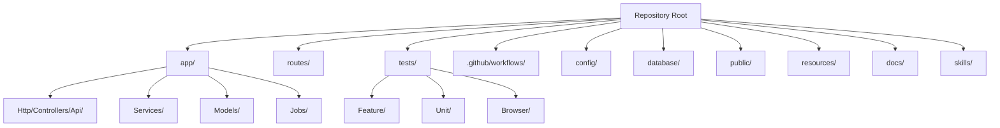

**Diagram sources**
- [README.md](file://README.md)
- [routes/api.php](file://routes/api.php)
- [routes/web.php](file://routes/web.php)
- [.github/workflows/test.yml](file://.github/workflows/test.yml)
- [.github/workflows/deploy.yml](file://.github/workflows/deploy.yml)

**Section sources**
- [README.md](file://README.md)
- [composer.json](file://composer.json)
- [package.json](file://package.json)

## Core Components
- API surface: Defined under routes/api.php and implemented via controllers in app/Http/Controllers/Api/.
- Domain services: Located under app/Services/ encapsulate business logic and orchestrate model interactions.
- Automated tests: Feature and unit tests under tests/Feature and tests/Unit drive quality and regression prevention.
- CI/CD: GitHub Actions workflows in .github/workflows/ automate testing and deployment.
- Configuration: Application behavior configured via config/*.php and environment-specific variables.

Key workflow anchors:
- Planning and progress tracking: progres-pengerjaan.md and PRD-rapor-migrasi.md.
- Skill-based practices: skills/*/SKILL.md documents best practices for Git, TDD, SDD, code review, CI/CD, and planning.

**Section sources**
- [routes/api.php](file://routes/api.php)
- [routes/web.php](file://routes/web.php)
- [app/Services/...](file://app/Services/)
- [tests/Feature/...](file://tests/Feature/)
- [tests/Unit/...](file://tests/Unit/)
- [.github/workflows/test.yml](file://.github/workflows/test.yml)
- [.github/workflows/deploy.yml](file://.github/workflows/deploy.yml)
- [progres-pengerjaan.md](file://progres-pengerjaan.md)
- [PRD-rapor-migrasi.md](file://PRD-rapor-migrasi.md)
- [skills/git-workflow-and-versioning/SKILL.md](file://skills/git-workflow-and-versioning/SKILL.md)
- [skills/spec-driven-development/SKILL.md](file://skills/spec-driven-development/SKILL.md)
- [skills/test-driven-development/SKILL.md](file://skills/test-driven-development/SKILL.md)
- [skills/code-review-and-quality/SKILL.md](file://skills/code-review-and-quality/SKILL.md)
- [skills/planning-and-task-breakdown/SKILL.md](file://skills/planning-and-task-breakdown/SKILL.md)
- [skills/ci-cd-and-automation/SKILL.md](file://skills/ci-cd-and-automation/SKILL.md)

## Architecture Overview
The system employs a layered architecture:
- Presentation: Web routes and API routes expose endpoints.
- Application: Controllers coordinate requests and delegate to services.
- Domain: Services encapsulate business logic and interact with models and jobs.
- Persistence: Eloquent models and database migrations manage data.
- Infrastructure: Jobs handle asynchronous tasks; configuration controls runtime behavior.

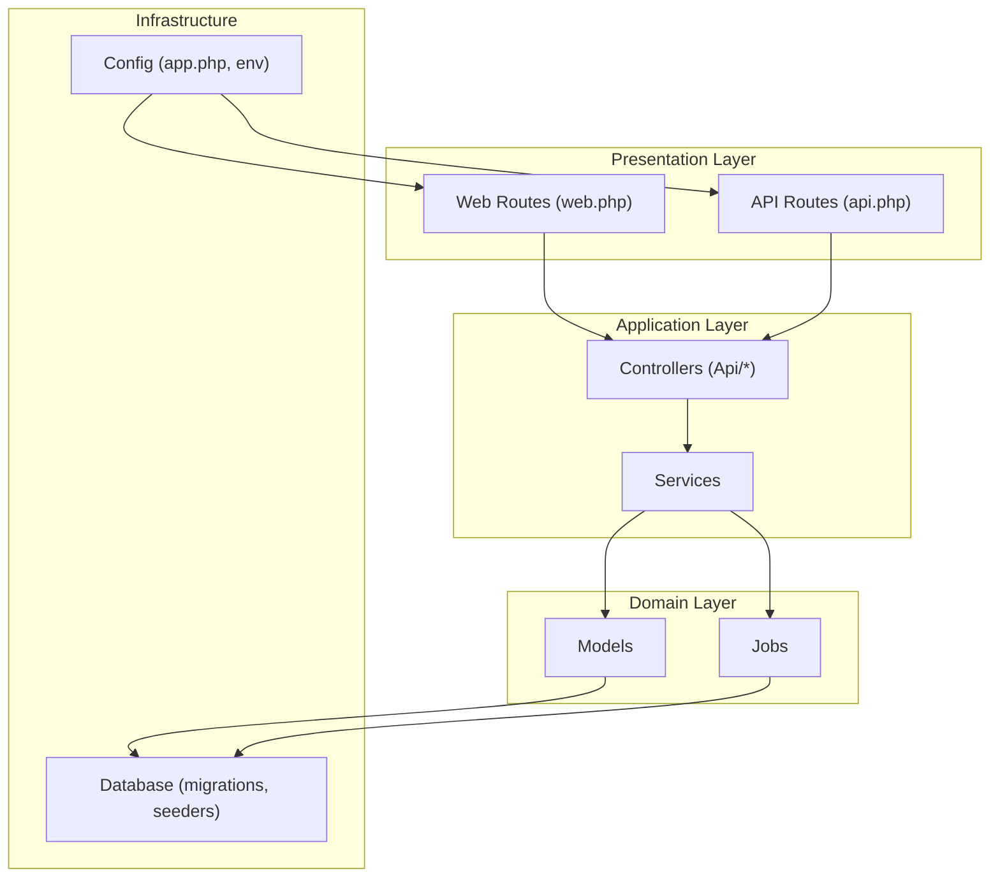

**Diagram sources**
- [routes/web.php](file://routes/web.php)
- [routes/api.php](file://routes/api.php)
- [app/Http/Controllers/Api/...](file://app/Http/Controllers/Api/)
- [app/Services/...](file://app/Services/)
- [app/Models/...](file://app/Models/)
- [app/Jobs/...](file://app/Jobs/)
- [config/app.php](file://config/app.php)

## Detailed Component Analysis

### Git Workflow and Version Control Practices
- Branching model: Use feature branches prefixed with feature/, fix/, chore/, or refactor/ to clearly categorize work.
- Commit messages: Follow an imperative style with a concise subject, optional scope, and a blank line before body. Reference related issues or PRs in the footer.
- Merge strategy: Squash and merge for feature branches to maintain a clean history; rebase before merging to keep history linear.
- Pull requests: Require at least one approval and passing CI checks; update PR description with acceptance criteria and links to planning artifacts.
- Versioning: Adhere to semantic versioning; tag releases after successful deployments.

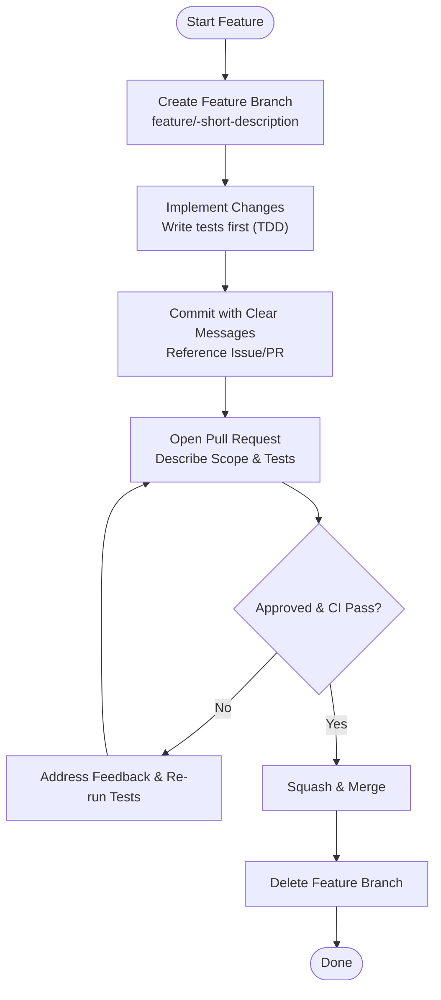

**Section sources**
- [skills/git-workflow-and-versioning/SKILL.md](file://skills/git-workflow-and-versioning/SKILL.md)
- [progres-pengerjaan.md](file://progres-pengerjaan.md)
- [PRD-rapor-migrasi.md](file://PRD-rapor-migrasi.md)

### Specification-Driven Development (SDD)
- Artifacts: Use PRD-rapor-migrasi.md and progres-pengerjaan.md to capture functional requirements and acceptance criteria.
- Design before code: Define API endpoints, request/response shapes, and service contracts before implementation.
- Traceability: Link each feature branch to a requirement ID and update progress tracking accordingly.

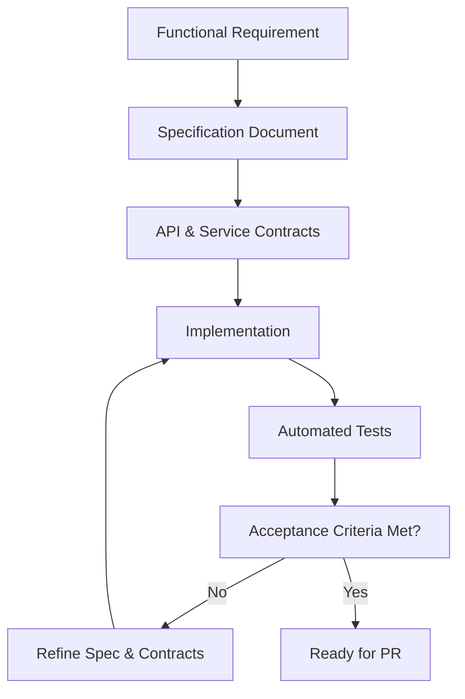

**Section sources**
- [PRD-rapor-migrasi.md](file://PRD-rapor-migrasi.md)
- [progres-pengerjaan.md](file://progres-pengerjaan.md)
- [skills/spec-driven-development/SKILL.md](file://skills/spec-driven-development/SKILL.md)

### Test-Driven Development (TDD)
- Red-Green-Refactor cycle: Write failing tests first, implement minimal code to pass, then refactor safely with confidence.
- Test coverage: Prefer unit tests for pure logic and service logic; use feature tests for integration and end-to-end flows.
- Test configuration: phpunit.xml defines test suite configuration and environment isolation.

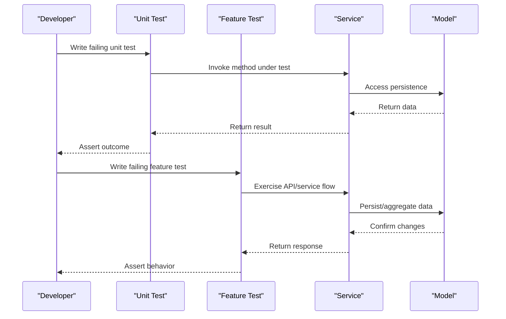

**Section sources**
- [phpunit.xml](file://phpunit.xml)
- [tests/Unit/...](file://tests/Unit/)
- [tests/Feature/...](file://tests/Feature/)
- [skills/test-driven-development/SKILL.md](file://skills/test-driven-development/SKILL.md)

### Continuous Integration and Automated Testing
- Workflows: GitHub Actions workflows automate linting, static analysis, unit tests, and deployment.
- Test workflow: Runs on pull requests and pushes to main to prevent regressions.
- Deploy workflow: Builds and deploys artifacts upon release tagging or protected branch pushes.

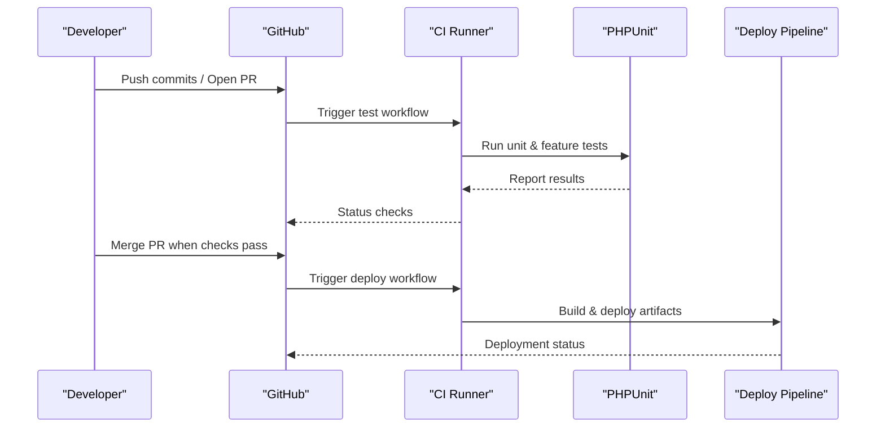

**Diagram sources**
- [.github/workflows/test.yml](file://.github/workflows/test.yml)
- [.github/workflows/deploy.yml](file://.github/workflows/deploy.yml)

**Section sources**
- [.github/workflows/test.yml](file://.github/workflows/test.yml)
- [.github/workflows/deploy.yml](file://.github/workflows/deploy.yml)
- [skills/ci-cd-and-automation/SKILL.md](file://skills/ci-cd-and-automation/SKILL.md)

### Code Review and Quality Assurance
- Peer review: Require at least one reviewer; ensure feedback addresses correctness, readability, performance, and test coverage.
- Review criteria: Clarity of intent, adherence to SDD/TDD, absence of hardcoded values, secure handling of inputs, and maintainable abstractions.
- Quality gates: CI must pass; PRs should not introduce new warnings or decrease coverage below threshold.

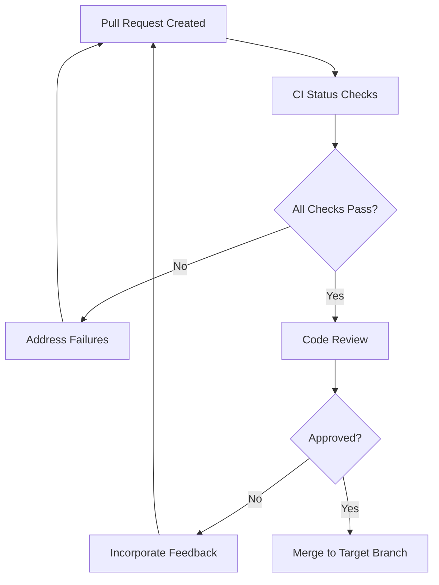

**Section sources**
- [skills/code-review-and-quality/SKILL.md](file://skills/code-review-and-quality/SKILL.md)

### Issue Tracking, Bug Reporting, and Feature Requests
- Issues: Use GitHub Issues to track bugs, enhancements, and tasks. Assign labels (bug, enhancement, task) and milestones.
- Bug report template: Include steps to reproduce, expected vs. actual behavior, environment details, and severity.
- Feature request template: Describe user story, acceptance criteria, non-functional requirements, and links to specs.

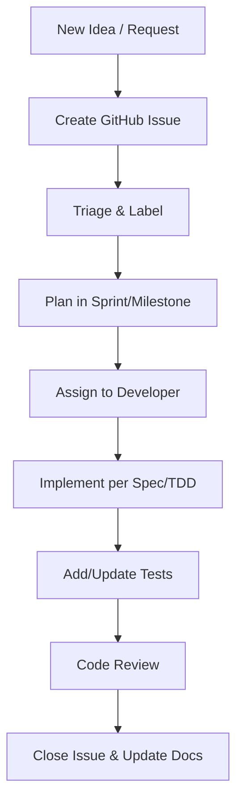

**Section sources**
- [progres-pengerjaan.md](file://progres-pengerjaan.md)
- [PRD-rapor-migrasi.md](file://PRD-rapor-migrasi.md)

### Task Breakdown Procedures and Milestone Tracking
- Break down epics into user stories and tasks; estimate effort and prioritize in backlog.
- Plan sprints bi-weekly; select tasks aligned with milestone goals.
- Track progress in progres-pengerjaan.md; update status and blockers during stand-ups.

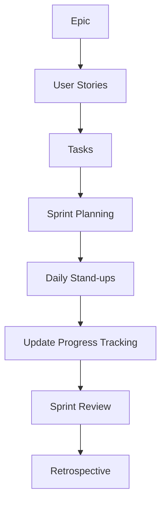

**Section sources**
- [progres-pengerjaan.md](file://progres-pengerjaan.md)
- [skills/planning-and-task-breakdown/SKILL.md](file://skills/planning-and-task-breakdown/SKILL.md)

### Feature Development Lifecycle
From planning to deployment:
- Planning: Capture requirements in PRD and break into tasks.
- Design: Define API contracts and service boundaries.
- Implementation: Follow TDD; write unit and feature tests.
- Review: Conduct code review and address feedback.
- Test: Ensure CI passes and coverage remains stable.
- Deploy: Merge to main and trigger deployment via CI.

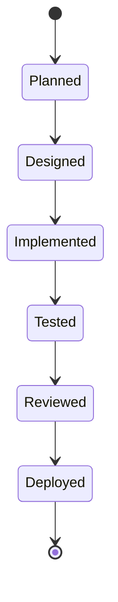

**Section sources**
- [PRD-rapor-migrasi.md](file://PRD-rapor-migrasi.md)
- [skills/spec-driven-development/SKILL.md](file://skills/spec-driven-development/SKILL.md)
- [skills/test-driven-development/SKILL.md](file://skills/test-driven-development/SKILL.md)
- [skills/code-review-and-quality/SKILL.md](file://skills/code-review-and-quality/SKILL.md)
- [.github/workflows/deploy.yml](file://.github/workflows/deploy.yml)

## Dependency Analysis
The application’s runtime dependencies are managed via Composer and NPM. The Laravel framework orchestrates routing, middleware, services, and configuration. Tests rely on PHPUnit and Dusk for feature/browser testing.

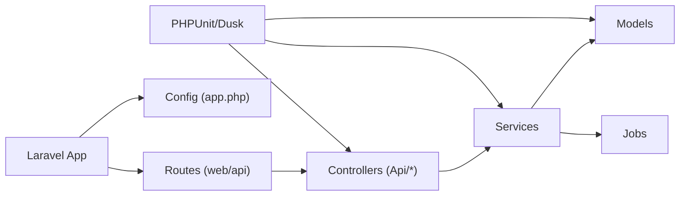

**Diagram sources**
- [composer.json](file://composer.json)
- [package.json](file://package.json)
- [routes/web.php](file://routes/web.php)
- [routes/api.php](file://routes/api.php)
- [app/Http/Controllers/Api/...](file://app/Http/Controllers/Api/)
- [app/Services/...](file://app/Services/)
- [app/Models/...](file://app/Models/)
- [app/Jobs/...](file://app/Jobs/)
- [phpunit.xml](file://phpunit.xml)

**Section sources**
- [composer.json](file://composer.json)
- [package.json](file://package.json)
- [phpunit.xml](file://phpunit.xml)

## Performance Considerations
- Keep migrations and seeds minimal and additive; avoid heavy operations in constructors.
- Use queued jobs for long-running tasks; monitor queue workers and retry policies.
- Favor efficient queries and caching for frequently accessed data; avoid N+1 queries.
- Monitor CI job durations and optimize slow tests or redundant checks.

[No sources needed since this section provides general guidance]

## Troubleshooting Guide
- CI failures: Inspect workflow logs for test errors, missing environment variables, or dependency installation issues.
- Local test failures: Verify database seeding, environment variables, and test database configuration.
- Merge conflicts: Rebase feature branches onto latest main; resolve conflicts locally before pushing updates.
- API regressions: Add or adjust feature tests to cover changed endpoints; ensure controller and service behavior aligns with contracts.

**Section sources**
- [.github/workflows/test.yml](file://.github/workflows/test.yml)
- [phpunit.xml](file://phpunit.xml)
- [skills/ci-cd-and-automation/SKILL.md](file://skills/ci-cd-and-automation/SKILL.md)

## Conclusion
By adhering to the documented Git workflow, SDD/TDD practices, CI/CD automation, and structured planning, the team can deliver reliable, maintainable features consistently. Regular code reviews, robust testing, and transparent issue tracking ensure high-quality outcomes and predictable releases.

[No sources needed since this section summarizes without analyzing specific files]

## Appendices

### Appendix A: Effective Practices and Pitfalls
- Effective practices:
  - Write tests before implementation (TDD).
  - Keep PRs small and focused.
  - Document breaking changes and migration steps.
  - Automate linting and formatting pre-commit.
- Common pitfalls to avoid:
  - Skipping tests or relying solely on manual QA.
  - Merging without review or CI approval.
  - Introducing global state or hardcoded values.
  - Ignoring performance regressions in PRs.

[No sources needed since this section provides general guidance]