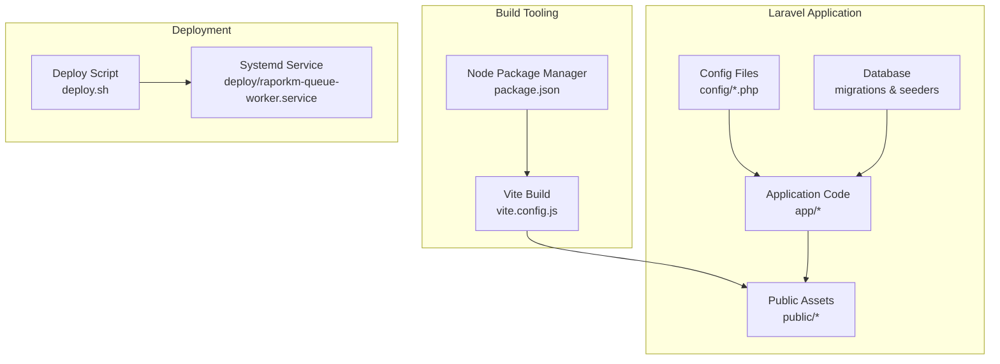
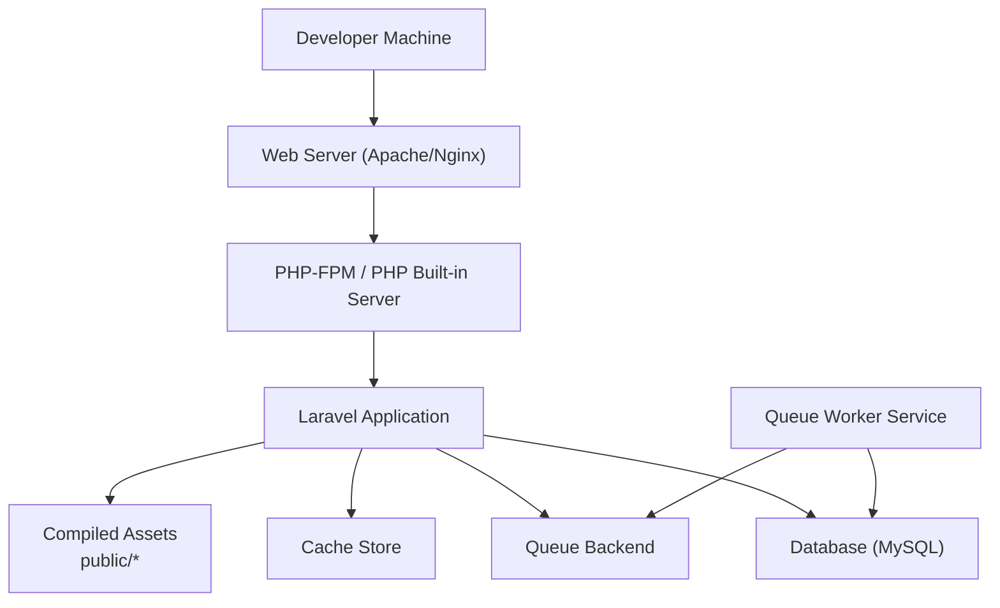
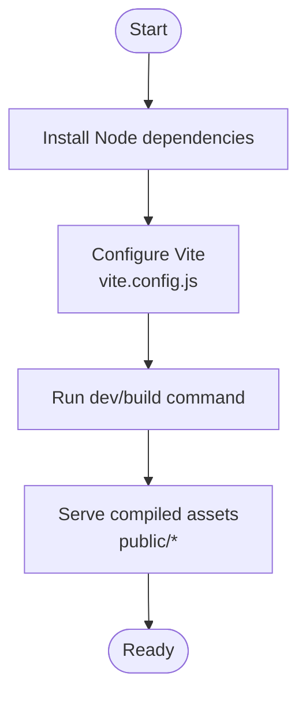
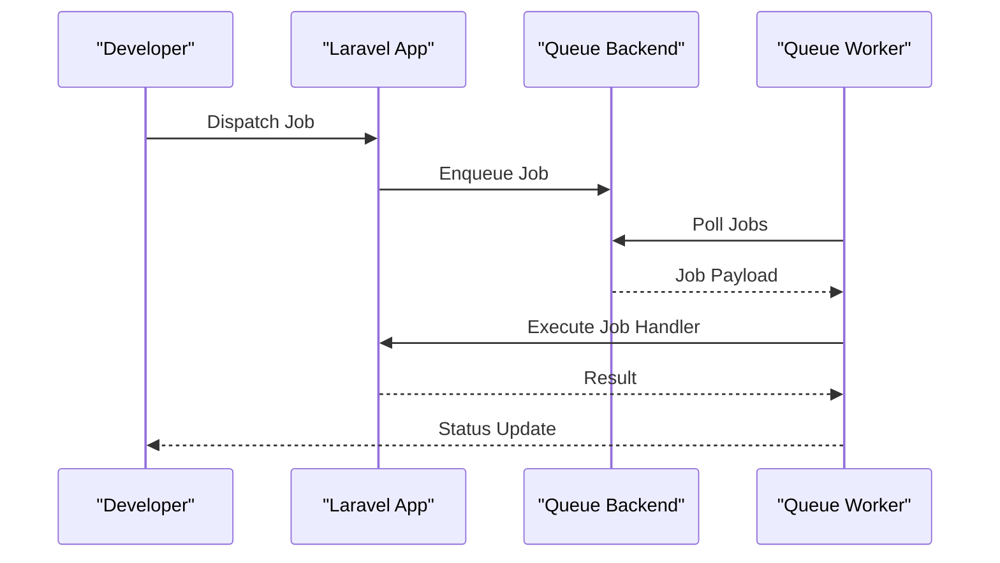
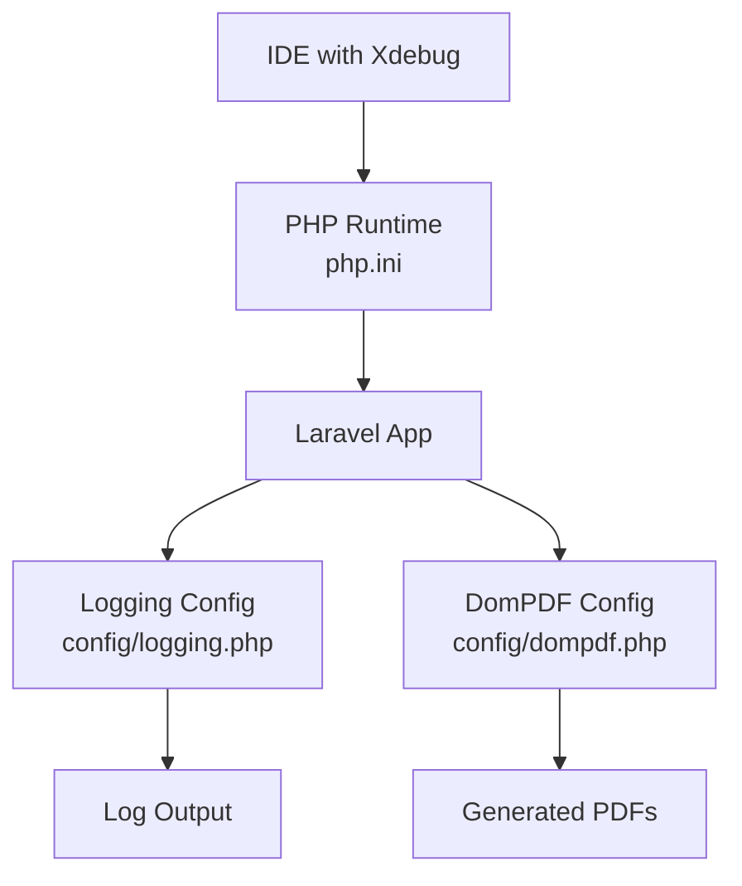
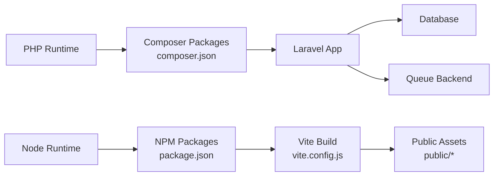

# Local Development Setup

<cite>
**Referenced Files in This Document**
- [README.md](file://README.md)
- [composer.json](file://composer.json)
- [package.json](file://package.json)
- [vite.config.js](file://vite.config.js)
- [config/app.php](file://config/app.php)
- [config/database.php](file://config/database.php)
- [config/queue.php](file://config/queue.php)
- [config/logging.php](file://config/logging.php)
- [config/mail.php](file://config/mail.php)
- [config/services.php](file://config/services.php)
- [config/cache.php](file://config/cache.php)
- [config/session.php](file://config/session.php)
- [config/livewire.php](file://config/livewire.php)
- [config/dompdf.php](file://config/dompdf.php)
- [config/push.php](file://config/push.php)
- [config/e-rapor.php](file://config/e-rapor.php)
- [database/migrations](file://database/migrations)
- [database/seeders](file://database/seeders)
- [deploy.sh](file://deploy.sh)
- [deploy/raporkm-queue-worker.service](file://deploy/raporkm-queue-worker.service)
- [.agents/skills/laravel-best-practices/rules/config.md](file://.agents/skills/laravel-best-practices/rules/config.md)
- [skills/security-and-hardening/SHARED.md](file://skills/security-and-hardening/SHARED.md)
- [skills/documentation-and-adrs/SKILL.md](file://skills/documentation-and-adrs/SKILL.md)
</cite>

## Table of Contents
1. [Introduction](#introduction)
2. [Project Structure](#project-structure)
3. [Core Components](#core-components)
4. [Architecture Overview](#architecture-overview)
5. [Detailed Component Analysis](#detailed-component-analysis)
6. [Dependency Analysis](#dependency-analysis)
7. [Performance Considerations](#performance-considerations)
8. [Troubleshooting Guide](#troubleshooting-guide)
9. [Conclusion](#conclusion)
10. [Appendices](#appendices)

## Introduction
This guide provides a complete local development environment setup for RaporKM Laravel. It covers system requirements, installation steps for Windows, macOS, and Linux, environment configuration, database setup, asset compilation, queue workers, debugging, IDE recommendations, security considerations, and database seeding. The goal is to help developers quickly spin up a working local environment aligned with the project’s configuration and deployment practices.

## Project Structure
RaporKM is a Laravel application with a modern frontend toolchain powered by Vite. The repository includes:
- Laravel backend with configuration under config/
- Database migrations and seeders under database/
- Frontend assets managed via Vite and compiled to public/
- Deployment scripts and systemd unit for queue workers under deploy/

**Diagram sources**
- [vite.config.js](file://vite.config.js)
- [package.json](file://package.json)
- [config/app.php](file://config/app.php)
- [config/database.php](file://config/database.php)
- [deploy.sh](file://deploy.sh)
- [deploy/raporkm-queue-worker.service](file://deploy/raporkm-queue-worker.service)

**Section sources**
- [README.md](file://README.md)
- [package.json](file://package.json)
- [vite.config.js](file://vite.config.js)
- [config/app.php](file://config/app.php)
- [config/database.php](file://config/database.php)
- [deploy.sh](file://deploy.sh)
- [deploy/raporkm-queue-worker.service](file://deploy/raporkm-queue-worker.service)

## Core Components
- PHP runtime and Composer for backend dependencies
- Node.js and npm for frontend assets
- Database (MySQL recommended) with Laravel migrations and seeders
- Queue worker service for background jobs
- Optional: DomPDF for PDF generation, Mail and Push services configuration

Key configuration touchpoints:
- Application settings: [config/app.php](file://config/app.php)
- Database connections: [config/database.php](file://config/database.php)
- Queues: [config/queue.php](file://config/queue.php)
- Logging: [config/logging.php](file://config/logging.php)
- Mail/Push/DomPDF: [config/mail.php](file://config/mail.php), [config/push.php](file://config/push.php), [config/dompdf.php](file://config/dompdf.php)
- Livewire and cache/session: [config/livewire.php](file://config/livewire.php), [config/cache.php](file://config/cache.php), [config/session.php](file://config/session.php)

**Section sources**
- [config/app.php](file://config/app.php)
- [config/database.php](file://config/database.php)
- [config/queue.php](file://config/queue.php)
- [config/logging.php](file://config/logging.php)
- [config/mail.php](file://config/mail.php)
- [config/push.php](file://config/push.php)
- [config/dompdf.php](file://config/dompdf.php)
- [config/livewire.php](file://config/livewire.php)
- [config/cache.php](file://config/cache.php)
- [config/session.php](file://config/session.php)

## Architecture Overview
The local development stack integrates Laravel, a relational database, and a modern asset pipeline. Background jobs are processed by a queue worker service.

**Diagram sources**
- [config/database.php](file://config/database.php)
- [config/queue.php](file://config/queue.php)
- [config/cache.php](file://config/cache.php)
- [vite.config.js](file://vite.config.js)
- [deploy/raporkm-queue-worker.service](file://deploy/raporkm-queue-worker.service)

## Detailed Component Analysis

### System Requirements
- PHP runtime and extensions compatible with the Laravel application (refer to [composer.json](file://composer.json) for framework and extension constraints)
- Node.js and npm for asset compilation (see [package.json](file://package.json))
- MySQL or MariaDB database server
- Optional: Redis for cache/queue (if enabled in configuration)

Recommended minimum versions:
- PHP: Check the engine constraint in [composer.json](file://composer.json)
- Node.js: LTS recommended (see [package.json](file://package.json) engines)
- Database: MySQL 5.7+ or MariaDB equivalent

**Section sources**
- [composer.json](file://composer.json)
- [package.json](file://package.json)

### Environment Variables and Configuration
- Copy the example environment template to create your local .env:
  - [README.md](file://README.md) contains quick-start guidance
  - Best practices for environment usage and encryption are documented in:
    - [.agents/skills/laravel-best-practices/rules/config.md](file://.agents/skills/laravel-best-practices/rules/config.md)
- Critical configuration files:
  - Application: [config/app.php](file://config/app.php)
  - Database: [config/database.php](file://config/database.php)
  - Queue: [config/queue.php](file://config/queue.php)
  - Logging: [config/logging.php](file://config/logging.php)
  - Mail: [config/mail.php](file://config/mail.php)
  - Push: [config/push.php](file://config/push.php)
  - DomPDF: [config/dompdf.php](file://config/dompdf.php)
  - Livewire: [config/livewire.php](file://config/livewire.php)
  - Cache/Session: [config/cache.php](file://config/cache.php), [config/session.php](file://config/session.php)

Security and secrets management:
- Keep secrets out of version control; use encrypted environment files and platform-native secret stores for production
- Review the security checklist and secrets management guidance in:
  - [skills/security-and-hardening/SHARED.md](file://skills/security-and-hardening/SHARED.md)
  - [skills/security-and-hardening/SHARED.md](file://skills/security-and-hardening/SHARED.md)

**Section sources**
- [README.md](file://README.md)
- [.agents/skills/laravel-best-practices/rules/config.md](file://.agents/skills/laravel-best-practices/rules/config.md)
- [config/app.php](file://config/app.php)
- [config/database.php](file://config/database.php)
- [config/queue.php](file://config/queue.php)
- [config/logging.php](file://config/logging.php)
- [config/mail.php](file://config/mail.php)
- [config/push.php](file://config/push.php)
- [config/dompdf.php](file://config/dompdf.php)
- [config/livewire.php](file://config/livewire.php)
- [config/cache.php](file://config/cache.php)
- [config/session.php](file://config/session.php)
- [skills/security-and-hardening/SHARED.md](file://skills/security-and-hardening/SHARED.md)

### Database Setup and Seeding
- Provision a MySQL/MariaDB database and update credentials in [config/database.php](file://config/database.php)
- Run migrations to create tables:
  - [database/migrations](file://database/migrations)
- Seed initial data:
  - Reference seeders in [database/seeders](file://database/seeders)
  - Use Laravel commands to seed (e.g., php artisan db:seed) as appropriate for your workflow

Notes:
- Migrations and seeders are included in the repository for local development
- Ensure the database user has sufficient privileges for migrations and writes

**Section sources**
- [config/database.php](file://config/database.php)
- [database/migrations](file://database/migrations)
- [database/seeders](file://database/seeders)

### Asset Compilation and Frontend Tooling
- Install Node dependencies:
  - [package.json](file://package.json)
- Compile assets with Vite:
  - [vite.config.js](file://vite.config.js)
- Serve assets during development using the Vite dev server or Laravel Mix/Vite integration as configured

**Diagram sources**
- [package.json](file://package.json)
- [vite.config.js](file://vite.config.js)

**Section sources**
- [package.json](file://package.json)
- [vite.config.js](file://vite.config.js)

### Queue Workers and Background Jobs
- Configure queues in [config/queue.php](file://config/queue.php)
- Start a queue worker process locally for background jobs
- For production-like local testing, a systemd service unit is provided:
  - [deploy/raporkm-queue-worker.service](file://deploy/raporkm-queue-worker.service)
- Use the deployment script to manage services:
  - [deploy.sh](file://deploy.sh)

**Diagram sources**
- [config/queue.php](file://config/queue.php)
- [deploy/raporkm-queue-worker.service](file://deploy/raporkm-queue-worker.service)

**Section sources**
- [config/queue.php](file://config/queue.php)
- [deploy/raporkm-queue-worker.service](file://deploy/raporkm-queue-worker.service)
- [deploy.sh](file://deploy.sh)

### Debugging Setup
- Logging:
  - Centralized logging configuration in [config/logging.php](file://config/logging.php)
- Xdebug:
  - Configure Xdebug in php.ini or docker/php.ini for step-through debugging
  - Enable Xdebug in your IDE and attach to the PHP process
- Laravel Debugbar:
  - Enable and configure Debugbar in development environments as per project needs
- PDF generation:
  - DomPDF configuration in [config/dompdf.php](file://config/dompdf.php) supports PDF rendering for reports

**Diagram sources**
- [config/logging.php](file://config/logging.php)
- [config/dompdf.php](file://config/dompdf.php)

**Section sources**
- [config/logging.php](file://config/logging.php)
- [config/dompdf.php](file://config/dompdf.php)

### IDE Setup Recommendations
- Recommended plugins and integrations:
  - PHP Intelephense or PHPStorm for PHP code intelligence
  - ESLint/Prettier for JavaScript/CSS formatting
  - Tailwind CSS IntelliSense for styling
  - Laravel Blade formatter/linters if using Blade templates
- EditorConfig and formatting rules are supported by the repository structure

[No sources needed since this section provides general guidance]

### Security Considerations for Local Development
- Never commit secrets to version control; use encrypted environment files and platform-native secret stores for production
- Follow the security review checklist and secrets management guidance:
  - [skills/security-and-hardening/SHARED.md](file://skills/security-and-hardening/SHARED.md)
- Ensure local .env files are ignored by Git and not shared across teams

**Section sources**
- [skills/security-and-hardening/SHARED.md](file://skills/security-and-hardening/SHARED.md)

### Operating System-Specific Setup

#### Windows
- Install PHP and Composer
- Install Node.js and npm
- Set up a local web server (Apache/Nginx) or use Laravel’s built-in server
- Provision MySQL/MariaDB and configure [config/database.php](file://config/database.php)
- Install dependencies:
  - Composer: [composer.json](file://composer.json)
  - npm: [package.json](file://package.json)
- Run migrations and seeders
- Start Vite dev server and queue worker
- Configure Xdebug in php.ini and attach from IDE

**Section sources**
- [composer.json](file://composer.json)
- [package.json](file://package.json)
- [config/database.php](file://config/database.php)

#### macOS
- Use Homebrew to install PHP, Composer, Node.js, npm, and MySQL
- Configure Apache/Nginx or use Laravel’s built-in server
- Apply the same steps as Windows for dependencies, migrations, assets, and workers

**Section sources**
- [composer.json](file://composer.json)
- [package.json](file://package.json)
- [config/database.php](file://config/database.php)

#### Linux (Ubuntu/Debian)
- Install PHP, Composer, Node.js, npm, and MySQL via apt
- Configure Apache/Nginx and set up a virtual host pointing to the project public directory
- Run Composer and npm install
- Execute migrations and seeders
- Start Vite and queue worker

**Section sources**
- [composer.json](file://composer.json)
- [package.json](file://package.json)
- [config/database.php](file://config/database.php)

## Dependency Analysis
The application depends on Composer packages (backend) and npm packages (frontend). The build pipeline compiles assets with Vite and serves them statically.

**Diagram sources**
- [composer.json](file://composer.json)
- [package.json](file://package.json)
- [vite.config.js](file://vite.config.js)
- [config/database.php](file://config/database.php)
- [config/queue.php](file://config/queue.php)

**Section sources**
- [composer.json](file://composer.json)
- [package.json](file://package.json)
- [vite.config.js](file://vite.config.js)
- [config/database.php](file://config/database.php)
- [config/queue.php](file://config/queue.php)

## Performance Considerations
- Use Redis for cache and queue if enabled in configuration to improve throughput
- Keep development logs at appropriate levels to avoid disk I/O overhead
- Prefer in-memory or local filesystem cache for development
- Monitor queue backlog and scale workers as needed

[No sources needed since this section provides general guidance]

## Troubleshooting Guide
Common issues and resolutions:
- Composer install fails due to missing extensions or incompatible PHP version:
  - Verify PHP version and required extensions match [composer.json](file://composer.json)
- npm install fails due to permission or outdated Node.js:
  - Use nvm to switch to the recommended Node.js version from [package.json](file://package.json)
- Database connection errors:
  - Confirm credentials in [config/database.php](file://config/database.php) and that the database server is reachable
- Vite dev server not serving assets:
  - Ensure port availability and run the dev command from [package.json](file://package.json)
- Queue worker not processing jobs:
  - Confirm queue backend configuration in [config/queue.php](file://config/queue.php) and start the worker
- PDF generation failures:
  - Adjust DomPDF settings in [config/dompdf.php](file://config/dompdf.php)

Environment and secrets:
- Validate environment usage and encryption practices in:
  - [.agents/skills/laravel-best-practices/rules/config.md](file://.agents/skills/laravel-best-practices/rules/config.md)
- Review security and secrets management in:
  - [skills/security-and-hardening/SHARED.md](file://skills/security-and-hardening/SHARED.md)

**Section sources**
- [composer.json](file://composer.json)
- [package.json](file://package.json)
- [config/database.php](file://config/database.php)
- [config/queue.php](file://config/queue.php)
- [config/dompdf.php](file://config/dompdf.php)
- [.agents/skills/laravel-best-practices/rules/config.md](file://.agents/skills/laravel-best-practices/rules/config.md)
- [skills/security-and-hardening/SHARED.md](file://skills/security-and-hardening/SHARED.md)

## Conclusion
With the proper system requirements, environment configuration, database setup, and asset/queue tooling, you can establish a robust local development environment for RaporKM Laravel. Follow the security and secrets management practices to keep local and production environments safe. Use the troubleshooting tips to resolve common issues quickly.

[No sources needed since this section summarizes without analyzing specific files]

## Appendices

### Appendix A: Quick Commands Reference
- Install backend dependencies: [composer.json](file://composer.json)
- Install frontend dependencies: [package.json](file://package.json)
- Run migrations: [database/migrations](file://database/migrations)
- Seed data: [database/seeders](file://database/seeders)
- Start Vite dev server: [vite.config.js](file://vite.config.js)
- Start queue worker: [config/queue.php](file://config/queue.php), [deploy/raporkm-queue-worker.service](file://deploy/raporkm-queue-worker.service)
- Deploy script: [deploy.sh](file://deploy.sh)

**Section sources**
- [composer.json](file://composer.json)
- [package.json](file://package.json)
- [database/migrations](file://database/migrations)
- [database/seeders](file://database/seeders)
- [vite.config.js](file://vite.config.js)
- [config/queue.php](file://config/queue.php)
- [deploy/raporkm-queue-worker.service](file://deploy/raporkm-queue-worker.service)
- [deploy.sh](file://deploy.sh)